## Javascript学习笔记

#### 基本概念
* JS是面向对象的、解释性的语言，是基于对象和事件驱动的相对安全的客户端脚本语言。
* 在本地环境运行，靠浏览器支持
* 松散性：变量类型不明确
* 对象熟悉感、继承机制
* 分成三个部分：
   * ECMAScript-核心（语法）
   * BOM浏览器对象模型
   * DOM文档对象模型
* JavaScript的核心就是ECMAScript，用的最普遍的版本是第三版
* 语法区分大小写
* 变量首字母必须是：字母、下划线、$
* 注释采用C语言的风格`（//、/* */）`
* `{x:1,y:2}` 对象字面量（键值对）
* 变量是松散类型的
* 变量未初始化的时候，系统分配undefined
* 变量是弱类型的，可以改变不同类型的变量
* 如果两行代码不写在同一行，可以不写分号
* 数据类型：（不支持自定义类型）
   * Typeof、undefined、null、 Boolean、Number、String、Object
* Null是null类型，返回的是object对象
* 函数在ECMAScript中是对象，不是一种数据类型，用typeof来区分对象和function是很有必要的
* `Alert(undefined == null)` 返回的是true
* `Alert(undefined === null)` 数据类型必须也相等才返回true
* True和False和true、false不同，区分大小写
* true不一定等于1，因为其数据类型不同
* NAN返回假，undefined也返回假
* 八进制以0开始，输出的时候按照十进制输出
* 十六进制以0x开始，
* 保存浮点类型的数值比保存整型的大两倍，将自动将可以转化为整型的数值转化为整型
* 不要用浮点数进行精确的判断，因为不精确
* `Number.MIN_VALUE、number.MAX_VALUE、Infinity、-Infinity、POSITIVE_INFINITY、NEGATIVE_INFINITY`
* isFinite() 判断是否产出范围（true、false）
* NAN 是一个特殊的值not a number （除数为零的情况）

> 本来要返回一个数值的数，而未返回数值的情况
> 比如： var box = 0/0     返回NaN
>        Var box=12/0     返回Infinity
>        Var box=12/0*0   返回NaN
> NaN与任何都不想等，包括自己；与任何数相加都是NaN
> 
> IsNaN(NaN) 返回true
> IsNaN(‘huduehdu’) 返回true，因为这个函数的字符串不能转化为数值，而isNAN(‘23’) 为false

* parseInt()、parseFloat()、number()
* 有3 个函数可以把非数值转换为数值：Number()、parseInt()和parseFloat()。Number()
* 函数是转型函数，可以用于任何数据类型，而另外两个则专门用于把字符串转成数值。

```
alert(Number(true)); //1，Boolean 类型的true 和false 分别转换成1 和0
alert(Number(25)); //25，数值型直接返回
alert(Number(null)); //0，空对象返回0
alert(Number(undefined)); //NaN，undefined 返回NaN
```

* 字符串可以用单引号和双引号表示，单双引号不能穿插使用，必须成对出现
* toString(参数)，默认参数是十进制，一般参数为2、8、16
* 对象就是一组数据和功能的集合
* JavaScript也是面向对象的
* `var box = 100 + '100'; //100100`，字符串连接符，有字符串就不是加法
* 只要其中有一个是字符串，结果就是字符串
* `var box = '3' > '22'; //true`
* 不需要任何转换的情况下，null 和undefined 是相等的
* `var box = {  } == {  }; //false`，比较的是他们的地址，每个新创建对象的引用地址都不同
* 位运算符比较底层，运算速度比较快
* for...in 语句是一种精准的迭代语句，可以用来枚举对象的属性。
* Arguments对象，函数体可以通过此对象接受传递过来的参数
* JavaScript没有函数重载的功能

> 什么是对象?  
> 其实就是一种类型，即引用类型。而对象的值就是引用类型的实例。虽然ECMAScript 是一门面向对象的语言，却不具备传统面向对象语言所支持的类和接口等基本结构。
> 
> Object类型?  
> 虽然Object 的实例不具备多少功能，但对于在应用程序中的存储和传输数据而言，它确实是非常理想的选择。
> 
> 对象包括哪些元素?  
> 1.属性（字段） `box.name="王勇博`  
> 2.方法（函数）
> 
> 输出对象的两种方式：  
> `Alert(box.name)` 或者 `alert(box['name'])`
> 
> 给对象创建方法：  
> ```
> var box = {
> 	run : function () { //对象中的方法
> 	return '运行';
> 	}
> }
> alert(box.run()); //调用对象中的方法
> ```

#### 例子

题目： 写一个输入框验证，当在输入框输入不合法字符时（比如：fuck），提示用户，并删除不合法字符，用原生javascript完成，不使用jquery。

答案一：
```
<input type="text" onpropertychange="javascript:if(/[\+\-\*\\]/.test(this.value)){alert('字符不合法，请从新输入！');this.value='';}">
```

答案二：
```
<input type="text" value="" onpropertychange="return ttt();" id="test">
<script type="text/javascript">
function ttt() {
	var val = document.getElementById("test").value;
	if(val == 'fuck'){
		alert("输入错误！");
		document.getElementById("test").value = '';
	}
}
</script>
```

> 总结:  
> onpropertychange事件和onchange事件的区别：  
> onpropertychange事件，顾名思义，就是property(属性)change(改变)的时候，触发事件。这是IE专有的！如果想兼容其它浏览器，有个类似的事件，oninput！  
> 
> 另外一个事件：onchange有两个弊端，  
> * 一、就是它在触发对象失去焦点时，才触发onchange事件。  
> * 二、如果得用javascript改变触发对象的属性时，并不能触发onchange事件，oninput也有这个问题。  
> 
> onpropertychange会在设置disable=true的时候失效。而且，onpropertychange是在触发对象改变任何属性时都会触发。而oninput只是在改变input的value值时才触发。  
> oninput 事件：不但JS 改变 value 值时不能触发，有从浏览器的自动下拉提示中选值时，也不会触发。  
> onpropertychange触发函数只有一个默认参数，是所以可以触发属性的集合。

#### JavaScript DOM编程

* DOM对象必须在html文档加载完毕才可以获取
* IE是以COM实现的DOM。所以只会返回一个object
* 动态脚本： 在适当的时候加载响应的脚本，提高网站的性能
* json的语法: JSON和XML类型，都是一种结构化的数据表示方式。所以，JSON并不是JavaScript独有的数据格式，其他很多语言都可以对JSON进行解析和序列化。

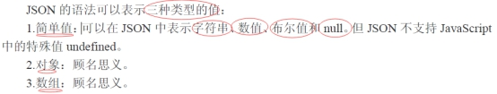

> PS：一般情况下，我们可以把JSON 结构数据保存到一个文本文件里，然后通过XMLHttpRequest 对象去加载它，得到这串结构数据字符串

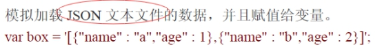

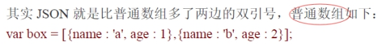

* 解析和序列化


* 新的ECMA对解析JSON的行为进行了规范

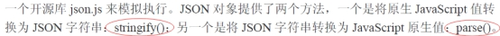

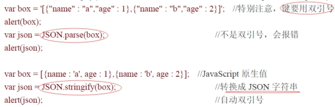

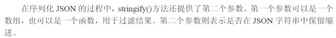

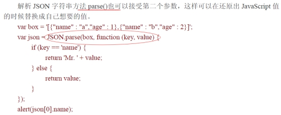

* Ajax基础知识：XMLHttpRequest对象（简称XHR）
* Ajax 技术核心是XMLHttpRequest 对象(简称XHR)，这是由微软首先引入的一个特性，其他浏览器提供商后来都提供了相同的实现。在XHR 出现之前，Ajax 式的通信必须借助一些hack 手段来实现，大多数是使用隐藏的框架或内嵌框架。虽然Ajax 中的x 代表的是XML，但Ajax 通信和数据格式无关，也就是说这种技术不
一定使用XML。

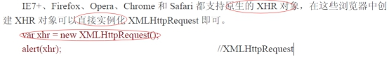

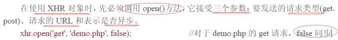

* 发送请求：

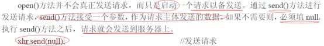

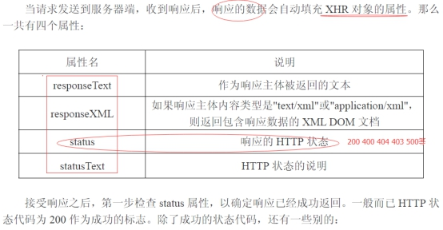

* 常见的状态吗：

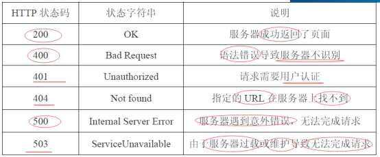

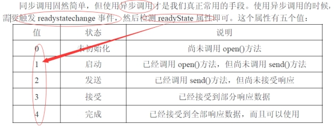

* 在Ajax使用的过程中，使用get的请求的情况会比post的情况要高

> PS：我们只可以获取服务器返回回来响应头信息，无法获取向服务器提交的请求头信息，自然自定义的请求头，在JavaScript 端是无法获取到的。

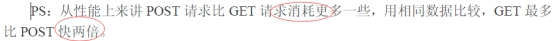

* Cookie与存储, 具有能够本地化存储的脚本功能。Cookie的意图是：在本地的客户端的磁盘上以很小的文件形式保存数据。

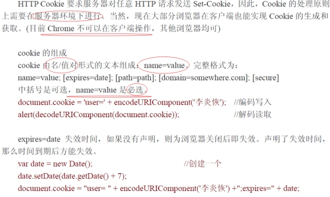

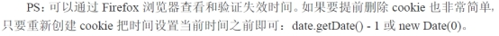

> Cookie的局限性  
> 第一：每个特定的域名下最多生成20 个cookie（根据不同的浏览器有所区别）  
> 第二：cookie 的最大大约为4096 字节(4k)，为了更好的兼容性，一般不能超过4095 字节即可。  
> 第三：cookie 存储在客户端的文本文件，所以特别重要和敏感的数据是不建议保存在cookie 的。比如银行卡号，用户密码等。
