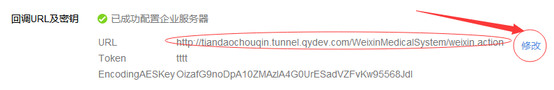

## 微信企业号启用“回调模式”过程

* 网页登陆微信企业号
* 修改java中的企业号ID，加密串、token相对应
* 在应用中开启回调模式，如下图：

* 其中的java文件中的四个参数：
msg_signature, timestamp, nonce, echostr的值会在开启回调模式，点击确定时候，在后台打印出来，而不是每次运行的时候打印出来！

> 注意：在修改token等关键值的过程中，会有一定的时间限制，比如说上次修改距离这次修改时间不能少于x分钟等等，使用的时候需要注意。
