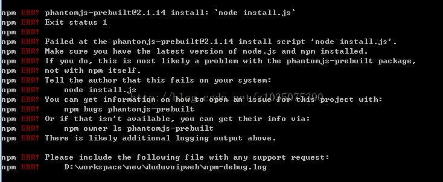
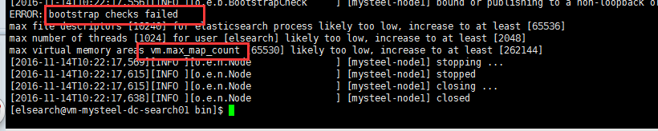

<!-- MarkdownTOC -->

- [搭建ELK+Kafka日志分析系统](#搭建ELK+Kafka日志分析系统)
    - [1.安装jdk](#1.安装jdk)
    - [2.安装elasticsearch](#2.安装elasticsearch)
    - [3.配置 配置文件](#置 配置文件)
    - [4.创建文件](#4.创建文件)
    - [5.进行集群部署](#5.进行集群部署)
        - [修改系统配置文件](#修改系统配置文件)
    - [6.启动Elasticsearch](#6.启动Elasticsearch)
    - [7.Elasticsearch健康插件安装（Head插件）](#7.Elasticsearch健康插件安装（Head插件）)
- [安装过程中常见错误及解决方法](#安装过程中常见错误及解决方法)
    - [错误1](#错误1)
    - [错误2](#错误2)
    - [错误3](#错误3)
    - [错误4](#错误4)
    - [错误5](#错误5)
    - [错误6](#错误6)

<!-- /MarkdownTOC -->

## 搭建ELK+Kafka日志分析系统

> 环境为Centos 7

#### 1.安装jdk

```
yum install java
```

查看java版本号 `java -version`

#### 2.安装elasticsearch
下载安装包：[elasticsearch-5.6.3.rpm](https://www.elastic.co/downloads/elasticsearch)

在 `/usr/soft/ELK-Kafka` 目录下进行安装：

```
rpm -ivh elasticsearch-5.6.3.rpm
```

#### 3.配置 配置文件
其中

```
discovery.zen.ping.unicast.hosts: ["192.168.100.241","192.168.100.242"]
```

配置了主节点（另外一个没有表现出来，先启动的是主节点，另外一个为数据节点，当前一个主节点挂机了，该节点才会顶上）

> 注意：其中 `XXX.XXX.XXX.XXX` 表示本机的ip地址！！！需要添加上！！！

配置 `/etc/elasticsearch` 目录下的 `elasticsearch.yml` 文件：

```
# # modified by Yongbo Wang

cluster.name: aitech-es-cluster
node.name: es-node-0
node.master: true
node.data: true
# index.number_of_shards: 8
# index.number_of_replicas: 5
path.data: /data/esdata1,/data/esdata2,/data/esdata3,/data/esdata4,/data/esdata5
#path.work: /data/work
path.logs: /data/eslogs
# bootstrap.mlockall: true
bootstrap.memory_lock: true
network.host: XXX.XXX.XXX.XXX
http.port: 9200
discovery.zen.ping.unicast.hosts: ["192.168.100.241","192.168.100.242"]
```

```
# elasticsearch-head config
http.cors.enabled: true
http.cors.allow-origin: "*"
```

#### 4.创建文件
然后创建下列文件 `makir XXX`

```
/data/esdata1,/data/esdata2,/data/esdata3,/data/esdata4,/data/esdata5
/data/eslogs
```

然后更改用户组（1、2、3、4、5个文件夹都要改！，下边只列出一组）

```
chown -R es /data/esdata1
chgrp -R es /data/esdata1
```

#### 5.进行集群部署
* 集群名称不修改，节点名称修改、将 `elasticsearch.yml` 复制到其他节点，并替换其配置文件。并关闭自动发现，防止其他外来节点连入。
* 然后将主节点的 `/usr/share/elasticsearch` 目录下的整个config文件夹分发到各个子节点：
* 然后修改config文件夹中的配置：将子节点的 `elasticsearch.yml` 文件中去掉最后两行，主节点的该文件中保留最后两行（设置了两个主节点）
* 关闭各个节点的防火墙：

```
systemctl stop firewalld
```

> 子节点的部署时，不用安装head插件!!!

* 分发方法：
使用xcall.sh脚本进行分发，编写 `/usr/local/sbin/xcall.sh`

```
#!/bin/bash
if [ $# -lt 1 ] ;then
echo no args
exit;
fi
echo ------xcall $arg1 from localhost ------
$@
echo
#get first argument
for (( i=1;i<5;i=i+1)) ;
do
echo ------xcall $arg1 from s$i ------;
ssh s$i $@
echo
done
```

##### 修改系统配置文件

* 1.切换到root用户，编辑limits.conf配置文件， 添加类似如下内容：

```
sudo vim /etc/security/limits.conf
```

添加如下内容:

```
* soft memlock unlimited
* hard memlock unlimited
```

> 备注：* 代表Linux所有用户名称
> 保存、退出、重新登录才可生效
> 临时取消限制
>
> ```
> ulimit -l unlimited
> ```

* 2.切换到root用户 `vim /etc/security/limits.conf`

   * 添加如下内容:

    ```
    * soft nofile 65536
    * hard nofile 131072
    * soft nproc 2048
    * hard nproc 4096
    ```

   * 修改 `vim /etc/security/limits.d/90-nproc.conf`, 修改如下内容：

    ```
    * soft nproc 4096
    #修改为
    * soft nproc 8192
    ```

   * 修改 `vim /etc/sysctl.conf`, 添加下面配置：

    ```
    vm.max_map_count=655360
    ```

   * 执行命令：

    ```
    sysctl -p
    ```

   * 然后，重新启动elasticsearch，即可启动成功。

#### 6.启动Elasticsearch

在启动之前需要先创建es用户：

```
groupadd es
useradd es -g es -p elasticsearch
```

es默认不适用root用户进行操作，需要将 `/usr/share/elasticsearch` 整个文件夹的用户和用户组更改为es用户：

```
chown -R es /usr/share/elasticsearch
chgrp -R es /usr/share/elasticsearch
```

执行下边命令：

```
/usr/share/elasticsearch/bin/elasticsearch
```

#### 7.Elasticsearch健康插件安装（Head插件）

> 只需要主节点安装即可！

elasticsearch-head是一个elasticsearch的集群管理工具，它是完全由html5编写的独立网页程序，你可以通过插件把它集成到es，其安装过程可以参考[博客](http://www.bubuko.com/infodetail-2165974.html)。

安装过程如下：

* 1.git下载软件包

```
yum -y install git
git clone git://github.com/mobz/elasticsearch-head.git
```

> 备注：安装包不要放到 `elasticsearch/plugins` 目录下

* 2.安装nodejs

    > 安装nodejs过程参考[博客](http://www.cnblogs.com/shhnwangjian/p/6559732.html)

   * 下载编译好的文件

    下载最新版本 `node-v8.9.0-linux-x64.tar.xz`，其余安装步骤参见（安装配置EventCoreference模块)

   * 淘宝镜像cnpm安装  `https://npm.taobao.org/`

    ```
    npm install -g cnpm --registry=https://registry.npm.taobao.org
    ln -s /usr/soft/node-v8.9.0-linux-x64/bin/cnpm /usr/local/bin/cnpm
    cnpm -v
    ```

   * 安装grunt

    执行下边的命令，全局安装bower和grunt-cli：

    ```
    yum install npm
    npm install -g yo bower grunt-cli gulp
    npm init   根据提示填入相关信息，
    npm install grunt
    ```

    安装完成后，添加索引后，如果直接执行grunt，会发现报错，应该在有Gruntfile.js文件的目录下执行

   * 修改Elasticsearch配置文件

    配置文件位置 `/usr/share/elasticsearch/config/elasticsearch.yml` ，`/etc/elasticsearch/` 下边的没用，事先需要将etc下边的配置文件复制到usr下边对应的目录下

    ```
    http.cors.enabled: true
    http.cors.allow-origin: "*"
    ```

   * 修改Gruntfile.js

    > 其位置在之前下载的elasticsearch-head文件夹下边

    在这里下载[地址](https://github.com/mobz/elasticsearch-head)

    ```
    elasticsearch-head/Gruntfile.js
                    connect: {
                            server: {
                                    options: {
                                            hostname: '0.0.0.0',
                                            port: 9100,
                                            base: ‘.‘,
                                            keepalive: true
                                    }
                            }
                    }
    ```

    增加hostname属性，设置为 `0.0.0.0`

   * 修改app.js

    ```
    elasticsearch-head/_site/app.js
    this.base_uri = this.config.base_uri || this.prefs.get("app-base_uri") || "http://192.168.100.241:9200";
    ```

    把localhost修改成ES的服务器地址，如上面 `192.168.100.241`

   * 运行head

    进入elasticsearch-head 目录（ `x.x.xx` 为版本号）

    ```
    /usr/soft/node-v8.9.0-linux-x64/bin/npm install phantomjs-prebuilt@2.1.16 --ignore-scripts
    npm install
    ```

   * 启动elasticsearch-head

    在 `/usr/soft/elasticsearch-head-master` 目录下执行

    ```
    grunt server
    ```

    > 发现报错：提示没有grunt命令
    > 解决方案：
    >
    > ```
    > npm init   根据提示填入相关信息，
    > npm install grunt
    > ```

    后台启动

    ```
    nohup grunt server &
    ```

    如果想关闭head插件，查找进程命令：

    ```
    ps aux|grep head
    ```

   * x-pack安全模块(security机制)

      * 1.修改Elasticsearch配置文件

        ```
        /etc/elasticsearch/elasticsearch.yml
        http.cors.allow-headers: Authorization
        ```

      * 2.页面访问

        ```
        http://192.168.100.241:9100/?auth_user=elastic&auth_password=changeme
        ```

        页面访问： `http://192.168.100.241:9100`


## 安装过程中常见错误及解决方法

#### 错误1

```
Exception in thread "main" java.lang.RuntimeException: don't run elasticsearch as root.
```

解决方案：创建es用户

```
groupadd es
useradd es -g es -p elasticsearch
```

es默认不适用root用户进行操作，需要将 `/usr/share/elasticsearch` 整个文件夹的用户和用户组更改为es用户：

```
chown -R es /usr/share/elasticsearch
chgrp -R es /usr/share/elasticsearch
```

#### 错误2

在执行 `npm install` 时出现一下错误

```
phantomjs-prebuilt@2.1.14 安装失败
```



解决方案：执行下边命令

```
npm install phantomjs-prebuilt@2.1.14 --ignore-scripts
npm install
```

#### 错误3

```
Caused by: java.lang.IllegalArgumentException: Property [elasticsearch.version] is missing for plugin [head]
```

解决方案：
5.x中，elasticsearch-head
* 不能放在elasticsearch的 plugins、modules 目录下
* 不能使用 `elasticsearch-plugin install`
直接启动elasticsearch即可

安装 elasticsearch-head
* 修改 `elasticsearch/config/elasticsearch.yml` ，添加：

```
http.cors.enabled: true
http.cors.allow-origin: "*"
```

* 下载 elasticsearch-head 或者 git clone 到随便一个文件夹
* 安装nodejs
* 执行

```
cd /path/to/elasticsearch-head
npm install -g grunt-cli
npm install
grunt server
http://localhost:9100/
```

#### 错误4

```
ERROR: bootstrap checks failed
```



解决方案：切换到root用户

```
vim /etc/security/limits.conf
```

添加如下内容:

```
* soft nofile 65536
* hard nofile 131072
* soft nproc 2048
* hard nproc 4096
```

修改 `vim /etc/security/limits.d/90-nproc.conf`, 修改如下内容：

```
* soft nproc 4096
#修改为
* soft nproc 8192
```

修改 `vim /etc/sysctl.conf` , 添加下面配置：

```
vm.max_map_count=655360
```

并执行命令：

```
sysctl -p
```

然后，重新启动elasticsearch，即可启动成功。

#### 错误5

```
ERROR: bootstrap checks failed
memory locking requested for elasticsearch process but memory is not locked
```

> 原因：锁定内存失败

解决方案：切换到root用户，编辑 `limits.conf` 配置文件，添加类似如下内容：

```
sudo vim /etc/security/limits.conf
```

添加如下内容:

```
* soft memlock unlimited
* hard memlock unlimited
```

> 备注：* 代表Linux所有用户名称
> 保存、退出、重新登录才可生效

临时取消限制

```
ulimit -l unlimited
```

#### 错误6

```
ERROR: bootstrap checks failed
max file descriptors [4096] for elasticsearch process is too low, increase to at least [65536]
```

> 原因：无法创建本地文件问题,用户最大可创建文件数太小

解决方案：切换到root用户，编辑limits.conf配置文件， 添加类似如下内容：

```
sudo vim /etc/security/limits.conf
```

添加如下内容:

```
* soft nofile 65536
* hard nofile 131072
```

> 备注：* 代表Linux所有用户名称
> 保存、退出、重新登录才可生效

> 其他操作：
>
> ```
> 卸载rpm安装的包   rpm -e <包的名字> 删除特定rpm包
> 查询rpm已经安装的包   rpm -q <关键字> 可以查询到rpm包的名字
> 如果无法删除，使用   rpm -e --nodeps <包的名字> 不检查依赖，直接删除rpm包
> 如果恰好有多个包叫同样的名字，使用 rpm -e --allmatches --nodeps <包的名字> 删除所有相同名字的包， 并忽略依赖
> ```


> * 1.使用rpm安装logstash和kibana（前后顺序，有依赖） ==> 只需要在一台上边安装即可
> 先下载安装包，然后使用命令：
>
> ```
> rpm -ivh XXXXXX.rpm
> ```
>
> * 2.启动kibana ==> 只需要在一台上边安装即可
> rpm安装后的程序在 `/usr/share/kibana` 目录下，配置文件在 `/etc/kibana` 目录下
> 修改配置文件 `/etc/kibana/kibana.yml`
> 修改其中的：（将localhost修改为ip）
>
> ```
> server.host: "XXX.XXX.XXX.XXX"
> elasticsearch.url: "http://XXX.XXX.XXX.XXX:9200"
> ```
>
> * 3.体验
>    * 在浏览器输入： `http://localhost:5601`
>    * 然后点击 `Dev Tools`
>    * 然后输入 `GET _cluster/health`
