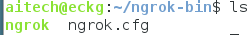

## 使用ngrok开启项目的代理服务

使用ngrok开启上边几个项目的代理服务：（进入ngrok-bin文件夹，在~目录下）

该文件夹中有如下文件：



其中ngrok为在本地搭建ngrok服务的时候生成的文件，ngrok.cfg文件只配置文件，内容如下：

```
server_addr: "tunnel.project1.cn:4443"
trust_host_root_certs: false
```

用来关闭证书服务

```
./ngrok -config ngrok.cfg -subdomain nlp-demo 8080      将RDF-Demo映射开启
./ngrok -config ngrok.cfg -subdomain zh 8093      将project1的映射开启
```

> 我自己电脑上需要开启的服务是：zh、neo4j

中文project1的地址是： `http://zh.tunnel.project1.cn`
RDF-Demo的地址是： `http://nlp-demo.tunnel.project1.cn`
