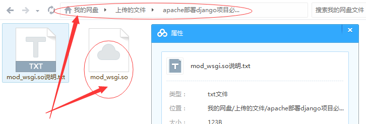

## Apache部署Django项目

#### 部署过程

* 1.安装wampserver和mysql
在安装完wampserver之后，不用另外安装mysql数据库，因为其中自带mysql数据库，使用navicat连接wampserver的mysql数据库的时候，将连接的地址设置为 `127.0.0.1` ，不要使用localhost，否则会失败！

* 2.将wampserver切换到在线状态

* 3.在目录 `C:\wamp\bin\apache\apache2.4.9\conf` 下配置 `httpd.conf` 文件：
   * ①在第62、63行：

    ```
    Listen 0.0.0.0:80
    Listen [::0]:80
    ```

   * ②在第221行：

    ```
    ServerName localhost:80
    ```

   * ③在第240-243行：

    ```
    <Directory />
        #AllowOverride none
        Require all granted
    </Directory>
    ```

   * ④在第513行：

    ```
    Include conf/extra/httpd-vhosts.conf
    ```

   * ⑤在该文件最末尾添加以下代码：

    ```
    # start here:
        #add mod_wsgi.so module
        LoadModule wsgi_module modules/mod_wsgi.so

        #assign myweb's wsgi.py path
        WSGIScriptAlias / C:/Django_project/aitechWeixin/aitechWeixin/wsgi.py

        WSGIPythonHome "C:/Python27"

        Alias /static C:/Django_project/aitechWeixin/static/
        <Directory C:/Django_project/aitechWeixin/static/>
            Require all granted
        </Directory>

        #assign project path
        WSGIPythonPath C:/Django_project/aitechWeixin
        #WSGIPythonPath C:/wamp/bin/apache/apache2.4.18/htdocs/aitechWeixin

        <Directory C:/Django_project/aitechWeixin/aitechWeixin>
        <Files wsgi.py>
            Require all granted
        </Files>
        </Directory>
    ```

* 4.在目录 `C:\wamp\bin\apache\apache2.4.9\conf\extra` 下配置 `httpd-vhosts.conf` 文件：

```
<VirtualHost *:80>
    ServerName mobile.demo.com
    ServerAlias www.demo.com

    Alias /static/ C:/Django_project/aitechWeixin/static/

	<Directory C:/Django_project/aitechWeixin/static/>
		Require all granted
	</Directory>
    
    DocumentRoot C:/Django_project/aitechWeixin
    <Directory  "C:/Django_project/aitechWeixin">
        Options +Indexes +FollowSymLinks +MultiViews
        AllowOverride All
        Require all granted
    </Directory>
</VirtualHost>
```

* 5.将 `mod_wsgi.so` 文件放置于 `C:\wamp\bin\apache\apache2.4.9\modules` 目录下

> 注意： `mod_wsgi.so` 文件的版本要和apache的版本相兼容，将已经部署好的 `mod_wsgi.so` 文件上传至百度云目录下



文件[下载](file/mod_wsgi.so)

文件说明：  
该文件只用于 `wampserver veision 2.5`      （在C:/wamp文件夹下查看.ini文件可以查看信息）  
该文件适用于 apache2.4.8和apache2.4.9

* 6.对Django项目进行下列配置：
   * 1.修改项目中的：需要修改weixinAPI中的utils和views文件（注意：还有views中几个参数的修改），和微信配置网页上的
      * ①连接地址
      * ②网页授权回调地址
      * ③修改 `httpd.conf` 文件的最底部
      * ④修改 `settings.py` 文件，将DEBUG改为False，添加一行

        ```
        ALLOWED_HOSTS = ['127.0.0.1', 'localhost']
        ```

   * 2.新上传的本地aitechWeixin项目需要修改：（才能作为生产环境）
    
	> 首先备份正在运行的项目和数据库各一份，记录部署过程中产生的Bug

      * ①检查所有文件的print中不能含有中文
      * ②修改 `weixinAPI.py` 文件中，菜单createMenu函数中的链接为域名
      * ③修改 `weixinAPI.py` 文件中， `WECHAT_TOKEN，APP_ID，APP_SECRET` 等服务号基本信息配置
      * ④修改 `utils.py` 文件中的域名链接
      * ⑤修改 `settings.py` 文件，将DEBUG改为False，添加一行

        ```
        ALLOWED_HOSTS = ['127.0.0.1', 'localhost']
        ```

	> 注意：在DEBUG为True时，必须指定可运行的主机 `ALLOWED_HOSTS`

      * ⑥根据需要运行 `www.demo.com/GetStockList` 获取最新股票列表和首字母于数据库中
      * ⑦运行 `www.demo.com/createMenu` 更新公众号菜单

* 7.然后重启wampserver服务，进行访问


#### 服务器同步文件

在服务器部署项目步骤如下

* 1.创建项目

```
django-admin.py startproject aitechWeixin
```

* 2.进入项目目录

```
cd aitechWeixin
```

* 3.创建app

```
django-admin.py startapp weixinAPI
django-admin.py startapp userCenter
```

* 4.进行数据库同步
   * 先进入指定目录
	
	```
	C:\Django_project\aitechWeixin
	```

   * 先执行

	```
	manage.py makemigrations
	```

   * 后执行

	```
	manage.py migrate
	```

* 5.开启服务器

```
python manage.py runserver 0.0.0.0:8000
python manage.py runserver 0.0.0.0:8090
```

* 6.修改weixinAPI中的utils和views文件

	> 注意：还有views中几个参数的修改，和微信配置网页上的

   * ①连接地址
   * ②网页授权回调地址
   * ③修改 `httpd.conf` 文件的最底部
   * ④修改 `settings.py` 文件，将DEBUG改为False，添加一行

	```
	ALLOWED_HOSTS = ['127.0.0.1', 'localhost']
	```

* 7.在apache的 `httpd.conf` 文件里添加：

```
<Directory />
#    AllowOverride none
#    Require all denied
    Options FollowSymLinks
    AllowOverride None
    Order deny,allow
    Allow from all
    Satisfy all
</Directory>
```

* 8.在域名管理系统里配置域名解析，将域名和ip地址绑定起来
* 9.将wamp设置为在线模式
* 10.还需要在 `httpd-vhosts.conf` 中设置

```
	<VirtualHost *:80>
		ServerName localhost
		DocumentRoot c:/wamp/www
		<Directory  "c:/wamp/www/">
			Options +Indexes +FollowSymLinks +MultiViews
			AllowOverride All
			Require all granted
		</Directory>
	</VirtualHost>
```

* 11.对于static的配置
在 `httpd-vhosts.conf` 中增加一句：

```
Alias /static/ C:/Django_project/aitechWeixin/static/指定静态文件的路径
```

完整的配置如下所示：

```
<VirtualHost *:80>
	ServerName mobile.demo.com
	ServerAlias www.demo.com

	Alias /static/ C:/Django_project/aitechWeixin/static/
	
	DocumentRoot C:/Django_project/aitechWeixin
	<Directory  "C:/Django_project/aitechWeixin">
		Options +Indexes +FollowSymLinks +MultiViews
		AllowOverride All
		Require all granted
	</Directory>
</VirtualHost>
```
