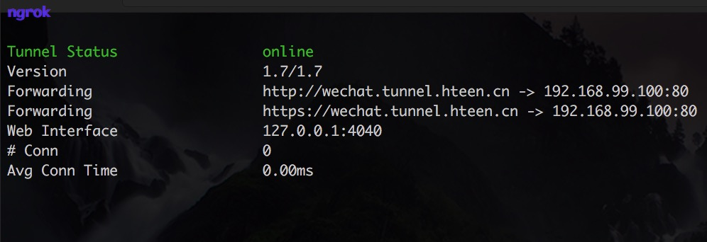

## 搭建本地ngrok服务

参考[博客1](https://hteen.cn/docker/docker-ngrok.html)和[博客2](http://www.runoob.com/docker/docker-install-nginx.html)

首先下载[ngrok](https://github.com/hteen/docker-ngrok)

* 准备工作
   * 公网服务器一台并且安装docker,我用的阿里云Centos7.3
   * 域名一枚,本文使用 `tunnel.chaorder.cn` 做Ngrok服务器域名
   * `hteen/ngrok` Docker镜像
* 拉取镜像（在 `/usr/soft` 目录下）

```
docker pull hteen/ngrok
```

启动一个容器生成ngrok客户端,服务器端和CA证书（在本地新建 `/data/ngrok` 文件夹）

```
docker run --rm -it -e DOMAIN="tunnel.chaorder.cn" -v /data/ngrok:/myfiles hteen/ngrok /bin/bash /build.sh
```

挂载宿主机目录/data/ngrok到容器内/myfiles目录 ,之后当看到build ok !的时候就成功了！  
生成了我们要的客户端和服务端在/data/ngrok/bin目录下,包括

| 目录 | 功能 |
| ------ | ------ |
| bin/ngrokd | 服务端 |
| bin/ngrok | linux客户端 |
| bin/darwin_amd64/ngrok | osx客户端 |
| bin/windows_amd64/ngrok.exe | windows客户端 |


* 启动 `Ngrok server`  
直接挂载刚刚的 `/data/ngrok` 到容器即可启动服务，执行

```
docker run -idt --name ngrok-server -v /data/ngrok:/myfiles -p 80:80 -p 443:443 -p 4443:4443 -e DOMAIN='tunnel.hteen.cn' hteen/ngrok /bin/bash /server.sh
```

这样我们就启动了一个ngrok服务端程序

* 域名解析  
这里我们需要添加两条A记录到阿里云服务器, 


这样我们才能将 `tunnel.hteen.cn` 和 `*.tunnel.hteen.cn` DNS解析到我们的服务器

* 客户端连接  
下载我们生成的客户端,我这里以osx为例,其他平台一样
首先创建一个ngrok.cfg配置文件

```
server_addr: "tunnel.hteen.cn:4443"
trust_host_root_certs: false
```

然后在命令行执行

```
./ngrok -config ./ngrok.cfg -subdomain zh 192.168.99.100:8080
```

我这里是将 `zh.tunnel.hteen.cn` 绑定的本地 `192.168.99.100:8080`  
如果不指定-subdomain参数,每次启动客户端的时候会随机分配一个域名,随意并不方便

成功连接效果



* Nginx + Docker + Ngrok

由于ngrok默认使用80和443端口,我服务器已经运行了Nginx服务 ,
所以我这里启动Ngrok Server的时候并不是绑定的80和443端口,而是绑定的8082和4432，执行

```
docker run -idt --name ngrok-server -v /data/ngrok:/myfiles -p 8082:80 -p 4432:443 -p 4443:4443 -e DOMAIN='tunnel.hteen.cn' hteen/ngrok /bin/bash /server.sh
```

启动之后需要在nginx.conf 添加两条反向代理配置

```
server {
     listen       80;
     server_name  tunnel.hteen.cn *.tunnel.hteen.cn;
     location / {
             proxy_redirect off;
             proxy_set_header Host $host;
             proxy_set_header X-Real-IP $remote_addr;
             proxy_set_header X-Forwarded-For $proxy_add_x_forwarded_for;
             proxy_pass http://阿里云内网IP:8082;
     }
 }
 server {
     listen       443;
     server_name  tunnel.hteen.cn *.tunnel.hteen.cn;
     location / {
             proxy_redirect off;
             proxy_set_header Host $host;
             proxy_set_header X-Real-IP $remote_addr;
             proxy_set_header X-Forwarded-For $proxy_add_x_forwarded_for;
             proxy_pass http://阿里云内网IP:4432;
     }
 }
```
