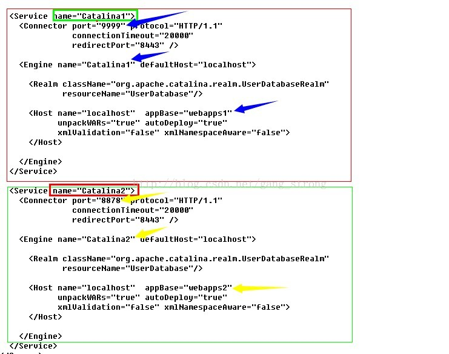
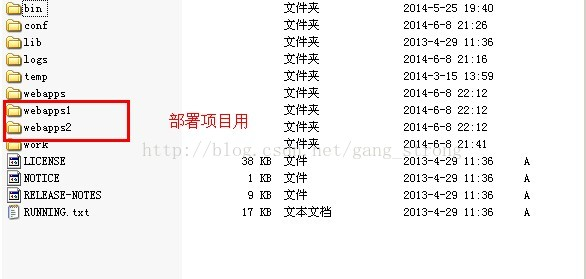
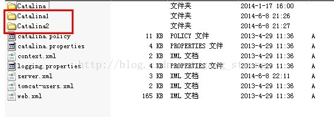

## Tomcat安装配置

* 1.下载压缩包解压，进入 `/usr/soft/apache-tomcat-7.0.78/bin` 目录，编辑startup.sh文件，在该文件中添加jdk和jre环境变量（事先打印下 `echo $JAVA_HOME` 和 `java -version` ，再考虑要不要配置下边的java环境变量）

```
JAVA_HOME=/usr/soft/jdk1.8.0_20
JRE_HOME=$JAVA_HOME/jre
PATH=$PATH:$JAVA_HOME/bin:$JRE_HOME
CLASSPATH=.:$JRE_HOME/lib/rt.jar:$JAVA_HOME/lib/dt.jar:$JAVA_HOME/lib/tools.jar
TOMCAT_HOME=/usr/soft/apache-tomcat-8.0.12
```

然后，执行

```
sudo /usr/soft/apache-tomcat-7.0.78/bin/startup.sh          开启Tomcat
sudo /usr/soft/apache-tomcat-7.0.78/bin/shutdown.sh      关闭Tomcat
```

在浏览器输入 `localhost:8080` 查看tomcat的启动情况

* 2.部署RDF-Demo到Tomcat
参考[blog](http://blog.csdn.net/dy898850285/article/details/60134798), 同一个Tomcat不同端口部署不同项目

   * 第一步：修改tomcat下的server.xml文件

配置service 节点，个人认为有几个项目，就相应的配置几个service 节点；

配置了两个端口号：分别为9999和8878



   * 第二步：先依照此配置文件配置，完成后在tomcat根目录下复制文件夹webapps，粘贴重命名为webapps1，webapps2，如下图：此文件夹就是分别用来部署项目的。



   * 第三步：在tomcat根目录下的conf文件中，复制conf文件夹下的Catalina文件夹，粘贴并重命名为Catalina1，Catalina2，如图：



配置完成，现在可以把项目分别部署到配置好的两个文件夹webapps1和webapps2中；

启动tomcat，分别用不同的端口号测试；

```
127.0.0.1:9999/项目名
```

注意：在访问的时候，地址后边需要加上项目名！！！

```
127.0.0.1:8878/项目名
```

service.xml文件配置：（增加下边service到相应位置）

> 其中Catalina部署RDF-Demo项目，端口是8080，Catalina1部署projrct1项目，端口是8093

```
<Service name="Catalina">
  <Connector port="8080" protocol="HTTP/1.1"
                 connectionTimeout="20000"
                 redirectPort="8443" />
  <Connector port="8009" protocol="AJP/1.3" redirectPort="8443" />
  <Engine name="Catalina" defaultHost="localhost">
    <Realm className="org.apache.catalina.realm.LockOutRealm">
    <Realm className="org.apache.catalina.realm.UserDatabaseRealm"
                   resourceName="UserDatabase"/>
          </Realm>
    <Host name="localhost"  appBase="webapps"
          unpackWARs="true" autoDeploy="true">
      <Valve className="org.apache.catalina.valves.AccessLogValve" directory="logs"
                     prefix="localhost_access_log." suffix=".txt"
                     pattern="%h %l %u %t &quot;%r&quot; %s %b" />
    </Host>
  </Engine>
</Service>

<Service name="Catalina1">
  <Connector port="8093" protocol="HTTP/1.1"
                 connectionTimeout="20000"
                 redirectPort="8443" />
  <Connector port="8009" protocol="AJP/1.3" redirectPort="8443" />
  <Engine name="Catalina1" defaultHost="localhost">
    <Realm className="org.apache.catalina.realm.LockOutRealm">
    <Realm className="org.apache.catalina.realm.UserDatabaseRealm"
                   resourceName="UserDatabase"/>
          </Realm>
    <Host name="localhost"  appBase="webapps1"
          unpackWARs="true" autoDeploy="true">
      <Valve className="org.apache.catalina.valves.AccessLogValve" directory="logs"
                     prefix="localhost_access_log." suffix=".txt"
                     pattern="%h %l %u %t &quot;%r&quot; %s %b" />
    </Host>
  </Engine>
</Service>
```

> 注意：其中1中是projrct1，0中是projrct2
