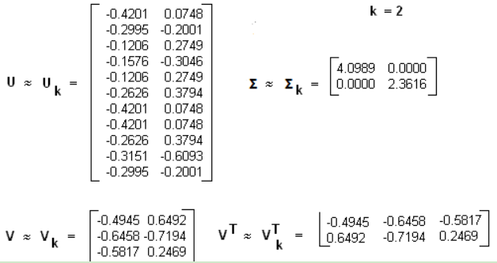

# 信息检索

## 文本检索基础

输入一个query，返回排序好的结果列表


 - 收集隐式反馈：点击决策、停留时间
 - 排序模型可以使用各种各样的输入特征：
    - 读者数量（流行程度）
    - 传入链接的数量
    - 或者根据垃圾邮件分类器判断该文章是否有问题
    - 其它的特征依赖于查询语句和文档内容的匹配
        - 传入的超链接锚点参考的文本，因为锚点和点击问题是对文档的简洁描述（不易得到）
        - 导致点击这篇文本的用户，以前的查询语句
    - 基于文档本身所含内容


短文本或者段落倾向于针对一个主题


**语义理解：**

 - 传统的方法使用query词在文档中的重复次数来建模，在问题和文本之间进行EM匹配，不同的权重和标准的模式使用这个重复次数建立了各种各样的TF-IDF模型，
 比如BM25,但是这样就忽视了剩下的相关的文本，有时候问题中的词和想要搜寻的答案之间并没有匹配的词
 - 有些时候有罕见词时，采用直接匹配的效果可能胜过语义查询的效果，比如词“魑魅魍魉”
 - 因此如何权衡语义理解进而查询和直接匹配查询是关键点


**对罕见输入的鲁棒性：**

70%的问题仅仅出现一次，50%的文档仅仅被点击过一次

 - BM25算法可以很好地检索包含罕见词的文档
 

**对语料方差的鲁棒性**


## 主题建模
**一般概念：**
 - 在文档层面，理解文本最有效的方式之一就是分析其主题
 - 在文档集合中学习、识别和提取这些主题的过程被称为主题建模
 - 主题模型也是非监督的算法
 - 主要技术有LSA、pLSA、LDA、lda2vec
 - 所有主题模型都基于相同的基本假设：
    - 每个文档包含多个主题；
    - 每个主题包含多个单词。
 - 主题模型围绕着以下观点构建：
    - 实际上，文档的语义由一些我们所忽视的隐变量或「潜」变量管理。
    - 因此，主题建模的目标就是揭示这些潜在变量（也就是主题），正是它们塑造了我们文档和语料库的含义。

#### 潜在语义分析（LSA/LSI）

参考博客：
 - [文本主题模型之潜在语义索引(LSI)](https://www.cnblogs.com/pinard/p/6805861.html)

**一般概念：**
 - 潜在语义分析（LSA）是主题建模的基础技术之一。
 - LSA/LSI是基于奇异值分解（SVD）的方法来得到文本的主题的。
 - 其核心思想是把我们所拥有的文档-术语矩阵分解成相互独立的**文档-主题矩阵**和**主题-术语矩阵**。
 - 主题模型也是非监督的算法，目的是得到文本按照主题的概率分布
 - LDA和普通聚类算法的区别：
    - 聚类算法关注于从样本特征的相似度方面将数据聚类。比如通过数据样本之间的欧式距离，曼哈顿距离的大小聚类等。
    - 而主题模型，顾名思义，就是对文字中隐含主题的一种建模方法。比如从“人民的名义”和“达康书记”这两个词我们很容易发现对应的文本有很大的主题相关度，但是如果通过词特征来聚类的话则很难找出，因为聚类方法不能考虑到到隐含的主题这一块。
 - 那么如何找到隐含的主题呢？
    - 常用的方法一般都是基于统计学的生成方法。即假设以一定的概率选择了一个主题，然后以一定的概率选择当前主题的词。最后这些词组成了我们当前的文本。
    - 所有词的统计概率分布可以从语料库获得，具体如何以“一定的概率选择”，这就是各种具体的主题模型算法的任务了。
　　　- 当然还有一些不是基于统计的方法，比如LSI
 - 潜在语义索引(Latent Semantic Indexing, LSI)，有的也叫Latent Semantic Analysis (LSA)

**LSA:**
 - 第一步是生成文档-术语矩阵。可以构造一个`m×n`的矩阵A，其中每行代表一个文档，每列代表一个单词。
 - 在LSA的最简单版本中，每一个条目可以简单地是第j个单词在第i个文档中出现次数的原始计数。
     - 然而，原始计数的效果不是很好，无法考虑文档中每个词的权重。
     - 因此，LSA模型通常用tf-idf得分代替文档-术语矩阵中的原始计数。为文档i中的术语j分配了相应的权重
     - 术语出现在文档中的频率越高，同时，术语在语料库中出现的频率越低，其权重越大。
 - 一旦拥有文档-术语矩阵A，我们就可以开始思考潜在主题，但是，A极有可能非常稀疏、噪声很大，并且在很多维度上非常冗余。因此，为了找出能够捕捉单词和文档关系的少数潜在主题，我们希望能降低矩阵A的维度。
 - 这种降维可以使用截断SVD（即奇异值分解）来执行。
     
     

     ```
     该技术将任意矩阵M分解为三个独立矩阵的乘积：
    
     `M=U*S*V`，
    
     其中S是矩阵M奇异值的对角矩阵。
     截断SVD的降维方式是：
         - 选择奇异值中最大的t个数，且只保留矩阵U和V的前t列。
         - 在这种情况下，t是一个超参数，我们可以根据想要查找的主题数量进行选择和调整。
    
     A = U_t * S_t * V_{t}^T
     截断SVD可以看作只保留我们变换空间中最重要的t维。
    
     A = (文档-主题矩阵) * S_t * (术语-主题矩阵)^T
    
     在这种情况下:
         - U ∈ ℝ^(m ⨉ t) 是文档-主题矩阵
         - V ∈ ℝ^(n ⨉ t) 是术语-主题矩阵，进行了转置
         - 在矩阵U和V中，每一列对应于我们t个主题当中的一个
         - 在U中，行表示按主题表达的文档向量；在V中，行代表按主题表达的术语向量。
     ```
 - 而`A_{ij}`则对应第i个文本的第j个词的特征值，这里最常用的是**基于预处理后的标准化TF-IDF值**。
 - 通过这些文档向量和术语向量，现在可以应用余弦相似度等度量来评估以下指标：
    - 不同文档的相似度
    - 不同单词的相似度
    - **术语（或「queries」）与文档的相似度**（当我们想要检索与查询最相关的段落，即进行信息检索时，这一点将非常有用）
 - LSA优缺点：
    - 优点：快速且高效
    - 缺点：
        - 缺乏可解释的嵌入（我们并不知道主题是什么，其成分可能积极或消极，这一点是随机的）
        - 需要大量的文件和词汇来获得准确的结果
        - 表征效率低
 - ------------------------------- 分割线 -------------------------------
 - 简单的LSI实例，假设我们有下面这个有11个词三个文本的词频TF对应矩阵如下：
 
     
    
    - 这里我们没有使用预处理，也没有使用TF-IDF，在实际应用中最好使用预处理后的TF-IDF值矩阵作为输入
    - 假定对应的主题数为2，则通过SVD降维后得到的三矩阵为:
    
        
        
        其中，`U_k`表示主题-术语矩阵，`V_k`表示主题-文档矩阵。
    - 可以看到里面有负数，所以这样得到的相关度比较难解释。需要把文档-术语的词频矩阵替换掉，使用TF-IDF来代替。
    - 在上面我们通过LSI得到的**文档-主题矩阵可以用于文本相似度计算**
    
        ```
        而计算方法一般是通过余弦相似度。比如对于上面的三文档两主题的例子。我们可以计算第一个文本和第二个文本的余弦相似度如下:
        ```
        
        
 - LSA/LSI总结：
    - LSI是最早出现的主题模型了，它的算法原理很简单，一次奇异值分解就可以得到主题模型，同时解决词义的问题，非常漂亮。但是LSI有很多不足，导致它在当前实际的主题模型中已基本不再使用。
    - 主要的问题有：
        - 1）SVD计算非常的耗时，尤其是文本处理，词和文本数都是非常大的，对于这样的高维度矩阵做奇异值分解是非常难的。
        - 2）主题值的选取对结果的影响非常大，很难选择合适的k值。
        - 3）LSI得到的不是一个概率模型，缺乏统计基础，结果难以直观的解释。
    - 解决方案：
        - 对于问题1），主题模型非负矩阵分解（NMF）可以解决矩阵分解的速度问题。
        - 对于问题2），这是老大难了，大部分主题模型的主题的个数选取一般都是凭经验的，较新的层次狄利克雷过程（HDP）可以自动选择主题个数。
        - 对于问题3），pLSI(也叫pLSA)和隐含狄利克雷分布(LDA)这类基于概率分布的主题模型来替代基于矩阵分解的主题模型。
    - 回到LSI本身，对于一些规模较小的问题，如果想快速粗粒度的找出一些主题分布的关系，则LSI是比较好的一个选择，其他时候，如果你需要使用主题模型，推荐使用LDA和HDP


**代码实现：**
```
from sklearn.feature_extraction.text import TfidfVectorizer
from sklearn.decomposition import TruncatedSVD
from sklearn.pipeline import Pipeline
documents = ["doc1.txt", "doc2.txt", "doc3.txt"] 

# raw documents to tf-idf matrix: 
vectorizer = TfidfVectorizer(stop_words='english', 
                             use_idf=True, 
                             smooth_idf=True)
# SVD to reduce dimensionality: 
svd_model = TruncatedSVD(n_components=100,         // num dimensions
                         algorithm='randomized',
                         n_iter=10)
# pipeline of tf-idf + SVD, fit to and applied to documents:
svd_transformer = Pipeline([('tfidf', vectorizer), 
                            ('svd', svd_model)])
svd_matrix = svd_transformer.fit_transform(documents)

# svd_matrix can later be used to compare documents, compare words, or compare queries with documents
```


#### 概率潜在语义分析（PLSA）
**一般概念：**
 - pLSA，即概率潜在语义分析，**采取概率方法替代SVD**以解决问题
 - 其核心思想是**找到一个潜在主题的概率模型**，该模型可以生成我们在文档-术语矩阵中观察到的数据。
 - 特别地，我们需要一个模型`P(D,W)`，使得对于任何文档d和单词w，`P(d,w)`能对应于文档-术语矩阵中的那个条目。
 - 主题模型的基本假设：每个文档由多个主题组成，每个主题由多个单词组成。PLSA为这些假设增加了概率：
    - 给定文档d，主题z以`P(z|d)`的概率出现在该文档d中
    - 给定主题z，单词w以`P(w|z)`的概率从主题z中提取出来    
    
    
    - 从形式上看，一个给定的文档和单词同时出现的联合概率是：
        ```
        P(D,W) = P(D) sum_{Z} P(Z|D) P(W|Z)
        ```
        - 等式右边告诉我们理解某个文档的可能性有多大；然后根据该文档主题的分布情况，在该文档中找到某个单词的可能性有多大
        - 在这种情况下，`P(D)`、`P(Z|D)`、和`P(W|Z)`是我们模型的参数。`P(D)`可以直接由我们的语料库确定。`P(Z|D)`和`P(W|Z)`利用了多项式分布建模，
        并且可以使用期望最大化算法（EM）进行训练。EM无需进行算法的完整数学处理，而是一种基于未观测潜变量（此处指主题）的模型找到最可能的参数估值的方法。
        - `P(D,W)`可以利用不同的的3个参数等效地进行参数化：
            ```
            P(D,W) = sum_{Z} P(Z) P(D|Z) P(W|Z)
            ```
            
            
            - 可以通过将模型看作一个生成过程来理解这种等价性。
            - 在第一个参数化过程中，我们从概率为`P(d)`的文档开始，然后用`P(z|d)`生成主题，最后用`P(w|z)`生成单词。而在上述这个参数化过程中，
            我们从`P(z)`开始，再用`P(d|z)`和`P(w|z)`单独生成文档。
            - 可以发现pLSA模型和LSA模型之间存在一个直接的平行对应关系
            
            
            
            主题`P(Z)`的概率对应于奇异主题概率的对角矩阵，给定主题`P(D|Z)`的文档概率对应于文档-主题矩阵U，给定主题`P(W|Z)`的单词概率对应于术语-主题矩阵V
 - 尽管pLSA看起来与LSA差异很大、且处理问题的方法完全不同，但实际上pLSA只是在LSA的基础上**添加了对主题和词汇的概率处理**罢了。
 - pLSA是一个更加灵活的模型，但仍然存在一些问题，尤其表现为：
    - 因为我们没有参数来给`P(D)`建模，所以不知道如何为新文档分配概率
    - pLSA的参数数量随着我们拥有的文档数线性增长，因此容易出现过度拟合问题
    - 很少会单独使用pLSA。一般来说，当人们在寻找超出LSA基准性能的主题模型时，他们会转而使用LDA模型。LDA是最常见的主题模型，它在pLSA的基础上进行了扩展，从而解决这些问题。


#### 潜在狄利克雷分布（LDA）
**一般概念：**
 - LDA即潜在狄利克雷分布，是pLSA的贝叶斯版本
 - 它使用狄利克雷先验来处理文档-主题和单词-主题分布，从而有助于更好地泛化。
 - 数学概念：
    - Beta分布是二项分布的共轭先验概率分布
    - Dirichlet分布是多项式分布的共轭先验概率分布
    - 先验分布π(θ) + 样本信息x ⇒ 后验分布 π(θ∣x)
    
        ```
        上述思考模式意味着，新观察到的样本信息将修正人们以前对事物的认知。换言之，在得到新的样本信息之前，人们对θ的认知是先验分布π(θ)，在得到新的样本信息X后，人们对的认知为π(θ∣x)
        ```

**LDA模型：**
 - 应用于信息提取和搜索(语义分析)；文档分类/聚类、文章摘要、社区挖掘；基于内容的图像聚类、目标识别(以及其他计算机视觉应用)；生物信息数据的应用;
 - 对于朴素贝叶斯模型来说，可以胜任许多文本分类问题，但无法解决语料中一词多义和多词一义的问题--它更像是词法分析，而非语义分析。如果使用词向量作为文档的特征，一词多义和多词一义会造成计算文档间相似度的不准确性。LDA模型通过增加“主题”的方式，一定程度的解决上述问题：
 - **一个词可能被映射到多个主题中，即，一词多义。多个词可能被映射到某个主题的概率很高，即，多词一义**。
 - 在贝叶斯概率理论中，如果后验概率P(θ|x)和先验概率p(θ)满足同样的分布律，那么，先验分布和后验分布被叫做共轭分布，同时，先验分布叫做似然函数的共轭先验分布。
    
    
 - 投币过程中，正面朝上的次数，α和β先验性的给出了在没有任何实验的前提下，硬币朝上的概率分配；因此，α和β可被称作“伪计数”。
 - 从2到K：二项分布→多项分布，Beta分布→Dirichlet分布
 - 做LDA的时候，在条件允许的情况下，α值尽量不要设置太大，这样做的好处是充分考虑样本的因素，而不要过分考虑先验参数的影响。
 - 当然，如果先验给的大，就是更多考虑先验，而不是样本。这需要充分根据实际情况决定，如果说我们认为样本的情况是重要的，就不要加入太大的先验。
 - LDA的解释：
    - 共有m篇文章，一共涉及了K个主题
    - 每篇文章都有各自的主题分布，主题分布是多项分布，该多项分布的参数服从Dirichlet分布，该Dirichlet分布的参数为α
    - 每个主题都有各自的词分布，词分布为多项分布，该多项分布的参数服从Dirichlet分布，该Dirichlet分布的参数为β
    - 对于某篇文章中的第n个词，首先从该文章的主题分布中采样一个主题，然后在这个主题对应的词分布中采样一个词。不断重复这个随机生成过程，直到m篇文章全部完成上述过程。
    - 详细解释：此段非常有利于理解LDA主题模型：
        
        
 - LDA总结：
    - 由于在词和文档之间加入的主题的概念，可以较好的解决一词多义和多词一义的问题。
    - 在实践中发现，LDA用于短文档往往效果不明显，因为一个词被分配给某个主题的次数和一个主题包括的词的数目尚未收敛，往往需要其他方案连接成长文档
    - LDA可以和其他算法相结合。首先使用LDA将长度为Ni的文档降维到K维(主题的数目)（参见SVD，LSA奇异值分解），同时给出每个主题的概率(主题分布)，从而可以使用TF-IDF继续分析或者直接作为文档的特征进入聚类或者标签传播算法——用于社区发现等问题
 - ----------------------------- 分割线 -----------------------------
 - 传统判断两个文档相似性的方法是通过查看两个文档共同出现的单词的多少，如TF-IDF等，这种方法没有考虑到文字背后的语义关联，可能在两个文档共同出现的单词很少甚至没有，但两个文档是相似的。
 在判断文档相关性的时候需要考虑到文档的语义，而语义挖掘的利器是主题模型，LDA就是其中一种比较有效的模型
 - 可以用生成模型来看文档和主题这两件事。所谓生成模型，就是说，我们认为一篇文章的每个词都是通过**以一定概率选择了某个主题，并从这个主题中以一定概率选择某个词语**这样一个过程得到的
    - 其中”文档-词语”矩阵表示每个文档中每个单词的词频，即出现的概率；
    - ”主题-词语”矩阵表示每个主题中每个单词的出现概率；
    - ”文档-主题”矩阵表示每个文档中每个主题出现的概率。
 - 主题是被抽象出来的介于文档和单词之间的一种概念
 - 主题模型(Topic Model)是用来在一系列文档中发现抽象主题的一种统计模型。
 - 主题模型 就是一种自动分析每个文档，统计文档中的词语，根据统计的信息判断当前文档包含哪些主题以及各个主题所占比例各为多少
 - LDA 主题模型要干的事就是：根据给定的一篇文档，反推其主题分布。
 - 如何生成M个包含N个单词的文档？（3种方式）
    - 基础模型1：`Unigram model`
    
        ```
        For each of the N words w_n: 
                Choose a word w_n ～ p(w); //挑选单词符合分布p(w)
        
        其中：
            - N表示要生成的文档的单词的个数，
            - w_n表示生成的第n个单词w，
            - p(w)表示单词w的分布，可以通过语料进行统计学习得到
        
        这种方法通过训练语料获得一个单词的概率分布函数，然后根据这个概率分布函数每次生成一个单词，使用这个方法M次生成M个文档
        ```
    - 基础模型2：`Mixture of unigram`
        - unigram模型的方法的缺点就是生成的文本没有主题，过于简单，mixture of unigram方法对其进行了改进，该模型使用下面方法生成1个文档
        
            ```
            Choose a topic z ～ p(z); //从主题分布中选择一个主题
            For each of the N words w_n: 
                    Choose a word w_n ～ p(w|z); 
            
            其中：
                - z表示一个主题，p(z)表示主题的概率分布，z通过p(z)按概率产生；
                - N和w_n同上；
                - p(w|z)表示给定z时w的分布
            
            可以看成一个k×V的矩阵，k为主题的个数，V为单词的个数，每行表示这个主题对应的单词的概率分布，即主题z所包含的各个单词的概率，
            通过这个概率分布按一定概率生成每个单词。
            ```
        - 这种方法首先选选定一个主题z，主题z对应一个单词的概率分布`p(w|z)`，每次按这个分布生成一个单词，使用M次这个方法生成M份不同的文档
        - 该方式只允许一个文档只有一个主题，这不太符合常规情况，通常一个文档可能包含多个主题
    - 基础模型3：`LDA(Latent Dirichlet Allocation)`
        - LDA方法使生成的文档可以包含多个主题，该模型使用下面方法生成1个文档：
        
            ```
            Choose parameter θ ～ p(θ);
                        For each of the N words w_n:
                                Choose a topic z_n ～ p(z|θ);
                                Choose a word w_n ～ p(w|z);
            
            其中θ是一个主题向量，向量的每一列表示每个主题在文档出现的概率，该向量为非负归一化向量
                - p(θ)是θ的分布，具体为Dirichlet分布，即分布的分布；
                - N和w_n同上；
                - z_n表示选择的主题，
                - p(z|θ)表示给定θ时主题z的概率分布，具体为θ的值，即p(z=i|θ)= θ_i；
                - p(w|z)同上
            
            过程如下：
                - 这种方法首先选定一个主题向量θ，确定每个主题被选择的概率。
                - 然后在生成每个单词的时候，从主题分布向量θ中选择一个主题z，按主题z的单词概率分布生成一个单词。
            ```
 - ----------------------------- 分割线 -----------------------------
 - 在LDA主题模型中，一篇文档生成的方式如下：
 
    
 - 结构图：
 
    
 - LDA比pLSA对比：
    - 通常而言，LDA比pLSA效果更好，因为它可以轻而易举地泛化到新文档中去。
    - 在pLSA中，文档概率是数据集中的一个固定点。如果没有看到那个文件，我们就没有那个数据点。
    - 然而，在LDA中，数据集作为训练数据用于文档-主题分布的狄利克雷分布。即使没有看到某个文件，我们可以很容易地从狄利克雷分布中抽样得来，并继续接下来的操作。

 - 通过使用LDA，我们可以从文档语料库中提取人类可解释的主题，其中每个主题都以与之关联度最高的词语作为特征。
    - 例如，主题2可以用诸如「石油、天然气、钻井、管道、楔石、能量」等术语来表示。
    - 此外，在给定一个新文档的条件下，我们可以获得表示其主题混合的向量，例如，5％的主题1，70％的主题2，10％的主题3等。
    - 通常来说，这些向量对下游应用非常有用。


**代码实现：**
```
from gensim.corpora.Dictionary import load_from_text, doc2bow
from gensim.corpora import MmCorpus
from gensim.models.ldamodel import LdaModel
document = "This is some document..."
# load id->word mapping (the dictionary)
id2word = load_from_text('wiki_en_wordids.txt')
# load corpus iterator
mm = MmCorpus('wiki_en_tfidf.mm')
# extract 100 LDA topics, updating once every 10,000
lda = LdaModel(corpus=mm, id2word=id2word, num_topics=100, update_every=1, chunksize=10000, passes=1)
# use LDA model: transform new doc to bag-of-words, then apply lda
doc_bow = doc2bow(document.split())
doc_lda = lda[doc_bow]
# doc_lda is vector of length num_topics representing weighted presence of each topic in the doc
```

#### 深度学习中的LDA：lda2vec
**一般概念：**
 - 在文章的开头，我们谈到能够从每个级别的文本（单词、段落、文档）中提取其含义是多么重要。
 - 在文档层面，我们现在知道如何将文本表示为主题的混合。
 - 在单词级别上，我们通常使用诸如word2vec之类的东西来获取其向量表征。
 - lda2vec是word2vec和LDA的扩展，它共同学习单词、文档和主题向量
 - lda2vec专门在word2vec的skip-gram模型基础上建模，以生成单词向量。
 - skip-gram和word2vec本质上就是一个神经网络，通过利用输入单词预测周围上下文词语的方法来学习词嵌入

**lda2vec：**
 - 通过使用lda2vec，我们不直接用单词向量来预测上下文单词，而是使用上下文向量来进行预测。
 - 该上下文向量被创建为两个其它向量的总和：单词向量和文档向量。
    - 单词向量由前面讨论过的skip-gram word2vec模型生成
    - 而文档向量更有趣，它实际上是下列两个组件的加权组合：
        - 文档权重向量，表示文档中每个主题的「权重」（稍后将转换为百分比）
        - 主题矩阵，表示每个主题及其相应向量嵌入
    - 文档向量和单词向量协同起来，为文档中的每个单词生成「上下文」向量。
 - lda2vec的强大之处在于，它不仅能学习单词的词嵌入（和上下文向量嵌入），还同时学习主题表征和文档表征。
    
    


## 参考文献
 - [An Introduction to Neural Information Retrieval](https://www.microsoft.com/en-us/research/uploads/prod/2017/06/fntir2018-neuralir-mitra.pdf)
 - [Introduction to Information Retrieval](https://nlp.stanford.edu/IR-book/)
 - [一文读懂如何用LSA、PSLA、LDA和lda2vec进行主题建模](https://www.zhihu.com/search?type=content&q=LSA)
 - [LDA主题模型笔记](https://www.cnblogs.com/yang901112/p/11644930.html)
 - [主题模型-LDA浅析](https://blog.csdn.net/huagong_adu/article/details/7937616)
 - [LDA主题模型详解](https://blog.csdn.net/daycym/article/details/88876460)
