# 一、基本知识梳理

**参考书列表：**

 - 《统计学习方法》(蓝皮书) by 李航
 - 《机器学习》(西瓜书) by 周志华
 - 《深度学习》(花书) by Bengio
 - 《统计自然语言处理》 by 宗成庆


## 1、概述
> 统计学习包括：监督学习、非监督学习、半监督学习、强化学习

### 1.1、监督学习

监督学习包括用于分类、标注、回归问题的方法。
 - 特征空间：每个具体的输入是一个实例，通常由特征向量表示，这时，所有特征向量存在的空间成为特征空间
 - 特征空间的每一维对应于一个特征，模型实际上都是定义在特征空间上的
 - 回归问题：输入变量与输出变量均为连续变量的预测问题
 - 分类问题：输出变量为有限个离散变量的预测问题
 - 标注问题：输入变量与输出变量均为变量序列的预测问题

#### 1.1.1、联合概率分布
 - 监督学习假设输入和输出的随机变量X和Y遵循联合概率分布，`P(X,Y)`表示分布函数或者分布密度函数
 - 在学习过程中，假设这一联合概率分布存在，但对学习系统来说，联合概率分布具体定义是未知的
 - 训练数据和测试数据被看做是依据联合概率分布独立同分布产生的
 - 统计学习假设数据存在一定的统计规律
 - X和Y具有联合概率分布的假设就是监督学习关于数据的基本假设

#### 1.1.2、假设空间
 - 监督学习的目的在于学习一个由输入到输出的映射，这一映射由模型来表示
 - 学习的目的就在于找到最好的这样的模型
 - 模型属于由输入空间到输出空间的映射的集合，这个集合就是假设空间，假设空间的确定意味着学习范围的确定
 - 监督学习的模型可以是概率模型或非概率模型，由条件概率分布`P(Y|X)`或决策函数`Y=f(X)`表示
 - 对具体的输入进行相应的输出预测时，写作`P(y|x)`或`y=f(x)`

#### 1.1.3、模型
 - 在监督学习中，模型就是所要学习的条件概率分布或决策函数
 - 模型的假设空间包含所有可能的条件概率分布或决策函数
 - 非概率模型：由决策函数`Y=f(X)`表示的模型
 - 概率模型：由条件概率`P(Y|X)`表示的模型

#### 1.1.4、策略
 - 损失函数和风险函数
     - 损失函数：度量模型一次预测的好坏，度量预测错误的程度，是预测值和真实值的非负实值函数
        - 0-1损失函数
            ```
            L(Y,f(X)) = 1, Y!=f(X)
            L(Y,f(X)) = 0, Y=f(X)
            ```
        - 平方损失函数
            ```
            L(Y,f(X)) = (Y - f(X))^2
            ```
        - 绝对损失函数
            ```
            L(Y,f(X)) = |Y - f(X)|
            ```
        - 对数损失函数（对数似然损失函数）
            ```
            L(Y,P(Y|X)) = -logP(Y|X)
            根据此损失函数的形式，可以理解为：最小化损失函数就是最大化P(Y|X)
            ```
     - 风险函数：度量平均意义下模型预测的好坏
        - 损失函数值越小，模型就越好，由于模型的输入输出`(X,Y)`是随机变量，遵循连个分布`P(X,Y)`，所以损失函数的期望是：
            ```
            R_{exp}(f) = E_{p}[L(Y,f(x))] = 求积分 L(y,f(x))P(x,y)
            ```
        - 这是理论上模型`f(X)`关于联合分布`P(X,Y)`的平均意义下的损失，称为风险函数或期望损失
        - 学习的目标就是选择期望风险最小的模型
        - 联合分布是未知的，故`R_{exp}(f)`不能直接计算，实际上如果联合分布已知，可以直接求出`P(Y|X)`，就不用学习了
        - 模型关于训练数据集的平均损失成为经验风险或经验损失，期望风险是模型关于联合分布的损失，**经验风险是局限在训练数据集，期望风险是考虑整个联合分布，范围不一样**
        - 经验风险，记做`R_{emp}`:
            ```
            R_{emp}(f) = (1/N) sum L(y_i, f(x_i)) from i=1 to N
            ```
        - 根据大数定律当样本容量趋于无穷时，经验风险趋于期望风险
   
 - 经验风险最小化与结构风险最小化
    - 经验风险最小化：
        - 经验风险最小的模型是最优的模型，按照这个解释求最优模型就是求解最优化问题
        - 当样本容量足够大时，经验风险最小化能保证有很好的学习效果，比如**极大似然估计**就是经验风险最小化的一个例子，
        **当模型是条件概率分布，损失函数是对数损失函数时，经验风险最小化就等价于极大似然估计**
        - 但是当样本容量很小时，经验风险最小化学习的效果就未必很好，易产生过拟合现象
    - 结构风险最小化：
        - 是为了防止过拟合而提出的策略
        - 结构风险最小化等价于正则化(regularization)
        - 结构风险在经验风险上加上表示模型复杂度的正则化项或惩罚项，公式如下：
            ```
            R_{srm}(f) = (1/N) (sum L(y_i, f(x_i)) from i=1 to N) + lambda J(f)
            ```
        - 其中`J(f)`为模型的复杂度，模型越复杂，复杂度`J(f)`就越大，反之就越小，复杂度表示了对复杂模型的惩罚
        - `lambda>=0`是系数，用以权衡经验风险和模型复杂度
        - 加正则化项，使得模型的复杂度可控，一般情况下，模型复杂度越大，越容易过拟合
        - 贝叶斯估计中的**最大后验概率估计(MAP)**就是结构风险最小化的一个例子，**当模型是条件概率分布、损失函数是对数损失函数、模型复杂度由模型的先验概率表示时，
        结构风险最小化就等价于最大后验概率估计**
        - 结构风险最小的模型是最优的模型
        - 这样监督学习就变成了经验风险或结构风险的最优化问题，这时，经验或结构风险函数是最优化的目标函数

### 1.2、模型评估与模型选择

#### 1.2.1、训练误差与测试误差
 - 训练误差：是学习到的模型关于训练数据集的平均损失
 - 测试误差：是学习到的模型关于测试数据集的平均损失
 - 测试误差小的方法具有更好的预测能力，对未知数据的预测能力称为泛化能力

#### 1.2.2、过拟合与模型选择
 - 如果一味追求提高对训练数据的预测能力，所选模型的复杂度往往比较高，这称为过拟合
 - 过拟合是指学习时选择的模型所含参数过多
 - 模型选择旨在避免过拟合并提高模型的预测能力
 - 训练误差很小的模型（也就是对训练数据拟合很好的模型），由于训练数据本身存在噪声，学出的模型就会出现过拟合的现象
 - 选择模型时不仅要考虑对已知数据的预测能力，还要考虑对未知数据的预测能力
 - 常用的模型选择方法：
    - 正则化(regularization)
        - 是结构风险最小化策略的实现，在经验风险上加一个正则化项或惩罚项
        - 正则化项一般是模型复杂度的单调递增函数，模型越复杂，正则化值就越大，比如，**正则化项可以时模型参数向量的范数**
        - 正则化一般具有以下形式：
            ```
            min ( (1/N) (sum L(y_i, f(x_i)) from i=1 to N) ) + lambda J(f)
            ```
        - 第一项是经验风险，第二项是正则化项，`lambda >= 0`为调整两者之间关系的系数
        - 正则化项可以取不同的形式，例如，回归问题中，损失函数是平方损失正则化项可以时参数向量的L2范数
            ```
            L(w) = (1/N) (sum (f(x_i; w) - y_i)^2 from i=1 to N) + (lambda/2) ||w||^2
            ```
        - 这里`||w||`表示参数向量w的L2范数
        - 正则化项也可以时参数向量的L1范数 `||w||1`
        - 第一项的经验风险较小的模型可能较复杂（有多个非零参数），这时第二项的模型复杂度会较大
        - 正则化的作用是选择经验风险与模型复杂度同时较小的模型
        - 正则化符合[奥卡姆剃刀原理](https://baike.baidu.com/item/%E5%A5%A5%E5%8D%A1%E5%A7%86%E5%89%83%E5%88%80%E5%8E%9F%E7%90%86/10900565?fr=aladdin)，
        即简单即有效原理，在所有可能选择的模型中，能够很好地解释已知数据并且十分简单才是最好的模型
        - 从贝叶斯估计的角度来看，正则化项对应于模型的先验概率，可以假设复杂的模型有较大的先验概率，简单的模型有较小的先验概率
    - 交叉验证
        - 如果给定的样本数据充足，进行模型选择的简单方法是讲数据切分成3部分，训练集、验证集、测试集，测试集用来进行模型的选择，测试集用于最终对学习方法的评估
        在学习到的不同复杂度的模型中，选择对验证集有最小预测误差模型，由于验证集有足够多的数据，用它对模型进行选择也是有效的
        - 很多情况下数据是不充足的，可以采用交叉验证的方式来选择模型
        - 交叉验证基本想法是重复地使用数据，把给定的数据进行切分，把切分的数据集组合为训练集和测试集，在此基础上反复地进行训练、测试以及模型选择
            - 简单交叉验证
                - 首先随机地将已给数据分为两部分，即训练集、测试集（比如7:3的比例）
                - 然后用训练集在各种条件下（比如，不同的参数个数）训练模型，从而得到不同的模型
                - 在测试集上评价各个模型的测试误差，选出测试误差最小的模型
            - S折交叉验证（应用最多）
                - 首先随机地将已给数据切分为S个互不相交的大小相同的子集
                - 然后利用S-1个子集的数据训练模型，剩下的子集测试模型
                - 将这一过程对可能的S种选择重复进行
                - 最后选出S次评测中平均测试误差最小的模型
            - 留一交叉验证
                - S折交叉验证的特殊情况是S=N，称为留一交叉验证，N为样本个数，往往在数据缺乏的情况下使用

### 1.3、泛化能力
 - 通过测试误差来评价学习方法的泛化能力
 - 用学习到的模型对未知数据预测的误差称为泛化误差
 - 泛化误差反应了学习方法的泛化能力
 - 事实上泛化误差就是所学习到的模型的期望风险
 - 学习方法的泛化能力分析往往是通过研究泛化误差的概率上界进行的（泛化误差上界）
    - 就是通过比较两种学习方法的泛化误差上界的大小来比较他们的优劣
    - 具有以下性质：
        - 它是样本容量的函数，当样本容量增加时，泛化上界趋于0
        - 它是假设空间容量的函数，假设空间容量越大，模型就越难学，泛化误差上界就越大
        - 训练误差小的模型，其泛化误差也会小

### 1.4、生成式模型和判别式模型
 - 监督学习的模型一般有两种形式：决策函数`Y=f(X)`和条件概率分布`P(Y|X)`。
 - 监督学习方法又可以分为生成方法（生成模型）和判别方法（判别模型）。

#### 1.4.1、生成模型
 - 由数据学习联合概率分布`P(X,Y)`，然后求出条件概率分布`P(Y|X)`，作为预测的模型，即生成模型
     ```
     P(Y|X) = P(X,Y) / P(X)
     ```
 - 之所以称为生成方法，是因为模型表示了给定输入X产生输出Y的生成关系
 - 典型的生成模型有：朴素贝叶斯法、隐马尔可夫模型

#### 1.4.2、判别模型
 - 判别方法由数据直接学习决策函数`f(X)`或者条件概率分布`P(Y|X)`作为预测的模型，即判别模型
 - 判别方法是对给定的输入X，应该预测什么样的输出Y
 - 典型的判别方法有：K近邻、感知机、决策树、最大熵模型、逻辑斯谛回归、支持向量机、提升方法、、条件随机场

#### 1.4.3、生成模型和判别模型区别
 - 生成方法的特点：
    - 生成方法可以还原出联合概率分布`P(Y|X)`，而判别方法不能
    - 生成方法的学习收敛速度更快，即当样本容量增加时，学到的模型可以更快地收敛于真实模型
    - 当存在隐变量时，仍可以用生成方法学习，此时判别方法就不能用
 - 判别方法的特点：
    - 判别方法直接学习的是条件概率`P(Y|X)`或决策函数`f(X)`，直接面对预测，往往学习的准确率较高
    - 由于直接学习`P(Y|X)`或`f(X)`，可以对数据进行各种程度上的抽象、定义特征并使用特征，因此可以简化学习问题


### 1.5、分类问题
 - 在监督学习中，当输出变量Y取有限个离散值时，预测问题便成为分类问题
 - 这时，输入变量X可以时离散的，也可以是连续的
 - 混淆矩阵如下：

    
 - 评价分类器的指标一般是分类准确率，对于二分类常用精确率、召回率

     ```
     TP --- 将正类预测为正类数量
     FN --- 将正类预测为负类数量
     FP --- 将负类预测为正类数量
     TN --- 将负类预测为负类数量
     ```
 - Precision/精确率（查准率）：

     ```
     P = TP / (TP + FP) = 正类预测为正类 / (正类预测为正类 + 负类预测为正类)
       = 测试结果中真正类数量 / 测试集中被预测为是正类的数量
     ```
     
     - Precision衡量的是所有被预测为正例的样本中有多少是真正例
     - 但Precision并没有表现有多少正例是被错判为了负例(即FN)，举个极端的例子，**分类器只将一个样本判为正例，其他所有都判为负例，这种情况下Precision为100%**，但其实遗漏了很多正例，所以Precision常和下面的Recall (TPR) 相结合。
 - Recall/召回率（查全率）：

     ```
     R = TP / (TP + FN) = 正类预测为正类 / (正类预测为正类 + 正类预测为负类)
       = 测试结果中真正类数量 / 测试集中所有实际是正类的数量
     ```
     
     - Recall (TPR)衡量的是所有的正例中有多少是被正确分类了
     - 也可以看作是为了避免假负例(FN)的发生，因为TPR高意味着FN低。
     - Recall的问题和Precision正相反，没有表现出有多少负例被错判为正例(即FP)，**若将所有样本全划为正例，则Recall为100%，但这样也没多大用**。
 - F1值：是精确率和召回率的调和均值，两者都高时，F1值也会高。

     ```
     2/F1 = 1/P + 1/R
     ```
     
     - 数值上一般接近于二者中的较小值
     - 因此如果F1 score比较高的话，意味着Precision和Recall都较高。
 - 上面介绍的这些指标都没有考虑检索结果的先后顺序，而像搜索问题中我们通常希望第一个结果是与查询最相关的，第二个则是次相关的，以此类推，因而有时候不仅要预测准确，对于相关性的顺序也非常看重。所以最后介绍两个广泛应用的排序指标。
    - **Mean Average Precision** (MAP，平均准确率均值)，对于单个信息需求，返回结果中在每篇相关文档上Precision的平均值被称为Average Precision (AP)，然后对所有查询取平均得到MAP。
    
        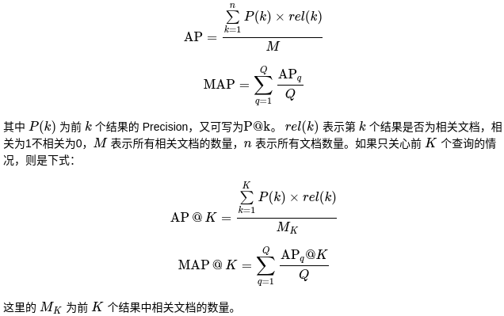
        
        对于单个信息需求来说，Average Precision 是 PR 曲线下面积的近似值，因此 MAP 可粗略地认为是某个查询集合对应的多条 PR 曲线下面积的平均值。
    - **Normalized Discounted Cumulative Gain** (NDCG，归一化折扣累计增益) 。如果说MAP是基于0/1二值描述相关性，那么NDCG则是可将相关性分为多个等级的指标。

### 1.6、标注问题
 - 表述也是一个监督学习问题，可以认为标注问题是分类问题的一个推广，是更复杂的结构预测问题的简单形式
 - 标注问题的输入是一个观测序列，输出是一个标记序列或状态序列
 - 标注问题的目标是学习一个模型，使其能够对观测序列给出标记序列作为预测
 - 对一个观测序列找到使条件概率最大的标记序列
 - 评价标注模型的指标与评价分类模型的指标一样，常用准确率、精确率、召回率
 - 常用算法：HMM、CRF

### 1.7、回归问题
 - 预测输入变量和输出变量之间的关系
 - 回归模型表示从输入变量到输出变量之间映射的函数
 - 回归问题的学习等价于函数拟合
 - 按照输入变量的个数分为一元回归和多元回归，按照输入变量和输出变量之间的关系的类型（即模型的类型）分为线性回归和非线性回归
 - 最常用损失函数是：平方损失函数，在此情况下可用最小二乘法求解


## 2、感知机

### 2.1、一般概念
 - 感知机是二类分类的**线性分类模型**，输入为实例的特征向量，输出为实例的类别
 - 感知机对应于输入空间（特征空间）中将实例划分为正负两类的分离超平面，属于**判别模型**
 - 感知机学习旨在求出将训练数据进行线性划分的分离超平面
 - 为此，倒入基于误分类的损失函数，利用梯度下降法对损失函数进行极小化，求得感知机模型

### 2.2、感知机模型
 - 定义：由输入空间到输出空间的如下函数成为感知机，
     ```
     f(x) = sign(w·x + b)
     ```
 其中，sign为符号函数，即：
     ```
     sign(x) = +1, 当x>=0时
     sign(x) = -1, 当x<0时
     ```
 - 感知机模型的假设空间是定义在特征空间中的所有线性分类模型或线性分类器，即函数
     ```
     {f|f(x)=w·x+b}
     ```

### 2.3、感知机学习策略
 - 损失函数一个是自然选择误分类点的总数（不易优化），另一个是误分类点到超平面S的总距离（采用这个）
    ```
    L(w,b) = - sum (y_i (w·x_i + b)) from x_i属于M
    ```
 其中M为误分类点的集合，这个损失函数就是感知机学习的经验风险函数
 - 显然，损失函数`L(w,b)`是非负的，如果没有误分类点，损失函数值就是0
 - 误分类点越少，误分类点离超平面越近，损失函数值就越小


## 3、KNN
### 3.1、一般概念
 - KNN是一种基本分类与回归方法，输入为实例的特征向量
 - KNN进行分类时，对新的实例，根据其k个最近邻的训练实例的类别，通过多数表决等方式进行预测
 - 因此，KNN不具有显式的学习过程，实际上利用训练数据集对特征向量空间进行划分，并作为其分类的模型
 - 三要素是：k值的选择、距离度量、分类决策规则

### 3.2、K近邻算法
 - 相当于将特征空间划分为一些子空间，确定子空间里的每个点所属的类
 - k值的选择：
    - 选择较小的k值：
        - 学习的近似误差会减小，只有与输入实例较近的训练实例才会对预测结果起作用
        - 缺点是学习的估计误差会增大，预测结果会对近邻的实例点非常敏感，如果近邻的实例点恰巧是噪声，预测就会出错
        - k值减小意味着整体模型变得复杂，容易发生过拟合
    - 选择较大的k值：
        - 相当于用较大邻域中的训练实例进行预测
        - 优点是可以减少学习的估计误差，缺点是学习的近似误差会增大，这时与输入实例较远的（不相似的）训练实例也会对预测起作用，使预测大声错误
        - k值的增大意味着整体的模型变得简单
    - k通常取较小的数值，采用交叉验证法来选取最优k值
 - KNN的分类决策规则是多数表决，等价于经验风险最小化

### 3.3、KD树
 - 实现KNN时主要考虑是如何对训练数据进行快速k近邻搜索，这在**特征空间的维数大及训练数据容量大**时尤其必要
 - KNN最简单的实现方法是线性扫描，即要计算输入实例与每一个训练实例的距离（非常耗时，不可取）
 - ---------------------------- 分割线 ----------------------------
 - kd树是一种对k维空间中的实例点进行存储以便对其进行快速检索的树形数据结构
 - kd树是二叉树，表示对k维空间的一个划分
 - 构造kd树相当于不断地用垂直于坐标轴的超平面将k维空间切分，构造一系列的k维超矩形区域
 - kd树的每个结点对应于一个k维超矩形区域
 - 平衡的kd树搜索时的效率未必是最优的
 - 构造平衡kd树：
    - 输入：k维空间数据集`T={x_1,x_2,...x_N}`，其中`x_i=(x_{i}^{(1)}, x_{i}^{(2)}, ..., x_{i}^{(k)})^T   i=1,2,...N`，输出：kd树
    - 构造根结点，根结点对应于包含数据集T的k维空间的超矩形区域
        - 选择输入中的第一个维度为坐标轴，以T中所有的实例的该坐标的中位数为切分点，将根结点对应的超矩形区域切分为两个子区域
        - 切分由通过切分点并与坐标轴垂直的超平面实现
        - 由根结点生成深度为1的左右子结点，左子节点对应坐标小于切分点的子区域，有子结点对应大于的
        - 将落在切分超平面上的实例点保存在根结点
    - 重复进行上述操作，直到两个子区域没有实例存在时停止，从而形成kd树的区域划分

### 3.4、搜索KD树
 - 利用kd树可以省去大部分数据点的搜索，减少搜索的计算量
 - 给定一个目标点，搜索其最近邻：
    - 首先找到包含目标点的叶结点
    - 然后从该叶结点出发，依次回退到父结点，不断查找与目标点最近邻的结点，当确定不可能存在更近的结点时终止
    - 这样搜索就被限制在空间的局部区域上，效率大为提高
    - 包含目标点的叶结点对应包含目标点的最小超矩形区域，以此叶结点的实例点作为当前最近点，目标点的最近邻一定在以目标点为中心并通过当前最近点的超球体的内部
    - 然后返回当前结点的父结点，如果父节点的另一子结点的超矩形区域与超球体相交，那么在相交的区域内寻找与目标点更近的实例点，如果寻在这样的点，将此点作为新的
    当前最近点，算法转到更上一级的父节点，继续上述过程。如果父节点的另一子结点的超矩形区域与超球体不相交，或者不存在比当前最近点更近的点，则停止搜索
 - 如果实例点是随机分布的，kd树搜索的平均计算复杂度是`O(logN)`，N是训练实例数
 - kd树更适用于训练实例数远大于空间维数时的k近邻搜索，当空间维数接近训练实例数时，它的效率会迅速下降，几乎接近线性扫描

### 3.5、总结
 - k值小时，k近邻模型更复杂，k值大时，k近邻模型更简单
 - k值的选择反映了对近似误差与估计误差之间的权衡，通常由交叉验证选择最优的k，分类决策规则是多数表决，对应于经验风险最小化
 - kd树是二叉树，表示对k维空间的一个划分，其每个结点对应于k维空间中的一个超矩形区域
 - 利用kd树可以省去对大部分数据点的搜索，从而减少搜索的计算量


## 4、朴素贝叶斯法
### 4.1、一般概念
 - 朴素贝叶斯法和贝叶斯估计是不同的概念
 - 朴素贝叶斯法是基于**贝叶斯定理**与**特征条件独立假设**的分类方法
 - 一般过程：
    - 对于给定的训练数据集，首先基于特征条件独立假设学习输入/输出的联合概率分布`P(X,Y)`
    - 然后基于此模型，对给定的输入x，利用贝叶斯定理求出后验概率最大的输出y
 - 朴素贝叶斯法实现简单，学习与预测的效率都很高，是一种常用的方法

### 4.2、贝叶斯定理
 - 贝叶斯定理是关于随机事件 A 和 B 的条件概率
     ```
     P(A|B) = P(B|A)P(A) / P(B)
     ```
 - `P(A)`是 A 的先验概率，之所以称为“先验”是因为它不考虑任何 B 方面的因素。
 - `P(A|B)`是已知 B 发生后 A 的条件概率，也由于得自 B 的取值而被称作 A 的后验概率。
 - `P(B|A)`是已知 A 发生后 B 的条件概率，也由于得自 A 的取值而被称作 B 的后验概率。
 - `P(B)`是 B 的先验概率，也称为标准化常量。
 - 按这些术语，贝叶斯定理可表述为：
     ```
     P(A|B) = P(B|A)      *  P(A)    / P(B)
     后验概率 = (likelihood * 先验概率) / 标淮化常量
     ```
 也就是说，后验概率与先验概率和likelihood的乘积成正比。
 - 另外，比例`P(B|A)/P(B)`也有时被称作标准likelihood，故贝叶斯定理可以表述为：
     ```
     后验概率 = 标淮likelihood * 先验概率
     ```
 - 联合概率`P(A,B)`表示两个事件共同发生（数学概念上的交集）的概率。
     ```
     P(A|B)P(B) = P(A,B) = P(B|A)P(A)
     ```

### 4.3、贝叶斯推理
 - 通俗地讲就是当你不能确定某一个事件发生的概率时，你可以依靠与该事件本质属性相关的事件发生的概率去推测该事件发生的概率。用数学语言表达就是：支持某项属
 性的事件发生得愈多，则该事件发生的的可能性就愈大。这个推理过程有时候也叫贝叶斯推理。

### 4.4、朴素贝叶斯法的学习与分类
 - 基本方法：
    - `P(X,Y)`是X和Y的联合概率分布，训练数据集由`P(X,Y)`独立同分布产生
    - **朴素贝叶斯法通过训练数据集学习联合概率分布`P(X,Y)`**，具体地，学习以下先验概率分布及条件概率分布
        - 先验概率分布：k表示类的个数
        
            
        - 条件概率分布：(其参数量是指数级的)(独立同分布假设)
        
            
        - 于是学习到联合概率分布`P(X,Y) = P(X|Y)P(Y)`，实际上**学习到生成数据的机制**，所以属于生成模型。
    - 朴素贝叶斯法对条件概率分布做了**条件独立性假设**，这是一个较强的假设，朴素贝叶斯法也因此得名
    - 条件独立性假设等于是说**用于分类的特征在类确定的条件下都是条件独立的**，这一假设使朴素贝叶斯法变得简单，但有时会牺牲一定的分类准确率
      
        
        
        该假设用来计算条件概率分布`P(X|Y)`，进而求得`P(X,Y)`。
    - 朴素贝叶斯法分类时，对给定的输入x，通过学习得到的模型（即`P(X,Y)`）来计算后验概率分布`P(Y|X)`，将后验概率最大的类作为x的类输出，**后验概率计算根据贝叶斯定理进行**：
        ```
        贝叶斯定理：
        P(Y|X) = P(X|Y)P(Y) / P(X)

        又因为：
        P(X) = sum_{k}( P(X=x|Y=c_k)P(Y=c_k) )
        
        所以有下边式子：
        ```
        
        
    - 根据X的独立同分布的假设，得出朴素贝叶斯法分类的基本公式：
      
        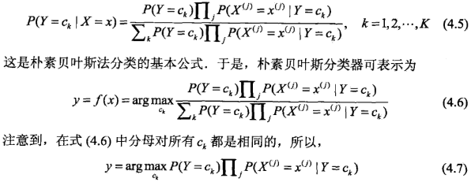
 - 后验概率最大化的含义：
    - 朴素贝叶斯法将实例分到后验概率最大的类中，等价于期望风险最小化
    - 期望是对联合分布`P(X,Y)`取的
    - **根据期望风险最小化准则就得到了后验概率最大化准则**，即朴素贝叶斯法所采用的原理

### 4.5、朴素贝叶斯法的参数估计
 - 极大似然估计：
    - 极大似然估计的定义 (TODO)
    - ------------------------ 华丽的分割线 ------------------------
    - 在朴素贝叶斯法中，学习意味着估计`P(Y=c_k)`和`P(X=x|Y=c_k)`，可以用极大似然估计法估计相应的概率
 - 贝叶斯估计：
    - 用极大似然估计可能会出现所要估计的概率值为0的情况，这时会影响到后验概率的计算结果，使分类产生偏差，解决这一问题的方法是采用贝叶斯估计
    - 等价于在随即变量各个取值的频数上赋予一个正数`lambda > 0`，当`lambda=0`时就是极大似然估计，常取`lambda=1`，这时成为**拉普拉斯平滑**，
    同样地，先验概率的贝叶斯估计也进行类似操作进行平滑。

### 4.6、总结
 - 朴素贝叶斯法是典型的生成学习方法
 - 生成方法由训练数据学习联合概率分布`P(X,Y)`，然后求得后验概率分布`P(Y|X)`，具体来说就是利用训练数据学习`P(X|Y)`和`P(Y)`的估计，得到联合概率分布：
     ```
     P(X,Y) = P(Y)P(X|Y)
     ```
 概率估计方法可以是极大似然估计或贝叶斯估计(解决极大似然估计可能出现的0值情况)
 - 朴素贝叶斯法的基本假设是条件独立性，这是一个较强的假设，使得模型包含的条件概率的数量大为减少，朴素贝叶斯法的学习与预测大为简化，因而朴素贝叶斯法高效，易于实现
 - 其缺点是分类的性能不一定很高
 - 朴素贝叶斯法利用贝叶斯定理与学到的联合概率模型进行分类预测，将输入x分到后验概率最大的类y
 - 后验概率最大等价于0-1损失函数时的期望风险最小化


## 5、决策树
> 决策树是一种基本的分类和回归方法。

### 5.1、一般概念
 - 在分类问题中，表示基于特征对实例进行分类的过程。
 - 可以认为是if-then规则的集合
 - 也可以认为是定义在特征空间与类空间上的条件概率分布
 - 模型具有可读性，分类速度快（优点）

### 5.2、决策树学习包含3个步骤
 - 特征选择
 - 决策树的生成
 - 决策树的修剪

这些学习思想来源于`ID3`、`C4.5`、`CART`算法，这三个也是决策树学习的常用算法。

### 5.3、定义
 - 由节点和有向边组成
 - 内部节点表示一个特征或属性
 - 叶节点表示一个类

### 5.4、分类过程
 - 从根节点开始，对实例的某一特征进行测试，根据测试结果，将实例分配到其子节点
 - 这时，每一个子节点对应着该特征的一个取值。
 - 如此递归地对实例进行测试并分配，直至达到叶节点，最后将实例分到叶节点的类中。

### 5.5、决策树与条件概率分布
 - 决策树还表示给定特征条件下，类的条件概率分布
 - 这一条件概率分布定义在特征空间的一个划分上，将特征空间划分为互不相交的单元
 - 在每个单元定义一个类的概率分布，就构成了一个条件概率分布
 - 决策树的一条路径对应于划分中的一个单元
 - 决策树表示的条件概率分布由各个单元给定条件下类的条件概率分布组成
 - 各叶节点上的条件概率往往偏向某一个类，即属于某一类的概率最大
 - 决策树分类时将该节点实例强行分到条件概率大的那里类去

### 5.6、决策树学习
 - 本质上是从训练数据集中归纳出一组分类规则
 - 由训练数据集估计条件概率模型
 - 损失函数通常是正则化的极大似然估计
 - 决策树学习算法通常采用启发式方法，近似求解这一最优化问题，得到的是次最优的
 - 递归地选择最优特征，根据该特征对数据集进行分割，使各个子数据集有一个最好的分类的过程
 - 这一过程对应着对特征空间的划分，也对应着决策树的构建
 - 如果这些子集已经能够被基本正确分类，那么构建叶节点，并将这些子集分到所对应的叶节点中去
 - 如果还有子集不能被基本正确分类，选择新的最优特征，继续对其分割，构建相应的结点，递归下去
 - 最后每个子集都被分到叶节点上，即都有了明确的类
 - 以上模型可能过拟合，需要进行**剪枝**，树变简单，更好范化
 - 剪枝就是去掉过于细分的叶节点，使其回退到父结点，甚至更高结点，然后将父结点或者更高的结点改为新的叶结点
 - 如果特征数量很多，在开始前对特征**进行选择**，只留下对训练数据有足够分类能力的特征
 - 深浅不同的决策树对应着不同复杂程度的概率模型
 - 决策树的生成对应于模型的局部选择（局部最优），剪枝对应于模型的全局选择（全局最优）

### 5.7、特征选择
 - 选取对训练数据具有分类能力的特征，可以提高决策树的学习效率
 - 如果利用一个特征进行分类的结果和随机分类的结果没有很大差别，则这个特征是没有分类能力的
 - 特征选择的准则是**信息增益**或信息增益比
 - 特征选择是考虑哪个特征来划分特征空间
 - 如果一个特征具有更好的分类能力，或者说，按照这一特征将训练集分割成子集，使得各个子集在当前条件下具有最好的分类
 那么就应该选择这个特征

### 5.8、熵
 - 是表示随机变量不确定性的度量
 - X为随机变量，熵只依赖于X的分布，与X的取值无关
 - 熵越大，随机变量的不确定性就越大

假设X是一个取有限个值的离散随机变量，其概率分布为：
```
P(X=x_i) = p_i, i=1,2,...,n
```
则随机变量X的熵定义为：
```
H(X) = - sum(p_i log p_i) from i=1 to n
```
对数以2或e为底，熵只依赖于X的分布，与X的取值无关，所以可记为`H(p)`
```
0 <= H(p) <= logn
```
当随机变量只取两个值，如1,0时，X的分布为：
```
P(X=1) = p, P(X=0) = 1-p, 0 <= p <=1
```
熵为：
```
H(p) = - p log p - (1-p) log (1-p)
```
当p=0或p=1时，H(p)=0,随机变量完全没有不确定性，当p=0.5时，H(p)=1，熵取值最大，随机变量不确定性最大。

### 5.9、信息增益
 - 表示得知特征X的信息而使得类Y的信息的不确定性减少的程度
 - 特征A对训练数据集D的信息增益`g(D, A)`，定义为集合D的经验熵`H(D)`与特征A在给定条件下D的经验条件熵`H(D|A)`之差，即
     ```
     g(D, A) = H(D) - H(D|A)
     
     信息增益 = 信息熵 - 条件熵
     信息增益越大表示使用特征 A 来划分所获得的“纯度提升越大”。
     ```
 - 一般地，熵和条件熵之差成为**互信息**
 - 决策树学习中的信息增益等价于训练数据集中类与特征的互信息
 - 决策树学习应用信息增益准则选择特征
 - 给定训练数据集D和特征A，经验熵`H(D)`表示对数据集D进行分类的不确定性
 - 经验条件熵`H(D|A)`表示在特征A给定的条件下对数据集D进行分类的不确定性
 - 他们的差即信息增益，即由于特征A而使对数据集D的分类的不确定性较少的程度
 - 对于数据集D而言，信息增益依赖于特征，不同的特征往往具有不同的信息增益
 - 信息增益大的特征具有更强的分类能力
 - 特征选择的方法是，对训练集计算其每个特征的信息增益，并比较他们的大小，选择信息增益最大的特征

### 5.10、信息增益比
 - 信息增益值的大小是相对于训练数据集而言的，并没有绝对意义
 - 在分类问题困难时，也就是会所训练数据集的经验熵大的时候，信息增益会偏大。
 - 信息增益比是选择特征的另一个准则，可以对上述问题进行矫正
 - 定义为：信息增益与训练数据集D的经验熵`H(D)`之比

### 5.11、决策树的生成
决策树学习的经典算法：

#### 5.11.1、ID3算法
 - 核心是在决策树的各个结点上应用信息增益准则选择特征，递归地构建决策树
 - 直到所有特征的信息增益均很小或没有特征可以选择为止
 - ID3相当于用极大似然法进行概率模型的选择
 - ID3算法只有树的生成，所以该算法生成的树容易产生过拟合
 - ID3算法是建立在奥卡姆剃刀（用较少的东西，同样可以做好事情）的基础上：越是小型的决策树越优于大的决策树。
 - ID3算法的核心思想就是以信息增益来度量特征选择，选择信息增益最大的特征进行分裂。
 - ID3算法采用自顶向下的贪婪搜索遍历可能的决策树空间（C4.5也是贪婪搜索）
 - ID3算法缺点：
    - ID3没有剪枝策略，容易过拟合；
    - 信息增益准则对可取值数目较多的特征有所偏好，类似“编号”的特征其信息增益接近于1；
    - 只能用于处理离散分布的特征；
    - 没有考虑缺失值。

#### 5.11.2、C4.5的生成算法
 - 与ID3相似，对ID3进行了改进，C4.5在生成的过程中，用**信息增益比**来选择特征
 - C4.5算法最大的特点是克服了ID3对特征数目的偏重这一缺点，引入信息增益比来作为分类标准。
 - C4.5相对于ID3的缺点对应有以下改进方式：
    - 引入悲观剪枝策略进行后剪枝；
    - 引入信息增益率作为划分标准；
    - 将连续特征离散化，假设n个样本的连续特征A有m个取值，C4.5将其排序并取相邻两样本值的平均数共m-1个划分点，分别计算以该划分点作为二元分类点时的信息增益，并选择信息增益最大的点作为该连续特征的二元离散分类点；
 - 对于缺失值的处理可以分为两个子问题：
    - 问题一：在特征值缺失的情况下进行划分特征的选择？（即如何计算特征的信息增益率）
    - 问题二：选定该划分特征，对于缺失该特征值的样本如何处理？（即到底把这个样本划分到哪个结点里）
    - 针对问题一，C4.5的做法是：对于具有缺失值特征，用没有缺失的样本子集所占比重来折算；
    - 针对问题二，C4.5的做法是：将样本同时划分到所有子节点，不过要调整样本的权重值，其实也就是以不同概率划分到不同节点中。
 - 信息增益率对可取值较少的特征有所偏好（分母越小，整体越大），因此C4.5并不是直接用增益率最大的特征进行划分，而是使用一个启发式方法：先从候选划分特征中找到信息增益高于平均值的特征，再从中选择增益率最高的。
 - 剪枝策略
    - 为什么要剪枝：过拟合的树在泛化能力的表现非常差。
    - 预剪枝，在节点划分前来确定是否继续增长，及早停止增长的主要方法有：
       - 节点内数据样本低于某一阈值；
       - 所有节点特征都已分裂；
       - 节点划分前准确率比划分后准确率高。
       - 预剪枝不仅可以降低过拟合的风险而且还可以减少训练时间，但另一方面它是**基于“贪心”策略**，会带来欠拟合风险。
    - 后剪枝，在已经生成的决策树上进行剪枝，从而得到简化版的剪枝决策树。
        - C4.5采用的**悲观剪枝方法**，用递归的方式从低往上针对每一个非叶子节点，评估用一个最佳叶子节点去代替这课子树是否有益。如果剪枝后与剪枝前相比其错误率是保持或者下降，则这棵子树就可以被替换掉。C4.5通过训练数据集上的错误分类数量来估算未知样本上的错误率。
        - 后剪枝决策树的欠拟合风险很小，泛化性能往往优于预剪枝决策树。但同时其训练时间会大的多。
 - 缺点
    - 剪枝策略可以再优化；
    - C4.5用的是多叉树，用二叉树效率更高；
    - C4.5只能用于分类；
    - C4.5使用的熵模型拥有大量耗时的对数运算，连续值还有排序运算；
    - C4.5在构造树的过程中，对数值属性值需要按照其大小进行排序，从中选择一个分割点，所以只适合于能够驻留于内存的数据集，当训练集大得无法在内存容纳时，程序无法运行。

##### 5.11.2.1、决策树的剪枝
 - 决策树生成算法采用递归的方式产生决策树，对训练集很准确，易产生过拟合
 - 剪枝就是对生成的树进行简化，裁掉一些子树或叶结点，并将其根节点或父结点作为新的叶结点，从而简化分类树模型
 - 决策树的剪枝往往通过极小化决策树整体的损失函数来实现，设叶结点个数`|T|`，则损失函数：
     ```
     C_a(T) = C(T) + a|T|
     ```
 - `C(T)`表示模型对训练数据的预测误差（拟合程度），`|T|`表示模型复杂度，较大的a促使选择较简单的模型，a为0时不考虑模型复杂度
 - 剪枝就是当a确定时，选择损失函数最小的模型，即损失函数最小的子树，子树越大拟合越好复杂度越高，反之亦反，损失函数正好表示对两者的平衡
 - 决策树生成只考虑了通过提高信息增益（比）对训练数据进行更好的拟合，而决策树剪枝通过优化损失函数还考虑了减小模型复杂度
 - 决策树生成学习局部的模型，而决策树剪枝学习整体的模型
 - `C_a(T)`的极小化等价于正则化的极大似然估计

##### 5.11.2.2、树的剪枝算法
 - 计算每个结点的经验熵
 - 递归地从树的叶结点向上回缩
 - 如果子树的损失函数更小，则进行剪枝，将父结点变成新的叶结点
 - 返回第二步，知道不能继续为止，得到损失函数最小的子树

> 注意：只考虑两个树的损失函数的差，其计算可以在局部进行，所以决策树的剪枝算法可以由一种动态规划的算法实现

#### 5.11.3、CART算法
 - CART (classification and regression tree)，分类与回归树模型
 - 是应用广泛的决策树学习算法
 - CART同样由特征选择、树的生成及剪枝组成
 - 既**可以用于分类也可以用于回归**
 - CART是在给定输入随机变量X条件下输出随机变量Y的条件概率分布的学习方法
 - CART假设决策树是二叉树，左分支是取值为‘是’的分支，右分支是‘否’的分支，等价于递归地二分每个特征
 - 将输入特征空间划分为有限个单元，并在这些单元上确定预测的概率分布，也就是在输入给定的条件下输出的条件概率分布
 - 由两步组成：1）决策树的生成，生成的决策树要尽量大; 2）决策树的剪枝，用损失函数最小作为标准
 - ID3和C4.5虽然在对训练样本集的学习中可以尽可能多地挖掘信息，但是其生成的决策树分支、规模都比较大，**CART算法的二分法可以简化决策树的规模**，提高生成决策树的效率。
 - **代价复杂度剪枝**，从最大树开始，每次选择训练数据熵对整体性能贡献最小的那个分裂节点作为下一个剪枝对象，直到只剩下根节点。CART会产生一系列嵌套的剪枝树，需要从中选出一颗最优的决策树；
    - 采用一种“基于代价复杂度的剪枝”方法进行后剪枝，这种方法会生成一系列树
    - 每个树都是通过将前面的树的某个或某些子树替换成一个叶节点而得到的
    - 这一系列树中的最后一棵树仅含一个用来预测类别的叶节点。
    - 然后用一种成本复杂度的度量准则来判断哪棵子树应该被一个预测类别值的叶节点所代替。
    - 这种方法需要使用一个单独的测试数据集来评估所有的树，根据它们在测试数据集熵的分类性能选出最佳的树。
 - **悲观剪枝方法**，用递归的方式从低往上针对每一个非叶子节点，评估用一个最佳叶子节点去代替这课子树是否有益。如果剪枝后与剪枝前相比其错误率是保持或者下降，则这棵子树就可以被替换掉。
 - CART在C4.5的基础上进行了很多提升。
    - C4.5为多叉树，运算速度慢，CART为二叉树，运算速度快；
    - C4.5只能分类，CART既可以分类也可以回归；
    - CART使用Gini系数作为变量的不纯度量，减少了大量的对数运算；
    - CART采用代理测试来估计缺失值，而 C4.5以不同概率划分到不同节点中；
    - CART采用“基于代价复杂度剪枝”方法进行剪枝，而C4.5采用悲观剪枝方法。
 - 处理类别不平衡问题：
    - CART的一大优势在于：无论训练数据集有多失衡，它都可以将其自动消除不需要采取其他操作。
    - CART使用了一种先验机制，其作用相当于对类别进行加权。这种先验机制嵌入于CART算法判断分裂优劣的运算里，在CART默认的分类模式中，总是要计算每个节点关于根节点的类别频率的比值，这就相当于对数据自动重加权，对类别进行均衡。
    
        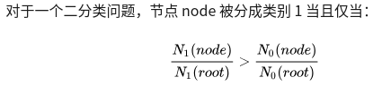
    
    比如二分类，根节点属于1类和0类的分别有20和80个。在子节点上有30个样本，其中属于1类和0类的分别是10和20个。如果10/20>20/80，该节点就属于1类（每个结点的类别由结点下边叶结点类别的多数来决定）。
    - 通过这种计算方式就无需管理数据真实的类别分布。假设有K个目标类别，就可以确保根节点中每个类别的概率都是1/K。这种默认的模式被称为“先验相等”。
    - 先验设置和加权不同之处在于先验不影响每个节点中的各类别样本的数量或者份额。先验影响的是每个节点的类别赋值和树生长过程中分裂的选择。
 - 用作回归时：
    - 连续值处理：

        
    - 预测方式：
        - 对于决策树建立后做预测的方式，上面讲到了CART分类树采用叶子节点里概率最大的类别作为当前节点的预测类别。
        - 而**回归树输出不是类别，它采用的是用最终叶子的均值或者中位数来预测输出结果**。

##### 5.11.3.1、CART生成
 - 就是递归地构建二叉决策树的过程
 - 对**回归树用平方误差**最小化准则，对**分类树用基尼指数**最小化准则，进行特征选择，生成二叉树
 - **回归树的生成：**
    - 一个回归树对应着输入空间（特征空间）的一个划分，以及划分的单元上的输出值
    - 假设将输入空间划分为M个单元，每个单元`R_m`有一个固定的输出值`c_m`
    - 用平方误差最小准则求解每个单元上的最优输出值
    - 单元`R_m`上的`c_m`的最优值`c_m'`，是`R_m`上所有输入实例对应的输出的均值
    - 采用启发式的方法对输入空间进行划分：（**最小二乘回归树生成算法**）
        - 递归地将每个区域划分为两个子区域并决定每个子区域上的输出值，构建二叉决策树
        - 在每一次的划分中，选择切分变量和切分点时（也就是选择 feature 和将该 feature空间一分为二的划分值），
        使得模型在训练集上的 mse 最小，也就是每片叶子的 mse 之和最小
        - 遍历所有的切分变量和切分点，然后选出 叶子节点 mse 之和最小 的那种情况作为划分
        - 切分变量和切分点将父节点的输入空间一分为二
        - 先固定feature j，然后选出在该feature下的最佳划分s
        - 对每一个 feature 都这样做，那么有 m 个feature，我们就能得到 m 个 feature 对应的最佳划分
        - 从这 m 个值中取最小值即可得到令全局最优的`(j,s)`
        - ---------------------------- 华丽的分割线 ----------------------------
        - 选择第j个变量`x^{j}`和它的取值s，作为切分变量和切分点，并定义两个区域：
            ```
            R_1(j,s)={x|x^{j} <= s} 和 R_2(j,s)={x|x^{j} > s}
            ```
        - 然后寻找最优切分变量j和最优切分点s：
            ```
            min [min sum(y_i - c_1)^2  +  min sum(y_i - c_2)^2]
            j,s  c_1 x_i属于R_1(j,s)       c_2 x_i属于R_2(j,s)
            ```
        - `c_1`和`c_2`分别是区域1和区域2的固定输出值，一般为该区域内实例输出的均值，想要最小化 CART 总体的 mse，
        只需要最小化每一片叶子的 mse 即可，而最小化一片叶子的 mse，只需要将预测值设定为叶子中含有的训练集元素的均值
        - 遍历所有的输入变量，找到最优的切分变量j，构成一个对`(j,s)`，依次将输入空间划分为两个区域
        - 接着用选定的对`(j,s)`划分区域并决定相应的输出值
        - 对每个区域重复上述划分过程，直到满足停止条件为止
        - 这样就生成一棵回归树（**最小二乘回归树**）
 - **分类树的生成**
    - 分类树用基尼指数选择最优特征，同时决定该特征的最优二值切分点
    - 对于给定的样本集合D，其基尼指数为：`C_k`是D中属于第k类的样本子集，K是类的个数
        ```
        Gini(D) = 1 - sum( (|C_k|/|D|)^2 ) from k=1 to k
        ```
    - 基尼指数`Gini(D)`表示集合D的不确定性，基尼指数`Gini(D,A)`表示经`A=a`分割后集合D的不确定性
    - 基尼指数越大，样本集合的不确定性也就越大，和熵类似，其曲线和熵之半的曲线很接近
    - 基尼指数和熵：
        - 熵模型拥有大量耗时的对数运算，基尼指数在简化模型的同时还保留了熵模型的优点。
        - 基尼指数代表了模型的不纯度，基尼系数越小，不纯度越低，特征越好。这和信息增益（率）正好相反。
        - 基尼指数反映了从数据集中随机抽取两个样本，其类别标记不一致的概率。因此基尼指数越小，则数据集纯度越高。
        - 基尼指数偏向于特征值较多的特征，类似信息增益。
        - 基尼指数性能也与熵模型非常接近。
        - 基尼指数可以理解为熵模型的一阶泰勒展开。
    - **CART生成算法：**
        - 从根节点开始，递归地对每个节点进行以下操作
        - 计算现有特征对该数据集的基尼指数，计算`A=a`时的基尼指数
        - 在所有可能的特征A以及它们所有可能的切分点中a中，选择**基尼指数最小的特征**及其对应的切分点作为最优特征与最优切分点
        - 进行切分，现节点生成两个子节点，将训练数据集依特征分配到两个子节点中去
        - 重复进行上述操作，满足停止条件（结点中的样本个数小于预定阈值，或样本集的基尼指数小于预定阈值也就是样本基本属于同一类，或没有更多特征）
        - 生成CART决策树

##### 5.11.3.2、CART剪枝
 - 从完全生长的决策树底端减去一些子树，使决策树变小（模型变简单），从而能够对未知数据有更准确的预测
 - 分两步进行：
    - 首先从底端开始不断剪枝，直到T_0的根节点，形成一个子树序列`{T_0, T_1, ...}`
    - 然后通过交叉验证法在独立的验证数据集上对子树序列进行测试，从中选择最优子树

### 5.12、总结
 - 决策树学习旨在构建一个与训练数据拟合很好，并且复杂度小的决策树
 - 因为从可能的决策树中直接选取最优决策树是NP完全问题，现实中采用启发式方法学习次优的决策树
 - 决策树学习包含三部分：常用算法有`ID3`、 `C4.5`、 `CART`
    - 特征选择，目的在于选取对训练数据能够分类的特征，关键是其准则，常用准则如下：
        - （对于ID3）样本集合D对特征A的信息增益
        - （对于C4,5）样本集合D对特征A的信息增益比
        - （对于CART）样本集合D的基尼指数
    - 树的生成
        - 通常使用信息增益最大、信息增益比最大或基尼指数最小作为特征选择的准则
        - 往往采用信息增益或其它指标，从根结点开始，递归地产生决策树，相当于不断地选取局部最优的特征
    - 树的剪枝
        - 由于生成的决策树存在过拟合问题，需要对它进行剪枝
        - 往往从已生成的树上剪掉一些叶结点或叶结点以上的子树
        - 并将其父结点或根结点作为新的叶结点，简化决策树
 - 对比下ID3、C4.5和CART三者之间的差异：
    - 划分标准的差异：ID3使用信息增益偏向特征值多的特征，C4.5使用信息增益率克服信息增益的缺点，偏向于特征值少的特征，CART使用基尼指数克服C4.5需要求log的巨大计算量，偏向于特征值较多的特征。
    - 使用场景的差异：ID3和C4.5都只能用于分类问题，CART可以用于分类和回归问题；ID3和C4.5是多叉树，速度较慢，CART是二叉树，计算速度很快；
    - 样本数据的差异：ID3只能处理离散数据且缺失值敏感，C4.5和CART可以处理连续性数据且有多种方式处理缺失值；从样本量考虑的话，小样本建议C4.5、大样本建议CART。C4.5处理过程中需对数据集进行多次扫描排序，处理成本耗时较高，而CART本身是一种大样本的统计方法，小样本处理下泛化误差较大 ；
    - 样本特征的差异：ID3和C4.5层级之间只使用一次特征，CART可多次重复使用特征；
    - 剪枝策略的差异：ID3没有剪枝策略，C4.5是通过悲观剪枝策略来修正树的准确性，而CART是通过代价复杂度剪枝。


## 6、对数线性模型
> 对数线性模型： 输出`Y=1`的对数几率是由输入x的线性函数表示的模型。模型学习一般采用极大似然估计，或正则化的极大似然估计。
> 可以形式化为约束最优化问题。

### 6.1、逻辑回归
一些概念：
 - 连续性型随机变量： 连续型随机变量是指如果随机变量X的所有可能取值不可以逐个列举出来，而是取数轴上某一区间内的任一点的随机变量。
例如，一批电子元件的寿命、实际中常遇到的测量误差等都是连续型随机变量。
 - [分布函数](https://baike.baidu.com/item/%E5%88%86%E5%B8%83%E5%87%BD%E6%95%B0/2439796?fr=aladdin)，
 - [概率密度函数](https://baike.baidu.com/item/%E6%A6%82%E7%8E%87%E5%AF%86%E5%BA%A6%E5%87%BD%E6%95%B0/5021996?fr=aladdin)
 - [均匀分布](https://baike.baidu.com/item/%E5%9D%87%E5%8C%80%E5%88%86%E5%B8%83/954451?fr=aladdin)

分布函数的导数就是密度函数，密度函数进行积分得到分布函数。

### 6.2、逻辑斯谛分布
 - X是连续型随机变量，服从逻辑斯蒂是指其分布函数类似于sigmoid函数，将sigmoid的x换为 `-(x-u)/r`，其密度函数为分布函数的导数。
 - 该曲线以`(u, 1/2)`为中心对称。在中心附近增长的最快，两端增长的最慢。曲线为S形，类似于sigmoid函数。

### 6.3、二项逻辑斯谛回归模型
 - 是一种分类模型（用于二分类），由条件概率`P(Y|X)`表示，形式为参数化的逻辑斯谛分布，输入`X`的取值为实数，输出`Y`的取值为`{0, 1}`。通过监督学习的方法来估计模型的参数。
 - 该模型是如下的条件概率分布：

    
    
    其中`w·x`为两者的内积。
 - 逻辑斯谛回归比较上述两个概率值的大小，将x分到概率较大的那一类。
 - 有时候为了方便，写成下边表达式：
   
    
 - 对数几率（logit函数）：
    - 一个事件的**几率**，是该事件发生的概率与该事件不发生的概率的比值，如果事件发生的概率是p，则该事件的几率是`p/(1-p)`。该事件的**对数几率**或者**logit函数**是：
    
        
    - 对于逻辑斯谛回归而言：

        

        - 即逻辑斯谛回归的logit函数是`w·x`。
        - 也就是说**在LR模型中，输出`Y=1`的对数几率（logit函数）是输入x的线性函数**。
        - 或者说**输出`Y=1`的对数几率是由输入x的线性函数表示的模型，即逻辑斯谛回归模型**。
        - 这个时候，如果`logit>0`说明，输出为Y=1，反之输出Y=0。
 - 考虑下边式子：
   
    
 - 线性函数`w·x`的值越接近正无穷，上式的值越接近1，越接近负无穷，上式的值越接近0，这样的模型就是逻辑斯谛回归模型。
 - 使用极大似然估计来估计模型的参数，问题就变成了以对数似然函数为目标函数的最优化问题。
 - 总结：
    - 逻辑斯谛回归模型是由`P(Y=k|x)`条件概率分布表示的分类模型，可用于二分类或多分类。
    - 逻辑斯谛回归模型来源于逻辑斯谛分布
    - 其分布函数是S形函数
    - 逻辑斯谛回归模型是由输入的线性函数表示的输出的对数几率模型

### 6.4、多项逻辑斯谛回归模型
 - 用于多分类。

### 6.5、最大熵模型
 - 最大熵模型由最大熵原理推到实现。
 - 假设满足所有约束条件的模型集合为C，定义在条件概率分布`P(Y|X)`上的条件熵为H(P)，则模型集合C中熵H(P)最大的模型称为最大熵模型。

#### 6.5.1、一般概念
 - 最大熵是概率学习的一个准则，将其应用到分类问题就得到了最大熵模型。
 - 最大熵原理认为，在学习概率模型时，在所有可能的概率分布（模型）中，熵最大的模型是最好的模型。
 - 通常用约束条件来确定概率模型的集合，所以最大熵原理可以表述为在满足约束条件的模型集合中选择熵最大的模型。

X为离散型的随即变量，概率分布为`P(X)`，熵的定义：
```
H(P) = - sum(log(P(x)log(P(x)))), for add x
```
满足下列不等式：
```
0 <= H(P) <= log|X|
```
`|X|`表示X取值个数，当且仅当X服从均匀分布时右边的等号成立，也就是说X服从均匀分布时，熵最大。
学习的目的是从模型集合中选择最优的模型，最大熵原理给出模型选择的一个准则。

具体地：
 - 模型的定义：假设分类模型是一个条件概率分布`P(Y|X)`，即对于给定的输入X，以条件概率`P(Y|X)`输出Y。
 - 学习的目标：用最大熵原理选择最好的模型
 - 给定训练集，可以确定联合分布`P(Y|X)`的经验分布和边缘分布`P(X)`的经验分布
 - `P(Y|X)`的经验分布表示训练数据中`(x, y)`出现的频次/N(即样本总数量)
 - `P(X)`的经验分布表示训练数据中x出现的频次/N(即样本总数量)
 - 用特征函数`f(x, y)`表示x和y的之间的某一个事实，即：

     ```
     二值函数
     f(x, y) = 1, 当x, y满足某一事实
     f(x, y) = 0, 否则
     ```
 - 如果模型能够获取训练数据中的信息，可以假设下边两个期望值相等

     ```
     E1 = 特征函数关于联合分布的经验分布的期望值，
     E2 = 特征函数关于模型P(Y|X)与边缘分布P(X)的经验分布的期望值
     ```
 - `E1=E2`作为模型学习的约束条件，如果有n个特征函数，就有n个约束条件。

#### 6.5.2、模型的学习
 - 最大熵模型的学习过程就是求解最大熵模型的过程，最大熵模型的学习可以形式化为约束最优化问题。
 - 最大熵模型学习中的对偶函数极大化等价于最大熵模型的极大似然估计。
 - 最大熵模型的学习问题可以转化为具体求解对数似然函数极大化或对偶函数极大化的问题。
 - 最大熵模型和逻辑斯谛回归模型有类似的形式，又称为对数线性模型。模型学习就是在给定的训练数据条件下对模型进行极大似然估计或正则化的极大似然估计。

#### 6.5.3、模型学习的最优化方法
 - 改进的迭代尺度法
 - 拟牛顿法

### 6.6、总结
 - 最大熵模型也是由条件概率分布表示的分类模型
 - 也可以用于二分类或者多分类
 - 最大熵模型可以由最大熵原理推到得出。
 - 最大熵原理是概率模型学习或估计的一个准则。
 - 最大熵原理认为在所有可能的概率模型（分布）的集合中，熵最大的模型是最好的模型。
 - 求解约束优化问题的对偶问题得到最大熵模型。


## 7、支持向量机
### 7.1、一般概念
 - 是一种二类分类模型
 - 它的基本模型是定义在特征空间上的间隔最大的线性分类器，间隔最大使其有别于感知机
 - 包括核技巧，使其成为实质上的**非线性分类器**
 - 学习策略就是间隔最大化，可以形式化为一个求解凸二次规划的问题，等价于正则化的合页损失函数的最小化问题
 - 学习算法是求解凸二次规划的最优化算法

### 7.2、学习方法
 - 包含构建有简至繁的模型：
    - 线性可分SVM， 当训练数据线性可分时，通过硬间隔最大化学习一个线性的分类器
    - 线性SVM
    - 非线性SVM， 当训练数据线性不可分时，通过核技巧及软间隔最大化，学习非线性SVM

### 7.3、核技巧
 - 当输入空间为欧式空间或离散集合、特征空间为希尔伯特空间时，核函数表示将输入从输入空间映射到特征空间得到的特征向量之间的内积
 - 通过使用核函数可以学习非线性SVM，等价于隐式地在高维的特征空间中学习线性SVM，这样的方法成为核技巧
 - 核方法是比SVM更为一般的机器学习方法

### 7.4、线性可分支持向量机
 - 考虑一个二分类问题，假设输入空间与特征空间为两个不同的空间
 - 线性可分SVM、线性SVM假设这两个空间的元素一一对应
 - 并将输入空间中的输入映射为特征空间中的特征向量
 - 非线性SVM利用一个从输入空间到特征空间的非线性映射将输入映射为特征向量
 - 输入都由输入空间转换到特征空间，SVM的学习是在特征空间进行的
 - 学习的目标是在特征空间找到一个分离超平面，能将实例分到不同的类
 - 分离超平面对应于方程`wx+b=0`，将特征空间划分为两部分，即正类和负类
 - 一般地，当训练数据集线性可分时，寻在无穷个分离超平面可将两类数据正确分开
 - 感知机利用误分类最小的策略，求得分离超平面，这时的解有无穷多个
 - 线性可分SVM利用间隔最大化求最优分离超平面，这时解是唯一的
 - 对于二维空间中的二分类问题，线性可分SVM对应着**将两类数据正确划分并且间隔最大的直线**
 - 一般来说，一个点距离分离超平面的远近可以表示分类预测的确信程度
 - 标签`y=+1`时为正例，`y=-1`时为负例，`wx+b`与y的符号是否一致能够表示分类是否正确，
 可以用`y(wx+b)`来表示分类的正确性及确信度，这就是**函数间隔**的概念
 - 定义超平面`(w,b)`关于训练数据集T的函数间隔为：超平面`(w,b)`关于T所有样本点的函数间隔的最小值
 - 定义超平面`(w,b)`关于训练数据集T的几何间隔为：超平面`(w,b)`关于T所有样本点的几何间隔的最小值
 - 超平面`(w,b)`关于样本点`(x_i,y_i)`的几何间隔一般是实例点到超平面的带符号的距离，当样本点被超平面正确分类时就是实例点到超平面的距离
 - 几何间隔的定义为：`r=y_i(w x_i / ||w|| + b / ||w||)`，也就是点到直线的距离再乘上y_i
 - 如果w和b成比例地改变（超平面没有改变），函数间隔也按此比例改变，而几何间隔不变
 - 函数间隔`r'`和几何间隔`r`之间的关系： `r=r'/||w||`，其中`||w||`为w的L2返范数
 - SVM学习的基本想法是求解能够正确划分训练集并且几何间隔最大的分离超平面（硬间隔最大化）
 - 负例的标签记为-1的原因是，因为要求几何间隔，根据几何间隔的公式得知，无论是正负样本，得到的都是正数，方便直接求几何间隔的最大值（方便比较）
 - 大致过程为：
    - 支持向量定义： 在线性可分情况下，训练数据集的样本点中与分离超平面距离最近的样本点的实例成为**支持向量**
    - 先求所有样本点距离超平面几何间隔的最小值的样本点，目的是找到这些支持向量
    - 然后利用间隔最大化方法，求出支持向量点到超平面的最大距离，以确定该超平面
 - 间隔最大化的直观解释是，对训练数据找到几何间隔最大的超平面意味着以充分大的确信度对训练数据进行分类
 - 学习算法： 最大间隔法
 - 线性可分训练数据集的最大间隔分离超平面是存在且唯一的
 - 在决定分离超平面时只有支持向量起作用，故称为支持向量机，SVM是由很少的重要的训练样本确定

### 7.5、线性支持向量机
 - 这是一类数据集是线性不可分的情况
 - 线性可分问题的SVM学习方法，对线性不可分训练数据是不适用的
 - 通过修改硬间隔最大化，使其成为软间隔最大化
 - 训练数据中有一些特异点，出去这些点后，剩下大部分的样本点组成的集合是线性可分的
 - 线性不可分意味着某些样本点不能满足函数间隔大于等于1的约束条件
 - 为了解决上述问题，可以对每个样本点引进一个松弛变量，使函数间隔加上松弛变量大于等于1
 - 同时，对每个松弛变量，支付一个代价，目标函数变成了（相当于加了一项惩罚因子，正则化）
 - 利用上边思路，可以和 训练数据集 线性可分时 一样 来考虑 训练数据集 线性不可分时 的线性支持向量机 学习问题
 - 相对于硬间隔最大化，它成为软间隔最大化
 - -------------------- 分割线 --------------------
 - 支持向量点：
    - 软间隔的支持向量或者在间隔边界上
    - 或者在间隔边界与分离超平面之间
    - 或者在在分离超平面误分一侧

### 7.6、非线性支持向量机与核函数
> 对解线性分类问题，线性分类SVM是一种有效的方法，但是有时分类问题是非线性的，这时可以用非线性SVM

**核技巧：**
 - 非线性分类问题
    - 通过利用非线性模型才能很好地进行分类的问题
    - 无法用直线（线性模型）将正负实例正确分开，但可以用一条曲线（非线性模型）将它们正确分开
    - 如果能用一个超曲面将正负例正确分开，称这个问题为非线性可分问题
    - 采取方法：进行一个非线性变换，将非线性问题转化为线性问题，通过解变换后的线性问题的方法求解原来的非线性问题
        - 定义从原空间到新空间的变换（映射）
        - 原空间中的点相应地变换为新空间中的点
        - 在变换后的新空间里，直线可以将变换后的正负实例点正确分开
        - ------------------ 分割线 ------------------
        - 首先使用一个变换将原空间的数据映射到新空间
        - 然后在新空间里用线性分类学习方法从训练数据中学习分类模型
        - 核技巧就术语这样的方法
 - 核函数的定义
    - 设X为输入空间，H为特征空间，如果存在一个从X到H的映射`fai(x): X->H`，
    - 使得对所有`x,z属于X`，满足`K(x,z) = fai(x)·fai(z)`，称`K(x,z)`为核函数，`fai(x)`为映射函数，等式右边为内积
    - 特征空间一般是高维的或者无穷维的
    - 对于给定的核`K(x,z)`，特征空间和映射函数的取法不唯一，可以取不同的特征空间，即便是在同一特征空间里也可以取不同的映射
    - 也就是说特征空间和映射函数之间并不是一一对应的
 - 核技巧在SVM中的应用
    - 在线性SVM的对偶问题中，将`x_i·x_j`替换为`fai(x_i)·fai(x_j)`等等操作
    - 在新的特征空间里从训练样本中学习线性SVM
    - 当映射函数是非线性函数时，学习到的含有核函数的SVM是非线性分类模型
    - 也就是说在核函数`K(x,z)`给定的条件下，可以利用解线性分类问题的方法求解非线性分类问题的SVM
    - 学习是隐式地在特征空间进行的，不需要显式地定义特征空间和映射函数，这样的技巧称为核技巧
    - 它是巧妙地利用线性分类学习方法与核函数解决非线性问题的技术
    - 在实际应用中，以来领域知识来选择核函数，有效性需要通过实验验证

### 7.7、常用核函数
 - 多项式核函数，对应的支持向量机是一个p次多项式分类器
     ```
     K(x,z) = (x·z + 1)^p
     ```
 - 高斯核函数，对应的支持向量机是高斯径向基函数（rbf）分类器
     ```
     K(x,z) = exp(- ||x-z||^2 / (2 theta^2))
     ```
 - 字符串核函数
    - 核函数不仅可以定义在欧式空间上，好可以定义在离散数据的集合上
    - 字符串核是定义在字符串集合上的核函数
    - 字符串核函数在文本分类、信息检索、生物信息学等方面都有应用

### 7.8、非线性支持向量分类机
 - 利用核技巧可以将线性分类的学习方法应用到非线性分类问题中去
 - 将线性SVM扩展到非线性SVM，只需要将线性SVM对偶形式中的内积换成核函数

### 7.9、序列最小最优化算法
> 高效地实现支持向量机学习的算法

### 7.10、总结
 - 线性可分SVM
    - 支持向量机最简单的情况时线性可分支持向量机，或硬间隔支持向量机，构建它的条件是训练数据线性可分，其学习策略是最大间隔法
    - 线性可分支持向量机的最优解存在且唯一，位于间隔边界上的实例点为支持向量，最优分离超平面由支持向量完全决定
    - 通过学习对偶问题学习线性可分支持向量机
    - 支持向量可以在间隔边界上，但是不能在间隔边界与分离超平面之间
 - 线性SVM
    - 现实中数据往往都是近似线性可分的（绝对线性可分的情况很少），这时使用线性支持向量机，或软件个==间隔支持向量机
    - 线性支持向量机是最基本的支持向量机
    - 对于噪声或者例外，通过引入松弛变量。使其可分
    - 线性支持向量机的解w唯一，但是b不唯一
    - 支持向量可以在间隔边界上，也可以在间隔边界与分离超平面之间，或者在分离超平面误分一侧，最优分离超平面由支持向量完全决定
 - 非线性SVM
    - 对于输入空间中的非线性分类问题，可以通过非线性变换将它转化为某个高维特征空间中的线性分类问题，在高维特征空间中学习线性支持向量机
    - 在其学习的对偶问题里，目标函数和分类决策函数都只涉及实例与实例之间的内积，所以不需要显式地指定非线性变换，而是用核函数来代替当中的内积
    - 核函数表示，通过一个非线性转换后的两个实例间的内积
    - 线性SVM学习的对偶问题中，用核函数`K(x,z)`代替内积，求解得到的就是非线性SVM


## 8、提升方法
### 8.1、一般概念
 - 提升（boosting）方法是一种常用的统计学习方法
 - 在分类问题中，通过改变训练样本的**权重**，学习多个分类器，并将这些分类起进行线性组合，提高分类器的性能

### 8.2、提升方法AdaBoost算法
#### 8.2.1、提升方法的基本思路
 - 基于这样一种思想：对于一个复杂任务来说，将多个专家的判断进行适当的综合所得出的判断，要比其中任何一个专家单独的判断好
 - 从弱学习算法出发，反复学习，得到一系列弱分类器（基本分类器），然后组合这些弱分类器，构成一个强分类器
 - 大多数的提升方法都是改变训练数据的概率分布（训练数据的权值分布），针对不同的训练数据分布调用弱学习算法学习一系列弱分类器
 - 对于提升方法有两个问题需要回答：
    - 一是在每一轮如何改变训练数据的权值或概率分布
        - 对于AdaBoost，提高那些被前一轮弱分类器错误分类样本的权值，降低被正确分类样本的权值，使得后一轮弱分类器更关注被错误分类的样本
        - 这样，分类问题被一系列弱分类器分而治之
    - 二是如何将弱分类器组合成一个强分类器
        - 对于AdaBoost，采取加权多数表决的方法，加大分类误差率小的弱分类器的权值，使其在表决中起较大作用

#### 8.2.2、AdaBoost算法
 - 使用二分类任务作为例子利用以下算法，从训练数据中学习一系列弱分类器，并将这些弱分类器**线性组合**成为一个强分类器
    - 假设训练数据集具有均匀的权值分布，即每个训练样本在基本分类器的学习中作用相同，这一假设能保证在原始数据上学习基本分类器`G_1(x)`，初始化训练
    数据的权值分布（每个样本都要初始化一个权值，可以使用平均`1/N`，N为样本个数）
    - AdaBoost反复学习基本分类器，在每一轮（学习M轮）顺次执行下列操作：
        - 使用当前分布`D_m`加权的训练数据集，学习基本分类器`G_m(x)`
        - 计算基本分类器`G_m(x)`在加权训练数据集`D_m`上的分类误差率`e_m`（该分类误差率的值为被`G_m(x)`误分类样本的权值之和）
        - 计算基本分类器`G_m(x)`的系数`a_m`（表示`G_m(x)`在最终分类器中的重要性），当分类误差率`e_m<=0.5`时，系数`a_m>=0`，并且后者随着前者
        的减小而增大，所以分类误差率越小的基本分类器在最终的分类器中的作用越大
        - 更新训练数据的权值分布，为下一轮做准备，更新如下：
            ```
            w_{m+1,i} = w_{mi} e^{-a_m} / Z_m, 当G_m(x_i)=y_i时
            w_{m+1,i} = w_{mi} e^{a_m} / Z_m, 当G_m(x_i)!=y_i时
            ```
        - 上式可以看到被基本分类器误分类的权值增大，正确分类的缩小，误分类样本的权值被放大`e_m / (1-e_m)`倍，误分类样本在下一轮学习中起更大的
        作用，**不改变所给的训练数据，而不断改变训练数据权值的分布，使得训练数据在基本分类器的学习中起不同的作用**，这是AdaBoost的**一个特点**
    - 线性组合`f(x)`实现M个基本分类器的加权表决，系数`a_m`表示了基本分类器的重要性，所有`a_m`之和并不为1，`f(x)`的符号决定实例x的类，`f(x)`的
    绝对值表示分类的确信度，利用基本分类器的线性组合构建最终分类器是AdaBoost的**另一个特点**

#### 8.2.3、AdaBoost算法训练误差分析
 - AdaBoost最基本的性质是：它能**在学习过程中不断减少训练误差**，即在训练数据集上的分类误差率
 - 该算法训练误差是以指数速率下降的
 - 该算法具有适应性，即它能适应弱分类器各自的训练误差率，这是该算法名字的由来。

#### 8.2.4、AdaBoost算法的解释
 - 可以认为AdaBoost算法是模型为加法模型、损失函数为指数函数、学习算法为前向分步算法的二类分类学习方法
 - AdaBoost算法是前向分步加法算法的特例，这时，模型是由基本分类器组成的加法模型，损失函数是指数函数


### 8.3、提升树
#### 8.3.1、一般概念
 - 提升树是以分类树或者回归树为基本分类器的提升方法
 - 提升树被认为是统计学习中性能最好的方法之一
 - 提升树实际采用加法模型（即即函数的线性组合）与前向分步算法
 - 以决策树为基函数的提升方法称为提升树，对分类问题决策树是二叉分类树，对回归问题决策树是二叉回归树
 - 提升树算法采用前向分步算法
 - 树的线性组合可以很好地拟合训练数据，即使数据中的输入与输出之间的关系很复杂也是如此，所以提升树是一个高功能的学习算法
 - 不同问题的提升树学习算法，主要区别在于使用的损失函数不同：
    - 回归问题：使用平方误差损失函数作为损失函数
    - 分类问题：使用指数损失函数所谓损失函数
    - 一般决策问题：使用一般损失函数
 - 对于二分类问题，提升树算法只需要将AdaBoost算法中的基本分类器限制为二类分类树即可，这时的提升树算法是AdaBoost算法的特殊情况
 - 对于回归树问题：（回归问题的提升树算法）
    - 将输入空间X划分为J个互不相交的区域`R_1,r_2,...R_J`，并且每个区域上确定输出的常量`c_j`，J是回归树的复杂度即叶结点个数
    - 使用前向分步算法。使用平方误差作为损失函数，得到的损失为`r=y - f_{m-1}(x)`
    - 对于回归问题来说，只需要简单地拟合当前模型的残差`r_m`
    - ----------------------- 分割线 -----------------------
    - 求提升树`f_{M}(x)`，先初始化`f_{0}(x)`
    - 对`m=1,2,3,...M`，计算残差`r_{mi}=y_i - f_{m-1}(x_i), i=1,2,...N`，N为样本个数
    - 拟合残差`r_{mi}`学习一个回归树T
    - 更新`f_{m}(x)=f_{m-1}(x) + T`
    - 得到回归问题提升树`f_{M}(x)= sum(T) from m=1 to M`

#### 8.3.2、梯度提升
 - 提升树利用加法模型与前向分步算法实现学习的优化过程
 - 当损失函数是平方损失和指数损失函数时，每一步优化是很简单的，但对于一般损失函数而言，每一步优化并不那么容易
 - 梯度提升算法利用最速下降法的近似方法，其关键是利用损失函数的负梯度在当前模型的值作为回归问题提升树算法中的残差的近似值，拟合一个回归树
 - 算法过程：
    - 初始化，估计使损失函数极小化的常数值，它是只有一个根节点的树
    - 计算损失函数的负梯度在当前模型的值，将它作为残差的估计
    - 对于平方损失函数（回归问题），它就是通常说的残差，对于 一般损失函数，它就是残差的近似值
    - 估计回归树叶结点区域，以拟合残差的近似值
    - 利用线性搜索估计叶结点区域的值，使损失函数极小化
    - 更新回归树
    - 得到输出的最终模型

### 8.4、总结
 - 提升方法是将弱学习算法提升为强学习算法的统计学习方法
 - 在分类学习中，提升方法通过反复修改训练数据的权值分布，构建一系列基本分类器（弱分类器），并将这些基本分类器线性组合，构成一个强分类器
 - 代表性的提升方法是AdaBoost算法
    - 其是弱分类器的线性组合
    - 特点是通过迭代每次学习一个基本分类器
    - 每次迭代中，提高被前一轮分类器错误分类数据的权值，降低被正确分类数据的权值
    - 最后将基本分类器的线性组合作为强分类器，其中给分类误差率小的基本分类器大的权值，反之给小的权值
    - 该算法的一个解释是，该算法实际是前向分步算法的一个实现，在这个方法里，模型是加法模型，损失函数是指数函数，算法是前向分步算法，每一步中极小化损失函数


# 二、概率图模型

## 1、基础知识

### 1.1、朴素贝叶斯模型和逻辑回归模型的区别
 - **什么是贝叶斯分类？**
    - 贝叶斯公式：
      
    
    
    - 朴素贝叶斯分类：
    
    
    
    - 简而言之：**`贝叶斯公式 + 条件独立假设 = 朴素贝叶斯方法`**
 - **什么是逻辑回归分类？**
    - 详情见之前的[逻辑回归](#逻辑回归)笔记。
    - 后验概率的逻辑发生比：
        - 逻辑发生比（logit函数）定义：如果事件发生的概率是p，那么该事件的逻辑发生比为：
          
            
        - 后验概率的逻辑发生比：是指后验概率`P(Y=1|X)`的逻辑发生比：
          
            
        - 所以，**在LR模型中，输出`Y=1`的对数几率（logit函数）是输入x的线性函数**。
    - 故，逻辑斯谛回归实际上是用线性回归模型的预测结果去逼近后验概率的逻辑发生比，直接写出来就是：
      
        
 - **逻辑回归与朴素贝叶斯的区别和联系？**
   
    
 - 但二者还是有区别的，用两种方法求出来的权重w是不一样的。产生差别的原因在于：
    - 朴素贝叶斯方法的条件独立假设。因为条件独立假设，朴素贝叶斯可以不使用梯度下降，而直接通过统计每个特征的逻辑发生比来当做权重`w_i`（即`log( P(X_i|Y)/P(X_i|Y') )`）。
    - 而逻辑回归，条件独立假设并不成立，通过梯度下降法，可以得到特征之间的耦合信息，从而得到相应的权重`w_i`。
 - 总结：
    - NB模型基于贝叶斯公式，做分类时只需要判断正负两类的后验概率之比是否大于1，为了防止相除时发生下溢，两边取log，得到logit，这时候只需要判断logit是否大于0即可。然后根据条件独立性假设，将后边的式子拆开来写。
    - LR模型输出`Y=1`的logit函数是输入x的线性函数，所以做分类任务时，后边为各个变量的线性函数的和，形式和NB极为相似。
    - 但是NB是基于条件独立性假设的，参数w可以通过统计得到，而LR模型条件独立性假设不成立，参数w需要经过梯度下降求出，变量之间可能存在关联（耦合），所以两者求出的参数w是不同的。

### 1.2、基本概念
 - 概率图模型在概率模型的基础上，使用了基于图的方法来表示概率分布（或者概率密度、密度函数），是一种通用化的不确定性知识表示和处理方法
 - 在概率图模型的表达中，**结点表示变量，结点之间直接相连的边表示相应变量之间的概率关系**
 - 假设S为一个汉语句子，X是句子S切分出来的词序列，那么，汉语句子的分词过程可以看成是推断使P（X|S）最大的词序列X的分布，即推断最大后验概率时的分布
 - 词性标注中，可以看作在给定序列X的情况下，寻找一组最可能的词性标签分布T，使得后验概率P（T|X）最大
 - 根据图模型的边是否有向，概率图模型通常被划分成**有向概率图模型**和**无向概率图模型**

    

    - （有向）动态贝叶斯网络（DBN）用于处理随时间变化的动态系统中的推断和预测问题
    - （有向）隐马尔可夫模型（HMM）在语音识别、汉语自动分词与词性标注和统计机器翻译等若干语音语言处理任务中得到了广泛应用
    - （有向）卡尔曼滤波器则在信号处理领域有广泛的用途
    - （无向）**马尔可夫网络又称马尔可夫随机场**（MRF）
    - （无向）**马尔可夫网络下的条件随机场**（CRF）广泛应用于序列标注、特征选择、机器翻译等任务
    - （无向）波尔兹曼机近年来被用于依存句法分析和语义角色标注
    - 有向图和无向图：
        - 贝叶斯网络（信念网络）都是有向的，马尔科夫网络无向。所以，（有向）贝叶斯网络适合为**有单向依赖**的数据建模，（无向）马尔科夫网络适合实体之间**互相依赖**的建模。
        - 核心差异表现在如何求`P=(Y)`，即怎么表示`Y=(y1,y2,...,yn)`这个的联合概率。其中Y是一个随机变量序列，随机变量是token或label。
        - 有向图的联合概率求解：
          
            
        - 无向图求解（使用最大团/所有的最大连通子图）：
          
            
            
            
            - `y_i`表示第i个词的label
            - `y_{i-1}`表示第`i-1`个词的label
            - `x`表示观测序列（即输入的原始句子）
            - `i`表示句子x中第i个词（观测）
 - 概率图模型的演变过程：

    
    
    - 横向：由点 --> 线（序列结构）--> 面（图结构）
        - （有向）以NB模型为基础的HMM模型用于**处理线性序列问题**，有向图模型用于解决一般图问题
        - （无向）以LR模型为基础的Linear-Chain CRFs模型用于**解决“线式”序列问题**，通用条件随机场(General CRFs)用于解决一般图问题
    - 纵向：在一定条件下，生成式模型 --> 判别式模型
        - 朴素贝叶斯模型(Naive Bayes)演变为逻辑回归模型
        - 隐马尔可夫模型(HMM)演变为线性链式条件随机场(Linear-Chain CRFs)
        - 生成式有向图模型演变为通用条件随机场。
 - 马尔可夫假设：当前的`x_i`只受`x_{i-1}`的影响。
 - 马尔可夫过程：在一个过程中，每个状态的转移只依赖于前n个状态，并且只是个n阶的模型。最简单的马尔科夫过程是一阶的，即只依赖于前一个状态。
 - 马尔可夫性：
    - 马尔科夫性是保证或者判断概率图是否为概率无向图的条件。
    - 三点内容：成对、局部、全局。
 - **生成式模型和判别式模型**：
    - 本质区别在于：模型中观测序列x和状态序列y之间的决定关系，生成式模型假设y决定x（公式`P(X,Y) = P(Y)P(X|Y)`），判别式模型假设x决定y
    - 生成式模型：（**基于统计的**）
        - 先从训练样本数据中，**将所有的数据的分布情况摸透**，然后最终确定一个分布，来作为我的所有的输入数据的分布，并且他是一个联合分布.来了新的样本数据（inference），好，通过学习来的模型的联合分布 ，再结合新样本给的X，通过条件概率就能出来Y：
          
            
        - 生成模型以“状态（输出）序列y按照一定的规律生成观测（输入）序列x”为假设（根据`P(X,Y) = P(Y)P(X|Y)`来计算联合概率分布），**针对联合分布`p(x,y)`进行建模**，并且通过估计使生成概率最大的生成序列(x)来获取y。生成式模型是所有变量的全概率模型，因此可以模拟（“生成”）所有变量的值
        - 在**这类模型中一般都有严格的独立性假设，特征是事先给定的，并且特征之间的关系直接体现在公式中**。
        - 优点：处理单类问题时比较灵活，模型变量之间的关系比较清楚，模型可以通过增量学习获得，可用于数据不完整的情况。
        - 缺点：模型的推导和学习比较复杂。
        - 典型的生成式模型有：n-gram模型、HMM、朴素的贝叶斯分类器、概率上下文无关文法等
        - 是要对每个label都需要建模，最终选择最优概率的label为结果，所以没有什么判别边界。需要非常充足的数据量以保证采样到了数据本来的面目，所以速度相比之下，慢。
    - 判别式模型：（**需要进行训练，学习相应参数的**）
        - 直接将数据的Y（或者label），根据所提供的features，学习，最后画出了一个明显或者比较**明显的边界**。
        - 判别式模型则符合传统的模式分类思想，认为y由x决定，**直接对后验概率`p(y|x)`进行建模**，它从x中提取特征，**学习模型参数**，使得条件概率符合一定形式的最优
        - 在这类模型中特征可以任意给定，一般特征是通过函数表示的。
        - 优点：处理多类问题或分辨某一类与其他类之间的差异时比较灵活，模型简单，容易建立和学习
        - 缺点：模型的描述能力有限，变量之间的关系不清楚，而且大多数判别式模型是有监督的学习方法，不能扩展成无监督的学习方法
        - 典型的判别式模型有：最大熵模型、条件随机场、支持向量机、最大熵马尔可夫模型、感知机
        - 对所有的样本只构建一个模型，确认总体判别边界；观测到输入什么特征，就预测最可能的label；对数据量要求没生成式的严格，速度也会快，小数据量下准确率也会好些。
    - 比如，NB模型根据训练数据学习`P(X,Y)`，该联合分布具体是怎么学习的呢？
        - 根据公式`P(X,Y) = P(Y)P(X|Y)`可知，是需要学习`P(Y)`和`P(X|Y)`。
        - 而`P(Y)`和`P(X|Y)`这两个值都是可以根据训练数据进行统计得到的。
        - 在进行分类时，根据学到的`P(X,Y)`来计算后验概率`P(Y|X)`，具体如下：
          
            
        - 该公式分子就是`P(X,Y)`。
 - NLP中需要解决的问题大多数属于**“线”的序列结构**，因此分别以HMM（生成式）和线性链式CRF（判别式）为例来介绍NLP中的概率图模型。其中，**HMM以朴素贝叶斯为基础， CRF以逻辑回归为基础**。


## 2、贝叶斯网络
### 2.1、一般概念
 - 贝叶斯网络又称为信度网络或信念网络，基于概率推理的数学模型，其理论基础是贝叶斯公式
 - 目的是通过概率推理处理不确定性和不完整性问题
 - 一个贝叶斯网络就是一个有向无环图，结点表示随机变量，结点之间的有向边表示条件依存关系，箭头指向的结点依存于箭头发出的结点（父结点）
 - 两个结点没有连接关系表示两个随机变量能够在某些特定情况下条件独立，而两个结点有连接关系表示两个随机变量在任何条件下都不存在条件独立
 - **条件独立是贝叶斯网络所依赖的一个核心概念**
 - 每一个结点都与一个概率函数相关，概率函数的输入是该结点的父结点所表示的随机变量的一组特定值，输出为当前结点表示的随机变量的概率值
 - 概率函数值的大小实际上表达的是结点之间依存关系的强度

### 2.2、构造贝叶斯网络
 - 是一项复杂的任务，涉及表示、推断和学习三个方面的问题：
    - 表示：在某一随机变量的集合`x＝{X1，L，Xn}`上给出其联合概率分布P
    - 推断：由于贝叶斯网络是变量及其关系的完整模型，因此可以回答关于变量的询问，如当观察到某些变量（证据变量）时，推断另一些变量子集的变化。在已知某些证据的情况下计算变量的后验分布的过程称作**概率推理**
    - 学习：参数学习的目的是决定变量之间相互关联的量化关系，即依存强度估计。
 - 常用的参数学习方法包括最大似然估计法、最大后验概率法、期望最大化方法（EM）和贝叶斯估计方法
 - 除了参数学习以外，还有一项任务是寻找变量之间的图关系，即结构学习。贝叶斯网络可以由专家构造，必须从大量数据中学习网络结构和局部分布的参数

由于贝叶斯网络是一种不定性因果关联模型，**能够在已知有限的、不完整、不确定信息的条件下进行学习和推理**，因此广泛应用于故障诊断和维修决策等领域。应用于汉语自动分词和词义消歧等。


## 3、马尔可夫模型
### 3.1、一般概念
 - 随机过程又称随机函数，是随时间而随机变化的过程。
 - 马尔可夫模型描述了一类重要的随机过程
 - 我们常常需要考察一个随机变量序列，这些随机变量并不是相互独立的，每个随机变量的值依赖于这个序列前面的状态。

### 3.2、马尔可夫模型
 - 如果一个系统有N个有限状态`S＝{s_1，s_2，…，s_N}`
 - 那么随着时间的推移，该系统将从某一状态转移到另一状态。
 - `Q＝（q_1，q_2，…，q_T）`为一个随机变量序列（即随机变量的状态序列）
 - 随机变量的取值为状态集S中的某个状态
 - 假定在时间t的状态记为`q_t`
 - 对该系统的描述通常需要给出当前时刻t的状态和其前面所有状态的关系：系统在时间t处于状态`s_j`的概率取决于其在时间`1,2，…，t-1`的状态，该概率为：
   
    
 - （带时间t）**离散的一阶马尔可夫链：如果在特定条件下，系统在时间t的状态只与其在时间t-1的状态相关**，则该系统构成一个离散的一阶马尔可夫链（类比于2-gram）
   
    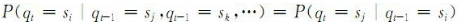
 - （不带时间t）**马尔可夫模型：如果只考虑上式独立于时间t的随机过程**，该随机过程称为马尔可夫模型：
   
    
    
    - 其中状态转移`a_{ij}`满足下边条件：
    
        
 - **状态转移矩阵**：有N个状态的一阶马尔可夫过程有`N^2`次状态转移，其`N^2`个状态转移概率可以表示成一个状态转移矩阵
    - 例如，一段文字中名词、动 词、形容词三类词性出现的情况可由三个状态的马尔可夫模型描述：
      
        ```
        状态s1：名词
        状态s2：动词
        状态s3：形容词
        ```
    - 假设状态之间的转移矩阵如下：
      
        
    - 如果在该段文字中某一句子的第一个词为名词，那么根据这一模型M，在该句子中这三类词的出现顺序为`O＝“名动形名”`的概率为：
      
        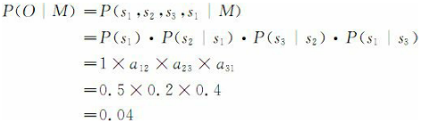
    - 系统初始化时可以定义一个初始状态的概率向量`πi≥0`，其中
 - **马尔可夫模型又可视为随机的有限状态机**，可以看作是一个转移弧上有概率的非确定的有限状态自动机
 - n元语法模型，当n＝2时，实际上就是一个马尔可夫模型。当n≥3时，就不是一个马尔可夫模型，因为它不符合马尔可夫模型的基本约束。对于n≥3的n元语法模型确定数量的历史来说，可以通过将状态空间描述成多重前面状态的交叉乘积的方式，将其转换成马尔可夫模型。
 - n元语法模型就是n-1阶马尔可夫模型。


## 4、隐马尔可夫模型
### 4.1、一般概念
 - 在马尔可夫模型（可视马尔可夫模型，限制了模型的适应性）中，每个状态代表了一个可观察的事件。（状态 == 可观察事件）
 - HMM的含义可用下边例子说明：

    ```
    假定一[暗室]中有N个口袋，每个口袋中有M种不同颜色的球。
    
    （状态）        口袋：  1    2    3   ...   N
    （状态的输出符号）球：   M种  M种   M种       M种
    
     - 1.小明根据某一概率分布alpha，随机地选取一个初始口袋。
     - 2.从中根据不同颜色的球的概率分布beta_1，随机地取出一个球。
     - 3.并向室外的人报告该球的颜色。
     - 4.然后，再根据口袋的概率分布alpha，选择另一个口袋。
     - 5.根据不同颜色的球的概率分布beta_2，从中随机选择另外一个球。
     - 6.重复上述过程。
    ```
    
    - 对于暗室外边的人来说，**可观察的过程只是不同颜色的球的序列，而口袋的序列是不可观察的**。
    - 在这个过程中，**每个口袋对应于HMM中的状态，球的颜色对应于HMM中状态的输出符号，从一个口袋转向另一个口袋对应于状态转换，从口袋中取出球的颜色对应于从一个状态输出的观察符号**。
    - **双随机过程**：（类似于隐狄利克雷分布/LDA的思想？）
        - 随机过程1：状态之间的转移是随机的（根据状态的概率分布alpha来确定）
        - 随机过程2：从特定状态输出的观察符号是随机的（根据符号的概率分布beta_i来确定）
 - 我们不知道模型所经过的状态序列，只知道状态的概率函数（概率分布alpha），观察到的事件是状态的随机函数（概率分布beta_i），因此，该模型是一个双重的随机过程。其中，模型的状态转换过程是不可观察的，即隐蔽的，可观察事件的随机过程是隐蔽的状态转换过程的随机函数。
   
    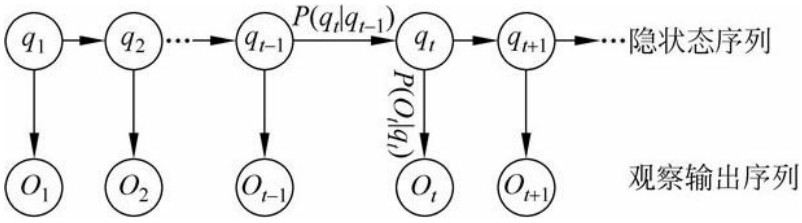
 - 一个HMM由如下几个部分组成：
    - （1）模型中状态的数目N（上例中口袋的数目）；
    - （2）从每个状态可能输出的不同符号的数目M（上例中球的不同颜色的数目）；
    - （3）状态转移概率矩阵（`a_{ij}`为小明从一个口袋（状态si）转向另一个口袋（sj）取球的概率），其中：
      
        
    - （4）从状态sj观察到符号vk的概率分布矩阵（`b_j(k)`为小明从第j个口袋中取出第k种颜色的球的概率），其中：
      
        
        
        观察符号的概率又称符号发射概率。
    - （5）初始状态概率分布`π＝{πi}`，其中：
      
        
 - 一般地，一个HMM记为一个五元组`μ＝（S，K，A，B，π）`，其中，S为状态的集合，K为输出符号的集合，π，A和B分别是初始状态的概率分布、状态转移概率和符号发射概率。为了简单记为三元组`μ＝（A，B，π）`。
 - 假设给定模型`μ＝（A，B，π）`，那么，观察序列可以由下面的步骤直接产生：
    - （1）根据初始状态的概率分布`πi`选择一个初始状态`q1＝si`；
    - （2）设`t＝1`；
    - （3）根据状态si的输出概率分布`bi（k）`输出`Ot＝vk`；
    - （4）根据状态转移概率分布`aij`，将当前时刻t的状态转移到新的状态`q_{t＋1}＝sj`；
    - （5）`t＝t＋1`，如果`t＜T`，重复执行步骤（3）和（4），否则，结束算法。
 - HMM属于典型的生成式模型。要从训练数据中学到数据的各种分布，那么有哪些分布呢以及是什么呢？正是HMM的5要素，其中有3个就是整个数据的不同角度的概率分布：
   
    
    
    **HMM在训练过程中学习的就是A、B这两个分布（生成式模型）**。
 - HMM的图示：
   
    
    
    - `i_t`是隐状态（即label），不能被观测，因为要被预测
    - `o_t`是能被观测的（即需要被标注的词）
    - 箭头表示依赖生成关系，`i_t`在A的指导下生成`i_{t+1}`，在B的指导下生成`o_t`
    
        ```
        例子：
        input: "学习出一个模型，然后再预测出一条指定"
        expected output: 学/B 习/E 出/S 一/B 个/E 模/B 型/E ，/S 然/B 后/E 再/E 预/B 测/E ……
        
         - 其中，input里面所有的char构成的字表，形成观测集M，因为字序列在inference阶段是我所能看见的；
         - 标注集BES构成隐藏状态集N，这是我无法直接获取的，也是我的预测任务；
         - 至于A、B、Pi，这些概率分布信息（上帝信息）都是我在学习过程中所确定的参数。
        ```
    
    
 - HMM中有三个基本问题：
    - （1）**（解码问题）估计问题**：给定一个观察序列和模型`μ＝（A，B，π）`，如何快速地计算出给定模型μ情况下，**观察序列O的概率**，即`P（O|μ）`？
    - （2）**序列问题**：给定一个观察序列和模型`μ＝（A，B，π）`，如何快速有效地选择在一定意义下**“最优”的状态序列**`Q＝q1q2…qT`，使得该状态序列“最好地解释”观察序列？
    - （3）**训练问题或参数估计问题**：给定一个观察序列，如何根据最大似然估计来**求模型的参数值**？即如何调节模型`μ＝（A，B，π）`的参数，使得`P（O|μ）`最大？

### 4.2、对于问题1：求观察序列的概率
 - 在序列标注问题中，我用一批完整的数据训练出了一支HMM模型即可。好，那在序列分类问题就不是训练一个HMM模型了。
   
    ```
    目标：识别声音是A发出的还是B发出的。
    HMM建模过程：
    1.训练：我将所有A说的语音数据作为dataset_A,将所有B说的语音数据作为dataset_B
    （当然，先要分别对dataset A ,B做预处理encode为元数据节点，形成sequences）,
    然后分别用dataset_A、dataset_B去训练出HMM_A/HMM_B      
    2.inference：来了一条新的sample（sequence），我不知道是A的还是B的，没问题，
    分别用HMM_A/HMM_B计算一遍序列的概率得到P_A(S)、P_B(S)，比较两者大小，哪个概率
    大说明哪个更合理，更大概率作为目标类别。
    
    重点在于，如何对一条序列计算其整体的概率。
    即目标是计算出P(O|lambda)
     - 直接计算法（穷举搜索）
     - 前向算法
     - 后向算法
     
    后面两个算法采用了DP思想，减少计算量，即每一次直接引用前一个时刻的计算结果以避免重复计算，跟Viterbi一样的技巧。
    ```
 - 传统方法需要穷举所有可能的状态序列来求解该问题，时间复杂度为`N^T`，不现实。
 - 使用前向算法（前向计算过程）/后向算法（后向计算过程），利用动态规划来解决该问题，时间复杂度为`O(N^2 T)`。
    - 较长子路径（时刻t）的概率可以由较短子路径（时刻t-1）的概率计算出来。
    - **动态规划的子问题专指在求解时刻t的解时，t-1时刻的问题的解就是子问题的解，t-2时刻不考虑，因为该子问题已经被t-1时刻用过了**。
    - 在这里用的前向算法和后向算法使用了动态规划的思想，即：逐步计算，这样的好处是使得后边的计算可以直接复用前边已经计算的结果（可以看成子问题的结果，比如求解t时，直接用`t-1`时得到的结果，不用再重新计算`t-2,t-3,...`等时刻的结果，时间复杂度为`O(N^2 T)`。如果枚举所有可能的状态序列的话，时间复杂度为`O(N^T)`，因为这样会重复计算一些之前已经计算过的子问题。**细细品一下！**）
 - 前向算法：

    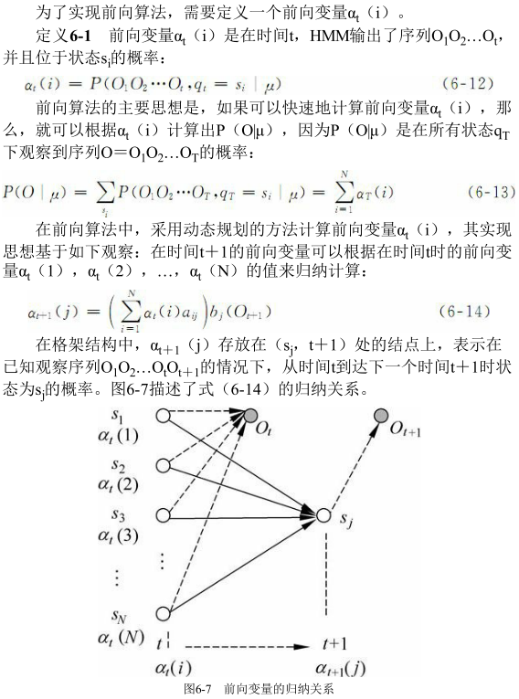
    
 - 后向算法：

    
    
    


### 4.3、对于问题2：最优的状态序列（序列标注/解码过程）（维特比算法）
 - 学习完了HMM的分布参数，也就确定了一个HMM模型。需要注意的是，这个HMM是对我这一批全部的数据进行训练所得到的参数。对于序列标注问题，我们只需要学习出一个HMM模型即可，后面所有的新的sample我都用这一个HMM去apply。
   
    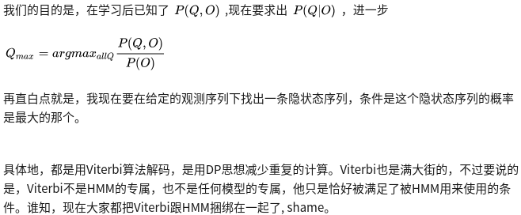
 - 维特比算法得到的是全局最优解：**维特比算法每一步都会保留当前步的所有N个状态各自的最优解，计算当前时刻每个状态到达下一时刻每个状态的值，对于下一时刻的每个状态而言，只保留从上一时刻到达该时刻该状态的最优路径（相当于所有路径都做了考虑，每次都丢弃到达每个状态的非最优路径），避免了贪心算法的局部最优解的问题**。
 - 即求解，这种理解避免了“断序”的问题。**优化的不是状态序列中的单个状态，而是整个状态序列**，不合法的状态序列的概率为0，因此，不可能被选为最优状态序列。
   
    
    
    仔细体会下，**维特比算法每次都会选择一个最优的j作为到达当前状态最优的一个路径**。
 - **维特比算法运用动态规划的搜索算法求解这种最优状态序列**。
 - 维特比算法的时间复杂度和前向算法/后向算法的时间复杂度一致，都是`O(N^2 T)`。


### 4.4、对于问题3：HMM的参数估计
 - 方法1：极大似然估计
   
    
 - 方法2：Baum-Welch(前向后向)
    
    - 就是一个EM的过程，EM的过程就是初始化一套值，然后迭代计算，根据结果再调整值，再迭代，最后收敛


## 5、最大熵马尔科夫模型（MEMM）

### 5.1、基本概念
 - MEMM是判别模型，上来就**直接为了确定边界而去建模**，比如说序列求概率（分类）问题，我直接考虑找出函数分类边界。这一点跟HMM的思维方式发生了很大的变化。
   
    
    
    
 - 标注偏置问题：
   
    
    
    
    
    - 在上图中，状态1偏向于转移到状态2，而状态2总倾向于停留在状态2。
    - 由于分支数不同，概率的分布不均衡，导致状态的转移存在不公平的情况。
    - 上图中可看出，从同一个圆圈发出的路径，权重值倾向于一直维持在状态2（最大），即局部归一化的结果。
 - 标注偏置问题产生的原因：

    
    
    - 其中一个原因是熵低的状态转移分布会忽略它们的观察输出
    - 而另一个原因是MEMM像HMM一样，其参数训练过程是自左向右依据前面已经标注的标记进行的，一旦在实际测试时前面的标记不能确定时，MEMM往往难以处理。


## 6、条件随机场

### 6.1、基本概念
 - 给定一个联合概率分布`P(Y)`和表示它的无向图G。**定义无向图表示的随机变量之间存在的**：
    - **成对马尔可夫性**：
        - 结点u和结点v没有边连接，分别对应随机变量`Y_u`和`Y_v`。
        - 其它所有结点为O，对应随机变量组是`Y_O`。
        - 给定`Y_O`条件下，`Y_u`和`Y_v`是条件独立的：
          
            
        - **也就是说没有边连接的结点两两之间是相互条件独立的**。
    - **局部马尔可夫性**：
        - v为任意一个结点，W是与v有边连接的所有结点，O是其它结点。
        - 给定`Y_W`的条件下，`Y_v`和`Y_O`是独立的。
          
            
        - **也就是任意结点和与其没有边连接的结点组之间是相互独立的，该结点组不影响该结点的概率分布**。
    - **全局马尔可夫性**：
        - 结点集合A，B实在G中被结点集合C分开的任意结点集合。
        - 给定`Y_C`条件下，`Y_A`和`Y_B`是条件独立的。
          
            
        - **即没有边连接的结点组之间是相互独立的**。
 - **马尔可夫随机场：（即概率无向图模型，是一个可以由无向图表示的联合概率分布）在G中，结点表示随机变量，边表示随机变量之间的依赖关系，如果联合概率分布`P(Y)`满足成对、局部和全局马尔可夫性**，就称此联合概率分布为概率无向图模型或马尔可夫随机场。
 - 概率无向图模型的因子分解：
   
    
    
    **即将概率无向图模型的联合概率分布表示为其最大团上的随机变量的函数的乘积形式的操作**。


### 6.2、CRF的定义与形式
 - **条件随机场是在给定的随机变量X（即观测序列`o1,o2,...oi`）条件下，随机变量Y（即隐状态序列`i1,i2,...,ii`）的马尔科夫随机场**。
   
    
    
    - 因为是判别模型，所以上来就直接为了确定边界而去建模，因为我创造出来就是为了这个分边界的目的的。
    - 比如说序列求概率（分类）问题，我直接考虑找出函数分类边界。所以才为什么会有这个公式。
 - 决定当前状态（label）的因素：
    - 上一时刻的label `y_{i-1}`
    - 当前时刻的label `y_i` （待求）
    - 整个观测序列X
    - 当前位置的观测i
 - 特征函数
   
    
    
    
    
    - `t_j`是转移函数，表示对于观察序列X其标注序列在i及i－1位置上标记的转移概率。
    - `s_l`是状态函数，表示对于观察序列X其i位置的标记概率。
    - 最后将所得的分数进行log线性表示，求和后归一化，即可得到概率值，即log线性模型。
 - 模型运行过程：
   
    
 - 在序列标注过程中，路径求解过程还是一样，采用viterbi算法。
 - --------------------------------------- 分割线 ---------------------------------------
 - CRF是给定输入随机变量X的条件下，输出随机变量Y构成一个由无向图表示的马尔可夫随机场，即：
   
    
    
    上述公式的核心思想就是**与v没有边连接的所有结点对结点v都没用，可以忽略**。
 - linear chain CRF的定义如下：
   
    
    
    - 在现实应用中主要是下图的结构，即X和Y具有相同的图结构。
    - 定义：
    
    
 - 其特点是：**假设输出随机变量Y构成马尔可夫随机场**，这样做易于**将联合概率分布进行因子分解**。
 - 在标注问题的应用里，使用linear-chain CRF，这时，问题变成了判别模型，形式为对数线性模型。即**对于给定的观测序列X（即需要被标注的序列）和输出标记序列Y（即状态序列），条件随机场通过定义条件概率`P（Y|X）`，而不是联合概率分布`P（X，Y）`来描述模型**。
   
    ```
    输入序列X --> 即观测序列 （需要被标注的序列）
    
    输出序列Y --> 即状态序列
    ```
    
    所以**标注问题就是求解最优的状态序列！**就是HMM中的第2个问题。
 - CRF学习时利用训练集通过极大似然估计或正则化的极大似然估计得到条件概率模型，
 预测时对于给定的输入序列x，求出最大的输出序列。


### 6.3、CRF++分析
#### 6.3.1、CRF++实例讲解
 - 有一批语料数据，并且已经tokenized好了：
   
    ```
    Nuclear
    theory
    devoted
    major
    efforts
    ……
    ```
 - 并且我先确定了13个标注元素：
   
    ```
    B_MAT
    B_PRO
    B_TAS
    E_MAT
    E_PRO
    E_TAS
    I_MAT
    I_PRO
    I_TAS
    O
    S_MAT
    S_PRO
    S_TAS
    ```
 - 1. 定义模板
    - 按道理应该是定义特征函数才对吧？好的，在CRF++下，应该是先定义特征模板，然后用模板自动批量产生大量的特征函数。我之前也蛮confused的，用完CRF++还以为模板就是特征，后面就搞清楚了：每一条模板将在每一个token处生产若干个特征函数。
    - CRF++的模板（template）有U系列（unigram）、B系列(bigram)。
    
        ```
        U00:%x[-2,0]
        U01:%x[-1,0]
        U02:%x[0,0]
        U03:%x[1,0]
        U04:%x[2,0] 
        
        U05:%x[-2,0]/%x[-1,0]/%x[0,0]
        U06:%x[-1,0]/%x[0,0]/%x[1,0]
        U07:%x[0,0]/%x[1,0]/%x[2,0]
        U08:%x[-1,0]/%x[0,0]
        U09:%x[0,0]/%x[1,0] 
        
        B
        ```
    
        所以，U00 - U09 我定义了10个模板。
 - 2.产生特征函数
    - 是的，会产生大量的特征。
    - U00-U04的模板产生的是状态特征函数；
    - U05-U09的模板产生的是转移特征函数。
 - 3.求参：对上述的各个特征以及初始权重进行迭代参数学习。
 - 4.预测解码，结果是这样的：
   
    ```
    Nuclear BTAS
    theory ETAS
    devoted O
    major O
    efforts O
    ……
    ```

#### 6.3.2、LSTM+CRF

##### 6.3.2.1、perspectively
 - 大家都知道，LSTM已经可以胜任序列标注问题了，为每个token预测一个label（LSTM后面接:分类器）；而CRF也是一样的，为每个token预测一个label。
 - 但是，他们的预测机理是不同的：
    - **CRF是全局范围内统计归一化的条件状态转移概率矩阵**，再预测出一条指定的sample的每个token的label；
    - LSTM是依靠神经网络的超强非线性拟合能力，在训练时将samples通过复杂到让你窒息的高阶高纬度异度空间的非线性变换，学习出一个模型，然后再预测出一条指定的sample的每个token的label。


##### 6.3.2.2、模型
 - 既然LSTM都OK了，为啥搞一个LSTM+CRF的hybrid model? 因为a single LSTM预测出来的标注有问题！举个segmentation例子(BES; char level)，plain LSTM 会搞出这样的结果：
   
    ```
    input: "学习出一个模型，然后再预测出一条指定"
    expected output: 学/B 习/E 出/S 一/B 个/E 模/B 型/E ，/S 然/B 后/E 再/E 预/B 测/E ……
    real output: 学/B 习/E 出/S 一/B 个/B 模/B 型/E ，/S 然/B 后/B 再/E 预/B 测/E ……
    ```
    
    - 用LSTM会出现上述的错误：在B之后再来一个B。
    - 这个错误在CRF中是不存在的，因为CRF的特征函数的存在就是为了对given序列观察学习各种特征（n-gram，窗口），这些特征就是在限定窗口size下的各种词之间的关系。
    - 然后一般都会学到这样的一条规律（特征）：B后面接E，不会出现E。这个限定特征会使得CRF的预测结果不出现上述例子的错误。
    - 把CRF接到LSTM上面，把LSTM在time step上把每一个hidden state的tensor输入给CRF，让LSTM负责在CRF的特征限定下，依照新的loss function，学习出一套新的非线性变换空间。


## 7、HMM、MEMM、CRF之间的关系和区别？
 - HMM基于双随机过程
 - linear chain CRF基于马尔可夫随机场
 - 相对于HMM，CRF的主要优点在于它的条件随机性，只需要考虑当前已经出现的观测状态的特性，没有独立性的严格要求，
 对于整个序列内部的信息和外部观测信息均可有效利用，避免了MEMM和其他针对线性序列模型的条件马尔可夫模型会出现的标识偏置问题。
 CRF具有MEMM的一切优点，两者的关键区别在于，MEMM使用每一个状态的指数模型来计算给定前一个状态下当前状态的条件概率，而CRF用
 单个指数模型来计算给定观察序列与整个标记序列的联合概率。因此，不同状态的不同特征权重可以相互交替代换。
 - 三者的区别：

    
    
    其中`X_{1:n}`是整个观测序列（输入的原始句子）。
 - HMM-->MEMM：
    - HMM模型中存在两个假设：
        - 一是输出观察值之间严格独立
        - 二是状态的转移过程中当前状态只与前一状态有关（一阶马尔可夫模型）。
    - 但实际上序列标注问题不仅和单个词相关，而且和观察序列的长度，单词的上下文等等相关。
    - MEMM解决了HMM输出独立性假设的问题。因为HMM只限定在了观测与状态之间的依赖，而MEMM引入**自定义特征函数，不仅可以表达观测之间的依赖，还可表示当前观测与前后多个状态之间的复杂依赖（只需要定义相应的特征函数即可）**。
 - MEMM-->CRF：
    - CRF不仅解决了HMM输出独立性假设的问题，还解决了MEMM的标注偏置问题。
    - MEMM容易陷入局部最优是因为只在局部做归一化，而CRF统计了全局概率，在做归一化时考虑了数据在全局的分布，而不是仅仅在局部归一化，这样就解决了MEMM中的标记偏置的问题。使得序列标注的解码变得最优解。
    - HMM、MEMM属于有向图，所以考虑了x与y的影响，但HMM没将x当做整体考虑进去。
    - CRF属于无向图，没有这种依赖性，克服此问题。
 - 这三个模型都可以用来做序列标注模型。但是其各自有自身的特点，
   
    ```
    举个例子，对于一个标注任务，
         "我  爱 北  京 天  安 门"，
    标注为" s  s  b  e  b  c  e"

     - 对于HMM的话，其判断这个标注成立的概率为
     P= P(s转移到s)*P('我'表现为s)* P(s转移到b)*P('爱'表现为s)* ...*P().
     
     训练时，要统计**状态转移概率矩阵**和表现矩阵。
     - 对于MEMM的话，其判断这个标注成立的概率为 
     P= P(s转移到s|'我'表现为s)*P('我'表现为s)* P(s转移到b|'爱'表现为s)*P('爱'表现为s)*..
     
     训练时，要统计**条件状态转移概率矩阵**和表现矩阵。
     - 对于CRF的话，其判断这个标注成立的概率为 
     P= F(s转移到s,'我'表现为s)....F为一个函数，
     
     是在全局范围统计归一化的概率而不是像MEMM在局部统计归一化的概率。
    ```
    
    - HMM模型是对转移概率和表现概率直接建模，统计共现概率。
    - 而MEMM模型是对转移概率和表现概率建立联合概率（根据`P(X,Y)=P(Y|X)P(X)`获得），统计时统计的是条件概率。
    - MEMM容易陷入局部最优，是因为MEMM只在局部做归一化，而CRF模型中，统计了全局概率，在做归一化时，考虑了数据在全局的分布，而不是仅仅在局部归一化，这样就解决了MEMM中的标记偏置的问题。


## 8、参考文献
 - [逻辑回归与朴素贝叶斯有什么区别？](https://www.zhihu.com/question/265995680/answer/303148257)
 - [概率图模型体系：HMM、MEMM、CRF](https://zhuanlan.zhihu.com/p/33397147)
 - [标注偏置问题(Label Bias Problem)和HMM、MEMM、CRF模型比较](https://blog.csdn.net/zhoubl668/article/details/7787690)
 - [标注偏置问题(Label Bias Problem)和HMM、MEMM、CRF模型比较<转>](https://www.cnblogs.com/syx-1987/p/4077325.html)


# 三、激活函数、优化函数、范数
## 1、激活函数
### 1.1、一般概念
 - 激活函数：把输入信号的总和转换为输出信号的转换器。
 - 它的关键在于如何去激活输入信号的总和。

### 1.2、为什么需要激活函数？
 - 如果不用激励函数（其实相当于激励函数是`f(x) = x`），在这种情况下你每一层节点的输入都是上层输出的线性函数，很容易验证，无论你神经网络有多少层，输出都是输入的线性组合，与没有隐藏层效果相当，这种情况就是最原始的感知机了，那么网络的逼近能力就相当有限。
 正因为上面的原因，**引入非线性函数作为激励函数，这样深层神经网络表达能力就更加强大（不再是输入的线性组合，而是几乎可以逼近任意函数）**

### 1.3、常用激活函数
#### 1.3.1、Sigmoid函数
 - Sigmoid是常用的非线性的激活函数，它的数学形式如下：
    
    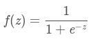
 - 几何图像：
    
    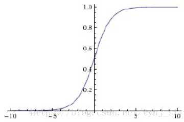
 - 它能够把输入的连续实值变换为0和1之间的输出，特别的，如果是非常大的负数，那么输出就是0；如果是非常大的正数，输出就是1
 - 缺点：
    - 在深度神经网络中梯度反向传递时导致梯度爆炸和梯度消失，其中梯度爆炸发生的概率非常小，而梯度消失发生的概率比较大
        
        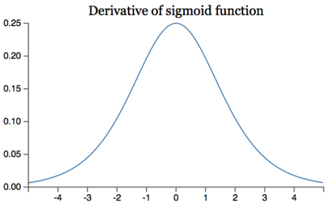
    Sigmoid函数的导数
    - 原因：
        - （梯度消失）如果我们初始化神经网络的权值为`[0,1]`之间的随机值，由反向传播算法的数学推导可知，梯度从后向前传播时，每传递一层梯度值都会减小为原来的0.25倍，如果神经网络隐层特别多，那么梯度在穿过多层后将变得非常小接近于0，即出现梯度消失现象；
        - （梯度爆炸）当网络权值初始化为`(1,+∞)`区间内的值，则会出现梯度爆炸情况。
    - Sigmoid的输出不是0均值（不是zero-centered）。这是不可取的，因为这会导致后一层的神经元将得到上一层输出的非0均值的信号作为输入。产生的一个结果就是：如x>0,那么`f = wx + b`对w求局部梯度则都为正，这样在反向传播的过程中w要么都往正方向更新，要么都往负方向更新，导致有一种捆绑的效果，使得收敛缓慢。
    当然了，**如果按batch去训练，那么那个batch可能得到不同的信号，所以这个问题还是可以缓解一下的**。因此，非0均值这个问题虽然会产生一些不好的影响，不过跟上面提到的梯度消失问题相比还是要好很多的。
    - 其解析式中含有幂运算，计算机求解时相对来讲比较耗时。对于规模比较大的深度网络，这会较大地增加训练时间

#### 1.3.2、tanh函数
 - tanh函数解析式：
    
    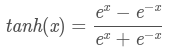
 - tanh函数及其导数的几何图像如下图：
    
    
    
    取值范围`[-1, 1]`，0中心对称。
 - 它解决了Sigmoid函数的不是zero-centered输出问题，然而，梯度消失的问题和幂运算的问题仍然存在。
 
#### 1.3.3、Relu函数
 - Relu函数的解析式：
    
    
 - Relu函数及其导数的图像如下图所示：
    
    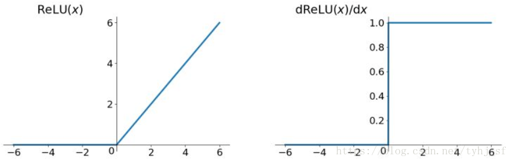
 - ReLU函数其实就是一个取最大值函数，注意这并不是全区间可导的
 - 优点：
    - 1）解决了gradient vanishing问题 (在正区间)
    - 2）计算速度非常快，只需要判断输入是否大于0
    - 3）收敛速度远快于sigmoid和tanh
 - 缺点：
    - 1）ReLU的输出不是zero-centered
    - 2）Dead ReLU Problem，指的是某些神经元可能永远不会被激活，导致相应的参数永远不能被更新。有两个主要原因可能导致这种情况产生: 
        - (1) 非常不幸的参数初始化，这种情况比较少见 
        - (2) learning rate太高导致在训练过程中参数更新太大，不幸使网络进入这种状态。
        - 解决方法是可以采用Xavier初始化方法，以及避免将learning rate设置太大或使用adagrad等自动调节learning rate的算法。
 
### 1.4、Leaky ReLU函数（PReLU）
 - 函数表达式：
    
    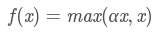
 - Leaky Relu函数及其导数的图像如下图所示：
    
    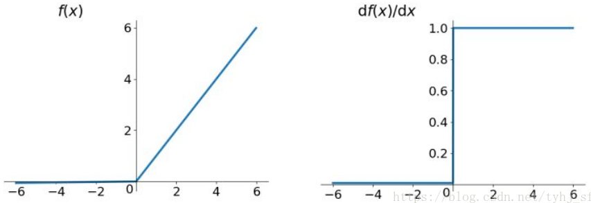
    
    左半边直线斜率非常接近0，所以看起来像是平的。就不改了，α=0.01看起来就是这样的。
 - 为了解决Dead ReLU Problem，提出了将ReLU的前半段设为αx而非0，通常α=0.01
 - 理论上来讲，Leaky ReLU有ReLU的所有优点，外加不会有Dead ReLU问题，但是在实际操作当中，并没有完全证明Leaky ReLU总是好于ReLU
 
### 1.5、MaxOut函数
 - TODO

### 1.6、如何选择合适的激活函数？
 - 总体上来讲，训练深度学习网络尽量使用zero-centered数据 (可以经过数据预处理实现) 和zero-centered输出。所以要尽量选择输出具有zero-centered特点的激活函数以加快模型的收敛速度。
 - 如果使用ReLU，那么一定要小心设置learning rate，而且要注意不要让网络出现很多 “dead” 神经元，如果这个问题不好解决，那么可以试试Leaky ReLU、PReLU或者Maxout.
 - 最好不要用sigmoid，可以试试tanh，不过可以预期它的效果会比不上ReLU和Maxout.

### 1.7、激活函数中的硬饱和，软饱和，左饱和和右饱和
 - 当我们的n趋近于正无穷，激活函数的导数趋近于0，那么我们称之为右饱和。
 - 当我们的n趋近于负无穷，激活函数的导数趋近于0，那么我们称之为左饱和。
 - 当一个函数既满足左饱和又满足右饱和的时候我们就称之为饱和，典型的函数有Sigmoid，Tanh函数。
 - 对于任意的x，如果存在常数c，当x>c时，恒有=0，则称其为右硬饱和。如果对于任意的x，如果存在常数c，当x<c时，恒有=0,则称其为左硬饱和。既满足左硬饱和又满足右硬饱和的我们称这种函数为硬饱和。
 - 对于任意的x，如果存在常数c，当x>c时，恒有趋近于0，则称其为右软饱和。如果对于任意的x，如果存在常数c，当x<c时，恒有趋近于0,则称其为左软饱和。既满足左软饱和又满足右软饱和的我们称这种函数为软饱和。


## 2、优化函数
### 2.1、一般概念
 - 深度学习优化算法经历了`SGD -> SGDM -> NAG ->AdaGrad -> AdaDelta -> Adam -> Nadam`这样的发展历程。
 - 通用优化算法框架：

    
 - 步骤3、4对于各个算法都是一致的，主要的差别就体现在1和2上。

### 2.2、SGD
 - SGD没有动量的概念

    
 - SGD最大的缺点是下降速度慢，而且可能会在沟壑的两边持续震荡，停留在一个局部最优点

### 2.3、SGDM
 - 为了抑制SGD的震荡，SGDM认为梯度下降过程可以加入惯性。下坡的时候，如果发现是陡坡，那就利用惯性跑的快一些。
 - SGDM全称是SGD with momentum，在SGD基础上**引入了一阶动量**：

    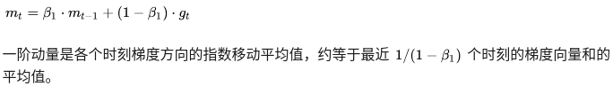
 - 也就是说，t时刻的下降方向，**不仅由当前点的梯度方向决定，而且由此前累积的下降方向决定**。
 - `Beta_1`的经验值为0.9，这就意味着下降方向主要是此前累积的下降方向，并略微偏向当前时刻的下降方向。
 - 想象高速公路上汽车转弯，在高速向前的同时略微偏向，急转弯可是要出事的。 

### 2.4、NAG
 - SGD还有一个问题是困在局部最优的沟壑里面震荡。
 - NAG全称Nesterov Accelerated Gradient，是在SGD、SGD-M的基础上的进一步改进，改进点在于步骤1。
 - 我们知道在时刻t的主要下降方向是由累积动量决定的，自己的梯度方向说了也不算，那与其看当前梯度方向，不如先看看如果跟着累积动量走了一步，那个时候再怎么走。
 - 因此，NAG在步骤1，**不计算当前位置的梯度方向，而是计算如果按照累积动量走了一步，那个时候的下降方向**：

    
 - 然后用下一个点的梯度方向，与历史累积动量相结合，计算步骤2中当前时刻的累积动量。

### 2.5、AdaGrad
 - 此前我们都没有用到二阶动量。二阶动量的出现，才意味着“自适应学习率”优化算法时代的到来。
 - SGD及其变种以同样的学习率更新每个参数，但深度神经网络往往包含大量的参数，这些参数并不是总会用得到（想想大规模的embedding）。
 - 对于经常更新的参数，我们已经积累了大量关于它的知识，不希望被单个样本影响太大，希望学习速率慢一些；（**对于经常更新的参数，希望学习速率慢一些**）
 - 对于偶尔更新的参数，我们了解的信息太少，希望能从每个偶然出现的样本身上多学一些，即学习速率大一些。（**对于偶尔更新的参数，希望学习速率大一些**）

    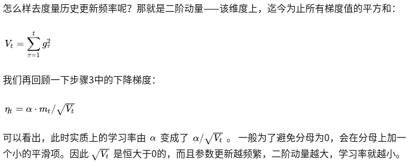
    
    参数更新越频繁，二阶动量越大，学习率就越小。
 - 这一方法在稀疏数据场景下表现非常好。但也存在一些问题：因为`sqrt(V_t)`是单调递增的，会使得学习率单调递减至0，可能会使得训练过程提前结束，即便后续还有数据也无法学到必要的知识。

### 2.6、AdaDelta/RMSProp
 - 由于AdaGrad单调递减的学习率变化过于激进
 - 我们考虑一个改变二阶动量计算方法的策略：**不累积全部历史梯度，而只关注过去一段时间窗口的下降梯度**。这也就是AdaDelta名称中Delta的来历。
 - 修改的思路很简单。前面我们讲到，**指数移动平均值大约就是过去一段时间的平均值**，因此我们用这一方法来计算二阶累积动量：

    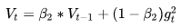
 - 这就避免了二阶动量持续累积、导致训练过程提前结束的问题了。

### 2.7、Adam
 - Adam和Nadam的出现就很自然而然了——它们是前述方法的集大成者。
 - 我们看到：
    - SGD-M在SGD基础上增加了一阶动量
    - AdaGrad和AdaDelta在SGD基础上增加了二阶动量。
    - 把一阶动量和二阶动量都用起来，就是Adam了——`Adaptive + Momentum`。
 - 因此，

    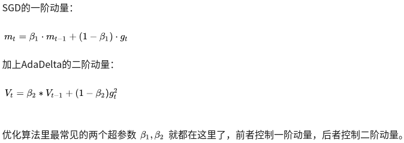
 - Adam的缺点：
    - 可能不收敛
    
        
        
        - 对于SGD和AdaGrad而言：
            - 其中，SGD没有用到二阶动量，因此学习率是恒定的（实际使用过程中会采用学习率衰减策略，因此学习率递减）。
            - AdaGrad的二阶动量不断累积，单调递增，因此学习率是单调递减的。
            - 因此，这两类算法会使得学习率不断递减，最终收敛到0，模型也得以收敛。
        - 对于AdaDelta和Adam而言：
            - 但AdaDelta和Adam则不然。
            - 二阶动量是固定时间窗口内的累积，随着时间窗口的变化，遇到的数据可能发生巨变，使得`V_t`可能会时大时小，不是单调变化。
            - 这就可能在训练后期引起学习率的震荡，导致模型无法收敛。
        - 一个修正的方法是：由于Adam中的学习率主要是由二阶动量控制的，为了保证算法的收敛，可以对二阶动量的变化进行控制，避免上下波动。
        
            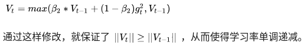
    - 可能错过全局最优解
        - 深度神经网络往往包含大量的参数，在这样一个维度极高的空间内，非凸的目标函数往往起起伏伏，拥有无数个高地和洼地。有的是高峰，通过引入动量可能很容易越过；但有些是高原，可能探索很多次都出不来，于是停止了训练。
        - 同样的一个优化问题，不同的优化算法可能会找到不同的答案，但自适应学习率的算法往往找到非常差的答案。
        - 自适应学习率算法可能会对前期出现的特征过拟合，后期才出现的特征很难纠正前期的拟合效果。
        - 有论文在CIFAR-10数据集上进行测试，发现Adam的收敛速度比SGD要快，但最终收敛的结果并没有SGD好。他们进一步实验发现，主要是后期Adam的学习率太低，影响了有效的收敛。他们试着对Adam的学习率的下界进行控制，发现效果好了很多。
        - 改进Adam的方法：前期用Adam，享受Adam快速收敛的优势；后期切换到SGD，慢慢寻找最优解。
        - 理解数据对于设计算法的必要性。优化算法的演变历史，都是基于对数据的某种假设而进行的优化，那么某种算法是否有效，就要看你的数据是否符合该算法的胃口了。

### 2.8、Nadam
 - NAG中Nesterov的思想是：不计算当前位置的梯度方向，而是计算如果按照累积动量走了一步，那个时候的下降方向
 - 最后是Nadam。我们说Adam是集大成者，但它居然遗漏了Nesterov，这还能忍？必须给它加上，按照NAG的步骤1：

    
 
    这就是`Nesterov + Adam = Nadam`了。

### 2.9、指数移动平均值的偏差修正
 - 前面我们讲到，一阶动量和二阶动量都是按照指数移动平均值进行计算的：

    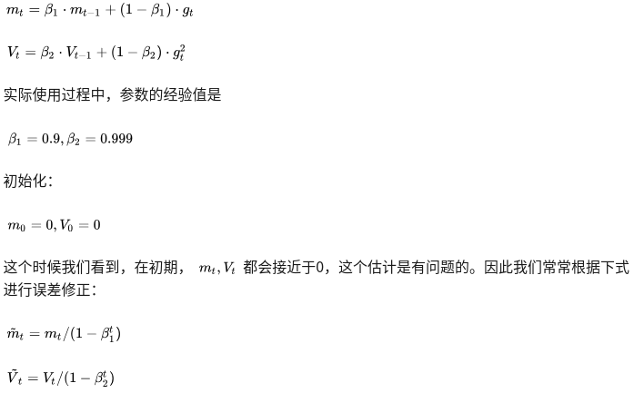

### 2.10、总结
 - 各类优化算法只是相当于在SGD基础上增加了各类学习率的主动控制。如果不想做精细的调优，那么Adam显然最便于直接拿来上手。
 - **学习率衰减的作用：**
    - 对于经常更新的参数而言，在参数更新的时候不希望变化很大，所以学习率要设置的小一点
    - 对于不常更新的参数或者在模型刚开始训练时，学习率更改设置大一点，因为大的学习率使得模型能够接触更多不一样的信息进行梯度下降
 - 不同优化算法最核心的区别，就是第三步所执行的下降方向：
   
    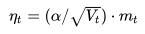
    
    - 这个式子中，前半部分是实际的学习率（也即下降步长），后半部分是实际的下降方向。
    - SGD算法的下降方向就是该位置的梯度方向的反方向，带一阶动量的SGD的下降方向则是该位置的一阶动量方向。
    - 自适应学习率类优化算法为每个参数设定了不同的学习率，在不同维度上设定不同步长，因此其下降方向是缩放过（scaled）的一阶动量方向。
    - 由于下降方向的不同，可能导致不同算法到达完全不同的局部最优点。
    - 不同算法在高原的时候，选择了不同的下降方向。
 - Adam+SGD组合策略
    - Adam等自适应学习率算法对于稀疏数据具有优势，且收敛速度很快；但精调参数的SGD（+Momentum）往往能够取得更好的最终结果。
    - 把这两者结合起来，先用Adam快速下降，再用SGD调优，涉及到两个问题：
        - 什么时候切换优化算法
        - 切换算法以后用什么样的学习率

### 2.11、优化算法的常用tricks
 - **首先，各大算法孰优孰劣并无定论。如果是刚入门，优先考虑SGD+Nesterov Momentum或者Adam**.
 - **选择你熟悉的算法**——这样你可以更加熟练地利用你的经验进行调参。
 - **充分了解你的数据**——如果模型是非常稀疏的，那么优先考虑自适应学习率的算法。
 - **根据你的需求来选择**——在模型设计实验过程中，要快速验证新模型的效果，可以先用Adam进行快速实验优化；在模型上线或者结果发布前，可以用精调的SGD进行模型的极致优化。
 - **先用小数据集进行实验**。有论文研究指出，随机梯度下降算法的收敛速度和数据集的大小的关系不大。因此可以先用一个具有代表性的小数据集进行实验，测试一下最好的优化算法，并通过参数搜索来寻找最优的训练参数。
 - **考虑不同算法的组合**。先用Adam进行快速下降，而后再换到SGD进行充分的调优。切换策略可以参考本文介绍的方法。
 - **数据集一定要充分的打散（shuffle）**。这样在使用自适应学习率算法的时候，可以避免某些特征集中出现，而导致的有时学习过度、有时学习不足，使得下降方向出现偏差的问题。
 - 训练过程中**持续监控训练数据和验证数据**上的目标函数值以及精度或者AUC等指标的变化情况。对训练数据的监控是要保证模型进行了充分的训练——下降方向正确，且学习率足够高；对验证数据的监控是为了避免出现过拟合。
 - **制定一个合适的学习率衰减策略**。可以使用定期衰减策略，比如每过多少个epoch就衰减一次；或者利用精度或者AUC等性能指标来监控，当测试集上的指标不变或者下跌时，就降低学习率。


## 3、范数
### 3.1、一般概念
 - 范数的本质是距离，存在的意义是为了实现比较。
 - 范数它其实是一个函数，它把不能比较的向量转换成可以比较的实数。
   
    ```
    例子：
    
    在一维实数集合中，我们随便取两个点4和9，我们知道9比4大，但是到了二维实数空间中，取两个点（1，1）和（0，3），
    这个时候我们就没办法比较它们之间的大小，因为它们不是可以比较的实数，于是我们引入范数这个概念，把我们的
    （1，1）和（0，3）通过范数分别映射到实数sqrt(2)和3 ，这样我们就比较这两个点了。
    ```

### 3.2、常见范数
 - 范数的定义：

    
    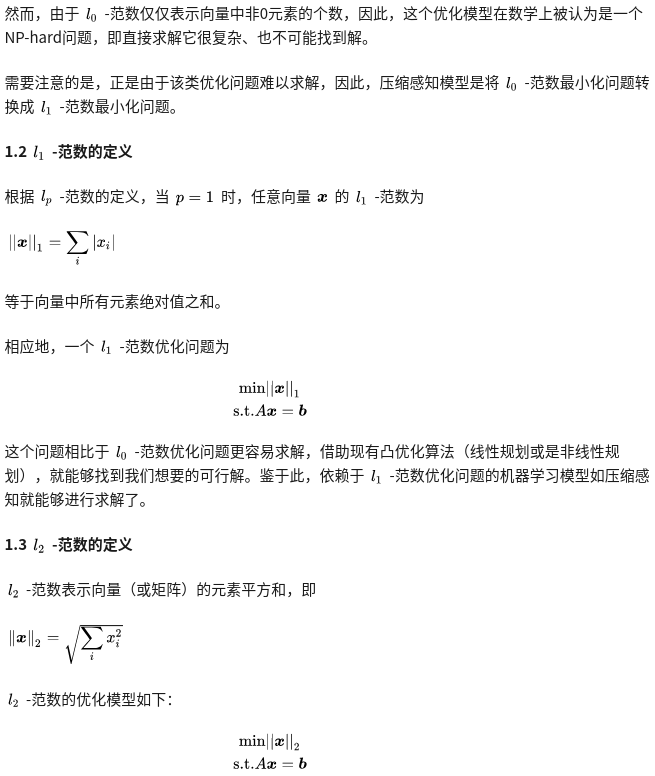
    
 - l1-范数会让你的模型变傻一点，相比于记住事物本身，此时机器人更倾向于**从数据中找到一些简单的模式**

    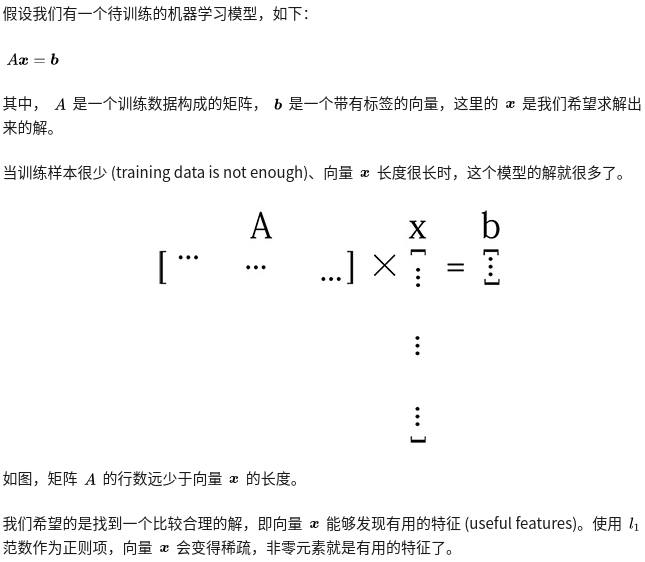

    - 使用l1-范数作为正则项，向量x会变得稀疏，非零元素就是有用的特征了。
    - 在稀疏的结果中，我们能够保证向量x的每个元素都是有用的！
    - 相当于从数据中找到了一些简单特征，这种稀疏可以避免过拟合。


## 4、参考文献
 - [如何通俗易懂地解释「范数」？](https://www.zhihu.com/search?type=content&q=%E8%8C%83%E6%95%B0)
 - [一个框架看懂优化算法](https://zhuanlan.zhihu.com/p/32230623)
 - [常用激活函数（激励函数）理解与总结](https://blog.csdn.net/tyhj_sf/article/details/79932893)


# 四、集成学习
## 1、一般概念
 - 集成学习 (ensemble learning)，目的是为提高泛化性能
 - 集成学习通过构建并结合多个学习器来完成学习任务，也被称为多分类器系统
 - **Bagging和Boosting的基模型都是线性组成的**
 - 先产生一组个体学习器，再用某种策略将它们结合起来，分为同质（这组学习器都是同一类型模型）和异质架构

    
 - 假设基分类器的错误率相互独立，随着集成中个体学习器数目T的增大，集成的错误率将指数级下降，最终趋向于0
 - 上边假设显然不能相互独立，一般的准确性很高之后，要增加多样性就需要牺牲准确性，如何产生并结合好而不同的个体学习器，是集成学习的核心
 - 常见的集成学习框架有三种：Bagging，Boosting和Stacking。
    - （Bagging和随即森林，并行）个体学习器间不存在强依赖关系（模型之间的相互独立性很强），可同时生成的并行化方法
        - 每个基学习器都会对训练集进行有放回抽样得到子训练集，比较著名的采样法为0.632自助法。
        - 每个基学习器基于不同子训练集进行训练，并综合所有基学习器的预测值得到最终的预测结果。
        - Bagging常用的综合方法是投票法，票数最多的类别为预测类别。
    - （Boosting，串行）个体学习器间存在强依赖关系（因为各模型间共用一套训练集），必须采用串行生成的序列化方法
        - Boosting训练过程为阶梯状，基模型的训练是有顺序的。
        - 每个基模型都会在前一个基模型学习的基础上进行学习，最终综合所有基模型的预测值产生最终的预测结果。
        - 用的比较多的综合方式为加权法。
    - （Stacking）一个模型用来训练来得到预测结果，第二个模型将第一个模型的输出作为特征进行训练，得到最后结果
        - Stacking是先用全部数据训练好基模型，然后每个基模型都对每个训练样本进行的预测。
        - 其预测值将作为训练样本的特征值，最终会得到新的训练样本。
        - 然后基于新的训练样本进行训练得到模型，然后得到最终预测结果。
 - 为什么集成学习会好于单个学习器呢？原因可能有三：
    - 训练样本可能无法选择出最好的单个学习器，由于没法选择出最好的学习器，所以干脆结合起来一起用；
    - 假设能找到最好的学习器，但由于算法运算的限制无法找到最优解，只能找到次优解，采用集成学习可以弥补算法的不足；
    - 可能算法无法得到最优解，而集成学习能够得到近似解。比如说最优解是一条对角线，而单个决策树得到的结果只能是平行于坐标轴的，但是集成学习可以去拟合这条对角线。
 - 如何从偏差和方差的角度来理解集成学习？
    - 我们常说集成学习中的基模型是弱模型，通常来说弱模型是偏差高（在训练集上准确度低）方差小（防止过拟合能力强）的模型，**但并不是所有集成学习框架中的基模型都是弱模型。Bagging和Stacking中的基模型为强模型（偏差低，方差高），而Boosting中的基模型为弱模型（偏差高，方差低）**。
    
        
    - 以上可知：模型的准确度可由偏差和方差共同决定
    - 下边是各集成模型的偏差与方差：
        - Bagging的偏差与方差
        
            
        - 通过上式可以看到：
            - **整体模型的期望等于基模型的期望，这也就意味着整体模型的偏差和基模型的偏差近似（都是偏差小）。**
            - **整体模型的方差小于等于基模型的方差，当且仅当相关性为1时取等号（也就是说各个子模型间要尽量相互独立才能获取较好的效果），随着基模型数量增多，整体模型的方差减少，从而防止过拟合的能力增强，模型的准确度得到提高**。但是，模型的准确度一定会无限逼近于1吗？并不一定，当基模型数增加到一定程度时，方差公式第一项的改变对整体方差的作用很小，防止过拟合的能力达到极限，这便是准确度的极限了。
            - 在此我们知道了为什么Bagging中的基模型一定要为强模型，如果Bagging使用弱模型则会导致整体模型的偏差提高，而准确度降低。
            - **Random Forest是经典的基于Bagging框架的模型，并在此基础上通过引入特征采样和样本采样来降低基模型间的相关性**，在公式中显著降低方差公式中的第二项，略微升高第一项，从而使得整体降低模型整体方差。
        - Boosting的偏差与方差
            - 对于Boosting来说，**由于基模型共用同一套训练集，所以基模型间具有强相关性**，故模型间的相关系数近似等于1
            
                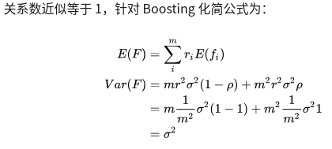
            - 通过观察整体方差的表达式我们容易发现：
                - 整体模型的方差等于基模型的方差，如果基模型不是弱模型，其方差相对较大，这将导致整体模型的方差很大，即无法达到防止过拟合的效果。因此，Boosting框架中的基模型必须为弱模型。
                - 此外Boosting框架中采用基于贪心策略的前向加法，**整体模型的期望由基模型的期望累加而成，所以随着基模型数的增多，整体模型的期望值增加，整体模型的准确度提高**（期望是试验中每次可能结果的概率乘以其结果的总和，比如对于分类模型而言，正类为1,负类为0,最后得出的期望值越大，证明结果中为1也就是正类的越多，所以期望值越大准确率越高）。
                - 基于Boosting框架的Gradient Boosting Decision Tree（GBDT）模型中基模型也为树模型，同Random Forrest的思想一样，我们也**可以对特征进行随机抽样来使基模型间的相关性降低，从而达到减少方差的效果**。
        - 总结：
            - 我们可以使用模型的偏差和方差来近似描述模型的准确度；
            - 对于Bagging来说，整体模型的偏差与基模型近似，而随着模型的增加可以降低整体模型的方差，故其基模型需要为强模型（强模型的偏差小，方差大）；
            - 对于Boosting来说，整体模型的方差近似等于基模型的方差，而整体模型的偏差由基模型累加而成，故基模型需要为弱模型（弱模型的偏差大，方差小）。

## 2、Boosting
 - Boosting是一族可将学习器提升为强学习器的算法
 - 工作机制是：
    - 先从初始训练集训练出一个基学习器，再根据基学习器的表现**对训练样本分布进行调整**，使得先前基学习器**做错的训练样本在后续受到更多关注**
    - 然后基于调整后的样本分布来训练下一个基学习器
    - 如此重复进行，直至基学习器数目达到事先指定的值T
    - 最终将这T个基学习器进行加权结合
 - 代表算法是AdaBoost：
    - AdaBoost（Adaptive Boosting，自适应增强），其自适应在于：
        - 前一个基本分类器分错的样本会得到加强，加权后的全体样本再次被用来训练下一个基本分类器。
        - 同时，在每一轮中加入一个新的弱分类器，直到达到某个预定的足够小的错误率或达到预先指定的最大迭代次数。
    - Adaboost迭代算法思想有三步：
        - 初始化训练样本的权值分布，每个样本具有相同权重；
        - 训练弱分类器，如果样本分类正确，则在构造下一个训练集中，它的权值就会被降低；反之提高。用更新过的样本集去训练下一个分类器；
        - 将所有弱分类组合成强分类器，各个弱分类器的训练过程结束后，加大分类误差率小的弱分类器的权重，降低分类误差率大的弱分类器的权重。
    - 损失函数：Adaboost模型是加法模型，学习算法为前向分步学习算法，损失函数为指数函数的分类问题。
    - 加法模型：最终的强分类器是由若干个弱分类器加权平均得到的。
    - 前向分布学习算法：算法是通过一轮轮的弱学习器学习，利用前一个弱学习器的结果来更新后一个弱学习器的训练集权重。
    - 正则化：
    
        
    - 优缺点：
        - 优点
            - 分类精度高；
            - 可以用各种回归分类模型来构建弱学习器，非常灵活；
            - 不容易发生过拟合。
        - 缺点
            - **对异常点敏感，异常点会获得较高权重**。
 - GBDT算法：
    - GBDT（Gradient Boosting Decision Tree）是一种迭代的决策树算法
    - 该算法由多棵决策树组成，它是属于Boosting策略。
    - GBDT是被公认的泛化能力较强的算法。
    - GBDT由三个概念组成：
        - 回归树（Regression Decision Tree，即 DT）
            - 回归树在分枝时会穷举每一个特征的每个阈值以找到最好的分割点，衡量标准是最小化均方误差。
            - 如果认为GBDT由很多分类树那就大错特错了（虽然调整后也可以分类）。
            - 对于分类树而言，其值加减无意义（如性别），而对于回归树而言，其值加减才是有意义的（如说年龄）。
            - **GBDT的核心在于累加所有树的结果作为最终结果，所以 GBDT 中的树都是回归树，不是分类树**，这一点相当重要。
        - 梯度迭代（Gradient Boosting，即 GB）
            - 上面说到GBDT的核心在于累加所有树的结果作为最终结果
            - **GBDT的每一棵树都是以之前树得到的残差来更新目标值**，这样每一棵树的值加起来即为GBDT的预测值。
            
                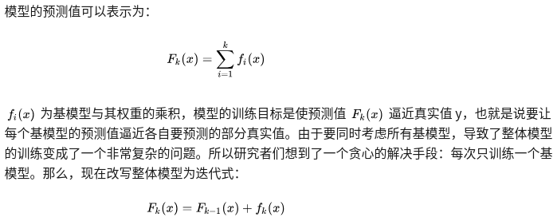
            
            **也就是说要让每个基模型的预测值逼近各自要预测的部分真实值**。
            
            举个例子：
                - 比如说A用户的年龄20岁，第一棵树预测结果为12岁，那么残差就是8
                - 第二棵树用8为目标进行学习，假设其预测值为5，那么其残差即为3
                - 如此继续学习即可。
            
            假设只有两个子树，那么模型最后的预测结果为：12+5=17
            - 那么Gradient从何体现？
                - 其实很简单，其残差其实是最小均方损失函数（回归树的衡量标准是最小化均方误差）关于预测值的反向梯度(划重点)
                - 也就是说，预测值和实际值的残差与损失函数的负梯度相同（即梯度下降的方向）
            - 但要注意，基于残差 GBDT 容易对异常值敏感，举例：
            
                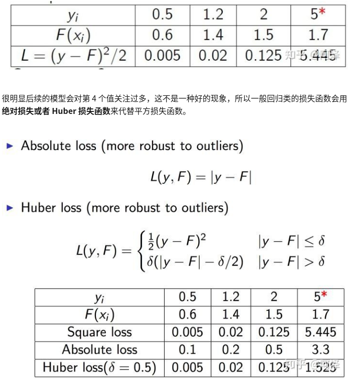
            
            绝对损失或者Huber损失函数想比于平方损失函数，对异常点更具有鲁棒性
            
            - GBDT的Boosting不同于Adaboost的Boosting，**GBDT的每一步残差计算其实变相地增大了被分错样本的权重，而对于分对样本的权重趋于0，这样后面的树就能专注于那些被分错的样本**???TODO。
        - 缩减（Shringkage）（一个重要演变）
            - Shrinkage的思想认为，每走一小步逐渐逼近结果的效果要比每次迈一大步很快逼近结果的方式更容易避免过拟合。即它并不是完全信任每一棵残差树。
            
                
            - Shrinkage不直接用残差修复误差，而是只修复一点点，把大步切成小步。
            - 本质上Shrinkage为每棵树设置了一个weight，累加时要乘以这个weight，当weight降低时，基模型数会配合增大。
    - 优缺点：
        - 优点
            - 可以自动进行特征组合，拟合非线性数据；
            - 可以灵活处理各种类型的数据。
        - 缺点
            - **对异常点敏感**。
    - GBDT与Adaboost的对比：
        - 相同点：
            - 都是Boosting家族成员，使用弱分类器；
            - 都使用前向分布算法；
        - 不同点：
            - **迭代思路不同**：Adaboost是通过提升错分数据点的权重来弥补模型的不足（利用错分样本），而GBDT是通过算梯度来弥补模型的不足（利用残差）；
            - **损失函数不同**：AdaBoost采用的是指数损失，GBDT使用的是绝对损失或者Huber损失函数；
 - Boosting算法要求基学习器能对特定的数据分布进行学习
    - 这可通过**重赋权法**实施，即在训练过程的每一轮中，根据样本分布为每个训练样本重新赋予一个权重
    - 对无法接受带权样本的基学习算法，则可通过**重采样法**来处理，即在每一轮学习中，根据样本分布对训练集重新进行采样
    - 这两种做法没有明显的优劣差别
 - Boosting算法在训练的每一轮都要检查当前生成的基学习器是否满足基本条件（即是否比随机猜测好），一旦不满足条件，抛弃当前基学习器，且学习过程停止
 若采用重采样法则可获得重启动的机会以避免训练过程过早停止，即抛弃当前基学习器之后可**根据当前分布重新对训练样本进行采样**（因为采样的样本可能不同，所以会有不同的学习效果），再基于新的采样结果重新训练出基学习器，
 从而使得学习过程可以到预设的T轮完成。
 - Boosting主要**关注降低偏差**，因此能基于泛化性能相对弱的学习器构建出很强的集成

## 3、Bagging与随机森林
 - 想得到泛化性能强的集成，集成中的个体学习器应尽量相互独立，虽然独立在现实任务中很难得到，但可设法使基学习器尽可能具有较大的差异。
 - 一种做法是对训练样本进行采样，产生出若干个不同的子集，再从每个数据子集中训练出一个基学习器，得到的基学习器具有比较大的差异
 - 为了得到好的集成，个体学习器不能太差，使用相互有交疊的采样子集，如果各个子集完全不同，则每个基学习器只用到了一小部分训练数据，甚至不足以进行有效学习
 - Bagging：
    - Bagging的基本流程：**对训练集进行自助采样**（有放回），可采样出T个含有m个训练样本的采样集，然后基于每个采样集训练出一个基学习器，再将这些基学习器进行结合
    - 基学习器的结合方法：
        - 通常对分类任务使用简单投票法
        - 对回归任务使用简单平均法
    - Bagging集成与直接使用基学习法训练一个学习器的复杂度同阶，是一个很高效的集成学习法
    - 与标准AdaBoost只适用于二分类任务不同（目前也有处理多分类和回归任务的变体），Bagging能不经修改地用于多分类、回归等任务
    - Bagging主要**关注降低方差**，
 - 随机森林：
    - RF算法由很多决策树组成，每一棵决策树之间没有关联（相互独立以降低模型总体方差）。建立完森林后，当有新样本进入时，每棵决策树都会分别进行判断，然后基于投票法给出分类结果。
    - 是Bagging的一个扩展变体，**在以决策树为基学习器构建Bagging集成的基础上，进一步在决策树的训练过程中引入了随机属性选择**，因此可以概括 RF 包括四个部分：
        - 随机选择样本（放回抽样）；
        - 随机选择特征；
        - 构建决策树；
        - 随机森林投票（平均）。
    - 随机选择样本和Bagging相同，采用的是Bootstrap自助采样法；随机选择特征是指在每个节点在分裂过程中都是随机选择特征的（区别与每棵树随机选择一批特征）。
    - 这种随机性导致随机森林的偏差会有稍微的增加（相比于单棵不随机树），但是由于随机森林的“平均”特性，会使得它的方差减小，而且方差的减小补偿了偏差的增大，因此总体而言是更好的模型。
    - 随机采样由于引入了两种采样方法保证了随机性，所以每棵树都是最大可能的进行生长就算不剪枝也不会出现过拟合。
    - 具体来说，传统决策树在选择划分属性时是在当前结点的属性集合（假设有d个属性）中选择一个最优属性，而在随机森林中，对基决策树的每个结点，先从该结点的属性集合中随机选择一个包含k个属性的子集，然后再从这个子集中选择一个最优属性用于划分。
    - 参数k控制了随机性的引入程度：
        - 若k=d，则基决策树的构建与传统决策树相同
        - 若k=1,则是随机选择一个属性用于划分
        - 推荐`k = log_{2}d`
    - 随机森林简单、容易实现、计算开销小（代表集成学习技术水平的方法）
    - 优点：
        - 在数据集上表现良好，相对于其他算法有较大的优势
        - 易于并行化，在大数据集上有很大的优势；
        - 能够处理高维度数据，不用做特征选择。
 - Bagging中基学习器的多样性仅通过样本扰动（对初始训练集采样）而来，随机森林中基学习器的多样性**不仅来自样本扰动，还来自属性扰动**，
 使得最终集成的泛化性能可通过个体学习器之间差异度的增加而进一步提升
 - 随机森林的收敛性和Bagging相似，随机森林的起始性能相对较差，然而随着个体学习器数目的增加，随机森林通常会收敛到更低的泛化误差，随机森林的训练效率常优于Bagging，因为在个体决策树的构建过程中，Bagging使用的是确定型决策树，在选择划分属性时要对结点的所有属性（特征）进行考察，而随机森林使用的随机型决策树只需考察一个属性子集
 - **Bagging模型要尽量较小子模型之间的关联度（相互独立型）以降低模型整体方差**

## 4、结合策略
 - 学习器的结合带来以下好处：
    - 学习任务的假设空间很大，可能有多个假设在训练集上达到同等性能，此时若使用单学习器可能因误选导致泛化性能不佳，结合多个学习器可减少这一风险
    - 学习算法往往陷入局部极小，有的局部极小点所对应的泛化性能可能很糟糕，通过多次运行进行结合可降低陷入糟糕局部极小点的风险
    - 有些学习任务的真实假设可能不在当前学习算法所考虑的假设空间中，此时单学习器肯定无效，结合之后相应的假设空间有所扩大，可能学得更好的近似
 - 结合策略：
    - 平均法
        - 1.简单平均法
        - 2.加权平均法，给个体学习器赋予权重，例如估计处个体学习器的误差，然后令权重大小与误差大小成反比
        - 加权并不一定优于简单平均法，训练样本不充分或存在噪声，将使得学习出的权重不完全可靠，尤其对于规模较大的集成来说，要学习的权重较多，易产生过拟合，
        一般而言，在个体学习器性能相差较大时用加权平均，性能接近时用简单平均
    - 投票法
        - 1.绝对多数投票法，即若过半数，记为该标记，否则拒绝预测
        - 2.相对多数投票法，得票最多的标记
        - 3.加权投票法，与加权平均法类似
        - 分类估计处来的类概率一般都不太准确，基于类概率进行结合比直接基于类标记进行结合性能更好
    - 学习法
        - 当训练数据很多时，通过另一个学习器进行结合，代表是Stacking法
        - Stacking过程如下：
            - 先从初始数据集训练出初级学习器，然后生成一个新的数据集用于训练次级学习器
            - 在这个新数据集中，初级学习器的输出（初始学习器对没一个样本都会有一个输出/预测值，假设有T个初始学习器，那么每个样本就会有T个输出值，然后将这T个输出值作为次级学习器的输入特征，将该样本的原始label作为label，进行次级学习器的学习）被当做样例输入特征，而初始样本的标记仍被当做样例标记
            - 一般采用交叉验证或留一法的方式将训练初级学习器未使用的样本来产生（先用学成的初级学习器进行预测，得到输出值）次级学习器的训练样本，否则容易产生过拟合
        - 将初级学习器的输出类概率作为次级学习器的输入属性，用多响应线性回归作为次级学习算法效果较好

## 5、多样性增强
 - 在学习过程中引入随机性，常见做法如下：
    - 数据样本扰动
        - （基于采样法）产生不同的数据子集，再利用不同的数据子集训练出不同的个体学习器
    - 输入属性扰动
        - 训练样本由一组属性描述，从不同子空间（属性子集）训练出的个体学习器必然有所不同
        - 该算法从初始属性集合中抽取出若干属性子集，再基于每个属性子集训练一个基学习器
        - 如果数据只包含少量属性，或者冗余属性很少，不宜采用输入属性扰动法
    - 输出表示扰动
        - 可对训练样本的类标记稍作变动，随机改变一些训练样本的标记
        - 也可对输出表示进行转化，将分类输出转化为回归输出后构建个体学习器
        - 还可将原任务拆解为多个可同时求解的子任务，如ECOC法，**将多分类任务拆解为一系列二分类任务来训练基学习器**
    - 算法参数扰动
        - 随机设置不同的参数，可产生差别较大的个体学习器
        - 单一学习器通常需要使用交叉验证等方法来确定参数值，而集成方法相当于把这些学习器都利用起来，其实开销不一定比使用单一学习器大很多
 - 不同的扰动机制可同时使用，例如随机森林中同时使用了数据样本扰动（有放回采样）和输入属性扰动

## 6、XGBoost/LightGBM的区别
 - XGBoost是大规模并行boosting tree的工具，它是目前最快最好的开源boosting tree工具包，比常见的工具包快10倍以上。Xgboost和GBDT两者都是boosting方法，除了工程实现、解决问题上的一些差异外，**最大的不同就是目标函数的定义**。
 - XGBoost：
    - Xgboost的**基模型不仅支持决策树，还支持线性模型**，这里我们主要介绍基于决策树的目标函数。
    - 增量训练：每一步我们都是在前一步的基础上增加一棵树，而新增的这棵树是为修复上一颗树的不足。（即每一步的学习目标都是在学习上一步的残差）
    - 使用MSE（均方差）作为损失函数
 - LightGBM：
    - TODO

## 7、xgboost相比传统gbdt有何不同？xgboost为什么快？xgboost如何支持并行？
 - 传统GBDT以CART作为基分类器，xgboost还支持线性分类器，这个时候xgboost相当于带L1和L2正则化项的逻辑斯蒂回归（分类问题）或者线性回归（回归问题）。
 - 传统GBDT在优化时只用到一阶导数信息，xgboost则对代价函数进行了二阶泰勒展开，同时用到了一阶和二阶导数。顺便提一下，xgboost工具支持自定义代价函数，只要函数可一阶和二阶求导。
 - xgboost在代价函数里加入了正则项，用于控制模型的复杂度。正则项里包含了树的叶子节点个数、每个叶子节点上输出的score的L2模的平方和。从Bias-variance tradeoff角度来讲，正则项降低了模型的variance，使学习出来的模型更加简单，防止过拟合，这也是xgboost优于传统GBDT的一个特性。
 - Shrinkage（缩减），相当于学习速率（xgboost中的eta）。xgboost在进行完一次迭代后，会将叶子节点的权重乘上该系数，主要是为了削弱每棵树的影响，让后面有更大的学习空间。实际应用中，一般把eta设置得小一点，然后迭代次数设置得大一点。（补充：传统GBDT的实现也有学习速率）
 - 列抽样。xgboost借鉴了随机森林的做法，支持列抽样（即进行特征采样），不仅能降低过拟合，还能减少计算，这也是xgboost异于传统gbdt的一个特性。
 - 对缺失值的处理。对于特征的值有缺失的样本，xgboost可以自动学习出它的分裂方向。
 - xgboost工具支持并行。boosting不是一种串行的结构吗?怎么并行的？
    - 注意xgboost的并行不是tree粒度的并行，xgboost也是一次迭代完才能进行下一次迭代的（第t次迭代的代价函数里包含了前面t-1次迭代的预测值）。
    - xgboost的并行是在特征粒度上的。我们知道，决策树的学习最耗时的一个步骤就是对特征的值进行排序（因为要确定最佳分割点），xgboost在训练之前，预先对数据进行了排序，然后保存为block结构，后面的迭代中重复地使用这个结构，大大减小计算量。这个block结构也使得并行成为了可能，在进行节点的分裂时，
    需要计算每个特征的增益，最终选增益最大的那个特征去做分裂，那么各个特征的增益计算就可以开多线程进行。
 - 可并行的近似直方图算法。树节点在进行分裂时，我们需要计算每个特征的每个分割点对应的增益，即用贪心法枚举所有可能的分割点。当数据无法一次载入内存或者在分布式情况下，贪心算法效率就会变得很低，所以xgboost还提出了一种可并行的近似直方图算法，用于高效地生成候选的分割点。
 - xgboost代价函数里加入正则项，是否优于cart的剪枝：

    

    - 这个公式形式上跟ID3算法（采用entropy计算增益）、CART算法（采用gini指数计算增益）是一致的，都是用分裂后的某种值减去分裂前的某种值，从而得到增益。
    - 为了限制树的生长，我们可以加入阈值，当增益大于阈值时才让节点分裂，上式中的gamma即阈值，它是正则项里叶子节点数T的系数，所以xgboost在优化目标函数的同时相当于做了预剪枝。
    - 另外，上式中还有一个系数lambda，是正则项里leaf score的L2模平方的系数，对leaf score做了平滑，也起到了防止过拟合的作用，这个是传统GBDT里不具备的特性。

## 8、参考文献
 - [Random Forest、Adaboost、GBDT（非常详细）](https://zhuanlan.zhihu.com/p/86263786)


# 五、数据不均衡问题

> 有实验表明，只要数据之间的比例超过了1:4，就会对算法造成偏差影响。

## 1、机器学习中数据不均衡问题
### 1.1、解决方案
 - 思维导图：

    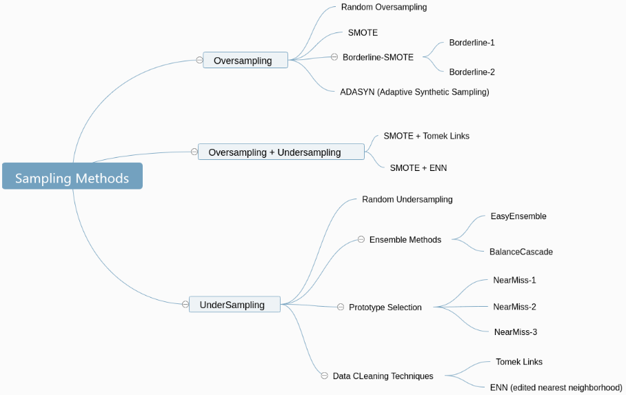
 - **采样**：过抽样、欠抽样、组合抽样
    - 过采样/上采样：将样本较少的一类sample补齐
    - 欠抽样/下采样/负采样：将样本较多的一类sample压缩，一般很少使用欠采样，标注数据的成本比较高，而深度学习的方法是数据量越高越好，所以一般都是使用过采样。
    - 组合抽样：约定一个量级N，同时进行过抽样和欠抽样，使得正负样本量和等于约定量级N
    - 这种方法**要么丢失数据信息，要么会导致较少样本共线性**，存在明显缺陷
 - **权重调整**：
    - 常规的包括算法中的weight，weight matrix
    - 改变入参的权重比，比如boosting中的全量迭代方式、逻辑回归中的前置的权重设置
    - 这种方式的弊端在于无法控制合适的权重比，需要多次尝试
 - **核函数修正**：
    - 通过核函数的改变，来抵消样本不平衡带来的问题
    - 这种使用场景局限，前置的知识学习代价高，核函数调整代价高，黑盒优化
 - **模型修正**：
    - 通过现有的较少的样本类别的数据，用算法去探查数据之间的特征，判读数据是否满足一定的规律
    - 比如，通过线性拟合，发现少类样本成线性关系，可以新增线性拟合模型下的新点
    - 实际规律比较难发现，难度较高

### 1.2、过采样常用算法
#### 1.2.1、Smote算法
 - 在少数类样本之间进行插值来产生额外的样本。
 - 它就是在少数类样本中用KNN方法合成了新样本，一般用来进行过采样的操作
 - SMOTE算法的思想是合成新的少数类样本，合成的策略是对每个少数类样本a，从它的最近邻中（从少数类中选取近邻点）随机选一个样本b，然后在a、b之间的连线上随机选一点作为新合成的少数类样本。如图所示：
    
    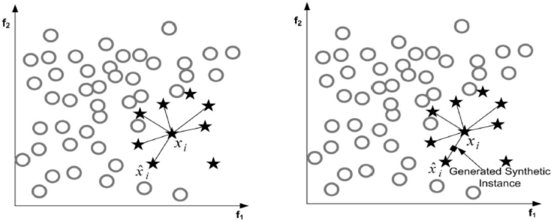
 - 算法流程：
    - 1、对于少数类中每一个样本a，以欧氏距离为标准计算它到少数类样本集中所有样本的距离，得到其k近邻。
    - 2、根据样本不平衡比例设置一个采样比例以确定采样倍率N，对于每一个少数类样本a，从其k近邻中随机选择若干个样本，假设选择的近邻为b。
    - 3、对于每一个随机选出的近邻b，分别与原样本a按照如下的公式构建新的样本:`c=a+rand(0,1)∗|a−b|`
 - SMOTE存在的缺点：
    - SMOTE会随机选取少数类样本用以合成新样本，而不考虑周边样本的情况，这样容易带来两个问题：
        - 如果选取的少数类样本周围也都是少数类样本，则新合成的样本不会提供太多有用信息。这就像支持向量机中远离margin的点对决策边界影响不大。
        - 如果选取的少数类样本周围都是多数类样本，这类的样本可能是噪音，则新合成的样本会与周围的多数类样本产生大部分重叠，致使分类困难。
 - 总的来说我们**希望新合成的少数类样本能处于两个类别的边界附近，这样往往能提供足够的信息用以分类**。而这就是下面的 Border-line SMOTE 算法要做的事情。
 
#### 1.2.2、Border-line SMOTE算法
 - 这个算法会先将所有的少数类样本分成三类：
    - "noise" ： 所有的k近邻个样本都属于多数类
    - "danger" ： 超过一半的k近邻样本属于多数类
    - "safe"： 超过一半的k近邻样本属于少数类
 - Border-line SMOTE算法只会从处于”danger“状态的样本中随机选择，然后用SMOTE算法产生新的样本。处于”danger“状态的样本代表靠近”边界“附近的少数类样本，而**处于边界附近的样本往往更容易被误分类**。
 因而Border-line SMOTE只对那些靠近”边界“的少数类样本进行人工合成样本，而SMOTE则对所有少数类样本一视同仁。
 - Border-line SMOTE分为两种:
    - Borderline-1 SMOTE，在合成样本时用的`x^`是一个少数类样本
    - Borderline-2 SMOTE，中的`x^`则是k近邻中的任意一个样本。
 
#### 1.2.3、ADASYN算法
 - ADASYN名为自适应合成抽样(adaptive synthetic sampling)，其最大的特点是采用某种机制自动决定每个少数类样本需要产生多少合成样本，不像SMOTE那样对每个少数类样本合成一样数量的样本。
 - 具体流程如下：
      
    
 - 可以看到ADASYN利用分布`Γ`来自动决定每个少数类样本所需要合成的样本数量，这等于是**给每个少数类样本施加了一个权重，周围的多数类样本越多则权重越高**。
 - ADASYN的缺点是易受离群点的影响，如果一个少数类样本的K近邻都是多数类样本，则其权重会变得相当大，进而会在其周围生成较多的样本。
 - 过采样实例分析：
    - 下面利用sklearn中的make_classification构造了一个不平衡数据集，各类别比例为{0:54, 1:946}。
    - 原始数据，SMOTE，Borderline-1 SMOTE，Borderline-2 SMOTE和ADASYN的比较见下图
    - 左侧为过采样后的决策边界，右侧为过采样后的样本分布情况，可以看到**过采样后原来少数类的决策边界都扩大了，导致更多的多数类样本被划为少数类了**

        
        
        
    - 用`SMOTE`合成的样本分布比较平均，而`Border-line SMOTE`合成的样本则集中在类别边界处。`ADASYN`的特性是一个少数类样本周围多数类样本越多，则算法会为其生成越多的样本，从图中也可以看到生成的样本大都来自于原来与多数类比较靠近的那些少数类样本。 

### 1.3、欠采样常用算法
#### 1.3.1、随机欠采样
 - 随机欠采样的思想同样比较简单，就是从多数类样本中随机选取一些剔除掉。
 - 缺点是被剔除的样本可能包含着一些重要信息，致使学习出来的模型效果不好。

#### 1.3.2、EasyEnsemble和BalanceCascade
 - EasyEnsemble和BalanceCascade**采用集成学习机制来处理传统随机欠采样中的信息丢失问题**
 - EasyEnsemble算法：
    - 将多数类样本**随机划分成n个子集**，每个子集的数量等于少数类样本的数量，这相当于欠采样。
    - 接着将每个子集与少数类样本结合起来分别训练一个模型，最后将n个模型集成
    - 这样虽然每个子集的样本少于总体样本，但**集成后总信息量并不减少**。
 - BalanceCascade算法：
    - 如果说EasyEnsemble是基于无监督的方式从多数类样本中生成子集进行欠采样，那么BalanceCascade则是采用了**有监督结合Boosting的方式**
    - 具体算法如下：
        - 在第n轮训练中，将**从多数类样本中抽样得来的子集与少数类样本结合起来训练一个基学习器H**
        - **训练完后多数类中能被H正确分类的样本会被剔除**。
        - 在接下来的第n+1轮中，**从被剔除后的多数类样本中产生子集用于与少数类样本结合起来训练**
        - 最后将不同的基学习器**集成起来**。
    - BalanceCascade的有监督表现在每一轮的基学习器起到了在多数类中选择样本的作用，而其Boosting特点则体现在每一轮丢弃被正确分类的样本，进而后续基学习器会更注重那些之前分类错误的样本。

#### 1.3.3、NearMiss
 - NearMiss本质上是一种原型选择(prototype selection)方法，即从多数类样本中选取最具代表性的样本用于训练，主要是为了缓解随机欠采样中的信息丢失问题。
 - NearMiss采用一些启发式的规则来选择样本，根据规则的不同可分为3类：
    - NearMiss-1：选择到最近的K个少数类样本平均距离最近的多数类样本
    - NearMiss-2：选择到最远的K个少数类样本平均距离最近的多数类样本
    - NearMiss-3：对于每个少数类样本选择K个最近的多数类样本，目的是保证每个少数类样本都被多数类样本包围
 - NearMiss-1和NearMiss-2的计算开销很大，因为需要计算每个多类别样本的K近邻点。
 - 另外，NearMiss-1易受离群点的影响，如下面第二幅图中合理的情况是处于边界附近的多数类样本会被选中，然而由于右下方一些少数类离群点的存在，其附近的多数类样本就被选择了。相比之下NearMiss-2和NearMiss-3不易产生这方面的问题。

    

#### 1.3.4、数据清洗方法(data cleaning tichniques)
 - 这类方法主要通过某种规则来**清洗重叠的数据，从而达到欠采样的目的**，而这些规则往往也是启发性的，下面进行简要阐述：
    - Tomek Link：
        - Tomek Link表示不同类别之间距离最近的一对样本，即这两个样本互为最近邻且分属不同类别。
        - 这样如果两个样本形成了一个Tomek Link，则要么其中一个是噪音，要么两个样本都在边界附近。
        - 这样通过移除Tomek Link就能“清洗掉”类间重叠样本，使得互为最近邻的样本皆属于同一类别，从而能更好地进行分类。
        
            
        
            上图左上为原始数据，右上为SMOTE后的数据，左下虚线标识出Tomek Link，右下为移除Tomek Link后的数据集，可以看到不同类别之间样本重叠减少了很多。
    - Edited Nearest Neighbours(ENN)：
        - 对于属于多数类的一个样本，如果其K个近邻点有超过一半都不属于多数类，则这个样本会被剔除。
        - 这个方法的另一个变种是所有的K个近邻点都不属于多数类，则这个样本会被剔除。
 - 最后，数据清洗技术最大的**缺点是无法控制欠采样的数量**。由于都在某种程度上采用了K近邻法，而事实上大部分多数类样本周围也都是多数类，因而**能剔除的多数类样本比较有限**。

### 1.4、过采样和欠采样结合的常用算法
 - 上文中提到**SMOTE算法的缺点是生成的少数类样本容易与周围的多数类样本产生重叠难以分类，而数据清洗技术恰好可以处理掉重叠样本**
 - 所以可以将二者结合起来形成一个pipeline，先过采样再进行数据清洗。
 - 主要的方法是`SMOTE + ENN`和`SMOTE + Tomek`，其中`SMOTE + ENN`通常能清除更多的重叠样本，如下图：

    
    
 - 更多方法，参考sklearn的[imbalanced-learn](https://github.com/scikit-learn-contrib/imbalanced-learn)

### 1.5、采样方法的效果
 - 使用数据集：
    - 第一个数据集为us_crime，多数类样本和少数类样本的比例为12:1
    - 第二个数据集是abalone，多数类样本和少数类样本的比例为130:1，非常悬殊
 - [查看](https://www.cnblogs.com/massquantity/p/9382710.html)实验细节和代码
 - 结论：
    - 就时间开销而言，BalanceCascade以及两种过采样欠采样结合的方法(SMOTE + ENN和SMOTE + Tomek)耗时最高。
    - 第一个数据集比例为12:1，相差不是很悬殊，综合ROC曲线和PR曲线的AUC来看，两种集成（都是欠采样）方法EasyEnsemble和BalanceCascade表现较好。
    - 第二个数据集比例为130:1，而且少数类样本非常少，因而从结果来看几种过采样方法如Borderline SMOTE， SMOTE+Tomek等效果较好。
    - 可见**在类别差异很大的情况下，过采样能一定程度上弥补少数类样本的极端不足**。
    - 然而从PR曲线上来看，其实结果都不尽如人意，**对于这种极端不平衡的数据可能比较适合异常检测的方法**
    - **ROC曲线通常会呈现一个过分乐观的效果估计**，第一个数据集中大部分ROC曲线的AUC都在0.9左右，而PR曲线都在0.5左右。第二个数据集则更夸张，从PR曲线来看其实模型对于少数类的预测准确率是无限接近于0了，但在ROC曲线上却很难看出这一点。
    - 从classification report看出：
        - Base Model的特点是precision高，recall低，而几种采样方法则相反，precision低，recall高。
        - **采样方法普遍扩大了少数类样本的决策边界**（从上文中的决策边界图就能看出来），所以把很多多数类样本也划为少数类了，导致precision下降而recall提升。
        - 当然这些都是分类阈值为0.5的前提下得出的结论，如果进一步调整阈值的话能得到更好的模型。
        - **策略是base model的阈值往下调（因为recall偏低，表示在所有正类中被正确分类的比较少，所以下调阈值），采样方法的阈值往上调（因为扩大了决策边界之后，很容易将多数类样本划分为少数类样本，所以要上调分类阈值）**。
        - 在经过阈值调整后，各方法的整体F1分数都有提高，可见很多单指标如precision，recall等都会受到不同阈值的影响。
        - 所以这也是为什么**在类别不平衡问题中用ROC和PR曲线来评估非常流行，因为它们不受特定阈值变化的影响，反映的是模型的整体预测能力**。
    - 就这两个数据集的结果来看，如果本身数据偏斜不是很厉害，那么采样方法的提升效果很细微。如果本身数据偏斜很厉害，采样方法纵使比base model好很多，但由于base model本身的少数类预测能力很差，所以本质上也不尽如人意。这就像考试原来一直靠10分，采样了之后考了30分，绝对意义上提升很大，但其实还是差得远了。

### 1.6、各种评估指标
> 由于类别不平衡问题的特性使然，一般常使用于评估分类器性能的**准确率和错误率可能就不再适用了**。因为在类别不平衡问题中我们主要关心数目少的那一类能否被正确分类，而如果分类器将所有样例都划分为数目多的那一类，就能轻松达到很高的准确率，但实际上该分类器并没有任何效果。
 
#### 1.6.1、ROC曲线
 - ROC曲线和PR（Precision-Recall）曲线皆为类别不平衡问题中常用的评估方法
 - Recall (TPR，真正例率)衡量的是所有的正例中有多少是被正确分类了，假正例率 (FPR)为有多少负例被错判成了正例
 - ROC曲线常用于二分类问题中的**模型比较**，主要表现为一种真正例率(TPR)(y轴)和假正例率(FPR)(x轴)的权衡。
    
    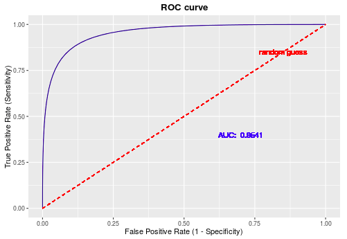
 - 具体方法是在不同的分类阈值设定下分别以TPR和FPR为纵、横轴作图。由ROC曲线的两个指标：
    
    
 - 当一个样本被分类器判为正例，若其本身是正例，则TPR增加；若其本身是负例，则FPR增加，因此ROC曲线可以看作是随着阈值的不断移动，所有样本中正例与负例之间的“对抗”。曲线越靠近左上角，意味着越多的正例优先于负例，模型的整体表现也就越好。
 - 说的再直白一点就是：
    - TPR是y轴，表示所有的正例中有多少是被正确分类了
    - FPR是x轴，表示有多少负例被错判成了正例
    - 曲线越靠近左上角表示：TPR比FPR增加的快，说明样本被正确分类的较多，负例被叛定为正例的少，结果就越好
 
#### 1.6.2、AUC曲线
 - 先看一下ROC曲线中的随机线，图中`[0,0]`到`[1,1]`的虚线即为随机线，该线上所有的点都表示该阈值下TPR=FPR
    
    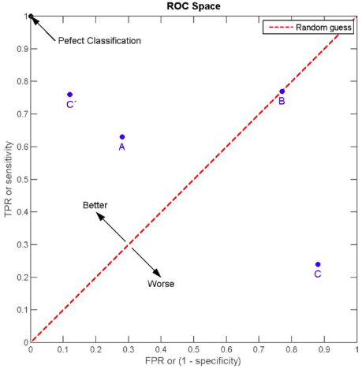
    
    - 根据定义，`TPR=TP/P`，表示所有正例中被预测为正例的概率；`FPR=FP/N`，表示所有负例中被被预测为正例的概率。
    - 若二者相等，意味着无论一个样本本身是正例还是负例，分类器预测其为正例的概率是一样的，这等同于随机猜测（注意这里的“随机”不是像抛硬币那样50%正面50%反面的那种随机）。
    - 上图中B点就是一个随机点，无论是样本数量和类别如何变化，始终将75%的样本分为正例。
 - **ROC曲线围成的面积(即AUC)**可以解读为：
    - 从所有正例中随机选取一个样本A，再从所有负例中随机选取一个样本B
    - 分类器将A判为正例的概率比将B判为正例的概率大的可能性。
    - 可以看到位于随机线上方的点(如图中的A点)被认为好于随机猜测。
    - **在这样的点上TPR总大于FPR，意为正例被判为正例的概率大于负例被判为正例的概率**。
 - 从另一个角度看，由于**画ROC曲线时都是先将所有样本按分类器的预测概率排序**，所以**AUC反映的是分类器对样本的排序能力**，依照上面的例子就是A排在B前面的概率。
 - **AUC越大，自然排序能力越好，即分类器将越多的正例排在负例之前**。
 - **ROC曲线的绘制方法**：
    - 假设有P个正例，N个反例，首先拿到分类器对于每个样本预测为正例的概率，根据概率对所有样本进行逆序排列
    - 然后将分类阈值设为最大，即把所有样本均预测为反例，此时图上的点为`(0,0)`。
    - 然后将分类阈值依次设为每个样本的预测概率，即依次将每个样本划分为正例
        - 如果该样本为真正例，则`TP+1`，即`TPR+1/P`;
        - 如果该样本为负例，则`FP+1`，即`FPR+1/N`。
    - 最后的到所有样本点的TPR和FPR值，用线段相连。

#### 1.6.3、ROC曲线的优缺点
 - ROC曲线的优点：
    - **兼顾正例和负例的权衡**。因为TPR聚焦于正例，FPR聚焦于负例，使其成为一个比较均衡的评估方法。
    - ROC曲线选用的两个指标，TPR和FPR，都不依赖于具体的类别分布。
    - **注意TPR用到的TP和FN同属P列，FPR用到的FP和TN同属N列，所以即使P或N的整体数量发生了改变，也不会影响到另一列。也就是说，即使正例与负例的比例发生了很大变化，ROC曲线也不会产生大的变化，而像Precision使用的TP和FP就分属两列，则易受类别分布改变的影响**。
    - 有参考文献中举了个例子，负例增加了10倍，ROC曲线没有改变，而PR曲线则变了很多。作者认为这是ROC曲线的优点，即**具有鲁棒性，在类别分布发生明显改变的情况下依然能客观地识别出较好的分类器**。
 - ROC曲线的缺点：
    - 上文提到ROC曲线的优点是不会随着类别分布的改变而改变，但这在某种程度上也是其缺点。**因为负例N增加了很多，而曲线却没变，这等于产生了大量FP**。像信息检索中如果主要关心正例的预测准确性的话，这就不可接受了。
    - **在类别不平衡的背景下，负例的数目众多致使FPR的增长不明显，导致ROC曲线呈现一个过分乐观的效果估计**。ROC曲线的横轴采用FPR，根据`FPR = FP/N = FP/(FP+TN)`，当负例N的数量远超正例P时，FP的大幅增长只能换来FPR的微小改变。结果是**虽然大量负例被错判成正例，在ROC曲线上却无法直观地看出来**。（**当然也可以只分析ROC曲线左边一小段**）
      
        ```
        举个例子，假设一个数据集有正例20，负例10000，开始时有20个负例被错判，
        FPR=20/(20+9980)=0.002，
        
        接着又有20个负例错判，
        FPR2=40/(40+9960)=0.004，
        
        在ROC曲线上这个变化是很细微的。
        
        而与此同时Precision则从原来的0.5下降到了0.33，在PR曲线上将会是一个大幅下降。
        ```
 
#### 1.6.4、PR(Precision Recall)曲线
 - **PR曲线与ROC曲线的相同点是都采用了TPR (Recall)，都可以用AUC来衡量分类器的效果。不同点是ROC曲线使用了FPR，而PR曲线使用了Precision，因此PR曲线的两个指标都聚焦于正例。类别不平衡问题中由于主要关心正例，所以在此情况下PR曲线被广泛认为优于ROC曲线**。
    
    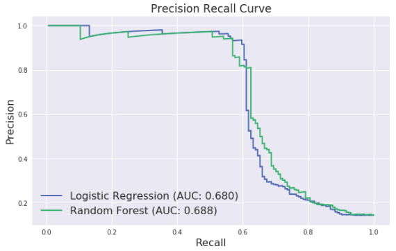
    
    - 可以看到上文中ROC曲线下的AUC面积在0.8左右，而PR曲线下的AUC面积在0.68左右
    - **类别不平衡问题中ROC曲线确实会作出一个比较乐观的估计，而PR曲线则因为Precision的存在会不断显现FP的影响**。
 
#### 1.6.5、使用场景
 - ROC曲线由于兼顾正例与负例，所以适用于评估分类器的整体性能，相比而言PR曲线完全聚焦于正例。
 - 如果有多份数据且存在不同的类别分布，比如信用卡欺诈问题中每个月正例和负例的比例可能都不相同，这时候如果只想**单纯地比较分类器的性能且剔除类别分布改变的影响，则ROC曲线比较适合**，因为类别分布改变可能使得PR曲线发生变化时好时坏，这种时候难以进行模型比较；反之，如果想测试**不同类别分布下对分类器的性能的影响，则PR曲线比较适合**。
 - 如果想要评估在相同的类别分布下正例的预测情况，则宜选PR曲线。
 - 类别不平衡问题中，ROC曲线通常会给出一个乐观的效果估计，所以大部分时候还是PR曲线更好。
 - 最后可以根据具体的应用，在曲线上找到最优的点，得到相对应的precision，recall，f1 score等指标，去调整模型的阈值，从而得到一个符合具体应用的模型。

#### 1.6.6、代码实现
 - imblearn类别不平衡包提供了上采样和下采样策略中的多种接口，基本调用方式一致
 - 具体实现如下：
    - 查看数据分布：
    
    ```
    from collections import Counter
    # 查看所生成的样本类别分布，0和1样本比例9比1，属于类别不平衡数据
    print(Counter(y))
    # Counter({0: 900, 1: 100})
    ```
    - SMOTE算法核心语句：
    
    ```
    # 使用imlbearn库中上采样方法中的SMOTE接口
    from imblearn.over_sampling import SMOTE
    # 定义SMOTE模型，random_state相当于随机数种子的作用
    smo = SMOTE(random_state=42)
    X_smo, y_smo = smo.fit_sample(X, y)
    ```
    - 查看经过SMOTE之后的数据分布：
    
    ```
    print(Counter(y_smo))
    # Counter({0: 900, 1: 900})
    ```
    - 从上述代码中可以看出，SMOTE模型默认生成一比一的数据，如果想生成其他比例的数据，可以使用radio参数。不仅可以处理二分类问题，同样适用于多分类问题
    
    ```
    # 可通过radio参数指定对应类别要生成的数据的数量
    smo = SMOTE(ratio={1: 300 },random_state=42)
    # 生成0和1比例为3比1的数据样本
    X_smo, y_smo = smo.fit_sample(X, y)
    print(Counter(y_smo))
    # Counter({0: 900, 1: 300})
    ```
    - imblearn中上采样接口提供了随机上采样RandomOverSampler，SMOTE，ADASYN三种方式，调用方式和主要参数基本一样。下采样接口中也提供了多种方法，以RandomUnderSampler为例。
    
    ```
    from imblearn.under_sampling import RandomUnderSampler
    # 同理，也可使用ratio来指定下采样的比例
    rus = RandomUnderSampler(ratio={0: 500 }, random_state=0)
    X_rus, y_rus = rus.fit_sample(X, y)
    print(Counter(y_smo))
    # Counter({0: 500, 1: 300})
    ```


## 2、NLP中数据不均衡问题
### 2.1、一般概念
 - 不适合采用Smote算法，理由如下：
    - NLP任务中，不好使用Smote算法，我们的样本一般都是文本数据，不是直接的数字数据，只有把文本数据转化为数字数据才能进行smote操作。
    - 另外现在一般都是基于预训练模型做微调的，文本的向量表示也是变化的，所有不能进行smote算法来增加小类数据。

### 2.2、常用方法
 - 数据层面：
    - 最简单的就是**直接复制小类样本**，从而达到增加小类样本数据的目的。
        
        - 这样的方法缺点也是很明显的，实际上样本中并没有加入新的特征，特征还是很少，那么就会出现过拟合的问题。
    - 对小类样本数据经过一定的处理，做一些小的改变。例如：
        - （shuffle）随机的打乱词的顺序，句子的顺序
        - （drop）随机的删除一些词，一些句子
        - （裁剪）裁剪文本的开头或者结尾等
        
        ```
        这些方法只合适对语序不是特别重要的任务，像一些对语序特征特别重要的序列任务这种操做就不太恰当
        ```
    - 复述生成：这个属性seq2seq任务，根据原始问题生成格式更好的问题，然后把新问题替换到问答系统中。
    - EDA：同义词替换、随机插入、随机交换、随机删除
    - 回译
    - 生成对抗网络GAN（对抗样本生成）
 - 模型层面：
    - 权重设置：在训练的时候给损失函数loss直接设定一定的比例（即对不同类别，在损失函数中设置一定的权重），使得算法能够对小类数据更多的注意力
    - 新的损失函数（[Focal Loss](https://github.com/yatengLG/Focal-Loss-Pytorch/blob/master/Focal_Loss.py)）：
        - 该损失函数专门用来解决多分类或者二分类中样本不均衡的问题
        - 该损失函数是在标准交叉熵损失基础上修改得到的
        - 该损失函数可以通过减少易分类样本的权重，使得模型在训练时更专注于难分类的样本
        - 该损失函数旨在通过降低内部加权（简单样本）来解决类别不平衡问题，这样即使简单样本的数量很大，但它们对总损失的贡献却很小
 - 评价方式层面：
    - 在模型评价的时候，一般简单的采用accuracy。但是在样本数据极度不平衡，特别是那种重点关注小类识别准确率的时候，就不能使用accuracy来评价模型了
    - 要使用precision和recall来综合考虑模型的性能，降低小类分错的几率

### 2.3、总结
 - **使用复述生成和回译以及生成对抗网络应该是最有效的**，因为它们在做数据增强的时候，对原始数据做的处理使得语义发生了变化，但同时又保证了整个语义的完整性。
 - 随机删除的词，打乱顺序的方式，对数据的整个语义破坏太大，具体需要实验


## 3、NLP中文本语料扩增方法
### 3.1、文本语料扩增
 - 随机删除一些token(字，词，word-piece等);
 - 随机将一些token替换成未登录标记（`<UNK>`）
 - 随机使用词表中的token替代掉其他的token；
 - 随机交换token的顺序；(no further than three positions apart)
 - 随机截断序列（sequence），分为从前截断和从后截断；
 - 随机删除连续的token。

### 3.2、数据增强方法

> 论文： [EDA for Chinese](https://github.com/zhanlaoban/eda_nlp_for_Chinese), [EDA](https://arxiv.org/abs/1901.11196)

 - 随机drop和shuffle
    - 一种是drop,对于标题和描述中的字或词,随机的进行删除,用空格代替。
    - 另一种是shuffle,即打乱词序。
    - 数据增强对于提升训练数据量,抑制模型过拟合等十分有效
 - 简单数据增强(Easy Data Augmentation，EDA)
    - 同义词替换
        - 从句子中随机选取n个不属于停用词集的单词，并随机选择其同义词替换它们
        - 这种方式作用不太大，因为同义词具有非常相似的词向量，因此模型会将这两个句子当作相同的句子，而在实际上并没有对数据集进行扩充
    - 随机插入：随机的找出句中某个不属于停用词集的词，并求出其随机的同义词，将该同义词插入句子的一个随机位置。重复n次；
    - 随机交换：随机的选择句中两个单词并交换它们的位置。重复n次；
    - 随机删除：以p的概率，随机的移除句中的每个单词。
    
        ```
        长句子相对于短句子，存在一个特性：长句比短句有更多的单词，因此长句在保持原有的类别标签的情况下，能吸收更多的噪声。
        为了充分利用这个特性，基于句子长度来变化改变的单词数，换句话说，就是不同的句长，因增强而改变的单词数可能不同。
        ```
 - 回译
    - 用机器翻译把一段中文翻译成另一种语言，然后再翻译回中文。
    - 回译的方法不仅有类似同义词替换的能力，它还具有在保持原意的前提下增加或移除单词并重新组织句子的能力。
    - 这个方法已经成功的被用在Kaggle恶意评论分类竞赛中。反向翻译是NLP在机器翻译中经常使用的一个数据增强的方法。其本质就是快速产生一些不那么准确的翻译结果达到增加数据的目的。
 - 基于上下文的数据增强方法
    
    - TODO， refer to Contextual Augmentation: Data Augmentation by Words with Paradigmatic Relations
 - 文档裁剪
    
    - 新闻文章通常很长，在查看数据时，对于分类来说并不需要整篇文章。文章的主要想法通常会重复出现。将文章裁剪为几个子文章来实现数据增强，这样将获得更多的数据。
 - 生成对抗网络
    
    - GAN是深度学习领域中最令人兴奋的最新进展之一，它们通常用来生成新的图像，但它的一些方法或许也可以适用于文本数据。
 - 预训练的语言模型
    - 最近很多论文运用大量语料库预训练语言模型来处理自然语言任务得到了惊人的结果，语言模型是通过前面的单词预测句子中会出现的下一个单词。
    - 比如，**在fine-tuning SQuAD之前，先在TriviaQA上fine-tuning，以进行适当的数据增强**
 - 数据增强的作用
    - 增加训练的数据量，提高模型的泛化能力。
    - 增加噪声数据，提升模型的鲁棒性。


## 4、参考博客
 - [过采样中用到的SMOTE算法](https://www.cnblogs.com/june0507/p/11726492.html)
 - [机器学习之类别不平衡问题](https://www.cnblogs.com/massquantity/p/8550875.html?spm=a2c4e.10696291.0.0.132619a4l9goR0)
 - [NLP任务样本数据不均衡问题解决方案](https://blog.csdn.net/HUSTHY/article/details/103887957)


# 六、Batch Norm/Layer Norm/Weight Norm/Cosine Norm
## 1、一般概念
 - 为什么需要Normalization：
    - 独立同分布与白化
        - 在把数据喂给机器学习模型之前，“白化（whitening）”是一个重要的数据预处理步骤。白化一般包含两个目的：
            - （1）去除特征之间的相关性 —> 独立；
            - （2）使得所有特征具有相同的均值和方差 —> 同分布。
            - 白化最典型的方法就是PCA
        - 独立同分布：
            - 独立同分布并非所有机器学习模型的必然要求
            - 比如Naive Bayes模型就建立在特征彼此独立的基础之上，而Logistic Regression和神经网络则在非独立的特征数据上依然可以训练出很好的模型
            - 独立同分布的数据可以简化常规机器学习模型的训练、提升机器学习模型的预测能力
    - 深度学习中的Internal Covariate Shift（ICS，内部协变量位移）
        - 深度神经网络模型的训练为什么会很困难？其中一个重要的原因是，深度神经网络涉及到很多层的叠加，而每一层的参数更新会导致上层的输入数据分布发生变化，通过层层叠加，
        **高层的输入分布变化会非常剧烈**，这就使得高层需要不断去重新适应底层的参数更新。
        - ICS是分布不一致假设之下的一个分支问题，它是指源空间和目标空间的条件概率是一致的，但是其边缘概率不同
        - ICS会导致什么问题？
            - 简而言之，每个神经元的输入数据不再是“独立同分布”。
            - 其一，上层参数需要不断适应新的输入数据分布，降低学习速度。
            - 其二，下层输入的变化可能趋向于变大或者变小，导致上层落入饱和区，使得学习过早停止。
            - 其三，每层的更新都会影响到其它层，因此每层的参数更新策略需要尽可能的谨慎
 - Normalization的通用框架与基本思想
    - 神经网络接收输入x，输出一个标量值，由于ICS问题的存在，x的分布可能相差很大。要解决独立同分布的问题，**“理论正确”的方法就是对每一层的数据都进行白化操作**。然而标准的白化操作代价高昂，特别是我们还希望白化操作是可微的，保证白化操作可以通过反向传播来更新梯度。
    - 因此，以BatchNorm为代表的Normalization方法退而求其次，进行了简化的白化操作。
    - 基本思想是：**在将x送给神经元之前，先对其做平移和伸缩变换，将x的分布规范化成在固定区间范围的标准分布**。
    - 通用变换框架就如下所示：
      
        
    
    处理ICS，第一步都已经得到了标准分布，第二步怎么又给变走了？ 答案是——**为了保证模型的表达能力不因为规范化而下降**。
        - 第一步的变换将输入数据限制到了一个全局统一的确定范围（均值为 0、方差为 1）。下层神经元可能很努力地在学习，但不论其如何变化，其输出的结果在交给上层神经元进行处理之前，将被粗暴地重新调整到这一固定范围。
        - 为了尊重底层神经网络的学习结果，我们将规范化后的数据进行**再平移和再缩放**，使得每个神经元对应的输入范围是针对该神经元量身定制的一个确定范围（均值为b、方差为g^2）。rescale和reshift的参数都是可学习的，这就使得Normalization层可以学习如何去尊重底层的学习结果。
        - 除了充分利用底层学习的能力，另一方面的重要意义在于保证获得非线性的表达能力。Sigmoid等激活函数在神经网络中有着重要作用，通过区分饱和区和非饱和区，使得神经网络的数据变换具有了非线性计算能力。
        而**第一步的规范化会将几乎所有数据映射到激活函数的非饱和区（线性区）**，仅利用到了线性变化能力，从而降低了神经网络的表达能力。而**进行再变换，则可以将数据从线性区变换到非线性区**，恢复模型的表达能力。
    - 这样的Normalization离标准的白化还有多远？
        - 标准白化操作的目的是“独立同分布”。独立就不说了，暂不考虑。变换为均值为b、方差为g^2的分布，也并不是严格的同分布，只是映射到了一个确定的区间范围而已。

## 2、主流Normalization方法梳理
### 2.1、Batch Normalization —— 纵向规范化
 - 如下图所示：
 
    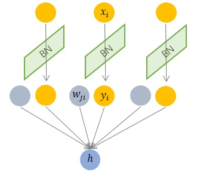
 - 其规范化针对单个神经元进行，利用网络训练时一个mini-batch的数据来计算该神经元`x_i`的均值和方差,因而称为Batch Normalization
 - 例如`batch_size=10`，每个神经元`x_i`输出一个标量值，则在这个batch内，将该神经元的这10次输出进行计算均值和方差。**是针对batch中所有样本而言的**。
    
    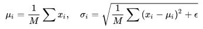
      
    其中，M是最小批的大小。
 - 按上图所示，相对于一层神经元的水平排列，BatchNorm可以看做一种纵向的规范化。由于BatchNorm是针对单个维度定义的，因此标准公式中的计算均为element-wise的。
 - BatchNorm独立地规范化每一个输入维度`x_i`，但规范化的参数是一个mini-batch的一阶统计量（上图左式）和二阶统计量（上图右式）。这就要求每一个mini-batch的统计量是整体统计量的近似估计，或者说每一个mini-batch彼此之间，以及和整体数据，都应该是近似同分布的。
 - 分布差距较小的mini-batch可以看做是为规范化操作和模型训练引入了噪声，可以增加模型的鲁棒性（这是正常情况），但如果每个mini-batch的原始分布差别很大，那么不同mini-batch的数据将会进行不一样的数据变换，这就增加了模型训练的难度。
 - 因此，BatchNorm比较适用的场景是：每个mini-batch比较大，数据分布比较接近。在进行训练之前，要做好充分的shuffle，否则效果会差很多。
 - 由于BatchNorm需要在运行过程中统计每个mini-batch的一阶统计量和二阶统计量，因此不适用于动态的网络结构和RNN网络（因为这些结构的单元个数不固定）
 
### 2.2、Layer Normalization —— 横向规范化
 - 如下图所示：
    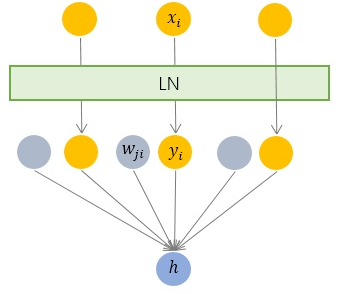
 - 层规范化就是针对BatchNorm的上述不足而提出的。与BatchNorm不同，LayerNorm是一种横向的规范化，如图所示。
 - 它综合考虑一层所有维度的输入，计算该层的平均输入值和输入方差，然后用同一个规范化操作来转换各个维度的输入。
    
    
 - 其中`x_i`枚举了该层所有的输入神经元。对应到标准公式中，四大参数均为标量（BN中是向量），所有输入共享一个规范化变换。
 - LayerNorm**针对单个训练样本进行**，不依赖于其他数据，因此可以避免BatchNorm中受mini-batch数据分布影响的问题，**可以用于小mini-batch场景、动态网络场景和RNN，特别是自然语言处理领域**。
 - 此外，LN不需要保存mini-batch的均值和方差，节省了额外的存储空间。但是，BN的转换是针对单个神经元可训练的——不同神经元的输入经过再平移和再缩放后分布在不同的区间，而LN对于一整层的神经元训练得到
 同一个转换——所有的输入都在同一个区间范围内。如果不同输入特征不属于相似的类别（比如颜色和大小），那么LN的处理可能会降低模型的表达能力。
 
### 2.3、Weight Normalization —— 参数规范化
 - BatchNorm和LayerNorm均将规范化应用于输入的特征数据x，而WeightNorm则另辟蹊径，**将规范化应用于线性变换函数的权重w**，这就是WeightNorm名称的来源。
      
    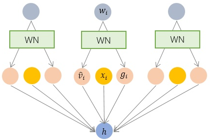
      
    
 - BatchNorm和LayerNorm是用输入的特征数据的方差对输入数据进行scale，而**WeightNorm则是用神经元的权重的欧氏范式**对输入数据进行scale。
 - 虽然在原始方法中分别进行的是特征数据规范化和参数的规范化，但本质上都实现了对数据的规范化，只是用于scale的参数来源不同。
 - 另外，我们看到这里的规范化只是对数据进行了scale，而没有进行shift，因为我们简单地令`u=0`. 但事实上，这里留下了与BN或者LN相结合的余地——那就是利用BN或者LN的方法来计算输入数据的均值u。
 - WN的规范化不直接使用输入数据的统计量，因此避免了BN过于依赖mini-batch的不足，以及LN每层唯一转换器的限制（限制不同特征的表达），同时也**可以用于动态网络结构**。
 
### 2.4、Cosine Normalization —— 余弦规范化
 - **要对数据进行规范化的原因，是数据经过神经网络的计算之后可能会变得很大，导致数据分布的方差爆炸**，而这一问题的根源就是我们的计算方式——点积，权重向量w和特征数据向量x的点积。向量点积是无界（unbounded）的啊！
 - 向量点积是衡量两个向量相似度的方法之一。而夹角余弦就也是其中之一，而且关键的是，夹角余弦是有确定界的，`[-1, 1]`的取值范围
    
    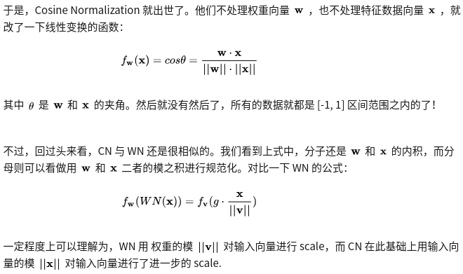
 - CN通过用余弦计算代替内积计算实现了规范化，但成也萧何败萧何。原始的内积计算，其几何意义是输入向量在权重向量上的投影，既包含二者的夹角信息，也包含两个向量的scale信息。去掉scale信息，可能导致表达能力的下降，因此也引起了一些争议和讨论。具体效果如何，可能需要在特定的场景下深入实验

### 2.5、Normalization为什么会有效？
 - Normalization的权重伸缩不变性

    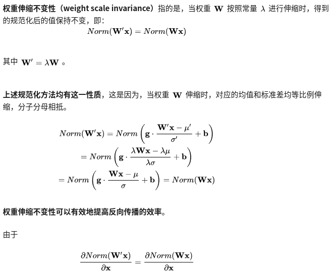
    
    - 因此，权重的伸缩变化不会影响反向梯度的Jacobian矩阵，因此也就对反向传播没有影响，避免了反向传播时因为权重过大或过小导致的梯度消失或梯度爆炸问题，从而加速了神经网络的训练。
    - **权重伸缩不变性还具有参数正则化的效果，可以使用更高的学习率**。
    
        

  因此，下层的权重值越大，其梯度就越小。这样，参数的变化就越稳定，相当于实现了参数正则化的效果，避免参数的大幅震荡，提高网络的泛化性能。
 - Normalization的数据伸缩不变性

    
    
    - 数据伸缩不变性仅对BN、LN和CN成立。因为这三者对输入数据进行规范化，因此当数据进行常量伸缩时，其均值和方差都会相应变化，分子分母互相抵消。而WN不具有这一性质。
    - 数据伸缩不变性可以有效地减少梯度弥散（即梯度爆炸），简化对学习率的选择。
    - 每一层神经元的输出依赖于底下各层的计算结果。**如果没有正则化，当下层输入发生伸缩变化时，经过层层传递，可能会导致数据发生剧烈的膨胀或者弥散，从而也导致了反向计算时的梯度爆炸或梯度弥散**。
    - 数据的伸缩变化也不会影响到对该层的权重参数更新，使得训练过程更加鲁棒，简化了对学习率的选择。

## 3、参考文献
 - [详解深度学习中的Normalization，BN/LN/WN](https://www.zhihu.com/search?type=content&q=batch%20Normalization)


# 七、Attention机制
## 1、Seq2Seq模型存在的问题
 - 该模型有一个encoder-decoder结构：
    - Encoder：处理输入序列，压缩信息到一个固定长度的context vector中（即句子的embedding）
    - Decoder：使用context vector进行初始化，进行转换后输出。早期的工作仅仅使用encoder的最后一个状态所谓context vector
    - 两者都是RNN网络
    
        
 - 劣势在于：使用固定长度的context vector限制了记忆长句子的能力

## 2、从翻译中诞生
 - attention是为了记忆长的原始句子，而不是仅仅依赖encoder的最后一个隐藏状态
 - attention是为了在context vector和整个原始输入之间建立快捷方式，那些快捷连接的权重是可以为输出的每个元素进行定制化的
 - 原始输入和目标输出之间的对其是被context vector学习和控制的
 - 本质上来说，context vector包含三个信息：
    - 编码隐藏状态
    - 解码隐藏状态
    - 源和目标的对齐
    
    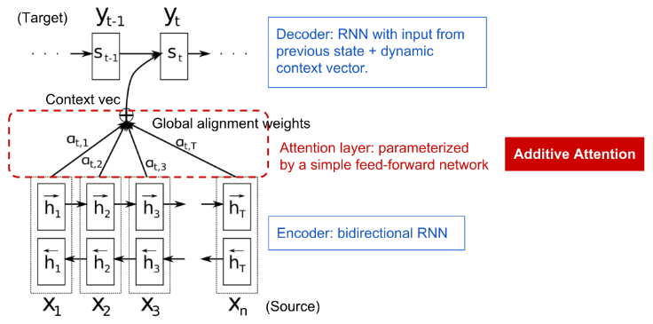

    encoder-decoder model with additive attention机制，来自论文[NMT](https://arxiv.org/pdf/1409.0473.pdf)
 - NMT中定义的attention如下：
    - 源序列x，长度为n；目标序列y，长度为m
    - encoder是一个Bi-RNN，前者为前向隐藏状态，后者为反向隐藏状态，`h_i`表示将两者进行串联，将当前词的前后依赖加进来
    
        
    - decoder对位置t有隐状态`s_t = f(s_{t-1}, y_{t-1}, c_t)`，输出词。其中，`t=1,2,...,m`，context vector `c_t`是输入序列隐状态的权重加和，权重通过对齐分数确定：
    
        
        
        - 对齐模型分配分数`a_{t.i}`对输入位置i和当前输出位置t
        - 集合`{ a_{t,i} }`定义的是：对于每一个输出，每一个输入隐藏状态应该以多大的权重被考虑。
        - 在NMT论文中，分数a使用一层FC进行参数化，FC的参数与模型一块训练，打分函数形式如下：
        
            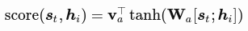
            
            其中`v_a`和`W_a`都是需要学习的权重矩阵，`tanh`是非线性的激活函数

## 3、Attention家族概览
 - 在attention的帮助下，源序列和目标序列不再受距离的限制
 - 流行的attention如下：
   
Num | Name | Alignment score function | Citation 
-|-|-|-
1 | Content-base  基于内容的attention | 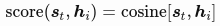 | [Graves2014](https://arxiv.org/abs/1410.5401) |
2 | Additive      基于累加的attention | 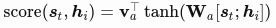 | [Bahdanau2015](https://arxiv.org/pdf/1409.0473.pdf) |
3 | Location-Base 基于位置的attention |  | [Luong2015](https://arxiv.org/pdf/1508.04025.pdf) |
4 | General       通用attention |  | [Luong2015](https://arxiv.org/pdf/1508.04025.pdf) |
5 | Dot-Product   基于点乘的attention |  | [Luong2015](https://arxiv.org/pdf/1508.4025.pdf) |
6 | Scaled Dot-Product 基于缩放点乘的attention | 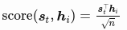 | [Vaswani2017](http://papers.nips.cc/paper/7181-attention-is-all-you-need.pdf) |

> 2中又称为concat，  
> 3中简化softmax对齐仅仅依赖于目标位置，  
> 4中`W_a`是在attention层的可训练权重矩阵，  
> 6和5非常相似，对了一个缩放因子，n是源隐藏状态的维度，当输入很大的时候，softmax函数可能会有极小的梯度，比较困难去训练，所以添加了一个缩放因子

 - 下边是更广泛的类别定义：

Num | Name | Definition | Citation 
-|-|-|-
1 | Self/intra-Attention | 关于同一输入序列的不同位置的。理论上，Self-Attention可以采用上述任何score函数，但只需将目标序列替换为相同的输入序列 | [Cheng2016](https://arxiv.org/pdf/1601.06733.pdf) |
2 | Global/Soft | Attending to整个输入状态空间 | [Xu2015](http://proceedings.mlr.press/v37/xuc15.pdf) |
3 | Local/Hard | Attending to部分输入状态空间，例如输入图像的一小块 | [Xu2015](http://proceedings.mlr.press/v37/xuc15.pdf), [Luong2015](https://arxiv.org/pdf/1508.04025.pdf) |

### 3.1、Self-Attention
 - Self-attention又叫intra-attention
 - 是使用attention机制关联同一个句子的不同位置，目的是为了计算该句子的表示
 - Self-attention机制使我们学习当前的词和前后词的关联（对于LSTM来说是前边的词）
   
    
    
    其中红字表示当前的词，蓝色阴影的大小表示激活的水平，来自论文[Cheng et al., 2016](https://arxiv.org/pdf/1601.06733.pdf)

### 3.2、Soft vs Hard Attention
 - 区别soft和hard attention的方法基于attention是否使用整个image或仅仅一个patch
 - Soft Attention：参考论文[Bahdanau et al., 2015](https://arxiv.org/abs/1409.0473)
    - 模型是平滑的、可微的
    - 当源输入比较大时，计算昂贵
 - Hard Attention：参考论文[Luong, et al., 2015](https://arxiv.org/abs/1508.04025)
    - 在时间t仅仅选择图像的一个patch去attend
    - 在推断时计算较少
    - 模型是不可微的
    - 要求更复杂技术比如方差下降、强化学习来进行训练

### 3.3、Global vs Local Attention
 - global和soft类似，参考[Luong, et al., 2015](https://arxiv.org/pdf/1508.04025.pdf)
 - local是hard与soft的混合，其在hard上有以下改进：
    - 模型首先为当前的目标word预测一个a single aligned position
    - 计算context vector时采用以源位置为中心的一个窗口
 - TODO


## 4、参考文献
 - [Attention? Attention!](https://lilianweng.github.io/lil-log/2018/06/24/attention-attention.html#references)
 - [Attention Mechanism](https://blog.floydhub.com/attention-mechanism/)


# 八、对抗样本生成

 - [1、对抗样本](#1、对抗样本)
 - [2、攻击模式分类](#2、攻击模式分类)
 - [3、常见防御方法分类](#3、常见防御方法分类)
 - [4、对抗训练](#4、对抗训练)
 - [5、常用的对抗训练方法](#5、常用的对抗训练方法)
    - [5.1、FGSM和FGM方法及代码实现](#5.1、FGSM和FGM方法及代码实现)
        - [5.1.1、FGSM和FGM方法](#5.1.1、FGSM和FGM方法)
        - [5.1.2、FGM代码实现](#5.1.2、FGM代码实现)
    - [5.2、PGD方法及代码实现](#5.2、PGD方法及代码实现)
        - [5.2.1、PGD方法](#5.2.1、PGD方法)
        - [5.2.2、PGD代码实现](#5.2.2、PGD代码实现)
    - [5.3、FreeAT方法](#5.3、FreeAT方法)
    - [5.4、YOPO方法](#5.4、YOPO方法)
    - [5.5、FreeLB方法](#5.5、FreeLB方法)
 - [6、各种对抗训练方法的区别](#6、各种对抗训练方法的区别)
 - [7、对抗训练在内层loss最大化和外层loss最小化时每个样本的label相同吗？](#7、对抗训练在内层loss最大化和外层loss最小化时每个样本的label相同吗？)
 - [8、参考文献](#8、参考文献)

## 1、对抗样本
 - 对抗样本可以用来攻击和防御，而**对抗训练其实是“对抗”家族中防御**的一种方式，其基本的原理是通过添加扰动来构造一些对抗样本，放给模型去训练，以攻为守，提高模型在遇到对抗样本时的鲁棒性，同时一定程度也能提高模型的表现和泛化能力。

    
 - 什么样的样本才是好的对抗样本呢？对抗样本一般需要具有两个特点：
    - 相对于原始输入，所添加的扰动是微小的；
    - 能使模型犯错（先让模型尽可能的去犯错，目的是求得扰动；然后利用生成的扰动样本，再来强迫模型网正确label去预测强制其对扰动样本不犯错，经过这个过程模型就对固定范围内的样本产生了鲁棒性）。

## 2、攻击模式分类
 - 黑盒攻击与白盒攻击
    - 白盒攻击：攻击者能够获知机器学习所使用的算法，以及算法所使用的参数。攻击者在产生对抗性攻击数据的过程中能够与机器学习的系统有所交互。
    - 黑盒攻击：攻击者并不知道机器学习所使用的算法和参数，但攻击者仍能与机器学习的系统有所交互，比如可以通过传入任意输入观察输出，判断输出。
    - 在实际应用中，这两者的区别体现为：**通过模型A来生成对抗样本，进而攻击模型B。当模型A与模型B是一个模型时，为白盒攻击；当模型A与模型B不为一个模型时，则为黑盒攻击**。
 - 有目标攻击与无目标攻击
    - 无目标攻击（untargeted attack）：对于一张图片，生成一个对抗样本，使得标注系统在其上的标注与原标注无关，即只要攻击成功就好，**对抗样本最终属于哪一类不做限制**。
    - 有目标攻击（targeted attack）：对于一张图片和一个目标标注句子，生成一个对抗样本，使得标注系统在其上的标注与目标标注完全一致，即不仅要求攻击成功，还**要求生成的对抗样本属于特定的类**。

## 3、常见防御方法分类
 - **对抗训练**：对抗训练旨在从随机初始化的权重中训练一个鲁棒的模型，其**训练集由真实数据集和加入了对抗扰动的数据集组成**，因此叫做对抗训练。
 - **梯度掩码**：由于当前的**许多对抗样本生成方法都是基于梯度去生成的**，所以如果将模型的原始梯度隐藏起来，就可以达到抵御对抗样本攻击的效果。
 - **随机化**：向原始模型引入随机层或者随机变量。使模型具有一定随机性，全面提高模型的鲁棒性，使其对噪声的容忍度变高。
 - **去噪**：在输入模型进行判定之前，先对当前对抗样本进行去噪，剔除其中造成扰动的信息，使其不能对模型造成攻击。

## 4、对抗训练
 - 对抗训练（adversarial training）是增强神经网络鲁棒性的重要方式。在对抗训练的过程中，样本会被混合一些微小的扰动（改变很小，但是很可能造成误分类），然后使神经网络适应这种改变，从而对对抗样本具有鲁棒性。
 - 对抗训练可以概括为如下的最大最小化公式：

    
    
    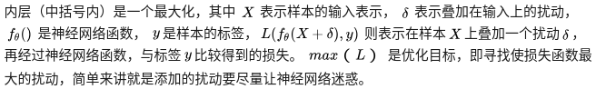

    - 该公式分为两个部分，一个是内部损失函数的最大化，一个是外部经验风险的最小化。
    - **即寻找使损失函数最大的扰动，简单来讲就是添加的扰动要尽量让神经网络迷惑**。
    - 内部max是为了找到worst-case的扰动，也就是攻击，最大化损失函数（交叉熵）目的是让添加噪声后的样本不再属于原来的类
    - 外部min是为了基于该攻击方式，找到最鲁棒的模型参数，也就是防御
 - 外层就是对神经网络进行优化的最小化公式，即当**扰动固定的情况下，我们训练神经网络模型使得在训练数据上的损失最小**，也就是说，使模型具有一定的鲁棒性能够适应这种扰动。
 - 对抗训练的两个作用：
    - 寻找合适的扰动，提高模型应对恶意对抗样本时的鲁棒性；
    - **作为一种regularization**，减少overfitting，提高泛化能力。
 - 在NLP任务中，对抗训练的角色不再是为了防御基于梯度的恶意攻击，反而更多的是作为一种regularization，提高模型的泛化能力。

## 5、常用的对抗训练方法
### 5.1、FGSM和FGM方法及代码实现
### 5.1.1、FGSM和FGM方法
 - FGSM（Fast Gradient Sign Method）和FGM（Fast Gradient Method），两者的扰动如下：

    

 - 其中，，也就是**损失函数L关于输入X的梯度**，这个梯度在我们做神经网络优化的时候是很容易求出来的。
 - 思想很简单，就是**让扰动的方向是沿着梯度提升的方向的**，沿着梯度提升意味着让损失增加的最大。
 - FGSM和FGM在公式上的直观区别是，前者通过符号函数（Sign函数）对梯度采取max归一化，后者采用的是L2归一化。

### 5.1.2、FGM代码实现
 - 为了实现插件式的调用，笔者将一个batch抽象成一个样本，一个batch统一用一个norm，由于本来norm也只是一个scale的作用，影响不大。笔者的实现如下

```
class FGM():
    def __init__(self, model):
        self.model = model
        self.backup = {}

    def attack(self, epsilon=1., emb_name='emb.'):
        # emb_name这个参数要换成你模型中embedding的参数名
        for name, param in self.model.named_parameters():
            if param.requires_grad and emb_name in name:
                self.backup[name] = param.data.clone()
                norm = torch.norm(param.grad)
                if norm != 0:
                    r_at = epsilon * param.grad / norm
                    param.data.add_(r_at)

    def restore(self, emb_name='emb.'):
        # emb_name这个参数要换成你模型中embedding的参数名
        for name, param in self.model.named_parameters():
            if param.requires_grad and emb_name in name: 
                assert name in self.backup
                param.data = self.backup[name]
        self.backup = {}
```
 - 需要使用对抗训练的时候，只需要添加五行代码：

```
# 初始化
fgm = FGM(model)
for batch_input, batch_label in data:
    # 正常训练
    loss = model(batch_input, batch_label)
    loss.backward() # 反向传播，得到正常的grad
    # 对抗训练
    fgm.attack() # 在X的embedding上添加对抗扰动（该步就是内层loss最大化）
    loss_adv = model(batch_input, batch_label)
    loss_adv.backward() # 反向传播，并在正常的grad基础上，累加对抗训练的梯度
    fgm.restore() # 恢复embedding参数
    # 梯度下降，更新参数（该步就是外层loss最小化）
    optimizer.step()
    model.zero_grad()
```
 - 上述过程总结如下：
    - 1.首先计算一个batch的正常样本的loss（对整个batch进行操作，而不是单个样本）
    - 2.然后将该loss进行反向传播，得到正常的grad
    - 3.对于FGM，利用该grad和L2正则化来计算该batch样本的扰动，并将计算出的扰动加入正常数据中，得到扰动后数据
    - 4.使用扰动后数据重新计算该batch的扰动后loss
    - 5.将该扰动后loss进行反向传播，得到扰动后grad（其中backward()函数，如果之前的梯度不置0就会将其累加，这里得到的是累计后的总梯度）
    - 6.然后恢复embedding参数（即将数据的扰动去除），恢复的原因是：在下一步更新参数时更新的是加扰动前的样本
    - 7.进行梯度下降，更新参数
    - 8.将梯度置0，重新取一个batch重复上述过程
 - 也就是说对于每个batch（即每次迭代），先使用正常样本计算loss_1得到grad_1，然后使用扰动样本计算loss_2得到grad_2（在正常grad_1的基础上累加扰动样本的梯度后得到grad_2），
 然后根据扰动后累加的梯度，在扰动前的数据上进行梯度下降，更新参数。

### 5.2、PGD方法及代码实现
#### 5.2.1、PGD方法
 - 为了解决FGSM和FGM中的线性假设问题，使用PGD(Projected Gradient descent)方法来求解内部的最大值问题。
 - PGD是一种迭代攻击，相比于普通的**FGSM和FGM仅做一次迭代（即一个batch内的样本只做一次迭代），PGD是做多次迭代（即一个batch进行多次迭代，每次梯度提升一小步），每次走一小步，每次迭代都会将扰动投射到规定范围内**。

    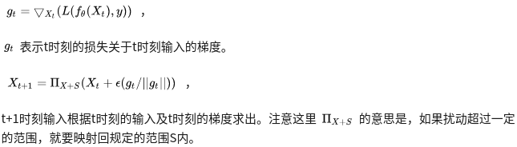

    - 上式对t的梯度做了L1正则化，得到t时刻的梯度方向，然后乘上一个因子作为扰动，再和t时刻的输入相加，得到t+1时刻的输入。也就是说t+1时刻的输入是t时刻的输入沿着梯度提升的方向前进了一小步，每个时刻操作的都是整个batch。
    - 因为每次走一小步，要走K次，相当于一个样本反复迭代更新K次（将一个batch迭代K次，则每个样本也迭代了K次）。
    - 由于每次只走很小的一步，所以局部线性假设基本成立的。经过多步之后就可以达到最优解了，也就是达到最强的攻击效果。
    - 论文还证明用PGD算法得到的攻击样本，是一阶对抗样本中最强的了。这里所说的一阶对抗样本是指依据一阶梯度的对抗样本。如果模型对PGD产生的样本鲁棒，那基本上就对所有的一阶对抗样本都鲁棒。
    - 实验也证明，利用PGD算法进行对抗训练的模型确实具有很好的鲁棒性。
 - PGD虽然简单，也很有效，但是存在一个问题是计算效率不高：
    - 如果不用对抗训练的方法，m次迭代只会有m次梯度的计算（迭代一次计算一次梯度，迭代是针对每个batch而言）。
    - 但是对于PGD而言，每做一次梯度下降（获取模型参数的梯度来训练模型），都要对应有K步的梯度提升（因为进行梯度下降之前该batch被迭代了K次或m次，其中的每一次都做了一个梯度提升；该batch的K次迭代玩之后在进行梯度下降，即获取输出的梯度，寻找扰动）。
    - 所以相比不采用对抗训练的方法，PGD需要做`(mK+m) = m(K+1)`次梯度计算，要多做`mK`次梯度的计算。

#### 5.2.2、PGD代码实现
 - 核心代码：

```
class PGD():
    def __init__(self, model):
        self.model = model
        self.emb_backup = {}
        self.grad_backup = {}

    def attack(self, epsilon=1., alpha=0.3, emb_name='emb.', is_first_attack=False):
        # emb_name这个参数要换成你模型中embedding的参数名
        for name, param in self.model.named_parameters():
            if param.requires_grad and emb_name in name:
                if is_first_attack:
                    self.emb_backup[name] = param.data.clone()
                norm = torch.norm(param.grad)
                if norm != 0:
                    r_at = alpha * param.grad / norm
                    param.data.add_(r_at)
                    param.data = self.project(name, param.data, epsilon)

    def restore(self, emb_name='emb.'):
        # emb_name这个参数要换成你模型中embedding的参数名
        for name, param in self.model.named_parameters():
            if param.requires_grad and emb_name in name: 
                assert name in self.emb_backup
                param.data = self.emb_backup[name]
        self.emb_backup = {}
        
    def project(self, param_name, param_data, epsilon):
        r = param_data - self.emb_backup[param_name]
        if torch.norm(r) > epsilon:
            r = epsilon * r / torch.norm(r)
        return self.emb_backup[param_name] + r
        
    def backup_grad(self):
        for name, param in self.model.named_parameters():
            if param.requires_grad:
                self.grad_backup[name] = param.grad.clone()
    
    def restore_grad(self):
        for name, param in self.model.named_parameters():
            if param.requires_grad:
                param.grad = self.grad_backup[name]
```

 - 使用用方式

```
pgd = PGD(model)
K = 3
for batch_input, batch_label in data:
    # 正常训练
    loss = model(batch_input, batch_label)
    loss.backward() # 反向传播，得到正常的grad
    pgd.backup_grad()  # 原始梯度
    # 对抗训练
    for t in range(K):
        pgd.attack(is_first_attack=(t==0)) # 在embedding上添加对抗扰动, first attack时备份param.data
        if t != K-1:
            model.zero_grad()
        else:
            pgd.restore_grad()  # 将梯度累加到原始梯度之上
        loss_adv = model(batch_input, batch_label)
        loss_adv.backward() # 反向传播，并在正常的grad基础上，累加对抗训练的梯度
    pgd.restore() # 恢复embedding参数
    # 梯度下降，更新参数
    optimizer.step()
    model.zero_grad()
```
 - 上述过程总结如下：
    - 1.计算一个batch正常样本的loss，并将梯度反向传播，保存该梯度
    - 2.接下来进行对抗训练，对于K中的某次迭代t：
        - 2.1 在embedding上添加对抗扰动，当t==0时，备份原始数据param.data
        - 2.2 当不是最后一次迭代时，将该次迭代计算出来的梯度抛弃，这时输入X在一点点的更新（即扰动在一步步的添加）；当是最后一次迭代时，将该迭代后计算出的梯度累加到原始梯度上。
    - 3.然后恢复embedding参数（即将数据的扰动去除）
    - 4.进行梯度下降，更新参数
    - 5.将梯度置0，重新取一个batch重复上述过程


### 5.3、FreeAT方法
 - 普通训练的方式和PGD对抗训练的方式稍微有些不同。普通训练时相邻的batch是不同的batch，而PGD对抗训练在梯度提升的计算样本时，需要对同一个mini-batch的样本，反复求梯度（即反复计算梯度提升以不断地小步的添加扰动）。
 - **原始的PGD训练方法，每次内层计算（每次迭代）只用梯度来更新扰动，等K步走完之后，才根据该步得到的累计扰动变量X来计算一次梯度去更新模型参数**。
 - FreeAT（Free Adversarial Training）仍然采用了PGD这种训练方式，即**对于每个min-batch会迭代地求K次梯度，每次求得的梯度，我们既用来更新输入变量的扰动，也用来更新模型的参数**。
 - 需要注意的是，如果内层做K次迭代的话，对于外层计算，FreeAT会把总体的迭代epoch值除以K，这样来保证总体的梯度计算的次数跟普通训练时一致。
 - 从外层训练的视角来看，每个min-batch被训练的次数和普通训练是相同的，只不过其被训练的顺序有些变化，K个相同的min-batch会被顺序的训练。 这样带来的问题是连续相同的mini-batch对参数更新，不如随机mini-batch带来的扰动大，这有可能影响到最终模型收敛的效果。但是论文用实验证明，这种担心不太必要。
 - FreeAT算法如下：

    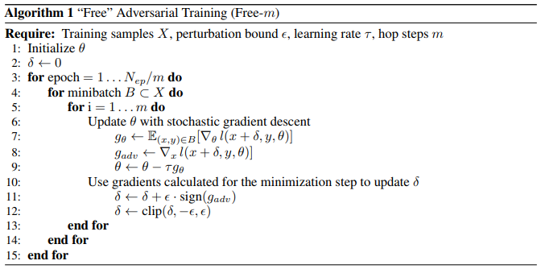

### 5.4、YOPO方法
 - YOPO（You can Only Propagate Once）
 - YOPO的出发点是利用神经网络的结构来降低梯度计算的计算量。
 - 从PMP(Pontryagin's maximum principle)的角度看，**对抗扰动只和神经网络的第一层有关**。所以，论文提出**固定住前面的基层，只对第一层求梯度，并据此来更新扰动**。

### 5.5、FreeLB方法
 - FreeLB（Free Large Batch Adversarial Training）

    
 - 和FreeAT一样，FreeLB也想更高效的利用两种梯度。但是和FreeAT不一样的是，FreeLB并**不是在每次梯度提升的过程中，都会同时对模型参数进行更新（像FreeAT），也不是迭代完第K步后根据地K步（最后一步）的梯度来对模型参数进行更新（像PGD）**，而是**将模型参数的梯度累积起来**，即算法第8行`g_t`更新的过程。
 - 因为每次都是在一个batch的数据做K次迭代，这样走过K步之后，FreeLB利用K步之后积累的参数梯度`g_K`，对参数`theta`，进行更新，即算法第13行的更新过程。
 - FreeLB对于每个batch一共需要进行`N_{ep}·K`次梯度计算，相比于PGD需要进行`N_{ep}·(K+1)`次梯度计算（其中`N_{ep}`是epoch的个数，这个次数是对每个batch而言的，前者的次数表示在每个epoch中的每个batch都要分别计算K次模型参数`theta`的梯度），是节省了`N_{ep}`次梯度计算，
 但是相比于FreeAT只需要`N_{ep}`次梯度计算而言，FreeLB效率的提升并不明显。但是**FreeLB的优势并不在效率，而是在效果**。由于**FreeLB利用了多步K积累的梯度再做更新，对梯度的估计更加精准，而且不存在FreeAT那样连续利用多个相同的min-batch进行梯度更新的问题**。
 - 相比于YOPO-m-n，FreeLB也是将K步（这里指m）中的梯度综合后再更新参数，不同的是其没有更进一步的n层，即使有，也是n个完全相同的值。
 - 为什么论文中称这种算法为Large Batch呢？这是因为在梯度下降时，我们使用的梯度是基于`X + theta_0, ..., X + theta_{K-1}`进行计算的，这**可以理解为近似的对K个不同样本的batch进行平均，所以相当于虚拟的增大了样本的数量**。
 - 论文中还指出了很重要的一点，就是**对抗训练和dropout不能同时使用**，因为加上dropout相当于改变了网络结构，会影响扰动r的计算。如果要用的话需要在K步中都使用同一个mask（即都drop掉同一批神经元）。

## 6、各种对抗训练方法的区别
 - 对模型而言更新的是模型参数的梯度，对扰动样本而言更新的是输入X的梯度
 - FGSM和FGM的区别：（**一个batch，一次迭代**）
    - 两者区别在于采用的归一化的方法不同：
        - FGSM是通过符号函数（Sign函数）对梯度采取**max归一化**，max归一化是指：如果梯度某个维度上的值为正，则设为1；如果为负，则设为-1；如果为0，则设为0。
        - FGM则采用的是**L2归一化**，L2归一化则将梯度的每个维度的值除以梯度的L2范数，类似于softmax的过程。
        - 理论上L2归一化更严格的保留了梯度的方向，但是max归一化则不一定和原始梯度的方向相同。
    - 缺点：
        - 当然两种方法都有个假设，就是损失函数是线性的或者至少是局部线性的。如果不是（局部）线性的，那梯度提升的方向就不一定是最优方向了。
        - 而PGD是一步步提升，一定程度上避免了这个问题。
 - PGD和FreeAT的区别：
    - PGD：（**即一个batch进行K次迭代，每一次迭代都将输入X沿着梯度提升的方向前进一小步，对该batch反复求梯度，一点点迭代更新。每次内层计算梯度提升来更新扰动，等K步走完之后，才重新再计算一次梯度下降，更新参数**）
        - 为了解决FGSM和FGM中的线性假设问题，使用PGD方法来求解内部的最大值问题。
        - PGD是一种迭代攻击，相比于普通的**FGSM和FGM仅做一次迭代，PGD是做多次迭代，每次走一小步，每次迭代都会将扰动投射到规定范围内**（即将前两者的梯度更新分到每个时间步来做，更细化，局部线性假设基本成立）。
        - t+1时刻输入是根据t时刻的输入及t时刻的梯度提升的一小步求出。
        - 用PGD算法得到的攻击样本，是一阶对抗样本中最强的了
        - 缺点：存在一个问题是计算效率不高
    - FreeAT：（**采用PGD的训练方式，对每个batch会分别求K次梯度，我们既用每次求得的梯度提升来更新扰动，也用每次求得的梯度下降来更新模型参数**）
        - 在PGD的计算过程中，每次做前向后向计算时，不管是参数的梯度还是输出的梯度，都会计算出来，只不过**在梯度下降的过程中只利用参数的梯度，在梯度提升的过程中只利用输入的梯度**（因为要产生扰动向量，需要对输入进行扰动，根据输入的梯度来对输入进行相应的扰动），有很大的浪费。
        - 在一次前向后向计算过程中，把计算出来的参数的梯度和输入的梯度同时利用上，这就是FreeAT的核心思想。
    - 区别：
        - PGD对抗训练在利用梯度提升来计算扰动样本时，需要对同一个mini-batch反复迭代来求梯度。每次内层计算只用梯度提升来更新扰动，**等K步走完之后，才计算一次梯度下降，更新模型参数**。
        - FreeAT仍然采用了PGD这种训练方式，即对于每个min-batch会求K次梯度，每次求得的梯度，我们既用来更新扰动，也用来更新参数。
 - FreeLB和FreeAT的区别：
    - FreeLB：（**和FreeAT不一样的是，FreeLB将一个batch内参数的梯度累积起来，相当于求平均/期望**）
        - 和FreeAT一样，FreeLB也想更高效的利用两种梯度。但是和FreeAT不一样的是，FreeLB并不是在每次梯度提升（即更新输入时）的过程中，都会对参数进行梯度下降来更新，**而是将每个batch求得的参数梯度累积起来，最后再进行梯度下降来更新模型参数**。
        - 与PGD不同的是，PGD是等K步走完之后，才利用最后一步的扰动来计算一次梯度下降，更新模型参数。没有FreeLB的累计梯度求平均/期望的思想。
    - 区别：
        - 相比FreeAT，FreeLB效率的提升并不明显。但FreeLB的优势并不在效率，而是在效果。
        - FreeLB积累了K步的下降的梯度来更新模型参数，对梯度的估计更加精准，而且不存在FreeAT那样连续利用多个相同的min-batch进行梯度更新的问题

## 7、对抗训练在内层loss最大化和外层loss最小化时每个样本的label相同吗？
 - 相同。
 - 内部loss最大化是为了找到能让样本表现的最差的一个扰动`r_{adv}`，是攻击的过程，该扰动被限制在一定范围内。
 - 外部loss最小化是为了基于该攻击方式，找到最鲁棒的模型参数，是防御的过程。
 - 扰动的思想可以理解为：将输入样本向着损失上升的方向再进一步，得到的对抗样本就能造成更大的损失，**提高模型的错误率**。其目的是得到扰动后的样本。
 - 先让模型尽可能的去犯错，目的是求得扰动；然后利用生成的扰动样本，再来强迫模型网正确label去预测强制其对扰动样本不犯错，经过这个过程模型就对固定范围内的样本产生了鲁棒性。


## 8、参考文献
 - [对抗攻击基础知识（一）](https://zhuanlan.zhihu.com/p/37260275)
 - [论文阅读：对抗训练（adversarial training）](https://www.zhihu.com/search?type=content&q=FreeLB)
 - [功守道：NLP中的对抗训练 + PyTorch实现](https://fyubang.com/2019/10/15/adversarial-train/)


# 九、文本/语义相似度
## 1、计算文本相似度的常用方法
 - bag-of-words (BOW)
 - TF-IDF
 - BM25
 - LSI
 - LDA
 - mSDA（Marginalized Stacked Denoising Autoencoder）
 - CCG（Componential Counting Grid）
 - WMD

## 2、WMD
 - 词移距离（Word Mover's Distance, WMD），用于判断两个文本之间的相似度，即WMD距离越大相似度越小
 - WMD是通过将一个文档中包含的词语“移动”（travel）到另一个文档中的词语，这个“移动”过程产生的距离总和的最小值作为词移距离。

    ```
    例子：
    
    两个短文本：
        “Obama speaks to the media in Illinois”
        “The President greets the press in Chicago”，
    
    那么从第一句子转移到第二个句子的示意图如下（已去除停用词）
    ```
    
    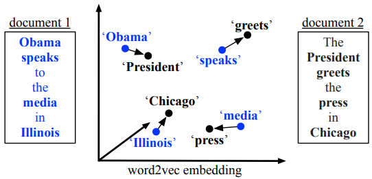

    - 针对示意图中的词移距离则表示为：distance("Obama"->"President")+distance("speaks"->"greets")+...
    - 使用word2vec来表征词，通过word2vec将词语向量化后，使用欧式距离公式计算两个词语之间的距离 
 - 上边方式存在的问题：
    - 仅仅考虑距离和最小，那么每两个词之间的距离都最小则为最优解，那么肯定会出现一对多，甚至一对全部的情况
      
        ```
        举个栗子，文档 1 中每个词都跟“音乐”密切相关；文档 2 中只有一个词跟“音乐”密切相关，其余词都跟“音乐”完全无关；
        文档 3 中有一个词跟“音乐”密切相关，其他词都跟“音乐”有点关系但关联性不大。那么直觉上文档1和文档3更相似，即：
        
        distance(d1, d3) < distance(d1, d2)
        
        但如果按照词语距离和最小的方式，最优解应该是文档1所有词转移到文档2中与“音乐”密切相关的词上，
        文档1同样也所有词转移到文档3中和“音乐”密切相关的词上，即一对所有。那么此时很有可能导致：
        
        distance(d1, d3) = distance(d1, d2)
        
        文档2与文档3中与音乐密切相关的词语刚好同一个。这显然是不合理的。
        ```
 - 为了让结果合理，WMD作者提出让文档1中的词以不同的权重转移到另一个文档的所有词上，即一个词不再全部转移到另一个词，而是部分转移到另一个词，这样让另一个文档的所有词去分配该词的权重。
 - 那么有一个问题，怎么确定每个转移分配到的权重合理，并且不会出现一对全部的情况，WMD提出增加两个约束条件来解决这个问题：
   
    

    - 约束1让文档1中的每个词都部分转移到文档2，但为了求最优解依然可能出现权重为0的情况。
    - 第二个约束表明，文档2中所有词收到的权重必须和文档2中词本身的权重相同，即保证了文档2中每个词都会得到转移权重，避免出现一对所有的情况。
 - 计算上式中参数`d_i`, `d'_j`, `c(i,j)`, `T_{ij}`的值：
    - 标准化BOW表示
      
        
    - 词转移代价
      
        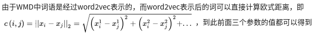
    - 获取`T_{ij}`的过程其实就是WMD模型求解的过程。
        - WMD求解--(Earth Mover's Distance，EMD)
            - WMD的求解是EMD问题的一个特例，而EMD问题实际上是线性规划中运输问题的最优解（参考[博客](https://blog.csdn.net/sinat_33741547/article/details/80163719)）。因此可以用同样的求解方式求解。
            - WMD算法复杂度为`O(p^{3}logp)`，其中p是文档中不重复词的个数，对于大的数据集来说这个模型的优化复杂度会非常高。
    - 那么怎么来减小模型的复杂度呢？
        - **词质心距离（Word centroid distance， WCD）**
        - 为了加快模型速度（ps：作者论文中对WMD加速方法是基于WMD算法对文本做KNN分类为下做的加速），作者提出下界来排除不必要的运算。
        - 下界WCD的推导方法如下：
        
            
        - WCD算法的距离表示，一个文本中词的质心到另一个文本中词的质心的距离。
        - WCD算法的复杂度为`O(dp)`，在做KNN时,通过使用WCD将待分类文档与样本集文档做一个快速的预计算，对计算结果进行从小到大排序，那么可以排除掉排序靠后的文档不做耗时的WMD计算。
        - **但WCD有个问题，就是这个下界太宽松**，什么意思呢？就是说如6>1这个下界1与WMD为6相差有点远了，可能会造成误判。
    - 那么有没有一种紧一点的下界呢？
        - **Relaxed word moving distance(RWMD)**
        - RWMD的思想是将WMD模型中的**两个限制条件去除一个**，只留下其中一个限制条件，这样因为放松的条件限制那最小距离也会随之减小。假设去掉第二限制条件，优化目标变成了：
        
            
            
            
        
        从图中可以看到，WCD与WMD相差较大，而RWMD与WMD相距很紧。
    - 现在得到两个下界距离，应该怎么使用呢？
        - **使用预取和裁剪（Prefetch and prune）**
        - 预取和裁剪是利用WCD与RWMD相配合，来缩减对基于WMD做KNN时的计算时间。具体方法如下：
            - 1.先用WCD计算待分类文档与其他文档的距离，取离它最近的个文档；
            - 2.计算m个文档中前k个文档的WMD；
            - 3.计算剩下文档的RWMD，如果某个文档的RWMD大于KNN列表中第k个文档的WMD就裁剪掉（排除），否则就计算它的WMD。如果发现在KNN列表中就更新KNN列表，否则裁剪。
    - 这就形成了最终的计算方式。通过使用Prefetch and prune缩减计算量，提高效率。
      
        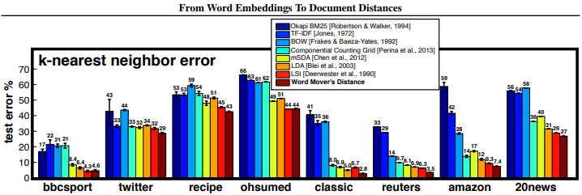
    
        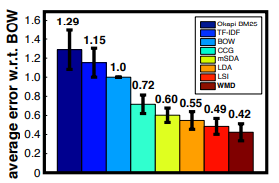
    
        - 结果1展示了在8个数据集上的各种方法的在KNN分类上的错误率，可以看到WMD的表现优于其他方法。
        - 结果2展示了7中方法在8个数据集上相对于BOW的平均错误率，即每种方法的平均错误率除以BOW的平均错误率。

## 3、计算句子间相似度的方法
 - 1.无监督的方法，即不使用额外的标注数据，常用的方法有：
    - （1）对句子中所有词的word vector求平均，获得sentence embedding
    - （2）以每个词的TF-IDF为权重，对所有词的word vector加权平均，获得sentence embedding
    - （3）以smooth inverse frequency ([SIF](https://openreview.net/pdf?id=SyK00v5xx))为权重，对所有词的word vector加权平均，最后从中减掉principal component，得到sentence embedding
    - （4）通过Word Mover’s Distance ([WMD](http://proceedings.mlr.press/v37/kusnerb15.pdf))，直接度量句子之间的相似度
 - 2.有监督的方法，需要额外的标注数据，常见的有监督任务有：
    - （1）分类任务，例如训练一个[CNN的文本分类器](https://arxiv.org/abs/1408.5882)，取最后一个hidden layer的输出作为sentence embedding，其实就是取分类器的前几层作为预训练的encoder
    - （2）sentence pair的等价性/等义性判定 ([pdf1](http://people.csail.mit.edu/jonasmueller/info/MuellerThyagarajan_AAAI16.pdf), 
    [pdf2](https://www.aclweb.org/anthology/W16-1617.pdf))，这种方法的好处是不仅可以得到sentence embedding，还可以直接学习到距离度量函数里的参数
 - 博客[Comparing Sentence Similarity Methods](http://nlp.town/blog/sentence-similarity/)里比较了常见方法在计算句子相似句上的效果：

    

 从图中可以看到在这几个评估数据上：
    - （1）WMD方法（WMD-W2V）相对于其他无监督方法并没有明显的优势
    - （2）简单加权的词向量平均（AVG-W2V和AVG-W2V-TFIDF）已经可以作为一个较好的baseline，但是**考虑SIF加权的词向量平均（SIF-W2V)通常可以得到更好的效果**
    - （3）这里比较了两种预训练的encoder（InferSent/INF和Google's Sentence Encoder/GSE），相对而言GSE效果更好一些，但要注意它的性能并不一定在所有的数据集上都稳定。
 - 另外，从实践中的经验来看，如果要在无标注的数据上从零开始实现相似度的计算，可以**综合几种方法来得到更好的效果**。一种可能的步骤如下：
    - （1）使用某种无监督方法，对于句子集合做简单归类和标注
    - （2）通过1中得到的标注数据，训练分类模型或者句子对模型，从而得到相似度模型
    - （3）评估模型效果，适当引入新的标注数据，重复步骤1）2）

## 4、深度学习派方法
 - （1）最简单的就是两个句子分别过一个CNN或者LSTM，然后在向量空间算分，相关[论文](http://cis.csuohio.edu/~sschung/CIS660/RankShortTextCNNACM2015.pdf)
    - 这个方法有一个trick就是千万别用MLP在向量空间算，效果大打折扣，一定要用`a^{T}wb`这种，或者你把`[a, b b a^{T}wb]`当做MLP的输入。一定要有这项，原因是其实你a和b直接连接会丢信息，
    就是boundary信息，并不知道a的边界在哪里，b的边界在哪里。
    - 如果靠连接起来走MLP不靠Bilinear的计算训练收敛速度会慢很多，且最后往往没有Bilinear的收敛的好。这个原因大概是Bilinear相当于我已经告诉神经网络，a和b都是哪里，不用神经网络去学，让收敛速度变快。另外，a自己作用自己往往是无效的（设想MLP时候A自己的第一维度还要和自己的第二维度发生作用，这其实是奇怪的在匹配任务重）。当然这两种模型的差距在数据的增大时候会效果越来越接近，可见模型在很大规模数据上，可以学习到这件事情（不过往往写论文的数据集没这么大）。
 - （2）李航老师的Arc2不是很work，但是想法非常非常好，亲测仍需提高，稍微改改就可以很work。
 相关[论文1](https://arxiv.org/pdf/1503.03244.pdf)，[论文2](https://arxiv.org/abs/1602.06359)，
 改为RNN上做CNN（原始方法是只做了Pooling，如果做Convolution会更好）[论文3](https://arxiv.org/pdf/1511.08277.pdf)
    - 先简介Arc2，这个模型把两句话的所有word算了个分生成了一个`n*m`的矩阵，然后把这个矩阵当图片过cnn。
    - 原本算词-词相似度是两个词向量连一起然后算个分，其实`a^{T}b`或`a^{T}wb`比Arc2中原始的`[a,b]·W`好用很多。
    - 另外，在cnn算的时候，直接用word embedding不是最佳方案，最佳方案是用已经过了LSTM的hidden state。
 - （3）去年还提出了一套Attention系列的匹配方法，例如[Match-LSTM](https://www.aclweb.org/anthology/N16-1170.pdf)，在聊天这个任务上评测没有（2）好用。
 相关[论文1](https://arxiv.org/abs/1511.04108)，[论文2](https://arxiv.org/pdf/1509.06664.pdf)，还有比较古老的方法DSSM。

## 5、从Kaggle赛题: Quora Question Pairs 看文本相似性/相关性
 - 给定两个quora中的提问。判断两个问题是不是一个问题。比如：A.如何学习NLP？ B.怎样学习自然语言处理？
 - 特征工程方法：传统方法不外乎各种角度的特征工程
    - 编辑距离
        - 编辑距离（Edit Distance），是指两个字串之间，由一个转成另一个所需的最少编辑操作次数。
        - 许可的编辑操作包括将一个字符替换成另一个字符，插入一个字符，删除一个字符。
        - 一般来说，编辑距离越小，两个串的相似度越大。
    
            ```
            例如：
            
            有两个字符串：kitten和sitting，现在我们要将kitten转换成sitting，可以做如下的一些操作；
            
            将K替换成S，将e替换成i，添加g。
            
            在这里我们设置每经过一次编辑，也就是变化（插入，删除，替换）我们花费的代价都是1。
            ```
        - FuzzyWuzzy这个python包提供了比较齐全的编辑距离度量方法。
    - 集合度量特征
        - 集合度量方式就是把两个句子看成BOW(bag of words)。
        - 然后使用集合相似性度量方法比如Jaccard等。
        - 这种方法有一个严重问题就是丢失语序。
    - 统计特征
        
        - 比如句子长度，词长度，标点数量，标点种类，以及词性序列上的度量，这也是最直观的度量方法
    - 使用预训练的词向量得到句子表示进行度量
        - 使用词向量的一种简单的方法是，BOW求平均，得到两个句子的表示，然后利用余弦相似度度量，这是一种非常简单而直观的方法。
        - 或者WMD的度量方法，这个思路也非常直觉，实际表现也非常良好
    - 使用传统方法如tfidf，LDA等topic model等拿到句子表示进行度量，使用tfidf值对词向量做一个加权，得到的句子表示也是一种不错的表示。
 - 深度模型：
    - 深度模型有两种思路，一种是基于表示，一种是基于交互。不过基于交互的模型大多也是先要拿到文本表示，从文本表示构建交互，从交互到特征抽取的思路。
    - 基于表示的方法：
    
        
    
        这是一个非常直观的思路，最后一层的matching score建模方法甚至可以用一个简单的FC代替，或者做一次element-wise 乘之后接FC。下面有在IR中用表示方法做这个问题的几篇论文：
    
        [DSSM](https://www.microsoft.com/en-us/research/wp-content/uploads/2016/02/cikm2013_DSSM_fullversion.pdf)，
        [CDSSM](http://www.iro.umontreal.ca/~lisa/pointeurs/ir0895-he-2.pdf)，
        [ARC I](http://www.hangli-hl.com/uploads/3/1/6/8/3168008/hu-etal-nips2014.pdf)，
        [LSTM-RNN](https://arxiv.org/abs/1502.06922)
    - 基于交互的方法：是通过Interaction来对文本相似性建模，其模型基本的原理是
      
        
    
        
        - 文章[Text Matching as Image Recognition](https://arxiv.org/abs/1602.06359)原理如下：
            - 拿到每个词的embedding。(embedding)
            - 构建两个文本的相似矩阵。(Interaction)
            - 把相似矩阵放入两层CNN中。(Feature extract)
            - 把CNN的结果放入两层的全连接中。(FC)
            - 获得二分类的score。(distribution)
        - 后来的一些工作都大同小异，比如不直接使用词向量，利用RNN的隐层向量去构建交互等等。具体的文章如下：
        [DeepMatch](https://www.semanticscholar.org/paper/A-Deep-Architecture-for-Matching-Short-Texts-Lu-Li/4aba54ea82bf99ed4690d45051f1b25d8b9554b5)，
        [ARC II](https://arxiv.org/pdf/1503.03244.pdf)，
        [MatchPyramid](http://www.bigdatalab.ac.cn/~lanyanyan/papers/2016/AAAI2016_pang.pdf)，
        [Match-SRNN](https://arxiv.org/abs/1604.04378)
 - 在比赛中发现，训练集和测试集的正负样本比有明显差异，分布上的差异最后体现在logloss指标上的gap，在比赛中大家推导出一个后处理的公式，然后可以拉平分布带来的分数异动。使用贝叶斯公式能推导出这个后处理，
 前提是可以测出分布的情况下。有[论文](https://www.isys.ucl.ac.be/staff/marco/Publications/Saerens2002a.pdf)对这个做了详细的讲解。
 - 比赛中一些预处理方法有：
    - 词元化/词干化
    - 去停止词
    - 标点符号清洗
    - 特殊符号替换
    - 词向量扩充句子得到另一份句子（这个直觉的思路是，利用词向量找相关词的特性，增加传统特征方法的容错性。比如集合度量方法，开心和高兴虽然是一个意思，但是不扩充近义词的话，其容错性很低）
 - 不得不提的是，这个比赛中有一个非常关键的leak信息，一个问题如果出现频繁的话，就很可能是一个重复的问题。后来发现前几名在这个leak上做了很多文章，取得了非常好的效果。
 - 比赛前几名解决方案：
    - [第一名的解法](https://link.zhihu.com/?target=https%3A//www.kaggle.com/c/quora-question-pairs/discussion/34355)：他的特征工程中含有大量的来自图的Structural features，有300多个模型做了stacking
    - [第四名的解法](https://link.zhihu.com/?target=https%3A//www.kaggle.com/c/quora-question-pairs/discussion/34349)，代码[地址](https://link.zhihu.com/?target=https%3A//github.com/HouJP/kaggle-quora-question-pairs)
    - 第五名的解法：也是在图的建模上挖掘了大量的特征
    - [第七名的解法](https://link.zhihu.com/?target=https%3A//www.kaggle.com/c/quora-question-pairs/discussion/34697)：花了大量的时间在深度模型上。和第一名都用了一个叫[decomposable attention](https://link.zhihu.com/?target=https%3A//arxiv.org/abs/1606.01933)的东西
    - [本文解法](https://link.zhihu.com/?target=https%3A//github.com/SpongebBob/Quora-Kaggle)

## 6、参考博客
 - [文本相似度度量——词移距离（WMD）](https://www.zhihu.com/search?type=content&q=WMD)
 - [如何用 word2vec 计算两个句子之间的相似度？](https://www.zhihu.com/search?type=content&q=WMD)
 - [如何通过词向量技术来计算 2 个文档的相似度？](https://www.zhihu.com/question/33952003)
 - [从Kaggle赛题: Quora Question Pairs 看文本相似性/相关性](https://www.zhihu.com/search?type=content&q=WMD)


# 十、聚类算法
## 1、聚类任务
 - 在无监督学习中，训练样本的标记信息是未知的，目标是通过对无标记训练样本的学习来揭示数据的内在性质和规律
 - 聚类试图将数据集中的样本划分为若干个通常是不相交的子集，每个子集称为一个簇
 - 聚类既能作为一个单独的过程，用于寻找数据内在的分布结构，也可作为分类等其它学习任务的前驱过程，比如先聚类，得到几个类别，然后在有监督的去学习这几个类别（前提是不知道数据都有那些类别）
 - 两个基本问题：
    - 性能度量
        - 我们希望同一簇的样本尽可能彼此相似，不同簇的样本尽可能不同，即聚类结果的簇内相似度高，簇间相似度低
        - 聚类性能度量分两类：
            - 外部指标
                - 将聚类结果与某个参考模型进行比较
            - 内部指标
                - 直接考察聚类结果而不利用任何参考模型
                
            
            
            
    - 距离计算

## 2、原型聚类
 - 即基于原型的聚类，此类算法假设聚类结构能通过一组原型刻画
 - 常用算法：
    - K均值算法（k-means）
    
        
        
        - k-means算法针对聚类所得簇划分，最小化平方误差
        
            
            
            - 其中`u_i`是簇`C_i`的均值向量，上式在一定程度上刻画了簇内样本围绕簇均值向量的紧密程度，E越小则簇内样本相似度越高
            - k-means采用了贪心策略，通过迭代优化来近似求解上式，如果迭代更新后聚类结果保持不变，则将当前簇划分结果返回
    - 学习向量量化（LVQ）
        - 与k-means类似，LVQ也是试图找到一组原型向量来刻画聚类结构
        - 不同的是，**LVQ假设数据样本带有类别标记**，学习过程利用样本的这些监督信息来辅助聚类
        
            
        - 假设每个样本是n维向量，则LVQ的目标是学习一组n维原型向量（可以从预设的类别中随机挑选一个样本向量进行初始化），每个原型向量代表一个聚类簇
        
            
            
    - 高斯混合聚类
        - 与k-means、LVQ用原型向量来刻画聚类结构不同，高斯混合聚类**采用概率模型来表达聚类原型**
        - 从原型聚类的角度来看，高斯混合聚类是采用概率模型（高斯分布）对原型进行刻画，簇划分则由原型对应后验概率确定
        - TODO

## 3、密度聚类
 - 基于密度的聚类，此类算法假设聚类结构能通过样本分布的紧密程度确定
 - 密度聚类算法从样本密度的角度来考虑样本之间的可连接性，并基于可连接样本不断扩展聚类簇以获得最终的聚类结果
 - DBSCAN算法，基于一组邻域参数来刻画样本分布的紧密程度

    
    
    
    
 - 个人认为密度聚类适合做异常点检测，筛选出不属于任何簇的样本点，作为异常点（噪声点）

## 4、层次聚类
 - 层次聚类试图在不同层次对数据集进行划分，从而形成树形的聚类结构
 - 数据集的划分可采用自底向上的聚合策略，也可采用自顶向下的分拆策略
 - AGNES是一种自底向上聚合策略的层次聚类算法：
    - 先将数据集中的每个样本看作一个初始聚类簇
    - 然后在算法运行的每一步中找出距离最近的两个聚类簇进行合并（有点像归并排序思想/哈夫曼编码思想的感觉，都是自底向上）
    - 上述过程不断重复，直至达到预设的聚类簇个数
    - 关键点在于如何计算聚类簇之间的距离，实际上，每个簇是一个样本集合，因此只需采用关于集合的某种距离即可，采用如下方式计算集合之间的距离：
    
        
        
        
        


# 十一、降维与度量学习

## 1、低维嵌入
 - 很多学习方法都涉及距离计算，而高维空间会给距离计算带来很大麻烦
 - 在高维情形下出现的数据样本稀疏、距离计算困难等问题，称为维数灾难
 - 降维是缓解维数灾难的一个重要途径，即通过某种数学变换将原始高维属性空间转变为一个低维子空间，在这个子空间中样本密度大幅提高，距离计算变易
 - 能够降维的原因是：人们观测或收集到的数据样本虽然是高维的，但与学习任务密切相关的也许仅是某个低维分布，即高维空间中的一个低维嵌入
 - 在现实应用中为了有效降维，往往仅需要降维后的距离与原始空间中的距离尽可能接近，不必严格相等
 - **矩阵的特征值和特征向量可以揭示线性变换的深层特性**，对应不同特征值的特征向量线性无关
 - 若要求原始空间中样本之间的距离在低维空间中得以保持，即得到多维缩放（MDS）

    
    
    
    
 - 对原始高维空间进行线性变换：

    

    - **基于线性变换来进行降维的方法称为线性降维方法**，
 - 对降维效果的评估，通常是比较降维前后学习器的性能

## 2、主成分分析
 - 主成分分析（PCA）是最常用的一种降维方法，常用于高维数据的降维，可用于提取数据的主要特征分量。
 - 协方差：
    - 如果X与Y是统计独立的，那么二者之间的协方差就是0
    - 但是，反过来并不成立。即如果X与Y的协方差为0，二者并不一定是统计独立的。
    - **协方差是一个衡量线性独立的无量纲的数，协方差为0的两个随机变量称为是不相关的**
 - 先考虑一个问题：对于正交属性空间中的样本点，如何用一个超平面（直线的高维推广）**对所有样本进行恰当的表达**？该超平面应该具有以下性质：
    - 最近重构性：样本点到这个超平面的距离都足够近
    - 最大可分性：**样本点在这个超平面上的投影能尽量分开（需要最大化投影点的方差!!!）**
    - PCA的数学推导可以从最大可分型和最近重构性两方面进行，前者的优化条件为点到划分平面距离最小，后者的优化条件为**划分后方差最大**
 - 基于上述两个性质，能分别得到PCA的两种等价推导
 - PCA算法：

    
    
    
    
    
    
    根据协方差矩阵可知：**对角线上为方差（也就是特征值），特征值最大就是方差最大**。
 - 降维之后，最小的`d - d'`个特征值的特征向量被舍弃，这是降维导致的结果，但是这是必要的：
    - 一方面，舍弃这部分信息之后能使样本的采样密度增大，这正是降维的重要动机
    - 另一方面，当数据受到噪声影响时，最小的特征值所对应的特征向量往往与噪声有关，将他们舍弃能在一定程度上起到去燥的效果
 - ---------------------------------- 分割线 ----------------------------------
 - A与B的内积值等于A向B所在直线投影的表量长度。
 - 要准确描述向量，首先要确定一组基，然后给出在基所在的各个直线上的投影值，就可以了
 - 两个矩阵相乘的意义是将右边矩阵中的每一列向量变换到左边矩阵中以每一行行向量为基所表示的空间中去。也就是说一个**矩阵可以表示一种线性变换**。
 - 选择不同的基可以对同样一组数据给出不同的表示，**如果基的数量少于向量本身的维数，则可以达到降维的效果**。
 - 如何选择基才是最优的? 从N维降到K维，应该如何选择K个基才能最大程度保留原有的信息？
    - 一种直观的看法是：**希望投影后的投影值尽可能分散，因为如果重叠就会有样本消失**。当然这个也可以从熵的角度进行理解，熵越大所含信息越多。
    - 即寻找一个一维基，使得所有数据变换为这个基上的坐标表示后，**方差值最大**。
 - 在一维空间中我们可以用方差来表示数据的分散程度。而对于高维数据，我们用协方差进行约束，**协方差可以表示两个变量的相关性**。为了让两个变量尽可能表示更多的原始信息，我们**希望它们之间不存在线性相关性，因为相关性意味着两个变量不是完全独立，必然存在重复表示的信息**。
 - 当协方差为0时，表示两个变量完全独立。**为了让协方差为0，我们选择第二个基时只能在与第一个基正交的方向上进行选择**，因此最终选择的两个方向一定是正交的。
 - 降维问题的优化目标：**将一组N维向量降为K维，其目标是选择K个单位正交基，使得原始数据变换到这组基上后，各变量两两间协方差为0，而变量方差则尽可能大（在正交的约束下，取最大的K个方差）**
 - 协方差矩阵：

    
 - 根据我们的优化条件，我们需要将除对角线外的其它元素化为0（即使得所有协方差尽量接近0,是变量之间完全独立。另一种解释是，将其它元素置0之后，留下来的矩阵的每行可以作为一个基向量，各行之间是正交的），并且在对角线上将元素按大小从上到下排列（变量方差尽可能大，因为在协方差矩阵里，对角线上的元素是变量的方差，其它元素是变量之间的协方差），这样我们就达到了优化目的。
   
    
    
    
 - 在叙述求协方差矩阵对角化时，我们给出希望变化后的变量有：变量间协方差为0且变量内方差尽可能大。
 - 我们要找到最大方差也就是协方差矩阵最大的特征值，最佳投影方向就是最大特征值所对应的特征向量，次佳就是第二大特征值对应的特征向量，以此类推
 - 此外，最近重构性也可对上述问题进行求解：以上的证明思路主要是基于最大可分性的思想，通过一条直线使得样本点投影到该直线上的方差最大。除此之外，我们还可以将其转换为线型回归问题，其目标是求解一个线性函数使得对应直线能够更好地拟合样本点集合。这就使得我们的优化目标从方差最大转化为平方误差最小，因为映射距离越短，丢失的信息也会越小。区别于最大可分性，这是从最近重构性的角度进行论证。
 - 总结一下PCA的算法步骤：

    
 - PCA的性质：
    - 1.缓解维度灾难：PCA算法通过舍去一部分信息之后能使得样本的采样密度增大（因为维数降低了），这是缓解维度灾难的重要手段；
    - 2.降噪：当数据受到噪声影响时，**最小特征值对应的特征向量往往与噪声有关（因为在协方差矩阵中，特征值表示方差大小，方差大的所含信息多，即排名靠前的主成分，方差小的所含信息少，即无关紧要的成分，可以当作噪声点）**，将它们舍弃能在一定程度上起到降噪的效果；
    - 3.过拟合：PCA保留了主要信息，但这个主要信息只是针对训练集的，而且**这个主要信息未必是重要信息。有可能舍弃了一些看似无用的信息，但是这些看似无用的信息恰好是重要信息，只是在训练集上没有很大的表现，所以PCA也可能加剧了过拟合**；
    - 4.特征独立：PCA 不仅将数据压缩到低维，**它也使得降维之后的数据各特征相互独立**；
 - 一些细节：
    - 零均值化
        - 当对训练集进行PCA降维时，也需要对验证集、测试集执行同样的降维。而对验证集、测试集执行零均值化操作时，均值必须从训练集计算而来，不能使用验证集或者测试集的中心向量。
        - 另外我们也需要保证一致性，我们拿训练集训练出来的模型用来预测测试集的前提假设就是两者是独立同分布的，如果不能保证一致性的话，会出现Variance Shift的问题。
    - 与SVD的对比
        - 特征值和特征向量是针对方阵才有的，而对任意形状的矩阵都可以做奇异值分解。
        - 如下：
        
        

## 3、为啥要最大化投影点的方差？
 - 用一个超平面（直线的高维推广）对所有样本进行恰当的表达
 - 要具有最大可分性：样本点在这个超平面上的投影能尽量分开（需要最大化投影点的方差）
 - 希望投影后的投影值尽可能分散，因为如果重叠就会有样本消失
 - 熵越大所含信息越多
 - 使得所有数据变换为这个基上的坐标表示后，方差值最大，熵大所含信息多，能最大程度保留原有的信息
 - 其目标是选择K个单位正交基，使得原始数据变换到这组基上后，各变量两两间协方差为0，而变量方差则尽可能大（在正交的约束下，取最大的K个方差）
 - 最佳投影方向就是最大特征值所对应的特征向量，次佳就是第二大特征值对应的特征向量
 - 最小特征值对应的特征向量往往与噪声有关（因为在协方差矩阵中，特征值表示方差大小，方差大的所含信息多，即排名靠前的主成分，**方差小的所含信息少，即无关紧要的成分，可以当作噪声点**）


## 4、参考博客
 - [降维——PCA](https://www.zhihu.com/search?type=content&q=pca%E9%99%8D%E7%BB%B4)

## 5、核化线性降维
 - TODO

## 6、流形学习
 - TODO

## 7、度量学习
 - TODO


# 十二、Beam Search算法/贪心算法/维特比算法
## 1、贪心算法
 - 如果target sequence词汇表的大小为`|V_E|`的话，对于解码器的N步输出，他的搜索空间`|V_E|^N`。随着N的增大，那这个效率会非常低。所以我们才想要通过一些算法去找出使得概率最大的输出序列。
 - 贪心算法每一步都会计算当前步的最优解（贪心算法的思想，每一步都选择最大的概率），最后的输出序列不一定是全局的最优解。
 - **而维特比算法每一步都会保留当前步的所有N个状态各自的最优解，计算当前时刻每个状态到达下一时刻每个状态的值，对于下一时刻的每个状态而言，只保留从上一时刻到达该时刻该状态的最优路径（相当于所有路径都做了考虑，每次都丢弃到达每个状态的非最优路径），避免了贪心算法的局部最优解的问题**。

## 2、维特比算法
 - 目标是找出使`P(e1,e2,...,en|F)`最大的序列`e1,e2,...,en`。
 - 在HMM中使用了维特比算法
 - 算法思想：
    - 用动态规划的思想来求解概率最大的路径（最优路径）
    - 这个最终的最优路径就是我们想要得到的最终的输出序列。
    - 简单的说我们只需从第1步开始，递推地计算在第t步输出单词为e的各条部分路径的最大概率，直至得到最后一步输出单词e的各条路径的最大概率。
    - -------------------------- 分割线 --------------------------
    - 在第t步，计算当前时间步所有状态的最优路径
    
        ```
               第一步     第二步      第三步
                 e1        e2         e3
            |--> a         a          a
        F-->|--> b 交叉连接  b 交叉连接  b
            |--> c         c          c
        ```
    
    在第一步，假设：
    
        ```
        p(F-->a)=0.5
        p(F-->b)=0.3
        p(F-->c)=0.2
        ```
    
    第二步，假设：
    
        ```
        p(a-->a)=0.3
        p(a-->b)=0.4
        p(a-->c)=0.3
        
        p(b-->a)=0.4
        p(b-->b)=0.2
        p(b-->c)=0.4
        
        p(c-->a)=0.5
        p(c-->b)=0.2
        p(c-->c)=0.3
        ```
    
    则，在第二步，到达各个状态的最佳路径是：
    
        ```
        对于状态a：
            - 从第一步中三个状态分别到达第二步中的a状态
                F --> a --> a， p=0.5×0.3=0.15  最大，最优路径
                F --> b --> a， p=0.3×0.4=0.12
                F --> c --> a， p=0.2×0.5=0.10
            - 所以到达a的最优路径是 'F->a->a'
        
        对于状态b：
            - 从第一步中的三个状态分别到达第二步中的b状态
                F --> a --> b， p=0.5×0.4=0.20  最大，最优路径
                F --> b --> b， p=0.3×0.2=0.06
                F --> c --> b， p=0.2×0.2=0.04
            - 所以到达b的最优路径是 'F->a->b'
        
        对于状态c：
            - 从第一步中的三个状态分别到达第二步中的c状态
                F --> a --> c， p=0.5×0.3=0.15  最大，最优路径
                F --> b --> c， p=0.3×0.4=0.12
                F --> c --> c， p=0.2×0.3=0.06
            - 所以到达c的最优路径是 'F->a->c'
        ```
    
    第三步，假设：
    
        ```
        p(a-->a)=0.4
        p(a-->b)=0.4
        p(a-->c)=0.2
        
        p(b-->a)=0.3
        p(b-->b)=0.4
        p(b-->c)=0.3
        
        p(c-->a)=0.7
        p(c-->b)=0.1
        p(c-->c)=0.2
        ```
    
    则，在第三步，到达各个状态的最佳路径是：
    
        ```
        在第二步中，已经确定，
            - 到达a的最优路径是 'F->a->a'  0.5×0.3
            - 到达b的最优路径是 'F->a->b'  0.5×0.4
            - 到达c的最优路径是 'F->a->c'  0.5×0.3
        
        则，在第三步中，从第二步的3个状态，分别到达第三步中的[a,b,c]状态的分析如下：
        对于状态a：
            - 从第二步中的三个状态分别到达第三步中的a状态，
                F --> a --> a --> a， p=0.5×0.3×0.4=0.06  
                F --> a --> b --> a， p=0.5×0.4×0.3=0.06
                F --> a --> c --> a， p=0.5×0.3×0.7=0.105  最大，最优路径
            - 所以到达a的最优路径是 'F->a->c->a'，值0.105
        
        对于状态b：
            - 从第二步中的三个状态分别到达第三步中的b状态
                F --> a --> a --> b， p=0.5×0.3×0.4=0.06   
                F --> a --> b --> b， p=0.5×0.4×0.4=0.08   最大，最优路径
                F --> a --> c --> b， p=0.5×0.3×0.1=0.015
            - 所以到达b的最优路径是 'F->a->b->b'，值0.08
        
        对于状态c：
            - 从第二步中的三个状态分别到达第三步中的c状态
                F --> a --> a --> c， p=0.5×0.3×0.2=0.03   
                F --> a --> b --> c， p=0.5×0.4×0.3=0.06   最大，最优路径
                F --> a --> c --> c， p=0.5×0.3×0.2=0.03
            - 所以到达a的最优路径是 'F->a->b->c'，值0.06
        ```
    
    进行对比`0.105 > 0.08 > 0.06`，故最优路径是`F->a->c->a`
    - 根据上边的计算过程可知，维特比算法求出的最佳路径是针对每个具体的状态来说的，采用了动态规划的思想（即逐步计算，在时刻t，（只）利用时刻t-1的结果（也就是子问题的结果）），
    比如最佳路径是`F->a->c->a`，子路径`F->a->c`表示第二步到达c状态时的最优路径，并不是整个第二步的最优路径。
 - 维特比算法的复杂度：
    - 从上面过程的计算复杂度为`V*N`，其中，V表示每一步的状态的个数，N表示步数，也就是说在每一步都需要计算N个状态的概率。
    在当前步中计算某个状态时，都需要从上一步的V个状态中去遍历，故计算复杂度是`V*N*V`。
    - 空间复杂度是`V*N`，表示每一步的每一个状态的概率（并记录达到这个最优概率的父节点）。
 - 优缺点：
    - 维特比算法还是很不错的，能够得到最优的值，但是如果target sequence词汇表特别大的话，效率还是不高，当然target sequence词汇表很小的时候，维特比算法会是一个很不错的选择
    - 但是通常我们的target sequence词汇表都很大。所以就有了Beam search算法，他通过舍弃一些精度来提高效率。
    - 得到的是**全局最优解**

### 3、Beam Search算法
 - 目标还是找出使`P(e1,e2,...,en|F)`最大的序列`e1,e2,...,en`。
 - Beam search方法中有一个关键的参数Beam Size B，这个B是远远小于V的，即`B << V`，V表示词汇表的大小，
 维特比算法需要填充一个`V*N`的表格，Beam Search需要填充一个`B*V`的表格，直观的来看beam search比Viterbi算法效率高很多，因为`B << V`。
 - 具体过程如下：

    ```
    假设B=2，即每一步都选择出概率值最大的两个作为该步的输出。
    
    第一步，
        - 对下列概率进行降序排列，保留最大的两个：
            p(F-->a)=0.5
            p(F-->b)=0.3
            p(F-->c)=0.2
        - 输出：
            p(F-->a)=0.5
            p(F-->b)=0.3
    第二步，
        对于状态a：
            - 从第一步中2个状态分别到达第二步中的a状态
                F --> a --> a， p=0.5×0.3=0.15  最大，最优路径
                F --> b --> a， p=0.3×0.4=0.12
            - 所以到达a的最优路径是 'F->a->a'
        
        对于状态b：
            - 从第一步中的2个状态分别到达第二步中的b状态
                F --> a --> b， p=0.5×0.4=0.20  最大，最优路径
                F --> b --> b， p=0.3×0.2=0.06
            - 所以到达b的最优路径是 'F->a->b'
        
        对于状态c：
            - 从第一步中的2个状态分别到达第二步中的c状态
                F --> a --> c， p=0.5×0.3=0.15  最大，最优路径
                F --> b --> c， p=0.3×0.4=0.12
            - 所以到达c的最优路径是 'F->a->c'
    
        进行排序，输出最大的两个：
            F->a->b， 值为0.20
            F->a->c， 值为0.15
    
    第三步，
        对于状态a：
            - 从第二步中的2个状态分别到达第三步中的a状态，
                F --> a --> b --> a， p=0.5×0.4×0.3=0.06
                F --> a --> c --> a， p=0.5×0.3×0.7=0.105  最大，最优路径
            - 所以到达a的最优路径是 'F->a->c->a'，值0.105
        
        对于状态b：
            - 从第二步中的2个状态分别到达第三步中的b状态
                F --> a --> b --> b， p=0.5×0.4×0.4=0.08   最大，最优路径
                F --> a --> c --> b， p=0.5×0.3×0.1=0.015
            - 所以到达b的最优路径是 'F->a->b->b'，值0.08
        
        对于状态c：
            - 从第二步中的2个状态分别到达第三步中的c状态
                F --> a --> b --> c， p=0.5×0.4×0.3=0.06   最大，最优路径
                F --> a --> c --> c， p=0.5×0.3×0.2=0.03
            - 所以到达a的最优路径是 'F->a->b->c'，值0.06
    
        进行排序，输出最大的两个：
            F->a->c->a， 值为0.105   最大，最优路径
            F->a->b->b， 值为0.08
    ```
 - Beam Search算法的复杂度：
    - 计算复杂度`O(B×N×log(V))`，我们是按列进行填写的，所以需要计算`B×N`个，我们对temp进行排序的是`B×log(V)`，
    所以是`B×N + B×V×log(V)`，所以每一列的计算复杂度是`O(B×V×log(V))`，那总共有N列，所以计算复杂度为`O(B×V×N×log(V))`；
    - 空间复杂度就是表格中需要填的元素个数，所以空间复杂度为`O(B×N)`
 - 可以看出，beam search算法还是很不错的，他得到的结果是**近似的最优解**
 - 如果词汇表特别大的话，计算复杂度也不会太大，比维特比算法和贪心算法效率高很多。

### 4、参考文献
 - [seq2seq中Beam search~贪心与维特比](https://www.zhihu.com/search?type=content&q=%E8%B4%AA%E5%BF%83%E7%AE%97%E6%B3%95%20%E7%BB%B4%E7%89%B9%E6%AF%94%E7%AE%97%E6%B3%95%20%E5%8A%A8%E6%80%81%E8%A7%84%E5%88%92%20beam%20search)
 - [seq2seq中Beam search~Bs算法](https://zhuanlan.zhihu.com/p/42006789)


# 十三、特征工程
## 1、数据与特征处理
### 1.1、数据采集
 - 从不同角度考虑问题、比如：
    - 从商店的角度考虑（信誉度）
    - 从商品的角度考虑（商品评价）
    - 从用户的角度考虑（点击信息、用户操作行为）
 - 或者把这些信息交叉起来做一些组合特征。

### 1.2、数据处理
 - **数据格式化**
    - 首先确定存储格式。比如：
        - 时间年月日
        - 时间戳
        - 第几天
        - 单个动作记录
        - 一天行为聚合
    - 当然，大多数情况下，需要关联非常非常多的hive表和集群文件（例如hdfs）。
 - **数据清洗**
    - 考虑哪些信息对于模型有效，去掉脏数据。
    - 缺失值补全
        - 中位数补齐
        - 平均数补齐
        - 模型预测
        - 缺失值太多不考虑
    - 组合属性判定，比如判定是否买篮球鞋，样本中女性用户85%？
 - **数据采样**
    - 正负样本是不均衡问题。而大多数模型对正负样本比是敏感的（比如LR）。
    - 方法：（参考数据不均衡问题）
        - 采样（分层采样是分别对每个类别进行随机采样。欠采样适用于数据量都很大的情况，过采样反之）
        - 修改损失函数（balance）

### 1.3、特征处理
 - 数值型
    - 幅度调整（统一量纲，提高梯度下降法的收敛速度）
        - 归一化：对行作处理
        - 标准化：对列作处理
    - 对数值做log转换，可以将范围很大的值缩小在一定范围内，这对某些异常值的处理也很有效。
    - 统计值max, min, mean, std
    - 数据离散化
        - 等距离切分（切分后可能存在数据的分布不均衡）
        - 按分位数切分（等数量切分）
    - Hash分桶：TODO
    - 每个类别下对应的变量统计值histogram(分布状况)
    - 相互转化： 数值型 => 类别型。TODO
 - 类别型
    - onehot编码（不存在数值大小关系，让各类别平等。且需要配合特征选择来降低维度）
    - hash技巧（对文本类数据，统计文本词表，进而统计文本的倾向性）：
        - 对于类别数量很多的分类变量可以采用特征哈希
        - 特征哈希的目标就是将一个数据点转换成一个向量
        - 优点：支持在线学习，维度减小很多。
 - 时间型
    - 当作连续值处理：
        - 持续时间（单页浏览时长）
        - 间隔时间（上次购买/点击离现在的时间）
    - 当作离散值处理：
        - 一天中有哪个时间段
        - 一周/年中哪个星期
        - 一年中哪个季度
        - 工作日/周末
    - 将年、月、日分别拆开（特征拆分）独立作为一个离散/连续的特征
 - 文本型
    - 词袋模型
        - 预处理、去停用词
        - 将文本数据映射成稀疏向量
        
            ```
            这个时候会遇到一个问题，比如：
            李雷喜欢韩梅梅，跟韩梅梅喜欢李雷，这两句话的含义是不一样的，
            为处理这个问题，可以把词袋中的词扩充到n-gram
            ```
        - 针对有语序的语句，可以将两两单词进行相连（n-gram特征）
    - TF-IDF统计特征（体现一个词对一个文档的重要程度）
        - TfidfVectorizer在执行时，需要先将词袋矩阵放入内存，再计算各位置单词的TFIDF值，如果词袋维度大，将占用过多内存，效率低，此时可以使用哈希向量化。
        - **哈希向量化可以缓解TfidfVectorizer在处理高维文本时内存消耗过大的问题**。
        - 它把任意的数据块映射到固定数目(n_features)的位置，并且保证相同的输入一定产生相同的输出，不同的输入尽可能产生不同的输出。
    - 特征哈希（哈希技巧）
        - 经过词袋模型，每篇文档都创建了高维稀疏的矩阵（每一片文档对应一个向量，元素值之词频）。
        - 特征哈希是以哈希表（hash table）的方式来实现这两种转换方法。
 - 统计型
    - 加减平均：
        - 商品价格高于平均价格多少，
        - 用户在某个品类下消费超过平均用户多少，
        - 用户连续登录天数超过平均多少
    - 分位线（商品属于售出商品价格的多少分位线处）
    - 次序性（排名）
    - 比例线（电商中，好/中/差评比例）
 - 组合特征
    - 特征拼接
      
        ```
        user_id&&category: 10001&&女裙 10002&&男士牛仔
        user_id&&style: 10001&&蕾丝 10002&&全棉
        ```
    - 特征组合（又叫特征交叉）
        - 用GBDT产出特征组合路径
        
            ```
            - 1.组合特征和原始特征一起放进LR训练
            - 2.包括另一种基于树模型的组合特征：
            - 3.GBDT+LR，每一条分支都可以是一个特征，从而学习出来一系列组合特征。
            ```
        - 将单独的特征进行组合（相乘或求**笛卡尔积**）而形成的合成特征。**特征组合有助于表示非线性关系**。特征组合是指通过将两个或多个输入特征相乘来对特征空间中的非线性规律进行编码的合成特征。
          
            ```
            创建一个名为x3的特征组合：
            x3 = x1 × x2
            
            我们像处理任何其他特征一样来处理这个新建的x3特征组合。线性公式变为：
            y = b + w1x1 + w2x2 + w3x3
            
            虽然w3表示非线性信息，但您不需要改变线性模型的训练方式来确定w3的值。
            
            例如：根据以下两个特征来预测狗主人对狗狗的满意程度，
             - 行为类型（吠叫、叫、偎依等）
             - 时段
            ```
            
            - 特征组合的种类
                - `[A X B]`：将两个特征的值相乘形成的特征组合。
                - `[A x B x C x D x E]`：将五个特征的值相乘形成的特征组合。
                - `[A x A]`：对单个特征的值求平方形成的特征组合。
        - 把一阶离散特征两两组合，构成高阶特征。
        - 基于决策树的特征组合方法。
    - 分桶特征/分箱特征
        
        - 即连续特征的离散化
    - 特征构造
        
        - 多项式特征


## 2、特征选择
 - 原因：
    - 1.特征冗余（相关度比较高）
    - 2.噪声（部分特征无用或有相反的作用）
    - 3.特征太多消耗计算资源，通过特征选择加强模型泛化能力，减少过拟合
 - 特征选择和降维：
    - 特征选择：剔除冗余度比较高的或是噪声的数据
    - 降维：做特征的计算组合构成新的特征
 - 特征选择方式：
    - 过滤filter：评估单个特征和结果的相关程度，排序留下top相关的特征。（缺点是没有考虑到特征之间的关联作用，可能把有用的关联特征误剔除）
    - 包装wrapper：特征子集搜索，用模型评估结果，筛选特征子集
      
        ```
        递归特征删除算法：
        
        比如用逻辑回归，怎么做这个事情呢？
         - 1.用全量特征跑一个模型
         - 2.根据线性模型的系数(体现相关性)，删掉5-10%的弱特征，观察准确率/auc的变化
         - 3.逐步进行，直至准确率/auc出现大的下滑停止
        ```
    - 嵌入型embedding：选用模型分析特征的重要性，常见的是L1正则。
        - 添加L1和L2正则化有什么用？
            - L1正则化可以产生稀疏权值矩阵，即产生一个稀疏模型，可以用于特征选择
            - L2正则化可以防止模型过拟合（overfitting）。当然，一定程度上，L1也可以防止过拟合


## 3、为什么进行归一化？
 - 使用`MinMaxScaler()`进行归一化操作。
    - 1.归一化后加快了梯度下降求最优解的速度；
    - 2.归一化有可能提高精度。
 - 归一化为什么能提高梯度下降法求解最优解的速度？
   
    
    
    - 蓝色的圈圈图代表的是两个特征的等高线。其中左图两个特征X1和X2的区间相差非常大，X1区间是`[0,2000]`，X2区间是`[1,5]`，像这种有的数据那么大，有的数据那么小，两类之间的幅度相差这么大，其所形成的等高线非常尖。
    - 当使用梯度下降法寻求最优解时，很有可能走“之字型”路线（垂直等高线走），从而导致需要迭代很多次才能收敛；而右图对两个原始特征进行了归一化，其对应的等高线显得很圆，在梯度下降进行求解时能较快的收敛。
    - 因此如果机器学习模型使用梯度下降法求最优解时，归一化往往非常有必要，否则很难收敛甚至不能收敛。
 - 为什么归一化有可能提高精度？
    
    - 一些分类器需要计算样本之间的距离（如欧氏距离），例如KNN。
 - 归一化的类型：
    - 1.线性归一化
      
        
        
        - 这种归一化方法比较适用在数值比较集中的情况。
        - 有个缺陷，如果max和min不稳定，很容易使得归一化结果不稳定，使得后续使用效果也不稳定。
        - 实际使用中可以用经验常量值来替代max和min。
    - 2.标准差标准化
        - 经过处理的数据符合标准正态分布，即均值为0，标准差为1，其转化函数为：
          
            
    - 3.非线性归一化
        - 经常用在数据分化比较大的场景，有些数值很大，有些很小。
        - 通过一些数学函数，将原始值进行映射。该方法包括 log、指数，正切等。
        - 需要根据数据分布的情况，决定非线性函数的曲线，比如log(V, 2)还是log(V, 10)等。
 - 需要进行归一化的情况：
    - 通过梯度下降法求解的模型一般都是需要归一化的，
    - 比如线性回归、logistic回归、KNN、SVM、神经网络等模型。
 - 树模型不需要归一化，因为**它们不关心变量的值，而是关心变量的分布和变量之间的条件概率**，如决策树、随机森林。


## 4、特征哈希（哈希技巧）
 - 经过词袋模型，每篇文档都创建了高维稀疏的矩阵（每一片文档对应一个向量，元素值之词频）。
 - 特征哈希是以哈希表（hash table）的方式来实现这两种转换方法。
 - 哈希桶算法：
    - 哈希函数（哈希表）的功能只是将你的目标key通过一种映射方法，也可以说是一种函数运算f，最后得到你目标的`hashValue = f(key)`，这里的函数f就称为哈希函数/散列函数。
    - 哈希冲突：
      
        ```
        举个例子，有一组序列为：
        [1,2,3,4,5,6,7,8,9]，
        
        使用的哈希函数为：
        f(key) = key mod 5，
        
        那么依次得到的hasvalue就是：
        [1,2,3,4,0,1,2,3,4]，
        
        显然在key值为1，6的时候得到的哈希值都为1，
        不同的key通过映射后得到了同样值的hashvalue。
        ```
    - 哈希桶就是为了解决哈希冲突的：
      
        ```
        上面的例子所示，就可以设置桶的个数为5，也就是f(key)集合的个数，而这样的话，
        hashvalue就可以作为桶的索引，将1,2,3,4,5分别通过f(key)得到1,2,3,4,0，
        则可将这几个key放入桶1,2,3,4,0的首地址所指的内存中，然后处理值为6的key，
        得到hashvalue值为1，
        
        这个时候需要放入桶1中，但桶1的首地址已经有了元素1，怎么办？
        
        那么就可以为每个桶开辟一片内存，内存中存放所有hashvalue相同的key，冲突的key
        之间用单向链表进行存储，这样就解决了哈希冲突，在查找对应key的时候，只需要通过key
        索引到对应的桶，然后从桶的首地址对应的节点开始查找，就是链表顺序找到，对比key的值，
        直到找到对应key的信息，所以，在冲突的时候，特别是冲突率比较高的时候，桶内的链表就会
        很长，使得查找效率比较低，而在最坏的情况下，所有的key都对应同一个hashvalue，
        当然这种情况不会出现，这样的哈希函数选取的也没有意义了，假设这种情况出现，那么哈希表
        就退化成了单链表，其他桶内存浪费，且将查找效率从O(1)直接降到了O(N)，
        
        所以上面才说，哈希函数的选择也是很关键的。
        ```
 - 在运用哈希表的时候，通常我们需要定义输出的范围，例如假设我们希望将输出范围定义在`0-N`之间，
 那么我们就可以使用一个函数，可以将输入数据散列到`[0,n-1]`之间即可。假设我们创建如下的哈希函数，
 可以将单词映射成五种类别，即`0-4`索引：
    
    ```
    h(the) mod 5 = 0
    h(quick) mod 5 = 1
    h(brown) mod 5 = 1
    h(fox) mod 5 = 3
    上边的到的是最终向量的索引，
    
    那么对于某句话：
    the quick brown fox
    
    来说，其使用哈希特转换的向量就是：
    (1,2,0,1,0)
    ```
 - 哈希表有如下特性：
    - 相同的输入可能有相同的输出（一般情况下比例不高）
    - 不同的输出一定对应不同的输入
    - 正向计算很简单，反向计算很困难
    - 根据输入查找输出效率很高
 - 普通词袋模型的缺陷：
   
    ```
    两句话，19个词汇量，我们创建一个19维的向量，得到如下结果：
    i make ten thousand dollars per week just surfing the web! (spam)
    [1 1 1 1 1 1 1 1 1 1 1 0 0 0 0 0 0 0 0]
    are you free for a meeting early next week? (not spam)
    [0 0 0 0 0 0 1 0 0 0 0 1 1 1 1 1 1 1 0]
    
    但是，有个很简单的方法来规避这种审查，如某封邮件如下：
    ii mayke are you th0usands of free for a $$$s surf1ing teh webz meeting early next week
    [0 0 0 0 0 0 1 0 0 0 0 1 1 1 1 1 1 1 0]
    ```
    
    - 这封邮件里面包含了某些用户自己创造的单词，这些单词在我们的词汇表中没有，但是实际上我们依然可以识别出来，
    它是一封垃圾邮件。但是，用上述词袋模型转换的结果却是和前面第二封邮件类似的向量。显然，分类模型会把它归为正常邮件中。
    - 除此之外，还会创建非常高维的稀疏向量。
 - 如果使用上述的哈希特征方法，就可以将所有的原始数据转换成指定范围内的散列值。这样做有几个好处：
    - 即便对于不在词汇表中的单词，我们依然可以计算出一个散列值，因此不容易被规避，也不需要事先准备词汇表，新特征的转换对输入特征的长度不影响（因为事先已经定义好了散列范围）。
    - 只需要散列新来的数据，并不需要重新对所有数据进行哈希处理，所以支持在线学习
    - 经过哈希特征工程之后，原来非常稀疏的向量可能会变得不那么稀疏
    - 尽管有散列冲突，但是研究和实践表明，这种影响很小。
 - 哈希特征工程的比较大的缺点是缺乏可解释性，因为特征被处理成无法解释的散列值了。
 - 特征哈希的使用技巧：
    - 使用哈希特征的时候需要选择散列的范围，这个并没有统一的标准。
    - 较小的散列范围会导致较多的冲突，影响准确性
    - 较大的范围会占用较高的内存和花费较多的训练时间。
    - 如果不考虑训练时间的话，可以考虑使用较大范围的散列结果。


## 5、直方图（Histogram）编码
 - 例如有如下的特征，我们要对性别进行编码，可能常用的方法就是男性对应0，女性对应1。

    ```
    性别	分类标签
    男	0
    男	1
    男	1
    男	0
    男	2
    女	2
    女	2
    ```
 - Histogram编码是将属性值分类，然后对不同的分类进行编码，编码方式如下：
    - 1、分类标签的类别数目有多少，Histogram的编码向量长度就有多长，比如这里分类标签的长度是3，则性别的初始向量就是`[0,0,0]`
    - 2、统计属性中每个取值对应的数量，并分类统计，比如性别男，共有5个，0有2个，1有2个，2有1个，对性别女同样如此
    - 3、使用属性中每个取值在总数中的占比统计得到向量，性别男的编码为`[2/5,2/5,1/5]`，性别女的编码为`[0,0,1]`
 - 使用Histogram编码的一个好处是**可以明显看出属性的取值对分类的贡献程度**，预测可能更准确一些。


## 6、特征组合实例
 - 把一阶离散特征两两组合，构成高阶特征
            
    ```
    原始：
    -------------------
    是否点击  语言  类型
    0       中文  电影
    1       英文  电影
    1       中文  电视剧
    0       英文  电视剧
    
    进行组合：
    ---------------------- -------------------------
    是否点击  中文+电影  英文+电影  中文+电视剧  英文+电视剧
    0        1        0         0         0
    1        0        1         0         0
    1        0        0         1         0
    0        1        0         0         1
    
    上边表格的含义是，2-5列类似于onehot类型，当取值为“中文+电影”，label为0，...
    ```
 - 基于决策树的特征组合方法：
    - 简单地两两组合，依然容易存在参数过多、过拟合等问题，而且并不是所有的特征组合都是有意义的。因此，需要一种有效的方法来帮助我们找到应该对哪些特征进行组合。
      
        
        
        ```
        以点击预测问题为例，于是，每一条从根节点到叶节点的路径都可以看成一种特征组合的方式。具体来说，就有以下4种特征组合的方式。
         - （1）“年龄<=35”且“性别=女”。
         - （2）“年龄<=35”且“物品类别=护肤”。
         - （3）“用户类型=付费”且“物品类型=食品”。
         - （4）“用户类型=付费”且“年龄<=40”。
        ```


## 7、参考文献
 - [到底什么是特征工程？](https://www.julyedu.com/question/big/kp_id/23/ques_id/1058)
 - [哈希桶算法](https://www.cnblogs.com/xqn2017/p/7997666.html)
 - [数据特征处理之特征哈希（Feature Hashing）](https://www.datalearner.com/blog/1051537932880901)
 - [文本特征向量化方法](https://zhuanlan.zhihu.com/p/62817264)
 - [特征工程之Histogram编码](https://blog.csdn.net/Chengliangyao/article/details/82623775)
 - [特征组合&特征交叉(Feature Crosses)](https://blog.csdn.net/weixin_34132768/article/details/88815875)
 - [特征工程相关技术简介](https://www.datalearner.com/blog/1051538986119321)
 - [如何防止过拟合和欠拟合](https://zhuanlan.zhihu.com/p/85373781)


# 十四、分词算法
## 1、常用算法
 - 分词算法有基于词典进行前后向最大匹配、对所有成词情况构造DAG、hmm/crf序列标注模型以及深度学习模型+序列标注等。（TODO）
 - 分词工具：
    - 腾讯内部的QQSeg
    - 百度LAC
    - Jieba分词
    - 清华THULAC
    - 北大pkuseg
    - 中科院ICTCLAS
    - 哈工大PyLTP
    - 复旦FNLP
    - Ansj
    - SnowNLP
    - FoolNLTK
    - HanLP
    - 斯坦福CoreNLP
    - Jiagu
    - IKAnalyzer
 - 需要考虑的点主要包括：切词准确性、粒度控制、切词速度、是否带有NER、NER识别速度、是否支持自定义词典等。


# 十五、Query理解
## 1、长尾Query特点
 - 搜索面临着越来越大的query[长尾化](https://baike.baidu.com/item/%E9%95%BF%E5%B0%BE%E6%95%88%E5%BA%94/6352848?fr=aladdin)
 挑战，query理解是提升搜索召回质量的关键。
 - 长尾query的多样性对于搜索系统来说是一个很大的挑战，原因有：

    
    
    - 1.**存在输入错误**。例如上图中的错误query "塞尔维雅" ( 塞尔维亚 )，对于这种错误我们希望系统能够自动的纠错；
    - 2.**存在表达冗余**。例如输入"孙子兵法智慧的现代意义"，在这个语境下，"智慧" 是一个无关紧要的词。如果强制去匹配 "智慧" 的话，反而匹配不出真正想要的结果；
    - 3.**存在语义鸿沟**。比如 "高跟鞋消音"，其中 "消音" 这个词的表达较少见，使得同时包含 "高跟鞋" 和 "消音" 文档较少。而类似的表达如 "高跟鞋声音大如何消除"、"高跟鞋消声" 等可能较多。用户输入的 query 和用户生产内容之间存在了语义鸿沟。其他类型的难点还有表达不完整，意图不明等等。
 - 我们先通过图右边这个query："iPhone手机价格多少" 来介绍如何解决上述问题：
    - 对于输入错误，比如说用户输入的query是iPhone，但是这个词输错了，会通过纠错模块将其纠正为正确的 query；
    - 对于表达冗余，通过计算每一个词的重要程度也就是term weight，来确定参与倒排索引求交操作的词。先对 query 进行分词，切成 iPhone、手机、价格、多少，之后判断各词对于表达意图更重要，重要的词会在检索时参与倒排索引的求交操作，不那么重要的词不严格要求一定在文档中出现；
    - 解决语义鸿沟的问题。需要对原始query做同义词扩展，比如 "iPhone" 和 "苹果" 是同义词，"价格" 和 "售价" 是同义词。
 - 所以在传统的搜索领域中的查询模块，往往包含这些子任务：**纠错、分词、紧密度、同义词、词权重，以及其他的如实体词识别、意图识别等等。这些查询理解会生成一个结构化的数据，检索模块就可以通过结构化的查询串去召回相关的文档**。
 - -------------------------------------- 华丽的分割线 --------------------------------------

## 2、主要模块
 - 搜索Query理解（qu）包含的模块主要有：

    

## 3、主要技术   
### 3.1、query预处理
 - 1.全半角转换：将在输入法全角模式下输入的query转换为半角模式的，主要对英文、数字、标点符号有影响，如将“ｗｅｃｈａｔ１２３”全角输入转成半角模式下的“wechat 123”。
 - 2.大小写转换：统一将大写形式的字母转成小写形式的。
 - 3.繁简体转换：将繁体输入转成简体的形式，当然考虑到用户群体的差异以及可能存在繁体形式的资源，有些情况还需要保留转换前的繁体输入用于召回。
 - 4.无意义符号移除：移除诸如火星文符号、emoji表情符号等特殊符号内容。
 - 5.Query截断：对于超过一定长度的query进行截断处理。

### 3.2、query分词
 - 分词：
    - 分词及对应词性信息可以用于后续的term重要性分析和意图识别等多个模块。
    - qu的分词及其粒度需要与item侧索引构建的分词及粒度保持一致，从而才能进行有效地召回。
    - 在搜索中的query切词一般会做粒度控制，分为细粒度和phrase粗粒度两个级别，比如query“下载深海大作战”按phrase粗粒度切分可以为“下载 深海大作战”，按细粒度切分为“下载 深海 大 作战”。**在进行召回时可以优先用phrase粗粒度的切词结果进行召回能得到更精准相关的结果同时减少多个term拉链合并的计算量。当phrase粗粒度分词进行召回结果不够时，可以采用拆分后的细粒度分词进行二次重查扩召回**。
 - 新词发现
    - 对于一些新出现的**网络词汇**可能不能及时识别覆盖，尤其是对于一些垂直搜索有比较多**业务专名词**的情况，这时候需要对这些**未登录词**做新词发现。
    - 方法1：一些切词工具自带有新词发现功能，比如Jieba采用HMM进行新词发现。
    - 方法2：可以采用基于统计的方法来进行新词发现，通过统计语料中的词语tfidf词频、凝聚度和自由度等指标来进行无监督新词挖掘，当词语的凝聚度和自由度达到一定阈值且已有分词不能切分到一起时可以人工评估后加进词库。
        - tfidf词频（TODO）
        - 凝聚度即点互信息，如下，**用于衡量两个term共现的概率，两个term经常出现在一起，则可以将它们组合成一个词语整体的可能性也更大**。
        
            
        - 自由度：自由度取term左右邻熵的较小值，**衡量当前term左右两边字集合的随机程度，如果左右字集合越随机则这个term独立成词的可能性也更大**。
        
            
    - 方法3：还有的做法是对query进行切词后构建词之间的**关系矩阵，然后进行矩阵分解**，得到各个词在主特征空间的投影向量，通过投影向量计算词之间的相似度并设定相应阈值构造0-1切分矩阵，基于该矩阵进行是否成词的判断。
    - 方法4：可以将新词发现转化为序列标注问题，训练BiLSTM-CRF、BERT-CRF等模型预测成词的起始、中间及结束位置。
    - 方法5：转化为ngram词在给定句子语境中是否成词或不成词二分类问题。
 - POS词性
 - 领域词库
 - 标点/停用词过滤

### 3.3、紧密度分析
 - Term紧密度，主要用于衡量query中任意两个term之间的紧密程度
 - 如果**两个term间紧密度比较高，则这两个term在召回item（doc）中出现的距离越近相对来说越相关**。
      
    ```
    以相邻的两个term为例：
     - 由于分词工具本身存在准确率问题，某两个term可能不会被分词工具切分到一起
     - 但它们之间的关系比较紧密，也即紧密度比较高，如果在召回时能将在item中同时
     出现有这两个term且出现位置挨在一起或比较靠近的item进行召回，相关性会更好。
    
    以前面的搜索query“下载深海大作战”为例：
     - 经分词工具可能切分成“下载 深海 大 作战”，但其实“大”和“作战”的紧密度很高
     - 从文本相关性角度来看，召回“喵星大作战”要一定程度比“大人物作战”会更相关。
     - 当然，在query中并不是两个term的距离越近紧密度越高，可以通过统计搜索log里
     term之间的共现概率来衡量他们的紧密程度。
    ```
 - 在进行召回时，传统的相关性打分公式如OkaTP、BM25TP、newTP、BM25TOP等在BM25基础上进一步考虑了proximity（近邻）计算，但**主要采用两个term在item中的距离度量**，如：
      
    
        
 - 有了query中的term紧密度，在召回构造查询索引的逻辑表达式中**可以要求紧密度高的两个term需共同出现以及在proximity计算公式中融合考虑进去，从而保证query中紧密度高的两个term在item中出现距离更近更相关**。
 - ----------------------------------- 华丽的分割线 -----------------------------------
 - **想法：使用self-attention得到attention weight来做term的语义相关度，找出query中每个词的最相关的词**。

### 3.4、term重要性分析
 - 不同term在同一文本中会有不一样的重要性，在进行召回计算相关性时需要同时考虑query及item侧的term重要性。
      
    ```
    如对于query“手机淘宝”，很明显term“淘宝”要比“手机”更重要，为此赋予“淘宝”的权重应该比“手机”高。
    ```
 - Term重要性可以通过分等级或0.0~1.0的量化分值来衡量，如下图的case所示我们可以将term重要性分为4个级别，重要性由高到低分别是：核心词>限定词>可省略词>干扰词。
    
    
        
 - 对于**重要级别最低的term可以考虑直接丢词**，或者在索引库进行召回构造查询逻辑表达式时将对应的term用“or”逻辑放宽出现限制，至于**计算出的在query和item内容中的term重要性分值则可以用于召回时计算基础相关性**：
      
    
    
    如简单地将BM25公式中term在item及query中的词频tf(t)、qf(t)乘上各自的term权重。
 - **其中item（doc）内容侧的term重要性可以采用LDA主题模型、TextRank等方法来挖掘，至于query侧的term重要性，比较容易想到的方法就是把它视为分类或回归问题来考虑，通过训练svm、gbdt等传统机器学习模型即可进行预测**。
 - 模型样本的构造除了进行人工标注还可以通过用户的搜索点击日志来自动构造。
    - 大概做法是将某个query对应搜索结果的**用户点击频次作为同时出现在query及搜索结果title中相应term的重要性体现**
    - 首先通过共同点击信息或二部图方法对query进行聚类
    - 再将一个query对应有不同点击title以及同一term在簇内不同query中的点击title频次结果加权考虑起来
    - 同时排除掉一些搜索qv比较不置信的query及title对应的结果，最后将累计频次进行归一化及分档得到样本对应label。
 - 至于特征方面，则可以从词法、句法、语义、统计信息等多个方向进行构造，比如：term词性、长度信息、term数目、位置信息、句法依存tag、是否数字、是否英文、是否停用词、是否专名实体、是否重要行业词、embedding模长、删词差异度、前后词互信息、左右邻熵、独立检索占比（term单独作为query的qv/所有包含term的query的qv和）、iqf、文档idf、统计概率（如下公式）以及短语生成树得到term权重等。
      
    
        
    - 删词差异度：
        - 先训练得到query的embedding表示，然后计算移除各个term之后的query与原query的embedding**相似度差值**用于衡量term的重要性。
        - **如果移除某个term之后相似度差异很大，代表这个term比较重要**。
    - 短语生成树：
        - 通过从搜索session序列及搜索点击行为中挖掘出query之间的相关关系按query长度降序自顶向下进行构造得到，其中树的边和结点均有一定的权重。
        
        
        
        - 这里**假设在一定共现关系情况下越短的query越是整体意图的核心表达，所以和越下层结点连接越多的term重要性越大**，仅和较上层或根结点有连接的term重要性相对较小，
        - 通过用iqf等初始化叶子结点，然后自底向上进行结点分值计算并进行多轮迭代使得term权重相对稳定。
 - 利用深度学习模型来学习term重要性
    - 比如通过训练基于BiLSTM+Attention的query意图分类模型
    - 或基于Seq2Seq/Transformer训练的query翻译改写模型得到的attention权重副产物
    - 或上述二者的结果作为上述分类回归模型的特征也可以用于衡量term的重要性。

### 3.5、搜索引导
 - 搜索热词
 - 搜索历史
 - query改写
    - query纠错：负责对存在错误的query进行识别纠错（包含错误检测和错误纠正两个子任务）
        - 根据query中是否有不在词典中或本身就有错误的词语，可以将query错误类型主要分为Non-word和Real-word两类错误。
        - Non-word错误一般出现在带英文单词或数字的query中，由于通过输入法进行输入，不会存在错误中文字的情况。
        - 所以中文query如果以字作为最小语义单元的话一般只会存在Real-word错误，而带英文数字的query则可能存在两类错误。
          
            
        - 错误检测
            - 方法1：对输入query进行切分后检查各个词语**是否在维护的自定义词表**或**挖掘积累的常见纠错pair中**，若不在则根据字型、字音或输入码相近字进行替换构造候选并结合ngram语言模型概率来判断其是否存在错误，这个方法未充分考虑到上下文信息，可以适用于常见中文词组搭配、英文单词错误等的检测。
            - 方法2：通过训练序列标注模型的方法来识别错误的开始和结束位置。
        - 错误纠正
            - 包括纠错候选召回、候选排序选择两个步骤
            - 在进行候选召回时，没有一种策略方法能覆盖所有的错误类型，所以一般通过采用多种策略方法进行多路候选召回，然后在多路召回的基础上通过排序模型来进行最终的候选排序。
    - query扩展：负责扩展出和源query内容或行为语义相关的query列表推荐给用户进行潜在需求挖掘发现
    - query归一：负责将偏门的query归一变换到更标准且同义的query表达
 - 搜索联想词

### 3.6、意图识别
 - 精准意图
 - 模糊意图
    - 意图分类
    - 槽位解析

### 3.7、敏感query识别

### 3.8、时效性识别


## 4、参考文献
 - [Query理解和语义召回在知乎搜索中的应用](https://www.6aiq.com/article/1577969687897?p=1&m=0)
 - [全面理解搜索Query](https://zhuanlan.zhihu.com/p/112719984)


# 十六、LSTM和GRU

## 1、LSTM核心思想
 - 传统RNN结构：
   
    
 - LSTM中的重复模块包含四个交互的层：

    
    
    粉色的圈代表按位pointwise的操作。
 - LSTM的关键就是细胞状态，水平线在图上方贯穿运行。细胞状态类似于传送带。直接在整个链上运行，只有一些少量的线性交互。信息在上面流传保持不变会很容易。
   
    
 - LSTM有通过精心设计的称作为“门”的结构来去除或者增加信息到细胞状态的能力。门是一种让信息选择式通过的方法。他们包含一个sigmoid神经网络层和一个按位的乘法操作。
   
    
    
    - Sigmoid层输出0到1之间的数值，描述每个部分有多少量可以通过。0代表“不许任何量通过”，1就指“允许任意量通过”！
    - LSTM拥有三个门，来保护和控制细胞状态。
 - **遗忘门**
   
    
 - **输入门**
   
    
 - **更新Cell状态**

    
 - **输出门**
   
    


## 2、GRU核心思想
 - LSTM一个改动较大的变体是Gated Recurrent Unit (GRU)。
   
    
 - 选择GRU是因为它的实验效果与LSTM相似，但是更易于计算。相比LSTM，使用GRU能够达到相当的效果，并且相比之下更容易进行训练，能够很大程度上提高训练效率，因此很多时候会更倾向于使用GRU。
   
    
    
    - 重置门输入r和更新门输入z都是从`h^{t-1}`和`x^t`中得来。
    - **重置门的目的是记忆当前时刻的状态。**
    - **更新门用来遗忘和记忆两个步骤**。
 - **重置门r**和**更新门z**：

    
 - 重置门

    
    
    `h'`中保存了上一时刻的状态`h^{t-1}`和当前时刻的状态`x^t`。
 - 更新门
   
    
 - GRU很聪明的一点就在于，**使用了同一个门控z就同时可以进行遗忘和选择记忆（LSTM则要使用多个门控）**。
   
    


## 3、LSTM与GRU的关系
 - 与LSTM相比，GRU内部少了一个”门控“，参数比LSTM少，但是却也能够达到与LSTM相当的功能：
   
    


## 4、参考文献
 - [理解LSTM网络](https://www.jianshu.com/p/9dc9f41f0b29)
 - [Understanding LSTM Networks](http://colah.github.io/posts/2015-08-Understanding-LSTMs/)
 - [人人都能看懂的GRU](https://zhuanlan.zhihu.com/p/32481747)


# 十七、Subword模型
## 1、Character-Level Model
 - 之前的Neural Machine Translation基本上都是基于word单词作为基本单位的，但是其缺点是不能很好的解决out-of-vocabulary即单词不在词汇库里的情况，且对于单词的一些词法上的修饰(morphology)处理的也不是很好。一个自然的想法就是能够利用比word更基本的组成来建立模型，以更好的解决这些问题。
 - 一种思路是将字符作为基本单元，建立Character-level model，但是由于基本单元换为字符后，相较于单词，其输入的序列更长了，使得数据更稀疏且长程的依赖关系更难学习，训练速度也会降低。
 - 利用了多层的convolution, pooling与highway layer来解决这一问题，其中encoder的结构如下图所示：

    

    - 输入的字符先被映射到character embedding。得到`字符个数×维度`的矩阵
    - 然后与窗口大小不同的卷积核进行卷积操作再将输出联结起来，例如上图中有三种窗口大小分别为3，4，5的卷积核，相当于学习了基于字符的trigram, 4-grams, 5-grams。
    - 然后对卷积的输出进行max pooling操作，相当于选择最显著的特征产生segment embedding。
    - 由此我们从最基础的输入的character embedding得到了系统中认为语言学上有意义的segment embedding。
    - 然后将这些特征经过Highway Network(有些类似于Residual network，方便深层网络中信息的流通，不过加入了一些控制信息流量的gate）和双向的GRU，这样得到最终的encoder output。
    - 之后decoder再利用Attention机制以及character level GRU进行decode。
    - 实验结果显示，基于字符的模型能更好的处理OOV的问题，而且对于多语言场景，能更好的学习各语言间通用的词素。

## 2、Byte Pair Encoding（BPE）与SentencePiece
 - 基本单元介于字符与单词之间的模型称作Subword Model。
 - 其中最常见的一对连续字节数据被替换为该数据中不存在的字节。后期使用时需要一个替换表来重建原始数据。**OpenAI GPT-2与Facebook RoBERTa均采用此方法构建subword vector**.
 - 那么Subword如何选择呢？
    - 一种方法是Byte Pair Encoding,简称BPE。
        - BPE最早是一种压缩算法，基本思路是把经常出现的byte pair用一个新的byte来代替
        - 例如假设('A', 'B'）经常顺序出现，则用一个新的标志'AB'来代替它们。
        - 给定了文本库，我们的初始词汇库仅包含所有的单个的字符，然后**不断的将出现频率最高的n-gram pair作为新的ngram加入到词汇库中，直到词汇库的大小达到我们所设定的某个目标为止**。
          
            ```
            例如，假设我们的文本库中出现的单词及其出现次数为：
            
            文本库： {'l o w': 5, 'l o w e r': 2, 'n e w e s t': 6, 'w i d e s t': 3}，
            
            我们的初始词汇库为：
            
            词汇库： { 'l', 'o', 'w', 'e', 'r', 'n', 'w', 's', 't', 'i', 'd'}，
            
            出现频率最高的ngram pair是('e','s') 9次，所以我们将'es'作为新的词汇加入到词汇库中，
            由于'es'作为一个整体出现在词汇库中，这时文本库可表示为 {'l o w': 5, 'l o w e r': 2, 'n e w es t': 6, 'w i d es t': 3}，
            （'es'连接了起来）
            这时出现频率最高的ngram pair是('es','t') 9次，将'est'加入到词汇库中，
            文本库更新为{'l o w': 5, 'l o w e r': 2, 'n e w est': 6, 'w i d est': 3}，
            新的出现频率最高的ngram pair是('l','o')7次，将'lo'加入到词汇库中，
            文本库更新为{'lo w': 5, 'lo w e r': 2, 'n e w est': 6, 'w i d est': 3}。
            
            以此类推，直到词汇库大小达到我们所设定的目标。
            这个例子中词汇量较小，对于词汇量很大的实际情况，我们就可以通过BPE逐步建造一个较小的基于subword unit的词汇库来表示所有的词汇。
            ```
        - 具体获得子词表的步骤是：
            - 1.准备语料，分解成最小单元比如英文中26个字母加上各种符号，这些作为初始词表；
            - 2.根据语料统计出现相邻符号对的频次；
            - 3.**挑出频次最高符号对**，比如说t和h组成的th，加入词表，训练语料中所有该相邻符号对融合（merge），这里即所有t和h都变成th;
            - 4.重复2和3操作，直到词表中单词数达到设定量，比如32000。
    - 谷歌的NMT模型用了BPE的变种，称作**wordpiece model**：
        - BPE中利用了n-gram count来更新词汇库，而wordpiece model中则用了一种贪心算法来最大化语言模型概率，即选取新的n-gram时都是选择使得perplexity减少最多的ngram。
        - 进一步的，sentence piece model将词间的空白也当成一种标记，可以直接处理sentence，而不需要将其pre-tokenize成单词。
 - **BPE dropout**
    
    - 该方法非常简单，采取和子词正则相同思路，对BPE算法训练做了些改进，**加入了一定的随机性**。具体在每次对训练数据进行处理分词时，**设定一定概率（10%）让一些融合不通过**，于是即使是相同词，每次用BPE dropout**生成出来的子词也都不一样**。
 - 子词工具包SentencePiece、subword-nmt

## 3、WordPiece
 - WordPiece是谷歌内部库
 - WordPiece整体和BPE法相同，唯一不同在第2步，BPE是统计频次，而WordPiece则是获得**似然(Likelihood)，之后挑选最大似然的词对加入词表**，完成merge。
 - 如何获得似然？
    - 先将整个语料按照当前词表进行分解
    - 接着在分解后的语料上训练语言模型，对整个语料获得一个似然值。
    - 之后在已有的词表上组合词对，获得新的词表，重新训练语言模型，对整个语料获得一个似然值。
    - 对比所有词对候选，**挑选其中语言模型似然值提升最大的词对**，将其正式加入词表。
    - 不断进行此操作，直到整个词表量达到设定值。
 - 怎么组合词对？比如`t`和`h`组合成`th`。
 - 需详细解释的一点是关于训练细节，因为加入每个可能的词对都需重新训练语言模型，这样所要的计算资源会很大。作者对这块特意进行了解释，通过以下策略来降低计算量：
    - 只测试语料中出现的词对；
    - 只测试有很大可能（高优先）是最好词对的候选；
    - 同时测试几个词对，只要它们互不影响；
    - 重训语言模型（并不需要是神经网络型），只重新计算受影响的部分。


## 4、Unigram Language Model 
 - BPE和WordPiece都是**增量法**，即先初始化一个词表，再建立一个评估标准，每次挑最好的词对加入词表。而下来介绍的Unigram Language Model则可以当作是**减量法**。
 - 与其他方法的异同：
    - 首先它与WordPiece一样都用到**语言模型来挑选子词**，而不是像BPE统计频次
    - BPE和WordPiece都是初始化一个小词表，然后一个个增加到限定的词汇量，而Unigram Language Model却是**先初始一个大词表，接着通过语言模型评估不断减少词表**，直到限定词汇量。
 - 具体操作是：
    - 先建立一个足够大的种子词表，可以用所有字符的组合加上语料中常见的子字符串（用Enhanced Suffix Array 来枚举）。对于种子词表，也能用BPE法来生成。
    - 固定词表，用EM算法来最优化当前词表在语料上的概率；
    - 之后计算每个子词的loss，对应的loss相当于该子词有多大可能使总的loss降低；
    - 接着按照每个子词loss大小来排序，保留最大一定比例（比如说80%）的子词。
    - 不断重复2到4，直到词表量减少到限定范围。
 - 一般训练是如何融入上面的分词法？
    - 比如BPE，因为已经获得一份词表，所以在训练时，**先按照子词表将训练数据拆开，预测时也可以是预测子词而不是整词**，最后**按照BPE词表还原出整词**就行。
    - 比如说训练时先把unigram拆成uni## ##gram，这样获得结果时只需找到##符去掉就行。
 - 要用上面这些子词技巧，最简单的方法就是直接用谷歌的SentencePiece包，其中除了BPE和unigram language model法外，还支持字符和词级别分词。当然，BPE也可以用最经典的subword-nmt包。


## 5、Hybrid Model
 - 还有一种思路是在大多数情况下我们还是采用word level模型，而只在遇到OOV的情况才采用character level模型。
 - 其结构如下图所示：

    
    
    - 大部分还是依赖于比较高效的word level模型，但遇到例子中的"cute"这样的OOV词汇，我们就需要建立一个character level的表示
    - decode时遇到<unk>这个表示OOV的特殊标记时，就需要character level的decode
    - 训练过程是end2end的，不过损失函数是word部分与character level部分损失函数的加权叠加。

## 6、FastText
 - word vector也是基于word level来建立的，对于含有很多OOV的词汇的文本效果不好，那么我们可不可以采取类似于上面的subword的思路来产生更好的word embedding呢？
 - FAIR的FastText就是利用subword将word2vec扩充，有效的构建embedding。
 - 其基本思路是将每个word表示成bag of character n-gram以及单词本身的集合

    ```
    例如，对于where这个单词和n=3的情况，它可以表示为：
    
    <wh,whe,her,ere,re>,<where>
    
    其中"<"和">"为代表单词开始与结束的特殊标记。
    ```
 - 假设对于word w，其n-gram集合用`G_W`表示，每个n-gram的矢量表示为`箭头z_g`，则每个单词可以表示成其所有n-gram的矢量和的形式，而center word w与context word c的
 分数就可表示成的形式，之后就可以按照经典的word2vec算法训练得到这些特征向量。
 - 这种方式既保持了word2vec计算速度快的优点，又解决了遇到training data中没见过的oov word的表示问题，可谓一举两得。


## 7、参考博客
 - [CS224N笔记(十二):Subword模型](https://zhuanlan.zhihu.com/p/69414965)
 - [子词技巧：The Tricks of Subword](https://zhuanlan.zhihu.com/p/90151246)
 - [深入理解NLP Subword算法：BPE、WordPiece、ULM](https://zhuanlan.zhihu.com/p/86965595)


# 十八、异常检测算法
## 1、概览
 - 从时间序列、统计、距离、线性方法、分布、树、图、行为序列、有监督机器学习和深度学习模型等多个角度探讨异常检测。
 - 异常点检测(Outlier detection)，又称为离群点检测，是找出与预期对象的行为差异较大的对象的一个检测过程。这些被检测出的对象被称为异常点或者离群点。
 - **异常检测的一大难点是缺少ground truth。常见的方法是先用无监督方法挖掘异常样本，再用有监督模型融合多个特征挖掘更多作弊**。

## 2、常用算法
 - 时间序列
    - 移动平均（Moving Average，MA）：移动平均是一种分析时间序列的常用工具，它可过滤高频噪声和检测异常点。假设移动平均的时间窗口为T，时间序列y
        - 简单移动平均（Simple Moving Average,SMA）
            - 可以用历史的值的均值**（移动均值）作为当前值的预测值**
            - 在序列取值随时间波动较小的场景中，上述**移动均值与该时刻的真实值的差值**超过一定阈值则判定该时间的值异常。
            - 目的是要检测出当前的真实值是否异常，所以使用移动均值作为预测值和当前的真实值进行对比来做判断
            - 适用于：
                - a.对噪声数据进行平滑处理，即用移动均值替代当前时刻取值以过滤噪声
                - b.预测未来的取值
        - 加权移动平均（Weighted Moving Average, WMA）
            - 由于简单移动平均对窗口内所有的数据点都给予相同的权重，**对近期的最新数据不够敏感**，预测值存在滞后性。
            - 在计算移动平均时，**给近期的数据更高的权重，而给窗口内较远的数据更低的权重**，以更快的捕捉近期的变化。由此便得到了加权移动平均和指数移动平均。
            - 优缺点：
                - 加权移动平均比简单移动平均对近期的变化更加敏感
                - 加权移动平均的滞后性小于简单移动平均
                - 但由于仅采用线性权重衰减，加权移动平均仍然存在一定的滞后性。
        - 指数移动平均（Exponential Moving Average, EMA）
            - 和加权移动平均类似，但**不同之处是各数值的加权按指数递减，而非线性递减**。
            - 此外，在指数衰减中，无论往前看多远的数据，该期数据的系数都不会衰减到0，而仅仅是向0逼近。
            - 因此，指数移动平均实际上是一个无穷级数，即无论多久远的数据都会在计算当期的指数移动平均数值时，起到一定的作用，只不过离当前太远的数据的权重非常低。
            - 在实际应用中，可以按如下方法得到t时刻的指数移动平均：
              
                
            
            其中，`alpha`表示权重的衰减程度，取值在(0,1)之间，`alpha`越大，过去的观测值衰减得越快。
    - 同比和环比
      
        
        
        - 同比和环比计算公式如上图所示。
        - 适合数据呈周期性规律的场景中。
        - 如：1.监控APP的DAU的环比和同比，以及时发现DAU上涨或者下跌；2.监控实时广告点击、消耗的环比和同比，以及时发现变化。当上述比值超过一定阈值则判定出现异常。
    - 时序指标异常检测(STL+GESD)
        
        - TODO
 - 统计：TODO
    - 单特征且符合高斯分布
    - 多个不相关特征且均符合高斯分布
    - 多个特征相关，且符合多元高斯分布
    - 马氏距离
    - 箱线图
 - 距离
    - 基于角度的异常点检测
      
        
        
        - 现在有三个点X，Y，Z，和两个向量`XY、XZ`
        - 如果对任意不同的点Y，Z，角度`<XY, XZ>`变化都较小，则点X是异常点
        - 该算法的时间复杂度是`O(N^3)`，适合数据量N较小的场景。
    - 基于KNN的异常点检测
        - D是点集，则对于任意点`X属于D`，计算其K近邻的距离之和`Dist(K,X)`。
        - `Dist(K,X)`越大的点越异常。
        - 时间复杂度是`O(KN^2)`，其中N是数据量的大小。
 - 线性方法（矩阵分解和PCA降维）
    - PCA认为：最小特征值对应的特征向量往往与噪声有关（因为在协方差矩阵中，特征值表示方差大小，方差大的所含信息多，即排名靠前的主成分，**方差小的所含信息少，即无关紧要的成分，可以当作噪声点**）
    - 基于矩阵分解的异常点检测方法的主要思想是：
        - 利用主成分分析（PCA）去寻找那些违反了数据之间相关性的异常点
        - 因为方差小，证明两个样本点投影到低维空间中距离较近，这违反了样本之间应尽量保持独立性，以便保留更多信息的原则，方差小对整体的增益较少，被认为是异常点。
    - 为了找到这些异常点，基于主成分分析的算法会把数据从原始空间投影到主成分空间，然后再从主成分空间投影回原始空间。
    - 对于大多数的数据而言，如果只使用第一主成分来进行投影和重构，重构之后的误差是较小的；
    - 但是对于异常点而言，重构之后的误差相对较大。这是因为**第一主成分反映了正常点的方差，最后一个主成分反映了异常点的方差**。
    - **特征向量所对应的特征值反映了这批数据在这个方向上的拉伸程度**。
    - 通常情况下，将特征值矩阵D中的特征值从大到小的排序，特征向量矩阵P的每一列也进行相应的调整。
    - 矩阵变换示意图：
      
        
    - 定义数据`X_i = [x_{i1},...,x_{ip}]`的异常值的得分权重为：
    
        
        
        - 其中`ev(j)`表示的是top-j（即前j个）主成分占所有主成分的比例，特征值是按照从大到小的顺序排列的。
        - 因此`ev(j)`是递增的，这就意味着j越大，越多的方差就会被算到`ev(j)`中，因为是从1到j的求和。
        - 在这个定义下，方差最大的第一个主成分获得最小的异常权重（因为是递增的开始），方差最小的最后一个主成分获得了最大的异常权重1。
        - 根据PCA的性质，异常点在最后一个主成分上有着较大的方差，因此会有更大的异常分。
 - 分布
    - 即对比基准流量和待检测流量的某个特征的分布。
    - 有以下方法：
        - 相对熵（KL散度）
            - 相对熵（KL散度）可以衡量两个随机分布之间的距离，当两个随机分布相同时，它们的相对熵为零，当两个随机分布的差别增大时，它们的相对熵也会增大。
            - 所以相对熵可以用于比较两个分布的相似度。
        - 卡方检验
 - 基于聚类的方法
    - 判断该数据点是否属于某个簇，如果不属于任何簇，则认为是异常值（可用DBSCAN）
    - 计算该数据点与最近的簇之间的距离，如果距离很远，则认为是异常值（可用k-means）
    - 判断该数据点是否是小簇或者稀疏簇的一部分，如果是，则该簇中的所有点都是异常值（可用FindCBLOF）。
 - 树（孤立森林）
    - 孤立森林（Isolation Forest）假设我们用一个随机超平面来切割数据空间, 每切一次便可以生成两个子空间。
    - 接着继续用一个随机超平面来切割每个子空间，循环下去，直到每个子空间里面只有一个数据点为止。
    - 那些密度很高的簇是需要被切很多次才能让子空间中只有一个数据点，但是那些**密度很低的点的子空间则很快就被切割成只有一个数据点**。
    - 如下图所示，黑色的点是异常点，被切几次就停到一个子空间；白色点为正常点，白色点聚焦在一个簇中。孤立森林检测到的异常边界为下图中红色线条，它能正确地检测到所有黑色异常点。
    
        
    - 如下图所示，用iForest切割4个数据，b和c的高度为3，a的高度为2，d的高度为1，**d最先被孤立，它最有可能异常**。
    
        
 - 图
    - 最大连通图
    - 标签传播聚类
 - 行为序列（马尔科夫链）
 - 有监督模型
    - 上述方法都是无监督方法，实现和理解相对简单。
    - 但是由于部分方法每次使用较少的特征，为了全方位拦截作弊，需要维护较多策略；
    - 另外上述部分方法组合多特征的效果取决于人工经验。
    - 而有监督模型能自动组合较多特征，具备更强的泛化能力。
    - 具体思路：
        - 机器学习模型GBDT
            - 样本：使用前面的无监督方法挖掘的作弊样本作为训练样本。
            - 如果作弊样本仍然较少，用SMOTE或者GAN生成作弊样本。
            - 然后训练GBDT模型，用转化数据评估模型的效果。
            - 总结来说就是**先用无监督进行过滤，获得被过滤掉的那些样本，然后进行SMOTE过采样，最后使用GBDT进行训练**。
        - 深度学习模型Wide&Deep

## 3、其他问题
 - 上述各种方法都需要计算异常阈值，可以用下述思路先选阈值，再用转化数据验证该阈值的合理性。常用选择阈值的思路：
    - a.无监督方法：使用分位点定阈值、找历史数据的分布曲线的拐点；
    - b.有监督模型：看验证集的准召曲线
 - 非高斯分布转高斯分布
    - 有些特征不符合高斯分布，那么可以通过一些函数变换使其符合高斯分布，以便于使用上述统计方法。

## 4、参考博客
 - [异常检测的N种方法，阿里工程师都盘出来了](https://zhuanlan.zhihu.com/p/66724210)


# 十九、语言模型

> 目前主要采用的是n元语法模型，这种模型构建简单、直接，但同时也因为数据缺乏 而必须采取平滑（smoothing）算法

## 1、一般概念
 - 词的局部表示就是one-hot向量表示，即词袋模型(Bag-of-Words, BOW)，即将文本看成是词的集合，不考虑词序信息。又叫做向量空间模型(Vector Space Model, VSM)
 - 将高维的局部表示向量空间`R^{|V|}`映射到一个非常低维的空间`R^d`，V为词表，。这个低维空间中的表示就是**分布式表示**
 - 对于词的分布式表示（即低维稠密向量表示），我们经常叫做词嵌入（Word Embeddings）
 - 在机器学习中，**嵌入**通常指将一个度量空间X中的对象映射到另一个低维的度量空间Y中，并进行可能保持不同对象之间拓扑关系。
 - 在one-hot向量空间中，每个词都位于坐标轴上，每个坐标轴上一个词；而在低维的嵌入空间中，每个词都不在坐标轴上，词之间可以计算相似度。

## 2、统计语言模型
### 2.1、定义
 - 统计语言模型把语言（词/字/字符的序列）看作一个随机事件，并赋予相应的概率来描述其属于某种语言集合的可能性。
 - 给定一个词汇集合V，对于一个由V中的词构成的序列`S=⟨w1,···,wT⟩ ∈ V^n`，统计语言模型赋予这个序列一个概率`P(S)`，来衡量S符合自然语言的语法和语义规则的置信度。

简单地说，统计语言模型就是用来**计算一个句子的概率的模型**。统计语言模型可以估计出自然语言中每个句子出现的可能性，而不是简单的判断该句子是否符合文法。

### 2.2、一些性质
 - 语言模型的两个基本功能是：
    - 判断一段文本是否符合一种语言的语法和语义规则
    - 生成符合一种语言语法或语义规则的文本
 - [多项分布](https://baike.baidu.com/item/%E5%A4%9A%E9%A1%B9%E5%88%86%E5%B8%83/6548502?fr=aladdin)。
 多项式分布是二项式分布的推广。二项分布的典型例子是扔硬币，硬币正面朝上概率为p,重复扔n次硬币，k次为正面的概率即为一个二项分布概率。把二项分布公式推广至多种状态，就得到了多项分布。
 - 在传统的统计语言模型中，一般**假设语言是服从多项分布**，并**利用最大似然估计来求解多项分布的参数**(也就是求解前n-1个词的条件下，第n个词的概率)。
 - **最大似然估计等价于频率估计**

### 2.3、N元语法
 - 一个语言模型**通常构建为字符串s的概率分布`p(s)`，试图反应的是字符串s作为一个句子出现的频率。**
 - 与语言学中不同，语言模型与句子是否合乎语法是没有关系的，即使一个句子完全合乎语法逻辑，我们仍然可以认为它出现的概 率接近为零
 - 句子`s=w_{1}w_{2}...w_{l}`，其概率计算公式可以表示为：
     ```
     p(s) = p(w_1)p(w_2|w_1)p(w_3|w_1w_2)...p(w_l|w_1...w_{l-1})
          = \Pi_{i=1}^l p(w_i|w_1...w_{i-1})
     ```
 - n元语法（或n元文法，n-gram），用来解决当前词的历史词过多时计算上述公式参数过多的问题
    - 产生第i个词的概率是由已经产生的i-1个词决定的，把前边的i-1个词成为第i个词的历史
    - 随着历史长度的增加，不同的历史数目按指数级增长，这使我们几乎不可能从训练数据中正确地估计出这些参数，实际上，绝大多数历史根本就不可能在训练数据中出现。
    - 为了解决这个问题，可以将历史w1w2…wi-1按照某个法则映射到等价类E(w1w2…wi-1)，而等价类的数目远远小于不同历史的数目。
    - 如果假定`p(w_i|w_1,w_2,...,w_{i-1}) = p(w_i|E)`，那么，自由参数的数目就会大大地减少
    - 一种比较实际的做法是，将两个历史映射到同一个等价类，当且仅当这两个历史**最近的`n-1`个词相同**
    - 满足上述条件的语言模型称为n元语法
    - 通常情况下，n的取值不能太大，否则，等价类太多，自由参数过多的问题仍然存在。
        - 在实际应用中，取n=3的情况较多（即当前词仅与它之前的前两个词相关，3-gram）。
        - 当n=1时，即出现在第i位上的词w_i独立于历史时（不与之前的任何词相关），一元文法被记作unigram，或uni-gram，或monogram
        - 当n=2时，即出现在第i位上的词w_i仅与它前面的一个历史词w_{i-1}有关，**二元文法模型被称为一阶马尔可夫链**(Markov chain)，记作bigram或bi-gram
        - 当n=3时，即出现在第i位上的词w_i仅与它前面的两个历史词w_{i-2}w_{i-1}有关，**三元文法模型被称为二阶马尔可夫链**，记作trigram或tri-gram
    - 以二元语法模型为例，根据前面的解释，我们可以近似地认为，一个词的概率只依赖于它前面的一个词，那么概率计算公式近似为：
        ```
        p(s) = \Pi_{i=1}^l p(w_i|w_1...w_{i-1})
             = \Pi_{i=1}^l p(w_i|w_{i-1})
        ```
        - 为了让上式对于i=1有意义，我们在句子开头加上一个句首标记<BOS>，即假设w_0就是<BOS>
        - 为了使得所有的字符串的概率之和`sum_{s}p(s)`等于1，需要在句子结尾再放一个句尾标记<EOS>，并且使之包含在上边等式的乘积中，
        (如果不做这样的处理，所有给定长度的字符串的概率和为1，而所有字符串的概率和为无穷大，因为不知道什么时候是句子的结束，当知道句子的长度时，在知道在哪结束句子)
        - 为了估计条件概率`p(w_i|w_{i-1})`，可以简单地计算二元语法`w_{i-1}w_i`在某一文本中**出现的频率**，然后归一化。
        如果用`c(w_{i-1}w_i)`表示二元语法`w_{i-1}w_i`**在给定文本中的出现次数**，我们可以采用下面的计算公式:
            ```
            p(w_i|w_{i-1}) = c(w_{i-1}w_i) / sum_{w_i}c(w_{i-1}w_i)
            ```
        分母`sum_{w_i}c(w_{i-1}w_i)`表示计算历史`c(w_{i-n+1}^{i-1})`的数目，具体见下边例子
        - 用于构建语言模型的文本称为训练语料。对于n元语法模型，使用的训练语料的规模一般要有几百万个词。上式用于估计`p(w_i|w_{i-1})`的方法称为`p(w_i|w_{i-1})`的**最大似然估计**
        - 计算例子：
            ```
            假设语料S由下边的3个句子构成：
            ("BROWN READ HOLY BIBLE", 
             "MARK READ A TEXT BOOK", 
             "HE READ A BOOK BY DAVID")
             
            用计算最大似然估计的方法计算概率 p(BROWN READ A BOOK)：
            p(BROWN|<BOS>) = c(<BOS> BROWN) / sum_{w}c(<BOS> w) = 1/3
            p(READ|BROWN) = c(BROWN READ) / sum_{w}c(BROWN w) = 1/1
            p(A|READ) = c(READ A) / sum_{w}c(READ w) = 2/3
            p(BOOK|A) = c(A BOOK) / sum_{w}c(A w) = 1/2
            p(<EOS>|BOOK) = c(BOOK <EOS>) / sum_{w}c(BOOK w) = 1/2
            
            因此：
            p(BROWN READ A BOOK) = p(BROWN|<BOS>) ×
                                   p(READ|BROWN) ×
                                   p(A|READ) ×
                                   p(BOOK|A) ×
                                   p(<EOS>|BOOK)
                                 = 1/3 × 1/1 × 2/3 × 1/2 × 1/2
                                 = 0.06
            ```

### 2.4、n-gram与马尔可夫链的关系
 - 二元文法模型被称为一阶马尔可夫链，三元文法模型被称为二阶马尔可夫链

### 2.5、困惑度
 - 困惑度(Perplexity)可以用来衡量一个分布的不确定性，我们也可以用困惑度来衡量两个分布之间差异
 - 对于一个未知的数据分布`P_{data}(X)`，和一个模型分布`P_{model}(X)`，我们从`P_{data}(X)`中采样出一组测试样本`x1,···,xN`，模型分布`P_{model}(X)`的困惑度为：
     ```
     2^{ H(P'_{data}, P_{model}) } = 2^{-1/N sum_{i=1}^N log_{2}P_{model}(x_i)}
     
     其中H(P'_{data}, P_{model})为样本的经验分布P'_{data}和模型分布P_{model}之间的交叉熵，  
     也是所有样本上的负对数似然函数
     ```
 - 模型的困惑度**可以衡量模型估计分布与样本经验分布之间的契合程度**，困惑度越低则两个分布越接近。因此，模型`P_{model}`的好坏可以用困惑度来评价。

### 2.6、语言模型性能评价
 - 一个好的语言模型应该使得测试集合中的**句子的联合概率尽可能高**
 - 语言模型最直接的评价就是测试集中所有句子的联合概率，一个好的语言模型在测试集上的概率越高越好。但是联合概率的缺点是一般都比较小，并且和句子长度有关。越长的句子，其联合概率越小。因此，在语言模型中，经常使用困惑度来评价。
 - 根据模型计算出的测试数据的概率来评价一个语言模型，或用交叉熵和困惑度等派生测度。
 - 给定一个语言模型，文本T的概率为`p(T)`，在数据T上模型p的交叉熵`H_{p}(T)`定义为：
     ```
     H_{p}(T) = - (1/W_{T}) log_{2}p(T)
     ```
 这里的W_T是以词为单位度量的文本T的长度（可以包括句首标志<BOS>或句尾标志<EOS>）
 - 模型p的困惑度`PP_T(T)`是模型分配给测试集T中每一个词汇的概率的几何平均值的倒数，它和交叉熵的关系为：
     ```
     PP_T(T) = 2^{Hp(T)}
     ```
 显然，交叉熵和困惑度越小越好，这是我们评估一个语言模型的基本准则。
 - 困惑度为每个词条件概率`P(w_{j}^{(i)} | w_{(j−n+1):(j−1)}^{(i)})`的几何平均数的倒数。句子概率越大，困惑度越小，语言模型越好。
 - 假设一个语言模型赋予每个词出现的概率均等，则该语言模型的困惑度为`|V|`

### 2.7、数据平滑
 - 基于统计的语言模型最大似然估计存在一个问题，**数据稀疏问题**，主要是由于训练样本不足而导致密度估计不准确
 - [Zipf定律](https://baike.baidu.com/item/%E9%BD%90%E5%A4%AB%E5%AE%9A%E5%BE%8B/6643264?fr=aladdin)，
 在自然语言的语料库里，一个单词出现的频率与它在频率表里的排名成反比。所以，频率最高的单词出现的频率大约是出现频率第二位的单词的2倍，而出现频率第二位的单词则是出现频率第四位的单词的2倍。
 - 数据稀疏问题最直接的解决方法就是增加训练语料的规模，但是由于大多数自然语言都服从Zipf定律，增加语料库规模的边际效益会随着语料库的增加而递减。
 - 数据稀疏问题的另一种解决方法是平滑技术
 - 在计算条件概率过程中，根据当前的语料S，如果一个词在语料库里不存在，可能会出现概率为0的情况，显然，这个结果不够准确，因为句子`DAVID READ A BOOK`总有出现的可能，其概率应该大于0
 - 因而，必须分配给所有可能出现的字符串一个非零的概率值来避免这种错误的发生
 - 平滑（smoothing）技术就是用来解决这类零概率问题的。术语“平滑”指的是为了产生更准确的概率**来调整最大似然估计**的一种技术，也常称为数据平滑。
 - **“平滑”处理的基本思想是“劫富济贫”，即提高低概率（如零概率），降低高概率，尽量使概率分布趋于均匀**
 - 对于二元语法来说，一种最简单的平滑技术就是假设每个二元语法出现的次数比实际出现的次数多一次，不妨将该处理方法称为**加1法平滑法**，分子加1,分母加`|V|`（当前语料S中，词汇表单词的个数）
 - 数据平滑方法：
    - 加法平滑法
        - 是最简单的，使加1平滑方法通用化
        - 不是假设每一个n元语法发生的次数比实际统计次数多一次，而是假设它比实际出现情况多发生δ次，`0≤δ≤1`
    - 古德-图灵估计法(Good-Turing)
        - Good-Turing估计法是很多平滑技术的核心
        - 其基本思路是：对于任何 一个出现r次的n元语法，都假设它出现了`r*`次
        - Good-Turing方法不能直接用于估计`n_r＝0`的n-gram概率，其中，`n_r`是训练语料中恰好出现r次的n元语法的数目
        - Good-Turing方法不能实现高阶模型与低阶模型的结合，而高低阶模型的结合通常是获得较好的平滑效果所必须的
    - Katz平滑法
        - Katz平滑方法通过加入高阶模型与低阶模型的结合，扩展了Good-Turing估计方法。
        - 所有具有非零计数r的二元语法都根据折扣率`d_r`被减值了
        - Katz平滑方法属于后备（back-off）平滑方法。这种方法的中心思想是，当某一事件在样本中出现的频率大于k时，运用最大似然估计经过 减值来估计其概率。当某一事件的频率小于k时，使用低阶
        的语法模型作为代替高阶语法模型的后备，而这种代替必须受归一化因子α的作 用。对于这种方法的另一种解释是，根据低阶的语法模型分配由于减值而节省下来的剩余概率给未见事件，这比将剩余概率平均分配给未见事件要合理
    - Jelinek-Mercer平滑方法
        - 因为冠词THE要比单词THOU出现的频率高得多。为了利用这种情况， 一种处理办法是在二元语法模型中加入一个一元模型。
        - 一般来讲，使用低阶的n元模型向高阶n元模型插值是有效的，因为当没有足够的语料估计高阶模型的概率时，低阶模型往往可以提供有用 的信息。
        - 第n阶平滑模型可以递归地定义为n阶最大似然估 计模型和n-1阶平滑模型之间的线性插值
    - Witten-Bell平滑方法
        - 它可以认为是Jelinek-Mercer平滑算法的一个实例
        - n阶平滑模型被递归地定义为n阶最大似然模型和n-1阶平滑模型的线性插值
    - 绝对减值法
        - 绝对减值法（absolute discounting）类似于Jelinek-Mercer平滑算法，涉及高阶和低阶模型的插值问题
        - 通过从每个非零计数中减去一个固定值`D≤1`的方法来建立高阶分布
    - Kneser-Ney平滑方法
    - Church-Gale平滑方法
    - 贝叶斯平滑方法
    - 修正的Kneser-Ney平滑方法
 - 平滑方法的比较：
    - **不管训练语料规模多大，对于二元语法和三元语法而言，Kneser-Ney平滑方法和修正的Kneser-Ney平滑方法的效果都好于其他所有的平滑方法**。
    - 一般情况下，Katz平滑方法和Jelinek-Mercer平滑方法也有较好的表现，但与上述两者平滑方法相比稍有逊色。
    - 在稀疏数据的情况下，Jelinek-Mercer平滑方法优于Katz平滑方法，而在有大量数据的情况下，Katz平滑方法则优于Jelinek-Mercer平滑方法
    - 插值的绝对减值平滑方法和后备的Witten-Bell平滑方法的表现最差
    - 除了对于很小的数据集以外，插值的绝对减值平滑方法一般优于留存插值方法的Jelinek-Mercer平滑方法
    - 而Witten-Bell平滑方法则表现较差，对于较小的数据集，该方法比留存插值方法的Jelinek-Mercer平滑方法差得多
    - 对于大规模数据集而言，这Witten-Bell平滑方法和插值的绝对减值平滑方法都比留存插值方法的Jelinek-Mercer平滑方法优越得多，甚至可以与Katz平滑方法和Jelinek-Mercer平滑方法相匹敌
    - 平滑方法的相对性能与训练语料的规模、n元语法模型的阶数和训练语料本身有较大的关系，其效果可能会随着这些因素的不同而出现很大的变化
    - 下列因素对于平滑算法的性能有一定的影响：
        - 影响最大的因素是采用修正的后备分布
        - 绝对减值优于线性减值
        - 从性能上来看，对于较低的非零计数，插值模型大大地优于后备模型
        - 增加算法的自由参数，并在留存数据上优化这些参数，可以改进算法的性能

### 2.8、语言模型的自适应方法
 - 经常遇到的问题：
    - **模型对跨领域的脆弱性：**在训练语言模型时所采用的语料往往来自多种不同的领域，这些综合性语料难以反映不同领域之间在语言使用规律上的差异，而**语言模型恰恰对于训练文本的类型、主题和风格等都十分敏感**
    - **独立性假设的无效性：**n元语言模型的独立性假设前提是一个文本中的当前词出现的概率只与它前面相邻的n-1个词相关，但**这种假设在很多情况下是明显不成立的**。
 - 香农实验表明，相对而言，人更容易运用特定领域的语言知识、常识和领域知识进行推理以提高语言模型的性能（预测文本的下一个成分）。因此，**为了提高语言模型对语料的领域、主题、类型等因素的适应性，提出了自适应语言模型**
 - 语言模型自适应方法：
    - 基于缓存的语言模型
        - 在文本中刚刚出现过的一些词在后边的句子中再次出现的可能性往往较大，比标准的n元语法模型预测的概率要大
        - 针对这种现象，cache-based自适应方法的基本思路是，语言模型通过n元语法的线性插值求得，插值系数λ可以通过EM算法求得
        - （正常的基于缓存的语言模型）常用的方法是，在缓存中保留前面的K个单词，每个词wi的概率（缓存概率）用其在缓存中出现的相对频率计算得出
        - （衰减的基于缓存的语言模型）缓存中每个词对当前词的影响随着与该词距离的增大呈指数级衰减，越是临近的词，对缓存概率的贡献越大
        - cache-based自适应方法减低了语言模型的困惑度，衰减的比正常的给予缓存的语言模型对降低语言模型的困惑度效果更好
        - 黄非等（1999）提出了利用特定领域中少量自适应语料，在原词表中通过**分离通用领域词汇和特定领域词汇，并自动检测词典外领域关键词实现词典自适应**，然后结合基于缓存的方法实现语言模型的自适应方法
        - 曲卫民等（2003）通过采用TF-IDF公式代替原有的简单频率统计法，**建立基于记忆的扩展二元模型，并采用权重过滤法以节省模型计算量**，实现了对基于缓存记忆的语言模型自适应方法的改进
        - 张俊林等 （2005）也对基于记忆的语言模型进行了扩展，利用汉语义类词典，**将与缓存中所保留词汇语义上相近或者相关的词汇也引入缓存**，在一定程度上提高了原有模型的性能
    - 基于混合方法的语言模型
        - 基于混合方法的自适应语言模型针对的问题是：
            - 由于大规模训练语料本身是异源的，来自不同领域的语料无论在主题方面，还是在风格方面，或者同时在这两方面都有一定的差异
            - 而测试语料一般是同源的，因此，为了获得最佳性能，语言模型必须适应各种不同类型的语料对其性能的影响。
        - 基本思想是：
            - 将语言模型划分成n个子模型M1，M2，…，Mn，整个语言模型的概率通过下面的线性插值公式计算得到
                ```
                p(w_i|w_{1}^{i-1}) = sum_{j=1}^n lambda_j p_{M_j}(w_i|w_{1}^{i-1})
                ```
            lambda属于0到1，之和为1，可以通过EM算法计算
        - 基于这种思想，该适应方法针对测试语料的实现过程包括下列步骤：（即有针对性的训练子语言模型）
            - 对训练语料按来源、主题或类型等（不妨按主题）聚类；
            - 在模型运行时识别测试语料的主题或主题的集合；
            - 确定适当的训练语料子集，并利用这些语料建立特定的语言模型；
            - 利用针对各个语料子集的特定语言模型和线性插值公式，获得整个语言模型。
    - 基于最大熵的语言模型
        - 上面两种思路都是分别建立各个子模型，然后将子模型的输出组合起来
        - 基于最大熵的语言模型采用不同的思路，**即通过结合不同信息源的信息构建一个语言模型。每个信息源提供一组关于模型参数的约束条件，在所有满足约束的模型中，选择熵最大的模型**
        - 例子：
            ```
            考虑两个语言模型M1和M2，假设M1是标准的二元模型，表示为f函数：
            p_{M_1}(w_i|w_{1}^{i-1}) = f(w_i, w_{i-1})
            
            M2是距离为2的二元模型（distance-2 bigram），定义为g函数
            p_{M_2}(w_i|w_{1}^{i-1}) = g(w_i, w_{i-2})
            
            可以用线性插值方法取这两个概率的平均值，用后备方法选择其中一个进行数据平滑。
            
            为了考虑**远距离的文本历史信息**，以弥补一般语言模型仅仅利用近距离历史的不足，采用**触发器对**作为信息承载成分的思想。
             - 如果一个词序列A与另一个词序列B密切相关，那么，A→B被看作一个触发器对，
             - 其中，A为触发器，B为被触发的序列。
             - 当A出现在一个文本中时，它触发B，从而引起B的概率估计发生变化。
             - 如果把B看作当前词，A为历史h中的某个特征，那么，可以将一个二值的触发器对A→B形式化为一种约束函数f_{A→B}
            ```
        - 由于最大熵模型能够较好地将来自不同信息源的模型结合起来，获得性能较好的语言模型,因此，有些学者研究将基于主题的语言模型 （topic-based LM）（主题条件约束）与n元语法模型
        相结合，用于对话语音识别、信息检索IR和隐含语义分析(LSA)
 - 语言模型的自适应方法是改进和提高语言模型性能的重要手段之一。其性能表现与语料本身的状况（领域、主题、风格等）以及选用的统计基元等密切相关


## 3、神经网络语言模型
### 3.1、一般概念
 - 在统计语言模型中，一个关键的问题是估计`P(Wt|W_{1:(t−1)})`，即在时刻（或位置）t，给定历史信息`h_t = w_{1:(t−1)}`条件下，词汇表V中的每个词v_k出现的概率。
 这个问题可以转换为一个类别数为|V|的多类分类问题，估计的词汇表中第k个词出现的后验概率。
 - 这样，我们就可以**使用机器学习中的不同分类器来估计语言模型的条件概率**。这里我们关注基于神经网络模型的方法，这一类方法可以统称为神经网络语言模型（NNLM）
 
### 3.2、神经网络语言模型NNML
 - 神经网络语言模型可以分为三个部分：
    - 输入层
        - 将语言符号序列`w_{1:(t-1)}`输入到神经网络模型中（以词嵌入矩阵的形式，稠密实数值向量）
        - 词嵌入矩阵`M ∈ R^{d1×|V|}`中，第k列向量`k ∈ R^{d1}`表示词汇表中第k个词对应的稠密向量
        - 通过直接映射，得到历史信息`w_{1:(t-1)}`每个词对应的向量表示`v_{w1},···,v_{w_{t−1}}`
    - 隐藏层
        - 隐藏层可以是不同类型的网络，前馈神经网络和循环神经网络，其输入为词向量`v_{w1},···,v_{w_{t−1}}`，输出为一个可以表示历史信息的向量`h_t`
        - 常见的网络类型：
            - 简单平均
                ```
                h_t = sum_{1}^{t-1} C_i v_{w_i}
                
                其中，C_i为每个词的权重。权重可以和位置相关，也可以和位置无关。位置无关的权重可以设置为C_i = 1/(t−1)
                ```
            - 前馈神经网络
                - 前馈神经网络要求输入的大小是固定的。
                - 因此，和n元模型类似，假设历史信息只包含前面n−1个词。首先将这n−1个的词向量拼接为一个维度为`d1 × (n−1)`的向量`x_t`
                - 然后将`x_t`输入到由多层前馈神经网络构成的隐藏层，最后一层隐藏层的输出`h_t`
                - 前馈网络的结构可以任意设置：
                    - 比如，只含一层隐藏层的模型为`h_t = tanh(W x_t + c)`
                    - 也可以包含跳层连接`h_t = x_t ⊕ tanh(W x_t + c)`
            - 循环神经网络
                - 和前馈神经网络不同，循环神经网络可以接受变长的输入序列，依次接受输入`v_{w1},···,v_{w_{t−1}}`，得到t时刻的隐藏状态`h_t`
        - 前馈网络语言模型和循环网络语言模型的不同之处在于**循环神经网络利用隐藏状态来记录以前所有时刻的信息，而前馈神经网络只能接受前(n-1)个时刻的信息。
    - 输出层
        - 输出层为大小为`|V|`，其接受的输入为历史信息的向量表示`h_t ∈ R^{d2}`，输出为**词汇表中每个词的后验概率**。
        - 在神经网络语言模型中，一般使用`softmax`分类器
            ```
            y_t = softmax(O h_t + b)
            
            输出向量y_t ∈ R^{|V|}为一个概率分布，
            O ∈ R^{|V|×d2}是最后一层隐藏层到输出层直接的权重。
            O也叫做**输出词嵌入矩阵**，矩阵中每一行也可以看作是一个词向量。
            ```
 - 大词汇表上`softmax`计算的改进 (加速语言模型训练速度)
    - 而归一化时要计算配分函数，即对词汇表中所有的词进行计算并求和，计算开销非常大，在实践中，经常采样一些近似估计的方法来加快训练速度。主要的加快训练速度的方法有两类：
    - 一类是**层次化的`softmax`计算**，将标准`softmax`函数的扁平结构转换为层次化结构
        - 先来考虑两层的来组织词汇表，即将词汇表中词分成k组，每一个词只能属于一个分组，每组大小为`|V|/k`。假设词w所属的组为`c(w)`，则
            ```
            P(w|h) = P(w,c(w)|h)
                   = P(w|c(w),h) × P(c(w)|h)
            
            其中，P(c(w)|h)是给定历史信息h条件下，类c(w)的概率，
            P(w|c(w), h)是给定历史信息h和类c(w)条件下，词w的概率
            一个词的概率可以分解为两个概率的乘积，而它们都是利用神经网络来估计，
            计算softmax函数时分别只需要做|V|/k和k次求和，从而就大大提高了softmax函数的计算速度
            ```
        - 一般对于词汇表大小|V|，我们将词平均分到`sqrt(|V|)`个分组中，每组`sqrt(|V|)`个词，这样通过一层的分组，我们可以将`softmax`计算加速`1/2 × sqrt(|V|)`倍。
        - 为了进一步降低`softmax`的计算复杂度，我们可以更深层的树结构来组织词汇表。假设用二叉树来组织词汇表中的所有词，二叉树的叶子节点代表词汇表中的词，非叶子节点表示不同层次上的类别。
        如果我们将二叉树上所有左链接标记为0，右链接标记为1。每一个词可以用根节点到它所在的叶子之间路径上的标记来进行编码。
        - 词v的条件概率为：
            ```
            P(v|h) = P(b(v,j)|n(v,j-1), h)
            
            n(v,j-1)是一个非叶子结点，
            因为b(v, j) ∈ {0, 1}，因此可以看作是二分类问题，可以使用logistic回归来进行计算
            若使用平衡二叉树来进行分组，则条件概率估计可以转换为log_{2}|V|个二分类问题，
            这时softmax函数可以用logistic函数代替,softmax的计算可以加速 |V|/(log_{2}|V|)倍
            ```
        - 将词汇表中的词按照树结构进行组织，有以下方式：
            - 利用人工整理的词汇层次结构，比如利用WordNetMiller系统中的`IS-A`关系（is a, 即上下位关系）。例如，“狗”是“动物”的下位词。因为WordNet的层次化结构不是二叉树，因此需要通过进一步聚类来转换为二叉树。
            - 使用Huffman编码。**Huffman编码对出现概率高的词使用较短的编码，出现概率低的词则使用较长的编码。因此训练速度会更快。**
    - 另一类是**基于采样的方法**，通过采样来近似计算更新梯度
        - 神经网络语言模型的目标函数，如果用随机梯度下降来求解参数θ，在计算每个样本的更新梯度时需要**两次计算在整个词汇表上的求和**，由于语言模型中的词汇表都比较大，训练速度非常慢
        - 为提高训练效率，可以用采样方法来近似地估计求导后公式中的期望，两种在语言模型中比较有效的采样方法：
            - 重要性采样
                - 用一个容易采样的参考分布Q，来近似估计分布P
                - 经过对公式的变换，将分布P上的期望转换为分布Q上的期望
                - 分布Q应与分布P尽可能接近，且从Q采样的代价要比较小
                - 在语言模型中，分布Q可以采用n元语言模型的分布函数
                - 有了分布Q之后，可以从中独立抽取k个样本来近似求解公式
                - 通过Q的采样来估计目标分布P的方法就叫做重要性采样
                - 重要性采样是一种非均匀采样
                - 最后，可以得到每个样本目标函数关于θ的梯度的近似值
                - 重要性采样相当于采样了一个词汇表的子集，然后在这个子集上求梯度的期望
                - 采样的数量n越大，近似越接近正确值，在实际应用中，n取100左右就能够以足够高的精度对期望做出估计
                - 通过重要性采样的方法，训练速度可以加速`|V|/k`倍，k为子词汇表的大小
                - 但是，其效果依赖于建议分布`Q(w′|h_t)`的选取，如果选取不合适，会造成梯度估计非常不稳定，经常使用一元模型的分布函数
            - 噪声对比估计
                - 基本思想是将密度估计问题转换为二分类问题，从而降低计算复杂度
                - 比如我们教小孩认识“苹果”，往往会让小孩从一堆各式各样的水果中找出哪个是“苹果”。通过不断的对比和纠错，最终小孩会知道了解“苹果”的特征，并很容易识别出“苹果”
                - 噪声对比估计的数学描述如下：
                    - 假设有三个分布，一个是需要建模真实数据分布`P(x)`
                    - 第二是模型分布`P_{θ}(x)`，我们期望调整模型参数为θ来使得`P_{θ}(x)`来拟合真实数据分布
                    - 第三个是噪声分布`Q(x)`，用来对比学习。
                    - 从`P(x)`和`Q(x)`的混合分布中抽取一个样本x，从`P(x)`中抽取的样本叫做“真实”样本，从`Q(x)`中抽取的样本叫做噪声样本。
                    - 需要建立一个“辨别者”D来判断样 本x是真实样本还是噪声样本。
                    - 噪声对比估计是通过调整模型`P_{θ}(x)`使得“判别者”D很容易能分别出样本x来自哪个分布。
                - 一般噪声样本的数量要比真实样本大很多。这里假设噪声样本的数量是真实样本的k倍
                - 噪声对比估计的目标是将模型分布`P_{θ}(x)`和噪声分布`Q(x)`区别开来，可以看作是二分类问题。通过不断比较真实样本和噪声样本，来学习模型参数θ。
                - 噪声对比估计相当于用判别式的准则`L_θ`来训练一个生成式模型`P_{θ}(x)`，其思想与生成式对抗网络类似。不同之处在于，在噪声对比估计中的“判别者”D是通过Bayes
                公式计算得到，而生成式对抗网络的“判别者”D是一个需要学习的神经网络。
                - 噪声对比估计是找到一个模型`P_{θ}(x)`使得“判别者”D很容易能分别出样本x来自哪个分布。
                - 噪声对比估计方法的一个特点是会促使未归一化分布`exp(s(w, h; θ))`可以自己学习到一个近似归一化的分布，并接近真实的数据分布`P(w|h)`
                - 在噪声对比估计中，噪声分布`Q(w)`的选取也十分关键
    - 总结：
        - 基于采样的方法并不改变模型的结构，只是近似计算更新梯度。因此这类方法虽然在训练时可以显著提高模型的训练速度，但是在测试阶段依然需要计算配分函数。
        - 而基于层次化`softmax`的方法改变的模型的结构，在训练和测试时都可以加快计算速度。

### 3.3、NNLM解释
 - 架构如下图：
    
    
 - 学习任务是输入某个句中单词前面句子的t-1个单词，要求网络正确预测单词Bert，即最大化：
    
    
 
    - 前面任意单词`W_i`用Onehot编码（比如：0001000）作为原始单词输入。
    - 之后乘以矩阵Q后获得向量`C(W_i)`，每个单词的`C(W_i)`拼接，上接隐层，然后接softmax去预测后面应该后续接哪个单词。
    - 这个`C(W_i)`是什么？这其实就是单词对应的Word Embedding值，那个矩阵Q包含V行，V代表词典大小，每一行内容代表对应单词的Word embedding值。
    - 只不过Q的内容也是网络参数，需要学习获得，训练刚开始用随机值初始化矩阵Q。
    - 当这个网络训练好之后，矩阵Q的内容被正确赋值，每一行代表一个单词对应的Word embedding值。
    - 通过这个网络学习语言模型任务，这个网络不仅自己能够根据上文预测后接单词是什么，同时获得一个副产品，就是那个矩阵Q，这就是单词的Word Embedding是被如何学会的。


## 4、统计语言模型和NNLM数学原理
### 4.1、统计语言模型
 - 自然语言中，一个句子是由多个词语按顺序组合构成。简单地说，统计语言模型就是计算这个组合出现的概率。
    
    
 - 条件概率的计算有两种方式：
    - n-gram语言模型
    - 神经网络语言模型，NNLM

### 4.2、n-gram语言模型
 - n-gram模型假设一个词的出现只与它前面的固定数目的词有关系，相当于做了一个`n-1`阶的Markov的假设，认为一个词的出现只与它前面`n-1`个词相关。
 - 使用频数代替频率。
    
    

### 4.3、NNLM
 - 在求解神经网络语言模型的时候，存储在表C中的词向量是我们想要的，模型输出的最终结果y反而不是我们想要的，所以说词向量是NNLM的副产物。
    
    
    


## 5、基于分布式假设的词嵌入学习
### 5.1、一般概念
 - 通过神经网络语言模型，我们可以在大规模的无标注语料上进行训练，来得到一组好的词向量。
 - 这些词向量可以作为预训练的参数，再代入到特定任务中进行精调。
 - 使用NNLM来训练词嵌入有两个不足：
    - 一是即使使用改进的NNLM，其训练也需要大量的计算资源训练，训练时间非常长。
    - 二是NNLM的优化目标是降低语言模型的困惑度，和词嵌入的好坏并不是强相关关系。
 - 虽然训练一个好的语言模型会得到一组好的词嵌入，但是一组好的词嵌入却不一定要使得语言模型的困惑度降低。

下边几种是**不通过优化语言模型而直接学习词嵌入**的方法：

### 5.2、连续词袋模型CBOW和Skip-Gram模型
 - 词嵌入学习工具word2vec中包含的两种模型：
    - 连续词袋模型和Skip-Gram模型
    - 这两种模型虽然依然是基于语言模型，但**训练目标是得到一组较好的词嵌入而不是降低语言模型的困惑度**。
    - 为了提高训练效率，这两种模型都通过简化模型结构大幅降低复杂度，并提出两种高效的训练方法（**负采样**和**层次化softmax**）来加速训练
    - 在标准的语言模型中，当前词`w_t`依赖于其前面的词`w_{1:(t−1)}`。而在连续词袋模型和Skip-Gram模型中，当前词`w_t`**依赖于其前后的词**。
 - 模型结构：
    - 连续词袋模型（CBOW）
        ```
        给定一个词w_t的其上下文：
        c_t = w_{t-n},···,w_{t-1}, w_{t+1},···,w_{t+n}
        
        和标准语言模型不同，上下文c_t可以同时取左右两边的n个词。
        
        连续词袋模型CBOW是该词w_t出现的条件概率为:
        P(w_t|c_t) = softmax(v'_{w_t}^T c_t)
                   = exp(v'_{w_t}^T c_t) / ( sum_{w'∈V} (exp(v'_{w_t}^T c_t)) )
        
        其中，c_t表示上下文信息。
        ```
        - 在连续词袋模型中，就**直接把隐藏层去掉,大大减少了计算量**,提高了计算速度,然后用更多的数据来训练模型,最后的效果也不错
        - 给定一个训练文本训练`w1,···,wT`，连续词袋模型的目标函数为：
            ```
            L_θ = - 1/T sum_{t=1}^T log p(w_t|c_t)
            ```
        - 即通过当前词的两边词（上下文信息）来计算当前词的后验概率，没有隐藏层，直接进行计算
    - Skip-Gram模型
        - Skip-Gram模型给定一个词`w_t`，**预测词汇表中每个词出现在其上下文中的概率**。
            ```
            P(w_{t+j}|w_t) = softmax( v_{w_t}^T  v'_{w_{t+j}} )
                           = exp( v_{w_t}^T  v'_{w_{t+j}} ) / ( sum_{w'∈V} exp( v_{w_t}^T  v'_w' ) )
            
            其中，v_w表示词w在输入词嵌入矩阵中的词向量，
            v'_w表示词w在输出词嵌入矩阵中的词向量。
            ```
        - Skip-Gram模型没有隐藏层，`h_t`直接等于词嵌入`v_{w_t}`。
        - 给定一个训练文本训练`w1,···,wT`，Skip-Gram模型的目标函数为：
            ```
            L_θ = - 1/T sum_{t=1}^T sum_{-n<=j<=n,j!=0} log P(w_{t+j}|w_t)
            ```
 - 训练方法：
    - 在Word2Vec中，连续词袋模型和Skip-Gram模型都可以通过两种训练方法（层次化`softmax`和负采样）来加速训练。
        - 层次化`softmax`，。在Word2Vec中采样了Huffman树来进行词汇表的层次化
        - 负采样：该方法可以看成是噪声对比估计方法的一个简化版本。
            ```
            给定上下文信息c，对于词汇表中每一个词w，
            w来自于真实分布的概率为：
            P(y=1|w,c) = exp(s(w, c; θ)) / ( exp(s(w, c; θ)) + 1 )
                       = 1 / ( 1 + exp(−s(w, c; θ)) )
                       = σ(s(w, c; θ))
            
            其中，σ为logistic函数，s(w, c; θ)为模型得分
            σ = 1 / (1+exp(−x))
            
            给定一个训练文本序列w1,···,wT，在位置t时，连续词袋模型和Skip-Gram模型的s(w_t, c_t; θ)定义如下：
                - 在连续词袋模型中，预测目标w为当前词w_t，   c为上下文词
                    s(wt, ct; θ) = v'_{w_t}^T sum_{-n<=j<=n,j!=0} v_{w_{t+j}}
                - 在Skip-Gram模型中，预测目标w为上下文词，  c为当前词w_t
                    s(wt, ct; θ) = v_{w_t}^T v'_{w_{t+j}} , −n ≤ j ≤ n, j ̸= 0
            ```
            - 使用负采样方法进行训练时，对于每个正例(w_t, c_t)，用噪声分布Q(w)中随机采样k个负例。k的取值由数据大小决定，
            通常小规模数据k的取值范围在5∼20，而大规模数据k可以非常小2∼5
            - 和噪声对比估计类似，负采样方法的目标函数也是一个二分类问题
            - 通过logistic回归来区分目标词w是来自真实分布还是噪声分布`Q(w)`
            - 和噪声对比估计不同的是，噪声分布`Q(w)`只是用来采样，而不参与计算。因此，噪声对比估计可以近似语言模型，而负采样不可以。
    - Word2Vec加速技巧：
        - **删除隐藏层**，得到上下文c的表示后，直接输入到`softmax`分类器来预测输出。
        也就是说，整个网络的参数只有两个词嵌入表：输入词嵌入表和输出词嵌入表；
        - 使用**层次化`softmax`或负采样**进行加速训练
        - **去除低频词**。出现次数小于一个预设值minCount的词直接去除。
        - **对高频词进行降采样**：
            ```
            根据下面公式算出的概率P_{discard}(w_t)来跳过词w_t
            这样可以节省时间而且可以提高非高频词的准确度。
            
            P_{discard}(w_t) = 1 - sqrt( m / U(w_t) )
            
            其中，m为设定好的阈值，一般取10−5，U(w_t)为w_t的一元语言模型频率。
            也就是说，对于词，U(w_t)越大（高频词的较大），P_{discard}(w_t)就越大，用来以该概率来跳过高频词
            ```
        - **动态上下文窗口大小**。指定一个最大窗口大小值N，对于每个词，从\[1,N]中随机选取一个值n来作为本次的上下文窗口大小，
        从当前词左右各选取n个词。这样上下文更侧重于邻近词。
        - **噪声分布使用一元语言模型**`U(x)`的`U(x)^{3/4} / Z`，Z为归一化因子。**相当于对高频词进行降采样，对低频词进行上采样**。
 - 从连续词袋模型和Skip-Gram模型的定义可以看出，**对于上下文相似的词，其向量也会相似**。这和分布式假设的定义十分吻合。
 **分布式假设的定义为如果两个词的上下文分布相似，那么这两个词的词义也是相似的**。


### 5.3、总结
 - 词嵌入，即词的分布式表示，是NN来NLP的前提和关键因素。
 - NNLM需要给词汇表中的每一个词都赋予一个概率，即一个类别数为|V|的多类分类问题，类别数远大于一般的机器学习任务。因此在进行`softmax`归一化时计算代价很高。
    - Bengio \[2008]提出了利用重要性采样来加速`softmax`的计算
    - Mnih \[2013]提出了噪声对比估计来计算非归一化的条件概率。
    - Morin and Bengio \[2005]最早使用了层次化`softmax`函数来近似扁平的`softmax`函数。
 - 但是通过NNLM来预训练词嵌入由两个不足：
    - 一是即使使用改进的NNLM，其训练也需要大量的计算资源训练，训练时间非常长。
    - 二是NNLM的优化目标是降低语言模型的困惑度，和词嵌入的好坏并不是强相关关系。
 - Mikolov \[2013a]提出了两种非常简化的模型：连续词袋模型和Skip-Gram模型。其核心思想是当语料足够大时，简单的模型也能得到较好的词表示。
 - 大量的词是有多种义项，在不同上下文中，词的意义也不同，如果只赋予每一个词一个词向量或多个词向量，会出现问题。
 可参考基于上下文的词嵌入模型\[Huang et al., 2012, Neelakantan et al., 2014]。


## 6、GloVe模型
### 6.1、概述
 - 模型目标：进行词的向量化表示，使得向量之间尽可能多地蕴含语义和语法的信息。
 - 输入：语料库
 - 输出：词向量
 - 方法概述：首先基于语料库构建**词的共现矩阵**，然后基于共现矩阵和GloVe模型学习词向量。

### 6.2、统计词共现矩阵
 - 设共现矩阵为X，其元素为`X_{i,j}`。 
 - `X_{i,j}`的意义为：在整个语料库中，单词i和单词j共同出现在一个窗口中的次数。 
 - 例子：
    ```
    语料库：
    i love you but you love him i am sad
    
    这个小小的语料库只有1个句子，涉及到7个单词：i、love、you、but、him、am、sad。 
    如果我们采用一个窗口宽度为5（左右长度都为2）的统计窗口，那么就有以下窗口内容：
    ```
    窗口标号 | 中心词 | 窗口内容
    -|-|-
    0 | i | i love you |
    1 | love | i love you but |
    2 | you | i love you but you |
    3 | but | love you but you love |
    4 | you | you but you love him |
    5 | love | but you love him i |
    6 | him | you love him i am |
    7 | i | love him i am sad |
    8 | am | him i am sad |
    9 | sad | i am sad |
    ```
    窗口0、1长度小于5是因为中心词左侧内容少于2个，同理窗口8、9长度也小于5。
    以窗口5为例说明如何构造共现矩阵：
    中心词为love，语境词为but、you、him、i；
    使用窗口将整个语料库遍历一遍，即可得到共现矩阵X
    
    GloVe模型没有使用神经网络的方法
    ```

### 6.3、Glove和skip-gram、CBOW模型对比
 - CBOW/Skip-Gram 是一个local context window的方法，比如使用负采样来训练，缺乏了整体的词和词的关系，负样本采用sample的方式会缺失词的关系信息。
 - 另外，直接训练Skip-Gram类型的算法，很容易使得高曝光词汇得到过多的权重
 - Global Vector融合了矩阵分解Latent Semantic Analysis (LSA)的全局统计信息和local context window优势。融入全局的先验统计信息，可以加快模型的训练速度，又可以控制词的相对权重。
 - CBOW/Skip-Gram每次都是用一个窗口中的信息更新出词向量，但是Glove则是用了全局的信息（共现矩阵），也就是多个窗口进行更新


## 7、word2vec数学原理
### 7.1、主要贡献
 - 是一个开源工具包，用来获取词的向量
 - Word2Vec模型中，主要有Skip-Gram和CBOW两种模型。

### 7.2、原理解析
 - Word2Vec的网络结构其实和NNLM是基本类似的，如下图：
    
    
 - Word2Vec有两种训练方法：
    - 一种叫CBOW，核心思想是从一个句子里面把一个词抠掉，用这个词的上文和下文去预测被抠掉的这个词；
    - 第二种叫做Skip-gram，和CBOW正好反过来，输入某个单词，要求网络预测它的上下文单词。
 - 回头看看，NNLM是怎么训练的？是输入一个单词的上文，去预测这个单词。这是有显著差异的。
 - 为什么Word2Vec这么处理？原因很简单，因为Word2Vec和NNLM不一样，**NNLM的主要任务是要学习一个解决语言模型任务的网络结构，语言模型就是要看到上文预测下文，而word embedding只是无心插柳的一个副产品。但是Word2Vec目标不一样，它单纯就是要word embedding的，这是主产品**，所以它完全可以随性地这么去训练网络。
 - ------------------------------------------- 分割线 -------------------------------------------
 - 神经网络语言模型包含两个非线性层，求解起来复杂度很高，于是出现了两种更高效的神经网络模型CBOW和Skip-Gram。
 - 与神经网络语言模型不同的是，CBOW去掉了最耗时的非线性隐藏层。
 
    
    
    
    
    
 - ------------------------------------------- 分割线 -------------------------------------------
 - 自编码器（auto-encoder）：通过在隐层将输入进行编码压缩，继而在输出层将数据解码恢复初始状态，训练完成后，我们会将输出层“砍掉”，仅保留隐层。
 - Skip-Gram模型采取CBOW的逆过程的动机在于：
    - CBOW算法对于很多分布式信息进行了平滑处理（例如将一整段上下文信息视为一个单一观察量）。很多情况下，对于**小型的数据集**，这一处理是有帮助的。
    - 相比之下，Skip-Gram模型将每个“上下文-目标词汇”的组合视为一个新观察量，这种做法在**大型数据集**中会更为有效。
 - Skip-gram和CBOW的简单情形：
    - 模型的输入都是one-hot形式的向量。
    - Skip-gram的网络结构：
        
        
        
        - x就是上面提到的one-hot encoder形式的输入，y是在这V个词上输出的概率，我们希望跟真实的y的one-hot encoder一样。
        - 隐层的激活函数其实是线性的，相当于没做任何处理。隐层没有使用任何激活函数，但是输出层使用了sotfmax。
        - 当模型训练完后，最后得到的其实是**神经网络的权重，这些权重的个数，跟隐含层节点数是一致的**。
        - **类似于使用一个自编码器做了一个降维的操作，最后的词向量矩阵是输入层到隐藏层的权重矩阵（正好能得到降维后的维度）**。
        - 同时隐含层到输出层的权重，这些权重的个数跟隐含层节点个数一样，并且可以看做是词语的另一种词向量。**一般我们用输入向量**。
        - Word2vec本质上是一种**降维操作**——把词语从one-hot encoder形式的表示降维到Word2vec形式的表示。
    - Skip-gram更一般的情形：
        
        
        
        - 上面讨论的是最简单情形，即y只有一个词，当y有多个词时（即skip-gram的形式），网络结构如上图：
        - 可以看成是**单个x-->单个y模型的并联**，最后总的损失函数是单个损失函数的累加（取log之后）。
    - CBOW更一般的情形：
        
        
        
        - 跟Skip-gram相似，只不过Skip-gram是预测一个词的上下文，而CBOW是用上下文预测这个词。
        - 跟Skip-gram的模型并联不同，这里是输入变成了多个单词，所以要对输入处理下（一般是求和然后平均），输出的损失函数不变。
        - **loss function（一般为交叉熵代价函数）**。
    - CBOW模型流程举例：
        
        ```
        假设我们现在的Corpus是这一个简单的只有四个单词的document：
        {I drink coffee everyday}
        
        我们选coffee作为中心词，window size设为2
        也就是说，我们要根据单词"I","drink"和"everyday"来预测一个单词，并且我们希望这个单词是coffee。
        ```
 
        
        
        
        
        
        
 - 假设窗口大小为2（即中心词左右各是2个词），skip-gram将使用如下方式得到训练集：
    
    
 - 一些思考：
    - 如果两个不同的单词有着非常相似的“上下文”（也就是窗口单词很相似，比如“Kitty climbed the tree”和“Cat climbed the tree”），那么通过我们的模型训练，这两个单词的嵌入向量将非常相似。
    - 那么两个单词拥有相似的“上下文”到底是什么含义呢？比如对于同义词“intelligent”和“smart”，我们觉得这两个单词应该拥有相同的“上下文”。而例如”engine“和”transmission“这样相关的词语，可能也拥有着相似的上下文。
    - 实际上，这种方法实际上也可以帮助你进行词干化（stemming），例如，神经网络对”ant“和”ants”两个单词会习得相似的词向量。词干化（stemming）就是去除词缀得到词根的过程。
 - 三个tricks来缓解计算量：
    - 将常见的单词组合（word pairs）或者词组作为单个“words”来处理。
    - 对高频次单词进行抽样来减少训练样本的个数。
        - 当我们得到成对的单词训练样本时，("fox", "the") 这样的训练样本并不会给我们提供关于“fox”更多的语义信息，因为“the”在每个单词的上下文中几乎都会出现。
        - 由于在文本中“the”这样的常用词出现概率很大，因此我们将会有大量的（”the“，...）这样的训练样本，而这些样本数量远远超过了我们学习“the”这个词向量所需的训练样本数。
        - 通过“抽样”模式来解决这种高频词问题。它的基本思想如下：
            - 对于我们在训练原始文本中遇到的每一个单词，它们都有一定概率被我们从文本中删掉，而这个被删除的概率与单词的频率有关。
            - 随着单词出现频率的增高，在采样时被保留的概率越来越小。
    - 对优化目标采用“negative sampling”方法，这样每个训练样本的训练只会更新一小部分的模型权重，从而降低计算负担。
    - 事实证明，**对常用词抽样并且对优化目标采用“negative sampling”不仅降低了训练过程中的计算负担，还提高了训练的词向量的质量**。

### 7.3、负采样
 - 是用来提高训练速度并且改善所得到词向量的质量的一种方法。不同于原本每个训练样本更新所有的权重，负采样每次让一个训练样本仅仅更新一小部分的权重，这样就会降低梯度下降过程中的计算量。
 - 当我们用训练样本`(input word: "fox"， output word: "quick")`来训练我们的神经网络时，“fox”和“quick”都是经过one-hot编码的。如果我们的vocabulary大小为10000时，在输出层，我们期望
 对应“quick”单词的那个神经元结点输出1，其余9999个都应该输出0。在这里，**这9999个我们期望输出为0的神经元结点所对应的单词我们称为“negative” word**。
 - 当使用负采样时，我们将随机选择一小部分的negative words（比如选5个negative words）来更新对应的权重。我们也会对我们的“positive” word进行权重更新（在我们上面的例子中，这个单词指的是”quick“）。
 在论文中，作者指出指出对于小规模数据集，选择5-20个negative words会比较好，对于大规模数据集可以仅选择2-5个negative words。
 - 如何选择negative words？
    - 使用“一元模型分布（unigram distribution）”来选择“negative words”。
    - 一个单词被选作negative sample的概率跟它出现的频次有关，**出现频次越高的单词越容易被选作negative words**。
    - `P(w_i)`代表着保留某个单词的概率，unigram table有一个包含了一亿个元素的数组，这个数组是由词汇表中每个单词的索引号填充的，并且这个数组中有重复，也就是说有些单词会出现多次。
    - 有了这张表以后，每次去我们进行负采样时，只需要在0-1亿范围内生成一个随机数，然后选择表中索引号为这个随机数的那个单词作为我们的negative word即可。一个单词的负采样概率越大，那么它在这个表中出现的次数就越多，它被选中的概率就越大。

### 7.4、参考文献
 - [理解Word2Vec之Skip-Gram模型](https://zhuanlan.zhihu.com/p/27234078)
 - [一篇浅显易懂的word2vec原理讲解](https://zhuanlan.zhihu.com/p/44599645)
 - [秒懂词向量Word2vec的本质](https://zhuanlan.zhihu.com/p/26306795)
 - [全面理解word2vec](https://zhuanlan.zhihu.com/p/33799633)
 - [word2vec是如何得到词向量的？](https://www.zhihu.com/question/44832436/answer/266068967)
 - [理解GloVe模型](https://blog.csdn.net/coderTC/article/details/73864097)


# 二十、BERT-style模型

## 1、时间轴

序号 | 模型 | 首次发表时间 | 机构 | 会议
-|-|-|-|-
1 | [ELECTRA](https://arxiv.org/abs/2003.10555) | 2020-03-23 | Google | ICLR2020 | [code](https://github.com/google-research/electra) |
2 | [BART](https://arxiv.org/abs/1910.13461) | 2019-10-29 | Facebook | xxx | [code](https://github.com/pytorch/fairseq/tree/master/examples/bart) |
3 | [T5](https://arxiv.org/abs/1910.10683) | 2019-10-23 | Google | xxx | [code](https://github.com/google-research/text-to-text-transfer-transformer) |
4 | [ALBERT](https://arxiv.org/abs/1909.11942) | 2019-09-26 | Google | ICLR2020 | [code](https://github.com/google-research/ALBERT) |
5 | [ERNIE 2.0](https://arxiv.org/abs/1907.12412) | 2019-07-29 | 百度 | AAAI2020 | [code](https://github.com/PaddlePaddle/ERNIE) |
6 | [RoBERTa](https://arxiv.org/abs/1907.11692) | 2019-07-26 | Facebook | xx | [code](https://github.com/pytorch/fairseq/tree/master/examples/roberta), [中文code](https://github.com/brightmart/roberta_zh) |
7 | [SpanBERT](https://arxiv.org/abs/1907.10529) | 2019-07-24 | Facebook | TACL2020 | [code](https://github.com/facebookresearch/SpanBERT) |
8 | [XLNet](https://arxiv.org/abs/1906.08237) | 2019-06-19 | Google | NIPS2019 | [code](https://github.com/zihangdai/xlnet) |
9 | [BERT-wwm-ext](https://arxiv.org/abs/1906.08101) | 2019-06-19 | 科大讯飞 | xxx | [code](https://github.com/ymcui/Chinese-BERT-wwm) |
10 | [Transformer-XL](https://arxiv.org/abs/1901.02860) | 2019-01-09 | Google | ACL2019 | [code](https://github.com/kimiyoung/transformer-xl) |
11 | [BERT](https://arxiv.org/abs/1810.04805) | 2018-10-11 | Google | NAACL2019 | [code](https://github.com/huggingface/transformers) |
12 | [GPT 2.0](https://www.openai.com/blog/gpt-2-1-5b-release/) | 2019-08-24 | OpenAI | radford2019 | [code](https://github.com/openai/gpt-2) |
13 | [GPT](https://cdn.openai.com/research-covers/language-unsupervised/language_understanding_paper.pdf) | 2018-06-11 | OpenAI | xxx | [code](https://github.com/openai/finetune-transformer-lm) |
14 | [ELMo](https://arxiv.org/abs/1802.05365) | 2018-02-15 | Allen AI | NAACL2018 | [code](https://allennlp.org/elmo) |
15 | [Transformer](https://arxiv.org/abs/1706.03762) | 2017-06-12 | Google | NIPS2017 | [code](https://github.com/tensorflow/tensor2tensor) |


## 2、现有预训练模型

序号 | 项目 | 机构 | 内容
-|-|-|-
1 | [OpenCLaP项目](https://github.com/thunlp/OpenCLaP) | 清华大学 | 民事文书BERT/刑事文书BERT/百度百科BERT |
2 | [albert_zh](https://github.com/brightmart/albert_zh) | xxx | 海量中文预训练ALBERT模型 |
3 | [roberta_zh](https://github.com/brightmart/roberta_zh) | xxx | 中文预训练RoBERTa模型 |
4 | [Chinese-XLNet](https://github.com/ymcui/Chinese-XLNet) | 科大讯飞 | 中文XLNet预训练模型 |
5 | [Chinese-BERT-wwm](https://github.com/ymcui/Chinese-BERT-wwm) | 科大讯飞 | 中文BERT-wwm系列模型 |
6 | [SogouMRCToolkit](https://github.com/sogou/SogouMRCToolkit) | 搜狗 | MRC模型工具包 |


## 3、训练语料

序号 | 语料 | 描述
-|-|-
1 | [nlp_chinese_corpus](https://github.com/brightmart/nlp_chinese_corpus) | 维基百科(wiki2019zh)，100万个结构良好的中文词条/
新闻语料(news2016zh)，250万篇新闻，含关键词、描述/百科问答(baike2018qa)，150万个带问题类型的问答/社区问答json版(webtext2019zh)，410万个高质量社区问答，适合训练超大模型/翻译语料(translation2019zh)，520万个中英文句子对 |
2 | [Chinese-RC-Datasets](https://github.com/ymcui/Chinese-RC-Datasets) | 中文阅读理解数据集 |


## 4、Transformer

recurrent attention

Attention机制允许模型依赖，不用考虑输入输出序列中的距离

Transformer用一个attention机制去生成输入输出的全局依赖表示，完全取代了循环网络去生成

Transformer将依赖操作的数量限定在一个常数，尽管因为平均attention-weighted position牺牲了有效性，这可以使用Multi-Head Attention来抵消


模型架构

Transformer之前，大部分的神经序列转换模型有一个encoder-decoder结构，encoder将输入符号序列`x=(x_1,x_2,...,x_n)`映射到一个连续的序列表示`z=(z_1,z_2,...,z_n)`，
然后给定z，使用decoder去生成输出符号序列`y=(y_1,y2,...,y_m)`，在一个时间只生成一个元素

在每一个step，模型是auto-regressive，在生成下一个符号时将之前生成的符号作为额外的输入

Transformer基于上述这个总体架构，encoder和decoder使用堆叠的self-attention和point-wise的全连接层


1.Transformer的decoder中，解码器的上一个输出做为Q还是解码器所有之前的输出作为Q？

2.在encoder之前，为了捕捉顺序序列的能力，加上了位置编码，可以直接使用一层RNN来捕捉？

Q,K,V是经过线性变换之后，才进行切分


为了保持自回归特性，我们需要防止解码器中的信息流向左流动

```
>>> nn.softmax(torch.tensor([1,2,-10000000000]).float(), dim=0)
tensor([0.2689, 0.7311, 0.0000])
```


变化的学习率：这相当于在前warmup_steps个训练步骤中线性地增加学习率，然后与步骤数的平方反比成比例地降低学习率。

warmup_steps是固定的值，所以`warmup_steps^{-1.5}`也是固定值，`step_num·warmup_steps^{-1.5}`中step_num在线性增加，值越来越大


进行缩放的原因：
 - 矩阵-向量乘法各种模型里到处都是啊，也不会造成梯度流动的问题。dot-product attention 的问题是他要对点积过后的东西做 softmax，各个分量是互相影响的（而不像 tanh 之类的函数，各个分量各算各的）。导致的结果就是：向量维度越高，点积的结果范围越大，越有可能出现最大值比其他值大很多的情况，导致 softmax 的结果接近 one-hot（可以计算一下 softmax(np.random.random(10)) 和 softmax(100 * np.random.random(10))，后者概率质量集中到某个维度的现象很明显


In our model, we share the same weight matrix between the two embedding layers and the pre-softmax linear transformation：
 - 那两个embedding其实是词向量的正转换（onehot-词向量）和逆转换
 - 原语言和目标语言混用了词表


## 5、现有的Language Model Embedding
 - 语言模型通常有两种方式：
    - feature-based方法
        - Feature-based指利用语言模型的中间结果也就是LM embedding, 将其作为额外的特征，引入到原任务的模型中
        - 例如在TagLM中，采用了两个单向RNN构成的语言模型，将语言模型的中间结果：
        
        
    
            - 引入到序列标注模型中，如图所示，其中左边部分为序列标注模型，也就是task-specific model，每个任务可能不同
            - 右边是前向LM(Left-to-right)和后向LM(Right-To-Left), 两个LM的结果进行了合并
            - 并将LM embedding与词向量、第一层RNN输出、第二层RNN输出进行了concat操作。
        - 通常feature-based方法包括两步：
            - 首先在大的语料A上无监督地训练语言模型，训练完毕得到语言模型
            - 然后构造task-specific model例如序列标注模型，采用有标记的语料B来有监督地训练task-sepcific model，**将语言模型的参数固定，语料B的训练数据经过语言模型得到LM embedding，作为task-specific model的额外特征**
            - ELMo是这方面的典型工作
    - fine-tuning方法
        - Fine-tuning方式是指在已经训练好的语言模型的基础上，加入少量的task-specific parameters, 例如对于分类问题在语言模型基础上加一层softmax网络，然后在新的语料上重新训练来进行fine-tune。
        - 例如OpenAI GPT中采用了这样的方法，模型如下所示：
        
        
        
            - 首先语言模型**GPT采用了Transformer Decoder的方法来进行训练**，采用文本预测作为语言模型训练任务，训练完毕之后，加一层Linear Project来完成分类/相似度计算等NLP任务。
            - 因此总结来说，LM + Fine-Tuning的方法工作包括两步：
                - 1.构造语言模型，采用大的语料A来训练语言模型
                - 2.在语言模型基础上增加少量神经网络层来完成specific task，例如序列标注、分类等，然后采用有标记的语料B来有监督地训练模型，**这个过程中语言模型的参数并不固定**，依然是trainable variables.
            - 而BERT论文采用了LM + fine-tuning的方法，同时也讨论了BERT + task-specific model的方法。


## 6、BERT
### 6.1、前言
 - **BERT采用了Transformer Encoder的模型来作为语言模型**，完全抛弃了RNN/CNN等结构，而完全采用Attention机制来进行input-output之间关系的计算
 - 如下图中左半边部分所示：
 
    
 - 其中模型包括两个sublayer：
    - 1.Multi-Head Attention来做模型对输入的Self-Attention组合变换
    - 2.Feed Forward部分来对attention计算后的输入进行变换
 - 因为**语言模型本身的定义是计算句子的概率**：

    
 - 那么如何才能同时利用好前面词和后面词的概率呢？
    - BERT提出了Masked Language Model，也就是随机去掉句子中的部分token，然后模型来预测被去掉的token是什么。
    - 这样实际上已经不是传统的神经网络语言模型(类似于生成模型)了，而是单纯作为分类问题，根据这个时刻的hidden state来预测这个时刻的token应该是什么，而**不是预测下一个时刻的词的概率分布了（区别于传统的语言模型预测下一时刻词的分布）**。
 - 相关工作：
    - Unsupervised feature-based -- ELMo
    - Unsupervised fine-tuning -- BERT/GPT
    - Transfer Learning from Supervised Data
 - 之前标准的语言模型是单向的
 - OpenAI GPT:
    - a left-to-right架构，在transformer的self-attention层，每一个token仅仅attend to之前的tokens
    - 这个限制对句子水平的任务而言是次最优的，当在token水平的任务进行精调时是毁灭性的，例如SQuAD任务
    - 使用一个浅层的连接去单独训练left-to-right和right-to-left LMs，来抽取context-sensitive features
    - 每个token的上下文表示是left-to-right表示和right-to-left表示的连接
 - BERT改进：
    - MLM：masked LM
        - BERT为了解决之前语言模型中单向的限制，提出了一个新的预训练目标：masked language model (MLM)
        - MLM随机mask一些输入中的token，目标是仅仅基于它的上下文来预测被masked的word的原始的词汇id
        - 不像left-to-right的语言模型预训练，MLM目标允许表示去融合left和right的上下文，允许我们去预训练一个深度双向的Transformer
        - 该双向性是BERT最重要的贡献
    - Next Sentence Prediction
        - 联合预训练text-pair表示
 - token-level任务有QA、词性标注等（取所有token的最后层transformer输出，喂给softmax层做分类），sentence-level任务有文本蕴含、句子对分类、情感分析等（取第一个token的输出表示，喂给一个softmax层得到分类结果输出）

### 6.2、BERT模型
 - BERT (**B**idirectional **E**ncoder **R**epresentations from **T**ransformers)
 - 模型架构：
    - 是一个基于原始Transformer的，多层·双向·Transformer encoder
    - BERT base  (L=12, H=768, A=12, Total Parameters=110M)
    - BERT large (L=24, H=1024, A=16, Total Parameters=340M)
    - 相比GPT来说，BERT Transformer使用双向self-attention，而GPT Transformer使用受约束self-attention，也就是每一个token仅仅attend to它左边的context
    - 在一些文献中bidirectional Transformer常常被称为Transformer encoder，而left-context-only的版本被称为Transformer decoder，因为它能被用来做文本生成
 - 模型输入表示：
    - 为了一个输入能够针对两个任务，输入构造规则如下：
    
        
        
        - 1.为了能够同时表示单句子和句子对，多句子(例如QA中的Q/A)需要进行拼接作为单个句子，用segment embedding和`[SEG]`来进行区分
        - 2.句子第一个token总是有特殊含义，例如分类问题中是类别，如果不是分类问题那么就忽略
        - 三个embedding进行sum得到输入的向量
 - 该框架分为两步：
    - pre-training
        - 和ELMo、GPT的left-to-right或者right-to-left LMs的预训练不同，BERT采用两个无监督的任务去预训练
        - 任务1： Masked LM
            - 深度双向模型完全比一个left-to-right模型或者一个left-to-right和一个right-to-left模型的浅层连接
            - 因为双向的条件LM将会使每一个词间接地看到它自己，为了训练一个深度双向的表示，需要随机mask一定百分比的输入词，然后预测那些被masked掉的词，该过程就是MLM
            - 对于每个序列，随机mask掉15%的wordpiece tokens，和降噪自编码不同，我们仅仅预测被masked的word，而不是重构整个句子
            - 虽然上述过程允许我们获得一个双向预训练模型，缺点是这使得我们创造了一个pre-training和fine-tuning的不匹配，因为`[MASK]` token在fine-tuning时没有出现
            - 为了减轻上述的影响，我们并不总是使用`[MASK]`取代masked token
            - fine-tuning的时候没有`[MASK]` token，因此存在pre-training和fine-tuning之间的mismatch，为了解决这个问题，采用了下面的策略，具体过程：
                - 随机选择15%的token位置来预测
                - 假如第i个token被选中，我们取代第i个token：
                    - 在80%的时间里使用`[MASK]`
                    - 在10%的时间里使用随机token
                    - 在10%的时间里token不变（目的是让表示偏向真实的word）
                - 然后第i个输入最后的隐藏向量`T_i`被用来预测原始的token，使用交叉熵损失函数
            - 这样存在另一个问题在于在训练过程中只有15%的token被预测，正常的语言模型实际上是预测每个token的，因此Masked LM相比正常LM会收敛地慢一些。
            - Mask过程分析：
                - 这个过程的优势是Transformer encoder不知道将要预测哪个词或者哪个词被随机的词所取代，所以它被要求去保持每一个输入token的分布式上下文表示
                - 总体来看，随机mask占所有词的15% × 10% = 1.5%，不会伤害模型的语言理解能力
                - 和标准的语言模型训练相比，Masked LM仅仅在每个batch的15%的tokens上做预测，意味着可能需要更多的预训练steps来让模型收敛
                - MLM收敛速度慢于left-to-right模型（该模型对每一个词都进行预测）
        - 任务2： Next Sentence Prediction (NSP)
            - 下游任务QA和NLI是基于理解两个句子的关系的基础上的，这种关系没有被LM所捕获
            - 对于每一个预训练的例子在选择句子A和句子B的时候：
                - 在50%的时间里，句子B是真实的下一句
                - 在50%的时间里，句子B是语料中的一个随机的句子
    - fine-tuning
        - BERT用一个self-attention机制来同时对文本对进行编码，在两个句子间做双向cross attention
        - BERT large在小数据集上表现比BERT base好很多
        - **在fine-tuning SQuAD之前，先在TriviaQA上fine-tuning（将该数据集进行格式化，取篇章的前400个tokens，取出来的片段包含正确答案的），以进行适当的数据增强**
        - 对于SQuAD2.0无答案的情况，如果answer span的开始和结束位置落在`[CLS]`中，当作无答案的情况：
            
            ```
            C为[CLS] token, T_i为正常token，S为开始向量，属于R^H，H为隐状态的维度，E为结束向量，属于R^H
            
            通过计算T_i和S的点乘，然后经过softmax over all words，值最大的位置即为开始位置，同理计算出结束位置
            
            从位置i到位置j的候选span的分数为：
            S·T_i + E·T_j，  其中j>=i
            
            无答案的span分数（即落在[CLS]中）：
            s_{null} = S·C+E·C
            有答案的span分数的最大值：
            s_{i,j} = max_{j>=i} (S·T_i + E·T_j)
            
            通过比较下式来预测非空答案：
            s_{i,j} > s_{null} + τ
            其中阈值τ通过在dev数据集上最大化F1值来选择
            
            在这个版本的数据集上没有使用TriviaQA进行精调
            ```
        - 精调速度较快，可以使用参数搜索来最优化模型
        - 大数据集（100K+）对超参数不敏感，小数据集较敏感

### 6.3、传统单向LM/ELMo/GPT/BERT/XLNet对比
 - 三者的架构不同，如下图：
 
    
 - BERT和传统的单向语言模型（LM）区别：
    - BERT使用MLM和NSP进行预训练。
    - BERT的MLM方法和语言模型（LM）不同。**LM是对一个句子，单方向地一个接一个地进行预测**，这相当于最大化概率
    ，而**BERT和DAE（denoising auto-encoder）更为接近**。DAE就是在输入端加入噪声，通过模型后输出得到加噪声前的输入，即优化
    。
        - 从这个角度讲，**BERT中的MLM就是对原输入x加入的一种噪声，BERT做的就是“去噪”**。基于这种方法，BERT一方面可以**更好地结合上下文信息**，训练出更好的上下文相关性；另一方面，也使得模型**更加robust**。
        - 相反，**LM只能从一个方向去考虑上文信息，而不能充分利用上下文的关系**，这是LM的一个不足之处。
    - 但是，**从生成类任务（如MT）的角度来讲，LM相比之下更加自然和简单**。生成类任务要求我们逐个生成Token，这和LM的训练机制不谋而合，而BERT由于训练过程和生成过程的不一致，导致其在生成类任务上的效果不佳。
    - 两者的固有缺点：
        - 1.BERT的一个缺点：预训练与微调的模式不匹配问题。因为BERT是DAE模式的，而生成类任务是LM（或Autoregressive, AR）模式的，这就在训练和微调两个阶段产生了不一致。
        - 2.1 另一方面，BERT句子中所有的`[MASK]`是基于相互独立这个假设的（现实情况中不是相互独立的）。
        - 2.2 从BERT和LM各自的优化目标可以看到：
            - LM的优化是基于概率的链式法则，也就是考虑了上文的相关性；
            - 而BERT的优化是基于上下文的“复原”，忽略了各个`[MASK]`之间的相关性。
        - 3.对LM而言，它只能考虑单方向的文本信息：
            - LM只能从一个方向，要么从左到右，要么从右到左进行优化
            - 而BERT考虑的是上下文的信息。
 - 相比ELMo使用LSTM，BERT使用了最新的Transformers结构作为基石，而且能够对下游任务进行fine-tune；而相比GPT的单向Transformer，BERT使用了双向Transformer结构，更有利于提取上下文信息。
 - 预训练架构不同：
    - BERT使用一个双向Transformer
    - GPT使用一个left-to-right Transformer
    - ELMo将两个独立训练的模型，即left-to-right LSTM模型和right-to-left LSTM模型连接起来为下游任务去生成特征
    - 在这三个模型中，仅仅只有BERT表示在所有的层都联合了左边和右边的上下文
 - BERT和GPT是基于fine-tuning的方法，ELMo是基于feature-based方法
 - BERT和GPT的区别：
    - GPT预训练语料是BooksCorpus（800M words），BERT是BooksCorpus（800M words）和Wikipedia（2500M words）
    - GPT使用句子分割`[SEP]`和分类token `[CLS]`，两者都是在精调的时候引入；而BERT在预训练的时候就学习`[SEP]`，`[CLS]`和句子`A/B`的embedding
    - GPT训练1M steps，每个batch size有32000 words，而BERT训练1M steps，每个batch size有128000 words
    - GPT使用学习率5e-5在所有的精调实验中，而BERT选择特定任务的精调学习率（即在dev数据集上最优的）
    - BERT相对于GPT主要的改进在于两个预训练任务和双向表示
    - 它与OpenAI GPT的区别就在于**BERT采用了Transformer Encoder**，也就是每个时刻的Attention计算都能够得到全部时刻的输入。
    - 而**OpenAI GPT采用了Transformer Decoder**，每个时刻的Attention计算只能依赖于该时刻前的所有时刻的输入，因为OpenAI GPT是采用了单向语言模型。做的是句子生成任务来预训练。
    - 现有的语言模型的问题在于，没有同时利用到Bidirectional信息，现有的语言模型例如ELMo号称是双向LM(BiLM)，但是实际上是两个单向RNN构成的语言模型的拼接。ELMo架构如下：
    
        
 - BERT需要这么多steps吗？是的，在MNLI任务上提升了1%，通过把steps从500k提升到1M
 - feature-based方法的mismatch将会被方法，因为没有经过fine-tuning来调整表示
 - GPT就是典型的自回归语言模型，ELMo其实是两个自回归语言模型的拼接，本质上仍然是自回归语言模型，而BERT是基于降噪自编码的模型。自回归语言模型天生适用于生成式任务，BERT在生成式任务上表现不如前者。
 - Bert这种自编码语言模型的好处是：能够同时利用上文和下文，所以信息利用充分。BERT相对GPT 1.0的性能提升，主要来自于双向语言模型与单向语言模型的差异。
 - GPT 2.0坚持沿用GPT 1.0的单向语言模型，使用了更高质量更大规模预训练数据，实验结果说明：如果想改善预训练语言模型，走这条扩充预训练模型数据的路子，是个多快好但是不省钱的方向。这也进一步说明了，预训练LM还有很大的提升空间，比如最简单的提升方法就是加大数据规模，提升数据质量。
 - Bert的自编码语言模型也有缺点：
    - 第一个预训练阶段因为采取引入`[Mask]`标记来Mask掉部分单词的训练模式，而Fine-tuning阶段是看不到这种被强行加入的Mask标记的，所以两个阶段存在使用模式不一致的情形，这可能会带来一定的性能损失。
    - 另外一个是，Bert在第一个预训练阶段，**假设句子中多个单词被Mask掉，这些被Mask掉的单词之间没有任何关系，是条件独立的，而有时候这些单词之间是有关系的，XLNet则考虑了这种关系**。
 - 自回归语言模型有个缺点：
    - 要么从左到右，要么从右到左，尽管可以类似ELMO两个都做，然后再拼接的方式。
    - 但是跟Bert比，效果明显不足够好（这里面有RNN弱于Transformer的因素，也有双向语言模型怎么做的因素）。
 - XLNet和BERT的区别：
    - 相比Bert，XLnet有一下改进：
        - 增加了训练集。
        - 引入了新的优化目标Permutation Language Modeling（PLM）。
        - 使用了双流自注意力机制（Two-Stream Self Attention, TSSA）。
        - 和与TSSA匹配的神奇Mask技巧。
    - 上述改进为BERT类预训练模型难以进行生成任务的问题提供了一个解决思路。
    - XLnet还使用了Transformer-XL作为基石，也使用了T-XL的相对位置编码，所以相比BERT，**XLnet对长文档的支持更加有效**。
    - 与AR语言模型不同，BERT被归类为**自编码器(AE)语言模型**。
    - **AE语言模型**的目的是**从损坏的输入中重建原始数据**。
    
        
    
        损坏的输入意味着我们在预训练将原始token `into`替换为`[MASK]`。我们的目标是预测单词`into`来得到原来的句子。
    - AE语言模型的**优点是它可以在向前和向后两个方向上看到上下文**。
    - 但是AE语言模型也有其不足之处。
        - 缺点1：它在预训练中使用了`[MASK]`，但是这种人为的符号在fine-tune的时候在实际数据中是没有的，导致了预训练—fine-tune的不一致。
        - 缺点2：`[MASK]`的另一个缺点是它假设所预测的(mask掉的)token是相互独立的，给出的是未掩码的tokens。
            
            ```
            例如，有一句话：
            “It shows that the housing crisis was turned into a banking crisis”
            
            我们盖住了“banking”和“crisis”：
            “It shows that the housing crisis was turned into a [MASK] [MASK]”
            
             - 注意这里，我们知道，盖住的“banking”与“crisis”之间隐含着相互关联。
             - 但AE模型是利用那些没有盖住的tokens试图预测“banking”，并独立利用那些没有盖住的tokens预测“crisis”。
             - 它忽视了“banking”与“crisis”之间的关系。换句话说，它假设预测的(屏蔽的)tokens是相互独立的。
             - 但是我们知道模型应该学习(屏蔽的)tokens之间的这种相关性来预测其中的一个token。
            ```
        - 作者想要强调的是，XLNet提出了一种新的方法，**让AR语言模型从双向的上下文中学习，避免了AE语言模型中mask方法带来的弊端**。
    - BERT虽然用了深层双向信息，但**没有对被遮掩（Mask）的token之间的关系进行直接学习**，因此XLNet通过提出Permutation Language Model（**PLM**）对其进行了学习。
    - **更多的数据**，还有**用Transformer-XL中的技巧带来的更大范围上下文**，对模型有正向加强。

> 早期的无监督预训练模型主要是word2vec（SkipGram、CBOW）和Glove，这些模型都使用了不考虑上下文嵌入的方式得到词向量。


## 7、XLNet
### 7.1、自回归语言模型（Autoregressive LM）
 - AR语言模型：指的是，依据前面（或后面）出现的tokens来预测当前时刻的token，代表有ELMO，GPT等。
 - **自回归语言模型：**即根据上文内容预测下一个可能跟随的单词，就是常说的**自左向右的语言模型**任务，或者反过来也行，就是根据下文预测前面的单词，这种类型的LM被称为自回归语言模型。
 - 包含以下模型：
    - **常规语言模型**：即在ELMO／BERT出来之前，大家通常讲的语言模型都是。
    - **GPT**：就是典型的自回归语言模型。
    - **ELMo**：
        - 其实是两个自回归语言模型的拼接，本质上仍然是自回归语言模型。
        - ELMO尽管看上去利用了上文，也利用了下文，但是本质上仍然是自回归LM，这个跟模型具体怎么实现有关系。
        - ELMO是做了两个方向（从左到右以及从右到左两个方向的语言模型），但是是**分别有两个方向的自回归LM**，然后把LSTM的两个方向的隐节点状态拼接到一起，来体现双向语言模型。
        - 所以**其实是两个自回归语言模型的拼接，本质上仍然是自回归语言模型**。
 - 自回归语言模型优缺点：
    - 缺点：
        - 只能利用上文或者下文的信息，不能同时利用上文和下文的信息
        - 当然，ELMO这种双向都做，然后拼接看上去能够解决这个问题，因为融合模式过于简单，所以效果其实并不是太好。
    - 优点：
        - 其实跟下游NLP任务有关，比如生成类NLP任务，比如文本摘要，机器翻译等，在实际**生成内容的时候，就是从左向右的，自回归语言模型天然匹配这个过程**。
        - 而Bert这种DAE（降噪自编码）模式，在生成类NLP任务中，就面临训练过程和应用过程不一致的问题，导致生成类的NLP任务到目前为止都做不太好。

### 7.2、自编码语言模型（Autoencoder LM）
 - AE语言模型：通过上下文信息来预测被mask的token，代表有BERT，Word2Vec(CBOW)。
 - 其实是通过破坏掉中间部分然后复原，捕捉深层次的双向信息。
 - 自回归语言模型只能根据上文预测下一个单词，或者反过来，只能根据下文预测前面一个单词。
 - 相比而言，Bert通过在输入X中随机Mask掉一部分单词，然后预训练过程的主要任务之一是根据上下文单词来预测这些被Mask掉的单词，这是典型的DAE的思路，那些被Mask掉的单词就是在输入侧加入的所谓噪音。
 - 类似Bert这种预训练模式，被称为DAE LM。
 - DAE LM的优缺点：
    - 优点：正好和自回归LM反过来，它能比较**自然地融入双向语言模型，同时看到被预测单词的上文和下文**，这是好处。
    - 缺点：
        - **预训练与微调阶段不一致的问题**，主要在输入侧引入`[Mask]`标记，导致预训练阶段和Fine-tuning阶段不一致的问题，因为Fine-tuning阶段是看不到`[Mask]`标记的。DAE就要引入噪音，`[Mask]`标记就是引入噪音的手段。
        - **BERT独立性假设问题**，即没有对被遮掩（Mask）的token之间的关系进行学习。
        - 此外对于**生成式问题**， AE模型也显得捉襟见肘。

### 7.3、XLNet模型
 - 如何将AR和AE两者的优点统一起来？这时就到了XLNet登场：
    - AR方式所带来的自回归性学习了预测token之间的依赖，这是BERT所没有的；
    - 而BERT的AE方式带来的对深层次双向信息的学习，却又是像ELMo还有GPT单向语言模型所没有的，不管是有没有替换`[MASK]`。
 - 关于XLNet各个部件的关系，可以分为如下：
    - 为了更好实现PLM，需要**Two-Stream Self-Attention**和**Partial Prediction**
    - 为了更大的上下文信息，需要Transformer-XL中的两个技巧**Segment Recurrence Mechanism**还有**Relative Positional Encoding**
    - 最后为满足XLNet像BERT一样处理多段句子，加入了**Relative Segment Encoding**。
 
 - **XLNet提出使用重排列语言建模，使AR语言模型学习双向上下文。这样可以避免AE语言模型中MASK方法带来的弊端**。
 - 论文有两个亮点：重排列语言建模和双流自注意力。
 - **重排列语言建模**
 
    
    
    其中，`x_3`为被预测的词。
    - 具体实现方式是，**通过随机取一句话排列的一种，然后将末尾一定量的词给“遮掩”（和BERT里的直接替换`[MASK]`有些不同）掉，最后用AR的方式来按照这种排列方式依此预测被“遮掩”掉的词**。
    - 重排列方法是获取一个序列的重排列，并使用之前的t-1个tokens作为上下文来预测第t个位置的token。
        
        ```
        例如，我们有一个句子，其中而x3是我们要预测的第t个位置的token：
        [x1, x2, x3, x4]
        
        首先，我们得到句子的排列：（共24个排列组合结果）
        [('x1', 'x2', 'x3', 'x4'),
         ('x1', 'x2', 'x4', 'x3'),
         ...
         ('x4', 'x3', 'x2', 'x1')]
         
        然后选取一些样本作为训练数据。(本文从排列中随机抽取样本)：
        ('x1', 'x2', 'x4', 'x3'),
        ('x1', 'x4', 'x3', 'x2'),
        ('x2', 'x3', 'x4', 'x1'),
        ('x4', 'x2', 'x3', 'x1'),
        ('x3', 'x2', 'x4', 'x1'),
        
        我们可以看到每个token都有机会出现在x3之前。因此，AR模型可以从这些上下文tokens中学习双向信息。
        重排列语言建模的目标函数，即以t-1个tokens为上下文，预测第t个token。
        ```
    - 我们很容易误解，我们需要获得一个句子的随机顺序并将其输入到模型中。但事实并非如此。输入语句的顺序是[x1, x2, x3, x4]，**XLNet使用注意力掩码来重排列分解因子的顺序**。
    
        
        
        ```
        这个句子的原始顺序是：
        [x1, x2, x3, x4]
        
        我们随机得到一个分解的顺序为：
        [x3, x2, x4, x1]
        
        左上角是content内容表示的计算。如果我们想要预测x1的内容表示，我们应该拥有所有4个token内容信息。
        KV = [h1, h2, h3, h4]和Q = h1。
        
        左下角是query查询表示的计算。如果我们想要预测x1的查询表示，我们不能看到x1本身的内容表示。
        KV = [h2, h3, h4]，Q = g1。
        
        注意右边的内容掩码和查询掩码，它们都是矩阵。
        
        内容掩码和查询掩码之间惟一的区别是，查询掩码中的对角元素为0，这意味着token不能看到它们自己。

        总结一下：输入的句子只有一个顺序。但是我们可以使用不同的注意力mask来实现不同的分解顺序。
        ```
    - 重排列带来了什么问题？
        - 有两个标准Transformer不能满足的要求：
            - 1.为了预测token `x_t`，模型应该只看到`x_t`的位置，而不是`x_t`的content。
            - 2.为了预测token `x_t`，模型应该将`x_t`之前的所有token编码为content
            - 特别是第一个要求，transformer将位置编码合并到token嵌入中。因此，它不能将位置信息与token嵌入分离开来。
        - BERT有这样的问题吗？
            - BERT是一个AE语言模型，**它不像AR语言模型那样需要单独的位置信息**。
            - 与XLNet需要位置信息来预测第t个token不同，BERT使用`[MASK]`来表示要预测哪个token(我们可以认为`[MASK]`只是一个占位符)。
                
                ```
                例如，如果BERT使用x2, x1, x4来预测x3，
                那么x2, x1, x4的嵌入包含了位置信息和其他与[MASK]相关的信息。
                因此，该模型很有可能预测[MASK]是x3。
                ```
        - BERT embedded (BERT所学的信息)包含两种信息：位置信息和内容信息(为简单起见，我将其分为两部分)：
        
        
    - Permutation具体的实现方式是通过直接对Transformer的Attention Mask进行操作。
 - XLNet怎么解决这个问题（重排列出现的问题）？
    - XLNet提出了双流自注意力来解决这个问题：
        
        
 - XLNet的提出是为了改进LM和BERT的固有缺点：
    - 缺点1：LM可以捕捉文本的相关性，是一种自然的生成模式，但是却不能关联下文；
    - 缺点2：BERT可以关联下文但是存在训练-微调失配问题。
    - 这样，我们就需要既可以关联上下文，又能单方向生成的一种训练方法。XLnet给出的答案是：使用Permutation Language Modeling（PLM），即对输入顺序本身进行置换。
    - 怎么把LM和预训练模型相结合呢？XLnet提出的双流自注意力机制，这个机制的核心就是BERT所谓的掩码Mask。
 - **双流自注意力**
    - query stream attention和content stream attention，前者用来预训练，后者用来精调。
    - 为了实现Permutation加上AR预测过程：
        - 首先我们会发现，打乱顺序后位置信息非常重要，同时对每个位置来说，需要预测的是内容信息（对应位置的词），于是**输入就不能包含内容信息，不然模型学不到东西**，只需要直接从输入复制到输出就好了。
        - 于是这里就造成了位置信息与内容信息的割裂，因此除了在BERT这样的位置信息加内容信息输入Self-Attention(自注意力) 的流（content Stream）之外，作者**还增加了另一个只有位置信息作为Self-Attention中query输入的流（query stream）**。
        - **这样就能利用Query Stream在对需要预测位置进行预测的同时，又不会泄露当前位置的内容信息。
        - 具体操作就是用两组隐状态g和h。其中g只有位置信息，作为Self-Attention里的Q（这样经过Q、K、V的计算之后得到的self-attention句子表示才会不含当前位置的内容信息）。h包含内容信息，则作为K和V。具体表示如下图所示：
        
            
            
            - 假如，模型只有一层的话，其实这样只有Query Stream（左下角图）就已经够了。
            - 但如果将层数加上去的话，**为了取得更高层的h，于是就需要Content Stream了（左上角图）**,h同时作为Q、K、V。
        - 下边计算公式，其中z表示其中一个排列组合，t表示当前时刻（当前位置）：
            
            
            
            - （上式）Query stream：只能看到当前的位置信息，不能看到当前token的编码
            - （下式）Content stream：传统self-attention，像GPT一样对当前token进行编码
            - **预训练阶段最终预测只使用query stream，因为content stream已经见过当前token了。在精调阶段使用content stream，又回到了传统的self-attention结构**。
        - 上图中我们需要理解两点：
            - 第一点，最下面一层蓝色的Content Stream的输入是`e(x_i)`，也就是对应的词向量，但看旁边绿色的 Query Stream，就会觉得很奇怪，为什么都是一样的？这个和Relative Positional Encoding有关。
            - 第二点，Query stream attention图中为了便于说明，只将当前位置之外的h作为K和V，但实际上实现中应该是所有时序上的h都作为K和V，最后再交给上图中的Query stream的Attention Mask来完成位置的遮盖。
    - 具体来说，不同于之前类似BERT的模型，**XLnet使用了两组不同的表征单元（两种自注意力）**：
        - （**用于fine-tuning**）一个是content stream attention （内容流注意力）：
            - 它是Transformer中的标准自注意力。
            - 和之前一样，是对上文信息的表示，需要涉及当前Token。
        - （**用于预训练**）另一个是query stream attention （查询流注意力）：
            - XLNet引入它来替换BERT中的`[MASK]` token。
            - 只能访问当前Token的位置信息而不能访问当前Token的内容信息。
        - **这两个信息流通过自注意力机制向上传递，在最后一层使用询问单元去输出**，输出的就是输入的内容。
    - 例如，如果BERT想用上下文单词x1和x2的知识来预测x3，它可以使用`[MASK]`来表示x3 token。`[MASK]`只是一个占位符。x1和x2的嵌入包含位置信息，帮助模型“知道”`[MASK]`的是x3。
    - XLNet的情况有所不同。一个token x3将**服务两种角色**：
        - **当它被用作内容来预测其他标记时，我们可以使用内容表示(通过内容流注意力来学习)来表示x3**。
        - **但是如果我们想要预测x3，我们应该只知道它的位置而不是它的内容。这就是为什么XLNet使用查询表示(通过查询流注意力来学习)来保留x3之前的上下文信息，只保存x3的位置信息**。
    - 可以认为XLNet用查询表示代替了BERT中的`[MASK]`。
    - 可以看到，通过这种巧妙的Mask方法，XLnet完美结合了LM的优点和上下文的相关性，并且比起LSTM，还具有可并行的优势。
    实际上，**这里的Mask和BERT的Mask在本质上是一样的，都可以看作是一种加噪的过程**。不同的是，**XLnet的Mask利用率更高**。这是因为，对同一个句子，我们可以有不同的置换，而且对同一个置换，我们可以像LM那样遍历整个句子，相当于遍历了所有可能的上下文情况。
 - **部分预测（Partial Prediction）**
    - 因为LM是从第一个Token预测到最后一个Token，在预测的起始阶段，上文信息很少而不足以支持Token的预测，这样可能会对分布产生误导，从而使得模型收敛变慢。
    - 为此，**XLnet只预测后面一部分的Token，而把前面的所有Token都当作上下文**。
        - 具体来说，对长度为T的句子，我们选取一个超参数K，使得后面`1/K`的Token用来预测，前面的`1-1/K`的Token用作上下文。
        - 注意，K越大，上下文越多，模型预测得就越精确。
    - 例如`[1-->2-->3-->4]`只预测3和4，把1和2当作上下文信息。
 - 此外，XLnet还使用了Transformer-XL作为基石，也使用了T-XL的相对位置编码，所以相比BERT，XLnet对长文档的支持更加有效。
 - **段循环机制（Segment Recurrence Mechanism）**
    - 其实思想很简单，因为一般训练Transformer时，会按照一定长度，将文本处理成一段（segment）一段的。比如说BERT预处理时，就会先处理成一个个512长度的样本，即使可能处理前的文本更长。这样子的话，有些**更长的上下文信息，模型就是学习不到的**。
    - 于是，能不能在前一段计算完后，将它计算出的隐状态（hidden states）都保存下来，放入一个Memory中去，之后在当前分段计算时，**将之前存下来的隐状态和当前段的隐状态拼起来作为Attention机制的K和V，从而获得更长的上下文信息**。
    - 这里作为K和V的原因是，最终self-attention表示是通过V和权重得到的。
    - 这样论文图中的神秘mem的身份也就很明显了，就是Segment Recurrence Mechanism中用到的memory，一面存放着之前segment的隐状态。
 - **相对位置编码（Relative Positional Encoding）**
    - 其实很大程度上是为了解决上一个机制中位置信息表示的问题。
    - 相对位置编码，不再关心句中词的绝对信息，而是相对的，比如说两个词之间隔了多少个词这样的相对信息。
 - **相对分割编码（Relative Segment Encodings）**
    - 为了通过输入形式`[[CLS], A, [SEP], B, [SEP]]`来处理句子对任务，于是需要加入标识A句和B句的段信息。BERT里面很简单，直接准备两个向量，一个加到A句上，一个加到B句上。
    - 但当这个遇上Segment Recurrence Mechanism时，和位置向量一样，也出问题了。
    - 万一出现了明明不是一句，但是相同了怎么办，于是我们就需要最后一块补丁，同样准备两个向量，s+和s-分别表示在同一个segment内和不在同一个segment内。
    - 具体实现是在计算attention的时候加入一项：
        
        
 - **更多的数据**
    - BERT使用了13GB纯文本数据
    - XLNet使用了126GB纯文本数据，是前者的近10倍。
    - 一些人认为XLNet不过是**更多数据+更广的上下文信息**。
 - 关于训练loss，**XLNet只用了PLM的loss**，却没有像BERT一样用NSP loss，但是它在句子级别任务表现却不差。
 - 实验表明：
    - XLNet对长片段信息的捕捉能力很强。
    - XLNet在句子表征方面性能也很棒。
 - 与BERT比较：
    - XLNet中Transformer-XL更大的上下文信息贡献了大概一半提高，而PLM贡献剩下一半。
 - 与MASS的比较：
    - 其实说到PLM，还有一篇比较类似的预训练论文值得关注，那就是微软的MASS。
    - 它的思路是在预训练阶段，对于一句话，我们先遮盖掉：
    
        ```
        比如说一句话：12345678，我们遮盖掉3456
        
        然后将被遮盖的12xxxx78输入encoder，获得上下文双向信息
        
        之后以此为基础，用AR的方式依次预测3456
        ```
    -  这个方法与XLNet的PLM做法的不同大体两点：
        - 1.MASS用的是BERT的`[MASK]`遮盖方法；
        - 2.MASS是**整段整段的遮掩**，而XLNet是类似于BERT的随机1/K的遮掩。
    - MASS的遮盖比例取50%的时候是最好的，这个又与BERT和XLNet里的接近15%有些不同了，而造成这个不同的原因，我认为可能是因为连续遮盖需要更长句子来习得生成所需要的依赖信息。
 - XLNet的出发点就是：能否**融合自回归LM和DAE LM两者的优点**（因为自回归适用于生成式任务）。
    - 就是说如果站在自回归LM的角度，如何引入和双向语言模型等价的效果；
    - 如果站在DAE LM的角度看，它本身是融入双向语言模型的，如何抛掉表面的那个`[Mask]`标记，让预训练和Fine-tuning保持一致。
    - 当然，XLNet还讲到了一个Bert被Mask单词之间相互独立的问题。
 - Bert的自编码语言模型有如下缺点，这两个缺点也是XLNet在第一个预训练阶段相对Bert来说要解决的问题：
    - 第一个预训练阶段因为采取引入`[Mask]`标记来Mask掉部分单词的训练模式，而Fine-tuning阶段是看不到这种被强行加入的Mask标记的，所以两个阶段存在使用模式不一致的情形，这可能会带来一定的性能损失。
    - 另外一个是，Bert在第一个预训练阶段，**假设句子中多个单词被Mask掉，这些被Mask掉的单词之间没有任何关系，是条件独立的，而有时候这些单词之间是有关系的，XLNet则考虑了这种关系**。
 - 那么，能不能类似Bert那样，**比较充分地在自回归语言模型中，引入双向语言模型**呢？因为Bert已经证明了这是非常关键的一点。具体怎么做才能让这个模型：**看上去仍然是从左向右的输入和预测模式，但是其实内部已经引入了当前单词的下文信息**呢？XLNet在模型方面的主要贡献其实是在这里。
 - 可以这么思考：
    - XLNet仍然遵循两阶段的过程，第一个阶段是语言模型预训练阶段；第二阶段是任务数据Fine-tuning阶段。
    - 它主要希望改动第一个阶段，不像Bert那种带Mask符号的Denoising-autoencoder的模式，而是采用自回归LM的模式。
    - 就是说，**看上去输入句子X仍然是自左向右的输入**，看到Ti单词的上文Context_before，来预测Ti这个单词。但是又**希望在Context_before里，不仅仅看到上文单词，也能看到Ti单词后面的下文Context_after里的下文单词**，这样的话，Bert里面预训练阶段引入的Mask符号就不需要了，于是**在预训练阶段，看上去是个标准的从左向右过程**，Fine-tuning当然也是这个过程，于是两个环节就统一起来。
 - **自回归语言模型（AR）**是利用上下文单词预测下一个单词的一种模型（但是在AR里，上下文单词被限制在两个方向，要么向前，要么向后）。
 
    
    
    - GPT和GPT-2都是AR语言模型。
    - AR语言模型的优点是**擅长NLP生成任务**。因为在生成上下文时，通常是正向的。AR语言模型在这类NLP任务中很自然地工作得很好。
    - 但是AR语言模型有一些缺点，它只能使用前向上下文或后向上下文，这意味着它**不能同时使用前向上下文和后向上下文**。
 - XLNet是一种广义的自回归预训练方法。
 - XLNet如何工作？
    - **XLNet专注于预训练阶段**。
    - 在预训练阶段，它提出了一个新的目标，称为重排列语言建模。我们可以从这个名字知道基本的思想，它**使用重排列的AR来学习双向上下文**。


## 8、Transformer-XL
 - 优点：并行，考虑到sequence的long term dependency信息（相对于RNN），可解释性。
 - 缺点：句子与句子之间的关系，batch size也不能很大，空间占用大
 - Transformer编码固定长度的上下文，即将一个长的文本序列截断为几百个字符的固定长度片段(segment)，然后分别编码每个片段，片段之间没有任何的信息交互。比如BERT，序列长度的极限一般在512。因此Transformer-XL提出的动机总结如下：
    - **Transformer无法建模超过固定长度的依赖关系，对长文本编码效果差**。
    - Transformer把要处理的文本分割成等长的片段，通常**不考虑句子（语义）边界，导致上下文碎片化**(context fragmentation)。通俗来讲，一个完整的句子在分割后，一半在前面的片段，一半在后面的片段。
 - 围绕如何建模长距离依赖，提出Transformer-XL：
    - 提出片段级循环机制(**segment-level recurrence mechanism**)，引入一个**记忆(memory)模块**（类似于cache或cell），循环用来建模片段之间的联系。**这使得长距离依赖的建模成为可能；也使得片段之间产生交互，解决上下文碎片化问题**。
    - 提出相对位置编码机制(**relative position embedding scheme**)，代替绝对位置编码。在memory的循环计算过程中，**避免时序混淆，位置编码可重用**。
 - Transformer-XL总结：
    - 片段级循环机制为了解决编码长距离依赖和上下文碎片化
    - 相对位置编码机制为了实现片段级循环机制而提出，解决可能出现的时序混淆问题。
    - 也可以简单的理解**`Transformer-XL=Transformer + RNN`**，即segment-wise的RNN模型，但是RNN模型的组件是Transformer的Encoder模块。


## 9、ERNIE 2.0
### 9.1、主要贡献
 - ERNIE2是百度在ERNIE1基础上的一个升级版，提出了一个持续学习的机制（continual learning），持续学习包括**持续构建预训练任务和增量多任务学习两个部分**。

### 9.2、RoBERTa和ERNIE2.0对比
 - RoBERTa与ERNIE2的对比可以看到，现阶段改模型不如加数据，这样来看有几个问题：
    - 1.数据量的底，就BERT-Large模型结构而言，到底多少才会趋于饱和；
    - 2.预训练数据种类是否有关，比如我是不停地加新闻类数据就可以还是需要均衡新闻、小说、问答等各类数据；
    - 3.如果拿同等的训练数据，RoBERTa与ERNIE2不知是哪种模式的训练效果会好些。


## 10、BERT-wwm-ext
### 10.1、主要贡献
 - BERT-wwm-ext主要是有两点改进：
    - 1.预训练数据集做了增加，次数达到5.4B；
    - 2.训练步数增大，训练第一阶段1M步，训练第二阶段400K步。
 - 在一些中文任务上效果稍微有提升，这也验证了RoBERTa的观点（不是BERT不行，是潜力没发挥而已）。


## 11、RoBERTa
### 11.1、主要贡献
 - RoBERTa, A Robustly Optimized BERT Pretraining Approach
 - RoBERTa：站在BERT的肩膀上，是基于BERT的一种改进版本。是BERT在多个层面上的重大改进。
 - 从模型上来说，RoBERTa基本没有什么太大创新，主要是在BERT基础上做了几点调整：
    - 1.训练时间更长，batch size更大，训练数据更多，预训练数据集从16G增加到了160G，训练轮数比BERT有所增加；
    - 2.移除了next predict loss （NSP），相比于BERT，采用了连续的full-sentences和doc-sentences作为输入（长度最多为512），训练序列更长；
    - 3.text encoding，基于bytes的编码可以有效防止unknown问题；
    - 4.动态调整Masking机制，相比于静态，动态Masking是每次输入到序列的Masking都不一样。

### 11.2、更多训练数据/更大的batch size/训练更长时间
 - 原本bert：BOOKCORPUS + English WIKIPEDIA.(16G original)
    - add CC-NEWS(76G)
    - add OPEN WEB TEXT(38G)
    - add STORIES(31G)
    - 一共161GB训练数据。
 - 更大的batch size，第一行为原始的。
        
    
 - 更长的训练时间 steps
    
    

### 11.3、动态掩码 Dynamic Masking
 - 原版的 BERT 实现在数据预处理期间执行一次掩码，得到一个静态掩码。而RoBERTa使用了动态掩码：每次向模型输入一个序列时都会生成新的掩码模式。这样，在大量数据不断输入的过程中，模型会逐渐适应不同的掩码策略，学习不同的语言表征。
 - static masking方法：
    - 原本的BERT采用的是static mask的方式。
    - 在创建预训练数据的过程中，先对数据进行提前的mask，为了充分利用数据，定义了`dupe_factor`（即同一条训练数据要复制`dupe_factor`份），然后同一条数据可以有不同的mask。
    - 但是这些数据不是全部都喂给同一个epoch，是不同的epoch，例如`dupe_factor=10`， `epoch=40`，则**每种mask的方式在训练中会被使用重复使用4次**。
    - 也就是说：如果复制10份，然后分别进行不同的mask，然后`epoch=10`，这时一个epoch就一一对应，但是epoch多了就会重复使用同一个样本的这10个不同的mask数据。
 - dynamic masking：
    - **每一次将训练example喂给模型的时候，才进行随机mask**。
    - 保证了即使同一个样本每次epoch中也能用到不用的mask，不受epoch的限制。
    
        

### 11.4、No NSP and Input Format
 - 有无NSP实验结果：
    
    
    
    - Segment+NSP：bert style
    - Sentence pair+NSP：使用两个连续的句子+NSP。用更大的batch size
    - Full-sentences：如果输入的最大长度为512，那么就是尽量选择512长度的连续句子。如果跨document了，就在中间加上一个特殊分隔符。无NSP。实验使用了这个，因为能够固定batch size的大小。
    - Doc-sentences：和full-sentences一样，但是不跨document。无NSP。最优。

### 11.5、Text Encoding
 - BERT原型使用的是character-level BPE vocabulary of size 30K
 - RoBERTa使用了GPT2的BPE实现，使用的是byte而不是unicode characters作为subword的单位。
 - 用更大的byte级别BPE词汇表来训练BERT，这一词汇表包含50K的subword单元，且没有对输入作任何额外的预处理或分词。
 - 中文实现没有dynamic masking

### 11.6、为什么RoBERTa会比BERT、GPT-2和XLNet好？
 - 首先实验结果说明BERT及其掩码机制还是老当益壮。
 - 其次GPT-2和XLNet或多或少都反映了BERT某些方面的不足，不过这些对BERT都是非致命的。比如，**GPT-2中看到了更多数据的威力（BERT的训练数据远未饱和）**，**XLNet中看到next prediction loss非必须，batch size可以设置更大**。


## 12、SpanBERT

发表时间：2019-07-24

### 12.1、主要贡献
 - 1.提出了**更好的Span Mask方案**，也再次展示了随机遮盖连续一段字要比随机遮盖掉分散字好；
 - 2.通过**加入Span Boundary Objective (SBO)训练目标**，增强了BERT的性能，特别在一些与Span相关的任务，如抽取式问答；
 - 3.用实验获得了和XLNet类似的结果，发现**不加入NSP任务，直接用连续一长句训练效果更好**。

### 12.2、Span Masking
 - 模型如下，训练过程：
    
    
 - 对于原始的BERT，训练时，会随机选取整句中的最小输入单元token来进行遮盖，但这样会让本来应该有强相关的一些连在一起的字词，在训练时是割裂开来的。
 - Google放出的BERT WWM模型就是-将属于同一个词的子词一块mask：
    
    
 - 更进一步，因为有些实体是几个词组成的，直接将这个实体都遮盖掉，百度在ERNIE模型中，就引入命名实体（Named Entity）外部知识，遮盖掉实体单元，进行训练。
 
    
 - 但这两种做法会让人认为，或许必须得引入类似词边界信息才能帮助训练。但前不久的MASS模型，却表明可能并不需要，**随机遮盖可能效果也很好**，于是就有本篇的idea
 - 根据[几何分布](https://blog.csdn.net/eric2016_lv/article/details/53132954)，先随机选择一段（span）的**长度**，之后再根据
 [均匀分布](https://baike.baidu.com/item/%E5%9D%87%E5%8C%80%E5%88%86%E5%B8%83/954451?fr=aladdin)
 随机选择这一段的**起始位置**，最后**按照长度遮盖**。文中使用几何分布取p=0.2，最大长度只能是10，利用此方案获得平均采样长度分布。
    
    
 - 通过采样，平均被遮盖长度是**3.8个词的长度**。计算过程如下：
    
    
 - 对剩下的概率重新normalize，操作完后就会得到：
 
    
 - 各种mask方式效果对比：
    
    

### 12.3、SBO
 - 只要给Random Span再加上SBO训练目标，就能大大提高这个方法的表现。
 - Span Boundary Objective (SBO，span边界目标)是该论文加入的新训练目标，希望**被遮盖Span边界的词向量，能学习到Span的内容**。
 - 具体做法是：
    - 在训练时取Span前后边界的两个词，值得指出，这两个词不在Span内，然后**用这两个词向量加上Span中被遮盖掉词的位置向量，来预测原词**。
 
        
    - 将词向量和位置向量拼接起来，过两层全连接层：
    
        
    - 最后预测Span中原词时获得一个新损失，就是SBO目标的损失，之后将这个损失和BERT的MLM的损失加起来，一起用于训练模型：
        
        
        
        其中，`x_i`是masked span中的一个token。
    - 加上SBO后效果普遍提高，特别是之前的指代消解任务，提升很大。
        
        
    - SpanBERT还有一个和原始BERT训练很不同的地方，它没用NSP任务，而是直接用Single-Sequence Training，也就是直接用一句来训练。
    - 为什么NSP没有用呢？
        - 相比起两句拼接，**一句长句可以是模型获得更长上下文**（类似XLNet的一部分效果）；
        - 在NSP的负例情况下，基于另一个文档的句子来预测词，**会给MLM任务带来很大噪音**。
        - 于是SpanBERT就没采用NSP任务，**直接一句长句，然后MLM加上SBO任务来进行预训练**。
    - 通过实验得出下边结论：
        - SpanBERT普遍强于BERT；
        - SpanBERT尤其**在抽取式问答上表现好**，这应该与它的预训练目标关系较大；
        - 舍弃掉NSP的**一段长句训练普遍要比原始BERT两段拼接的方式要好**。
    - 在XLNet中，是通过**PLM加上自回归方式来显式地学习遮盖词之间关系，而在SpanBERT，或上面提的WWM和ERNIE中，这种关系的学习是通过被遮盖掉部分本身的强相关性，隐式地学习到的**。


## 13、ALBERT
### 13.1、主要贡献
 - ALBERT: A Lite BERT for Self-supervised Learning of Language Representations
 - 相比BERT有以下改进：
    - Factorized Embedding Parameterization，较少参数量
    - Cross-layer Parameter Sharing，减少参数量
    - Sentence Order Prediction（SOP）
 - 从数据来看，仅仅上面三点改进，是不足以使ALBERT超越BERT的。还有一些小trick，作者没有重点介绍，但是我个人认为必不可少。
    - Segments-Pair
    - Masked-ngram-LM
    - remove dropout
    - 模型规模
 - ALBERT只是降低了空间复杂度，把参数量从108M降到了12M，但并没有降低时间复杂度。（训练时间大约是之前的三倍，相当于以时间换空间）
 - ALBERT进行预测的速度并没有加快，甚至在同等性能的模型对比中还慢了。
 - ALBERT降参数量，但不减计算量。

### 13.2、矩阵分解 Factorized Embedding Parameterization
 - 先把word embedding映射到低维空间之后，再映射到hidden layer。这其实类似于做了矩阵的分解。
 - 通过将大的vocab embedding矩阵分解为两个小矩阵，将vocab embedding size和隐藏层的size分割开。
 - **对于Bert，词向量维度E和隐层维度H是相等的**（都是512维）。在large和xlarge等更大规模的模型中，**E会随着H不断增加**。
 - 作者认为没有这个必要，因为预训练模型主要的**捕获目标是H所代表的“上下文相关信息”而不是E所代表的“上下文无关信息”**。
    
    
 - “Factorized（分解）”说白了就是**在词表V到隐层H的中间，插入一个小维度E，多做一次尺度变换**，从变为：

    
 - 词表包含3W个词，最大序列长度为512，下边是参数量的差距：
    
    ```
    BERT-large在这一块的参数量约为：
    (3W + 512) × 1024 = 31,244,288
    
    ALBERT-large的参数量约为：
    (3W + 512) × 128 + 128 × 1024 = 4,036,608
    
    差为27,207,680。这是多少？只有 27M！
    
    只做词向量压缩，只能从334M参数变成307M左右。
    ```
 - **参数量减少主要靠的是“Parameter-sharing”**。从作者对于ALBERT-base列的数据证实了这一点。`E=64`和`E=768`的参数两只相差31M。此外，embedding降维并不是完美无缺的，模型性能也跟着掉下来了（0.6）。
 
    
    
    不同的E对ALBERT-base模型的影响。
 - 矩阵分解带来的参数量降低并不是最大的。

### 13.3、跨层参数共享 Cross-layer Parameter Sharing
 - 可以把transformer分成三部分：attention、normalization layer、FFN，其中normalization layer参数量很少，忽略不计，重点就看attention和FFN。
 - 跨层共享的机制非常简单，就是**单独用一个Self-Attention层循环12次，每一层的参数都一样。这样子我们就用1层的参数量来表示12层的参数**，为此，模型的参数当然大大降低了。
 - 为什么这个机制能行？作者提到给BERT的每一层参数做了分析，**发现每一层的参数基本相似，因此直接共享了**。
 - 该方法为参数量降维做出了巨大贡献，具体分为三种模式：
    
    
    
    - 只共享attention相关参数
    - 只共享FFN相关参数
    - 共享所有参数
 - "all-shared"之后，ALBERT-BASE的参数量直接从89M变成了12M，毕竟这种策略就相当于**把12个完全相同的层摞起来**。
 - 在保持模型性能下降不至于太厉害的同时，选择所有层次参数共享，降低的参数量是最多的，所以，ALBERT默认所有层次参数共享。
 - 从最后一列的Avg来看，如果是只共享attention参数，不仅可以减维，还能保持性能不掉。然而，作者为了追求"轻量级"，坚持把FFN也共享了。那掉了的指标从哪里补？答案之一是**把ALBERT-large升级为ALBERT-xxlarge，进一步加大模型规模**，把参数量再加回去。

### 13.4、句子顺序预测 Sentence Order Prediction（SOP）
 - SOP任务也很简单，它的**正例和NSP任务一致（判断两句话是否有顺序关系），反例则是判断两句话是否为反序关系**。
 - SOP目标补偿了一部分因为embedding和FFN共享而损失的性能。
 - Bert原版的NSP目标过于简单了，它把”topic prediction”和“coherence prediction”融合了起来，这样模型会更加forces学习语料的连贯性。
 - SOP对其加强，**将负样本换成了同一篇文章中的两个逆序的句子，进而消除“topic prediction”**。
    
    
    
    - ALBERT-base下NSP与SOP的对比。
    - SOP对NSP的改进，带来了0.9个点的平均性能提升。
    - 该提升和Factorized embedding损失的性能可以相抵（约损失一个点）。

### 13.5、Segments-Pair / input sequence limit
 - BERT为了加速训练，前90%的steps使用了128个token的短句，最后10%才使用512个词的长句来训练position embedding。
 - ALBERT则几乎全程使用raw sequence length 训练，随机10%的概率选择shorted than 512进行训练。
 - 也就是在90%的情况下，ALBERT的输入都是raw sequence length，最长限制512，而BERT则是90%的情况下都只是128，所以输入长了近一倍，我们都知道输入越长，语言模型训练的越好，所以ALBER性能会有提高。
 - 似乎是**90%的情况下，输入的segment取满了512个词，其输入序列要比BERT长接近一半**。剩下10%时间随机生成一些小于512的序列。
 - 在RoBERTa的文章中，作者对比了不同序列长度下NSP目标的效果，分别是使用自然句作为样本的sentences-pair，和BERT系的segments-pair。从验数据来看，**更长的输入序列带来了更完整的上下文信息，显著地提升了模型性能**。也就是说**BERT系的segments-pair优于使用自然句作为样本的sentences-pair**。

### 13.6、Masked-ngram-LM / n-gram masking
 - Bert的MLM目标，是随机遮住15%的词来预测。
 - ALBERT预测的是n-gram片段，包含更完整的语义信息。
 - 每个片段的长度取值n（最大为3），根据概率公式计算得到。
    
    ```
    比如，取1-gram 、2-gram、3-gram的概率分别为6/11，3/11，2/11。越长概率越小。
    ```
 - ALBERT使用n-gram masking，这其实和后面有人改进word masking一样，对中文进行分词，**对词的masking比对字的masking性能会有一定的提升**，所以ALBERT使用n-gram masking，其中n取值为1-3。

### 13.7、remove dropout
 - 移除BERT的dropout之后，BERT在训练的时候并没有出现过拟合的现象.
 - 所以有人在后续的改进中移除了dropout，ALBERT同样移除dropout。

### 13.8、模型规模
 - 重新说回“轻量级”这个事情。**真正“超越BERT-large”的是ALBERT-xxlarge，把H从1024直接扩大到了4096**。
 - 由于all-shared策略，**不断加深ALBERT的网络结构，无法获得持续的性能提升。因此BERT-large有24层，而ALBERT-xxlarge只用了12层**。
 - 前者是“窄而深”，后者是“宽而浅”的。**ALBERT的总参数量是BERT的70%**，但在规模上并没有占到什么便宜，“减参数而不减计算量”。
 - BERT-large比ALBERT-xxlarge 快了2.5个BERT-xlarge，跑同样的step，ALBERT-xxlarge慢了3.17倍。
 - ALBERT用70%的参数量，在同样的1M steps（即100万步）上确实超越了BERT。相应地，训练时间也拉长到3.17倍。它最后屠榜用的结果，是1.5M steps，又多出一半。
 - 使用更少的内存。
 - 当我们让一个模型的参数变多的时候，一开始模型效果是提高的趋势，但一旦复杂到了一定的程度，接着再去增加参数反而会让效果降低，这个现象叫作“model degratation"（模型退化）。

### 13.9、预测速度
 - **ALBERT降低了参数量，但并没有提升预测速度**。至于出现这种情况的原因也很简单，BERT是12层Self-Attention堆叠而成，ALBERT同样也是12层Self-Attention堆叠而成，**在预测的时候，tensor都是要经过12层Self-Attention，所以速度并没有提升**。
    
    
    
    - 可以看到**同为BASE情况下的对比，ALBERT的速度会快一点**。
    - 但如果在同等性能对比的情况下，BERT-base比ALBERT-large快了11.2个BERT-xlarge。
    - **也就是说在同等性能的情况下，BERT比ALBERT要快**。
 - 线下验证BERT-Base版本较TextCNN提高较为明显，但是推到线上，Inference时间爆炸了；无奈，只好减少Transformer层数，**由12层减少到4层**，由于此项目场景下的Input较短，所以使用4层Transformer并没有太多效果层的损失，性能上Inference时间减少了2.3倍，后面又将服务由CPU集群迁移到GPU集群，Inference时间又减少了7倍。
 - 整个上线过程较为麻烦，**要不断修改Transformer层数来调节Inference时间和Acc，Recall；层数越少，Inference时间越短，但是Acc和Recall就越差，反之亦然**。
 - 而ALBERT只减参数不减计算量。
 - 总结来看，Factorized embedding parameterization和Cross-layer parameter sharing是为了减少参数达到瘦身目的，而SOP(sentence-order prediction loss)、n-gram masking、input sequence limit、remove dropout等都是为了补回来瘦身导致的性能损失。
 - 参数量计算，具体看下参数是怎么减少的：
    
    ```
    我们可以把transformer分成三部分：attention、normalization layer、FFN，
    其中normalization layer参数量很少，忽略不计，重点就看attention和FFN。
    
    我们就对比ALBERT-base，E=768，layers（transformer层数）=12，A（multi head头数）=12。
    
    FFN计算公式为：
    FFN(x) = max(0, xW1 + b1)W2 + b2
    
    这是一个input和output维度一样的MLP变形网络，
    hidden size的变化为768->3072->768（或者512->2048->512），
    此处的参数量为W1和W2，单层layer FFN-parameters=2*768*3072=4.7M，
    那么shared-FFN之后，12层layer的FFN-parameters就只有4.7M，
    
    因为每一层的都一样，对比not-shared，
    12层layer FFN-parameters=12*2*768*3072=56.6M，
    参数减少56.6M-4.7M=51M，刚好和上表中108M-57M=51M相等。
    
    atteention的计算主要分成4个参数，Wq、Wk、Wv、Wo，
    其中12个头的Wq、Wk、Wv参数总量为12*3*768*64=1.7M，
    Wo参数量为768*768=0.6M，
    所以单层layer attention-parameters=1.7+0.6=2.3M，
    
    那么shared-attention之后，12层layer的attention-parameters就只有2.3M，
    因为每一层都一样，对比not-shared，
    12层layer attention-parameters=12*2.3M=27.6M，
    参数减少27.6M-2.3M=25M，刚好和上表中108M-83M=25M相等。
    
    同理，如果attention和FFN all shared之后，参数减少也可由上面两种情况相加得到。
    
    -----------------------------------------------------
    
    我们再看看性能变化。可以看到只共享attention参数，会在瘦身的同时，保证性能不变；
    但是作者不甘于此，采用了暴力“all shared”的方式，毫不顾忌“all shared”之后性
    能会有近2个点的损失，就真的如此不顾及嘛？并不是，后面作者又找了其他方式，把性能补
    回来。至此，ALBERT瘦身的操作都结束了，由上可以看到，embedding分解和parameter sharing
    极大减小了模型的参数，尤其是后者，但是都带来了性能的损失，就最坏的情况来讲，前者会
    有1个点的损失，后者会有2个点的损失，加起来近3个点了，这还怎么超越BERT？怎么屠榜？
    接下来就是作者为了提升性能做的一堆操作。
    ```

### 13.10、总结
 - 大致可以分为两个方向，其一是减少参数，其二是弥补参数减少带来的效果损失。
 - 另外还有一些比较关键的是，ALBERT想要超过BERT，其实需要更多的训练数据、及加大hidden size。
 - ALBERT是“宽而浅”，BERT是“窄而深”。


## 14、MASS


## 15、ERNIE


## 16、WWM BERT


## 17、T5
### 17.1、主要贡献
 - T5 (Text-to-Text Transfer Transformer)
 - 它最重要作用是给整个NLP预训练模型领域提供了一个通用框架，把所有任务都转化成一种形式。
 - 之后未来做NLP实验时，主要工作就变成了怎么把任务转换成合适的文本输入输出。
 - 将所有NLP任务都转化成Text-to-Text（文本到文本）任务，也就可以用同样的模型，同样的损失函数，同样的训练过程，同样的解码过程来完成所有NLP任务。


## 18、ELECTRA


## 19、一些问题
### 19.1、word2vec与BERT的区别


### 19.2、线性插值法和Attention机制


### 19.3、word2vec、glove、cove、fastext以及ELMo、GPT、BERT对于知识表达有什么优劣？
 - word2vec：
    - 一般来说，基于Skip-gram训练出的词向量更细致，尤其是语料库较小或者有较多低频词的时候，使用Skip-gram更为合适。
    - Word2vec是一个“线性”的语言模型，训练出来的词向量支持一些线性的语义运算，如经典的“皇帝-皇后=男-女”。
    - 如果遇到一个生僻词，一般都能根据上下文大概猜出这个生僻词的含义，Word2vec其实就是基于这种思想。
    - 但是Word2vec并**没有考虑到词序信息以及全局的统计信息**等。
 - GloVe：
    - 针对Word2vec只考虑词局部信息的问题，GloVe尽可能的利用词汇的共现（co-occurrence）信息，构建了一个词汇的共现矩阵，并对这个共现矩阵进行降维。
    - GloVe词向量直译为全局的词向量表示，跟word2vec词向量一样本质上是基于词共现矩阵来进行处理的。
    - glove利用了全局信息，使其在训练时收敛更快，训练周期较Word2vec较短且效果更好
    - 基于词共现矩阵收集词共现信息。
    - 然后GloVe 模型损失函数：计算余弦相似度，语义类比，我们可以利用词汇之间的余弦相似性计算空格处到底填什么单词。
    - Glove和word2vec在并行化上有一些不同，即GloVe更容易并行化，所以对于较大的训练数据，GloVe更快
 - fastText：
    - fastText其实是Word2vec的一个拓展，其核心是n-gram，作者在Word2vec的基础上加入了n-gram信息，将Word2vec中中心词的向量转化成中心词n-gram的向量表示。
    - 由于加入了n-gram信息，fastText可以一定程度上解决OOV问题。fastText比较适用于形态丰富的语言，如俄语、土耳其语、法语等。中文上的效果可能没有上述语言来得好。
    - FastText模型构架与Word2Vector中连续词袋CBOW模型有点类似，不同之处在于，FastText预测标签，而CBOW预测中间词。FastText是把句子中所有的词向量进行平均，
    然后直接连接全连接层（softmax）层，加入一些n-gram特征来捕获局部序列信息，文本分类不必做过多的非线性转换、特征组合即可捕获很多分类信息
 - ELMo：
    - 无论是Word2vec、GloVe还是fastText，其本质都是一个“静态”的词向量，即训练完成后，一个词对应的向量是静止不变的。而自然语言中有很多的多义词，这恰恰是人类语言高效泛用的体现。
    - ELMo与上述词向量不同，它是一个“动态”的词向量。何为“动态”呢？
        - ELMo认为一个词的embedding可能有多种形式（一词多意，不同的上下文可能不同），**能解决多义词问题**。
        - 同时ELMo使用了一层CNN和两层LSTM，模型结构更深，能捕捉到更多的信息。
        - 而且不同于Cove词向量，ELMo提出可以根据**不同的下游任务进行线性组合，最大化的利用不同层抽取出的特征**，使得ELMo词向量有很强的泛用性。
    - ELMo与word2vec最大的不同：即词向量不是一成不变的，而是根据上下文而随时变化，这与word2vec或者glove具有很大的区别
 - 常用的词向量模型比如SkipGram, CBOW, Glove是**不考虑上下文的，也就是一个单词有个固定（Fixed）的向量（这个向量学习好之后就不会变了，直接拿来用就行了，比如腾讯AILib的200dim词向量，根据id取对应向量），不依赖于上下文的改变而改变**。比如“I back my car"和 "I hurt my back"里，单词"back"在不同的语境下的含义是不一样的 。
 - ELMo、BERT、XLNet、ALBERT，利用这些模型，我们可以**动态地去学出一个单词在不同上下文之间的词向量。当然，这些向量在不同的语境下的表示肯定是不一样的**。
 - BERT整个的架构其实是基于DAE，在论文里又叫MLM，**MLM并不是严格意义上的语言模型，因为整个训练过程并不是利用语言模型方式（自回归方式）来训练的**。
 - 传统Word Embedding很难解决多义词问题：
    - 比如bank既有银行又有河岸的意思。
    - Word Embedding在对bank这个单词进行编码的时候，是区分不开这两个含义的。
    - 因为它们尽管上下文环境中出现的单词不同，但是在用语言模型训练的时候，不论什么上下文的句子经过word2vec，都是预测相同的单词bank，而同一个单词占的是同一行的参数空间，这导致两种不同的上下文信息都会编码到相同的word embedding空间里去。
    - 所以word embedding无法区分多义词的不同语义，这就是它的一个比较严重的问题。
 - ELMO模型：
    - BiLSTM作为特征抽取器，使用语言模型作为训练任务。
    - 之前的Word Embedding本质上是个**静态的**方式，所谓静态指的是训练好之后每个单词的表达就固定住了，以后使用的时候，不论新句子上下文单词是什么，这个单词的Word Embedding不会跟着上下文场景的变化而改变，所以对于比如Bank这个词，它事先学好的Word Embedding中混合了几种语义 ，
    在应用中来了个新句子，即使从上下文中（比如句子包含money等词）明显可以看出它代表的是“银行”的含义，但是对应的Word Embedding内容也不会变，它还是**混合了多种语义**。这是为何说它是静态的，这也是问题所在。
    - ELMO的本质思想是：我事先用语言模型学好一个单词的Word Embedding，此时多义词无法区分，不过这没关系。在我实际使用Word Embedding的时候，**单词已经具备了特定的上下文了，这个时候我可以根据上下文单词的语义去调整单词的Word Embedding表示**，这样经过调整后的Word Embedding更能表达在这个上下文中的具体含义，自然也就解决了多义词的问题了。
    所以ELMO本身是个**根据当前上下文对Word Embedding动态调整的思路**。
    
        
    - ELMO采用了典型的两阶段过程：
        - （预训练）第一个阶段是利用语言模型进行预训练；
        - （类似精调，作为特征）第二个阶段是在做下游任务时，从预训练网络中提取对应单词的网络各层的Word Embedding作为新特征补充到下游任务中。
    - 上图展示的是其预训练过程，它的网络结构采用了双层双向LSTM，目前语言模型训练的任务目标是根据单词`W_i`的上下文去正确预测单词`W_i`。
    每个编码器的深度都是两层LSTM叠加。使用这个网络结构利用大量语料做语言模型任务就能预先训练好这个网络，如果训练好这个网络后，输入一个新句子，
    句子中每个单词都能得到对应的三个Embedding:最底层是单词的Word Embedding，往上走是第一层双向LSTM中对应单词位置的Embedding，这层编码单词的句法信息更多一些；
    再往上走是第二层LSTM中对应单词位置的Embedding，这层编码单词的语义信息更多一些。也就是说，ELMO的预训练过程不仅仅学会单词的Word Embedding，还学会了一个双层双向的LSTM网络结构，而这两者后面都有用。
    
        
    
        - 上面介绍的是ELMO的第一阶段：预训练阶段。
        - 那么预训练好网络结构后，如何给下游任务使用呢？上图展示了下游任务的使用过程，比如我们的下游任务仍然是QA问题，此时对于问句X，我们可以先将句子X作为预训练好的ELMO网络的输入，这样句子X中每个单词在ELMO网络中都能**获得对应的三个Embedding**，之后给予这三个Embedding中的每一个Embedding一个**权重**a，这个权重可以学习得来，根据各自权重累加求和，将三个Embedding整合成一个。
        - 然后将整合后的这个Embedding作为X句在自己任务的那个网络结构中对应单词的输入，以此作为补充的新特征给下游任务使用。对Y来说也是如此处理。
        - 因为ELMO给下游提供的是每个单词的特征形式，所以这一类预训练的方法被称为“Feature-based Pre-Training”。
    - TagLM模型和ELMo类似，可以将TagLM看做ELMO的一个前导工作。
 
        
    - ELMo顺利解决了多义词问题，不仅如此，词性也能对应起来。
    - ELMO的缺点：
        - LSTM抽取特征能力远弱于Transformer
        - 拼接方式双向融合特征融合能力偏弱
 - GPT模型：
    - Transformer作为特征抽取器，使用语言模型作为训练任务。
    - GPT是“Generative Pre-Training”的简称，从名字看其含义是指的生成式的预训练。
    
        
    - GPT也采用两阶段过程：
        - （预训练）第一个阶段是利用语言模型进行预训练，
        - （精调）第二阶段通过Fine-tuning的模式解决下游任务。
    - 上图展示了GPT的预训练过程，其实和ELMO是类似的，主要不同在于两点：
        - 首先，特征抽取器不是用的RNN，而是用的Transformer，上面提到过它的特征抽取能力要强于RNN；
        - 其次，GPT的预训练虽然仍然是以语言模型作为目标任务，但是采用的是单向的语言模型。
    - 所谓“单向”的含义是指：
        - **语言模型训练的任务目标是根据`W_i`单词的上下文去正确预测单词`W_i`**。
        - ELMO在做语言模型预训练的时候，预测单词`W_i`同时使用了上文和下文。
        - 而GPT则只采用这个单词的上文来进行预测，而抛开了下文。
        - 这个选择现在看不是个太好的选择，原因很简单，它没有把单词的下文融合进来，这限制了其在更多应用场景的效果，比如阅读理解这种任务，在做任务的时候是可以允许同时看到上文和下文一起做决策的。
        - 如果预训练时候不把单词的下文嵌入到Word Embedding中，是很吃亏的，白白丢掉了很多信息。
    - 缺点是没有子同一层利用到双向的信息。
 - BERT模型：
    - Transformer作为特征抽取器，使用语言模型作为训练任务（双向）。
    
        
    - BERT也采用两阶段过程：
        - 预训练
        - 精调
 - Word2Vec/ELMo/GPT/BERT四者的关系：
    
    
    
    - 再来看CBOW方法，它的核心思想是：
        - 在做语言模型任务的时候，我把要预测的单词抠掉
        - 然后根据它的上文和下文去预测单词。
    - 其实Bert怎么做的？Bert就是这么做的，即**MLM（采用了CBOW的思想）**。
    - MLM是词粒度的训练，到不了句子关系这个层级，所以又采用的NSP任务，有助于下游句子关系判断任务。

### 19.4、ALBERT跨层参数共享在啥时候来更新梯度呢？每一次循环都更新？还是到最后一层来更新？**
 - 应该是所有循环进行完之后一块进行更新，不然就和直接堆叠12层没啥区别了。


## 20、参考文献
 - 《统计自然语言处理》 by 宗成庆
 - 《深度学习》(花书) by Bengio
 - 《神经网络与深度学习》 by 邱锡鹏 第14章
 - [The Annotated Transformer](http://nlp.seas.harvard.edu/2018/04/03/attention.html)
 - [详解Transformer](https://zhuanlan.zhihu.com/p/48508221)
 - [10分钟带你深入理解Transformer原理及实现](https://zhuanlan.zhihu.com/p/80986272)
 - [Attention Is All You Need](https://arxiv.org/pdf/1706.03762.pdf)
 - [transformer中为什么使用不同的K和Q，为什么不能使用同一个值？](https://www.zhihu.com/question/319339652/answer/1012823289)
 - [论文解读:BERT模型及fine-tuning](https://zhuanlan.zhihu.com/p/46833276)
 - [什么是XLNet，它为什么比BERT效果好？](https://zhuanlan.zhihu.com/p/107350079)
 - [什么是XLNet中的双流自注意力](https://zhuanlan.zhihu.com/p/107560878)
 - [香侬读|XLnet：比Bert更强大的预训练模型](https://zhuanlan.zhihu.com/p/71759544)
 - [XLNet详解](https://zhuanlan.zhihu.com/p/110204573)
 - [飞跃芝麻街：XLNet详解](https://zhuanlan.zhihu.com/p/71916499)
 - [SpanBert：对Bert预训练的一次深度探索](https://zhuanlan.zhihu.com/p/75893972)
 - [RoBERTa中文预训练模型，你离中文任务的「SOTA」只差个它](https://mp.weixin.qq.com/s/v5wijUi9WgcQlr6Xwc-Pvw)
 - [如何看待瘦身成功版bert——albert？](https://www.zhihu.com/question/347898375/answer/863537122)
 - [从bert,xlnet,roberta到albert](https://zhuanlan.zhihu.com/p/84559048)
 - [albert原理与实践](https://zhuanlan.zhihu.com/p/108435489)
 - [albert真的瘦身成功了吗？](https://zhuanlan.zhihu.com/p/102470776)
 - [nlp预训练模型：从transformer到albert](https://zhuanlan.zhihu.com/p/85221503)
 - [从Word Embedding到Bert模型—自然语言处理中的预训练技术发展史](https://zhuanlan.zhihu.com/p/49271699)
 - [The Illustrated Transformer](https://jalammar.github.io/illustrated-transformer/)


# 二十一、信息检索
## 1、文本检索基础

> 输入一个query，返回排序好的结果列表

 - 收集隐式反馈：点击决策、停留时间
 - 排序模型可以使用各种各样的输入特征：
    - 读者数量（流行程度）
    - 传入链接的数量
    - 或者根据垃圾邮件分类器判断该文章是否有问题
    - 其它的特征依赖于查询语句和文档内容的匹配
        - 传入的超链接锚点参考的文本，因为锚点和点击问题是对文档的简洁描述（不易得到）
        - 导致点击这篇文本的用户，以前的查询语句
    - 基于文档本身所含内容

> 短文本或者段落倾向于针对一个主题

## 2、语义理解
 - 传统的方法使用query词在文档中的重复次数来建模，在问题和文本之间进行EM匹配，不同的权重和标准的模式使用这个重复次数建立了各种各样的TF-IDF模型，
 比如BM25,但是这样就忽视了剩下的相关的文本，有时候问题中的词和想要搜寻的答案之间并没有匹配的词
 - 有些时候有罕见词时，采用直接匹配的效果可能胜过语义查询的效果，比如词“魑魅魍魉”
 - 因此如何权衡语义理解进而查询和直接匹配查询是关键点


## 3、对罕见输入的鲁棒性
 - 70%的问题仅仅出现一次，50%的文档仅仅被点击过一次
 - BM25算法可以很好地检索包含罕见词的文档
 

## 4、对语料方差的鲁棒性


## 5、传统方法
### 5.1、BM25
 - 公式如下：
 
    
 
 - 形式化表示：
 
    ```
    对query中的每一个词t_q计算：
    
                                                         (query中的词t_q在文档d中的频率) · (k1 + 1)
    v_{t_q} = (query中词t_q的逆文档频率) · -------------------------------------------------------------------------
                                        (query中的词t_q在文档d中的频率) + k1 · (1 - b + b · (文档d的长度 / 平均文档长度))
        
    然后，将每一个词得到的结果加和，得到BM25的值。
    
    默认值设置：
     - k1取值在[1.2, 2.0]
     - b = 0.75
    ```
 - 逆文档频率的计算：
 
    
 - 形式化表示：
 
    ```
                       (文档总数量) - (包含词t的文档数) + 0.5
    词t的逆文档频率 = log ----------------------------------
                              (包含词t的文档数) + 0.5
    ```
 - BM25算法聚合了query中不同词的贡献，但是忽视了词组和不同的查询词在文档中出现的临近的信号

### 5.2、基于语言模型的排序
 - language modelling
 - 基于语言模型的方法，利用后验概率`p(d|q)`来排序文档
 
    
 - `p(q|d)`表示生成query q的概率，通过最大似然估计来进行估计
 
    
 - 两种常用的平滑方法：
 
    
 - TF-IDF、BM25、语言模型都是基于query词在文档中的数量来估计与文档相关性，它们出现的位置信息和在文档中与其他词的关系被忽略了。

### 5.3、基于翻译模型的排序
 - Translation model
 - 即假设query q是文档d通过翻译过程生成的，以此来估计`p(t_q|d)`
 
    
 - 其中`p(t_q|t_d)`组件允许模型从文档中的non-query词去收集相关性的证据

### 5.4、基于依赖模型的排序
 - Dependence model
 - 基于一个线性模型，考虑临近的特征
 
    

### 5.5、PRF
 - Pseudo relevance feedback (PRF)，例如Relevance Models (RM)，通过执行额外的一轮检索来展示强大的性能
 - 第一轮检索中的排序文档集合R1用于选择query的扩展项以扩展查询，扩展后的query再次进行检索新的排序文档集合R2。
 - 在RM中通过计算query语言模型`theta_q`和文档语言模型`theta_d`的KL散度给文档进行打分：
 
    
    
    
   
 其中，T是词汇表。
 - 在RM3模型下，新的query语言模型计算方式如下：
 
    

### 5.6、总结
 - TF-IDF和语言模型仅仅考虑query词在文档中的出现频率
 - Dependence模型考虑吧短语的匹配
 - Translation模型和PRF模型可以处理query和文档的词汇不匹配的问题


## 6、词表示的无监督学习


## 7、主题建模
### 7.1、一般概念
 - 主题模型是一个生成模型
 - 在文档层面，理解文本最有效的方式之一就是分析其主题
 - 在文档集合中学习、识别和提取这些主题的过程被称为主题建模
 - 主题模型也是非监督的算法
 - 主要技术有LSA、pLSA、LDA、lda2vec
 - 所有主题模型都基于相同的基本假设：
    - 每个文档包含多个主题；
    - 每个主题包含多个单词。
 - 主题模型围绕着以下观点构建：
    - 实际上，文档的语义由一些我们所忽视的隐变量或「潜」变量管理。
    - 因此，主题建模的目标就是揭示这些潜在变量（也就是主题），正是它们塑造了我们文档和语料库的含义。

### 7.2、潜在语义分析（LSA/LSI）
#### 7.2.1、一般概念
 - 潜在语义分析（LSA）是主题建模的基础技术之一。
 - LSA/LSI是基于奇异值分解（SVD）的方法来得到文本的主题的。
 - 其核心思想是把我们所拥有的文档-术语矩阵分解成相互独立的**文档-主题矩阵**和**主题-术语矩阵**。
 - 主题模型也是非监督的算法，目的是得到文本按照主题的概率分布
 - LDA和普通聚类算法的区别：
    - 聚类算法关注于从样本特征的相似度方面将数据聚类。比如通过数据样本之间的欧式距离，曼哈顿距离的大小聚类等。
    - 而主题模型，顾名思义，就是对文字中隐含主题的一种建模方法。比如从“人民的名义”和“达康书记”这两个词我们很容易发现对应的文本有很大的主题相关度，但是如果通过词特征来聚类的话则很难找出，因为聚类方法不能考虑到到隐含的主题这一块。
 - 那么如何找到隐含的主题呢？
    - 常用的方法一般都是基于统计学的生成方法。即假设以一定的概率选择了一个主题，然后以一定的概率选择当前主题的词。最后这些词组成了我们当前的文本。
    - 所有词的统计概率分布可以从语料库获得，具体如何以“一定的概率选择”，这就是各种具体的主题模型算法的任务了。
　　　- 当然还有一些不是基于统计的方法，比如LSI
 - 潜在语义索引(Latent Semantic Indexing, LSI)，有的也叫Latent Semantic Analysis (LSA)

#### 7.2.2、LSA
 - 第一步是生成文档-术语矩阵。可以构造一个`m×n`的矩阵A，其中每行代表一个文档，每列代表一个单词。
 - 在LSA的最简单版本中，每一个条目可以简单地是第j个单词在第i个文档中出现次数的原始计数。
     - 然而，原始计数的效果不是很好，无法考虑文档中每个词的权重。
     - 因此，LSA模型通常用tf-idf得分代替文档-术语矩阵中的原始计数。为文档i中的术语j分配了相应的权重
     - 术语出现在文档中的频率越高，同时，术语在语料库中出现的频率越低，其权重越大。
 - 一旦拥有文档-术语矩阵A，我们就可以开始思考潜在主题，但是，A极有可能非常稀疏、噪声很大，并且在很多维度上非常冗余。因此，为了找出能够捕捉单词和文档关系的少数潜在主题，我们希望能降低矩阵A的维度。
 - 这种降维可以使用截断SVD（即奇异值分解）来执行。
     
     

     ```
     该技术将任意矩阵M分解为三个独立矩阵的乘积：
    
     `M=U*S*V`，
    
     其中S是矩阵M奇异值的对角矩阵。
     截断SVD的降维方式是：
         - 选择奇异值中最大的t个数，且只保留矩阵U和V的前t列。
         - 在这种情况下，t是一个超参数，我们可以根据想要查找的主题数量进行选择和调整。
    
     A = U_t * S_t * V_{t}^T
     截断SVD可以看作只保留我们变换空间中最重要的t维。
    
     A = (文档-主题矩阵) * S_t * (术语-主题矩阵)^T
    
     在这种情况下:
         - U ∈ ℝ^(m ⨉ t) 是文档-主题矩阵
         - V ∈ ℝ^(n ⨉ t) 是术语-主题矩阵，进行了转置
         - 在矩阵U和V中，每一列对应于我们t个主题当中的一个
         - 在U中，行表示按主题表达的文档向量；在V中，行代表按主题表达的术语向量。
     ```
 - 而`A_{ij}`则对应第i个文本的第j个词的特征值，这里最常用的是**基于预处理后的标准化TF-IDF值**。
 - 通过这些文档向量和术语向量，现在可以应用余弦相似度等度量来评估以下指标：
    - 不同文档的相似度
    - 不同单词的相似度
    - **术语（或「queries」）与文档的相似度**（当我们想要检索与查询最相关的段落，即进行信息检索时，这一点将非常有用）
 - LSA优缺点：
    - 优点：快速且高效
    - 缺点：
        - 缺乏可解释的嵌入（我们并不知道主题是什么，其成分可能积极或消极，这一点是随机的）
        - 需要大量的文件和词汇来获得准确的结果
        - 表征效率低
 - ------------------------------- 分割线 -------------------------------
 - 简单的LSI实例，假设我们有下面这个有11个词三个文本的词频TF对应矩阵如下：
 
     
    
    - 这里我们没有使用预处理，也没有使用TF-IDF，在实际应用中最好使用预处理后的TF-IDF值矩阵作为输入
    - 假定对应的主题数为2，则通过SVD降维后得到的三矩阵为:
    
        
        
        其中，`U_k`表示主题-术语矩阵，`V_k`表示主题-文档矩阵。
    - 可以看到里面有负数，所以这样得到的相关度比较难解释。需要把文档-术语的词频矩阵替换掉，使用TF-IDF来代替。
    - 在上面我们通过LSI得到的**文档-主题矩阵可以用于文本相似度计算**
    
        ```
        而计算方法一般是通过余弦相似度。比如对于上面的三文档两主题的例子。我们可以计算第一个文本和第二个文本的余弦相似度如下:
        ```
        
        
 - LSA/LSI总结：
    - LSI是最早出现的主题模型了，它的算法原理很简单，一次奇异值分解就可以得到主题模型，同时解决词义的问题，非常漂亮。但是LSI有很多不足，导致它在当前实际的主题模型中已基本不再使用。
    - 主要的问题有：
        - 1）SVD计算非常的耗时，尤其是文本处理，词和文本数都是非常大的，对于这样的高维度矩阵做奇异值分解是非常难的。
        - 2）主题值的选取对结果的影响非常大，很难选择合适的k值。
        - 3）LSI得到的不是一个概率模型，缺乏统计基础，结果难以直观的解释。
    - 解决方案：
        - 对于问题1），主题模型非负矩阵分解（NMF）可以解决矩阵分解的速度问题。
        - 对于问题2），这是老大难了，大部分主题模型的主题的个数选取一般都是凭经验的，较新的层次狄利克雷过程（HDP）可以自动选择主题个数。
        - 对于问题3），pLSI(也叫pLSA)和隐含狄利克雷分布(LDA)这类基于概率分布的主题模型来替代基于矩阵分解的主题模型。
    - 回到LSI本身，对于一些规模较小的问题，如果想快速粗粒度的找出一些主题分布的关系，则LSI是比较好的一个选择，其他时候，如果你需要使用主题模型，推荐使用LDA和HDP


#### 7.2.3、代码实现
```
from sklearn.feature_extraction.text import TfidfVectorizer
from sklearn.decomposition import TruncatedSVD
from sklearn.pipeline import Pipeline
documents = ["doc1.txt", "doc2.txt", "doc3.txt"] 

# raw documents to tf-idf matrix: 
vectorizer = TfidfVectorizer(stop_words='english', 
                             use_idf=True, 
                             smooth_idf=True)
# SVD to reduce dimensionality: 
svd_model = TruncatedSVD(n_components=100,         // num dimensions
                         algorithm='randomized',
                         n_iter=10)
# pipeline of tf-idf + SVD, fit to and applied to documents:
svd_transformer = Pipeline([('tfidf', vectorizer), 
                            ('svd', svd_model)])
svd_matrix = svd_transformer.fit_transform(documents)

# svd_matrix can later be used to compare documents, compare words, or compare queries with documents
```


### 7.3、概率潜在语义分析（PLSA/PLSI）
 - pLSA，即概率潜在语义分析，**采取概率方法替代SVD**以解决问题
 - 其核心思想是**找到一个潜在主题的概率模型**，该模型可以生成我们在文档-术语矩阵中观察到的数据。
 - 特别地，我们需要一个模型`P(D,W)`，使得对于任何文档d和单词w，`P(d,w)`能对应于文档-术语矩阵中的那个条目。
 - 主题模型的基本假设：每个文档由多个主题组成，每个主题由多个单词组成。PLSA为这些假设增加了概率：
    - 给定文档d，主题z以`P(z|d)`的概率出现在该文档d中
    - 给定主题z，单词w以`P(w|z)`的概率从主题z中提取出来    
    
    
    - 从形式上看，一个给定的文档和单词同时出现的联合概率是：
        ```
        P(D,W) = P(D) sum_{Z} P(Z|D) P(W|Z)
        ```
        - 等式右边告诉我们理解某个文档的可能性有多大；然后根据该文档主题的分布情况，在该文档中找到某个单词的可能性有多大
        - 在这种情况下，`P(D)`、`P(Z|D)`、和`P(W|Z)`是我们模型的参数。`P(D)`可以直接由我们的语料库确定。`P(Z|D)`和`P(W|Z)`利用了多项式分布建模，
        并且可以使用期望最大化算法（EM）进行训练。EM无需进行算法的完整数学处理，而是一种基于未观测潜变量（此处指主题）的模型找到最可能的参数估值的方法。
        - `P(D,W)`可以利用不同的的3个参数等效地进行参数化：
            ```
            P(D,W) = sum_{Z} P(Z) P(D|Z) P(W|Z)
            ```
            
            
            - 可以通过将模型看作一个生成过程来理解这种等价性。
            - 在第一个参数化过程中，我们从概率为`P(d)`的文档开始，然后用`P(z|d)`生成主题，最后用`P(w|z)`生成单词。而在上述这个参数化过程中，
            我们从`P(z)`开始，再用`P(d|z)`和`P(w|z)`单独生成文档。
            - 可以发现pLSA模型和LSA模型之间存在一个直接的平行对应关系
            
            
            
            主题`P(Z)`的概率对应于奇异主题概率的对角矩阵，给定主题`P(D|Z)`的文档概率对应于文档-主题矩阵U，给定主题`P(W|Z)`的单词概率对应于术语-主题矩阵V
 - 尽管pLSA看起来与LSA差异很大、且处理问题的方法完全不同，但实际上pLSA只是在LSA的基础上**添加了对主题和词汇的概率处理**罢了。
 - pLSA是一个更加灵活的模型，但仍然存在一些问题，尤其表现为：
    - 因为我们没有参数来给`P(D)`建模，所以不知道如何为新文档分配概率
    - pLSA的参数数量随着我们拥有的文档数线性增长，因此容易出现过度拟合问题
    - 很少会单独使用pLSA。一般来说，当人们在寻找超出LSA基准性能的主题模型时，他们会转而使用LDA模型。LDA是最常见的主题模型，它在pLSA的基础上进行了扩展，从而解决这些问题。
 - ----------------------------- 分割线 -----------------------------
 - 假设在一篇文档d中，主题用c来表示，词用w来表示，则有如下公式：
 
    
 
 解释如下：
    - 第一个等式是对称形式，其主要思路是认为文档和词都按照一定的概率分布从主题c中产生；
    - 第二个等式是非对称形式，更符合我们的直觉，主要思路是从该文档中按照一定概率分布选择一个主题，然后再按照一定概率从该主题中选择这个词。
 - 把这里的非对称形式的公式左右都除以`P(d)`便得到下面这个公式：
 
    
 
 式子中的`P(w,d)`除以`P(d)`得到`P(w|d)`。
 - 总结：
    - pLSA的参数个数是`cd+wc`，所以参数个数随着文档d的增加而线性增加。
    - 但是很重要的的是，**pLSA只是对已有文档的建模，也就是说生成模型只适合于这些用以训练pLSA算法的文档，并不是新文档的生成模型**。这一点很重要，因为我们后文要说的**pLSA很容易过拟合，还有LDA为了解决这些问题引入的狄利克雷分布**都与此有关。


### 7.4、潜在狄利克雷分布（LDA）
#### 7.4.1、一般概念
 - LDA即潜在狄利克雷分布，是pLSA的贝叶斯版本
 - 它使用狄利克雷先验来处理文档-主题和单词-主题分布，从而有助于更好地泛化。
 - 数学概念：
    - Beta分布是二项分布的共轭先验概率分布
    - Dirichlet分布是多项式分布的共轭先验概率分布
    - 先验分布π(θ) + 样本信息x ⇒ 后验分布 π(θ∣x)
    
        ```
        上述思考模式意味着，新观察到的样本信息将修正人们以前对事物的认知。换言之，在得到新的样本信息之前，人们对θ的认知是先验分布π(θ)，在得到新的样本信息X后，人们对的认知为π(θ∣x)
        ```

#### 7.4.2、LDA模型
 - 应用于信息提取和搜索(语义分析)；文档分类/聚类、文章摘要、社区挖掘；基于内容的图像聚类、目标识别(以及其他计算机视觉应用)；生物信息数据的应用;
 - 对于朴素贝叶斯模型来说，可以胜任许多文本分类问题，但无法解决语料中一词多义和多词一义的问题--它更像是词法分析，而非语义分析。如果使用词向量作为文档的特征，一词多义和多词一义会造成计算文档间相似度的不准确性。LDA模型通过增加“主题”的方式，一定程度的解决上述问题：
 - **一个词可能被映射到多个主题中，即，一词多义。多个词可能被映射到某个主题的概率很高，即，多词一义**。
 - 在贝叶斯概率理论中，如果后验概率P(θ|x)和先验概率p(θ)满足同样的分布律，那么，先验分布和后验分布被叫做共轭分布，同时，先验分布叫做似然函数的共轭先验分布。
    
    
 - 投币过程中，正面朝上的次数，α和β先验性的给出了在没有任何实验的前提下，硬币朝上的概率分配；因此，α和β可被称作“伪计数”。
 - 从2到K：二项分布→多项分布，Beta分布→Dirichlet分布
 - 做LDA的时候，在条件允许的情况下，α值尽量不要设置太大，这样做的好处是充分考虑样本的因素，而不要过分考虑先验参数的影响。
 - 当然，如果先验给的大，就是更多考虑先验，而不是样本。这需要充分根据实际情况决定，如果说我们认为样本的情况是重要的，就不要加入太大的先验。
 - LDA的解释：
    - 共有m篇文章，一共涉及了K个主题
    - 每篇文章都有各自的主题分布，主题分布是多项分布，该多项分布的参数服从Dirichlet分布，该Dirichlet分布的参数为α
    - 每个主题都有各自的词分布，词分布为多项分布，该多项分布的参数服从Dirichlet分布，该Dirichlet分布的参数为β
    - 对于某篇文章中的第n个词，首先从该文章的主题分布中采样一个主题，然后在这个主题对应的词分布中采样一个词。不断重复这个随机生成过程，直到m篇文章全部完成上述过程。
    - 详细解释：此段非常有利于理解LDA主题模型：
        
        
 - LDA总结：
    - 由于在词和文档之间加入的主题的概念，可以较好的解决一词多义和多词一义的问题。
    - 在实践中发现，LDA用于短文档往往效果不明显，因为一个词被分配给某个主题的次数和一个主题包括的词的数目尚未收敛，往往需要其他方案连接成长文档
    - LDA可以和其他算法相结合。首先使用LDA将长度为Ni的文档降维到K维(主题的数目)（参见SVD，LSA奇异值分解），同时给出每个主题的概率(主题分布)，从而可以使用TF-IDF继续分析或者直接作为文档的特征进入聚类或者标签传播算法——用于社区发现等问题
 - ----------------------------- 分割线 -----------------------------
 - 传统判断两个文档相似性的方法是通过查看两个文档共同出现的单词的多少，如TF-IDF等，这种方法没有考虑到文字背后的语义关联，可能在两个文档共同出现的单词很少甚至没有，但两个文档是相似的。
 在判断文档相关性的时候需要考虑到文档的语义，而语义挖掘的利器是主题模型，LDA就是其中一种比较有效的模型
 - 可以用生成模型来看文档和主题这两件事。所谓生成模型，就是说，我们认为一篇文章的每个词都是通过**以一定概率选择了某个主题，并从这个主题中以一定概率选择某个词语**这样一个过程得到的
    - 其中”文档-词语”矩阵表示每个文档中每个单词的词频，即出现的概率；
    - ”主题-词语”矩阵表示每个主题中每个单词的出现概率；
    - ”文档-主题”矩阵表示每个文档中每个主题出现的概率。
 - 主题是被抽象出来的介于文档和单词之间的一种概念
 - 主题模型(Topic Model)是用来在一系列文档中发现抽象主题的一种统计模型。
 - 主题模型 就是一种自动分析每个文档，统计文档中的词语，根据统计的信息判断当前文档包含哪些主题以及各个主题所占比例各为多少
 - LDA 主题模型要干的事就是：根据给定的一篇文档，反推其主题分布。
 - 如何生成M个包含N个单词的文档？（3种方式）
    - 基础模型1：`Unigram model`
    
        ```
        For each of the N words w_n: 
                Choose a word w_n ～ p(w); //挑选单词符合分布p(w)
        
        其中：
            - N表示要生成的文档的单词的个数，
            - w_n表示生成的第n个单词w，
            - p(w)表示单词w的分布，可以通过语料进行统计学习得到
        
        这种方法通过训练语料获得一个单词的概率分布函数，然后根据这个概率分布函数每次生成一个单词，使用这个方法M次生成M个文档
        ```
        
        
        
        - 每一篇文档的概率是组成这篇文档所有词的概率之乘积
        - M篇文档，每一篇文档有N个词，词与词之间是相互独立存在的。
    - 基础模型2：`Mixture of unigram`
        - unigram模型的方法的缺点就是生成的文本没有主题，文档直接被分解成词，过于简单，mixture of unigram方法对其进行了改进，给文档一个主题，并且从这个主题中去按照一定概率分布去选择所需要的词，该模型使用下面方法生成1个文档
        
            ```
            Choose a topic z ～ p(z); //从主题分布中选择一个主题
            For each of the N words w_n: 
                    Choose a word w_n ～ p(w|z); 
            
            其中：
                - z表示一个主题，p(z)表示主题的概率分布，z通过p(z)按概率产生；
                - N和w_n同上；
                - p(w|z)表示给定z时w的分布
            
            可以看成一个k×V的矩阵，k为主题的个数，V为单词的个数，每行表示这个主题对应的单词的概率分布，即主题z所包含的各个单词的概率，
            通过这个概率分布按一定概率生成每个单词。
            ```
        - 这种方法首先选选定一个主题z，主题z对应一个单词的概率分布`p(w|z)`，每次按这个分布生成一个单词，使用M次这个方法生成M份不同的文档
        - 该方式只允许一个文档只有一个主题，这不太符合常规情况，通常一个文档可能包含多个主题
    - 基础模型3：`LDA(Latent Dirichlet Allocation)`
        - LDA方法使生成的文档可以包含多个主题，该模型使用下面方法生成1个文档：
        
            ```
            Choose parameter θ ～ p(θ);
                        For each of the N words w_n:
                                Choose a topic z_n ～ p(z|θ);
                                Choose a word w_n ～ p(w|z);
            
            其中θ是一个主题向量，向量的每一列表示每个主题在文档出现的概率，该向量为非负归一化向量
                - p(θ)是θ的分布，具体为Dirichlet分布，即分布的分布；
                - N和w_n同上；
                - z_n表示选择的主题，
                - p(z|θ)表示给定θ时主题z的概率分布，具体为θ的值，即p(z=i|θ)= θ_i；
                - p(w|z)同上
            
            过程如下：
                - 这种方法首先选定一个主题向量θ，确定每个主题被选择的概率。
                - 然后在生成每个单词的时候，从主题分布向量θ中选择一个主题z，按主题z的单词概率分布生成一个单词。
            ```
 - ----------------------------- 分割线 -----------------------------
 - 在LDA主题模型中，一篇文档生成的方式如下：
 
    
 - 结构图：
 
    
 - LDA比pLSA对比：
    - 通常而言，LDA比pLSA效果更好，因为它可以轻而易举地泛化到新文档中去。
    - 在pLSA中，文档概率是数据集中的一个固定点。如果没有看到那个文件，我们就没有那个数据点。
    - 然而，在LDA中，数据集作为训练数据用于文档-主题分布的狄利克雷分布。即使没有看到某个文件，我们可以很容易地从狄利克雷分布中抽样得来，并继续接下来的操作。
    - 自己的话说就是：
        - PLSA适用于现成的语料，LDA适合有没见过的文档时效果较好，其他情况下LDA和PLSA效果类似，
        - 两者不同点在于LDA需要对主题和词分别做两次分布，PLSA比较直接，分别做一次分布就行了，不需要先验知识进行修正
 - 通过使用LDA，我们可以从文档语料库中提取人类可解释的主题，其中每个主题都以与之关联度最高的词语作为特征。
    - 例如，主题2可以用诸如「石油、天然气、钻井、管道、楔石、能量」等术语来表示。
    - 此外，在给定一个新文档的条件下，我们可以获得表示其主题混合的向量，例如，5％的主题1，70％的主题2，10％的主题3等。
    - 通常来说，这些向量对下游应用非常有用。
 - ----------------------------- 分割线 -----------------------------
 - LDA相对于PLSA的改进：
     - 在LDA中，每一篇文档都被看做是有一系列主题，在这一点上和pLSA是一致的。
     - 实际上，LDA的不同之处在于，**pLSA的主题的概率分布`P(c|d)`是一个确定的概率分布**，也就是虽然主题c不确定，但是c符合的概率分布是确定的，比如符合高斯分布，这个高斯分布的各参数是确定的
     - **但是在LDA中，这个高斯分布都是不确定的，高斯分布又服从一个狄利克雷先验分布**，说的绕口一点是主题的概率分布的概率分布（意思就是，主题的概率分布不固定，PLSA中每次选主题都是按照一个固定的概率分布去选择，而在LDA中每次选主题需要先按照一定概率选择一个主题分布，然后再按照这个主题分布去选择主题）
     - 除了主题有这个特点之外，另外词在主题下的分布也不再是确定分布，同样也服从一个狄利克雷先验分布。
     - 所以实际上LDA是pLSA的改进版，延伸版。
     - LDA对新文档有较好的泛化能力，PLSA只对已有的语料表现好
 - 这个改进有什么好处呢？原因就是就是我们上文说的pLSA容易过拟合，为什么容易过拟合？
    - pLSA中，主题的概率分布和词在主题下的概率分布既然是概率分布，那么就必须要有样本进行统计才能得到这些概率分布。
    - 更具体的讲，主题模型就是为了做这个事情的，训练已获得的数据样本，得到这些参数，那么一个pLSA模型便得到了
    - 但问题是：这些参数是建立在训练样本上得到的。不一定能确保新加入的数据同样符合这些参数。
    - 频率学派认为参数是存在并且是确定的，只是我们未知而已，并且正是因为未知，我们才去训练pLSA的，训练之后得到的参数同样适合于新加入的数据，因为他们相信参数是确定的，既然适合于训练数据，那么也同样适合于新加入的数据了。
    - 但是真实情况却不是这样，**尤其是训练样本量比较少的情况下的时候**，这个时候首先就不符合大数定律的条件：
        
        ```
        大数定律：在无数次独立同分布的随机事件中，事件的频率趋于一个稳定的概率值，这是大数定律
        中心极限定律：而同样的无数次独立同分布的随机事件中，事件的分布趋近于一个稳定的正态分布，而这个正态分布的期望值正是大数定律里面的概率值。
        
        所以，中心极限定理比大数定律揭示的现象更深刻，同时成立的条件当然也要相对来说苛刻一些。
        所以频率并不能很好的近似于概率，所以得到的参数肯定不好。
        ```
    - 我们都知道，概率的获取必须以拥有大量可重复性实验为前提，但是这里的主题模型训练显然并不能在每个场景下都有大量的训练数据。所以，**当训练数据量偏小的时候，pLSA就无可避免的陷入了过拟合的泥潭里了**。
    - 为了解决这个问题，LDA给这些参数都加入了一个先验知识，**就是当数据量小的时候，我人为的给你一些专家性的指导，你这个参数应该这样不应该那样**。
    
        ```
        比如你要统计一个地区的人口年龄分布，假如你手上有的训练数据是一所大学的人口数据，统计出来的结果肯定是年轻人占比绝大多数，
        这个时候你训练出来的模型肯定是有问题的，但是我现在加入一些先验知识进去，专家认为这个地区中老年人口怎么占比这么少？
        不行，我得给你修正修正，这个时候得到的结果就会好很多。所以LDA相比pLSA就优在这里，它对这些参数加入了一些先验的分布进去。
        ```
    - 但是，**当训练样本量足够大，pLSA的效果是可以等同于LDA的，因为过拟合的原因就是训练数据量太少**，当把数据量提上去之后，过拟合现象会有明显的改观。
 - LDA的公式如下：
 
    
 - LDA形象化的描述：
 
    
    
    ```
    首先，我们假设一篇文档含有3个词，待选主题也是3个，为什么选择3？主要是是为了好用三角形来表示他们的关系，
    当然如果你有很好的超空间想象能力，你也可以选择更多的词来描述。
    
    外边最大的三角形是word simplex，其内的每一个点都表示一个概率分布，也就是产生这三个词的概率大小。比如p2这个点，
    它产生word 1的概率是，p2点到word 1对边的距离，也就是p2到底边的距离。由于等边三角形内的任何一点到三条边的距离
    之和等于高，相当于概率之和为1类似，这就非常好的保证了用距离来度量概率大小的准确性。
    ```
    
    
    
 每次产生文档的时候都是按照dirichlet分布来确定一个主题分布的分布和词分布的分布，然后剩下的就和pLSA相同了

#### 7.4.3、代码实现
```
from gensim.corpora.Dictionary import load_from_text, doc2bow
from gensim.corpora import MmCorpus
from gensim.models.ldamodel import LdaModel
document = "This is some document..."
# load id->word mapping (the dictionary)
id2word = load_from_text('wiki_en_wordids.txt')
# load corpus iterator
mm = MmCorpus('wiki_en_tfidf.mm')
# extract 100 LDA topics, updating once every 10,000
lda = LdaModel(corpus=mm, id2word=id2word, num_topics=100, update_every=1, chunksize=10000, passes=1)
# use LDA model: transform new doc to bag-of-words, then apply lda
doc_bow = doc2bow(document.split())
doc_lda = lda[doc_bow]
# doc_lda is vector of length num_topics representing weighted presence of each topic in the doc
```

#### 7.5、主题模型非负矩阵分解（NMF）
 - TODO


### 7.6、深度学习中的LDA：lda2vec
#### 7.6.1、一般概念
 - 在文章的开头，我们谈到能够从每个级别的文本（单词、段落、文档）中提取其含义是多么重要。
 - 在文档层面，我们现在知道如何将文本表示为主题的混合。
 - 在单词级别上，我们通常使用诸如word2vec之类的东西来获取其向量表征。
 - lda2vec是word2vec和LDA的扩展，它共同学习单词、文档和主题向量
 - lda2vec专门在word2vec的skip-gram模型基础上建模，以生成单词向量。
 - skip-gram和word2vec本质上就是一个神经网络，通过利用输入单词预测周围上下文词语的方法来学习词嵌入

#### 7.6.2、lda2vec
 - 通过使用lda2vec，我们不直接用单词向量来预测上下文单词，而是使用上下文向量来进行预测。
 - 该上下文向量被创建为两个其它向量的总和：单词向量和文档向量。
    - 单词向量由前面讨论过的skip-gram word2vec模型生成
    - 而文档向量更有趣，它实际上是下列两个组件的加权组合：
        - 文档权重向量，表示文档中每个主题的「权重」（稍后将转换为百分比）
        - 主题矩阵，表示每个主题及其相应向量嵌入
    - 文档向量和单词向量协同起来，为文档中的每个单词生成「上下文」向量。
 - lda2vec的强大之处在于，它不仅能学习单词的词嵌入（和上下文向量嵌入），还同时学习主题表征和文档表征。
    
    


## 8、ES
### 8.1、一般概念
 - 反向索引又叫倒排索引，是根据文章内容中的关键字建立索引。
 - 搜索引擎原理就是建立反向索引。
 - Elasticsearch在Lucene的基础上进行封装，实现了分布式搜索引擎。
 - Elasticsearch中的索引、类型和文档的概念比较重要，类似于MySQL中的数据库、表和行。


## 9、参考文献
 - [An Introduction to Neural Information Retrieval](https://www.microsoft.com/en-us/research/uploads/prod/2017/06/fntir2018-neuralir-mitra.pdf)
 - [Introduction to Information Retrieval](https://nlp.stanford.edu/IR-book/)
 - [一文读懂如何用LSA、PSLA、LDA和lda2vec进行主题建模](https://www.zhihu.com/search?type=content&q=LSA)
 - [LDA主题模型笔记](https://www.cnblogs.com/yang901112/p/11644930.html)
 - [主题模型-LDA浅析](https://blog.csdn.net/huagong_adu/article/details/7937616)
 - [LDA主题模型详解](https://blog.csdn.net/daycym/article/details/88876460)
 - [既然 LDA 是一种比 PLSA 更高级的模型，为啥百度还在用 PLSA？](https://www.zhihu.com/search?type=content&q=%E4%B8%BB%E9%A2%98%E6%A8%A1%E5%9E%8B)
 - [文本主题模型之潜在语义索引(LSI)](https://www.cnblogs.com/pinard/p/6805861.html)
 - [终于有人把Elasticsearch原理讲透了！](https://www.zhihu.com/search?type=content&q=elasticsearch%E5%92%8Clda)


# 二十二、补充知识
## 1、矩阵基础知识
 - [矩阵](https://baike.baidu.com/item/%E7%9F%A9%E9%98%B5/18069?fr=aladdin) `A`
 - [逆矩阵](https://baike.baidu.com/item/%E9%80%86%E7%9F%A9%E9%98%B5/10481136?fr=aladdin)
 - [矩阵行列式](https://baike.baidu.com/item/%E7%9F%A9%E9%98%B5%E8%A1%8C%E5%88%97%E5%BC%8F/18882017?fr=aladdin) `det(A)`或`|A|`
 - [伴随矩阵](https://baike.baidu.com/item/%E4%BC%B4%E9%9A%8F%E7%9F%A9%E9%98%B5/10034983) `A*`
 - [特征向量](https://baike.baidu.com/item/%E7%89%B9%E5%BE%81%E5%90%91%E9%87%8F)
 - [特征值](https://baike.baidu.com/item/%E7%89%B9%E5%BE%81%E5%80%BC)
 - [矩阵的迹](https://baike.baidu.com/item/%E7%9F%A9%E9%98%B5%E7%9A%84%E8%BF%B9)
 - [实对称矩阵](https://baike.baidu.com/item/%E5%AE%9E%E5%AF%B9%E7%A7%B0%E7%9F%A9%E9%98%B5)
 - [如何求特征值和特征向量？](https://jingyan.baidu.com/article/27fa7326afb4c146f8271ff3.html)
 - [如何理解矩阵的「秩」？](https://www.zhihu.com/question/21605094)
 - [如何求矩阵的逆矩阵？](https://jingyan.baidu.com/article/925f8cb8a74919c0dde056e7.html)
 - [协方差](https://baike.baidu.com/item/%E5%8D%8F%E6%96%B9%E5%B7%AE/2185936?fr=aladdin)
 - [协方差矩阵](https://baike.baidu.com/item/%E5%8D%8F%E6%96%B9%E5%B7%AE%E7%9F%A9%E9%98%B5/9822183?fr=aladdin)
 - [对角矩阵](https://baike.baidu.com/item/%E5%AF%B9%E8%A7%92%E7%9F%A9%E9%98%B5/638916?fr=aladdin)
 - [可对角化矩阵](https://baike.baidu.com/item/%E5%8F%AF%E5%AF%B9%E8%A7%92%E5%8C%96%E7%9F%A9%E9%98%B5?fromtitle=%E7%9F%A9%E9%98%B5%E5%AF%B9%E8%A7%92%E5%8C%96&fromid=15938056)

> 以上超链接来自百度/知乎。

## 2、线性回归
### 2.1、一般概念
 - 有时分类问题也可以转化为回归问题，通过给定一个阈值来做分类
 - 这种分类型问题的回归算法预测，最常用的就是逻辑回归（即用回归方法做分类）

### 2.2、线性回归
 - 一元线性回归
    - 画在坐标图内是一条直线（这就是“线性”的含义）
    - 用一个x来预测y，就是一元线性回归，也就是在找一个直线来拟合数据
    - 线性回归就是要找一条直线，并且让这条直线尽可能地拟合图中的数据点
 - 例子：
   
    
    
    损失函数是衡量回归模型误差的函数，也就是我们要的“直线”的评价标准。这个函数的值越小，说明直线越能拟合我们的数据
 - 普通最小二乘法给出的判断标准是：残差平方和的值达到最小

    
 - 线性回归的定义，是利用最小二乘函数对一个或多个自变量之间关系进行建模的方法。
 - 做线性回归，不要忘了**前提假设是y和x呈线性关系**，如果两者不是线性关系，就要选用其他的模型啦。

    

## 3、偏差与方差
### 3.1、一般概念
 - 偏差（Bias）描述的是预测值和真实值之差；
 - 方差（Variance）描述的是预测值作为随机变量的离散程度。
 - 放一场很经典的图：

    

### 3.2、模型的偏差与方差
 - 偏差：
    - 描述样本拟合出的模型的预测结果的期望与样本真实结果的差距
    - 要想偏差表现的好，就需要复杂化模型，增加模型的参数，但这样容易过拟合，过拟合对应上图的High Variance，点会很分散。
    - 低偏差对应的点都打在靶心附近，所以喵的很准，但不一定很稳（也就是点比较分散）；
 - 方差：
    - 描述样本上训练出来的模型在测试集上的表现
    - 要想方差表现的好，需要简化模型，减少模型的复杂度，但这样容易欠拟合，欠拟合对应上图High Bias，点偏离中心。
    - 低方差对应就是点都打的很集中，但不一定是靶心附近，手很稳，但不一定瞄的准。

## 4、NLP的几类任务

大致分为以下几种：
 - 序列标注：
    - 中文分词/POS Tag/NER/语义角色标注
    - 特点是句子中每个单词要求模型根据上下文都要给出一个分类类别。
 - 分类任务：
    - 文本分类/情感计算
    - 特点是不管文章有多长，总体给出一个分类类别即可。
 - 句子关系判断：
    - 文本蕴含/QA/语义改写/NLI
    - 特点是给定两个句子，模型判断出两个句子是否具备某种语义关系；
 - 生成式任务：
    - 机器翻译/文本摘要/写诗造句/看图说话
    - 特点是输入文本内容后，需要自主生成另外一段文字。


## 5、误差和残差区别
 - 误差:即观测值与真实值的偏离;
 - 残差:观测值与拟合值的偏离.
 - 误差与残差，这两个概念在某程度上具有很大的相似性，都是衡量不确定性的指标，可是两者又存在区别。 误差与测量有关，误差大小可以衡量测量的准确性，误差越大则表示测量越不准确。
 - 误差分为两类：系统误差与随机误差。其中，系统误差与测量方案有关，通过改进测量方案可以避免系统误差。随机误差与观测者，测量工具，被观测物体的性质有关，只能尽量减小，却不能避免。
 - 残差――与预测有关，残差大小可以衡量预测的准确性。残差越大表示预测越不准确。残差与数据本身的分布特性，回归方程的选择有关。


## 6、极大似然估计
### 6.1、一些性质
 - 使用频率进行统计，进而近似得出概率或者条件概率
 - 最大似然估计等价于频率估计
 - 举例说明：
   
    
    
 - 因为本质是要求出参数`theta`，引入似然函数，目的是便于根据结果D估计对应的最优`theta^*`，即`L(theta|D)`，其中，`L()`是似然函数，`P()`是概率函数

### 6.2、似然函数
 - “似然性”与“或然性”或“概率”意思相近，都是指某种事件发生的可能性，但是在统计学中，“似然性”和“概率”（或然性）又有明确的区分：**概率，用于在已知一些参数的情况下，预测接下来在观测上所得到的结果；似然性，则是用于在已知某些观测所得到的结果时，对有关事物之性质的参数进行估值**。
 - 在这种意义上，似然函数可以理解为**条件概率的逆反**。
 - 似然函数是一种关于统计模型中的**参数的函数**，表示模型参数中的似然性。
 - 在统计学上，基于某些模型的参数（粗略地说，我们可以认为**参数决定了模型**），**观测到某数据的概率称为概率；而已经观测到某数据，模型的参数取特定值的概率称为似然**。
 - 看下边的例子：
    - 可以做一个类比，假设一个函数为`a^b`，这个函数包含两个变量a和b。
    - 如果你令b=2，这样你就得到了一个关于a的二次函数，即`a^2`：
    
        
    - 当你令a=2时，你将得到一个关于b的指数函数，即`2^b`：
      
        
    - 可以看到这两个函数有着不同的名字，却源于同一个函数。而`p(x|θ)`也是一个有着两个变量的函数。**如果，你将θ设为常量，则你会得到一个概率函数（关于x的函数）；如果，你将x设为常量你将得到似然函数（关于θ的函数）**。
    
    ```
    有一个硬币，它有θ的概率会正面向上，有1-θ的概率反面向上。
    θ是存在的，但是你不知道它是多少。
    
    为了获得θ的值，你做了一个实验：
     - 将硬币抛10次，得到了一个正反序列：x=HHTTHTHHHH。
     - 无论θ的值是多少，这个序列的概率值为 θ⋅θ⋅(1-θ)⋅(1-θ)⋅θ⋅(1-θ)⋅θ⋅θ⋅θ⋅θ = θ⁷(1-θ)³
     - 比如，如果θ值为0，则得到这个序列的概率值为0。如果θ值为1/2，概率值为1/1024。
    
    下边这个例子：
    [概率]：拿杆秤去称个1kg的东西，可能称出各种重量，比如0.98kg、0.99kg、1.02kg等等，
    称出每种重量的概率，称为概率。
    
    [似然]：另一方面，有一个秤的出厂报告我们丢了，现在我们要通过拿这个秤去反复称1kg的东西，
    根据测出的重量的统计数据，反推这个秤的参数可能是哪些值（参数取每个值的概率），这就称为似然。
    ```
    - 但是，我们应该得到一个更大的概率值（因为目的就是在给出观察结果的情况下，求出最有可能的θ值，即求能让该式子取得最大值情况下的θ值），所以我们尝试了所有θ可取的值，画出了下图：
    
        
        
        - 这个曲线就是θ的似然函数。
        - 通过了解在某一假设下，已知数据发生的可能性，**来评价哪一个假设更接近θ的真实值**。
        - 如图所示，最有可能的假设是在θ=0.7的时候取到，但是0.7是一个不太可能的取值（如果你知道几乎所有的硬币都是均质的，那么这个实验并没有提供足够的证据来说服你，它是均质的）。但是，**0.7却是最大似然估计的取值**。
        - 因为这里仅仅试验了一次，得到的样本太少，所以最终求出的最大似然值偏差较大，如果经过多次试验，扩充样本空间，则最终求得的最大似然估计将接近真实值0.5。
    - 得出一个结论：**也就是说似然估计的出来的是在已知观察结果的情况下，最大的参数θ值，这个值不一定就是真实的参数值（在样本比较少的情况下）**。
    - **只要数据和参数一致的情况下，给定参数计算出观测到特定数据的概率，和给定数据，计算出特定参数的似然，值是相等的**。

### 6.3、最大似然估计
 - 所谓最大似然估计，就是我们想知道**哪套参数组合对应的曲线最可能拟合我们观测到的数据**(拟合出观测数据的概率最大），即最大化拟合观测到的数据的曲线参数的似然。

    
 - 极大似然估计，通俗理解来说，**就是利用已知的样本结果信息，反推最具有可能（最大概率）导致这些样本结果出现的模型参数值**！
 - **换句话说，极大似然估计提供了一种给定观察数据来评估模型参数的方法，即：“模型已定，参数未知”**。
   
    
 - 例子1：

    ```
    假如有一个罐子，里面有黑白两种颜色的球，数目多少不知，两种颜色的比例也不知。我们想知道罐中白球和黑球的比例，但我们不能把罐中的球全部拿出来数。
    现在我们可以每次任意从已经摇匀的罐中拿一个球出来，记录球的颜色，然后把拿出来的球 再放回罐中。这个过程可以重复，我们可以用记录的球的颜色来估
    计罐中黑白球的比例。假如在前面的一百次重复记录中，有七十次是白球，请问罐中白球所占的比例最有可能是多少？
    
    很多人马上就有答案了：70%。而其后的理论支撑是什么呢？
    
    我们假设罐中白球的比例是p，那么黑球的比例就是1-p。因为每抽一个球出来，在记录颜色之后，我们把抽出的球放回了罐中并摇匀，所以每次抽出来的球的颜
    色服从同一独立分布。
    
    这里我们把一次抽出来球的颜色称为一次抽样。题目中在一百次抽样中，七十次是白球的,三十次为黑球事件的概率是P(样本结果|Model)。如果第一次抽象的
    结果记为x1,第二次抽样的结果记为x2....那么样本结果为(x1,x2.....,x100)。
    
    这样，我们可以得到如下表达式：
    P(样本结果|Model)　= P(x1,x2,…,x100|Model)
                     = P(x1|Mel)P(x2|M)…P(x100|M)
                     = p^70(1-p)^30.
    
    好的，我们已经有了观察样本结果出现的概率表达式了。那么我们要求的模型的参数，也就是求的式中的p。

    那么我们怎么来求这个p呢？
    不同的p，直接导致P（样本结果|Model）的不同，p实际上是有无数多种分布的。
    
    那么问题来了，既然有无数种分布可以选择，极大似然估计应该按照什么原则去选取这个分布呢？
    答：采取的方法是让这个样本结果出现的可能性最大，也就是使得p^70(1-p)^30值最大，
    那么我们就可以看成是p的方程，求导即可！
    
    那么既然事情已经发生了，为什么不让这个出现的结果的可能性最大呢？这也就是最大似然估计的核心。
    我们想办法让观察样本出现的概率最大，转换为数学问题就是使得
    
    未知数只有一个p，我们令其导数为0，即可求出p为70%
    ```
 - 例子2：
   
    ```
    假设我们要统计全国人民的年均收入，首先假设这个收入服从服从正态分布，但是该分布的均值与方差未知。
    我们没有人力与物力去统计全国每个人的收入。我们国家有10几亿人口呢？那么岂不是没有办法了？
    
    不不不，有了极大似然估计之后，我们可以采用嘛！我们比如选取一个城市，或者一个乡镇的人口收入，作为
    我们的观察样本结果。然后通过最大似然估计来获取上述假设中的正态分布的参数。
    
    有了参数的结果后，我们就可以知道该正态分布的期望和方差了。也就是我们通过了一个小样本的采样，
    反过来知道了全国人民年收入的一系列重要的数学指标量！
    
    那么我们就知道了极大似然估计的核心关键就是对于一些情况，样本太多，无法得出分布的参数值，可以采样
    小样本后，利用极大似然估计获取假设中分布的参数值。
    ```
 - 似然函数取得最大值表示相应的参数能够使得统计模型最为合理。从这样一个想法出发，最大似然估计的做法是：
    - 首先选取似然函数（一般是概率密度函数或概率质量函数），整理之后求最大值。
    - 实际应用中一般会取似然函数的对数作为求最大值的函数，这样求出的最大值和直接求最大值得到的结果是相同的。
    - 似然函数的最大值不一定唯一，也不一定存在。
 - 与最大后验概率（MAP）的区别：
   
    
    
    - 即似然函数是MAP的一个组成部分。
    - MAP公式中有`P(a)`这一项，即模型参数a的先验概率；这就产生一个问题：如果似然概率`P(X|a)`很大，
    这时候a是最优参数，但是先验概率`P(a)`却很小的话，MAP最后的值也会比较小，这个时候就不会选择a作为MAP最优的参数。

### 6.4、参考博客
 - [先验概率，后验概率和似然函数简单解释](https://zhuanlan.zhihu.com/p/82565042)
 - [如何理解似然函数?](https://www.zhihu.com/question/54082000/answer/470252492)
 - [最大似然估计中的“似然”如何解释？](https://www.zhihu.com/question/281311791/answer/498859126)
 - [一文搞懂极大似然估计](https://zhuanlan.zhihu.com/p/26614750)
 - [概率与似然](https://zhuanlan.zhihu.com/p/25768606)


## 7、最小二乘法
 - 最小二乘法是一种数学优化技术。
 - 最小化误差的平方和寻找数据的最佳函数匹配。
 - 利用[最小二乘法](https://blog.csdn.net/qq_41598072/article/details/83984299)可以简便地求得未知的数据，并使得这些**求得的数据与实际数据之间误差的平方和为最小**
 - 简单来说就是：有一群离散点（可能不再一条直线上），求一条直线，使得每个点到该直线的误差的平方和最小（也就是让每个点与该直线尽量接近，误差平方和最小）
 如果这些离散点在同一直线上，那么这个和为0（最理想的情况，往往达不到，具体看点的分布），将上边的公式对每个系数求偏导（=0），求得式子的最小值点，得到系数，进而得出方程


## 8、过拟合和欠拟合
 - 欠拟合：
    - 模型⽆法得到较低的训练误差。
    - 给定训练数据集，如果**模型的复杂度过低**，很容易出现⽋拟合；
    - 解决方法：
        - 1.**增加新特征**，可以考虑加入进特征组合、高次特征，来增大假设空间;
            - 为了提高复杂关系的拟合能力，在特征工程中经常会把一阶离散特征两两组合，构成高阶组合特征。
            - 基于决策树的特征组合
            - 添加多项式特征
        - 2.**尝试非线性模型**，比如核SVM、决策树、DNN等模型;
        - 3.如果有正则项可以**较小正则项参数**lambda;
        - 4.**Boosting模型**,Boosting往往会有较小的Bias（高方差，证明拟合的好），比如GBDT等。
 - 过拟合（样本量很小时易产生）：
    - 是模型的训练误差远小于它在测试数据集上的误差。
    - 当**样本容量很小**时，经验风险最小化来学习模型，效果未必好，易产生过拟合。因为对仅有的这么多数据拟合的太严重。
    - 给定训练数据集，如果**模型复杂度过⾼**，很容易出现过拟合。
    - 解决方法：
        - 1.**增大训练数据**可以有限的避免过拟合。
            - 一般在模型效果差的第一个想法是增多数据，其实增多数据并不一定会有更好的结果，因为**欠拟合时增多数据往往导致效果更差，
            而过拟合时增多数据会导致Gap的减小，效果不会好太多**，多以当模型效果很差时，**应该检查模型是否处于欠拟合或者过拟合的状态，而不要一味的增多数据量**。
        - 2.**特征选择**，减少特征数或使用较少的特征组合，对于按区间离散化的特征，增大划分的区间;
        - 3.**权重衰减/正则化/结构风险最小化**
            - 权重衰减（weight decay）：等价于L2正则化（使学出的模型参数值较小）
            - 正则化：是结构风险最小化的一种策略实现。L1、L2正则化，其中L1正则还可以自动进行特征选择。
            - 结构风险最小化：即在经验风险上加上表示模型复杂度的正则化项或惩罚项。
        - 4.如果有正则项则可以考虑**增大正则项参数lambda**;
        - 5.**Bagging模型**,将多个弱学习器Bagging一下效果会好很多（一般基学习器都是强学习器），比如随机森林等。
        - 6.**交叉验证**，得到较优的模型参数。
    - 深度学习中减少过拟合方法：
        - 7.**Early Stop策略**，本质上是交叉验证策略，避免训练的网络过度拟合训练数据。
        - 8.**使用Dropout**正则化。由于dropout会将原始数据分批迭代，因此原始数据集最好较大，否则模型可能会欠拟合。
        - 9.**集成学习策略**，可以用Bagging的思路来正则化（使模型更加的稳定，其作用是因为降低了模型的方差）。首先我们要对原始的m个训练样本进行**有放回随机采样，构建N组m个样本的数据集**，然后分别用这N组数据集去训练我们的DNN。即采用我们的前向传播算法和反向传播算法得到N个DNN模型的W,b参数组合，最后对N个DNN模型的输出用加权平均法或者投票法决定最终输出。不过用集成学习Bagging的方法有一个问题，就是我们的DNN模型本来就比较复杂，参数很多。现在又变成了N个DNN模型，这样参数又增加了N倍，从而导致训练这样的网络要花更加多的时间和空间。因此一般N的个数不能太多，比如5-10个就可以了。
        - 10.**Batch Normalization**，该方法相当于在网络上相当于加了一个线性变换层，使得下一层的输入接近高斯分布。这个方法相当于下一层的w训练时**避免了其输入以偏概全**，因而泛化效果非常好。


## 9、LSTM为什么能够解决梯度消失？
 - LSTM如何解决梯度消失问题？三个×分别代表的就是forget gate，input gate，output gate，而我认为**LSTM最关键的就是forget gate**这个部件。这三个gate是如何控制流入流出的呢，其实就是通过下面三个函数来控制，因为（代表sigmoid函数） 的值是介于0到1之间的，刚好用趋近于0时表示流入不能通过gate，趋近于1时表示流入可以通过gate。
    
    
    
    
 - 函数中，前一部分小于等于1,后一部分取值在`(0,1)`之间，经过多层的累乘之后，这个函数的取值不是0就是1.
    
    


## 10、网络退化
 - 深度卷积网络自然的整合了低中高不同层次的特征，特征的层次可以靠加深网络的层次来丰富。因此在构建卷积网络时，网络的深度越高，可抽取的特征层次就越丰富越抽象。
 - 在增加网络层数的过程中，training accuracy逐渐趋于饱和，继续增加层数，training accuracy就会出现下降的现象，而这种下降不是由过拟合造成的。
 - 原因：
    - 深层网络有非线性层，不是恒等映射，比较难把没用的自由度变成恒等映射（就是让输入等于输出）。
    - 由于非线性激活函数Relu的存在，每次输入到输出的过程都几乎是不可逆的，这也造成了许多**不可逆的信息损失**。
 - 解决方法：学习残差。Resnet正是基于此问题提出。


## 11、为什么计算损失函数最优值采用梯度下降算法而不是直接求导等于0？
 - 以线性回归为例一文中详细的推导了回归理论，通过代价函数对参数求导，令其为零，得出参数为：
 
    
 - 参数的结果给出两个信息，同时也是直接求导不可行的原因：
    - X的转置乘以X必须要可逆，也就是**X必须可逆**，但是实际情况中并不一定都满足这个条件，因此直接求导不可行；
    - 假设满足了条件一，那么就需要去求X的转置乘以X这个整体的逆，线性代数中给出了求逆矩阵的方法，是非常复杂的(对计算机来说就是十分消耗性能的)，数据量小时，还可行，**一旦数据量大，计算机求矩阵的逆将会是一项非常艰巨的任务**，消耗的性能以及时间巨大，而在机器学习中，数据量少者上千，多者上亿；因此直接求导不可行
    - 相较而言，梯度下降算法同样能够实现最优化求解，通过多次迭代使得代价函数收敛，并且**使用梯度下降的计算成本很低**，所以基于以上两个原因，回归中多数采用梯度下降而不是求导等于零。

## 12、如何解决sigmoid函数饱和区问题
 - sigmoid函数及其应用
    - sigmoid函数，它是神经网络中的一种激活函数，可以将输出限制在(0,1)范围内。
    - 在神经网络中的两种应用是：
        - a、作为神经网络中间层的一个激活函数，对于这种应用而言，sigmoid函数有两个特性是重要的，一是输出在(0,1)之间，二是非线性；
        - b、对于回归任务，在网络的最后一层将数据框定在(0,1)之间，对于这种应用而言，似乎更关注于sigmoid函数的输出在(0,1)之间这个特性，而其非线性特性就显得不那么必要；
 - sigmoid函数饱和区带来的问题
    -  所谓sigmoid函数的饱和区，是指S形中左下角和右上角的平缓区域。饱和区(平缓区域)会带来以下问题：
        - a、梯度消失问题(平缓区/饱和区梯度几乎为0)，这个问题对于sigmoid函数的两种应用都是存在的；
        - b、对于输入x，输出y的区分度不高，这个问题主要针对第二种应用；
 - 如何解决sigmoid函数饱和区问题
    - 对于a问题，一种解决方法是在sigmoid层之前引入Batch Normalization层，就是对每个神经元的输入进行规范化，即均值为0，方差为1，之后再进入激活函数。每一层规范化后，输出就以极大的概率落在靠近中心的区间，如`[-1, 1]`，这时sigmoid函数的梯度变化很大，也就解决了梯度消失的问题。
    但是这样做又有一个缺点，可以看到sigmoid函数`[-1, 1]`这段区间近似直线，也就是激活函数变成了线性的，所以整个网络绝大多数就都是线性表达，降低了神经网络的表达能力。所以BN的作者又再次引入了两个变量(γ和β)，对规范化后的神经元输出做了一次线性映射，参数也是可以学习的，
    使得最终输出落在非线性区间的概率大一些。这样就在sigmoid函数梯度小和线性表达之间做了一个平衡，使得神经网络有了非线性变换，保证了其学习能力，也使梯度比较大，加快了训练速度。


## 13、权重衰减和学习率衰减
### 13.1、权重衰减（weight decay）
 - L2正则化的目的就是为了让权重衰减到更小的值，在一定程度上减少模型过拟合的问题，所以权重衰减也叫L2正则化。
 - L2正则化与权重衰减系数：
    
    
    
    注意：**`w^2`表示所有具体参数值的平方**，比如`3×3`的`w`，一共有9个具体的参数值，分别进行平方。
 - 为什么可以对权重进行衰减？
    
    
 - 权重衰减（L2正则化）可以避免模型过拟合问题。
    - 1.从模型的复杂度上解释：更小的权值w，表示网络的复杂度更低，对数据的拟合更好（这个法则也叫做奥卡姆剃刀）
    - 2.从数学方面的解释：过拟合的时候，拟合函数的系数往往非常大，为什么？如下图，过拟合，就是拟合函数需要顾忌每一个点，最终形成的拟合函数波动很大。在某些很小的区间里，函数值的变化很剧烈。这就意味着函数在某些小区间里的导数值（绝对值）非常大，由于自变量值可大可小，所以只有系数足够大，才能保证导数值很大。而正则化是通过约束参数的范数使其不要太大，所以可以在一定程度上减少过拟合情况。
        
        
 - L1正则化，权重w的更新规则为：
    
    
    
    - 比原始的更新规则多出了`η*λ*sgn(w)/n`这一项。
    - 当w为正时，更新后的w变小。当w为负时，更新后的w变大。
    - 因此它的效果就是**让w往0靠，使网络中的权重尽可能为0**，也就相当于减小了网络复杂度，防止过拟合。
 - L1更容易得到稀疏解（解向量中0比较多）。L2范数能让解比较小（靠近0），但是比较平滑（不等于0）。

### 13.2、学习率衰减（learning rate decay）
 - 平衡模型的训练速度和损失（loss）后选择了相对合适的学习率（learning rate），但是训练集的损失下降到一定的程度后就不在下降了，比如training loss一直在0.7和0.9之间来回震荡，不能进一步下降。如下图所示：
    
    
 - 遇到这种情况通常可以通过适当降低学习率来实现。但是，降低学习率又会延长训练所需的时间。
 - 学习率衰减就是一种可以平衡这两者之间矛盾的解决方案。学习率衰减的基本思想是：学习率随着训练的进行逐渐衰减。


## 14、RNN为什么会出现梯度消失和梯度爆炸，怎么解决？
 - 产生原因：
    - 训练神经网络的时候，导数或坡度有时会变得非常大，或者非常小，甚至于以指数方式变小，这加大了训练的难度。
    - 本质上，梯度消失和爆炸是一种情况。在深层网络中，**由于网络过深，如果初始得到的梯度过小，或者传播途中在某一层上过小**，则在之后的层上得到的梯度会越来越小，即产生了梯度消失。梯度爆炸也是同样的。一般地，**不合理的初始化以及激活函数，如sigmoid等**，都会导致梯度过大或者过小，从而引起消失/爆炸。
    - 梯度消失/爆炸是因为神经网络在反向传播的时候，反向连乘的梯度小于1（或大于1），导致连乘的次数多了之后（网络层数加深），传回首层的梯度过小甚至为0（过大甚至无穷大），这就是梯度消失/爆炸的概念。
    - 梯度消失出现在：
        - 1.深层网络中
        - 2.采用了不合适的激活函数，比如sigmoid
    - 梯度爆炸出现在：
        - 1.深层网络中
        - 2.权值初始化值太大的情况下
 - 详解RNN梯度消失和爆炸的原因：
    - 经典的RNN结构如下图所示：
        
        
    - 具体过程如下：
        
        
        
    - 激活函数tanh和它的导数图像如下：
        
        
        
    - 上边公式中的一些解释：
        - 其中`S1,S2,S3,O1,O2,O3`是6个不同的式子。
        - 反向传播的过程中出现累乘的原因是之前的状态`Si`中也含有我们需要的求导的参数（即需要逐层进行求导）。
        - 加上激活函数之后进行求导出现了`tanh'`这一项（即为什么对激活函数也求导了？），因为函数`f(kx+b)`对x进行求导得到的结果应为`f'()·k`，即需要对外层的函数先求导，再对内层的参数进行求导。
 - 解决方案：
    - 1.**预训练加微调**：每次训练一层隐节点，在预训练完成后，再对整个网络进行“微调”，目前应用不多。
    - 2.针对梯度爆炸：
        - 2.1 **使用梯度剪切**，设置一个梯度剪切阈值，然后更新梯度的时候，如果梯度超过这个阈值，那么就将其强制限制在这个范围之内。
        - 2.2 **权重正则化**，比较常见的是L1和L2正则。
    - 3.使用**ReLU、leakReLU等激活函数**：
        - ReLU：其函数的导数在正数部分是恒等于1，这样在深层网络中，在激活函数部分就不存在导致梯度过大或者过小的问题，缓解了梯度消失或者爆炸。其缺点是过滤掉了负数部分，导致部分信息的丢失（出现Dead ReLU现象，权重无法更新），输出的数据分布不在以0为中心（因为该激活函数的图像不是以0为中心），改变了数据分布。
        - leakReLU：为了解决ReLU的Dead ReLU现象，其公式采用`max(kx, x)`而不是`max(0, x)`，k为系数，一般为0.01或0.02。
    - 4.**增加BN层**（Batch Normalize），本质上是解决反向传播过程中的梯度问题。它可以通过规整数据的分布到均值为0，方差为1，基本解决梯度消失/爆炸的问题
    - 5.**残差结构**：残差的方式，能使得深层的网络梯度通过跳级连接路径直接返回到浅层部分，使得网络无论多深都能将梯度进行有效的回传。
    - 6.**LSTM**，其内部复杂的“门”(gates)。在计算时，将过程中的梯度进行了抵消。


## 15、参考文献
 - [网络退化、过拟合、梯度消散/爆炸](https://blog.csdn.net/c2250645962/article/details/102838830)
 - [CVPR2016:ResNet 从根本上解决深度网络退化问题](https://zhuanlan.zhihu.com/p/106764370)
 - [神经网络优化算法：Dropout、梯度消失/爆炸、Adam优化算法，一篇就够了！](https://zhuanlan.zhihu.com/p/78854514)
 - [权重衰减（weight decay）与学习率衰减（learning rate decay）](https://zhuanlan.zhihu.com/p/38709373)
 - [正则化方法：L1和L2 regularization、数据集扩增、dropout](https://blog.csdn.net/u012162613/article/details/44261657)
 - [L1正则化与L2正则化](https://zhuanlan.zhihu.com/p/35356992)
 - [RNN梯度消失和爆炸的原因](https://zhuanlan.zhihu.com/p/28687529)
 - [LSTM如何解决梯度消失问题](https://zhuanlan.zhihu.com/p/28749444)
 - [机器学习防止欠拟合、过拟合方法](https://zhuanlan.zhihu.com/p/29707029)

