## 常见问题
**短文本处理：**

**槽填充：**

**无监督的用词向量计算句向量：**

**词共现矩阵：**

**麦当劳和吃饭在一个窗口下同时出现的概率：**
发现肯德基和麦当劳，和吃饭同时出现的概率差不多，所以肯德基=麦当劳？

**实体抽取：**
词表中的实体不完全，抽取query中的实体的方法

**构建一种数据结构，实现快速查找元素**

**朴素贝叶斯算法为什么适合文本分类:**

**对不同类型的问题分别进行精调**

**字符串查找/排序/对比算法：**

**softmax推导：**

**图的反向拓扑排序：**

**最长公共子序列：**

**logistic回归推导：**

**kmeans算法：**

**计算图和链式求导：**

**写神经网络的计算图和反向传播：**

**汉诺塔的非递归实现：**

**监督学习模型的梯度下降法推导：**

**LSTM中激活函数，sigmoid**

**误差与残差区别：**
 - 误差:即观测值与真实值的偏离;
 - 残差:观测值与拟合值的偏离.
 - 误差与残差，这两个概念在某程度上具有很大的相似性，都是衡量不确定性的指标，可是两者又存在区别。 误差与测量有关，误差大小可以衡量测量的准确性，误差越大则表示测量越不准确。
 - 残差――与预测有关，残差大小可以衡量预测的准确性。残差越大表示预测越不准确。残差与数据本身的分布特性，回归方程的选择有关。

**为什么计算损失函数最优值采用梯度下降算法而不是直接求导等于0**
 - 以线性回归为例一文中详细的推导了回归理论，通过代价函数对参数求导，令其为零，得出参数为：
 
 
 - 参数的结果给出两个信息，同时也是直接求导不可行的原因：
    - X的转置乘以X必须要可逆，也就是**X必须可逆**，但是实际情况中并不一定都满足这个条件，因此直接求导不可行；
    - 假设满足了条件一，那么就需要去求X的转置乘以X这个整体的逆，线性代数中给出了求逆矩阵的方法，是非常复杂的(对计算机来说就是十分消耗性能的)，数据量小时，还可行，**一旦数据量大，计算机求矩阵的逆将会是一项非常艰巨的任务**，消耗的性能以及时间巨大，而在机器学习中，数据量少者上千，多者上亿；因此直接求导不可行
    - 相较而言，梯度下降算法同样能够实现最优化求解，通过多次迭代使得代价函数收敛，并且**使用梯度下降的计算成本很低**，所以基于以上两个原因，回归中多数采用梯度下降而不是求导等于零。

**如何解决sigmoid函数饱和区问题：**
 - sigmoid函数及其应用
    - sigmoid函数，它是神经网络中的一种激活函数，可以将输出限制在(0,1)范围内。
    - 在神经网络中的两种应用是：
        - a、作为神经网络中间层的一个激活函数，对于这种应用而言，sigmoid函数有两个特性是重要的，一是输出在(0,1)之间，二是非线性；
        - b、对于回归任务，在网络的最后一层将数据框定在(0,1)之间，对于这种应用而言，似乎更关注于sigmoid函数的输出在(0,1)之间这个特性，而其非线性特性就显得不那么必要；
 - sigmoid函数饱和区带来的问题
    -  所谓sigmoid函数的饱和区，是指S形中左下角和右上角的平缓区域。饱和区(平缓区域)会带来以下问题：
        - a、梯度消失问题(平缓区/饱和区梯度几乎为0)，这个问题对于sigmoid函数的两种应用都是存在的；
        - b、对于输入x，输出y的区分度不高，这个问题主要针对第二种应用；
 - 如何解决sigmoid函数饱和区问题
    - 对于a问题，一种解决方法是在sigmoid层之前引入Batch Normalization层，就是对每个神经元的输入进行规范化，即均值为0，方差为1，之后再进入激活函数。每一层规范化后，输出就以极大的概率落在靠近中心的区间，如`[-1, 1]`，这时sigmoid函数的梯度变化很大，也就解决了梯度消失的问题。
    但是这样做又有一个缺点，可以看到sigmoid函数`[-1, 1]`这段区间近似直线，也就是激活函数变成了线性的，所以整个网络绝大多数就都是线性表达，降低了神经网络的表达能力。所以BN的作者又再次引入了两个变量(γ和β)，对规范化后的神经元输出做了一次线性映射，参数也是可以学习的，
    使得最终输出落在非线性区间的概率大一些。这样就在sigmoid函数梯度小和线性表达之间做了一个平衡，使得神经网络有了非线性变换，保证了其学习能力，也使梯度比较大，加快了训练速度。

**生成一个n*n螺旋矩阵：**

**决策树、XGBoost、SVM为什么对数据不均衡样本不敏感？**

**AUC选择模型**

**CoVe/TagLM**

**深度优先算法和广度优先算法：**

**后缀数组：**

**有序数组中找出元素：**

**数字和26个字母对应，给一串数字，解码出对应的字母：**

**主动学习：**

做数据标注

**x1,x2,x3都是`[0,1]`均匀分布，三者相加还在这个区间的概率：**

**gelu激活函数：**

**MRC中为什么最后增加上NER和POS**
 - 效果好
 - 因为用的是BERT的最后一层隐藏层输出，根据ELMo的结论，低层隐藏层表征的是词法信息，高层的隐藏层表征的是语义信息，所以为了加上词法信息，加上了NER和POS。

**模型退化问题：**

**word2vec的损失函数？**

**如何解决训练样本少的问题？**
 - 利用预训练模型进行迁移微调（fine-tuning）
 - 数据集进行过采样操作，使得符合数据同分布。
 - 数据集增强、正则或者半监督学习等方式来解决小样本数据集的训练问题。TODO

**交叉熵损失函数**

------------------------------------------------------------

**1、简要说一下Transformer的相关结构，并介绍一下Self-attention的是如何实现的**
 - encoder和decoder, encoder中的attention模块是self attention，decoder里面是先self得到Q，然后与encoder的输出K、V进行attention操作，encoder和decoder各自attention都有好几层。
 - attention模块，以encoder为例：1.self_attention部分，2.FFN部分
 - attention重点是QKV结构，QK相乘除以`sqrt(d_k)`，再softmax得到attention权重矩阵（QK相乘算相似，`sqrt(d_k)`进行归一化，softmax激活函数保证非线性和系数和为1）
 - 为什么除以dk？假设两个`d_k`维向量每个分量都是一个相互独立的服从标准正态分布`(0, 1)`的随机变量，那么他们的点乘结果会变得很大，并且服从均值为0，方差就是`d_k`，很大的点乘会让softmax函数处在梯度很小的区域，对每一个分量除以`sqrt(d_k)`可以让点乘的方差变成1。
 - feed forward部分采用残差网络，解决网络退化问题。
 - multihead attention：就是attention模块中把输入切分成N块（embedding维度上），分别线性变换（是先线性变换再切），做attention之后再拼起来，再线性变换。

**2、什么是网络退化？**
 - 深度卷积网络自然的整合了低中高不同层次的特征，特征的层次可以靠加深网络的层次来丰富。因此在构建卷积网络时，网络的深度越高，可抽取的特征层次就越丰富越抽象。
 - 在增加网络层数的过程中，training accuracy逐渐趋于饱和，继续增加层数，training accuracy就会出现下降的现象，而这种下降不是由过拟合造成的。
 - 原因：
    - 深层网络有非线性层，不是恒等映射，比较难把没用的自由度变成恒等映射（就是让输入等于输出）。
    - 由于非线性激活函数Relu的存在，每次输入到输出的过程都几乎是不可逆的，这也造成了许多**不可逆的信息损失**。
 - 解决方法：学习残差。Resnet正是基于此问题提出。

**3、Attention的形式有哪些，为什么Attention有效果上的提升**
 - hard attention， soft attention， location attention
 - TODO
 - 解决seq2seq中使用RNN引起的的长序列到定长向量转化过程中造成的信息损失的瓶颈。（长距离信息记忆）
 - 不用把encoder得到的信息转化为定长vector再去逐一预测，而是利用attention，直接利用encoder的信息，关注想要关注的重点。

**4、介绍一下BERT的相关结构，BERT的优势在哪**
 - TODO
 - 使用Transformer中的encoder结构进行多层堆叠。
 - 两个阶段：预训练和精调。
 - 两个预训练任务：MLM和NSP。
 - Multi-head attention效果好。
 - Attention双向结构，比LSTM这种单向的能融合更多上下文信息。

**5、BERT相对于ELMO和GPT的优势在哪**
 - BERT是DAE，GPT是自回归语言模型（从左到右），ELMo是双向自回归语言模型（从左到右+从右到左）
 - TODO

**6、BERT里面，MaskLM部分是如何实现的**
 - 随机15%masked（80% `[MASK]`，10%不变用于bias，10%随机替换）
 - 预测，类似于CBOW的思想

**7、BERT中MaskLM部分为什么使用随机替换**
 - 因为模型不知道哪些词是被mask的，哪些词是mask了之后又被随机替换成了一个其它的词，这会迫使模型尽量在每一个词上都尽量学到一个全局语境下的表征，因而也能够让BERT获得更好的语境相关的词向量（这正是解决一词多义的最重要特性）。

**8、简要的介绍一下CRF，CRF是判别模型还是生成模型**
 - 判别模型
 - TODO

**9、简要介绍一下HMM**
 - TODO

**10、介绍一下维特比算法**
 - TODO

**11、介绍一下RNN模型**
 - TODO

**权重衰减（weight decay）：**
 - L2正则化的目的就是为了让权重衰减到更小的值，在一定程度上减少模型过拟合的问题，所以权重衰减也叫L2正则化。
 - L2正则化与权重衰减系数：
    
    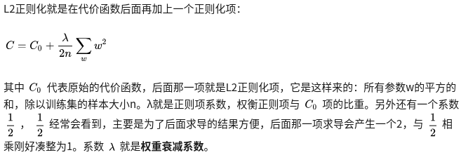
    
    注意：**`w^2`表示所有具体参数值的平方**，比如`3×3`的`w`，一共有9个具体的参数值，分别进行平方。
 - 为什么可以对权重进行衰减？
    
    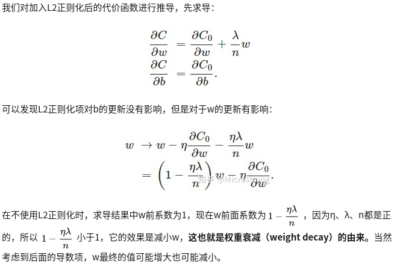
 - 权重衰减（L2正则化）可以避免模型过拟合问题。
    - 1.从模型的复杂度上解释：更小的权值w，表示网络的复杂度更低，对数据的拟合更好（这个法则也叫做奥卡姆剃刀）
    - 2.从数学方面的解释：过拟合的时候，拟合函数的系数往往非常大，为什么？如下图，过拟合，就是拟合函数需要顾忌每一个点，最终形成的拟合函数波动很大。在某些很小的区间里，函数值的变化很剧烈。这就意味着函数在某些小区间里的导数值（绝对值）非常大，由于自变量值可大可小，所以只有系数足够大，才能保证导数值很大。而正则化是通过约束参数的范数使其不要太大，所以可以在一定程度上减少过拟合情况。
        
        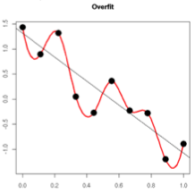
 - L1正则化，权重w的更新规则为：
    
    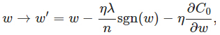
    
    - 比原始的更新规则多出了`η*λ*sgn(w)/n`这一项。
    - 当w为正时，更新后的w变小。当w为负时，更新后的w变大。
    - 因此它的效果就是**让w往0靠，使网络中的权重尽可能为0**，也就相当于减小了网络复杂度，防止过拟合。
 - L1更容易得到稀疏解（解向量中0比较多）。L2范数能让解比较小（靠近0），但是比较平滑（不等于0）。

**学习率衰减（learning rate decay）：**
 - 平衡模型的训练速度和损失（loss）后选择了相对合适的学习率（learning rate），但是训练集的损失下降到一定的程度后就不在下降了，比如training loss一直在0.7和0.9之间来回震荡，不能进一步下降。如下图所示：
    
    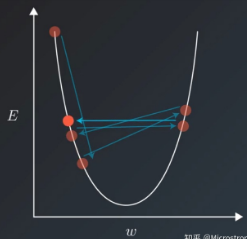
 - 遇到这种情况通常可以通过适当降低学习率来实现。但是，降低学习率又会延长训练所需的时间。
 - 学习率衰减就是一种可以平衡这两者之间矛盾的解决方案。学习率衰减的基本思想是：学习率随着训练的进行逐渐衰减。

**12、RNN为什么会出现梯度消失和梯度爆炸，怎么解决**
 - 产生原因：
    - 训练神经网络的时候，导数或坡度有时会变得非常大，或者非常小，甚至于以指数方式变小，这加大了训练的难度。
    - 本质上，梯度消失和爆炸是一种情况。在深层网络中，**由于网络过深，如果初始得到的梯度过小，或者传播途中在某一层上过小**，则在之后的层上得到的梯度会越来越小，即产生了梯度消失。梯度爆炸也是同样的。一般地，**不合理的初始化以及激活函数，如sigmoid等**，都会导致梯度过大或者过小，从而引起消失/爆炸。
    - 梯度消失/爆炸是因为神经网络在反向传播的时候，反向连乘的梯度小于1（或大于1），导致连乘的次数多了之后（网络层数加深），传回首层的梯度过小甚至为0（过大甚至无穷大），这就是梯度消失/爆炸的概念。
    - 梯度消失出现在：
        - 1.深层网络中
        - 2.采用了不合适的激活函数，比如sigmoid
    - 梯度爆炸出现在：
        - 1.深层网络中
        - 2.权值初始化值太大的情况下
 - 详解RNN梯度消失和爆炸的原因：
    - 经典的RNN结构如下图所示：
        
        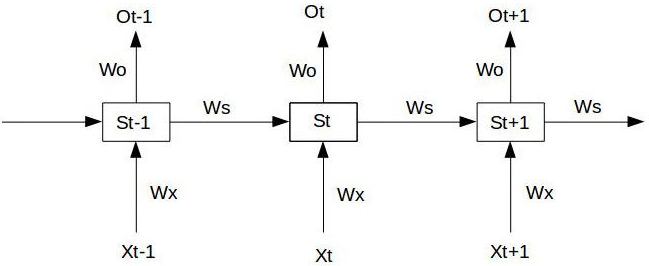
    - 具体过程如下：
        
        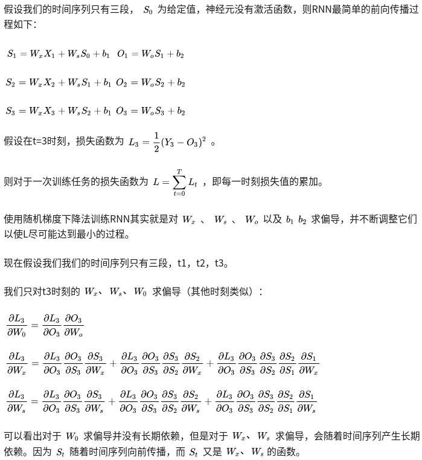
        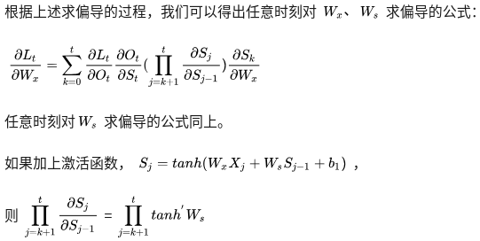
    - 激活函数tanh和它的导数图像如下：
        
        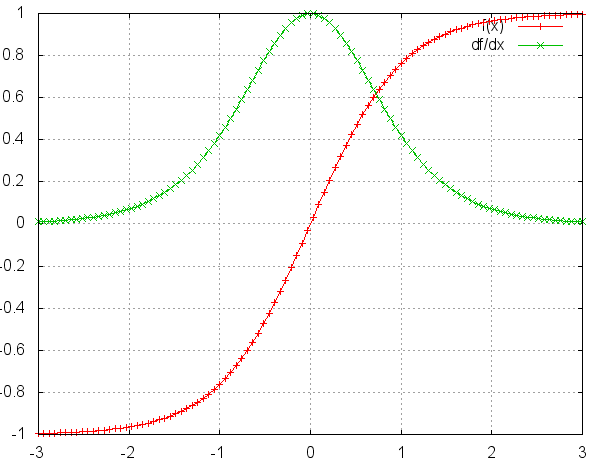
        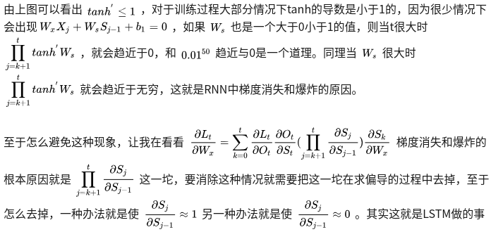
    - 上边公式中的一些解释：
        - 其中`S1,S2,S3,O1,O2,O3`是6个不同的式子。
        - 反向传播的过程中出现累乘的原因是之前的状态`Si`中也含有我们需要的求导的参数（即需要逐层进行求导）。
        - 加上激活函数之后进行求导出现了`tanh'`这一项（即为什么对激活函数也求导了？），因为函数`f(kx+b)`对x进行求导得到的结果应为`f'()·k`，即需要对外层的函数先求导，再对内层的参数进行求导。
 - 解决方案：
    - 1.**预训练加微调**：每次训练一层隐节点，在预训练完成后，再对整个网络进行“微调”，目前应用不多。
    - 2.针对梯度爆炸：
        - 2.1 **使用梯度剪切**，设置一个梯度剪切阈值，然后更新梯度的时候，如果梯度超过这个阈值，那么就将其强制限制在这个范围之内。
        - 2.2 **权重正则化**，比较常见的是L1和L2正则。
    - 3.使用**ReLU、leakReLU等激活函数**：
        - ReLU：其函数的导数在正数部分是恒等于1，这样在深层网络中，在激活函数部分就不存在导致梯度过大或者过小的问题，缓解了梯度消失或者爆炸。其缺点是过滤掉了负数部分，导致部分信息的丢失（出现Dead ReLU现象，权重无法更新），输出的数据分布不在以0为中心（因为该激活函数的图像不是以0为中心），改变了数据分布。
        - leakReLU：为了解决ReLU的Dead ReLU现象，其公式采用`max(kx, x)`而不是`max(0, x)`，k为系数，一般为0.01或0.02。
    - 4.**增加BN层**（Batch Normalize），本质上是解决反向传播过程中的梯度问题。它可以通过规整数据的分布到均值为0，方差为1，基本解决梯度消失/爆炸的问题
    - 5.**残差结构**：残差的方式，能使得深层的网络梯度通过跳级连接路径直接返回到浅层部分，使得网络无论多深都能将梯度进行有效的回传。
    - 6.**LSTM**，其内部复杂的“门”(gates)。在计算时，将过程中的梯度进行了抵消。

**13、写一下LSTM的公式，LSTM为什么能够解决梯度消失**
 - TODO
 - LSTM如何解决梯度消失问题？三个×分别代表的就是forget gate，input gate，output gate，而我认为**LSTM最关键的就是forget gate**这个部件。这三个gate是如何控制流入流出的呢，其实就是通过下面三个函数来控制，因为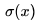（代表sigmoid函数） 的值是介于0到1之间的，刚好用趋近于0时表示流入不能通过gate，趋近于1时表示流入可以通过gate。
    
    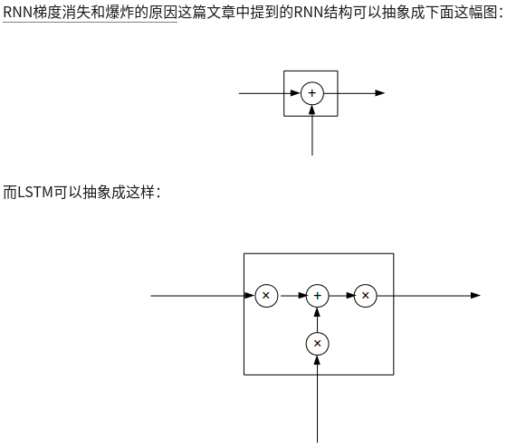
    
    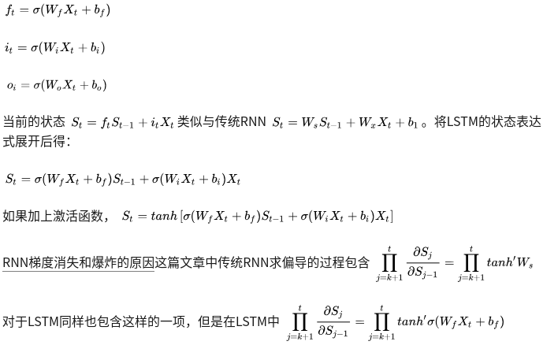
 - 函数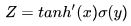中，前一部分小于等于1,后一部分取值在`(0,1)`之间，经过多层的累乘之后，这个函数的取值不是0就是1.
    
    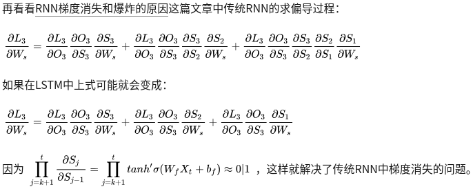

**14、常见的激活函数有哪些**
 - TODO

**15、常见的评价有哪些，都有哪些含义**
 - TODO

**16、如何计算AUC**
 - TODO

**17、介绍一下Dropout，为什么Drop能够解决过拟合，Dropout在处理训练数据和预测数据时，有哪些区别**
 - 当对该隐藏层使⽤Dropout时，该层的隐藏单元将有⼀定概率被丢弃掉。
 - 假设有两个隐藏单元被丢弃，在反向传播时，与这两个隐藏单元相关的权重的梯度均为0。
 - 由于在训练中隐藏层神经元的丢弃是随机的，每一个隐藏单元都有可能被清零，输出层的计算⽆法过度依赖其中的任一个，从而在训练模型时起到正则化的作⽤，并可以⽤来应对过拟合。
 - 在测试模型时，我们为了拿到更加确定性的结果，⼀般不使⽤Dropout。
 - TODO

**18、常见的解决过拟合的方法有哪些**
 - TODO

**19、神经网络训练时可以将参数初始化为0吗**
 - TODO

**20、常见的Normalization有哪些，原理是什么**
 - TODO

**21、常见的池化操作有哪些，池化的作用是什么**
 - TODO

**22、Batch Normalization是怎么实现的，可以应用到RNN中么**
 - TODO

**23、请描述LSTM和GRU之间的区别是什么**
 - TODO

**24、介绍一下逻辑回归，逻辑回归与最大熵模型的关系**
 - TODO

**25、逻辑回归中为什么不能用平方差损失做损失函数**
 - TODO

**26、word2vec的两个模型都是怎么工作的**
 - TODO

**27、Fasttext的相关原理**
 - TODO

**28、常见的正则化有哪些，L1正则和L2正则的区别是什么**
 - TODO

**29、什么是过拟合和欠拟合**
 - 欠拟合：
    - 模型⽆法得到较低的训练误差。
    - 给定训练数据集，如果**模型的复杂度过低**，很容易出现⽋拟合；
    - 解决方法：
        - 1.**增加新特征**，可以考虑加入进特征组合、高次特征，来增大假设空间;
            - 为了提高复杂关系的拟合能力，在特征工程中经常会把一阶离散特征两两组合，构成高阶组合特征。
            - 基于决策树的特征组合
            - 添加多项式特征
        - 2.**尝试非线性模型**，比如核SVM、决策树、DNN等模型;
        - 3.如果有正则项可以**较小正则项参数**lambda;
        - 4.**Boosting模型**,Boosting往往会有较小的Bias（高方差，证明拟合的好），比如GBDT等。
 - 过拟合（样本量很小时易产生）：
    - 是模型的训练误差远小于它在测试数据集上的误差。
    - 当**样本容量很小**时，经验风险最小化来学习模型，效果未必好，易产生过拟合。因为对仅有的这么多数据拟合的太严重。
    - 给定训练数据集，如果**模型复杂度过⾼**，很容易出现过拟合。
    - 解决方法：
        - 1.**增大训练数据**可以有限的避免过拟合。
            - 一般在模型效果差的第一个想法是增多数据，其实增多数据并不一定会有更好的结果，因为**欠拟合时增多数据往往导致效果更差，
            而过拟合时增多数据会导致Gap的减小，效果不会好太多**，多以当模型效果很差时，**应该检查模型是否处于欠拟合或者过拟合的状态，而不要一味的增多数据量**。
        - 2.**特征选择**，减少特征数或使用较少的特征组合，对于按区间离散化的特征，增大划分的区间;
        - 3.**权重衰减/正则化/结构风险最小化**
            - 权重衰减（weight decay）：等价于L2正则化（使学出的模型参数值较小）
            - 正则化：是结构风险最小化的一种策略实现。L1、L2正则化，其中L1正则还可以自动进行特征选择。
            - 结构风险最小化：即在经验风险上加上表示模型复杂度的正则化项或惩罚项。
        - 4.如果有正则项则可以考虑**增大正则项参数lambda**;
        - 5.**Bagging模型**,将多个弱学习器Bagging一下效果会好很多（一般基学习器都是强学习器），比如随机森林等。
        - 6.**交叉验证**，得到较优的模型参数。
    - 深度学习中减少过拟合方法：
        - 7.**Early Stop策略**，本质上是交叉验证策略，避免训练的网络过度拟合训练数据。
        - 8.**使用Dropout**正则化。由于dropout会将原始数据分批迭代，因此原始数据集最好较大，否则模型可能会欠拟合。
        - 9.**集成学习策略**，可以用Bagging的思路来正则化（使模型更加的稳定，其作用是因为降低了模型的方差）。首先我们要对原始的m个训练样本进行**有放回随机采样，构建N组m个样本的数据集**，然后分别用这N组数据集去训练我们的DNN。即采用我们的前向传播算法和反向传播算法得到N个DNN模型的W,b参数组合，最后对N个DNN模型的输出用加权平均法或者投票法决定最终输出。不过用集成学习Bagging的方法有一个问题，就是我们的DNN模型本来就比较复杂，参数很多。现在又变成了N个DNN模型，这样参数又增加了N倍，从而导致训练这样的网络要花更加多的时间和空间。因此一般N的个数不能太多，比如5-10个就可以了。
        - 10.**Batch Normalization**，该方法相当于在网络上相当于加了一个线性变换层，使得下一层的输入接近高斯分布。这个方法相当于下一层的w训练时**避免了其输入以偏概全**，因而泛化效果非常好。

**30、推到一下Linear-SVM的公式**
 - TODO

**31、介绍一下朴素贝叶斯模型**
 - TODO

**32、常见的梯度下降的方法有哪些，介绍一下Adam**
 - TODO

**33、介绍一下常见的损失函数**
 - TODO

**34、介绍一下KL散度，说一下KL散度与交叉熵的关系**
 - TODO

**35、介绍一下HMM和CRF的区别和联系**
 - TODO

**36、什么是Beam Search?它在NLP中的什么场景里会用到？它跟动态规划的区别是什么**
 - TODO

**37、介绍一下残差网络，原理是什么，能够解决什么问题**
 - TODO

**38、FT-IDF相比较Word2vec的优缺点有哪些**
 - TODO

**39、给定两个字符串，如何计算它们之间的相似度**
 - TODO

#### 参考文献
 - [网络退化、过拟合、梯度消散/爆炸](https://blog.csdn.net/c2250645962/article/details/102838830)
 - [CVPR2016:ResNet 从根本上解决深度网络退化问题](https://zhuanlan.zhihu.com/p/106764370)
 - [神经网络优化算法：Dropout、梯度消失/爆炸、Adam优化算法，一篇就够了！](https://zhuanlan.zhihu.com/p/78854514)
 - [权重衰减（weight decay）与学习率衰减（learning rate decay）](https://zhuanlan.zhihu.com/p/38709373)
 - [正则化方法：L1和L2 regularization、数据集扩增、dropout](https://blog.csdn.net/u012162613/article/details/44261657)
 - [L1正则化与L2正则化](https://zhuanlan.zhihu.com/p/35356992)
 - [RNN梯度消失和爆炸的原因](https://zhuanlan.zhihu.com/p/28687529)
 - [LSTM如何解决梯度消失问题](https://zhuanlan.zhihu.com/p/28749444)
 - [机器学习防止欠拟合、过拟合方法](https://zhuanlan.zhihu.com/p/29707029)
 - 
