# 语言模型

> 目前主要采用的是n元语法模型，这种模型构建简单、直接，但同时也因为数据缺乏 而必须采取平滑（smoothing）算法

**一般概念：**
 - 词的局部表示就是one-hot向量表示，即词袋模型(Bag-of-Words, BOW)，即将文本看成是词的集合，不考虑词序信息。又叫做向量空间模型(Vector Space Model, VSM)
 - 将高维的局部表示向量空间`R^{|V|}`映射到一个非常低维的空间`R^d`，V为词表，。这个低维空间中的表示就是**分布式表示**
 - 对于词的分布式表示（即低维稠密向量表示），我们经常叫做词嵌入（Word Embeddings）
 - 在机器学习中，**嵌入**通常指将一个度量空间X中的对象映射到另一个低维的度量空间Y中，并进行可能保持不同对象之间拓扑关系。
 - 在one-hot向量空间中，每个词都位于坐标轴上，每个坐标轴上一个词；而在低维的嵌入空间中，每个词都不在坐标轴上，词之间可以计算相似度。

## 统计语言模型
**定义：**
 - 统计语言模型把语言（词/字/字符的序列）看作一个随机事件，并赋予相应的概率来描述其属于某种语言集合的可能性。
 - 给定一个词汇集合V，对于一个由V中的词构成的序列`S=⟨w1,···,wT⟩ ∈ V^n`，统计语言模型赋予这个序列一个概率`P(S)`，来衡量S符合自然语言的语法和语义规则的置信度。

简单地说，统计语言模型就是用来**计算一个句子的概率的模型**。统计语言模型可以估计出自然语言中每个句子出现的可能性，而不是简单的判断该句子是否符合文法。

**一些性质：**
 - 语言模型的两个基本功能是：
    - 判断一段文本是否符合一种语言的语法和语义规则
    - 生成符合一种语言语法或语义规则的文本
 - [多项分布](https://baike.baidu.com/item/%E5%A4%9A%E9%A1%B9%E5%88%86%E5%B8%83/6548502?fr=aladdin)。
 多项式分布是二项式分布的推广。二项分布的典型例子是扔硬币，硬币正面朝上概率为p,重复扔n次硬币，k次为正面的概率即为一个二项分布概率。把二项分布公式推广至多种状态，就得到了多项分布。
 - 在传统的统计语言模型中，一般**假设语言是服从多项分布**，并**利用最大似然估计来求解多项分布的参数**(也就是求解前n-1个词的条件下，第n个词的概率)。
 - **最大似然估计等价于频率估计**


**N元语法：**
 - 一个语言模型**通常构建为字符串s的概率分布`p(s)`，试图反应的是字符串s作为一个句子出现的频率。**
 - 与语言学中不同，语言模型与句子是否合乎语法是没有关系的，即使一个句子完全合乎语法逻辑，我们仍然可以认为它出现的概 率接近为零
 - 句子`s=w_{1}w_{2}...w_{l}`，其概率计算公式可以表示为：
     ```
     p(s) = p(w_1)p(w_2|w_1)p(w_3|w_1w_2)...p(w_l|w_1...w_{l-1})
          = \Pi_{i=1}^l p(w_i|w_1...w_{i-1})
     ```
 - n元语法（或n元文法，n-gram），用来解决当前词的历史词过多时计算上述公式参数过多的问题
    - 产生第i个词的概率是由已经产生的i-1个词决定的，把前边的i-1个词成为第i个词的历史
    - 随着历史长度的增加，不同的历史数目按指数级增长，这使我们几乎不可能从训练数据中正确地估计出这些参数，实际上，绝大多数历史根本就不可能在训练数据中出现。
    - 为了解决这个问题，可以将历史w1w2…wi-1按照某个法则映射到等价类E(w1w2…wi-1)，而等价类的数目远远小于不同历史的数目。
    - 如果假定`p(w_i|w_1,w_2,...,w_{i-1}) = p(w_i|E)`，那么，自由参数的数目就会大大地减少
    - 一种比较实际的做法是，将两个历史映射到同一个等价类，当且仅当这两个历史**最近的`n-1`个词相同**
    - 满足上述条件的语言模型称为n元语法
    - 通常情况下，n的取值不能太大，否则，等价类太多，自由参数过多的问题仍然存在。
        - 在实际应用中，取n=3的情况较多（即当前词仅与它之前的前两个词相关，3-gram）。
        - 当n=1时，即出现在第i位上的词w_i独立于历史时（不与之前的任何词相关），一元文法被记作unigram，或uni-gram，或monogram
        - 当n=2时，即出现在第i位上的词w_i仅与它前面的一个历史词w_{i-1}有关，**二元文法模型被称为一阶马尔可夫链**(Markov chain)，记作bigram或bi-gram
        - 当n=3时，即出现在第i位上的词w_i仅与它前面的两个历史词w_{i-2}w_{i-1}有关，**三元文法模型被称为二阶马尔可夫链**，记作trigram或tri-gram
    - 以二元语法模型为例，根据前面的解释，我们可以近似地认为，一个词的概率只依赖于它前面的一个词，那么概率计算公式近似为：
        ```
        p(s) = \Pi_{i=1}^l p(w_i|w_1...w_{i-1})
             = \Pi_{i=1}^l p(w_i|w_{i-1})
        ```
        - 为了让上式对于i=1有意义，我们在句子开头加上一个句首标记<BOS>，即假设w_0就是<BOS>
        - 为了使得所有的字符串的概率之和`sum_{s}p(s)`等于1，需要在句子结尾再放一个句尾标记<EOS>，并且使之包含在上边等式的乘积中，
        (如果不做这样的处理，所有给定长度的字符串的概率和为1，而所有字符串的概率和为无穷大，因为不知道什么时候是句子的结束，当知道句子的长度时，在知道在哪结束句子)
        - 为了估计条件概率`p(w_i|w_{i-1})`，可以简单地计算二元语法`w_{i-1}w_i`在某一文本中**出现的频率**，然后归一化。
        如果用`c(w_{i-1}w_i)`表示二元语法`w_{i-1}w_i`**在给定文本中的出现次数**，我们可以采用下面的计算公式:
            ```
            p(w_i|w_{i-1}) = c(w_{i-1}w_i) / sum_{w_i}c(w_{i-1}w_i)
            ```
        分母`sum_{w_i}c(w_{i-1}w_i)`表示计算历史`c(w_{i-n+1}^{i-1})`的数目，具体见下边例子
        - 用于构建语言模型的文本称为训练语料。对于n元语法模型，使用的训练语料的规模一般要有几百万个词。上式用于估计`p(w_i|w_{i-1})`的方法称为`p(w_i|w_{i-1})`的**最大似然估计**
        - 计算例子：
            ```
            假设语料S由下边的3个句子构成：
            ("BROWN READ HOLY BIBLE", 
             "MARK READ A TEXT BOOK", 
             "HE READ A BOOK BY DAVID")
             
            用计算最大似然估计的方法计算概率 p(BROWN READ A BOOK)：
            p(BROWN|<BOS>) = c(<BOS> BROWN) / sum_{w}c(<BOS> w) = 1/3
            p(READ|BROWN) = c(BROWN READ) / sum_{w}c(BROWN w) = 1/1
            p(A|READ) = c(READ A) / sum_{w}c(READ w) = 2/3
            p(BOOK|A) = c(A BOOK) / sum_{w}c(A w) = 1/2
            p(<EOS>|BOOK) = c(BOOK <EOS>) / sum_{w}c(BOOK w) = 1/2
            
            因此：
            p(BROWN READ A BOOK) = p(BROWN|<BOS>) ×
                                   p(READ|BROWN) ×
                                   p(A|READ) ×
                                   p(BOOK|A) ×
                                   p(<EOS>|BOOK)
                                 = 1/3 × 1/1 × 2/3 × 1/2 × 1/2
                                 = 0.06
            ```

**n-gram与马尔可夫链的关系：**
 - 二元文法模型被称为一阶马尔可夫链，三元文法模型被称为二阶马尔可夫链

**困惑度：**
 - 困惑度(Perplexity)可以用来衡量一个分布的不确定性，我们也可以用困惑度来衡量两个分布之间差异
 - 对于一个未知的数据分布`P_{data}(X)`，和一个模型分布`P_{model}(X)`，我们从`P_{data}(X)`中采样出一组测试样本`x1,···,xN`，模型分布`P_{model}(X)`的困惑度为：
     ```
     2^{ H(P'_{data}, P_{model}) } = 2^{-1/N sum_{i=1}^N log_{2}P_{model}(x_i)}
     
     其中H(P'_{data}, P_{model})为样本的经验分布P'_{data}和模型分布P_{model}之间的交叉熵，  
     也是所有样本上的负对数似然函数
     ```
 - 模型的困惑度**可以衡量模型估计分布与样本经验分布之间的契合程度**，困惑度越低则两个分布越接近。因此，模型`P_{model}`的好坏可以用困惑度来评价。

**语言模型性能评价：**
 - 一个好的语言模型应该使得测试集合中的**句子的联合概率尽可能高**
 - 语言模型最直接的评价就是测试集中所有句子的联合概率，一个好的语言模型在测试集上的概率越高越好。但是联合概率的缺点是一般都比较小，并且和句子长度有关。越长的句子，其联合概率越小。因此，在语言模型中，经常使用困惑度来评价。
 - 根据模型计算出的测试数据的概率来评价一个语言模型，或用交叉熵和困惑度等派生测度。
 - 给定一个语言模型，文本T的概率为`p(T)`，在数据T上模型p的交叉熵`H_{p}(T)`定义为：
     ```
     H_{p}(T) = - (1/W_{T}) log_{2}p(T)
     ```
 这里的W_T是以词为单位度量的文本T的长度（可以包括句首标志<BOS>或句尾标志<EOS>）
 - 模型p的困惑度`PP_T(T)`是模型分配给测试集T中每一个词汇的概率的几何平均值的倒数，它和交叉熵的关系为：
     ```
     PP_T(T) = 2^{Hp(T)}
     ```
 显然，交叉熵和困惑度越小越好，这是我们评估一个语言模型的基本准则。
 - 困惑度为每个词条件概率`P(w_{j}^{(i)} | w_{(j−n+1):(j−1)}^{(i)})`的几何平均数的倒数。句子概率越大，困惑度越小，语言模型越好。
 - 假设一个语言模型赋予每个词出现的概率均等，则该语言模型的困惑度为`|V|`

**数据平滑：**
 - 基于统计的语言模型最大似然估计存在一个问题，**数据稀疏问题**，主要是由于训练样本不足而导致密度估计不准确
 - [Zipf定律](https://baike.baidu.com/item/%E9%BD%90%E5%A4%AB%E5%AE%9A%E5%BE%8B/6643264?fr=aladdin)，
 在自然语言的语料库里，一个单词出现的频率与它在频率表里的排名成反比。所以，频率最高的单词出现的频率大约是出现频率第二位的单词的2倍，而出现频率第二位的单词则是出现频率第四位的单词的2倍。
 - 数据稀疏问题最直接的解决方法就是增加训练语料的规模，但是由于大多数自然语言都服从Zipf定律，增加语料库规模的边际效益会随着语料库的增加而递减。
 - 数据稀疏问题的另一种解决方法是平滑技术
 - 在计算条件概率过程中，根据当前的语料S，如果一个词在语料库里不存在，可能会出现概率为0的情况，显然，这个结果不够准确，因为句子`DAVID READ A BOOK`总有出现的可能，其概率应该大于0
 - 因而，必须分配给所有可能出现的字符串一个非零的概率值来避免这种错误的发生
 - 平滑（smoothing）技术就是用来解决这类零概率问题的。术语“平滑”指的是为了产生更准确的概率**来调整最大似然估计**的一种技术，也常称为数据平滑。
 - **“平滑”处理的基本思想是“劫富济贫”，即提高低概率（如零概率），降低高概率，尽量使概率分布趋于均匀**
 - 对于二元语法来说，一种最简单的平滑技术就是假设每个二元语法出现的次数比实际出现的次数多一次，不妨将该处理方法称为**加1法平滑法**，分子加1,分母加`|V|`（当前语料S中，词汇表单词的个数）
 - 数据平滑方法：
    - 加法平滑法
        - 是最简单的，使加1平滑方法通用化
        - 不是假设每一个n元语法发生的次数比实际统计次数多一次，而是假设它比实际出现情况多发生δ次，`0≤δ≤1`
    - 古德-图灵估计法(Good-Turing)
        - Good-Turing估计法是很多平滑技术的核心
        - 其基本思路是：对于任何 一个出现r次的n元语法，都假设它出现了`r*`次
        - Good-Turing方法不能直接用于估计`n_r＝0`的n-gram概率，其中，`n_r`是训练语料中恰好出现r次的n元语法的数目
        - Good-Turing方法不能实现高阶模型与低阶模型的结合，而高低阶模型的结合通常是获得较好的平滑效果所必须的
    - Katz平滑法
        - Katz平滑方法通过加入高阶模型与低阶模型的结合，扩展了Good-Turing估计方法。
        - 所有具有非零计数r的二元语法都根据折扣率`d_r`被减值了
        - Katz平滑方法属于后备（back-off）平滑方法。这种方法的中心思想是，当某一事件在样本中出现的频率大于k时，运用最大似然估计经过 减值来估计其概率。当某一事件的频率小于k时，使用低阶
        的语法模型作为代替高阶语法模型的后备，而这种代替必须受归一化因子α的作 用。对于这种方法的另一种解释是，根据低阶的语法模型分配由于减值而节省下来的剩余概率给未见事件，这比将剩余概率平均分配给未见事件要合理
    - Jelinek-Mercer平滑方法
        - 因为冠词THE要比单词THOU出现的频率高得多。为了利用这种情况， 一种处理办法是在二元语法模型中加入一个一元模型。
        - 一般来讲，使用低阶的n元模型向高阶n元模型插值是有效的，因为当没有足够的语料估计高阶模型的概率时，低阶模型往往可以提供有用 的信息。
        - 第n阶平滑模型可以递归地定义为n阶最大似然估 计模型和n-1阶平滑模型之间的线性插值
    - Witten-Bell平滑方法
        - 它可以认为是Jelinek-Mercer平滑算法的一个实例
        - n阶平滑模型被递归地定义为n阶最大似然模型和n-1阶平滑模型的线性插值
    - 绝对减值法
        - 绝对减值法（absolute discounting）类似于Jelinek-Mercer平滑算法，涉及高阶和低阶模型的插值问题
        - 通过从每个非零计数中减去一个固定值`D≤1`的方法来建立高阶分布
    - Kneser-Ney平滑方法
    - Church-Gale平滑方法
    - 贝叶斯平滑方法
    - 修正的Kneser-Ney平滑方法
 - 平滑方法的比较：
    - **不管训练语料规模多大，对于二元语法和三元语法而言，Kneser-Ney平滑方法和修正的Kneser-Ney平滑方法的效果都好于其他所有的平滑方法**。
    - 一般情况下，Katz平滑方法和Jelinek-Mercer平滑方法也有较好的表现，但与上述两者平滑方法相比稍有逊色。
    - 在稀疏数据的情况下，Jelinek-Mercer平滑方法优于Katz平滑方法，而在有大量数据的情况下，Katz平滑方法则优于Jelinek-Mercer平滑方法
    - 插值的绝对减值平滑方法和后备的Witten-Bell平滑方法的表现最差
    - 除了对于很小的数据集以外，插值的绝对减值平滑方法一般优于留存插值方法的Jelinek-Mercer平滑方法
    - 而Witten-Bell平滑方法则表现较差，对于较小的数据集，该方法比留存插值方法的Jelinek-Mercer平滑方法差得多
    - 对于大规模数据集而言，这Witten-Bell平滑方法和插值的绝对减值平滑方法都比留存插值方法的Jelinek-Mercer平滑方法优越得多，甚至可以与Katz平滑方法和Jelinek-Mercer平滑方法相匹敌
    - 平滑方法的相对性能与训练语料的规模、n元语法模型的阶数和训练语料本身有较大的关系，其效果可能会随着这些因素的不同而出现很大的变化
    - 下列因素对于平滑算法的性能有一定的影响：
        - 影响最大的因素是采用修正的后备分布
        - 绝对减值优于线性减值
        - 从性能上来看，对于较低的非零计数，插值模型大大地优于后备模型
        - 增加算法的自由参数，并在留存数据上优化这些参数，可以改进算法的性能

**语言模型的自适应方法：**
 - 经常遇到的问题：
    - **模型对跨领域的脆弱性：**在训练语言模型时所采用的语料往往来自多种不同的领域，这些综合性语料难以反映不同领域之间在语言使用规律上的差异，而**语言模型恰恰对于训练文本的类型、主题和风格等都十分敏感**
    - **独立性假设的无效性：**n元语言模型的独立性假设前提是一个文本中的当前词出现的概率只与它前面相邻的n-1个词相关，但**这种假设在很多情况下是明显不成立的**。
 - 香农实验表明，相对而言，人更容易运用特定领域的语言知识、常识和领域知识进行推理以提高语言模型的性能（预测文本的下一个成分）。因此，**为了提高语言模型对语料的领域、主题、类型等因素的适应性，提出了自适应语言模型**
 - 语言模型自适应方法：
    - 基于缓存的语言模型
        - 在文本中刚刚出现过的一些词在后边的句子中再次出现的可能性往往较大，比标准的n元语法模型预测的概率要大
        - 针对这种现象，cache-based自适应方法的基本思路是，语言模型通过n元语法的线性插值求得，插值系数λ可以通过EM算法求得
        - （正常的基于缓存的语言模型）常用的方法是，在缓存中保留前面的K个单词，每个词wi的概率（缓存概率）用其在缓存中出现的相对频率计算得出
        - （衰减的基于缓存的语言模型）缓存中每个词对当前词的影响随着与该词距离的增大呈指数级衰减，越是临近的词，对缓存概率的贡献越大
        - cache-based自适应方法减低了语言模型的困惑度，衰减的比正常的给予缓存的语言模型对降低语言模型的困惑度效果更好
        - 黄非等（1999）提出了利用特定领域中少量自适应语料，在原词表中通过**分离通用领域词汇和特定领域词汇，并自动检测词典外领域关键词实现词典自适应**，然后结合基于缓存的方法实现语言模型的自适应方法
        - 曲卫民等（2003）通过采用TF-IDF公式代替原有的简单频率统计法，**建立基于记忆的扩展二元模型，并采用权重过滤法以节省模型计算量**，实现了对基于缓存记忆的语言模型自适应方法的改进
        - 张俊林等 （2005）也对基于记忆的语言模型进行了扩展，利用汉语义类词典，**将与缓存中所保留词汇语义上相近或者相关的词汇也引入缓存**，在一定程度上提高了原有模型的性能
    - 基于混合方法的语言模型
        - 基于混合方法的自适应语言模型针对的问题是：
            - 由于大规模训练语料本身是异源的，来自不同领域的语料无论在主题方面，还是在风格方面，或者同时在这两方面都有一定的差异
            - 而测试语料一般是同源的，因此，为了获得最佳性能，语言模型必须适应各种不同类型的语料对其性能的影响。
        - 基本思想是：
            - 将语言模型划分成n个子模型M1，M2，…，Mn，整个语言模型的概率通过下面的线性插值公式计算得到
                ```
                p(w_i|w_{1}^{i-1}) = sum_{j=1}^n lambda_j p_{M_j}(w_i|w_{1}^{i-1})
                ```
            lambda属于0到1，之和为1，可以通过EM算法计算
        - 基于这种思想，该适应方法针对测试语料的实现过程包括下列步骤：（即有针对性的训练子语言模型）
            - 对训练语料按来源、主题或类型等（不妨按主题）聚类；
            - 在模型运行时识别测试语料的主题或主题的集合；
            - 确定适当的训练语料子集，并利用这些语料建立特定的语言模型；
            - 利用针对各个语料子集的特定语言模型和线性插值公式，获得整个语言模型。
    - 基于最大熵的语言模型
        - 上面两种思路都是分别建立各个子模型，然后将子模型的输出组合起来
        - 基于最大熵的语言模型采用不同的思路，**即通过结合不同信息源的信息构建一个语言模型。每个信息源提供一组关于模型参数的约束条件，在所有满足约束的模型中，选择熵最大的模型**
        - 例子：
            ```
            考虑两个语言模型M1和M2，假设M1是标准的二元模型，表示为f函数：
            p_{M_1}(w_i|w_{1}^{i-1}) = f(w_i, w_{i-1})
            
            M2是距离为2的二元模型（distance-2 bigram），定义为g函数
            p_{M_2}(w_i|w_{1}^{i-1}) = g(w_i, w_{i-2})
            
            可以用线性插值方法取这两个概率的平均值，用后备方法选择其中一个进行数据平滑。
            
            为了考虑**远距离的文本历史信息**，以弥补一般语言模型仅仅利用近距离历史的不足，采用**触发器对**作为信息承载成分的思想。
             - 如果一个词序列A与另一个词序列B密切相关，那么，A→B被看作一个触发器对，
             - 其中，A为触发器，B为被触发的序列。
             - 当A出现在一个文本中时，它触发B，从而引起B的概率估计发生变化。
             - 如果把B看作当前词，A为历史h中的某个特征，那么，可以将一个二值的触发器对A→B形式化为一种约束函数f_{A→B}
            ```
        - 由于最大熵模型能够较好地将来自不同信息源的模型结合起来，获得性能较好的语言模型,因此，有些学者研究将基于主题的语言模型 （topic-based LM）（主题条件约束）与n元语法模型
        相结合，用于对话语音识别、信息检索IR和隐含语义分析(LSA)
 - 语言模型的自适应方法是改进和提高语言模型性能的重要手段之一。其性能表现与语料本身的状况（领域、主题、风格等）以及选用的统计基元等密切相关


## 神经网络语言模型
**一般概念：**
 - 在统计语言模型中，一个关键的问题是估计`P(Wt|W_{1:(t−1)})`，即在时刻（或位置）t，给定历史信息`h_t = w_{1:(t−1)}`条件下，词汇表V中的每个词v_k出现的概率。
 这个问题可以转换为一个类别数为|V|的多类分类问题，估计的词汇表中第k个词出现的后验概率。
 - 这样，我们就可以**使用机器学习中的不同分类器来估计语言模型的条件概率**。这里我们关注基于神经网络模型的方法，这一类方法可以统称为神经网络语言模型（NNLM）
 
**神经网络语言模型:**
 - 神经网络语言模型可以分为三个部分：
    - 输入层
        - 将语言符号序列`w_{1:(t-1)}`输入到神经网络模型中（以词嵌入矩阵的形式，稠密实数值向量）
        - 词嵌入矩阵`M ∈ R^{d1×|V|}`中，第k列向量`k ∈ R^{d1}`表示词汇表中第k个词对应的稠密向量
        - 通过直接映射，得到历史信息`w_{1:(t-1)}`每个词对应的向量表示`v_{w1},···,v_{w_{t−1}}`
    - 隐藏层
        - 隐藏层可以是不同类型的网络，前馈神经网络和循环神经网络，其输入为词向量`v_{w1},···,v_{w_{t−1}}`，输出为一个可以表示历史信息的向量`h_t`
        - 常见的网络类型：
            - 简单平均
                ```
                h_t = sum_{1}^{t-1} C_i v_{w_i}
                
                其中，C_i为每个词的权重。权重可以和位置相关，也可以和位置无关。位置无关的权重可以设置为C_i = 1/(t−1)
                ```
            - 前馈神经网络
                - 前馈神经网络要求输入的大小是固定的。
                - 因此，和n元模型类似，假设历史信息只包含前面n−1个词。首先将这n−1个的词向量拼接为一个维度为`d1 × (n−1)`的向量`x_t`
                - 然后将`x_t`输入到由多层前馈神经网络构成的隐藏层，最后一层隐藏层的输出`h_t`
                - 前馈网络的结构可以任意设置：
                    - 比如，只含一层隐藏层的模型为`h_t = tanh(W x_t + c)`
                    - 也可以包含跳层连接`h_t = x_t ⊕ tanh(W x_t + c)`
            - 循环神经网络
                - 和前馈神经网络不同，循环神经网络可以接受变长的输入序列，依次接受输入`v_{w1},···,v_{w_{t−1}}`，得到t时刻的隐藏状态`h_t`
        - 前馈网络语言模型和循环网络语言模型的不同之处在于**循环神经网络利用隐藏状态来记录以前所有时刻的信息，而前馈神经网络只能接受前(n-1)个时刻的信息。
    - 输出层
        - 输出层为大小为`|V|`，其接受的输入为历史信息的向量表示`h_t ∈ R^{d2}`，输出为**词汇表中每个词的后验概率**。
        - 在神经网络语言模型中，一般使用`softmax`分类器
            ```
            y_t = softmax(O h_t + b)
            
            输出向量y_t ∈ R^{|V|}为一个概率分布，
            O ∈ R^{|V|×d2}是最后一层隐藏层到输出层直接的权重。
            O也叫做**输出词嵌入矩阵**，矩阵中每一行也可以看作是一个词向量。
            ```
 - 大词汇表上`softmax`计算的改进 (加速语言模型训练速度)
    - 而归一化时要计算配分函数，即对词汇表中所有的词进行计算并求和，计算开销非常大，在实践中，经常采样一些近似估计的方法来加快训练速度。主要的加快训练速度的方法有两类：
    - 一类是**层次化的`softmax`计算**，将标准`softmax`函数的扁平结构转换为层次化结构
        - 先来考虑两层的来组织词汇表，即将词汇表中词分成k组，每一个词只能属于一个分组，每组大小为`|V|/k`。假设词w所属的组为`c(w)`，则
            ```
            P(w|h) = P(w,c(w)|h)
                   = P(w|c(w),h) × P(c(w)|h)
            
            其中，P(c(w)|h)是给定历史信息h条件下，类c(w)的概率，
            P(w|c(w), h)是给定历史信息h和类c(w)条件下，词w的概率
            一个词的概率可以分解为两个概率的乘积，而它们都是利用神经网络来估计，
            计算softmax函数时分别只需要做|V|/k和k次求和，从而就大大提高了softmax函数的计算速度
            ```
        - 一般对于词汇表大小|V|，我们将词平均分到`sqrt(|V|)`个分组中，每组`sqrt(|V|)`个词，这样通过一层的分组，我们可以将`softmax`计算加速`1/2 × sqrt(|V|)`倍。
        - 为了进一步降低`softmax`的计算复杂度，我们可以更深层的树结构来组织词汇表。假设用二叉树来组织词汇表中的所有词，二叉树的叶子节点代表词汇表中的词，非叶子节点表示不同层次上的类别。
        如果我们将二叉树上所有左链接标记为0，右链接标记为1。每一个词可以用根节点到它所在的叶子之间路径上的标记来进行编码。
        - 词v的条件概率为：
            ```
            P(v|h) = P(b(v,j)|n(v,j-1), h)
            
            n(v,j-1)是一个非叶子结点，
            因为b(v, j) ∈ {0, 1}，因此可以看作是二分类问题，可以使用logistic回归来进行计算
            若使用平衡二叉树来进行分组，则条件概率估计可以转换为log_{2}|V|个二分类问题，
            这时softmax函数可以用logistic函数代替,softmax的计算可以加速 |V|/(log_{2}|V|)倍
            ```
        - 将词汇表中的词按照树结构进行组织，有以下方式：
            - 利用人工整理的词汇层次结构，比如利用WordNetMiller系统中的`IS-A`关系（is a, 即上下位关系）。例如，“狗”是“动物”的下位词。因为WordNet的层次化结构不是二叉树，因此需要通过进一步聚类来转换为二叉树。
            - 使用Huffman编码。**Huffman编码对出现概率高的词使用较短的编码，出现概率低的词则使用较长的编码。因此训练速度会更快。**
    - 另一类是**基于采样的方法**，通过采样来近似计算更新梯度
        - 神经网络语言模型的目标函数，如果用随机梯度下降来求解参数θ，在计算每个样本的更新梯度时需要**两次计算在整个词汇表上的求和**，由于语言模型中的词汇表都比较大，训练速度非常慢
        - 为提高训练效率，可以用采样方法来近似地估计求导后公式中的期望，两种在语言模型中比较有效的采样方法：
            - 重要性采样
                - 用一个容易采样的参考分布Q，来近似估计分布P
                - 经过对公式的变换，将分布P上的期望转换为分布Q上的期望
                - 分布Q应与分布P尽可能接近，且从Q采样的代价要比较小
                - 在语言模型中，分布Q可以采用n元语言模型的分布函数
                - 有了分布Q之后，可以从中独立抽取k个样本来近似求解公式
                - 通过Q的采样来估计目标分布P的方法就叫做重要性采样
                - 重要性采样是一种非均匀采样
                - 最后，可以得到每个样本目标函数关于θ的梯度的近似值
                - 重要性采样相当于采样了一个词汇表的子集，然后在这个子集上求梯度的期望
                - 采样的数量n越大，近似越接近正确值，在实际应用中，n取100左右就能够以足够高的精度对期望做出估计
                - 通过重要性采样的方法，训练速度可以加速`|V|/k`倍，k为子词汇表的大小
                - 但是，其效果依赖于建议分布`Q(w′|h_t)`的选取，如果选取不合适，会造成梯度估计非常不稳定，经常使用一元模型的分布函数
            - 噪声对比估计
                - 基本思想是将密度估计问题转换为二分类问题，从而降低计算复杂度
                - 比如我们教小孩认识“苹果”，往往会让小孩从一堆各式各样的水果中找出哪个是“苹果”。通过不断的对比和纠错，最终小孩会知道了解“苹果”的特征，并很容易识别出“苹果”
                - 噪声对比估计的数学描述如下：
                    - 假设有三个分布，一个是需要建模真实数据分布`P(x)`
                    - 第二是模型分布`P_{θ}(x)`，我们期望调整模型参数为θ来使得`P_{θ}(x)`来拟合真实数据分布
                    - 第三个是噪声分布`Q(x)`，用来对比学习。
                    - 从`P(x)`和`Q(x)`的混合分布中抽取一个样本x，从`P(x)`中抽取的样本叫做“真实”样本，从`Q(x)`中抽取的样本叫做噪声样本。
                    - 需要建立一个“辨别者”D来判断样 本x是真实样本还是噪声样本。
                    - 噪声对比估计是通过调整模型`P_{θ}(x)`使得“判别者”D很容易能分别出样本x来自哪个分布。
                - 一般噪声样本的数量要比真实样本大很多。这里假设噪声样本的数量是真实样本的k倍
                - 噪声对比估计的目标是将模型分布`P_{θ}(x)`和噪声分布`Q(x)`区别开来，可以看作是二分类问题。通过不断比较真实样本和噪声样本，来学习模型参数θ。
                - 噪声对比估计相当于用判别式的准则`L_θ`来训练一个生成式模型`P_{θ}(x)`，其思想与生成式对抗网络类似。不同之处在于，在噪声对比估计中的“判别者”D是通过Bayes
                公式计算得到，而生成式对抗网络的“判别者”D是一个需要学习的神经网络。
                - 噪声对比估计是找到一个模型`P_{θ}(x)`使得“判别者”D很容易能分别出样本x来自哪个分布。
                - 噪声对比估计方法的一个特点是会促使未归一化分布`exp(s(w, h; θ))`可以自己学习到一个近似归一化的分布，并接近真实的数据分布`P(w|h)`
                - 在噪声对比估计中，噪声分布`Q(w)`的选取也十分关键
    - 总结：
        - 基于采样的方法并不改变模型的结构，只是近似计算更新梯度。因此这类方法虽然在训练时可以显著提高模型的训练速度，但是在测试阶段依然需要计算配分函数。
        - 而基于层次化`softmax`的方法改变的模型的结构，在训练和测试时都可以加快计算速度。

**NNLM解释：**
 - 架构如下图：
    
    
 - 学习任务是输入某个句中单词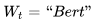前面句子的t-1个单词，要求网络正确预测单词Bert，即最大化：
    
    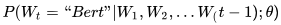
 
    - 前面任意单词`W_i`用Onehot编码（比如：0001000）作为原始单词输入。
    - 之后乘以矩阵Q后获得向量`C(W_i)`，每个单词的`C(W_i)`拼接，上接隐层，然后接softmax去预测后面应该后续接哪个单词。
    - 这个`C(W_i)`是什么？这其实就是单词对应的Word Embedding值，那个矩阵Q包含V行，V代表词典大小，每一行内容代表对应单词的Word embedding值。
    - 只不过Q的内容也是网络参数，需要学习获得，训练刚开始用随机值初始化矩阵Q。
    - 当这个网络训练好之后，矩阵Q的内容被正确赋值，每一行代表一个单词对应的Word embedding值。
    - 通过这个网络学习语言模型任务，这个网络不仅自己能够根据上文预测后接单词是什么，同时获得一个副产品，就是那个矩阵Q，这就是单词的Word Embedding是被如何学会的。


## 基于分布式假设的词嵌入学习
**一般概念：**
 - 通过神经网络语言模型，我们可以在大规模的无标注语料上进行训练，来得到一组好的词向量。
 - 这些词向量可以作为预训练的参数，再代入到特定任务中进行精调。
 - 使用NNLM来训练词嵌入有两个不足：
    - 一是即使使用改进的NNLM，其训练也需要大量的计算资源训练，训练时间非常长。
    - 二是NNLM的优化目标是降低语言模型的困惑度，和词嵌入的好坏并不是强相关关系。
 - 虽然训练一个好的语言模型会得到一组好的词嵌入，但是一组好的词嵌入却不一定要使得语言模型的困惑度降低。

下边几种是**不通过优化语言模型而直接学习词嵌入**的方法：

**连续词袋模型和Skip-Gram模型：**
 - 词嵌入学习工具word2vec中包含的两种模型：
    - 连续词袋模型和Skip-Gram模型
    - 这两种模型虽然依然是基于语言模型，但**训练目标是得到一组较好的词嵌入而不是降低语言模型的困惑度**。
    - 为了提高训练效率，这两种模型都通过简化模型结构大幅降低复杂度，并提出两种高效的训练方法（**负采样**和**层次化softmax**）来加速训练
    - 在标准的语言模型中，当前词`w_t`依赖于其前面的词`w_{1:(t−1)}`。而在连续词袋模型和Skip-Gram模型中，当前词`w_t`**依赖于其前后的词**。
 - 模型结构：
    - 连续词袋模型（CBOW）
        ```
        给定一个词w_t的其上下文：
        c_t = w_{t-n},···,w_{t-1}, w_{t+1},···,w_{t+n}
        
        和标准语言模型不同，上下文c_t可以同时取左右两边的n个词。
        
        连续词袋模型CBOW是该词w_t出现的条件概率为:
        P(w_t|c_t) = softmax(v'_{w_t}^T c_t)
                   = exp(v'_{w_t}^T c_t) / ( sum_{w'∈V} (exp(v'_{w_t}^T c_t)) )
        
        其中，c_t表示上下文信息。
        ```
        - 在连续词袋模型中，就**直接把隐藏层去掉,大大减少了计算量**,提高了计算速度,然后用更多的数据来训练模型,最后的效果也不错
        - 给定一个训练文本训练`w1,···,wT`，连续词袋模型的目标函数为：
            ```
            L_θ = - 1/T sum_{t=1}^T log p(w_t|c_t)
            ```
        - 即通过当前词的两边词（上下文信息）来计算当前词的后验概率，没有隐藏层，直接进行计算
    - Skip-Gram模型
        - Skip-Gram模型给定一个词`w_t`，**预测词汇表中每个词出现在其上下文中的概率**。
            ```
            P(w_{t+j}|w_t) = softmax( v_{w_t}^T  v'_{w_{t+j}} )
                           = exp( v_{w_t}^T  v'_{w_{t+j}} ) / ( sum_{w'∈V} exp( v_{w_t}^T  v'_w' ) )
            
            其中，v_w表示词w在输入词嵌入矩阵中的词向量，
            v'_w表示词w在输出词嵌入矩阵中的词向量。
            ```
        - Skip-Gram模型没有隐藏层，`h_t`直接等于词嵌入`v_{w_t}`。
        - 给定一个训练文本训练`w1,···,wT`，Skip-Gram模型的目标函数为：
            ```
            L_θ = - 1/T sum_{t=1}^T sum_{-n<=j<=n,j!=0} log P(w_{t+j}|w_t)
            ```
 - 训练方法：
    - 在Word2Vec中，连续词袋模型和Skip-Gram模型都可以通过两种训练方法（层次化`softmax`和负采样）来加速训练。
        - 层次化`softmax`，。在Word2Vec中采样了Huffman树来进行词汇表的层次化
        - 负采样：该方法可以看成是噪声对比估计方法的一个简化版本。
            ```
            给定上下文信息c，对于词汇表中每一个词w，
            w来自于真实分布的概率为：
            P(y=1|w,c) = exp(s(w, c; θ)) / ( exp(s(w, c; θ)) + 1 )
                       = 1 / ( 1 + exp(−s(w, c; θ)) )
                       = σ(s(w, c; θ))
            
            其中，σ为logistic函数，s(w, c; θ)为模型得分
            σ = 1 / (1+exp(−x))
            
            给定一个训练文本序列w1,···,wT，在位置t时，连续词袋模型和Skip-Gram模型的s(w_t, c_t; θ)定义如下：
                - 在连续词袋模型中，预测目标w为当前词w_t，   c为上下文词
                    s(wt, ct; θ) = v'_{w_t}^T sum_{-n<=j<=n,j!=0} v_{w_{t+j}}
                - 在Skip-Gram模型中，预测目标w为上下文词，  c为当前词w_t
                    s(wt, ct; θ) = v_{w_t}^T v'_{w_{t+j}} , −n ≤ j ≤ n, j ̸= 0
            ```
            - 使用负采样方法进行训练时，对于每个正例(w_t, c_t)，用噪声分布Q(w)中随机采样k个负例。k的取值由数据大小决定，
            通常小规模数据k的取值范围在5∼20，而大规模数据k可以非常小2∼5
            - 和噪声对比估计类似，负采样方法的目标函数也是一个二分类问题
            - 通过logistic回归来区分目标词w是来自真实分布还是噪声分布`Q(w)`
            - 和噪声对比估计不同的是，噪声分布`Q(w)`只是用来采样，而不参与计算。因此，噪声对比估计可以近似语言模型，而负采样不可以。
    - Word2Vec加速技巧：
        - **删除隐藏层**，得到上下文c的表示后，直接输入到`softmax`分类器来预测输出。
        也就是说，整个网络的参数只有两个词嵌入表：输入词嵌入表和输出词嵌入表；
        - 使用**层次化`softmax`或负采样**进行加速训练
        - **去除低频词**。出现次数小于一个预设值minCount的词直接去除。
        - **对高频词进行降采样**：
            ```
            根据下面公式算出的概率P_{discard}(w_t)来跳过词w_t
            这样可以节省时间而且可以提高非高频词的准确度。
            
            P_{discard}(w_t) = 1 - sqrt( m / U(w_t) )
            
            其中，m为设定好的阈值，一般取10−5，U(w_t)为w_t的一元语言模型频率。
            也就是说，对于词，U(w_t)越大（高频词的较大），P_{discard}(w_t)就越大，用来以该概率来跳过高频词
            ```
        - **动态上下文窗口大小**。指定一个最大窗口大小值N，对于每个词，从\[1,N]中随机选取一个值n来作为本次的上下文窗口大小，
        从当前词左右各选取n个词。这样上下文更侧重于邻近词。
        - **噪声分布使用一元语言模型**`U(x)`的`U(x)^{3/4} / Z`，Z为归一化因子。**相当于对高频词进行降采样，对低频词进行上采样**。
 - 从连续词袋模型和Skip-Gram模型的定义可以看出，**对于上下文相似的词，其向量也会相似**。这和分布式假设的定义十分吻合。
 **分布式假设的定义为如果两个词的上下文分布相似，那么这两个词的词义也是相似的**。
 - ------------------------------------------- 分割线 -------------------------------------------
 - Word2Vec的网络结构其实和NNLM是基本类似的，如下图：
    
    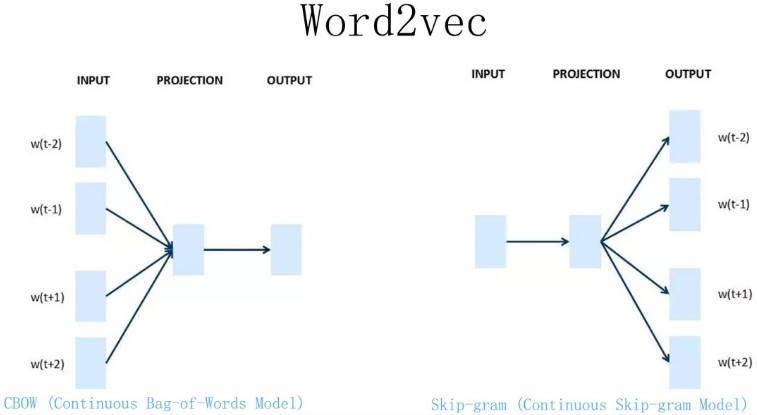
 - Word2Vec有两种训练方法：
    - 一种叫CBOW，核心思想是从一个句子里面把一个词抠掉，用这个词的上文和下文去预测被抠掉的这个词；
    - 第二种叫做Skip-gram，和CBOW正好反过来，输入某个单词，要求网络预测它的上下文单词。
 - 回头看看，NNLM是怎么训练的？是输入一个单词的上文，去预测这个单词。这是有显著差异的。
 - 为什么Word2Vec这么处理？原因很简单，因为Word2Vec和NNLM不一样，**NNLM的主要任务是要学习一个解决语言模型任务的网络结构，语言模型就是要看到上文预测下文，而word embedding只是无心插柳的一个副产品。但是Word2Vec目标不一样，它单纯就是要word embedding的，这是主产品**，所以它完全可以随性地这么去训练网络。


**总结：**
 - 词嵌入，即词的分布式表示，是NN来NLP的前提和关键因素。
 - NNLM需要给词汇表中的每一个词都赋予一个概率，即一个类别数为|V|的多类分类问题，类别数远大于一般的机器学习任务。因此在进行`softmax`归一化时计算代价很高。
    - Bengio \[2008]提出了利用重要性采样来加速`softmax`的计算
    - Mnih \[2013]提出了噪声对比估计来计算非归一化的条件概率。
    - Morin and Bengio \[2005]最早使用了层次化`softmax`函数来近似扁平的`softmax`函数。
 - 但是通过NNLM来预训练词嵌入由两个不足：
    - 一是即使使用改进的NNLM，其训练也需要大量的计算资源训练，训练时间非常长。
    - 二是NNLM的优化目标是降低语言模型的困惑度，和词嵌入的好坏并不是强相关关系。
 - Mikolov \[2013a]提出了两种非常简化的模型：连续词袋模型和Skip-Gram模型。其核心思想是当语料足够大时，简单的模型也能得到较好的词表示。
 - 大量的词是有多种义项，在不同上下文中，词的意义也不同，如果只赋予每一个词一个词向量或多个词向量，会出现问题。
 可参考基于上下文的词嵌入模型\[Huang et al., 2012, Neelakantan et al., 2014]。


## GloVe模型
参考博客：[理解GloVe模型](https://blog.csdn.net/coderTC/article/details/73864097)

**概述：**
 - 模型目标：进行词的向量化表示，使得向量之间尽可能多地蕴含语义和语法的信息。
 - 输入：语料库
 - 输出：词向量
 - 方法概述：首先基于语料库构建**词的共现矩阵**，然后基于共现矩阵和GloVe模型学习词向量。

**统计词共现矩阵:**
 - 设共现矩阵为X，其元素为`X_{i,j}`。 
 - `X_{i,j}`的意义为：在整个语料库中，单词i和单词j共同出现在一个窗口中的次数。 
 - 例子：
    ```
    语料库：
    i love you but you love him i am sad
    
    这个小小的语料库只有1个句子，涉及到7个单词：i、love、you、but、him、am、sad。 
    如果我们采用一个窗口宽度为5（左右长度都为2）的统计窗口，那么就有以下窗口内容：
    ```
    窗口标号 | 中心词 | 窗口内容
    -|-|-
    0 | i | i love you |
    1 | love | i love you but |
    2 | you | i love you but you |
    3 | but | love you but you love |
    4 | you | you but you love him |
    5 | love | but you love him i |
    6 | him | you love him i am |
    7 | i | love him i am sad |
    8 | am | him i am sad |
    9 | sad | i am sad |
    ```
    窗口0、1长度小于5是因为中心词左侧内容少于2个，同理窗口8、9长度也小于5。
    以窗口5为例说明如何构造共现矩阵：
    中心词为love，语境词为but、you、him、i；
    使用窗口将整个语料库遍历一遍，即可得到共现矩阵X
    
    GloVe模型没有使用神经网络的方法
    ```

**Glove和skip-gram、CBOW模型对比：**
 - CBOW/Skip-Gram 是一个local context window的方法，比如使用负采样来训练，缺乏了整体的词和词的关系，负样本采用sample的方式会缺失词的关系信息。
 - 另外，直接训练Skip-Gram类型的算法，很容易使得高曝光词汇得到过多的权重
 - Global Vector融合了矩阵分解Latent Semantic Analysis (LSA)的全局统计信息和local context window优势。融入全局的先验统计信息，可以加快模型的训练速度，又可以控制词的相对权重。
 - CBOW/Skip-Gram每次都是用一个窗口中的信息更新出词向量，但是Glove则是用了全局的信息（共现矩阵），也就是多个窗口进行更新


## word2vec数学原理
是一个开源工具包，用来获取词的向量


# BERT-style模型

#### 时间轴

序号 | 模型 | 首次发表时间 | 机构 | 会议
-|-|-|-|-
1 | [ELECTRA](https://arxiv.org/abs/2003.10555) | 2020-03-23 | Google | ICLR2020 | [code](https://github.com/google-research/electra) |
2 | [BART](https://arxiv.org/abs/1910.13461) | 2019-10-29 | Facebook | xxx | [code](https://github.com/pytorch/fairseq/tree/master/examples/bart) |
3 | [T5](https://arxiv.org/abs/1910.10683) | 2019-10-23 | Google | xxx | [code](https://github.com/google-research/text-to-text-transfer-transformer) |
4 | [ALBERT](https://arxiv.org/abs/1909.11942) | 2019-09-26 | Google | ICLR2020 | [code](https://github.com/google-research/ALBERT) |
5 | [ERNIE 2.0](https://arxiv.org/abs/1907.12412) | 2019-07-29 | 百度 | AAAI2020 | [code](https://github.com/PaddlePaddle/ERNIE) |
6 | [RoBERTa](https://arxiv.org/abs/1907.11692) | 2019-07-26 | Facebook | xx | [code](https://github.com/pytorch/fairseq/tree/master/examples/roberta), [中文code](https://github.com/brightmart/roberta_zh) |
7 | [SpanBERT](https://arxiv.org/abs/1907.10529) | 2019-07-24 | Facebook | TACL2020 | [code](https://github.com/facebookresearch/SpanBERT) |
8 | [XLNet](https://arxiv.org/abs/1906.08237) | 2019-06-19 | Google | NIPS2019 | [code](https://github.com/zihangdai/xlnet) |
9 | [BERT-wwm-ext](https://arxiv.org/abs/1906.08101) | 2019-06-19 | 科大讯飞 | xxx | [code](https://github.com/ymcui/Chinese-BERT-wwm) |
10 | [Transformer-XL](https://arxiv.org/abs/1901.02860) | 2019-01-09 | Google | ACL2019 | [code](https://github.com/kimiyoung/transformer-xl) |
11 | [BERT](https://arxiv.org/abs/1810.04805) | 2018-10-11 | Google | NAACL2019 | [code](https://github.com/huggingface/transformers) |
12 | [GPT 2.0](https://www.openai.com/blog/gpt-2-1-5b-release/) | 2019-08-24 | OpenAI | radford2019 | [code](https://github.com/openai/gpt-2) |
13 | [GPT](https://cdn.openai.com/research-covers/language-unsupervised/language_understanding_paper.pdf) | 2018-06-11 | OpenAI | xxx | [code](https://github.com/openai/finetune-transformer-lm) |
14 | [ELMo](https://arxiv.org/abs/1802.05365) | 2018-02-15 | Allen AI | NAACL2018 | [code](https://allennlp.org/elmo) |
15 | [Transformer](https://arxiv.org/abs/1706.03762) | 2017-06-12 | Google | NIPS2017 | [code](https://github.com/tensorflow/tensor2tensor) |


#### 现有预训练模型

序号 | 项目 | 机构 | 内容
-|-|-|-
1 | [OpenCLaP项目](https://github.com/thunlp/OpenCLaP) | 清华大学 | 民事文书BERT/刑事文书BERT/百度百科BERT |
2 | [albert_zh](https://github.com/brightmart/albert_zh) | xxx | 海量中文预训练ALBERT模型 |
3 | [roberta_zh](https://github.com/brightmart/roberta_zh) | xxx | 中文预训练RoBERTa模型 |
4 | [Chinese-XLNet](https://github.com/ymcui/Chinese-XLNet) | 科大讯飞 | 中文XLNet预训练模型 |
5 | [Chinese-BERT-wwm](https://github.com/ymcui/Chinese-BERT-wwm) | 科大讯飞 | 中文BERT-wwm系列模型 |
6 | [SogouMRCToolkit](https://github.com/sogou/SogouMRCToolkit) | 搜狗 | MRC模型工具包 |


#### 训练语料

序号 | 语料 | 描述
-|-|-
1 | [nlp_chinese_corpus](https://github.com/brightmart/nlp_chinese_corpus) | 维基百科(wiki2019zh)，100万个结构良好的中文词条/
新闻语料(news2016zh)，250万篇新闻，含关键词、描述/百科问答(baike2018qa)，150万个带问题类型的问答/社区问答json版(webtext2019zh)，410万个高质量社区问答，适合训练超大模型/翻译语料(translation2019zh)，520万个中英文句子对 |
2 | [Chinese-RC-Datasets](https://github.com/ymcui/Chinese-RC-Datasets) | 中文阅读理解数据集 |


## Transformer

**参考文献：**
 - [The Illustrated Transformer](https://jalammar.github.io/illustrated-transformer/)


recurrent attention


Attention机制允许模型依赖，不用考虑输入输出序列中的距离

Transformer用一个attention机制去生成输入输出的全局依赖表示，完全取代了循环网络去生成

Transformer将依赖操作的数量限定在一个常数，尽管因为平均attention-weighted position牺牲了有效性，这可以使用Multi-Head Attention来抵消


模型架构

Transformer之前，大部分的神经序列转换模型有一个encoder-decoder结构，encoder将输入符号序列`x=(x_1,x_2,...,x_n)`映射到一个连续的序列表示`z=(z_1,z_2,...,z_n)`，
然后给定z，使用decoder去生成输出符号序列`y=(y_1,y2,...,y_m)`，在一个时间只生成一个元素

在每一个step，模型是auto-regressive，在生成下一个符号时将之前生成的符号作为额外的输入

Transformer基于上述这个总体架构，encoder和decoder使用堆叠的self-attention和point-wise的全连接层


1.Transformer的decoder中，解码器的上一个输出做为Q还是解码器所有之前的输出作为Q？

2.在encoder之前，为了捕捉顺序序列的能力，加上了位置编码，可以直接使用一层RNN来捕捉？

Q,K,V是经过线性变换之后，才进行切分


为了保持自回归特性，我们需要防止解码器中的信息流向左流动

```
>>> nn.softmax(torch.tensor([1,2,-10000000000]).float(), dim=0)
tensor([0.2689, 0.7311, 0.0000])
```


变化的学习率：这相当于在前warmup_steps个训练步骤中线性地增加学习率，然后与步骤数的平方反比成比例地降低学习率。

warmup_steps是固定的值，所以`warmup_steps^{-1.5}`也是固定值，`step_num·warmup_steps^{-1.5}`中step_num在线性增加，值越来越大


进行缩放的原因：
 - 矩阵-向量乘法各种模型里到处都是啊，也不会造成梯度流动的问题。dot-product attention 的问题是他要对点积过后的东西做 softmax，各个分量是互相影响的（而不像 tanh 之类的函数，各个分量各算各的）。导致的结果就是：向量维度越高，点积的结果范围越大，越有可能出现最大值比其他值大很多的情况，导致 softmax 的结果接近 one-hot（可以计算一下 softmax(np.random.random(10)) 和 softmax(100 * np.random.random(10))，后者概率质量集中到某个维度的现象很明显


In our model, we share the same weight matrix between the two embedding layers and the pre-softmax linear transformation：
 - 那两个embedding其实是词向量的正转换（onehot-词向量）和逆转换
 - 原语言和目标语言混用了词表


**现有的Language Model Embedding**
 - 语言模型通常有两种方式：
    - feature-based方法
        - Feature-based指利用语言模型的中间结果也就是LM embedding, 将其作为额外的特征，引入到原任务的模型中
        - 例如在TagLM中，采用了两个单向RNN构成的语言模型，将语言模型的中间结果：
        
        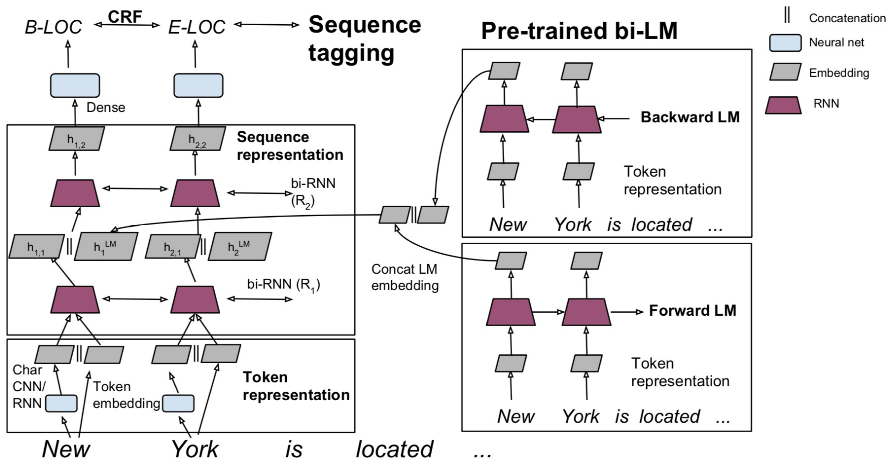
    
            - 引入到序列标注模型中，如图所示，其中左边部分为序列标注模型，也就是task-specific model，每个任务可能不同
            - 右边是前向LM(Left-to-right)和后向LM(Right-To-Left), 两个LM的结果进行了合并
            - 并将LM embedding与词向量、第一层RNN输出、第二层RNN输出进行了concat操作。
        - 通常feature-based方法包括两步：
            - 首先在大的语料A上无监督地训练语言模型，训练完毕得到语言模型
            - 然后构造task-specific model例如序列标注模型，采用有标记的语料B来有监督地训练task-sepcific model，**将语言模型的参数固定，语料B的训练数据经过语言模型得到LM embedding，作为task-specific model的额外特征**
            - ELMo是这方面的典型工作
    - fine-tuning方法
        - Fine-tuning方式是指在已经训练好的语言模型的基础上，加入少量的task-specific parameters, 例如对于分类问题在语言模型基础上加一层softmax网络，然后在新的语料上重新训练来进行fine-tune。
        - 例如OpenAI GPT中采用了这样的方法，模型如下所示：
        
        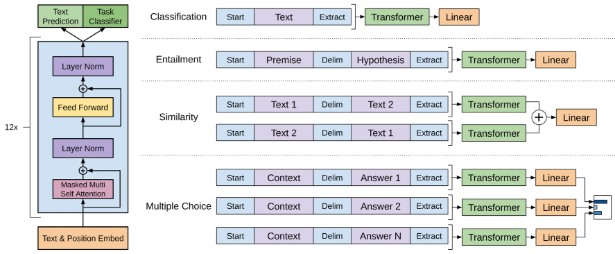
        
            - 首先语言模型**GPT采用了Transformer Decoder的方法来进行训练**，采用文本预测作为语言模型训练任务，训练完毕之后，加一层Linear Project来完成分类/相似度计算等NLP任务。
            - 因此总结来说，LM + Fine-Tuning的方法工作包括两步：
                - 1.构造语言模型，采用大的语料A来训练语言模型
                - 2.在语言模型基础上增加少量神经网络层来完成specific task，例如序列标注、分类等，然后采用有标记的语料B来有监督地训练模型，**这个过程中语言模型的参数并不固定**，依然是trainable variables.
            - 而BERT论文采用了LM + fine-tuning的方法，同时也讨论了BERT + task-specific model的方法。


## BERT

**前言：**
 - **BERT采用了Transformer Encoder的模型来作为语言模型**，完全抛弃了RNN/CNN等结构，而完全采用Attention机制来进行input-output之间关系的计算
 - 如下图中左半边部分所示：
 
    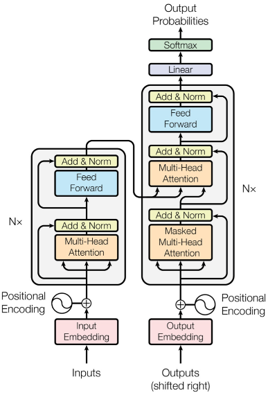
 - 其中模型包括两个sublayer：
    - 1.Multi-Head Attention来做模型对输入的Self-Attention组合变换
    - 2.Feed Forward部分来对attention计算后的输入进行变换
 - 因为**语言模型本身的定义是计算句子的概率**：

    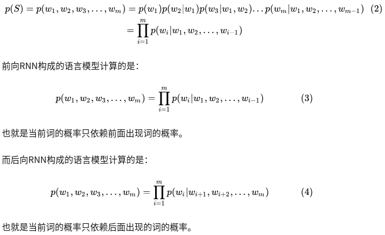
 - 那么如何才能同时利用好前面词和后面词的概率呢？
    - BERT提出了Masked Language Model，也就是随机去掉句子中的部分token，然后模型来预测被去掉的token是什么。
    - 这样实际上已经不是传统的神经网络语言模型(类似于生成模型)了，而是单纯作为分类问题，根据这个时刻的hidden state来预测这个时刻的token应该是什么，而**不是预测下一个时刻的词的概率分布了（区别于传统的语言模型预测下一时刻词的分布）**。
 - 相关工作：
    - Unsupervised feature-based -- ELMo
    - Unsupervised fine-tuning -- BERT/GPT
    - Transfer Learning from Supervised Data
 - 之前标准的语言模型是单向的
 - OpenAI GPT:
    - a left-to-right架构，在transformer的self-attention层，每一个token仅仅attend to之前的tokens
    - 这个限制对句子水平的任务而言是次最优的，当在token水平的任务进行精调时是毁灭性的，例如SQuAD任务
    - 使用一个浅层的连接去单独训练left-to-right和right-to-left LMs，来抽取context-sensitive features
    - 每个token的上下文表示是left-to-right表示和right-to-left表示的连接
 - BERT改进：
    - MLM：masked LM
        - BERT为了解决之前语言模型中单向的限制，提出了一个新的预训练目标：masked language model (MLM)
        - MLM随机mask一些输入中的token，目标是仅仅基于它的上下文来预测被masked的word的原始的词汇id
        - 不像left-to-right的语言模型预训练，MLM目标允许表示去融合left和right的上下文，允许我们去预训练一个深度双向的Transformer
        - 该双向性是BERT最重要的贡献
    - Next Sentence Prediction
        - 联合预训练text-pair表示
 - token-level任务有QA、词性标注等（取所有token的最后层transformer输出，喂给softmax层做分类），sentence-level任务有文本蕴含、句子对分类、情感分析等（取第一个token的输出表示，喂给一个softmax层得到分类结果输出）

**BERT模型：**
 - BERT (**B**idirectional **E**ncoder **R**epresentations from **T**ransformers)
 - 模型架构：
    - 是一个基于原始Transformer的，多层·双向·Transformer encoder
    - BERT base  (L=12, H=768, A=12, Total Parameters=110M)
    - BERT large (L=24, H=1024, A=16, Total Parameters=340M)
    - 相比GPT来说，BERT Transformer使用双向self-attention，而GPT Transformer使用受约束self-attention，也就是每一个token仅仅attend to它左边的context
    - 在一些文献中bidirectional Transformer常常被称为Transformer encoder，而left-context-only的版本被称为Transformer decoder，因为它能被用来做文本生成
 - 模型输入表示：
    - 为了一个输入能够针对两个任务，输入构造规则如下：
    
        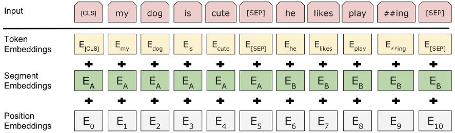
        
        - 1.为了能够同时表示单句子和句子对，多句子(例如QA中的Q/A)需要进行拼接作为单个句子，用segment embedding和`[SEG]`来进行区分
        - 2.句子第一个token总是有特殊含义，例如分类问题中是类别，如果不是分类问题那么就忽略
        - 三个embedding进行sum得到输入的向量
 - 该框架分为两步：
    - pre-training
        - 和ELMo、GPT的left-to-right或者right-to-left LMs的预训练不同，BERT采用两个无监督的任务去预训练
        - 任务1： Masked LM
            - 深度双向模型完全比一个left-to-right模型或者一个left-to-right和一个right-to-left模型的浅层连接
            - 因为双向的条件LM将会使每一个词间接地看到它自己，为了训练一个深度双向的表示，需要随机mask一定百分比的输入词，然后预测那些被masked掉的词，该过程就是MLM
            - 对于每个序列，随机mask掉15%的wordpiece tokens，和降噪自编码不同，我们仅仅预测被masked的word，而不是重构整个句子
            - 虽然上述过程允许我们获得一个双向预训练模型，缺点是这使得我们创造了一个pre-training和fine-tuning的不匹配，因为`[MASK]` token在fine-tuning时没有出现
            - 为了减轻上述的影响，我们并不总是使用`[MASK]`取代masked token
            - fine-tuning的时候没有`[MASK]` token，因此存在pre-training和fine-tuning之间的mismatch，为了解决这个问题，采用了下面的策略，具体过程：
                - 随机选择15%的token位置来预测
                - 假如第i个token被选中，我们取代第i个token：
                    - 在80%的时间里使用`[MASK]`
                    - 在10%的时间里使用随机token
                    - 在10%的时间里token不变（目的是让表示偏向真实的word）
                - 然后第i个输入最后的隐藏向量`T_i`被用来预测原始的token，使用交叉熵损失函数
            - 这样存在另一个问题在于在训练过程中只有15%的token被预测，正常的语言模型实际上是预测每个token的，因此Masked LM相比正常LM会收敛地慢一些。
            - Mask过程分析：
                - 这个过程的优势是Transformer encoder不知道将要预测哪个词或者哪个词被随机的词所取代，所以它被要求去保持每一个输入token的分布式上下文表示
                - 总体来看，随机mask占所有词的15% × 10% = 1.5%，不会伤害模型的语言理解能力
                - 和标准的语言模型训练相比，Masked LM仅仅在每个batch的15%的tokens上做预测，意味着可能需要更多的预训练steps来让模型收敛
                - MLM收敛速度慢于left-to-right模型（该模型对每一个词都进行预测）
        - 任务2： Next Sentence Prediction (NSP)
            - 下游任务QA和NLI是基于理解两个句子的关系的基础上的，这种关系没有被LM所捕获
            - 对于每一个预训练的例子在选择句子A和句子B的时候：
                - 在50%的时间里，句子B是真实的下一句
                - 在50%的时间里，句子B是语料中的一个随机的句子
    - fine-tuning
        - BERT用一个self-attention机制来同时对文本对进行编码，在两个句子间做双向cross attention
        - BERT large在小数据集上表现比BERT base好很多
        - **在fine-tuning SQuAD之前，先在TriviaQA上fine-tuning（将该数据集进行格式化，取篇章的前400个tokens，取出来的片段包含正确答案的），以进行适当的数据增强**
        - 对于SQuAD2.0无答案的情况，如果answer span的开始和结束位置落在`[CLS]`中，当作无答案的情况：
            
            ```
            C为[CLS] token, T_i为正常token，S为开始向量，属于R^H，H为隐状态的维度，E为结束向量，属于R^H
            
            通过计算T_i和S的点乘，然后经过softmax over all words，值最大的位置即为开始位置，同理计算出结束位置
            
            从位置i到位置j的候选span的分数为：
            S·T_i + E·T_j，  其中j>=i
            
            无答案的span分数（即落在[CLS]中）：
            s_{null} = S·C+E·C
            有答案的span分数的最大值：
            s_{i,j} = max_{j>=i} (S·T_i + E·T_j)
            
            通过比较下式来预测非空答案：
            s_{i,j} > s_{null} + τ
            其中阈值τ通过在dev数据集上最大化F1值来选择
            
            在这个版本的数据集上没有使用TriviaQA进行精调
            ```
        - 精调速度较快，可以使用参数搜索来最优化模型
        - 大数据集（100K+）对超参数不敏感，小数据集较敏感


**传统单向LM/ELMo/GPT/BERT/XLNet对比：**
 - 三者的架构不同，如下图：
 
    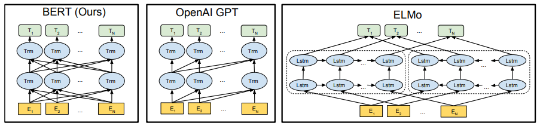
 - BERT和传统的单向语言模型（LM）区别：
    - BERT使用MLM和NSP进行预训练。
    - BERT的MLM方法和语言模型（LM）不同。**LM是对一个句子，单方向地一个接一个地进行预测**，这相当于最大化概率
    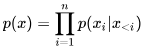，而**BERT和DAE（denoising auto-encoder）更为接近**。DAE就是在输入端加入噪声，通过模型后输出得到加噪声前的输入，即优化
    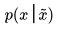。
        - 从这个角度讲，**BERT中的MLM就是对原输入x加入的一种噪声，BERT做的就是“去噪”**。基于这种方法，BERT一方面可以**更好地结合上下文信息**，训练出更好的上下文相关性；另一方面，也使得模型**更加robust**。
        - 相反，**LM只能从一个方向去考虑上文信息，而不能充分利用上下文的关系**，这是LM的一个不足之处。
    - 但是，**从生成类任务（如MT）的角度来讲，LM相比之下更加自然和简单**。生成类任务要求我们逐个生成Token，这和LM的训练机制不谋而合，而BERT由于训练过程和生成过程的不一致，导致其在生成类任务上的效果不佳。
    - 两者的固有缺点：
        - 1.BERT的一个缺点：预训练与微调的模式不匹配问题。因为BERT是DAE模式的，而生成类任务是LM（或Autoregressive, AR）模式的，这就在训练和微调两个阶段产生了不一致。
        - 2.1 另一方面，BERT句子中所有的`[MASK]`是基于相互独立这个假设的（现实情况中不是相互独立的）。
        - 2.2 从BERT和LM各自的优化目标可以看到：
            - LM的优化是基于概率的链式法则，也就是考虑了上文的相关性；
            - 而BERT的优化是基于上下文的“复原”，忽略了各个`[MASK]`之间的相关性。
        - 3.对LM而言，它只能考虑单方向的文本信息：
            - LM只能从一个方向，要么从左到右，要么从右到左进行优化
            - 而BERT考虑的是上下文的信息。
 - 相比ELMo使用LSTM，BERT使用了最新的Transformers结构作为基石，而且能够对下游任务进行fine-tune；而相比GPT的单向Transformer，BERT使用了双向Transformer结构，更有利于提取上下文信息。
 - 预训练架构不同：
    - BERT使用一个双向Transformer
    - GPT使用一个left-to-right Transformer
    - ELMo将两个独立训练的模型，即left-to-right LSTM模型和right-to-left LSTM模型连接起来为下游任务去生成特征
    - 在这三个模型中，仅仅只有BERT表示在所有的层都联合了左边和右边的上下文
 - BERT和GPT是基于fine-tuning的方法，ELMo是基于feature-based方法
 - BERT和GPT的区别：
    - GPT预训练语料是BooksCorpus（800M words），BERT是BooksCorpus（800M words）和Wikipedia（2500M words）
    - GPT使用句子分割`[SEP]`和分类token `[CLS]`，两者都是在精调的时候引入；而BERT在预训练的时候就学习`[SEP]`，`[CLS]`和句子`A/B`的embedding
    - GPT训练1M steps，每个batch size有32000 words，而BERT训练1M steps，每个batch size有128000 words
    - GPT使用学习率5e-5在所有的精调实验中，而BERT选择特定任务的精调学习率（即在dev数据集上最优的）
    - BERT相对于GPT主要的改进在于两个预训练任务和双向表示
    - 它与OpenAI GPT的区别就在于**BERT采用了Transformer Encoder**，也就是每个时刻的Attention计算都能够得到全部时刻的输入。
    - 而**OpenAI GPT采用了Transformer Decoder**，每个时刻的Attention计算只能依赖于该时刻前的所有时刻的输入，因为OpenAI GPT是采用了单向语言模型。做的是句子生成任务来预训练。
    - 现有的语言模型的问题在于，没有同时利用到Bidirectional信息，现有的语言模型例如ELMo号称是双向LM(BiLM)，但是实际上是两个单向RNN构成的语言模型的拼接。ELMo架构如下：
    
        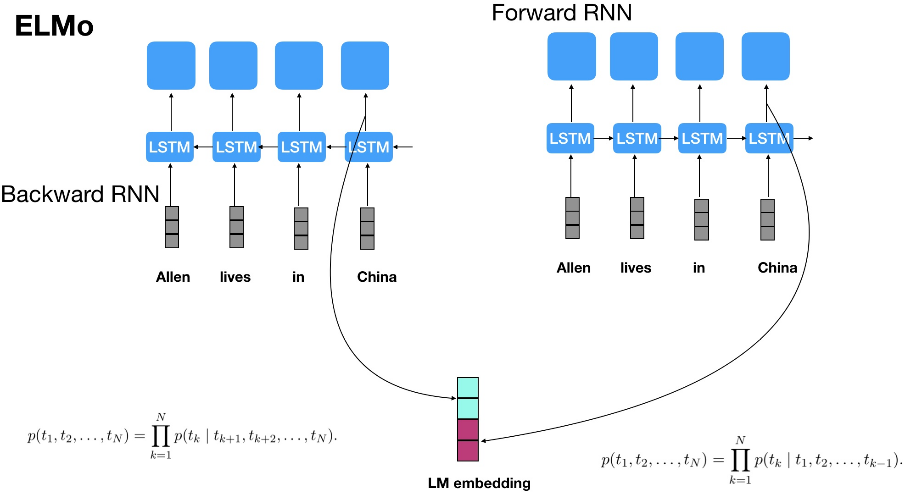
 - BERT需要这么多steps吗？是的，在MNLI任务上提升了1%，通过把steps从500k提升到1M
 - feature-based方法的mismatch将会被方法，因为没有经过fine-tuning来调整表示
 - GPT就是典型的自回归语言模型，ELMo其实是两个自回归语言模型的拼接，本质上仍然是自回归语言模型，而BERT是基于降噪自编码的模型。自回归语言模型天生适用于生成式任务，BERT在生成式任务上表现不如前者。
 - Bert这种自编码语言模型的好处是：能够同时利用上文和下文，所以信息利用充分。BERT相对GPT 1.0的性能提升，主要来自于双向语言模型与单向语言模型的差异。
 - GPT 2.0坚持沿用GPT 1.0的单向语言模型，使用了更高质量更大规模预训练数据，实验结果说明：如果想改善预训练语言模型，走这条扩充预训练模型数据的路子，是个多快好但是不省钱的方向。这也进一步说明了，预训练LM还有很大的提升空间，比如最简单的提升方法就是加大数据规模，提升数据质量。
 - Bert的自编码语言模型也有缺点：
    - 第一个预训练阶段因为采取引入`[Mask]`标记来Mask掉部分单词的训练模式，而Fine-tuning阶段是看不到这种被强行加入的Mask标记的，所以两个阶段存在使用模式不一致的情形，这可能会带来一定的性能损失。
    - 另外一个是，Bert在第一个预训练阶段，**假设句子中多个单词被Mask掉，这些被Mask掉的单词之间没有任何关系，是条件独立的，而有时候这些单词之间是有关系的，XLNet则考虑了这种关系**。
 - 自回归语言模型有个缺点：
    - 要么从左到右，要么从右到左，尽管可以类似ELMO两个都做，然后再拼接的方式。
    - 但是跟Bert比，效果明显不足够好（这里面有RNN弱于Transformer的因素，也有双向语言模型怎么做的因素）。
 - XLNet和BERT的区别：
    - 相比Bert，XLnet有一下改进：
        - 增加了训练集。
        - 引入了新的优化目标Permutation Language Modeling（PLM）。
        - 使用了双流自注意力机制（Two-Stream Self Attention, TSSA）。
        - 和与TSSA匹配的神奇Mask技巧。
    - 上述改进为BERT类预训练模型难以进行生成任务的问题提供了一个解决思路。
    - XLnet还使用了Transformer-XL作为基石，也使用了T-XL的相对位置编码，所以相比BERT，**XLnet对长文档的支持更加有效**。
    - 与AR语言模型不同，BERT被归类为**自编码器(AE)语言模型**。
    - **AE语言模型**的目的是**从损坏的输入中重建原始数据**。
    
        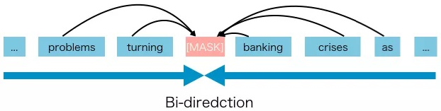
    
        损坏的输入意味着我们在预训练将原始token `into`替换为`[MASK]`。我们的目标是预测单词`into`来得到原来的句子。
    - AE语言模型的**优点是它可以在向前和向后两个方向上看到上下文**。
    - 但是AE语言模型也有其不足之处。
        - 缺点1：它在预训练中使用了`[MASK]`，但是这种人为的符号在fine-tune的时候在实际数据中是没有的，导致了预训练—fine-tune的不一致。
        - 缺点2：`[MASK]`的另一个缺点是它假设所预测的(mask掉的)token是相互独立的，给出的是未掩码的tokens。
            
            ```
            例如，有一句话：
            “It shows that the housing crisis was turned into a banking crisis”
            
            我们盖住了“banking”和“crisis”：
            “It shows that the housing crisis was turned into a [MASK] [MASK]”
            
             - 注意这里，我们知道，盖住的“banking”与“crisis”之间隐含着相互关联。
             - 但AE模型是利用那些没有盖住的tokens试图预测“banking”，并独立利用那些没有盖住的tokens预测“crisis”。
             - 它忽视了“banking”与“crisis”之间的关系。换句话说，它假设预测的(屏蔽的)tokens是相互独立的。
             - 但是我们知道模型应该学习(屏蔽的)tokens之间的这种相关性来预测其中的一个token。
            ```
        - 作者想要强调的是，XLNet提出了一种新的方法，**让AR语言模型从双向的上下文中学习，避免了AE语言模型中mask方法带来的弊端**。
    - BERT虽然用了深层双向信息，但**没有对被遮掩（Mask）的token之间的关系进行直接学习**，因此XLNet通过提出Permutation Language Model（**PLM**）对其进行了学习。
    - **更多的数据**，还有**用Transformer-XL中的技巧带来的更大范围上下文**，对模型有正向加强。


早期的无监督预训练模型主要是word2vec（SkipGram、CBOW）和Glove，这些模型都使用了不考虑上下文嵌入的方式得到词向量。


## XLNet

**自回归语言模型（Autoregressive LM）**
 - AR语言模型：指的是，依据前面（或后面）出现的tokens来预测当前时刻的token，代表有ELMO，GPT等。
 - **自回归语言模型：**即根据上文内容预测下一个可能跟随的单词，就是常说的**自左向右的语言模型**任务，或者反过来也行，就是根据下文预测前面的单词，这种类型的LM被称为自回归语言模型。
 - 包含以下模型：
    - **常规语言模型**：即在ELMO／BERT出来之前，大家通常讲的语言模型都是。
    - **GPT**：就是典型的自回归语言模型。
    - **ELMo**：
        - 其实是两个自回归语言模型的拼接，本质上仍然是自回归语言模型。
        - ELMO尽管看上去利用了上文，也利用了下文，但是本质上仍然是自回归LM，这个跟模型具体怎么实现有关系。
        - ELMO是做了两个方向（从左到右以及从右到左两个方向的语言模型），但是是**分别有两个方向的自回归LM**，然后把LSTM的两个方向的隐节点状态拼接到一起，来体现双向语言模型。
        - 所以**其实是两个自回归语言模型的拼接，本质上仍然是自回归语言模型**。
 - 自回归语言模型优缺点：
    - 缺点：
        - 只能利用上文或者下文的信息，不能同时利用上文和下文的信息
        - 当然，ELMO这种双向都做，然后拼接看上去能够解决这个问题，因为融合模式过于简单，所以效果其实并不是太好。
    - 优点：
        - 其实跟下游NLP任务有关，比如生成类NLP任务，比如文本摘要，机器翻译等，在实际**生成内容的时候，就是从左向右的，自回归语言模型天然匹配这个过程**。
        - 而Bert这种DAE（降噪自编码）模式，在生成类NLP任务中，就面临训练过程和应用过程不一致的问题，导致生成类的NLP任务到目前为止都做不太好。

**自编码语言模型（Autoencoder LM）**
 - AE语言模型：通过上下文信息来预测被mask的token，代表有BERT，Word2Vec(CBOW)。
 - 其实是通过破坏掉中间部分然后复原，捕捉深层次的双向信息。
 - 自回归语言模型只能根据上文预测下一个单词，或者反过来，只能根据下文预测前面一个单词。
 - 相比而言，Bert通过在输入X中随机Mask掉一部分单词，然后预训练过程的主要任务之一是根据上下文单词来预测这些被Mask掉的单词，这是典型的DAE的思路，那些被Mask掉的单词就是在输入侧加入的所谓噪音。
 - 类似Bert这种预训练模式，被称为DAE LM。
 - DAE LM的优缺点：
    - 优点：正好和自回归LM反过来，它能比较**自然地融入双向语言模型，同时看到被预测单词的上文和下文**，这是好处。
    - 缺点：
        - **预训练与微调阶段不一致的问题**，主要在输入侧引入`[Mask]`标记，导致预训练阶段和Fine-tuning阶段不一致的问题，因为Fine-tuning阶段是看不到`[Mask]`标记的。DAE就要引入噪音，`[Mask]`标记就是引入噪音的手段。
        - **BERT独立性假设问题**，即没有对被遮掩（Mask）的token之间的关系进行学习。
        - 此外对于**生成式问题**， AE模型也显得捉襟见肘。

**XLNet模型：**
 - 如何将AR和AE两者的优点统一起来？这时就到了XLNet登场：
    - AR方式所带来的自回归性学习了预测token之间的依赖，这是BERT所没有的；
    - 而BERT的AE方式带来的对深层次双向信息的学习，却又是像ELMo还有GPT单向语言模型所没有的，不管是有没有替换`[MASK]`。
 - 关于XLNet各个部件的关系，可以分为如下：
    - 为了更好实现PLM，需要**Two-Stream Self-Attention**和**Partial Prediction**
    - 为了更大的上下文信息，需要Transformer-XL中的两个技巧**Segment Recurrence Mechanism**还有**Relative Positional Encoding**
    - 最后为满足XLNet像BERT一样处理多段句子，加入了**Relative Segment Encoding**。
 
 - **XLNet提出使用重排列语言建模，使AR语言模型学习双向上下文。这样可以避免AE语言模型中MASK方法带来的弊端**。
 - 论文有两个亮点：重排列语言建模和双流自注意力。
 - **重排列语言建模**
 
    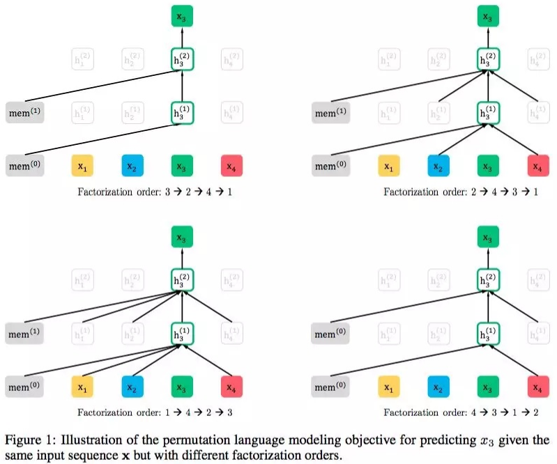
    
    其中，`x_3`为被预测的词。
    - 具体实现方式是，**通过随机取一句话排列的一种，然后将末尾一定量的词给“遮掩”（和BERT里的直接替换`[MASK]`有些不同）掉，最后用AR的方式来按照这种排列方式依此预测被“遮掩”掉的词**。
    - 重排列方法是获取一个序列的重排列，并使用之前的t-1个tokens作为上下文来预测第t个位置的token。
        
        ```
        例如，我们有一个句子，其中而x3是我们要预测的第t个位置的token：
        [x1, x2, x3, x4]
        
        首先，我们得到句子的排列：（共24个排列组合结果）
        [('x1', 'x2', 'x3', 'x4'),
         ('x1', 'x2', 'x4', 'x3'),
         ...
         ('x4', 'x3', 'x2', 'x1')]
         
        然后选取一些样本作为训练数据。(本文从排列中随机抽取样本)：
        ('x1', 'x2', 'x4', 'x3'),
        ('x1', 'x4', 'x3', 'x2'),
        ('x2', 'x3', 'x4', 'x1'),
        ('x4', 'x2', 'x3', 'x1'),
        ('x3', 'x2', 'x4', 'x1'),
        
        我们可以看到每个token都有机会出现在x3之前。因此，AR模型可以从这些上下文tokens中学习双向信息。
        重排列语言建模的目标函数，即以t-1个tokens为上下文，预测第t个token。
        ```
    - 我们很容易误解，我们需要获得一个句子的随机顺序并将其输入到模型中。但事实并非如此。输入语句的顺序是[x1, x2, x3, x4]，**XLNet使用注意力掩码来重排列分解因子的顺序**。
    
        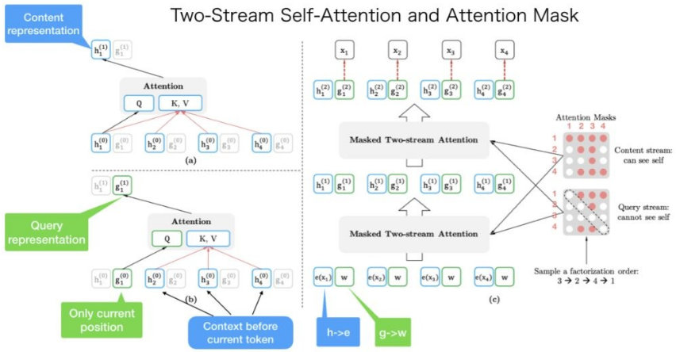
        
        ```
        这个句子的原始顺序是：
        [x1, x2, x3, x4]
        
        我们随机得到一个分解的顺序为：
        [x3, x2, x4, x1]
        
        左上角是content内容表示的计算。如果我们想要预测x1的内容表示，我们应该拥有所有4个token内容信息。
        KV = [h1, h2, h3, h4]和Q = h1。
        
        左下角是query查询表示的计算。如果我们想要预测x1的查询表示，我们不能看到x1本身的内容表示。
        KV = [h2, h3, h4]，Q = g1。
        
        注意右边的内容掩码和查询掩码，它们都是矩阵。
        
        内容掩码和查询掩码之间惟一的区别是，查询掩码中的对角元素为0，这意味着token不能看到它们自己。

        总结一下：输入的句子只有一个顺序。但是我们可以使用不同的注意力mask来实现不同的分解顺序。
        ```
    - 重排列带来了什么问题？
        - 有两个标准Transformer不能满足的要求：
            - 1.为了预测token `x_t`，模型应该只看到`x_t`的位置，而不是`x_t`的content。
            - 2.为了预测token `x_t`，模型应该将`x_t`之前的所有token编码为content
            - 特别是第一个要求，transformer将位置编码合并到token嵌入中。因此，它不能将位置信息与token嵌入分离开来。
        - BERT有这样的问题吗？
            - BERT是一个AE语言模型，**它不像AR语言模型那样需要单独的位置信息**。
            - 与XLNet需要位置信息来预测第t个token不同，BERT使用`[MASK]`来表示要预测哪个token(我们可以认为`[MASK]`只是一个占位符)。
                
                ```
                例如，如果BERT使用x2, x1, x4来预测x3，
                那么x2, x1, x4的嵌入包含了位置信息和其他与[MASK]相关的信息。
                因此，该模型很有可能预测[MASK]是x3。
                ```
        - BERT embedded (BERT所学的信息)包含两种信息：位置信息和内容信息(为简单起见，我将其分为两部分)：
        
        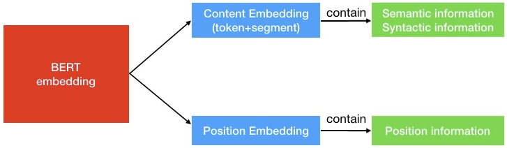
    - Permutation具体的实现方式是通过直接对Transformer的Attention Mask进行操作。
 - XLNet怎么解决这个问题（重排列出现的问题）？
    - XLNet提出了双流自注意力来解决这个问题：
        
        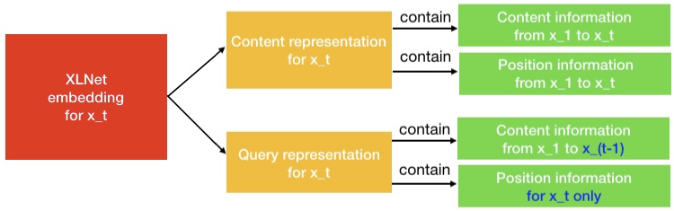
 - XLNet的提出是为了改进LM和BERT的固有缺点：
    - 缺点1：LM可以捕捉文本的相关性，是一种自然的生成模式，但是却不能关联下文；
    - 缺点2：BERT可以关联下文但是存在训练-微调失配问题。
    - 这样，我们就需要既可以关联上下文，又能单方向生成的一种训练方法。XLnet给出的答案是：使用Permutation Language Modeling（PLM），即对输入顺序本身进行置换。
    - 怎么把LM和预训练模型相结合呢？XLnet提出的双流自注意力机制，这个机制的核心就是BERT所谓的掩码Mask。
 - **双流自注意力**
    - query stream attention和content stream attention，前者用来预训练，后者用来精调。
    - 为了实现Permutation加上AR预测过程：
        - 首先我们会发现，打乱顺序后位置信息非常重要，同时对每个位置来说，需要预测的是内容信息（对应位置的词），于是**输入就不能包含内容信息，不然模型学不到东西**，只需要直接从输入复制到输出就好了。
        - 于是这里就造成了位置信息与内容信息的割裂，因此除了在BERT这样的位置信息加内容信息输入Self-Attention(自注意力) 的流（content Stream）之外，作者**还增加了另一个只有位置信息作为Self-Attention中query输入的流（query stream）**。
        - **这样就能利用Query Stream在对需要预测位置进行预测的同时，又不会泄露当前位置的内容信息。
        - 具体操作就是用两组隐状态g和h。其中g只有位置信息，作为Self-Attention里的Q（这样经过Q、K、V的计算之后得到的self-attention句子表示才会不含当前位置的内容信息）。h包含内容信息，则作为K和V。具体表示如下图所示：
        
            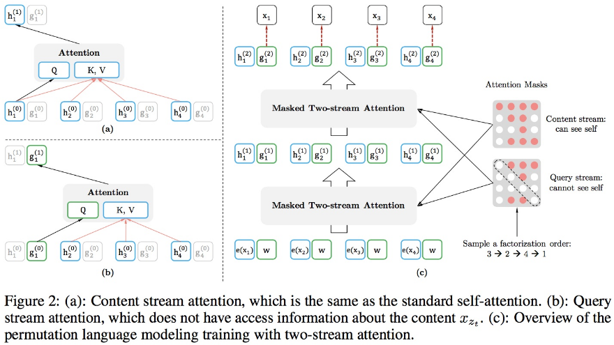
            
            - 假如，模型只有一层的话，其实这样只有Query Stream（左下角图）就已经够了。
            - 但如果将层数加上去的话，**为了取得更高层的h，于是就需要Content Stream了（左上角图）**,h同时作为Q、K、V。
        - 下边计算公式，其中z表示其中一个排列组合，t表示当前时刻（当前位置）：
            
            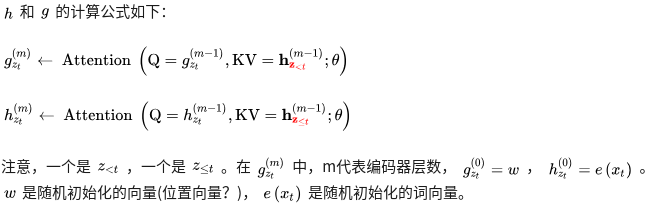
            
            - （上式）Query stream：只能看到当前的位置信息，不能看到当前token的编码
            - （下式）Content stream：传统self-attention，像GPT一样对当前token进行编码
            - **预训练阶段最终预测只使用query stream，因为content stream已经见过当前token了。在精调阶段使用content stream，又回到了传统的self-attention结构**。
        - 上图中我们需要理解两点：
            - 第一点，最下面一层蓝色的Content Stream的输入是`e(x_i)`，也就是对应的词向量，但看旁边绿色的 Query Stream，就会觉得很奇怪，为什么都是一样的？这个和Relative Positional Encoding有关。
            - 第二点，Query stream attention图中为了便于说明，只将当前位置之外的h作为K和V，但实际上实现中应该是所有时序上的h都作为K和V，最后再交给上图中的Query stream的Attention Mask来完成位置的遮盖。
    - 具体来说，不同于之前类似BERT的模型，**XLnet使用了两组不同的表征单元（两种自注意力）**：
        - （**用于fine-tuning**）一个是content stream attention （内容流注意力）：
            - 它是Transformer中的标准自注意力。
            - 和之前一样，是对上文信息的表示，需要涉及当前Token。
        - （**用于预训练**）另一个是query stream attention （查询流注意力）：
            - XLNet引入它来替换BERT中的`[MASK]` token。
            - 只能访问当前Token的位置信息而不能访问当前Token的内容信息。
        - **这两个信息流通过自注意力机制向上传递，在最后一层使用询问单元去输出**，输出的就是输入的内容。
    - 例如，如果BERT想用上下文单词x1和x2的知识来预测x3，它可以使用`[MASK]`来表示x3 token。`[MASK]`只是一个占位符。x1和x2的嵌入包含位置信息，帮助模型“知道”`[MASK]`的是x3。
    - XLNet的情况有所不同。一个token x3将**服务两种角色**：
        - **当它被用作内容来预测其他标记时，我们可以使用内容表示(通过内容流注意力来学习)来表示x3**。
        - **但是如果我们想要预测x3，我们应该只知道它的位置而不是它的内容。这就是为什么XLNet使用查询表示(通过查询流注意力来学习)来保留x3之前的上下文信息，只保存x3的位置信息**。
    - 可以认为XLNet用查询表示代替了BERT中的`[MASK]`。
    - 可以看到，通过这种巧妙的Mask方法，XLnet完美结合了LM的优点和上下文的相关性，并且比起LSTM，还具有可并行的优势。
    实际上，**这里的Mask和BERT的Mask在本质上是一样的，都可以看作是一种加噪的过程**。不同的是，**XLnet的Mask利用率更高**。这是因为，对同一个句子，我们可以有不同的置换，而且对同一个置换，我们可以像LM那样遍历整个句子，相当于遍历了所有可能的上下文情况。
 - **部分预测（Partial Prediction）**
    - 因为LM是从第一个Token预测到最后一个Token，在预测的起始阶段，上文信息很少而不足以支持Token的预测，这样可能会对分布产生误导，从而使得模型收敛变慢。
    - 为此，**XLnet只预测后面一部分的Token，而把前面的所有Token都当作上下文**。
        - 具体来说，对长度为T的句子，我们选取一个超参数K，使得后面`1/K`的Token用来预测，前面的`1-1/K`的Token用作上下文。
        - 注意，K越大，上下文越多，模型预测得就越精确。
    - 例如`[1-->2-->3-->4]`只预测3和4，把1和2当作上下文信息。
 - 此外，XLnet还使用了Transformer-XL作为基石，也使用了T-XL的相对位置编码，所以相比BERT，XLnet对长文档的支持更加有效。
 - **段循环机制（Segment Recurrence Mechanism）**
    - 其实思想很简单，因为一般训练Transformer时，会按照一定长度，将文本处理成一段（segment）一段的。比如说BERT预处理时，就会先处理成一个个512长度的样本，即使可能处理前的文本更长。这样子的话，有些**更长的上下文信息，模型就是学习不到的**。
    - 于是，能不能在前一段计算完后，将它计算出的隐状态（hidden states）都保存下来，放入一个Memory中去，之后在当前分段计算时，**将之前存下来的隐状态和当前段的隐状态拼起来作为Attention机制的K和V，从而获得更长的上下文信息**。
    - 这里作为K和V的原因是，最终self-attention表示是通过V和权重得到的。
    - 这样论文图中的神秘mem的身份也就很明显了，就是Segment Recurrence Mechanism中用到的memory，一面存放着之前segment的隐状态。
 - **相对位置编码（Relative Positional Encoding）**
    - 其实很大程度上是为了解决上一个机制中位置信息表示的问题。
    - 相对位置编码，不再关心句中词的绝对信息，而是相对的，比如说两个词之间隔了多少个词这样的相对信息。
 - **相对分割编码（Relative Segment Encodings）**
    - 为了通过输入形式`[[CLS], A, [SEP], B, [SEP]]`来处理句子对任务，于是需要加入标识A句和B句的段信息。BERT里面很简单，直接准备两个向量，一个加到A句上，一个加到B句上。
    - 但当这个遇上Segment Recurrence Mechanism时，和位置向量一样，也出问题了。
    - 万一出现了明明不是一句，但是相同了怎么办，于是我们就需要最后一块补丁，同样准备两个向量，s+和s-分别表示在同一个segment内和不在同一个segment内。
    - 具体实现是在计算attention的时候加入一项：
        
        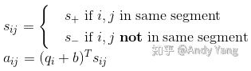
 - **更多的数据**
    - BERT使用了13GB纯文本数据
    - XLNet使用了126GB纯文本数据，是前者的近10倍。
    - 一些人认为XLNet不过是**更多数据+更广的上下文信息**。
 - 关于训练loss，**XLNet只用了PLM的loss**，却没有像BERT一样用NSP loss，但是它在句子级别任务表现却不差。
 - 实验表明：
    - XLNet对长片段信息的捕捉能力很强。
    - XLNet在句子表征方面性能也很棒。
 - 与BERT比较：
    - XLNet中Transformer-XL更大的上下文信息贡献了大概一半提高，而PLM贡献剩下一半。
 - 与MASS的比较：
    - 其实说到PLM，还有一篇比较类似的预训练论文值得关注，那就是微软的MASS。
    - 它的思路是在预训练阶段，对于一句话，我们先遮盖掉：
    
        ```
        比如说一句话：12345678，我们遮盖掉3456
        
        然后将被遮盖的12xxxx78输入encoder，获得上下文双向信息
        
        之后以此为基础，用AR的方式依次预测3456
        ```
    -  这个方法与XLNet的PLM做法的不同大体两点：
        - 1.MASS用的是BERT的`[MASK]`遮盖方法；
        - 2.MASS是**整段整段的遮掩**，而XLNet是类似于BERT的随机1/K的遮掩。
    - MASS的遮盖比例取50%的时候是最好的，这个又与BERT和XLNet里的接近15%有些不同了，而造成这个不同的原因，我认为可能是因为连续遮盖需要更长句子来习得生成所需要的依赖信息。
 - XLNet的出发点就是：能否**融合自回归LM和DAE LM两者的优点**（因为自回归适用于生成式任务）。
    - 就是说如果站在自回归LM的角度，如何引入和双向语言模型等价的效果；
    - 如果站在DAE LM的角度看，它本身是融入双向语言模型的，如何抛掉表面的那个`[Mask]`标记，让预训练和Fine-tuning保持一致。
    - 当然，XLNet还讲到了一个Bert被Mask单词之间相互独立的问题。
 - Bert的自编码语言模型有如下缺点，这两个缺点也是XLNet在第一个预训练阶段相对Bert来说要解决的问题：
    - 第一个预训练阶段因为采取引入`[Mask]`标记来Mask掉部分单词的训练模式，而Fine-tuning阶段是看不到这种被强行加入的Mask标记的，所以两个阶段存在使用模式不一致的情形，这可能会带来一定的性能损失。
    - 另外一个是，Bert在第一个预训练阶段，**假设句子中多个单词被Mask掉，这些被Mask掉的单词之间没有任何关系，是条件独立的，而有时候这些单词之间是有关系的，XLNet则考虑了这种关系**。
 - 那么，能不能类似Bert那样，**比较充分地在自回归语言模型中，引入双向语言模型**呢？因为Bert已经证明了这是非常关键的一点。具体怎么做才能让这个模型：**看上去仍然是从左向右的输入和预测模式，但是其实内部已经引入了当前单词的下文信息**呢？XLNet在模型方面的主要贡献其实是在这里。
 - 可以这么思考：
    - XLNet仍然遵循两阶段的过程，第一个阶段是语言模型预训练阶段；第二阶段是任务数据Fine-tuning阶段。
    - 它主要希望改动第一个阶段，不像Bert那种带Mask符号的Denoising-autoencoder的模式，而是采用自回归LM的模式。
    - 就是说，**看上去输入句子X仍然是自左向右的输入**，看到Ti单词的上文Context_before，来预测Ti这个单词。但是又**希望在Context_before里，不仅仅看到上文单词，也能看到Ti单词后面的下文Context_after里的下文单词**，这样的话，Bert里面预训练阶段引入的Mask符号就不需要了，于是**在预训练阶段，看上去是个标准的从左向右过程**，Fine-tuning当然也是这个过程，于是两个环节就统一起来。
 - **自回归语言模型（AR）**是利用上下文单词预测下一个单词的一种模型（但是在AR里，上下文单词被限制在两个方向，要么向前，要么向后）。
 
    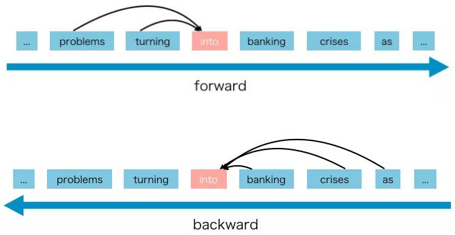
    
    - GPT和GPT-2都是AR语言模型。
    - AR语言模型的优点是**擅长NLP生成任务**。因为在生成上下文时，通常是正向的。AR语言模型在这类NLP任务中很自然地工作得很好。
    - 但是AR语言模型有一些缺点，它只能使用前向上下文或后向上下文，这意味着它**不能同时使用前向上下文和后向上下文**。
 - XLNet是一种广义的自回归预训练方法。
 - XLNet如何工作？
    - **XLNet专注于预训练阶段**。
    - 在预训练阶段，它提出了一个新的目标，称为重排列语言建模。我们可以从这个名字知道基本的思想，它**使用重排列的AR来学习双向上下文**。


## Transformer-XL

**Transformer：**
 - 优点：并行，考虑到sequence的long term dependency信息（相对于RNN），可解释性。
 - 缺点：句子与句子之间的关系，batch size也不能很大，空间占用大
 - Transformer编码固定长度的上下文，即将一个长的文本序列截断为几百个字符的固定长度片段(segment)，然后分别编码每个片段，片段之间没有任何的信息交互。比如BERT，序列长度的极限一般在512。因此Transformer-XL提出的动机总结如下：
    - **Transformer无法建模超过固定长度的依赖关系，对长文本编码效果差**。
    - Transformer把要处理的文本分割成等长的片段，通常**不考虑句子（语义）边界，导致上下文碎片化**(context fragmentation)。通俗来讲，一个完整的句子在分割后，一半在前面的片段，一半在后面的片段。
 - 围绕如何建模长距离依赖，提出Transformer-XL：
    - 提出片段级循环机制(**segment-level recurrence mechanism**)，引入一个**记忆(memory)模块**（类似于cache或cell），循环用来建模片段之间的联系。**这使得长距离依赖的建模成为可能；也使得片段之间产生交互，解决上下文碎片化问题**。
    - 提出相对位置编码机制(**relative position embedding scheme**)，代替绝对位置编码。在memory的循环计算过程中，**避免时序混淆，位置编码可重用**。
 - Transformer-XL总结：
    - 片段级循环机制为了解决编码长距离依赖和上下文碎片化
    - 相对位置编码机制为了实现片段级循环机制而提出，解决可能出现的时序混淆问题。
    - 也可以简单的理解**`Transformer-XL=Transformer + RNN`**，即segment-wise的RNN模型，但是RNN模型的组件是Transformer的Encoder模块。


## ERNIE 2.0

#### 主要贡献
 - ERNIE2是百度在ERNIE1基础上的一个升级版，提出了一个持续学习的机制（continual learning），持续学习包括**持续构建预训练任务和增量多任务学习两个部分**。

#### RoBERTa和ERNIE2.0对比
 - RoBERTa与ERNIE2的对比可以看到，现阶段改模型不如加数据，这样来看有几个问题：
    - 1.数据量的底，就BERT-Large模型结构而言，到底多少才会趋于饱和；
    - 2.预训练数据种类是否有关，比如我是不停地加新闻类数据就可以还是需要均衡新闻、小说、问答等各类数据；
    - 3.如果拿同等的训练数据，RoBERTa与ERNIE2不知是哪种模式的训练效果会好些。


## BERT-wwm-ext

#### 主要贡献
 - BERT-wwm-ext主要是有两点改进：
    - 1.预训练数据集做了增加，次数达到5.4B；
    - 2.训练步数增大，训练第一阶段1M步，训练第二阶段400K步。
 - 在一些中文任务上效果稍微有提升，这也验证了RoBERTa的观点（不是BERT不行，是潜力没发挥而已）。


## RoBERTa

#### 主要贡献
 - RoBERTa, A Robustly Optimized BERT Pretraining Approach
 - RoBERTa：站在BERT的肩膀上，是基于BERT的一种改进版本。是BERT在多个层面上的重大改进。
 - 从模型上来说，RoBERTa基本没有什么太大创新，主要是在BERT基础上做了几点调整：
    - 1.训练时间更长，batch size更大，训练数据更多，预训练数据集从16G增加到了160G，训练轮数比BERT有所增加；
    - 2.移除了next predict loss （NSP），相比于BERT，采用了连续的full-sentences和doc-sentences作为输入（长度最多为512），训练序列更长；
    - 3.text encoding，基于bytes的编码可以有效防止unknown问题；
    - 4.动态调整Masking机制，相比于静态，动态Masking是每次输入到序列的Masking都不一样。

#### 更多训练数据/更大的batch size/训练更长时间
 - 原本bert：BOOKCORPUS + English WIKIPEDIA.(16G original)
    - add CC-NEWS(76G)
    - add OPEN WEB TEXT(38G)
    - add STORIES(31G)
    - 一共161GB训练数据。
 - 更大的batch size，第一行为原始的。
        
    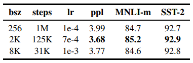
 - 更长的训练时间 steps
    
    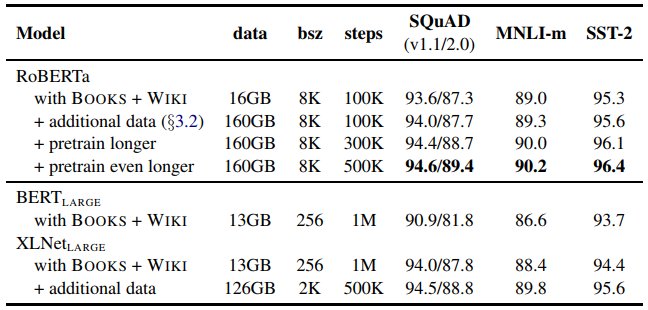

#### 动态掩码 Dynamic Masking
 - 原版的 BERT 实现在数据预处理期间执行一次掩码，得到一个静态掩码。而RoBERTa使用了动态掩码：每次向模型输入一个序列时都会生成新的掩码模式。这样，在大量数据不断输入的过程中，模型会逐渐适应不同的掩码策略，学习不同的语言表征。
 - static masking方法：
    - 原本的BERT采用的是static mask的方式。
    - 在创建预训练数据的过程中，先对数据进行提前的mask，为了充分利用数据，定义了`dupe_factor`（即同一条训练数据要复制`dupe_factor`份），然后同一条数据可以有不同的mask。
    - 但是这些数据不是全部都喂给同一个epoch，是不同的epoch，例如`dupe_factor=10`， `epoch=40`，则**每种mask的方式在训练中会被使用重复使用4次**。
    - 也就是说：如果复制10份，然后分别进行不同的mask，然后`epoch=10`，这时一个epoch就一一对应，但是epoch多了就会重复使用同一个样本的这10个不同的mask数据。
 - dynamic masking：
    - **每一次将训练example喂给模型的时候，才进行随机mask**。
    - 保证了即使同一个样本每次epoch中也能用到不用的mask，不受epoch的限制。
    
        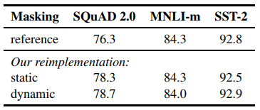

#### No NSP and Input Format
 - 有无NSP实验结果：
    
    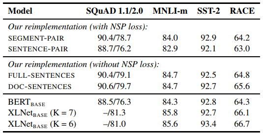
    
    - Segment+NSP：bert style
    - Sentence pair+NSP：使用两个连续的句子+NSP。用更大的batch size
    - Full-sentences：如果输入的最大长度为512，那么就是尽量选择512长度的连续句子。如果跨document了，就在中间加上一个特殊分隔符。无NSP。实验使用了这个，因为能够固定batch size的大小。
    - Doc-sentences：和full-sentences一样，但是不跨document。无NSP。最优。

#### Text Encoding
 - BERT原型使用的是character-level BPE vocabulary of size 30K
 - RoBERTa使用了GPT2的BPE实现，使用的是byte而不是unicode characters作为subword的单位。
 - 用更大的byte级别BPE词汇表来训练BERT，这一词汇表包含50K的subword单元，且没有对输入作任何额外的预处理或分词。
 - 中文实现没有dynamic masking

#### 为什么RoBERTa会比BERT、GPT-2和XLNet好？
 - 首先实验结果说明BERT及其掩码机制还是老当益壮。
 - 其次GPT-2和XLNet或多或少都反映了BERT某些方面的不足，不过这些对BERT都是非致命的。比如，**GPT-2中看到了更多数据的威力（BERT的训练数据远未饱和）**，**XLNet中看到next prediction loss非必须，batch size可以设置更大**。


## SpanBERT

发表时间：2019-07-24

#### 主要贡献
 - 1.提出了**更好的Span Mask方案**，也再次展示了随机遮盖连续一段字要比随机遮盖掉分散字好；
 - 2.通过**加入Span Boundary Objective (SBO)训练目标**，增强了BERT的性能，特别在一些与Span相关的任务，如抽取式问答；
 - 3.用实验获得了和XLNet类似的结果，发现**不加入NSP任务，直接用连续一长句训练效果更好**。

#### Span Masking
 - 模型如下，训练过程：
    
    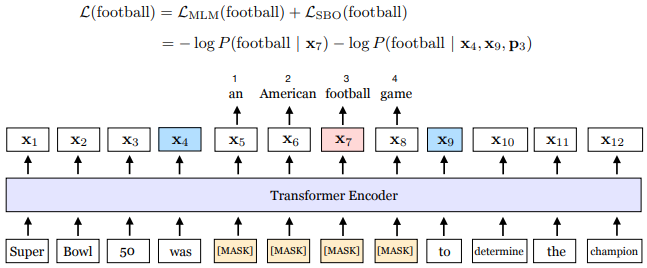
 - 对于原始的BERT，训练时，会随机选取整句中的最小输入单元token来进行遮盖，但这样会让本来应该有强相关的一些连在一起的字词，在训练时是割裂开来的。
 - Google放出的BERT WWM模型就是-将属于同一个词的子词一块mask：
    
    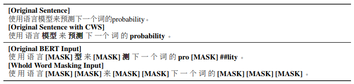
 - 更进一步，因为有些实体是几个词组成的，直接将这个实体都遮盖掉，百度在ERNIE模型中，就引入命名实体（Named Entity）外部知识，遮盖掉实体单元，进行训练。
 
    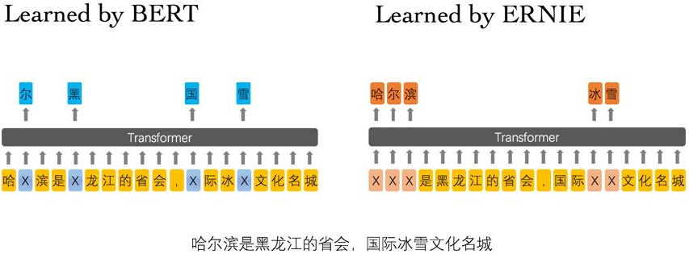
 - 但这两种做法会让人认为，或许必须得引入类似词边界信息才能帮助训练。但前不久的MASS模型，却表明可能并不需要，**随机遮盖可能效果也很好**，于是就有本篇的idea
 - 根据[几何分布](https://blog.csdn.net/eric2016_lv/article/details/53132954)，先随机选择一段（span）的**长度**，之后再根据
 [均匀分布](https://baike.baidu.com/item/%E5%9D%87%E5%8C%80%E5%88%86%E5%B8%83/954451?fr=aladdin)
 随机选择这一段的**起始位置**，最后**按照长度遮盖**。文中使用几何分布取p=0.2，最大长度只能是10，利用此方案获得平均采样长度分布。
    
    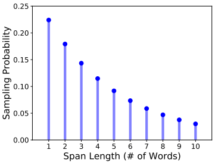
 - 通过采样，平均被遮盖长度是**3.8个词的长度**。计算过程如下：
    
    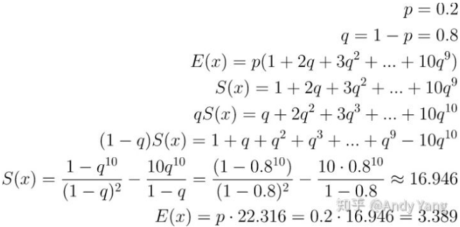
 - 对剩下的概率重新normalize，操作完后就会得到：
 
    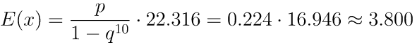
 - 各种mask方式效果对比：
    
    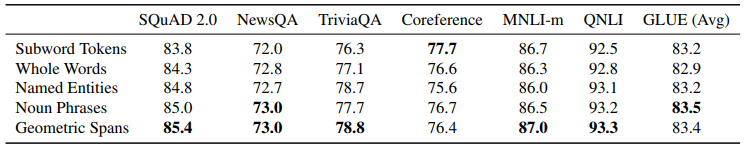

#### SBO
 - 只要给Random Span再加上SBO训练目标，就能大大提高这个方法的表现。
 - Span Boundary Objective (SBO，span边界目标)是该论文加入的新训练目标，希望**被遮盖Span边界的词向量，能学习到Span的内容**。
 - 具体做法是：
    - 在训练时取Span前后边界的两个词，值得指出，这两个词不在Span内，然后**用这两个词向量加上Span中被遮盖掉词的位置向量，来预测原词**。
 
        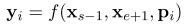
    - 将词向量和位置向量拼接起来，过两层全连接层：
    
        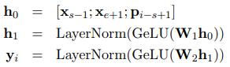
    - 最后预测Span中原词时获得一个新损失，就是SBO目标的损失，之后将这个损失和BERT的MLM的损失加起来，一起用于训练模型：
        
        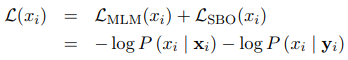
        
        其中，`x_i`是masked span中的一个token。
    - 加上SBO后效果普遍提高，特别是之前的指代消解任务，提升很大。
        
        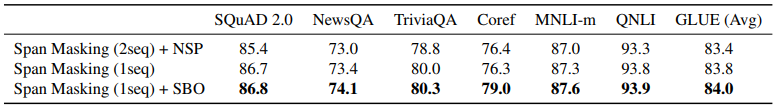
    - SpanBERT还有一个和原始BERT训练很不同的地方，它没用NSP任务，而是直接用Single-Sequence Training，也就是直接用一句来训练。
    - 为什么NSP没有用呢？
        - 相比起两句拼接，**一句长句可以是模型获得更长上下文**（类似XLNet的一部分效果）；
        - 在NSP的负例情况下，基于另一个文档的句子来预测词，**会给MLM任务带来很大噪音**。
        - 于是SpanBERT就没采用NSP任务，**直接一句长句，然后MLM加上SBO任务来进行预训练**。
    - 通过实验得出下边结论：
        - SpanBERT普遍强于BERT；
        - SpanBERT尤其**在抽取式问答上表现好**，这应该与它的预训练目标关系较大；
        - 舍弃掉NSP的**一段长句训练普遍要比原始BERT两段拼接的方式要好**。
    - 在XLNet中，是通过**PLM加上自回归方式来显式地学习遮盖词之间关系，而在SpanBERT，或上面提的WWM和ERNIE中，这种关系的学习是通过被遮盖掉部分本身的强相关性，隐式地学习到的**。


## ALBERT

#### 主要贡献
 - ALBERT: A Lite BERT for Self-supervised Learning of Language Representations
 - 相比BERT有以下改进：
    - Factorized Embedding Parameterization，较少参数量
    - Cross-layer Parameter Sharing，减少参数量
    - Sentence Order Prediction（SOP）
 - 从数据来看，仅仅上面三点改进，是不足以使ALBERT超越BERT的。还有一些小trick，作者没有重点介绍，但是我个人认为必不可少。
    - Segments-Pair
    - Masked-ngram-LM
    - remove dropout
    - 模型规模
 - ALBERT只是降低了空间复杂度，把参数量从108M降到了12M，但并没有降低时间复杂度。（训练时间大约是之前的三倍，相当于以时间换空间）
 - ALBERT进行预测的速度并没有加快，甚至在同等性能的模型对比中还慢了。
 - ALBERT降参数量，但不减计算量。

#### 矩阵分解 Factorized Embedding Parameterization
 - 先把word embedding映射到低维空间之后，再映射到hidden layer。这其实类似于做了矩阵的分解。
 - 通过将大的vocab embedding矩阵分解为两个小矩阵，将vocab embedding size和隐藏层的size分割开。
 - **对于Bert，词向量维度E和隐层维度H是相等的**（都是512维）。在large和xlarge等更大规模的模型中，**E会随着H不断增加**。
 - 作者认为没有这个必要，因为预训练模型主要的**捕获目标是H所代表的“上下文相关信息”而不是E所代表的“上下文无关信息”**。
    
    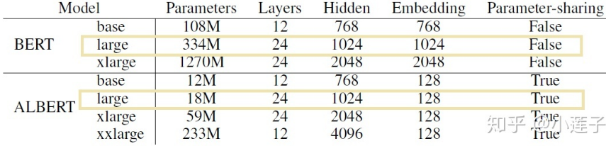
 - “Factorized（分解）”说白了就是**在词表V到隐层H的中间，插入一个小维度E，多做一次尺度变换**，从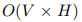变为：

    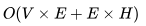
 - 词表包含3W个词，最大序列长度为512，下边是参数量的差距：
    
    ```
    BERT-large在这一块的参数量约为：
    (3W + 512) × 1024 = 31,244,288
    
    ALBERT-large的参数量约为：
    (3W + 512) × 128 + 128 × 1024 = 4,036,608
    
    差为27,207,680。这是多少？只有 27M！
    
    只做词向量压缩，只能从334M参数变成307M左右。
    ```
 - **参数量减少主要靠的是“Parameter-sharing”**。从作者对于ALBERT-base列的数据证实了这一点。`E=64`和`E=768`的参数两只相差31M。此外，embedding降维并不是完美无缺的，模型性能也跟着掉下来了（0.6）。
 
    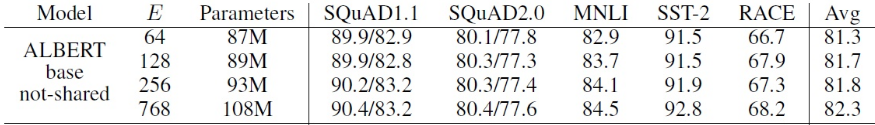
    
    不同的E对ALBERT-base模型的影响。
 - 矩阵分解带来的参数量降低并不是最大的。

#### 跨层参数共享 Cross-layer Parameter Sharing
 - 可以把transformer分成三部分：attention、normalization layer、FFN，其中normalization layer参数量很少，忽略不计，重点就看attention和FFN。
 - 跨层共享的机制非常简单，就是**单独用一个Self-Attention层循环12次，每一层的参数都一样。这样子我们就用1层的参数量来表示12层的参数**，为此，模型的参数当然大大降低了。
 - 为什么这个机制能行？作者提到给BERT的每一层参数做了分析，**发现每一层的参数基本相似，因此直接共享了**。
 - 该方法为参数量降维做出了巨大贡献，具体分为三种模式：
    
    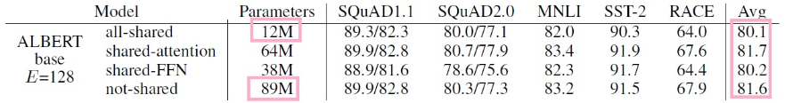
    
    - 只共享attention相关参数
    - 只共享FFN相关参数
    - 共享所有参数
 - "all-shared"之后，ALBERT-BASE的参数量直接从89M变成了12M，毕竟这种策略就相当于**把12个完全相同的层摞起来**。
 - 在保持模型性能下降不至于太厉害的同时，选择所有层次参数共享，降低的参数量是最多的，所以，ALBERT默认所有层次参数共享。
 - 从最后一列的Avg来看，如果是只共享attention参数，不仅可以减维，还能保持性能不掉。然而，作者为了追求"轻量级"，坚持把FFN也共享了。那掉了的指标从哪里补？答案之一是**把ALBERT-large升级为ALBERT-xxlarge，进一步加大模型规模**，把参数量再加回去。


#### 句子顺序预测 Sentence Order Prediction（SOP）
 - SOP任务也很简单，它的**正例和NSP任务一致（判断两句话是否有顺序关系），反例则是判断两句话是否为反序关系**。
 - SOP目标补偿了一部分因为embedding和FFN共享而损失的性能。
 - Bert原版的NSP目标过于简单了，它把”topic prediction”和“coherence prediction”融合了起来，这样模型会更加forces学习语料的连贯性。
 - SOP对其加强，**将负样本换成了同一篇文章中的两个逆序的句子，进而消除“topic prediction”**。
    
    
    
    - ALBERT-base下NSP与SOP的对比。
    - SOP对NSP的改进，带来了0.9个点的平均性能提升。
    - 该提升和Factorized embedding损失的性能可以相抵（约损失一个点）。


#### Segments-Pair / input sequence limit
 - BERT为了加速训练，前90%的steps使用了128个token的短句，最后10%才使用512个词的长句来训练position embedding。
 - ALBERT则几乎全程使用raw sequence length 训练，随机10%的概率选择shorted than 512进行训练。
 - 也就是在90%的情况下，ALBERT的输入都是raw sequence length，最长限制512，而BERT则是90%的情况下都只是128，所以输入长了近一倍，我们都知道输入越长，语言模型训练的越好，所以ALBER性能会有提高。
 - 似乎是**90%的情况下，输入的segment取满了512个词，其输入序列要比BERT长接近一半**。剩下10%时间随机生成一些小于512的序列。
 - 在RoBERTa的文章中，作者对比了不同序列长度下NSP目标的效果，分别是使用自然句作为样本的sentences-pair，和BERT系的segments-pair。从验数据来看，**更长的输入序列带来了更完整的上下文信息，显著地提升了模型性能**。也就是说**BERT系的segments-pair优于使用自然句作为样本的sentences-pair**。


#### Masked-ngram-LM / n-gram masking
 - Bert的MLM目标，是随机遮住15%的词来预测。
 - ALBERT预测的是n-gram片段，包含更完整的语义信息。
 - 每个片段的长度取值n（最大为3），根据概率公式计算得到。
    
    ```
    比如，取1-gram 、2-gram、3-gram的概率分别为6/11，3/11，2/11。越长概率越小。
    ```
 - ALBERT使用n-gram masking，这其实和后面有人改进word masking一样，对中文进行分词，**对词的masking比对字的masking性能会有一定的提升**，所以ALBERT使用n-gram masking，其中n取值为1-3。


#### remove dropout
 - 移除BERT的dropout之后，BERT在训练的时候并没有出现过拟合的现象.
 - 所以有人在后续的改进中移除了dropout，ALBERT同样移除dropout。


#### 模型规模
 - 重新说回“轻量级”这个事情。**真正“超越BERT-large”的是ALBERT-xxlarge，把H从1024直接扩大到了4096**。
 - 由于all-shared策略，**不断加深ALBERT的网络结构，无法获得持续的性能提升。因此BERT-large有24层，而ALBERT-xxlarge只用了12层**。
 - 前者是“窄而深”，后者是“宽而浅”的。**ALBERT的总参数量是BERT的70%**，但在规模上并没有占到什么便宜，“减参数而不减计算量”。
 - BERT-large比ALBERT-xxlarge 快了2.5个BERT-xlarge，跑同样的step，ALBERT-xxlarge慢了3.17倍。
 - ALBERT用70%的参数量，在同样的1M steps（即100万步）上确实超越了BERT。相应地，训练时间也拉长到3.17倍。它最后屠榜用的结果，是1.5M steps，又多出一半。
 - 使用更少的内存。
 - 当我们让一个模型的参数变多的时候，一开始模型效果是提高的趋势，但一旦复杂到了一定的程度，接着再去增加参数反而会让效果降低，这个现象叫作“model degratation"（模型退化）。

#### 预测速度
 - **ALBERT降低了参数量，但并没有提升预测速度**。至于出现这种情况的原因也很简单，BERT是12层Self-Attention堆叠而成，ALBERT同样也是12层Self-Attention堆叠而成，**在预测的时候，tensor都是要经过12层Self-Attention，所以速度并没有提升**。
    
    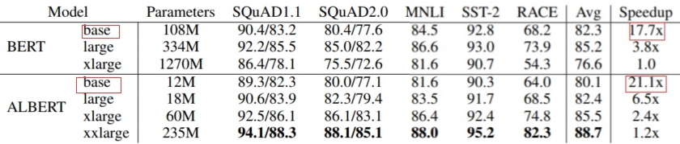
    
    - 可以看到**同为BASE情况下的对比，ALBERT的速度会快一点**。
    - 但如果在同等性能对比的情况下，BERT-base比ALBERT-large快了11.2个BERT-xlarge。
    - **也就是说在同等性能的情况下，BERT比ALBERT要快**。
 - 线下验证BERT-Base版本较TextCNN提高较为明显，但是推到线上，Inference时间爆炸了；无奈，只好减少Transformer层数，**由12层减少到4层**，由于此项目场景下的Input较短，所以使用4层Transformer并没有太多效果层的损失，性能上Inference时间减少了2.3倍，后面又将服务由CPU集群迁移到GPU集群，Inference时间又减少了7倍。
 - 整个上线过程较为麻烦，**要不断修改Transformer层数来调节Inference时间和Acc，Recall；层数越少，Inference时间越短，但是Acc和Recall就越差，反之亦然**。
 - 而ALBERT只减参数不减计算量。
 - 总结来看，Factorized embedding parameterization和Cross-layer parameter sharing是为了减少参数达到瘦身目的，而SOP(sentence-order prediction loss)、n-gram masking、input sequence limit、remove dropout等都是为了补回来瘦身导致的性能损失。
 - 参数量计算，具体看下参数是怎么减少的：
    
    ```
    我们可以把transformer分成三部分：attention、normalization layer、FFN，
    其中normalization layer参数量很少，忽略不计，重点就看attention和FFN。
    
    我们就对比ALBERT-base，E=768，layers（transformer层数）=12，A（multi head头数）=12。
    
    FFN计算公式为：
    FFN(x) = max(0, xW1 + b1)W2 + b2
    
    这是一个input和output维度一样的MLP变形网络，
    hidden size的变化为768->3072->768（或者512->2048->512），
    此处的参数量为W1和W2，单层layer FFN-parameters=2*768*3072=4.7M，
    那么shared-FFN之后，12层layer的FFN-parameters就只有4.7M，
    
    因为每一层的都一样，对比not-shared，
    12层layer FFN-parameters=12*2*768*3072=56.6M，
    参数减少56.6M-4.7M=51M，刚好和上表中108M-57M=51M相等。
    
    atteention的计算主要分成4个参数，Wq、Wk、Wv、Wo，
    其中12个头的Wq、Wk、Wv参数总量为12*3*768*64=1.7M，
    Wo参数量为768*768=0.6M，
    所以单层layer attention-parameters=1.7+0.6=2.3M，
    
    那么shared-attention之后，12层layer的attention-parameters就只有2.3M，
    因为每一层都一样，对比not-shared，
    12层layer attention-parameters=12*2.3M=27.6M，
    参数减少27.6M-2.3M=25M，刚好和上表中108M-83M=25M相等。
    
    同理，如果attention和FFN all shared之后，参数减少也可由上面两种情况相加得到。
    
    -----------------------------------------------------
    
    我们再看看性能变化。可以看到只共享attention参数，会在瘦身的同时，保证性能不变；
    但是作者不甘于此，采用了暴力“all shared”的方式，毫不顾忌“all shared”之后性
    能会有近2个点的损失，就真的如此不顾及嘛？并不是，后面作者又找了其他方式，把性能补
    回来。至此，ALBERT瘦身的操作都结束了，由上可以看到，embedding分解和parameter sharing
    极大减小了模型的参数，尤其是后者，但是都带来了性能的损失，就最坏的情况来讲，前者会
    有1个点的损失，后者会有2个点的损失，加起来近3个点了，这还怎么超越BERT？怎么屠榜？
    接下来就是作者为了提升性能做的一堆操作。
    ```

#### 总结
 - 大致可以分为两个方向，其一是减少参数，其二是弥补参数减少带来的效果损失。
 - 另外还有一些比较关键的是，ALBERT想要超过BERT，其实需要更多的训练数据、及加大hidden size。
 - ALBERT是“宽而浅”，BERT是“窄而深”。


## MASS


## ERNIE


## WWM BERT


## T5

#### 主要贡献
 - T5 (Text-to-Text Transfer Transformer)
 - 它最重要作用是给整个NLP预训练模型领域提供了一个通用框架，把所有任务都转化成一种形式。
 - 之后未来做NLP实验时，主要工作就变成了怎么把任务转换成合适的文本输入输出。
 - 将所有NLP任务都转化成Text-to-Text（文本到文本）任务，也就可以用同样的模型，同样的损失函数，同样的训练过程，同样的解码过程来完成所有NLP任务。


## ELECTRA


## 一些问题

**word2vec与BERT的区别：**


**线性插值法和Attention机制：**


**word2vec、glove、cove、fastext以及ELMo、GPT、BERT对于知识表达有什么优劣？**
 - word2vec：
    - 一般来说，基于Skip-gram训练出的词向量更细致，尤其是语料库较小或者有较多低频词的时候，使用Skip-gram更为合适。
    - Word2vec是一个“线性”的语言模型，训练出来的词向量支持一些线性的语义运算，如经典的“皇帝-皇后=男-女”。
    - 如果遇到一个生僻词，一般都能根据上下文大概猜出这个生僻词的含义，Word2vec其实就是基于这种思想。
    - 但是Word2vec并**没有考虑到词序信息以及全局的统计信息**等。
 - GloVe：
    - 针对Word2vec只考虑词局部信息的问题，GloVe尽可能的利用词汇的共现（co-occurrence）信息，构建了一个词汇的共现矩阵，并对这个共现矩阵进行降维。
    - GloVe词向量直译为全局的词向量表示，跟word2vec词向量一样本质上是基于词共现矩阵来进行处理的。
    - glove利用了全局信息，使其在训练时收敛更快，训练周期较Word2vec较短且效果更好
    - 基于词共现矩阵收集词共现信息。
    - 然后GloVe 模型损失函数：计算余弦相似度，语义类比，我们可以利用词汇之间的余弦相似性计算空格处到底填什么单词。
    - Glove和word2vec在并行化上有一些不同，即GloVe更容易并行化，所以对于较大的训练数据，GloVe更快
 - fastText：
    - fastText其实是Word2vec的一个拓展，其核心是n-gram，作者在Word2vec的基础上加入了n-gram信息，将Word2vec中中心词的向量转化成中心词n-gram的向量表示。
    - 由于加入了n-gram信息，fastText可以一定程度上解决OOV问题。fastText比较适用于形态丰富的语言，如俄语、土耳其语、法语等。中文上的效果可能没有上述语言来得好。
    - FastText模型构架与Word2Vector中连续词袋CBOW模型有点类似，不同之处在于，FastText预测标签，而CBOW预测中间词。FastText是把句子中所有的词向量进行平均，
    然后直接连接全连接层（softmax）层，加入一些n-gram特征来捕获局部序列信息，文本分类不必做过多的非线性转换、特征组合即可捕获很多分类信息
 - ELMo：
    - 无论是Word2vec、GloVe还是fastText，其本质都是一个“静态”的词向量，即训练完成后，一个词对应的向量是静止不变的。而自然语言中有很多的多义词，这恰恰是人类语言高效泛用的体现。
    - ELMo与上述词向量不同，它是一个“动态”的词向量。何为“动态”呢？
        - ELMo认为一个词的embedding可能有多种形式（一词多意，不同的上下文可能不同），**能解决多义词问题**。
        - 同时ELMo使用了一层CNN和两层LSTM，模型结构更深，能捕捉到更多的信息。
        - 而且不同于Cove词向量，ELMo提出可以根据**不同的下游任务进行线性组合，最大化的利用不同层抽取出的特征**，使得ELMo词向量有很强的泛用性。
    - ELMo与word2vec最大的不同：即词向量不是一成不变的，而是根据上下文而随时变化，这与word2vec或者glove具有很大的区别
 - 常用的词向量模型比如SkipGram, CBOW, Glove是**不考虑上下文的，也就是一个单词有个固定（Fixed）的向量（这个向量学习好之后就不会变了，直接拿来用就行了，比如腾讯AILib的200dim词向量，根据id取对应向量），不依赖于上下文的改变而改变**。比如“I back my car"和 "I hurt my back"里，单词"back"在不同的语境下的含义是不一样的 。
 - ELMo、BERT、XLNet、ALBERT，利用这些模型，我们可以**动态地去学出一个单词在不同上下文之间的词向量。当然，这些向量在不同的语境下的表示肯定是不一样的**。
 - BERT整个的架构其实是基于DAE，在论文里又叫MLM，**MLM并不是严格意义上的语言模型，因为整个训练过程并不是利用语言模型方式（自回归方式）来训练的**。
 - 传统Word Embedding很难解决多义词问题：
    - 比如bank既有银行又有河岸的意思。
    - Word Embedding在对bank这个单词进行编码的时候，是区分不开这两个含义的。
    - 因为它们尽管上下文环境中出现的单词不同，但是在用语言模型训练的时候，不论什么上下文的句子经过word2vec，都是预测相同的单词bank，而同一个单词占的是同一行的参数空间，这导致两种不同的上下文信息都会编码到相同的word embedding空间里去。
    - 所以word embedding无法区分多义词的不同语义，这就是它的一个比较严重的问题。
 - ELMO模型：
    - BiLSTM作为特征抽取器，使用语言模型作为训练任务。
    - 之前的Word Embedding本质上是个**静态的**方式，所谓静态指的是训练好之后每个单词的表达就固定住了，以后使用的时候，不论新句子上下文单词是什么，这个单词的Word Embedding不会跟着上下文场景的变化而改变，所以对于比如Bank这个词，它事先学好的Word Embedding中混合了几种语义 ，
    在应用中来了个新句子，即使从上下文中（比如句子包含money等词）明显可以看出它代表的是“银行”的含义，但是对应的Word Embedding内容也不会变，它还是**混合了多种语义**。这是为何说它是静态的，这也是问题所在。
    - ELMO的本质思想是：我事先用语言模型学好一个单词的Word Embedding，此时多义词无法区分，不过这没关系。在我实际使用Word Embedding的时候，**单词已经具备了特定的上下文了，这个时候我可以根据上下文单词的语义去调整单词的Word Embedding表示**，这样经过调整后的Word Embedding更能表达在这个上下文中的具体含义，自然也就解决了多义词的问题了。
    所以ELMO本身是个**根据当前上下文对Word Embedding动态调整的思路**。
    
        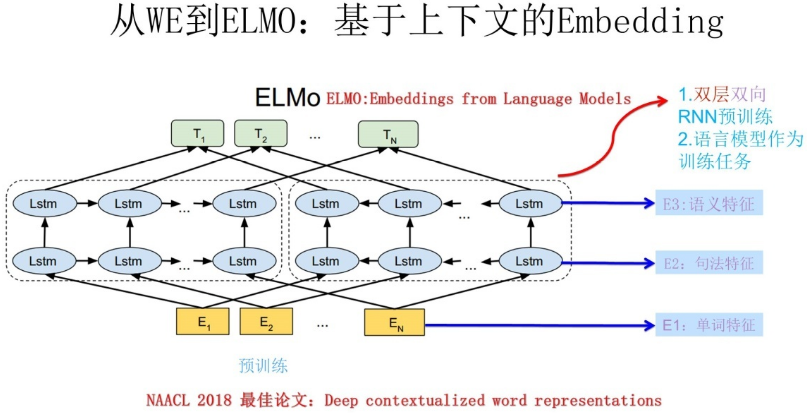
    - ELMO采用了典型的两阶段过程：
        - （预训练）第一个阶段是利用语言模型进行预训练；
        - （类似精调，作为特征）第二个阶段是在做下游任务时，从预训练网络中提取对应单词的网络各层的Word Embedding作为新特征补充到下游任务中。
    - 上图展示的是其预训练过程，它的网络结构采用了双层双向LSTM，目前语言模型训练的任务目标是根据单词`W_i`的上下文去正确预测单词`W_i`。
    每个编码器的深度都是两层LSTM叠加。使用这个网络结构利用大量语料做语言模型任务就能预先训练好这个网络，如果训练好这个网络后，输入一个新句子，
    句子中每个单词都能得到对应的三个Embedding:最底层是单词的Word Embedding，往上走是第一层双向LSTM中对应单词位置的Embedding，这层编码单词的句法信息更多一些；
    再往上走是第二层LSTM中对应单词位置的Embedding，这层编码单词的语义信息更多一些。也就是说，ELMO的预训练过程不仅仅学会单词的Word Embedding，还学会了一个双层双向的LSTM网络结构，而这两者后面都有用。
    
        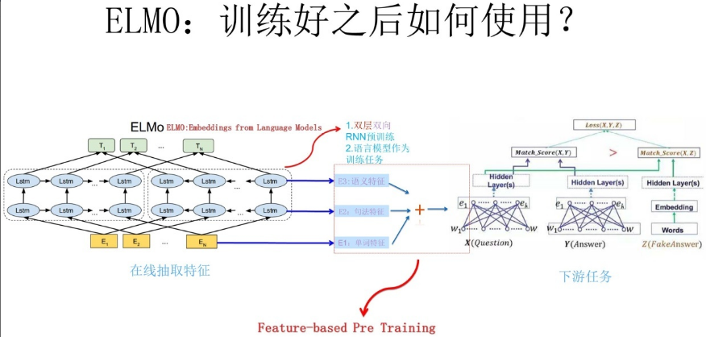
    
        - 上面介绍的是ELMO的第一阶段：预训练阶段。
        - 那么预训练好网络结构后，如何给下游任务使用呢？上图展示了下游任务的使用过程，比如我们的下游任务仍然是QA问题，此时对于问句X，我们可以先将句子X作为预训练好的ELMO网络的输入，这样句子X中每个单词在ELMO网络中都能**获得对应的三个Embedding**，之后给予这三个Embedding中的每一个Embedding一个**权重**a，这个权重可以学习得来，根据各自权重累加求和，将三个Embedding整合成一个。
        - 然后将整合后的这个Embedding作为X句在自己任务的那个网络结构中对应单词的输入，以此作为补充的新特征给下游任务使用。对Y来说也是如此处理。
        - 因为ELMO给下游提供的是每个单词的特征形式，所以这一类预训练的方法被称为“Feature-based Pre-Training”。
    - TagLM模型和ELMo类似，可以将TagLM看做ELMO的一个前导工作。
 
        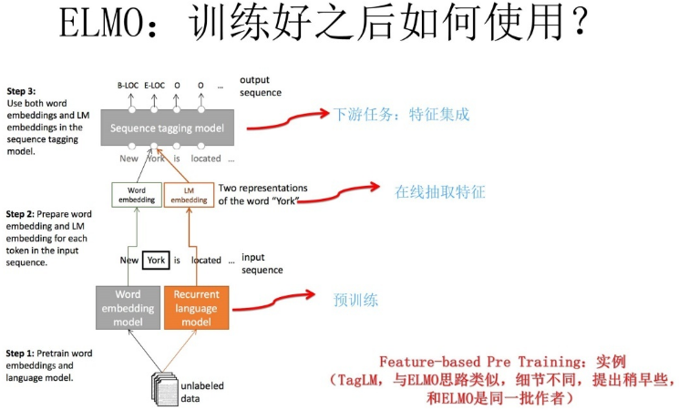
    - ELMo顺利解决了多义词问题，不仅如此，词性也能对应起来。
    - ELMO的缺点：
        - LSTM抽取特征能力远弱于Transformer
        - 拼接方式双向融合特征融合能力偏弱
 - GPT模型：
    - Transformer作为特征抽取器，使用语言模型作为训练任务。
    - GPT是“Generative Pre-Training”的简称，从名字看其含义是指的生成式的预训练。
    
        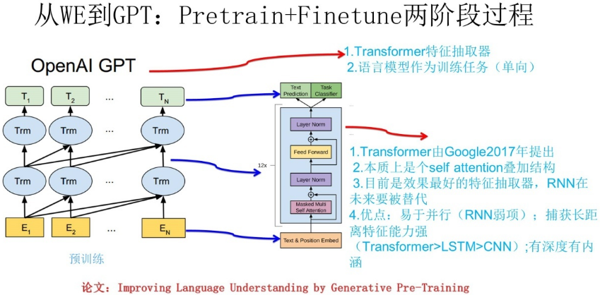
    - GPT也采用两阶段过程：
        - （预训练）第一个阶段是利用语言模型进行预训练，
        - （精调）第二阶段通过Fine-tuning的模式解决下游任务。
    - 上图展示了GPT的预训练过程，其实和ELMO是类似的，主要不同在于两点：
        - 首先，特征抽取器不是用的RNN，而是用的Transformer，上面提到过它的特征抽取能力要强于RNN；
        - 其次，GPT的预训练虽然仍然是以语言模型作为目标任务，但是采用的是单向的语言模型。
    - 所谓“单向”的含义是指：
        - **语言模型训练的任务目标是根据`W_i`单词的上下文去正确预测单词`W_i`**。
        - ELMO在做语言模型预训练的时候，预测单词`W_i`同时使用了上文和下文。
        - 而GPT则只采用这个单词的上文来进行预测，而抛开了下文。
        - 这个选择现在看不是个太好的选择，原因很简单，它没有把单词的下文融合进来，这限制了其在更多应用场景的效果，比如阅读理解这种任务，在做任务的时候是可以允许同时看到上文和下文一起做决策的。
        - 如果预训练时候不把单词的下文嵌入到Word Embedding中，是很吃亏的，白白丢掉了很多信息。
    - 缺点是没有子同一层利用到双向的信息。
 - BERT模型：
    - Transformer作为特征抽取器，使用语言模型作为训练任务（双向）。
    
        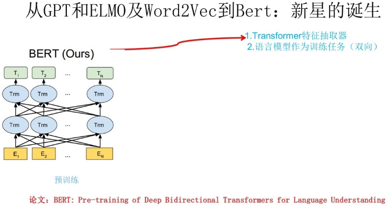
    - BERT也采用两阶段过程：
        - 预训练
        - 精调
 - Word2Vec/ELMo/GPT/BERT四者的关系：
    
    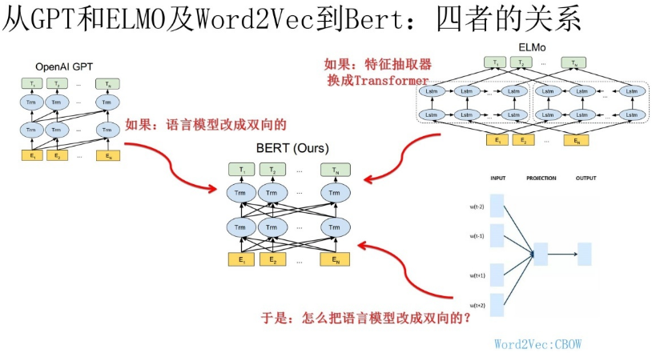
    
    - 再来看CBOW方法，它的核心思想是：
        - 在做语言模型任务的时候，我把要预测的单词抠掉
        - 然后根据它的上文和下文去预测单词。
    - 其实Bert怎么做的？Bert就是这么做的，即**MLM（采用了CBOW的思想）**。
    - MLM是词粒度的训练，到不了句子关系这个层级，所以又采用的NSP任务，有助于下游句子关系判断任务。


**ALBERT跨层参数共享在啥时候来更新梯度呢？每一次循环都更新？还是到最后一层来更新？**
 - 应该是所有循环进行完之后一块进行更新，不然就和直接堆叠12层没啥区别了。


## 参考博客
 - 《统计自然语言处理》 by 宗成庆
 - 《深度学习》(花书) by Bengio
 - 《神经网络与深度学习》 by 邱锡鹏 第14章
 - [The Annotated Transformer](http://nlp.seas.harvard.edu/2018/04/03/attention.html)
 - [详解Transformer](https://zhuanlan.zhihu.com/p/48508221)
 - [10分钟带你深入理解Transformer原理及实现](https://zhuanlan.zhihu.com/p/80986272)
 - [Attention Is All You Need](https://arxiv.org/pdf/1706.03762.pdf)
 - [transformer中为什么使用不同的K和Q，为什么不能使用同一个值？](https://www.zhihu.com/question/319339652/answer/1012823289)
 - [论文解读:BERT模型及fine-tuning](https://zhuanlan.zhihu.com/p/46833276)
 - [什么是XLNet，它为什么比BERT效果好？](https://zhuanlan.zhihu.com/p/107350079)
 - [什么是XLNet中的双流自注意力](https://zhuanlan.zhihu.com/p/107560878)
 - [香侬读|XLnet：比Bert更强大的预训练模型](https://zhuanlan.zhihu.com/p/71759544)
 - [XLNet详解](https://zhuanlan.zhihu.com/p/110204573)
 - [飞跃芝麻街：XLNet详解](https://zhuanlan.zhihu.com/p/71916499)
 - [SpanBert：对Bert预训练的一次深度探索](https://zhuanlan.zhihu.com/p/75893972)
 - [RoBERTa中文预训练模型，你离中文任务的「SOTA」只差个它](https://mp.weixin.qq.com/s/v5wijUi9WgcQlr6Xwc-Pvw)
 - [如何看待瘦身成功版bert——albert？](https://www.zhihu.com/question/347898375/answer/863537122)
 - [从bert,xlnet,roberta到albert](https://zhuanlan.zhihu.com/p/84559048)
 - [albert原理与实践](https://zhuanlan.zhihu.com/p/108435489)
 - [albert真的瘦身成功了吗？](https://zhuanlan.zhihu.com/p/102470776)
 - [nlp预训练模型：从transformer到albert](https://zhuanlan.zhihu.com/p/85221503)
 - [从Word Embedding到Bert模型—自然语言处理中的预训练技术发展史](https://zhuanlan.zhihu.com/p/49271699)
 - []()


