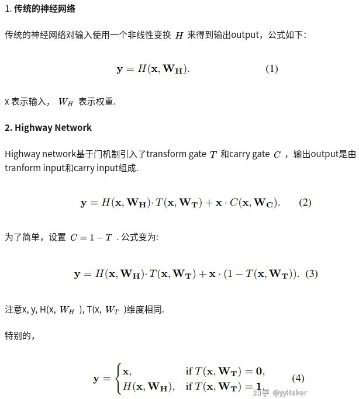

## Highway Network

参考博客：
 - [神经网络上高速不是梦](https://zhuanlan.zhihu.com/p/35019701)
 - [Hightway Networks学习笔记](https://blog.csdn.net/sinat_35218236/article/details/73826203?utm_source=itdadao&utm_medium=referral)

> 传统的神经网络随着深度的增加，训练越来越困难，这篇paper基于门机制提出了Highway Network，  
> 使用简单的SGD就可以训练很深的网络，而且optimization更简单，甚至收敛更快！

 - 对于highway network，添加了两个非线性转换
 - 式中，前一项表示输入信息被转换的部分，后一项原来信息中保留的部分。为了简化，将C替换为1-T
 - 所以一个highway层可以灵活的在朴素层和让他的输入信号简单穿过的层之间转换

## Maxout