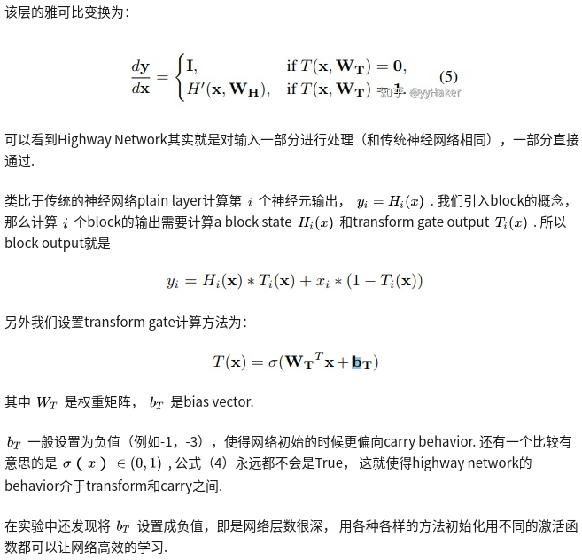
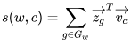

## Highway Network

参考博客：
 - [神经网络上高速不是梦](https://zhuanlan.zhihu.com/p/35019701)
 - [Hightway Networks学习笔记](https://blog.csdn.net/sinat_35218236/article/details/73826203?utm_source=itdadao&utm_medium=referral)

> 传统的神经网络随着深度的增加，训练越来越困难，这篇paper基于门机制提出了Highway Network，  
> 使用简单的SGD就可以训练很深的网络，而且optimization更简单，甚至收敛更快！




 - 对于highway network，添加了两个非线性转换
 - 式中，前一项表示输入信息被转换的部分，后一项原来信息中保留的部分。为了简化，将C替换为1-T
 - 所以一个highway层可以灵活的在朴素层和让他的输入信号简单穿过的层之间转换


## Subword模型

参考博客：
 - [CS224N笔记(十二):Subword模型](https://zhuanlan.zhihu.com/p/69414965)
 - [子词技巧：The Tricks of Subword](https://zhuanlan.zhihu.com/p/90151246)
 - [深入理解NLP Subword算法：BPE、WordPiece、ULM](https://zhuanlan.zhihu.com/p/86965595)

#### Character-Level Model
 - 之前的Neural Machine Translation基本上都是基于word单词作为基本单位的，但是其缺点是不能很好的解决out-of-vocabulary即单词不在词汇库里的情况，且对于单词的一些词法上的修饰(morphology)处理的也不是很好。一个自然的想法就是能够利用比word更基本的组成来建立模型，以更好的解决这些问题。
 - 一种思路是将字符作为基本单元，建立Character-level model，但是由于基本单元换为字符后，相较于单词，其输入的序列更长了，使得数据更稀疏且长程的依赖关系更难学习，训练速度也会降低。
 - 利用了多层的convolution, pooling与highway layer来解决这一问题，其中encoder的结构如下图所示：
 
    
 
    - 输入的字符先被映射到character embedding。得到`字符个数×维度`的矩阵
    - 然后与窗口大小不同的卷积核进行卷积操作再将输出联结起来，例如上图中有三种窗口大小分别为3，4，5的卷积核，相当于学习了基于字符的trigram, 4-grams, 5-grams。
    - 然后对卷积的输出进行max pooling操作，相当于选择最显著的特征产生segment embedding。
    - 由此我们从最基础的输入的character embedding得到了系统中认为语言学上有意义的segment embedding。
    - 然后将这些特征经过Highway Network(有些类似于Residual network，方便深层网络中信息的流通，不过加入了一些控制信息流量的gate）和双向的GRU，这样得到最终的encoder output。
    - 之后decoder再利用Attention机制以及character level GRU进行decode。
    - 实验结果显示，基于字符的模型能更好的处理OOV的问题，而且对于多语言场景，能更好的学习各语言间通用的词素。

#### Byte Pair Encoding与SentencePiece
 - 基本单元介于字符与单词之间的模型称作Subword Model。
 - 其中最常见的一对连续字节数据被替换为该数据中不存在的字节。后期使用时需要一个替换表来重建原始数据。**OpenAI GPT-2与Facebook RoBERTa均采用此方法构建subword vector**.
 - 那么Subword如何选择呢？
    - 一种方法是Byte Pair Encoding,简称BPE。
        - BPE最早是一种压缩算法，基本思路是把经常出现的byte pair用一个新的byte来代替
        - 例如假设('A', 'B'）经常顺序出现，则用一个新的标志'AB'来代替它们。
        - 给定了文本库，我们的初始词汇库仅包含所有的单个的字符，然后**不断的将出现频率最高的n-gram pair作为新的ngram加入到词汇库中，直到词汇库的大小达到我们所设定的某个目标为止**。
            
            ```
            例如，假设我们的文本库中出现的单词及其出现次数为：
            
            文本库： {'l o w': 5, 'l o w e r': 2, 'n e w e s t': 6, 'w i d e s t': 3}，
            
            我们的初始词汇库为：
            
            词汇库： { 'l', 'o', 'w', 'e', 'r', 'n', 'w', 's', 't', 'i', 'd'}，
            
            出现频率最高的ngram pair是('e','s') 9次，所以我们将'es'作为新的词汇加入到词汇库中，
            由于'es'作为一个整体出现在词汇库中，这时文本库可表示为 {'l o w': 5, 'l o w e r': 2, 'n e w es t': 6, 'w i d es t': 3}，
            （'es'连接了起来）
            这时出现频率最高的ngram pair是('es','t') 9次，将'est'加入到词汇库中，
            文本库更新为{'l o w': 5, 'l o w e r': 2, 'n e w est': 6, 'w i d est': 3}，
            新的出现频率最高的ngram pair是('l','o')7次，将'lo'加入到词汇库中，
            文本库更新为{'lo w': 5, 'lo w e r': 2, 'n e w est': 6, 'w i d est': 3}。
            
            以此类推，直到词汇库大小达到我们所设定的目标。
            这个例子中词汇量较小，对于词汇量很大的实际情况，我们就可以通过BPE逐步建造一个较小的基于subword unit的词汇库来表示所有的词汇。
            ```
        - 具体获得子词表的步骤是：
            - 1.准备语料，分解成最小单元比如英文中26个字母加上各种符号，这些作为初始词表；
            - 2.根据语料统计出现相邻符号对的频次；
            - 3.**挑出频次最高符号对**，比如说t和h组成的th，加入词表，训练语料中所有该相邻符号对融合（merge），这里即所有t和h都变成th;
            - 4.重复2和3操作，直到词表中单词数达到设定量，比如32000。
    - 谷歌的NMT模型用了BPE的变种，称作**wordpiece model**：
        - BPE中利用了n-gram count来更新词汇库，而wordpiece model中则用了一种贪心算法来最大化语言模型概率，即选取新的n-gram时都是选择使得perplexity减少最多的ngram。
        - 进一步的，sentence piece model将词间的空白也当成一种标记，可以直接处理sentence，而不需要将其pre-tokenize成单词。

#### WordPiece
 - WordPiece是谷歌内部库
 - WordPiece整体和BPE法相同，唯一不同在第2步，BPE是统计频次，而WordPiece则是获得**似然(Likelihood)，之后挑选最大似然的词对加入词表**，完成merge。
 - 如何获得似然？
    - 先将整个语料按照当前词表进行分解
    - 接着在分解后的语料上训练语言模型，对整个语料获得一个似然值。
    - 之后在已有的词表上组合词对，获得新的词表，重新训练语言模型，对整个语料获得一个似然值。
    - 对比所有词对候选，**挑选其中语言模型似然值提升最大的词对**，将其正式加入词表。
    - 不断进行此操作，直到整个词表量达到设定值。
 - 怎么组合词对？
    - TODO
 - 需详细解释的一点是关于训练细节，因为加入每个可能的词对都需重新训练语言模型，这样所要的计算资源会很大。作者对这块特意进行了解释，通过以下策略来降低计算量：
    - 只测试语料中出现的词对；
    - 只测试有很大可能（高优先）是最好词对的候选；
    - 同时测试几个词对，只要它们互不影响；
    - 重训语言模型（并不需要是神经网络型），只重新计算受影响的部分。


#### Unigram Language Model 
 - BPE和WordPiece都是**增量法**，即先初始化一个词表，再建立一个评估标准，每次挑最好的词对加入词表。而下来介绍的Unigram Language Model则可以当作是**减量法**。
 - 与其他方法的异同：
    - 首先它与WordPiece一样都用到**语言模型来挑选子词**，而不是像BPE统计频次
    - BPE和WordPiece都是初始化一个小词表，然后一个个增加到限定的词汇量，而Unigram Language Model却是**先初始一个大词表，接着通过语言模型评估不断减少词表**，直到限定词汇量。
 - 具体操作是：
    - 先建立一个足够大的种子词表，可以用所有字符的组合加上语料中常见的子字符串（用Enhanced Suffix Array 来枚举）。对于种子词表，也能用BPE法来生成。
    - 固定词表，用EM算法来最优化当前词表在语料上的概率；
    - 之后计算每个子词的loss，对应的loss相当于该子词有多大可能使总的loss降低；
    - 接着按照每个子词loss大小来排序，保留最大一定比例（比如说80%）的子词。
    - 不断重复2到4，直到词表量减少到限定范围。
 - 一般训练是如何融入上面的分词法？
    - 比如BPE，因为已经获得一份词表，所以在训练时，**先按照子词表将训练数据拆开，预测时也可以是预测子词而不是整词**，最后**按照BPE词表还原出整词**就行。
    - 比如说训练时先把unigram拆成uni## ##gram，这样获得结果时只需找到##符去掉就行。
 - 要用上面这些子词技巧，最简单的方法就是直接用谷歌的SentencePiece包，其中除了BPE和unigram language model法外，还支持字符和词级别分词。当然，BPE也可以用最经典的subword-nmt包。


#### Hybrid Model
 - 还有一种思路是在大多数情况下我们还是采用word level模型，而只在遇到OOV的情况才采用character level模型。
 - 其结构如下图所示：
 
    
    
    - 大部分还是依赖于比较高效的word level模型，但遇到例子中的"cute"这样的OOV词汇，我们就需要建立一个character level的表示
    - decode时遇到<unk>这个表示OOV的特殊标记时，就需要character level的decode
    - 训练过程是end2end的，不过损失函数是word部分与character level部分损失函数的加权叠加。

#### FastText
 - word vector也是基于word level来建立的，对于含有很多OOV的词汇的文本效果不好，那么我们可不可以采取类似于上面的subword的思路来产生更好的word embedding呢？
 - FAIR的FastText就是利用subword将word2vec扩充，有效的构建embedding。
 - 其基本思路是将每个word表示成bag of character n-gram以及单词本身的集合
 
    ```
    例如，对于where这个单词和n=3的情况，它可以表示为：
    
    <wh,whe,her,ere,re>,<where>
    
    其中"<"和">"为代表单词开始与结束的特殊标记。
    ```
 - 假设对于word w，其n-gram集合用`G_W`表示，每个n-gram的矢量表示为`箭头z_g`，则每个单词可以表示成其所有n-gram的矢量和的形式，而center word w与context word c的
 分数就可表示成的形式，之后就可以按照经典的word2vec算法训练得到这些特征向量。
 - 这种方式既保持了word2vec计算速度快的优点，又解决了遇到training data中没见过的oov word的表示问题，可谓一举两得。


## Maxout