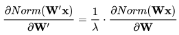

# 知识梳理

**参考书列表：**
 - 《统计学习方法》(蓝皮书) by 李航
 - 《机器学习》(西瓜书) by 周志华
 - 《深度学习》(花书) by Bengio
 - 《统计自然语言处理》 by 宗成庆


## 概述
> 统计学习包括：监督学习、非监督学习、半监督学习、强化学习

#### 监督学习
包括用于分类、标注、回归问题的方法
 - 特征空间：每个具体的输入是一个实例，通常由特征向量表示，这时，所有特征向量存在的空间成为特征空间
 - 特征空间的每一维对应于一个特征，模型实际上都是定义在特征空间上的
 - 回归问题：输入变量与输出变量均为连续变量的预测问题
 - 分类问题：输出变量为有限个离散变量的预测问题
 - 标注问题：输入变量与输出变量均为变量序列的预测问题

**联合概率分布：**
 - 监督学习假设输入和输出的随机变量X和Y遵循联合概率分布，`P(X,Y)`表示分布函数或者分布密度函数
 - 在学习过程中，假设这一联合概率分布存在，但对学习系统来说，联合概率分布具体定义是未知的
 - 训练数据和测试数据被看做是依据联合概率分布独立同分布产生的
 - 统计学习假设数据存在一定的统计规律
 - X和Y具有联合概率分布的假设就是监督学习关于数据的基本假设

**假设空间：**
 - 监督学习的目的在于学习一个由输入到输出的映射，这一映射由模型来表示
 - 学习的目的就在于找到最好的这样的模型
 - 模型属于由输入空间到输出空间的映射的集合，这个集合就是假设空间，假设空间的确定意味着学习范围的确定
 - 监督学习的模型可以是概率模型或非概率模型，由条件概率分布`P(Y|X)`或决策函数`Y=f(X)`表示
 - 对具体的输入进行相应的输出预测时，写作`P(y|x)`或`y=f(x)`

**模型：**
 - 在监督学习中，模型就是所要学习的条件概率分布或决策函数
 - 模型的假设空间包含所有可能的条件概率分布或决策函数
 - 非概率模型：由决策函数`Y=f(X)`表示的模型
 - 概率模型：由条件概率`P(Y|X)`表示的模型

**策略：**
 - 损失函数和风险函数
     - 损失函数：度量模型一次预测的好坏，度量预测错误的程度，是预测值和真实值的非负实值函数
        - 0-1损失函数
            ```
            L(Y,f(X)) = 1, Y!=f(X)
            L(Y,f(X)) = 0, Y=f(X)
            ```
        - 平方损失函数
            ```
            L(Y,f(X)) = (Y - f(X))^2
            ```
        - 绝对损失函数
            ```
            L(Y,f(X)) = |Y - f(X)|
            ```
        - 对数损失函数（对数似然损失函数）
            ```
            L(Y,P(Y|X)) = -logP(Y|X)
            根据此损失函数的形式，可以理解为：最小化损失函数就是最大化P(Y|X)
            ```
     - 风险函数：度量平均意义下模型预测的好坏
        - 损失函数值越小，模型就越好，由于模型的输入输出`(X,Y)`是随机变量，遵循连个分布`P(X,Y)`，所以损失函数的期望是：
            ```
            R_{exp}(f) = E_{p}[L(Y,f(x))] = 求积分 L(y,f(x))P(x,y)
            ```
        - 这是理论上模型`f(X)`关于联合分布`P(X,Y)`的平均意义下的损失，称为风险函数或期望损失
        - 学习的目标就是选择期望风险最小的模型
        - 联合分布是未知的，故`R_{exp}(f)`不能直接计算，实际上如果联合分布已知，可以直接求出`P(Y|X)`，就不用学习了
        - 模型关于训练数据集的平均损失成为经验风险或经验损失，期望风险是模型关于联合分布的损失，**经验风险是局限在训练数据集，期望风险是考虑整个联合分布，范围不一样**
        - 经验风险，记做`R_{emp}`:
            ```
            R_{emp}(f) = (1/N) sum L(y_i, f(x_i)) from i=1 to N
            ```
        - 根据大数定律当样本容量趋于无穷时，经验风险趋于期望风险
   
 - 经验风险最小化与结构风险最小化
    - 经验风险最小化：
        - 经验风险最小的模型是最优的模型，按照这个解释求最优模型就是求解最优化问题
        - 当样本容量足够大时，经验风险最小化能保证有很好的学习效果，比如**极大似然估计**就是经验风险最小化的一个例子，
        **当模型是条件概率分布，损失函数是对数损失函数时，经验风险最小化就等价于极大似然估计**
        - 但是当样本容量很小时，经验风险最小化学习的效果就未必很好，易产生过拟合现象
    - 结构风险最小化：
        - 是为了防止过拟合而提出的策略
        - 结构风险最小化等价于正则化(regularization)
        - 结构风险在经验风险上加上表示模型复杂度的正则化项或惩罚项，公式如下：
            ```
            R_{srm}(f) = (1/N) (sum L(y_i, f(x_i)) from i=1 to N) + lambda J(f)
            ```
        - 其中`J(f)`为模型的复杂度，模型越复杂，复杂度`J(f)`就越大，反之就越小，复杂度表示了对复杂模型的惩罚
        - `lambda>=0`是系数，用以权衡经验风险和模型复杂度
        - 加正则化项，使得模型的复杂度可控，一般情况下，模型复杂度越大，越容易过拟合
        - 贝叶斯估计中的**最大后验概率估计(MAP)**就是结构风险最小化的一个例子，**当模型是条件概率分布、损失函数是对数损失函数、模型复杂度由模型的先验概率表示时，
        结构风险最小化就等价于最大后验概率估计**
        - 结构风险最小的模型是最优的模型
        - 这样监督学习就变成了经验风险或结构风险的最优化问题，这时，经验或结构风险函数是最优化的目标函数

#### 模型评估与模型选择
**训练误差与测试误差：**
 - 训练误差：是学习到的模型关于训练数据集的平均损失
 - 测试误差：是学习到的模型关于测试数据集的平均损失
 - 测试误差小的方法具有更好的预测能力，对未知数据的预测能力称为泛化能力

**过拟合与模型选择：**
 - 如果一味追求提高对训练数据的预测能力，所选模型的复杂度往往比较高，这称为过拟合
 - 过拟合是指学习时选择的模型所含参数过多
 - 模型选择旨在避免过拟合并提高模型的预测能力
 - 训练误差很小的模型（也就是对训练数据拟合很好的模型），由于训练数据本身存在噪声，学出的模型就会出现过拟合的现象
 - 选择模型时不仅要考虑对已知数据的预测能力，还要考虑对未知数据的预测能力
 - 常用的模型选择方法：
    - 正则化(regularization)
        - 是结构风险最小化策略的实现，在经验风险上加一个正则化项或惩罚项
        - 正则化项一般是模型复杂度的单调递增函数，模型越复杂，正则化值就越大，比如，**正则化项可以时模型参数向量的范数**
        - 正则化一般具有以下形式：
            ```
            min ( (1/N) (sum L(y_i, f(x_i)) from i=1 to N) ) + lambda J(f)
            ```
        - 第一项是经验风险，第二项是正则化项，`lambda >= 0`为调整两者之间关系的系数
        - 正则化项可以取不同的形式，例如，回归问题中，损失函数是平方损失正则化项可以时参数向量的L2范数
            ```
            L(w) = (1/N) (sum (f(x_i; w) - y_i)^2 from i=1 to N) + (lambda/2) ||w||^2
            ```
        - 这里`||w||`表示参数向量w的L2范数
        - 正则化项也可以时参数向量的L1范数 `||w||1`
        - 第一项的经验风险较小的模型可能较复杂（有多个非零参数），这时第二项的模型复杂度会较大
        - 正则化的作用是选择经验风险与模型复杂度同时较小的模型
        - 正则化符合[奥卡姆剃刀原理](https://baike.baidu.com/item/%E5%A5%A5%E5%8D%A1%E5%A7%86%E5%89%83%E5%88%80%E5%8E%9F%E7%90%86/10900565?fr=aladdin)，
        即简单即有效原理，在所有可能选择的模型中，能够很好地解释已知数据并且十分简单才是最好的模型
        - 从贝叶斯估计的角度来看，正则化项对应于模型的先验概率，可以假设复杂的模型有较大的先验概率，简单的模型有较小的先验概率
    - 交叉验证
        - 如果给定的样本数据充足，进行模型选择的简单方法是讲数据切分成3部分，训练集、验证集、测试集，测试集用来进行模型的选择，测试集用于最终对学习方法的评估
        在学习到的不同复杂度的模型中，选择对验证集有最小预测误差模型，由于验证集有足够多的数据，用它对模型进行选择也是有效的
        - 很多情况下数据是不充足的，可以采用交叉验证的方式来选择模型
        - 交叉验证基本想法是重复地使用数据，把给定的数据进行切分，把切分的数据集组合为训练集和测试集，在此基础上反复地进行训练、测试以及模型选择
            - 简单交叉验证
                - 首先随机地将已给数据分为两部分，即训练集、测试集（比如7:3的比例）
                - 然后用训练集在各种条件下（比如，不同的参数个数）训练模型，从而得到不同的模型
                - 在测试集上评价各个模型的测试误差，选出测试误差最小的模型
            - S折交叉验证（应用最多）
                - 首先随机地将已给数据切分为S个互不相交的大小相同的子集
                - 然后利用S-1个子集的数据训练模型，剩下的子集测试模型
                - 将这一过程对可能的S种选择重复进行
                - 最后选出S次评测中平均测试误差最小的模型
            - 留一交叉验证
                - S折交叉验证的特殊情况是S=N，称为留一交叉验证，N为样本个数，往往在数据缺乏的情况下使用

#### 泛化能力
 - 通过测试误差来评价学习方法的泛化能力
 - 用学习到的模型对未知数据预测的误差称为泛化误差
 - 泛化误差反应了学习方法的泛化能力
 - 事实上泛化误差就是所学习到的模型的期望风险
 - 学习方法的泛化能力分析往往是通过研究泛化误差的概率上界进行的（泛化误差上界）
    - 就是通过比较两种学习方法的泛化误差上界的大小来比较他们的优劣
    - 具有以下性质：
        - 它是样本容量的函数，当样本容量增加时，泛化上界趋于0
        - 它是假设空间容量的函数，假设空间容量越大，模型就越难学，泛化误差上界就越大
        - 训练误差小的模型，其泛化误差也会小

#### 生成式模型和判别式模型
监督学习的模型一般有两种形式：决策函数`Y=f(X)`和条件概率分布`P(Y|X)`。

监督学习方法又可以分为生成方法（生成模型）和判别方法（判别模型）。

**生成模型：**
 - 由数据学习联合概率分布`P(X,Y)`，然后求出条件概率分布`P(Y|X)`，作为预测的模型，即生成模型
     ```
     P(Y|X) = P(X,Y) / P(X)
     ```
 - 之所以称为生成方法，是因为模型表示了给定输入X产生输出Y的生成关系
 - 典型的生成模型有：朴素贝叶斯法、隐马尔可夫模型

**判别模型：**
 - 判别方法由数据直接学习决策函数`f(X)`或者条件概率分布`P(Y|X)`作为预测的模型，即判别模型
 - 判别方法是对给定的输入X，应该预测什么样的输出Y
 - 典型的判别方法有：K近邻、感知机、决策树、最大熵模型、逻辑斯谛回归、支持向量机、提升方法、、条件随机场

**生成模型和判别模型区别：**
 - 生成方法的特点：
    - 生成方法可以还原出联合概率分布`P(Y|X)`，而判别方法不能
    - 生成方法的学习收敛速度更快，即当样本容量增加时，学到的模型可以更快地收敛于真实模型
    - 当存在隐变量时，仍可以用生成方法学习，此时判别方法就不能用
 - 判别方法的特点：
    - 判别方法直接学习的是条件概率`P(Y|X)`或决策函数`f(X)`，直接面对预测，往往学习的准确率较高
    - 由于直接学习`P(Y|X)`或`f(X)`，可以对数据进行各种程度上的抽象、定义特征并使用特征，因此可以简化学习问题


#### 分类问题
 - 在监督学习中，当输出变量Y取有限个离散值时，预测问题便成为分类问题
 - 这时，输入变量X可以时离散的，也可以是连续的
 - 评价分类器的指标一般是分类准确率，对于二分类常用精确率、召回率
     ```
     TP --- 将正类预测为正类数量
     FN --- 将正类预测为负类数量
     FP --- 将负类预测为正类数量
     TN --- 将负类预测为负类数量
     ```
 - 精确率：
     ```
     P = TP / (TP + FP) = 正类预测为正类 / (正类预测为正类 + 负类预测为正类)
       = 测试结果中真正类数量 / 测试集中被预测为是正类的数量
     ```
 - 召回率：
     ```
     R = TP / (TP + FN) = 正类预测为正类 / (正类预测为正类 + 正类预测为负类)
       = 测试结果中真正类数量 / 测试集中所有实际是正类的数量
     ```
 - F1值：是精确率和召回率的调和均值，两者都高时，F1值也会高
     ```
     2/F1 = 1/P + 1/R
     ```

#### 标注问题
 - 表述也是一个监督学习问题，可以认为标注问题是分类问题的一个推广，是更复杂的结构预测问题的简单形式
 - 标注问题的输入是一个观测序列，输出是一个标记序列或状态序列
 - 标注问题的目标是学习一个模型，使其能够对观测序列给出标记序列作为预测
 - 对一个观测序列找到使条件概率最大的标记序列
 - 评价标注模型的指标与评价分类模型的指标一样，常用准确率、精确率、召回率
 - 常用算法：HMM、CRF

### 回归问题
 - 预测输入变量和输出变量之间的关系
 - 回归模型表示从输入变量到输出变量之间映射的函数
 - 回归问题的学习等价于函数拟合
 - 按照输入变量的个数分为一元回归和多元回归，按照输入变量和输出变量之间的关系的类型（即模型的类型）分为线性回归和非线性回归
 - 最常用损失函数是：平方损失函数，在此情况下可用最小二乘法求解


**最小二乘法：**
 - 是一种数学优化技术
 - 最小化误差的平方和寻找数据的最佳函数匹配
 - 利用[最小二乘法](https://blog.csdn.net/qq_41598072/article/details/83984299)可以简便地求得未知的数据，并使得这些**求得的数据与实际数据之间误差的平方和为最小**
 - 简单来说就是：有一群离散点（可能不再一条直线上），求一条直线，使得每个点到该直线的误差的平方和最小（也就是让每个点与该直线尽量接近，误差平方和最小）
 如果这些离散点在同一直线上，那么这个和为0（最理想的情况，往往达不到，具体看点的分布），将上边的公式对每个系数求偏导（=0），求得式子的最小值点，得到系数，进而得出方程


## 感知机
**一般概念：**
 - 感知机是二类分类的**线性分类模型**，输入为实例的特征向量，输出为实例的类别
 - 感知机对应于输入空间（特征空间）中将实例划分为正负两类的分离超平面，属于**判别模型**
 - 感知机学习旨在求出将训练数据进行线性划分的分离超平面
 - 为此，倒入基于误分类的损失函数，利用梯度下降法对损失函数进行极小化，求得感知机模型

**感知机模型：**
 - 定义：由输入空间到输出空间的如下函数成为感知机，
     ```
     f(x) = sign(w·x + b)
     ```
 其中，sign为符号函数，即：
     ```
     sign(x) = +1, 当x>=0时
     sign(x) = -1, 当x<0时
     ```
 - 感知机模型的假设空间是定义在特征空间中的所有线性分类模型或线性分类器，即函数
     ```
     {f|f(x)=w·x+b}
     ```

**感知机学习策略：**
 - 损失函数一个是自然选择误分类点的总数（不易优化），另一个是误分类点到超平面S的总距离（采用这个）
    ```
    L(w,b) = - sum (y_i (w·x_i + b)) from x_i属于M
    ```
 其中M为误分类点的集合，这个损失函数就是感知机学习的经验风险函数
 - 显然，损失函数`L(w,b)`是非负的，如果没有误分类点，损失函数值就是0
 - 误分类点越少，误分类点离超平面越近，损失函数值就越小


## KNN
**一般概念：**
 - KNN是一种基本分类与回归方法，输入为实例的特征向量
 - KNN进行分类时，对新的实例，根据其k个最近邻的训练实例的类别，通过多数表决等方式进行预测
 - 因此，KNN不具有显式的学习过程，实际上利用训练数据集对特征向量空间进行划分，并作为其分类的模型
 - 三要素是：k值的选择、距离度量、分类决策规则

**K近邻算法：**
 - 相当于将特征空间划分为一些子空间，确定子空间里的每个点所属的类
 - k值的选择：
    - 选择较小的k值：
        - 学习的近似误差会减小，只有与输入实例较近的训练实例才会对预测结果起作用
        - 缺点是学习的估计误差会增大，预测结果会对近邻的实例点非常敏感，如果近邻的实例点恰巧是噪声，预测就会出错
        - k值减小意味着整体模型变得复杂，容易发生过拟合
    - 选择较大的k值：
        - 相当于用较大邻域中的训练实例进行预测
        - 优点是可以减少学习的估计误差，缺点是学习的近似误差会增大，这时与输入实例较远的（不相似的）训练实例也会对预测起作用，使预测大声错误
        - k值的增大意味着整体的模型变得简单
    - k通常取较小的数值，采用交叉验证法来选取最优k值
 - KNN的分类决策规则是多数表决，等价于经验风险最小化

**KD树：**
 - 实现KNN时主要考虑是如何对训练数据进行快速k近邻搜索，这在**特征空间的维数大及训练数据容量大**时尤其必要
 - KNN最简单的实现方法是线性扫描，即要计算输入实例与每一个训练实例的距离（非常耗时，不可取）
 - ---------------------------- 分割线 ----------------------------
 - kd树是一种对k维空间中的实例点进行存储以便对其进行快速检索的树形数据结构
 - kd树是二叉树，表示对k维空间的一个划分
 - 构造kd树相当于不断地用垂直于坐标轴的超平面将k维空间切分，构造一系列的k维超矩形区域
 - kd树的每个结点对应于一个k维超矩形区域
 - 平衡的kd树搜索时的效率未必是最优的
 - 构造平衡kd树：
    - 输入：k维空间数据集`T={x_1,x_2,...x_N}`，其中`x_i=(x_{i}^{(1)}, x_{i}^{(2)}, ..., x_{i}^{(k)})^T   i=1,2,...N`，输出：kd树
    - 构造根结点，根结点对应于包含数据集T的k维空间的超矩形区域
        - 选择输入中的第一个维度为坐标轴，以T中所有的实例的该坐标的中位数为切分点，将根结点对应的超矩形区域切分为两个子区域
        - 切分由通过切分点并与坐标轴垂直的超平面实现
        - 由根结点生成深度为1的左右子结点，左子节点对应坐标小于切分点的子区域，有子结点对应大于的
        - 将落在切分超平面上的实例点保存在根结点
    - 重复进行上述操作，直到两个子区域没有实例存在时停止，从而形成kd树的区域划分

**搜索KD树：**
 - 利用kd树可以省去大部分数据点的搜索，减少搜索的计算量
 - 给定一个目标点，搜索其最近邻：
    - 首先找到包含目标点的叶结点
    - 然后从该叶结点出发，依次回退到父结点，不断查找与目标点最近邻的结点，当确定不可能存在更近的结点时终止
    - 这样搜索就被限制在空间的局部区域上，效率大为提高
    - 包含目标点的叶结点对应包含目标点的最小超矩形区域，以此叶结点的实例点作为当前最近点，目标点的最近邻一定在以目标点为中心并通过当前最近点的超球体的内部
    - 然后返回当前结点的父结点，如果父节点的另一子结点的超矩形区域与超球体相交，那么在相交的区域内寻找与目标点更近的实例点，如果寻在这样的点，将此点作为新的
    当前最近点，算法转到更上一级的父节点，继续上述过程。如果父节点的另一子结点的超矩形区域与超球体不相交，或者不存在比当前最近点更近的点，则停止搜索
 - 如果实例点是随机分布的，kd树搜索的平均计算复杂度是`O(logN)`，N是训练实例数
 - kd树更适用于训练实例数远大于空间维数时的k近邻搜索，当空间维数接近训练实例数时，它的效率会迅速下降，几乎接近线性扫描

**总结：**
 - k值小时，k近邻模型更复杂，k值大时，k近邻模型更简单
 - k值的选择反映了对近似误差与估计误差之间的权衡，通常由交叉验证选择最优的k，分类决策规则是多数表决，对应于经验风险最小化
 - kd树是二叉树，表示对k维空间的一个划分，其每个结点对应于k维空间中的一个超矩形区域
 - 利用kd树可以省去对大部分数据点的搜索，从而减少搜索的计算量


## 朴素贝叶斯法
**一般概念：**
 - 朴素贝叶斯法和贝叶斯估计是不同的概念
 - 朴素贝叶斯法是基于**贝叶斯定理**与**特征条件独立假设**的分类方法
 - 一般过程：
    - 对于给定的训练数据集，首先基于特征条件独立假设学习输入/输出的联合概率分布`P(X,Y)`
    - 然后基于此模型，对给定的输入x，利用贝叶斯定理求出后验概率最大的输出y
 - 朴素贝叶斯法实现简单，学习与预测的效率都很高，是一种常用的方法

**贝叶斯定理：**
 - 贝叶斯定理是关于随机事件 A 和 B 的条件概率
     ```
     P(A|B) = P(B|A)P(A) / P(B)
     ```
 - `P(A)`是 A 的先验概率，之所以称为“先验”是因为它不考虑任何 B 方面的因素。
 - `P(A|B)`是已知 B 发生后 A 的条件概率，也由于得自 B 的取值而被称作 A 的后验概率。
 - `P(B|A)`是已知 A 发生后 B 的条件概率，也由于得自 A 的取值而被称作 B 的后验概率。
 - `P(B)`是 B 的先验概率，也称为标准化常量。
 - 按这些术语，贝叶斯定理可表述为：
     ```
     P(A|B) = P(B|A)      *  P(A)    / P(B)
     后验概率 = (likelihood * 先验概率) / 标淮化常量
     ```
 也就是说，后验概率与先验概率和likelihood的乘积成正比。
 - 另外，比例`P(B|A)/P(B)`也有时被称作标准likelihood，故贝叶斯定理可以表述为：
     ```
     后验概率 = 标淮likelihood * 先验概率
     ```
 - 联合概率`P(A,B)`表示两个事件共同发生（数学概念上的交集）的概率。
     ```
     P(A|B)P(B) = P(A,B) = P(B|A)P(A)
     ```

**贝叶斯推理：**
 - 通俗地讲就是当你不能确定某一个事件发生的概率时，你可以依靠与该事件本质属性相关的事件发生的概率去推测该事件发生的概率。用数学语言表达就是：支持某项属
 性的事件发生得愈多，则该事件发生的的可能性就愈大。这个推理过程有时候也叫贝叶斯推理。

**朴素贝叶斯法的学习与分类：**
 - 基本方法：
    - `P(X,Y)`是X和Y的联合概率分布，训练数据集由`P(X,Y)`独立同分布产生
    - 朴素贝叶斯法通过训练数据集学习联合概率分布`P(X,Y)`，具体地，学习以下先验概率分布及条件概率分布
        - 先验概率分布：k表示类的个数
            ```
            P(Y=c_k), k=1,2,...K
            ```
        - 条件概率分布：(其参数量是指数级的)(独立同分布假设)
            ```
            P(X=x|Y=c_k) = P(X^{(1)}=x^{(1)}, ..., X^{(n)}=x^{(n)} | Y=c_k), k=1,2,...,K
            ```
        - 于是学习到联合概率分布`P(X,Y) = P(X|Y)P(Y)`
    - 朴素贝叶斯法对条件概率分布做了**条件独立性假设**，这是一个较强的假设，朴素贝叶斯法也因此得名
    - 朴素贝叶斯法实际上**学习到生成数据的机制**，所以属于生成模型。
    - 条件独立性假设等于是说**用于分类的特征在类确定的条件下都是条件独立的**，这一假设使朴素贝叶斯法变得简单，但有时会牺牲一定的分类准确率
    - 朴素贝叶斯法分类时，对给定的输入x，通过学习得到的模型计算后验概率分布`P(Y=c_k|X=x)`，将后验概率最大的类作为x的类输出，后验概率计算根据贝叶斯定理进行：
        ```
        P(Y=c_k|X=x) = P(X=x|Y=c_k)P(Y=c_k) / sum_{k} P(X=x|Y=c_k)P(Y=c_k)
        
        分析上面公式，因为：
            P(Y|X) = P(X|Y)P(Y) / P(X)
        故得出：
            P(X) = sum_{k} P(X=x|Y=c_k)P(Y=c_k)
        可以这么理解：P(X)的值等于 某一类别的概率*该类别下X=x的概率，然后对所有k种类别的情况进行求和
        
        根据X的独立同分布的假设，得出朴素贝叶斯法分类的基本公式：
        y = argmax_{c_k} ( P(Y=c_k) \Pi_{j} P(X^{(j)}=x^{(j)} | Y=c_k) )
        ```
 - 后验概率最大化的含义：
    - 朴素贝叶斯法将实例分到后验概率最大的类中，等价于期望风险最小化
    - 期望是对联合分布`P(X,Y)`取的
    - **根据期望风险最小化准则就得到了后验概率最大化准则**，即朴素贝叶斯法所采用的原理

**朴素贝叶斯法的参数估计：**
 - 极大似然估计：
    - 极大似然估计的定义 (TODO)
    - ------------------------ 华丽的分割线 ------------------------
    - 在朴素贝叶斯法中，学习意味着估计`P(Y=c_k)`和`P(X=x|Y=c_k)`，可以用极大似然估计法估计相应的概率
 - 贝叶斯估计：
    - 用极大似然估计可能会出现所要估计的概率值为0的情况，这时会影响到后验概率的计算结果，使分类产生偏差，解决这一问题的方法是采用贝叶斯估计
    - 等价于在随即变量各个取值的频数上赋予一个正数`lambda > 0`，当`lambda=0`时就是极大似然估计，常取`lambda=1`，这时成为**拉普拉斯平滑**，
    同样地，先验概率的贝叶斯估计也进行类似操作进行平滑。

**总结：**
 - 朴素贝叶斯法是典型的生成学习方法
 - 生成方法由训练数据学习联合概率分布`P(X,Y)`，然后求得后验概率分布`P(Y|X)`，具体来说就是利用训练数据学习`P(X|Y)`和`P(Y)`的估计，得到联合概率分布：
     ```
     P(X,Y) = P(Y)P(X|Y)
     ```
 概率估计方法可以是极大似然估计或贝叶斯估计(解决极大似然估计可能出现的0值情况)
 - 朴素贝叶斯法的基本假设是条件独立性，这是一个较强的假设，使得模型包含的条件概率的数量大为减少，朴素贝叶斯法的学习与预测大为简化，因而朴素贝叶斯法高效，易于实现
 - 其缺点是分类的性能不一定很高
 - 朴素贝叶斯法利用贝叶斯定理与学到的联合概率模型进行分类预测，将输入x分到后验概率最大的类y
 - 后验概率最大等价于0-1损失函数时的期望风险最小化


## 决策树
> 决策树是一种基本的分类和回归方法。

**一般概念：**
 - 在分类问题中，表示基于特征对实例进行分类的过程。
 - 可以认为是if-then规则的集合
 - 也可以认为是定义在特征空间与类空间上的条件概率分布
 - 模型具有可读性，分类速度快（优点）

**决策树学习包含3个步骤：**
 - 特征选择
 - 决策树的生成
 - 决策树的修剪

这些学习思想来源于`ID3`、`C4.5`、`CART`算法，这三个也是决策树学习的常用算法。

**定义：**
 - 由节点和有向边组成
 - 内部节点表示一个特征或属性
 - 叶节点表示一个类

**分类过程：**
 - 从根节点开始，对实例的某一特征进行测试，根据测试结果，将实例分配到其子节点
 - 这时，每一个子节点对应着该特征的一个取值。
 - 如此递归地对实例进行测试并分配，直至达到叶节点，最后将实例分到叶节点的类中。

**决策树与条件概率分布：**
 - 决策树还表示给定特征条件下，类的条件概率分布
 - 这一条件概率分布定义在特征空间的一个划分上，将特征空间划分为互不相交的单元
 - 在每个单元定义一个类的概率分布，就构成了一个条件概率分布
 - 决策树的一条路径对应于划分中的一个单元
 - 决策树表示的条件概率分布由各个单元给定条件下类的条件概率分布组成
 - 各叶节点上的条件概率往往偏向某一个类，即属于某一类的概率最大
 - 决策树分类时将该节点实例强行分到条件概率大的那里类去

**决策树学习：**
 - 本质上是从训练数据集中归纳出一组分类规则
 - 由训练数据集估计条件概率模型
 - 损失函数通常是正则化的极大似然估计
 - 决策树学习算法通常采用启发式方法，近似求解这一最优化问题，得到的是次最优的
 - 递归地选择最优特征，根据该特征对数据集进行分割，使各个子数据集有一个最好的分类的过程
 - 这一过程对应着对特征空间的划分，也对应着决策树的构建
 - 如果这些子集已经能够被基本正确分类，那么构建叶节点，并将这些子集分到所对应的叶节点中去
 - 如果还有子集不能被基本正确分类，选择新的最优特征，继续对其分割，构建相应的结点，递归下去
 - 最后每个子集都被分到叶节点上，即都有了明确的类
 - 以上模型可能过拟合，需要进行**剪枝**，树变简单，更好范化
 - 剪枝就是去掉过于细分的叶节点，使其回退到父结点，甚至更高结点，然后将父结点或者更高的结点改为新的叶结点
 - 如果特征数量很多，在开始前对特征**进行选择**，只留下对训练数据有足够分类能力的特征
 - 深浅不同的决策树对应着不同复杂程度的概率模型
 - 决策树的生成对应于模型的局部选择（局部最优），剪枝对应于模型的全局选择（全局最优）

**特征选择：**
 - 选取对训练数据具有分类能力的特征，可以提高决策树的学习效率
 - 如果利用一个特征进行分类的结果和随机分类的结果没有很大差别，则这个特征是没有分类能力的
 - 特征选择的准则是**信息增益**或信息增益比
 - 特征选择是考虑哪个特征来划分特征空间
 - 如果一个特征具有更好的分类能力，或者说，按照这一特征将训练集分割成子集，使得各个子集在当前条件下具有最好的分类
 那么就应该选择这个特征

**熵：**
 - 是表示随机变量不确定性的度量
 - X为随机变量，熵只依赖于X的分布，与X的取值无关
 - 熵越大，随机变量的不确定性就越大

假设X是一个取有限个值的离散随机变量，其概率分布为：
```
P(X=x_i) = p_i, i=1,2,...,n
```
则随机变量X的熵定义为：
```
H(X) = - sum(p_i log p_i) from i=1 to n
```
对数以2或e为底，熵只依赖于X的分布，与X的取值无关，所以可记为`H(p)`
```
0 <= H(p) <= logn
```
当随机变量只取两个值，如1,0时，X的分布为：
```
P(X=1) = p, P(X=0) = 1-p, 0 <= p <=1
```
熵为：
```
H(p) = - p log p - (1-p) log (1-p)
```
当p=0或p=1时，H(p)=0,随机变量完全没有不确定性，当p=0.5时，H(p)=1，熵取值最大，随机变量不确定性最大。

**信息增益：**
 - 表示得知特征X的信息而使得类Y的信息的不确定性减少的程度
 - 特征A对训练数据集D的信息增益`g(D, A)`，定义为集合D的经验熵`H(D)`与特征A在给定条件下D的经验条件熵`H(D|A)`之差，即
     ```
     g(D, A) = H(D) - H(D|A)
     ```
 - 一般地，熵和条件熵之差成为**互信息**
 - 决策树学习中的信息增益等价于训练数据集中类与特征的互信息
 - 决策树学习应用信息增益准则选择特征
 - 给定训练数据集D和特征A，经验熵`H(D)`表示对数据集D进行分类的不确定性
 - 经验条件熵`H(D|A)`表示在特征A给定的条件下对数据集D进行分类的不确定性
 - 他们的差即信息增益，即由于特征A而使对数据集D的分类的不确定性较少的程度
 - 对于数据集D而言，信息增益依赖于特征，不同的特征往往具有不同的信息增益
 - 信息增益大的特征具有更强的分类能力
 - 特征选择的方法是，对训练集计算其每个特征的信息增益，并比较他们的大小，选择信息增益最大的特征

**信息增益比：**
 - 信息增益值的大小是相对于训练数据集而言的，并没有绝对意义
 - 在分类问题困难时，也就是会所训练数据集的经验熵大的时候，信息增益会偏大。
 - 信息增益比是选择特征的另一个准则，可以对上述问题进行矫正
 - 定义为：信息增益与训练数据集D的经验熵`H(D)`之比

**决策树的生成**
决策树学习的经典算法：
**ID3算法**
 - 核心是在决策树的各个结点上应用信息增益准则选择特征，递归地构建决策树
 - 直到所有特征的信息增益均很小或没有特征可以选择为止
 - ID3相当于用极大似然法进行概率模型的选择
 - ID3算法只有树的生成，所以该算法生成的树容易产生过拟合

**C4.5的生成算法**
 - 与ID3相似，对ID3进行了改进，C4.5在生成的过程中，用**信息增益比**来选择特征

**决策树的剪枝**
 - 决策树生成算法采用递归的方式产生决策树，对训练集很准确，易产生过拟合
 - 剪枝就是对生成的树进行简化，裁掉一些子树或叶结点，并将其根节点或父结点作为新的叶结点，从而简化分类树模型
 - 决策树的剪枝往往通过极小化决策树整体的损失函数来实现，设叶结点个数`|T|`，则损失函数：
     ```
     C_a(T) = C(T) + a|T|
     ```
 - `C(T)`表示模型对训练数据的预测误差（拟合程度），`|T|`表示模型复杂度，较大的a促使选择较简单的模型，a为0时不考虑模型复杂度
 - 剪枝就是当a确定时，选择损失函数最小的模型，即损失函数最小的子树，子树越大拟合越好复杂度越高，反之亦反，损失函数正好表示对两者的平衡
 - 决策树生成只考虑了通过提高信息增益（比）对训练数据进行更好的拟合，而决策树剪枝通过优化损失函数还考虑了减小模型复杂度
 - 决策树生成学习局部的模型，而决策树剪枝学习整体的模型
 - `C_a(T)`的极小化等价于正则化的极大似然估计

**树的剪枝算法**
 - 计算每个结点的经验熵
 - 递归地从树的叶结点向上回缩
 - 如果子树的损失函数更小，则进行剪枝，将父结点变成新的叶结点
 - 返回第二步，知道不能继续为止，得到损失函数最小的子树

> 注意：只考虑两个树的损失函数的差，其计算可以在局部进行，所以决策树的剪枝算法可以由一种动态规划的算法实现

**CART算法**
 - CART (classification and regression tree)，分类与回归树模型
 - 是应用广泛的决策树学习算法
 - CART同样由特征选择、树的生成及剪枝组成
 - 既**可以用于分类也可以用于回归**
 - CART是在给定输入随机变量X条件下输出随机变量Y的条件概率分布的学习方法
 - CART假设决策树是二叉树，左分支是取值为‘是’的分支，右分支是‘否’的分支，等价于递归地二分每个特征
 - 将输入特征空间划分为有限个单元，并在这些单元上确定预测的概率分布，也就是在输入给定的条件下输出的条件概率分布
 - 由两步组成：1）决策树的生成，生成的决策树要尽量大; 2）决策树的剪枝，用损失函数最小作为标准

**CART生成**
 - 就是递归地构建二叉决策树的过程
 - 对**回归树用平方误差**最小化准则，对**分类树用基尼指数**最小化准则，进行特征选择，生成二叉树
 - **回归树的生成：**
    - 一个回归树对应着输入空间（特征空间）的一个划分，以及划分的单元上的输出值
    - 假设将输入空间划分为M个单元，每个单元`R_m`有一个固定的输出值`c_m`
    - 用平方误差最小准则求解每个单元上的最优输出值
    - 单元`R_m`上的`c_m`的最优值`c_m'`，是`R_m`上所有输入实例对应的输出的均值
    - 采用启发式的方法对输入空间进行划分：（**最小二乘回归树生成算法**）
        - 递归地将每个区域划分为两个子区域并决定每个子区域上的输出值，构建二叉决策树
        - 在每一次的划分中，选择切分变量和切分点时（也就是选择 feature 和将该 feature空间一分为二的划分值），
        使得模型在训练集上的 mse 最小，也就是每片叶子的 mse 之和最小
        - 遍历所有的切分变量和切分点，然后选出 叶子节点 mse 之和最小 的那种情况作为划分
        - 切分变量和切分点将父节点的输入空间一分为二
        - 先固定feature j，然后选出在该feature下的最佳划分s
        - 对每一个 feature 都这样做，那么有 m 个feature，我们就能得到 m 个 feature 对应的最佳划分
        - 从这 m 个值中取最小值即可得到令全局最优的`(j,s)`
        - ---------------------------- 华丽的分割线 ----------------------------
        - 选择第j个变量`x^{j}`和它的取值s，作为切分变量和切分点，并定义两个区域：
            ```
            R_1(j,s)={x|x^{j} <= s} 和 R_2(j,s)={x|x^{j} > s}
            ```
        - 然后寻找最优切分变量j和最优切分点s：
            ```
            min [min sum(y_i - c_1)^2  +  min sum(y_i - c_2)^2]
            j,s  c_1 x_i属于R_1(j,s)       c_2 x_i属于R_2(j,s)
            ```
        - `c_1`和`c_2`分别是区域1和区域2的固定输出值，一般为该区域内实例输出的均值，想要最小化 CART 总体的 mse，
        只需要最小化每一片叶子的 mse 即可，而最小化一片叶子的 mse，只需要将预测值设定为叶子中含有的训练集元素的均值
        - 遍历所有的输入变量，找到最优的切分变量j，构成一个对`(j,s)`，依次将输入空间划分为两个区域
        - 接着用选定的对`(j,s)`划分区域并决定相应的输出值
        - 对每个区域重复上述划分过程，直到满足停止条件为止
        - 这样就生成一棵回归树（**最小二乘回归树**）
 - **分类树的生成**
    - 分类树用基尼指数选择最优特征，同时决定该特征的最优二值切分点
    - 对于给定的样本集合D，其基尼指数为：`C_k`是D中属于第k类的样本子集，K是类的个数
        ```
        Gini(D) = 1 - sum( (|C_k|/|D|)^2 ) from k=1 to k
        ```
    - 基尼指数`Gini(D)`表示集合D的不确定性，基尼指数`Gini(D,A)`表示经`A=a`分割后集合D的不确定性
    - 基尼指数越大，样本集合的不确定性也就越大，和熵类似，其曲线和熵之半的曲线很接近
    - **CART生成算法：**
        - 从根节点开始，递归地对每个节点进行以下操作
        - 计算现有特征对该数据集的基尼指数，计算`A=a`时的基尼指数
        - 在所有可能的特征A以及它们所有可能的切分点中a中，选择**基尼指数最小的特征**及其对应的切分点作为最优特征与最优切分点
        - 进行切分，现节点生成两个子节点，将训练数据集依特征分配到两个子节点中去
        - 重复进行上述操作，满足停止条件（结点中的样本个数小于预定阈值，或样本集的基尼指数小于预定阈值也就是样本基本属于同一类，或没有更多特征）
        - 生成CART决策树

**CART剪枝**
 - 从完全生长的决策树底端减去一些子树，使决策树变小（模型变简单），从而能够对未知数据有更准确的预测
 - 分两步进行：
    - 首先从底端开始不断剪枝，直到T_0的根节点，形成一个子树序列`{T_0, T_1, ...}`
    - 然后通过交叉验证法在独立的验证数据集上对子树序列进行测试，从中选择最优子树


**总结：**
 - 决策树学习旨在构建一个与训练数据拟合很好，并且复杂度小的决策树
 - 因为从可能的决策树中直接选取最优决策树是NP完全问题，现实中采用启发式方法学习次优的决策树
 - 决策树学习包含三部分：常用算法有`ID3`、 `C4.5`、 `CART`
    - 特征选择，目的在于选取对训练数据能够分类的特征，关键是其准则，常用准则如下：
        - （对于ID3）样本集合D对特征A的信息增益
        - （对于C4,5）样本集合D对特征A的信息增益比
        - （对于CART）样本集合D的基尼指数
    - 树的生成
        - 通常使用信息增益最大、信息增益比最大或基尼指数最小作为特征选择的准则
        - 往往采用信息增益或其它指标，从根结点开始，递归地产生决策树，相当于不断地选取局部最优的特征
    - 树的剪枝
        - 由于生成的决策树存在过拟合问题，需要对它进行剪枝
        - 往往从已生成的树上剪掉一些叶结点或叶结点以上的子树
        - 并将其父结点或根结点作为新的叶结点，简化决策树


## 对数线性模型

> 对数线性模型： 输出`Y=1`的对数几率是由输入x的线性函数表示的模型。模型学习一般采用极大似然估计，或正则化的极大似然估计。
> 可以形式化为约束最优化问题。

#### 逻辑回归
一些概念：
 - 连续性型随机变量： 连续型随机变量是指如果随机变量X的所有可能取值不可以逐个列举出来，而是取数轴上某一区间内的任一点的随机变量。
例如，一批电子元件的寿命、实际中常遇到的测量误差等都是连续型随机变量。
 - [分布函数](https://baike.baidu.com/item/%E5%88%86%E5%B8%83%E5%87%BD%E6%95%B0/2439796?fr=aladdin)，
 - [概率密度函数](https://baike.baidu.com/item/%E6%A6%82%E7%8E%87%E5%AF%86%E5%BA%A6%E5%87%BD%E6%95%B0/5021996?fr=aladdin)
 - [均匀分布](https://baike.baidu.com/item/%E5%9D%87%E5%8C%80%E5%88%86%E5%B8%83/954451?fr=aladdin)

分布函数的导数就是密度函数，密度函数进行积分得到分布函数。

##### 逻辑斯谛分布
X是连续型随机变量，服从逻辑斯蒂是指其分布函数类似于sigmoid函数，将sigmoid的x换为 `-(x-u)/r`，其密度函数为分布函数的导数。
该曲线以`(u, 1/2)`为中心对称。在中心附近增长的最快，两端增长的最慢。曲线为S形，类似于sigmoid函数。

##### 二项逻辑斯谛回归模型
是一种分类模型（用于二分类），由条件概率`P(Y|X)`表示，形式为参数化的逻辑斯谛分布，`X`的取值为实数，`Y`的取值为`{0, 1}`。通过监督学习的方法来估计模型的参数。

该模型是如下的条件概率分布：
```
P(Y=1|x) = exp(wx + b) / (1 + exp(wx + b))
P(Y=0|x) = 1 / (1 + exp(wx + b))
```
其中`wx`为两者的内积。比较上述两个概率值的大小，将x分到概率较大的那一类。

一个事件的**几率**，是该事件发生的概率与该事件不发生的概率的比值，如果事件发生的概率是p，则该事件的几率是`p/(1-p)`。该事件的**对数几率**或者
**logit函数**是`logit(p) = log(p/(1-p))`，对于逻辑斯谛回归而言就是`wx`，也就是说输出`Y=1`的对数几率是输入x的线性函数表示的模型，即逻辑斯谛回归模型。

考虑下边式子：
```
P(Y=1|x) = exp(wx + b) / (1 + exp(wx + b))
```
线性函数`wx`的值越接近正无穷，上式的值越接近1，越接近负无穷，上式的值越接近0，这样的模型就是逻辑斯谛回归模型。

使用极大似然估计来估计模型的参数，问题就变成了以对数似然函数为目标函数的最优化问题。

总结：
 - 逻辑斯谛回归模型是由`P(Y=k|x)`条件概率分布表示的分类模型，可用于二分类或多分类。
 - 逻辑斯谛回归模型来源于逻辑斯谛分布
 - 其分布函数是S形函数
 - 逻辑斯谛回归模型是由输入的线性函数表示的输出的对数几率模型

##### 多项逻辑斯谛回归模型
用于多分类。

#### 最大熵模型
最大熵模型由最大熵原理推到实现。
一些概念：
 - 最大熵是概率学习的一个准则，将其应用到分类问题就得到了最大熵模型。
 - 最大熵原理认为，在学习概率模型时，在所有可能的概率分布（模型）中，熵最大的模型是最好的模型。
 - 通常用约束条件来确定概率模型的集合，所以最大熵原理可以表述为在满足约束条件的模型集合中选择熵最大的模型。

X为离散型的随即变量，概率分布为`P(X)`，熵的定义：
```
H(P) = - sum(log(P(x)log(P(x)))), for add x
```
满足下列不等式：
```
0 <= H(P) <= log|X|
```
`|X|`表示X取值个数，当且仅当X服从均匀分布时右边的等号成立，也就是说X服从均匀分布时，熵最大。
学习的目的是从模型集合中选择最优的模型，最大熵原理给出模型选择的一个准则。

 - 模型的定义：假设分类模型是一个条件概率分布`P(Y|X)`，即对于给定的输入X，以条件概率`P(Y|X)`输出Y。
 - 学习的目标：用最大熵原理选择最好的模型
 - 给定训练集，可以确定联合分布`P(Y|X)`的经验分布和边缘分布`P(X)`的经验分布
 - `P(Y|X)`的经验分布表示训练数据中`(x, y)`出现的频次/N(即样本总数量)
 - `P(X)`的经验分布表示训练数据中x出现的频次/N(即样本总数量)
 - 用特征函数`f(x, y)`表示x和y的之间的某一个事实，即：
     ```
     二值函数
     f(x, y) = 1, 当x, y满足某一事实
     f(x, y) = 0, 否则
     ```
 - 如果模型能够获取训练数据中的信息，可以假设下边两个期望值相等
     ```
     E1 = 特征函数关于联合分布的经验分布的期望值，
     E2 = 特征函数关于模型P(Y|X)与边缘分布P(X)的经验分布的期望值
     ```
 - `E1=E2`作为模型学习的约束条件，如果有n个特征函数，就有n个约束条件。

最大熵模型：

假设满足所有约束条件的模型集合为C，定义在条件概率分布`P(Y|X)`上的条件熵为H(P)，则模型集合C中熵H(P)最大的模型称为最大熵模型。

模型的学习：
 - 最大熵模型的学习过程就是求解最大熵模型的过程，最大熵模型的学习可以形式化为约束最优化问题。
 - 最大熵模型学习中的对偶函数极大化等价于最大熵模型的极大似然估计。
 - 最大熵模型的学习问题可以转化为具体求解对数似然函数极大化或对偶函数极大化的问题。
 - 最大熵模型和逻辑斯谛回归模型有类似的形式，又称为对数线性模型。模型学习就是在给定的训练数据条件下对模型进行极大似然估计或正则化的极大似然估计。

模型学习的最优化方法：
 - 改进的迭代尺度法
 - 拟牛顿法

总结：
 - 最大熵模型也是由条件概率分布表示的分类模型
 - 也可以用于二分类或者多分类
 - 最大熵模型可以由最大熵原理推到得出。
 - 最大熵原理是概率模型学习或估计的一个准则。
 - 最大熵原理认为在所有可能的概率模型（分布）的集合中，熵最大的模型是最好的模型。
 - 求解约束优化问题的对偶问题得到最大熵模型。


## 支持向量机
**一般概念：**
 - 是一种二类分类模型
 - 它的基本模型是定义在特征空间上的间隔最大的线性分类器，间隔最大使其有别于感知机
 - 包括核技巧，使其成为实质上的**非线性分类器**
 - 学习策略就是间隔最大化，可以形式化为一个求解凸二次规划的问题，等价于正则化的合页损失函数的最小化问题
 - 学习算法是求解凸二次规划的最优化算法

**学习方法：**
 - 包含构建有简至繁的模型：
    - 线性可分SVM， 当训练数据线性可分时，通过硬间隔最大化学习一个线性的分类器
    - 线性SVM
    - 非线性SVM， 当训练数据线性不可分时，通过核技巧及软间隔最大化，学习非线性SVM

**核技巧：**
 - 当输入空间为欧式空间或离散集合、特征空间为希尔伯特空间时，核函数表示将输入从输入空间映射到特征空间得到的特征向量之间的内积
 - 通过使用核函数可以学习非线性SVM，等价于隐式地在高维的特征空间中学习线性SVM，这样的方法成为核技巧
 - 核方法是比SVM更为一般的机器学习方法

#### 线性可分支持向量机
 - 考虑一个二分类问题，假设输入空间与特征空间为两个不同的空间
 - 线性可分SVM、线性SVM假设这两个空间的元素一一对应
 - 并将输入空间中的输入映射为特征空间中的特征向量
 - 非线性SVM利用一个从输入空间到特征空间的非线性映射将输入映射为特征向量
 - 输入都由输入空间转换到特征空间，SVM的学习是在特征空间进行的
 - 学习的目标是在特征空间找到一个分离超平面，能将实例分到不同的类
 - 分离超平面对应于方程`wx+b=0`，将特征空间划分为两部分，即正类和负类
 - 一般地，当训练数据集线性可分时，寻在无穷个分离超平面可将两类数据正确分开
 - 感知机利用误分类最小的策略，求得分离超平面，这时的解有无穷多个
 - 线性可分SVM利用间隔最大化求最优分离超平面，这时解是唯一的
 - 对于二维空间中的二分类问题，线性可分SVM对应着**将两类数据正确划分并且间隔最大的直线**
 - 一般来说，一个点距离分离超平面的远近可以表示分类预测的确信程度
 - 标签`y=+1`时为正例，`y=-1`时为负例，`wx+b`与y的符号是否一致能够表示分类是否正确，
 可以用`y(wx+b)`来表示分类的正确性及确信度，这就是**函数间隔**的概念
 - 定义超平面`(w,b)`关于训练数据集T的函数间隔为：超平面`(w,b)`关于T所有样本点的函数间隔的最小值
 - 定义超平面`(w,b)`关于训练数据集T的几何间隔为：超平面`(w,b)`关于T所有样本点的几何间隔的最小值
 - 超平面`(w,b)`关于样本点`(x_i,y_i)`的几何间隔一般是实例点到超平面的带符号的距离，当样本点被超平面正确分类时就是实例点到超平面的距离
 - 几何间隔的定义为：`r=y_i(w x_i / ||w|| + b / ||w||)`，也就是点到直线的距离再乘上y_i
 - 如果w和b成比例地改变（超平面没有改变），函数间隔也按此比例改变，而几何间隔不变
 - 函数间隔`r'`和几何间隔`r`之间的关系： `r=r'/||w||`，其中`||w||`为w的L2返范数
 - SVM学习的基本想法是求解能够正确划分训练集并且几何间隔最大的分离超平面（硬间隔最大化）
 - 负例的标签记为-1的原因是，因为要求几何间隔，根据几何间隔的公式得知，无论是正负样本，得到的都是正数，方便直接求几何间隔的最大值（方便比较）
 - 大致过程为：
    - 支持向量定义： 在线性可分情况下，训练数据集的样本点中与分离超平面距离最近的样本点的实例成为**支持向量**
    - 先求所有样本点距离超平面几何间隔的最小值的样本点，目的是找到这些支持向量
    - 然后利用间隔最大化方法，求出支持向量点到超平面的最大距离，以确定该超平面
 - 间隔最大化的直观解释是，对训练数据找到几何间隔最大的超平面意味着以充分大的确信度对训练数据进行分类
 - 学习算法： 最大间隔法
 - 线性可分训练数据集的最大间隔分离超平面是存在且唯一的
 - 在决定分离超平面时只有支持向量起作用，故称为支持向量机，SVM是由很少的重要的训练样本确定

#### 线性支持向量机
 - 这是一类数据集是线性不可分的情况
 - 线性可分问题的SVM学习方法，对线性不可分训练数据是不适用的
 - 通过修改硬间隔最大化，使其成为软间隔最大化
 - 训练数据中有一些特异点，出去这些点后，剩下大部分的样本点组成的集合是线性可分的
 - 线性不可分意味着某些样本点不能满足函数间隔大于等于1的约束条件
 - 为了解决上述问题，可以对每个样本点引进一个松弛变量，使函数间隔加上松弛变量大于等于1
 - 同时，对每个松弛变量，支付一个代价，目标函数变成了（相当于加了一项惩罚因子，正则化）
 - 利用上边思路，可以和 训练数据集 线性可分时 一样 来考虑 训练数据集 线性不可分时 的线性支持向量机 学习问题
 - 相对于硬间隔最大化，它成为软间隔最大化
 - -------------------- 分割线 --------------------
 - 支持向量点：
    - 软间隔的支持向量或者在间隔边界上
    - 或者在间隔边界与分离超平面之间
    - 或者在在分离超平面误分一侧

#### 非线性支持向量机与核函数
> 对解线性分类问题，线性分类SVM是一种有效的方法，但是有时分类问题是非线性的，这时可以用非线性SVM

**核技巧：**
 - 非线性分类问题
    - 通过利用非线性模型才能很好地进行分类的问题
    - 无法用直线（线性模型）将正负实例正确分开，但可以用一条曲线（非线性模型）将它们正确分开
    - 如果能用一个超曲面将正负例正确分开，称这个问题为非线性可分问题
    - 采取方法：进行一个非线性变换，将非线性问题转化为线性问题，通过解变换后的线性问题的方法求解原来的非线性问题
        - 定义从原空间到新空间的变换（映射）
        - 原空间中的点相应地变换为新空间中的点
        - 在变换后的新空间里，直线可以将变换后的正负实例点正确分开
        - ------------------ 分割线 ------------------
        - 首先使用一个变换将原空间的数据映射到新空间
        - 然后在新空间里用线性分类学习方法从训练数据中学习分类模型
        - 核技巧就术语这样的方法
 - 核函数的定义
    - 设X为输入空间，H为特征空间，如果存在一个从X到H的映射`fai(x): X->H`，
    - 使得对所有`x,z属于X`，满足`K(x,z) = fai(x)·fai(z)`，称`K(x,z)`为核函数，`fai(x)`为映射函数，等式右边为内积
    - 特征空间一般是高维的或者无穷维的
    - 对于给定的核`K(x,z)`，特征空间和映射函数的取法不唯一，可以取不同的特征空间，即便是在同一特征空间里也可以取不同的映射
    - 也就是说特征空间和映射函数之间并不是一一对应的
 - 核技巧在SVM中的应用
    - 在线性SVM的对偶问题中，将`x_i·x_j`替换为`fai(x_i)·fai(x_j)`等等操作
    - 在新的特征空间里从训练样本中学习线性SVM
    - 当映射函数是非线性函数时，学习到的含有核函数的SVM是非线性分类模型
    - 也就是说在核函数`K(x,z)`给定的条件下，可以利用解线性分类问题的方法求解非线性分类问题的SVM
    - 学习是隐式地在特征空间进行的，不需要显式地定义特征空间和映射函数，这样的技巧称为核技巧
    - 它是巧妙地利用线性分类学习方法与核函数解决非线性问题的技术
    - 在实际应用中，以来领域知识来选择核函数，有效性需要通过实验验证

**正定核：**

**常用核函数：**
 - 多项式核函数，对应的支持向量机是一个p次多项式分类器
     ```
     K(x,z) = (x·z + 1)^p
     ```
 - 高斯核函数，对应的支持向量机是高斯径向基函数（rbf）分类器
     ```
     K(x,z) = exp(- ||x-z||^2 / (2 theta^2))
     ```
 - 字符串核函数
    - 核函数不仅可以定义在欧式空间上，好可以定义在离散数据的集合上
    - 字符串核是定义在字符串集合上的核函数
    - 字符串核函数在文本分类、信息检索、生物信息学等方面都有应用

**非线性支持向量分类机：**
 - 利用核技巧可以将线性分类的学习方法应用到非线性分类问题中去
 - 将线性SVM扩展到非线性SVM，只需要将线性SVM对偶形式中的内积换成核函数

**序列最小最优化算法：**
> 高效地实现支持向量机学习的算法

**总结：**
 - 线性可分SVM
    - 支持向量机最简单的情况时线性可分支持向量机，或硬间隔支持向量机，构建它的条件是训练数据线性可分，其学习策略是最大间隔法
    - 线性可分支持向量机的最优解存在且唯一，位于间隔边界上的实例点为支持向量，最优分离超平面由支持向量完全决定
    - 通过学习对偶问题学习线性可分支持向量机
    - 支持向量可以在间隔边界上，但是不能在间隔边界与分离超平面之间
 - 线性SVM
    - 现实中数据往往都是近似线性可分的（绝对线性可分的情况很少），这时使用线性支持向量机，或软件个==间隔支持向量机
    - 线性支持向量机是最基本的支持向量机
    - 对于噪声或者例外，通过引入松弛变量。使其可分
    - 线性支持向量机的解w唯一，但是b不唯一
    - 支持向量可以在间隔边界上，也可以在间隔边界与分离超平面之间，或者在分离超平面误分一侧，最优分离超平面由支持向量完全决定
 - 非线性SVM
    - 对于输入空间中的非线性分类问题，可以通过非线性变换将它转化为某个高维特征空间中的线性分类问题，在高维特征空间中学习线性支持向量机
    - 在其学习的对偶问题里，目标函数和分类决策函数都只涉及实例与实例之间的内积，所以不需要显式地指定非线性变换，而是用核函数来代替当中的内积
    - 核函数表示，通过一个非线性转换后的两个实例间的内积
    - 线性SVM学习的对偶问题中，用核函数`K(x,z)`代替内积，求解得到的就是非线性SVM


## 提升方法
**一般概念：**
 - 提升（boosting）方法是一种常用的统计学习方法
 - 在分类问题中，通过改变训练样本的**权重**，学习多个分类器，并将这些分类起进行线性组合，提高分类器的性能

#### 提升方法AdaBoost算法
**提升方法的基本思路：**
 - 基于这样一种思想：对于一个复杂任务来说，将多个专家的判断进行适当的综合所得出的判断，要比其中任何一个专家单独的判断好
 - 从弱学习算法出发，反复学习，得到一系列弱分类器（基本分类器），然后组合这些弱分类器，构成一个强分类器
 - 大多数的提升方法都是改变训练数据的概率分布（训练数据的权值分布），针对不同的训练数据分布调用弱学习算法学习一系列弱分类器
 - 对于提升方法有两个问题需要回答：
    - 一是在每一轮如何改变训练数据的权值或概率分布
        - 对于AdaBoost，提高那些被前一轮弱分类器错误分类样本的权值，降低被正确分类样本的权值，使得后一轮弱分类器更关注被错误分类的样本
        - 这样，分类问题被一系列弱分类器分而治之
    - 二是如何将弱分类器组合成一个强分类器
        - 对于AdaBoost，采取加权多数表决的方法，加大分类误差率小的弱分类器的权值，使其在表决中起较大作用

**AdaBoost算法：**
 - 使用二分类任务作为例子利用以下算法，从训练数据中学习一系列弱分类器，并将这些弱分类器**线性组合**成为一个强分类器
    - 假设训练数据集具有均匀的权值分布，即每个训练样本在基本分类器的学习中作用相同，这一假设能保证在原始数据上学习基本分类器`G_1(x)`，初始化训练
    数据的权值分布（每个样本都要初始化一个权值，可以使用平均`1/N`，N为样本个数）
    - AdaBoost反复学习基本分类器，在每一轮（学习M轮）顺次执行下列操作：
        - 使用当前分布`D_m`加权的训练数据集，学习基本分类器`G_m(x)`
        - 计算基本分类器`G_m(x)`在加权训练数据集`D_m`上的分类误差率`e_m`（该分类误差率的值为被`G_m(x)`误分类样本的权值之和）
        - 计算基本分类器`G_m(x)`的系数`a_m`（表示`G_m(x)`在最终分类器中的重要性），当分类误差率`e_m<=0.5`时，系数`a_m>=0`，并且后者随着前者
        的减小而增大，所以分类误差率越小的基本分类器在最终的分类器中的作用越大
        - 更新训练数据的权值分布，为下一轮做准备，更新如下：
            ```
            w_{m+1,i} = w_{mi} e^{-a_m} / Z_m, 当G_m(x_i)=y_i时
            w_{m+1,i} = w_{mi} e^{a_m} / Z_m, 当G_m(x_i)!=y_i时
            ```
        - 上式可以看到被基本分类器误分类的权值增大，正确分类的缩小，误分类样本的权值被放大`e_m / (1-e_m)`倍，误分类样本在下一轮学习中起更大的
        作用，**不改变所给的训练数据，而不断改变训练数据权值的分布，使得训练数据在基本分类器的学习中起不同的作用**，这是AdaBoost的**一个特点**
    - 线性组合`f(x)`实现M个基本分类器的加权表决，系数`a_m`表示了基本分类器的重要性，所有`a_m`之和并不为1，`f(x)`的符号决定实例x的类，`f(x)`的
    绝对值表示分类的确信度，利用基本分类器的线性组合构建最终分类器是AdaBoost的**另一个特点**

**AdaBoost算法训练误差分析：**
 - AdaBoost最基本的性质是：它能**在学习过程中不断减少训练误差**，即在训练数据集上的分类误差率
 - 该算法训练误差是以指数速率下降的
 - 该算法具有适应性，即它能适应弱分类器各自的训练误差率，这是该算法名字的由来。

**AdaBoost算法的解释：**
 - 可以认为AdaBoost算法是模型为加法模型、损失函数为指数函数、学习算法为前向分步算法的二类分类学习方法
 - AdaBoost算法是前向分步加法算法的特例，这时，模型是由基本分类器组成的加法模型，损失函数是指数函数


#### 提升树
**一般概念：**
 - 提升树是以分类树或者回归树为基本分类器的提升方法
 - 提升树被认为是统计学习中性能最好的方法之一
 - 提升树实际采用加法模型（即即函数的线性组合）与前向分步算法
 - 以决策树为基函数的提升方法称为提升树，对分类问题决策树是二叉分类树，对回归问题决策树是二叉回归树
 - 提升树算法采用前向分步算法
 - 树的线性组合可以很好地拟合训练数据，即使数据中的输入与输出之间的关系很复杂也是如此，所以提升树是一个高功能的学习算法
 - 不同问题的提升树学习算法，主要区别在于使用的损失函数不同：
    - 回归问题：使用平方误差损失函数作为损失函数
    - 分类问题：使用指数损失函数所谓损失函数
    - 一般决策问题：使用一般损失函数
 - 对于二分类问题，提升树算法只需要将AdaBoost算法中的基本分类器限制为二类分类树即可，这时的提升树算法是AdaBoost算法的特殊情况
 - 对于回归树问题：（回归问题的提升树算法）
    - 将输入空间X划分为J个互不相交的区域`R_1,r_2,...R_J`，并且每个区域上确定输出的常量`c_j`，J是回归树的复杂度即叶结点个数
    - 使用前向分步算法。使用平方误差作为损失函数，得到的损失为`r=y - f_{m-1}(x)`
    - 对于回归问题来说，只需要简单地拟合当前模型的残差`r_m`
    - ----------------------- 分割线 -----------------------
    - 求提升树`f_{M}(x)`，先初始化`f_{0}(x)`
    - 对`m=1,2,3,...M`，计算残差`r_{mi}=y_i - f_{m-1}(x_i), i=1,2,...N`，N为样本个数
    - 拟合残差`r_{mi}`学习一个回归树T
    - 更新`f_{m}(x)=f_{m-1}(x) + T`
    - 得到回归问题提升树`f_{M}(x)= sum(T) from m=1 to M`

**梯度提升：**
 - 提升树利用加法模型与前向分步算法实现学习的优化过程
 - 当损失函数是平方损失和指数损失函数时，每一步优化是很简单的，但对于一般损失函数而言，每一步优化并不那么容易
 - 梯度提升算法利用最速下降法的近似方法，其关键是利用损失函数的负梯度在当前模型的值作为回归问题提升树算法中的残差的近似值，拟合一个回归树
 - 算法过程：
    - 初始化，估计使损失函数极小化的常数值，它是只有一个根节点的树
    - 计算损失函数的负梯度在当前模型的值，将它作为残差的估计
    - 对于平方损失函数（回归问题），它就是通常说的残差，对于 一般损失函数，它就是残差的近似值
    - 估计回归树叶结点区域，以拟合残差的近似值
    - 利用线性搜索估计叶结点区域的值，使损失函数极小化
    - 更新回归树
    - 得到输出的最终模型

**总结：**
 - 提升方法是将弱学习算法提升为强学习算法的统计学习方法
 - 在分类学习中，提升方法通过反复修改训练数据的权值分布，构建一系列基本分类器（弱分类器），并将这些基本分类器线性组合，构成一个强分类器
 - 代表性的提升方法是AdaBoost算法
    - 其是弱分类器的线性组合
    - 特点是通过迭代每次学习一个基本分类器
    - 每次迭代中，提高被前一轮分类器错误分类数据的权值，降低被正确分类数据的权值
    - 最后将基本分类器的线性组合作为强分类器，其中给分类误差率小的基本分类器大的权值，反之给小的权值
    - 该算法的一个解释是，该算法实际是前向分步算法的一个实现，在这个方法里，模型是加法模型，损失函数是指数函数，算法是前向分步算法，每一步中极小化损失函数


## 误差和残差区别
 - 误差:即观测值与真实值的偏离;
 - 残差:观测值与拟合值的偏离.
 - 误差与残差，这两个概念在某程度上具有很大的相似性，都是衡量不确定性的指标，可是两者又存在区别。 误差与测量有关，误差大小可以衡量测量的准确性，误差越大则表示测量越不准确。
 - 误差分为两类：系统误差与随机误差。其中，系统误差与测量方案有关，通过改进测量方案可以避免系统误差。随机误差与观测者，测量工具，被观测物体的性质有关，只能尽量减小，却不能避免。
 - 残差――与预测有关，残差大小可以衡量预测的准确性。残差越大表示预测越不准确。残差与数据本身的分布特性，回归方程的选择有关。


## EM算法及其推广


# 概率图模型
**一般概念：**
 - 概率图模型在概率模型的基础上，使用了基于图的方法来表示概率分布（或者概率密度、密度函数），是一种通用化的不确定性知识表示和处理方法
 - 在概率图模型的表达中，**结点表示变量，结点之间直接相连的边表示相应变量之间的概率关系**
 - 假设S为一个汉语句子，X是句子S切分出来的词序列，那么，汉语句子的分词过程可以看成是推断使P（X|S）最大的词序列X的分布，即推断最大后验概率时的分布
 - 词性标注中，可以看作在给定序列X的情况下，寻找一组最可能的词性标签分布T，使得后验概率P（T|X）最大
 - 根据图模型的边是否有向，概率图模型通常被划分成**有向概率图模型**和**无向概率图模型**

    

    - 动态贝叶斯网络（DBN）用于处理随时间变化的动态系统中的推断和预测问题
    - 隐马尔可夫模型（HMM）在语音识别、汉语自动分词与词性标注和统计机器翻译等若干语音语言处理任务中得到了广泛应用
    - 卡尔曼滤波器则在信号处理领域有广泛的用途
    - **马尔可夫网络又称马尔可夫随机场**（MRF）
    - **马尔可夫网络下的条件随机场**（CRF）广泛应用于序列标注、特征选择、机器翻译等任务
    - 波尔兹曼机近年来被用于依存句法分析和语义角色标注
 - 概率图模型的演变过程：
 
    
    
    - 横向：由点 --> 线（序列结构）--> 面（图结构）
        - 以朴素贝叶斯模型(Naive Bayes)为基础的隐马尔可夫模型(HMM)用于**处理线性序列问题**，两者都是有向图模型，有向图模型用于解决一般图问题
        - 以逻辑回归模型为基础的线性链式条件随机场(Linear-Chain CRFs)用于**解决“线式”序列问题**，通用条件随机场(General CRFs)用于解决一般图问题
    - 纵向：在一定条件下，生成式模型 --> 判别式模型
        - 朴素贝叶斯模型(Naive Bayes)演变为逻辑回归模型
        - 隐马尔可夫模型(HMM)演变为线性链式条件随机场(Linear-Chain CRFs)
        - 生成式有向图模型演变为通用条件随机场。
 - **成式模型和判别式模型**：
    - 本质区别在于：模型中观测序列x和状态序列y之间的决定关系，生成式模型假设y决定x，判别式模型假设x决定y
    - 生成式模型：
        - 生成模型以“状态（输出）序列y按照一定的规律生成观测（输入）序列x”为假设，**针对联合分布`p(x,y)`进行建模**，并且通过估计使生成概率最大的生成序列(x)来获取y。生成式模型是所有变量的全概率模型，因此可以模拟（“生成”）所有变量的值
        - 在这类模型中一般都有严格的独立性假设，特征是事先给定的，并且特征之间的关系直接体现在公式中
        - 优点：处理单类问题时比较灵活，模型变量之间的关系比较清楚，模型可以通过增量学习获得，可用于数据不完整的情况。
        - 缺点：模型的推导和学习比较复杂。
        - 典型的生成式模型有：n元语法模型、HMM、朴素的贝叶斯分类器、概率上下文无关文法等
    - 判别式模型：
        - 判别式模型则符合传统的模式分类思想，认为y由x决定，**直接对后验概率`p(y|x)`进行建模**，它从x中提取特征，学习模型参数，使得条件概率符合一定形式的最优
        - 在这类模型中特征可以任意给定，一般特征是通过函数表示的。
        - 优点：处理多类问题或分辨某一类与其他类之间的差异时比较灵活，模型简单，容易建立和学习
        - 缺点：模型的描述能力有限，变量之间的关系不清楚，而且大多数判别式模型是有监督的学习方法，不能扩展成无监督的学习方法
        - 典型的判别式模型有：最大熵模型、条件随机场、支持向量机、最大熵马尔可夫模型、感知机
 - NLP中需要解决的问题大多数属于**“线”的序列结构**，因此分别以HMM（生成式）和线性链式CRF（判别式）为例来介绍NLP中的概率图模型。其中，**HMM以朴素贝叶斯为基础， CRF以逻辑回归为基础**。


## 贝叶斯网络
**一般概念：**
 - 贝叶斯网络又称为信度网络或信念网络，基于概率推理的数学模型，其理论基础是贝叶斯公式
 - 目的是通过概率推理处理不确定性和不完整性问题
 - 一个贝叶斯网络就是一个有向无环图，结点表示随机变量，结点之间的有向边表示条件依存关系，箭头指向的结点依存于箭头发出的结点（父结点）
 - 两个结点没有连接关系表示两个随机变量能够在某些特定情况下条件独立，而两个结点有连接关系表示两个随机变量在任何条件下都不存在条件独立
 - **条件独立是贝叶斯网络所 依赖的一个核心概念**
 - 每一个结点都与一个概率函数相关，概率函数的输入是该结点的父结点所表示的随机变量的一组特定值，输出为当前结点表示的随机变量的概率值
 - 概率函数值的大小实际上表达的是结点之间依存关系的强度

**构造贝叶斯网络：**
 - 是一项复杂的任务，涉及表示、推断和学习三个方面的问题：
    - 表示：在某一随机变量的集合`x＝{X1，L，Xn}`上给出其联合概率分布P
    - 推断：由于贝叶斯网络是变量及其关系的完整模型，因此可以回答关于变量的询问，如当观察到某些变量（证据变量）时，推断另一些变量子集的变化。在已知某些证据的情况下计算变量的后验分布的过程称作**概率推理**
    - 学习：参数学习的目的是决定变量之间相互关联的量化关系，即依存强度估计。
 - 常用的参数学习方法包括最大似然估计法、最大后验概率法、期望最大化方法（EM）和贝叶斯估计方法
 - 除了参数学习以外，还有一项任务是寻找变量之间的图关系，即结构学习。贝叶斯网络可以由专家构造，必须从大量数据中学习网络结构和局部分布的参数

由于贝叶斯网络是一种不定性因果关联模型，**能够在已知有限的、不完整、不确定信息的条件下进行学习和推理**，因此广泛应用于故障诊断和维修决策等领域。应用于汉语自动分词和词义消歧等。


## 马尔可夫模型
**一般概念：**
 - 随机过程又称随机函数，是随时间而随机变化的过程。
 - 马尔可夫模型描述了一类重要的随机过程
 - 我们常常需要考察一个随机变量序列，这些随机变量并不是相互独立的，每个随机变量的值依赖于这个序列前面的状态。

**马尔可夫模型：**
 - 如果一个系统有N个有限状态`S＝{s1，s2，…，sN}`
 - 那么随着时间的推移，该系统将从某一状态转移到另一状态。
 - `Q＝（q1，q2，…，qT）`为一个随机变量序列（即随机变量的状态序列）
 - 随机变量的取值为状态集S中的某个状态
 - 假定在时间t的状态记为`q_t`
 - 系统在时间t处于状态`s_j`的概率取决于其在时间`1,2，…，t-1`的状态，该概率为：
    ```
    P（qt＝sj|qt－1＝si，qt－2＝sk，…）
    ```
 - 如果在特定条件下，系统在时间t的状态只与其在时间t-1的状态相关，则该系统构成一个离散的**一阶马尔可夫链**（类比于2-gram）
 - 随机过程`P(q_t=s_j|q_{t-1}=s_i) = a_{ij}, 1<=i,j<=N`称为马尔可夫模型，其中状态转移`a_{ij}`满足下边条件：
    ```
    a_{ij} >= 0
    sum_{j=1}^N a_{ij} = 1
    ```
 - 有N个状态的一阶马尔可夫过程有N^2次状态转移，其N^2个状态转移概率可以表示成一个状态转移矩阵
 - 马尔可夫模型又可视为随机的有限状态机，马尔可夫模型可以看作是一个转移弧上有概率的非确定的有限状态自动机
 - n元语法模型，当n＝2时，实际上就是一个马尔可夫模型。当n≥3时，就不是一个马尔可夫模型，因为它不符合马尔可夫模型的基本约束
 - 对于n≥3的n元语法模型确定数量的历史来说，可以通过将状态空间描述成多重前面状态的交叉乘积的方式，将其转换成马尔可夫模型。n元语法模型就是n-1阶马尔可夫模型。


## 隐马尔可夫模型
**一般概念：**
 - 在马尔可夫模型中，每个状态代表了一个可观察的事件。 （状态 == 可观察事件）
 - 也就是说，观察到的事件（或状态）是状态的随机函数（根据状态的），因此，该模型是一个双重的随机过程。
    
 - 双重的随机过程：
    - 我们不知道模型所经过的状态序列，只知道状态的概率函数（或者说概率分布，根据此分布来选择下一步要选择的状态，进而逐步形成状态序列）
    - xx
 - xx


**马尔可夫链：**

**马尔可夫模型：**


## 条件随机场


## 聚类算法


## 特征工程


## 前向分步算法


## 贝叶斯参数搜索


## 贝叶斯估计


## 极大似然估计
**一些性质：**
 - 使用频率进行统计，进而近似得出概率或者条件概率
 - 最大似然估计等价于频率估计

## 回归算法


## 激活函数


## 损失函数


## 优化函数
**SGD：**

**Adam：**

**ResMap：**


## 对数似然函数


## 倒排索引


## 过拟合与欠拟合
**过拟合：**
 - 情形1：当样本容量很小时，经验风险最小化来学习模型，效果未必好，易产生过拟合
 - 解决1：
    - 结构风险最小化：
        - 是为了防止过拟合而提出的策略
        - 结构风险最小化等价于正则化(regularization)
        - 结构风险在经验风险上加上表示模型复杂度的正则化项或惩罚项


## 语料扩充


## 集成模型


## 数据不均衡问题

> 有实验表明，只要数据之间的比例超过了1:4，就会对算法造成偏差影响。

**解决方案：**
 - 欠采样和过采样
    - 欠采样：
        - 一般很少使用欠采样，标注数据的成本比较高，而深度学习的方法是数据量越高越好，所以一般都是使用过采样。
    - 过采样：
        - Smote算法（它就是在少数类样本中用KNN方法合成了新样本）一般用来进行过采样的操作

#### 机器学习中数据不均衡问题

#### 深度学习中数据不均衡问题

#### NLP中数据不均衡问题

参考文献：
 - [NLP任务样本数据不均衡问题解决方案](https://blog.csdn.net/HUSTHY/article/details/103887957)

**一般概念：**
 - 不适合采用Smote算法，理由如下：
    - NLP任务中，不好使用Smote算法，我们的样本一般都是文本数据，不是直接的数字数据，只有把文本数据转化为数字数据才能进行smote操作。
    - 另外现在一般都是基于预训练模型做微调的，文本的向量表示也是变化的，所有不能进行smote算法来增加小类数据。

**常用方法：**
 - 数据层面：
    - 最简单的就是**直接复制小类样本**，从而达到增加小类样本数据的目的。
        - 这样的方法缺点也是很明显的，实际上样本中并没有加入新的特征，特征还是很少，那么就会出现过拟合的问题。
    - 对小类样本数据经过一定的处理，做一些小的改变。例如：
        - （shuffle）随机的打乱词的顺序，句子的顺序
        - （drop）随机的删除一些词，一些句子
        - （裁剪）裁剪文本的开头或者结尾等
        
        ```
        这些方法只合适对语序不是特别重要的任务，像一些对语序特征特别重要的序列任务这种操做就不太恰当
        ```
    - 复述生成：这个属性seq2seq任务，根据原始问题生成格式更好的问题，然后把新问题替换到问答系统中。
    - EDA：同义词替换、随机插入、随机交换、随机删除
    - 回译
    - 生成对抗网络GAN
 - 模型层面：
    - 权重设置：在训练的时候给损失函数loss直接设定一定的比例（即对不同类别，在损失函数中设置一定的权重），使得算法能够对小类数据更多的注意力
    - 新的损失函数（[Focal Loss](https://github.com/yatengLG/Focal-Loss-Pytorch/blob/master/Focal_Loss.py)）：
        - 该损失函数专门用来解决多分类或者二分类中样本不均衡的问题
        - 该损失函数是在标准交叉熵损失基础上修改得到的
        - 该损失函数可以通过减少易分类样本的权重，使得模型在训练时更专注于难分类的样本
        - 该损失函数旨在通过降低内部加权（简单样本）来解决类别不平衡问题，这样即使简单样本的数量很大，但它们对总损失的贡献却很小
 - 评价方式层面：
    - 在模型评价的时候，一般简单的采用accuracy。但是在样本数据极度不平衡，特别是那种重点关注小类识别准确率的时候，就不能使用accuracy来评价模型了
    - 要使用precision和recall来综合考虑模型的性能，降低小类分错的几率

**总结：**
 - **使用复述生成和回译以及生成对抗网络应该是最有效的**，因为它们在做数据增强的时候，对原始数据做的处理使得语义发生了变化，但同时又保证了整个语义的完整性。
 - 随机删除的词，打乱顺序的方式，对数据的整个语义破坏太大，具体需要实验

## NLP中文本语料扩增方法
**文本语料扩增**
 - 随机删除一些token(字，词，word-piece等);
 - 随机将一些token替换成未登录标记（`<UNK>`）
 - 随机使用词表中的token替代掉其他的token；
 - 随机交换token的顺序；(no further than three positions apart)
 - 随机截断序列（sequence），分为从前截断和从后截断；
 - 随机删除连续的token。

**数据增强方法**

> 论文： [EDA for Chinese](https://github.com/zhanlaoban/eda_nlp_for_Chinese), [EDA](https://arxiv.org/abs/1901.11196)

 - 随机drop和shuffle
    - 一种是drop,对于标题和描述中的字或词,随机的进行删除,用空格代替。
    - 另一种是shuffle,即打乱词序。
    - 数据增强对于提升训练数据量,抑制模型过拟合等十分有效
 - 简单数据增强(Easy Data Augmentation，EDA)
    - 同义词替换
        - 从句子中随机选取n个不属于停用词集的单词，并随机选择其同义词替换它们
        - 这种方式作用不太大，因为同义词具有非常相似的词向量，因此模型会将这两个句子当作相同的句子，而在实际上并没有对数据集进行扩充
    - 随机插入：随机的找出句中某个不属于停用词集的词，并求出其随机的同义词，将该同义词插入句子的一个随机位置。重复n次；
    - 随机交换：随机的选择句中两个单词并交换它们的位置。重复n次；
    - 随机删除：以p的概率，随机的移除句中的每个单词。
    
        ```
        长句子相对于短句子，存在一个特性：长句比短句有更多的单词，因此长句在保持原有的类别标签的情况下，能吸收更多的噪声。
        为了充分利用这个特性，基于句子长度来变化改变的单词数，换句话说，就是不同的句长，因增强而改变的单词数可能不同。
        ```
 - 回译
    - 用机器翻译把一段中文翻译成另一种语言，然后再翻译回中文。
    - 回译的方法不仅有类似同义词替换的能力，它还具有在保持原意的前提下增加或移除单词并重新组织句子的能力。
    - 这个方法已经成功的被用在Kaggle恶意评论分类竞赛中。反向翻译是NLP在机器翻译中经常使用的一个数据增强的方法。其本质就是快速产生一些不那么准确的翻译结果达到增加数据的目的。
 - 基于上下文的数据增强方法
    - TODO， refer to Contextual Augmentation: Data Augmentation by Words with Paradigmatic Relations
 - 文档裁剪
    - 新闻文章通常很长，在查看数据时，对于分类来说并不需要整篇文章。文章的主要想法通常会重复出现。将文章裁剪为几个子文章来实现数据增强，这样将获得更多的数据。
 - 生成对抗网络
    - GAN是深度学习领域中最令人兴奋的最新进展之一，它们通常用来生成新的图像，但它的一些方法或许也可以适用于文本数据。
 - 预训练的语言模型
    - 最近很多论文运用大量语料库预训练语言模型来处理自然语言任务得到了惊人的结果，语言模型是通过前面的单词预测句子中会出现的下一个单词。
 - 数据增强的作用
    - 增加训练的数据量，提高模型的泛化能力。
    - 增加噪声数据，提升模型的鲁棒性。

**文本语料增加噪声**


## 范数


## 交叉熵


## 困惑度


## 梯度消失与梯度爆炸


## MRC与QA


## 查找算法
**最小二分查找：**


## 排序算法
**堆排序：**

**快速排序：**

**冒泡排序：**


## 动态规划


## 贪心算法


## 线性规划


## LDA


## LSA


## 主题模型


## TextRank/PageRank算法


## 维特比算法


## KMP算法


## Batch Norm/Layer Norm/Weight Norm/Cosine Norm

参考文献：
 - [详解深度学习中的Normalization，BN/LN/WN](https://www.zhihu.com/search?type=content&q=batch%20Normalization)

**一般概念：**
 - 为什么需要Normalization：
    - 独立同分布与白化
        - 在把数据喂给机器学习模型之前，“白化（whitening）”是一个重要的数据预处理步骤。白化一般包含两个目的：
            - （1）去除特征之间的相关性 —> 独立；
            - （2）使得所有特征具有相同的均值和方差 —> 同分布。
            - 白化最典型的方法就是PCA
        - 独立同分布：
            - 独立同分布并非所有机器学习模型的必然要求
            - 比如Naive Bayes模型就建立在特征彼此独立的基础之上，而Logistic Regression和神经网络则在非独立的特征数据上依然可以训练出很好的模型
            - 独立同分布的数据可以简化常规机器学习模型的训练、提升机器学习模型的预测能力
    - 深度学习中的Internal Covariate Shift（ICS，内部协变量位移）
        - 深度神经网络模型的训练为什么会很困难？其中一个重要的原因是，深度神经网络涉及到很多层的叠加，而每一层的参数更新会导致上层的输入数据分布发生变化，通过层层叠加，
        **高层的输入分布变化会非常剧烈**，这就使得高层需要不断去重新适应底层的参数更新。
        - ICS是分布不一致假设之下的一个分支问题，它是指源空间和目标空间的条件概率是一致的，但是其边缘概率不同
        - ICS会导致什么问题？
            - 简而言之，每个神经元的输入数据不再是“独立同分布”。
            - 其一，上层参数需要不断适应新的输入数据分布，降低学习速度。
            - 其二，下层输入的变化可能趋向于变大或者变小，导致上层落入饱和区，使得学习过早停止。
            - 其三，每层的更新都会影响到其它层，因此每层的参数更新策略需要尽可能的谨慎
 - Normalization的通用框架与基本思想
    - 神经网络接收输入x，输出一个标量值，由于ICS问题的存在，x的分布可能相差很大。要解决独立同分布的问题，**“理论正确”的方法就是对每一层的数据都进行白化操作**。然而标准的白化操作代价高昂，特别是我们还希望白化操作是可微的，保证白化操作可以通过反向传播来更新梯度。
    - 因此，以BatchNorm为代表的Normalization方法退而求其次，进行了简化的白化操作。
    - 基本思想是：**在将x送给神经元之前，先对其做平移和伸缩变换，将x的分布规范化成在固定区间范围的标准分布**。
    - 通用变换框架就如下所示：
        
        
       
    处理ICS，第一步都已经得到了标准分布，第二步怎么又给变走了？ 答案是——**为了保证模型的表达能力不因为规范化而下降**。
        - 第一步的变换将输入数据限制到了一个全局统一的确定范围（均值为 0、方差为 1）。下层神经元可能很努力地在学习，但不论其如何变化，其输出的结果在交给上层神经元进行处理之前，将被粗暴地重新调整到这一固定范围。
        - 为了尊重底层神经网络的学习结果，我们将规范化后的数据进行**再平移和再缩放**，使得每个神经元对应的输入范围是针对该神经元量身定制的一个确定范围（均值为b、方差为g^2）。rescale和reshift的参数都是可学习的，这就使得Normalization层可以学习如何去尊重底层的学习结果。
        - 除了充分利用底层学习的能力，另一方面的重要意义在于保证获得非线性的表达能力。Sigmoid等激活函数在神经网络中有着重要作用，通过区分饱和区和非饱和区，使得神经网络的数据变换具有了非线性计算能力。
        而**第一步的规范化会将几乎所有数据映射到激活函数的非饱和区（线性区）**，仅利用到了线性变化能力，从而降低了神经网络的表达能力。而**进行再变换，则可以将数据从线性区变换到非线性区**，恢复模型的表达能力。
    - 这样的Normalization离标准的白化还有多远？
        - 标准白化操作的目的是“独立同分布”。独立就不说了，暂不考虑。变换为均值为b、方差为g^2的分布，也并不是严格的同分布，只是映射到了一个确定的区间范围而已。

**主流Normalization方法梳理：**
 - Batch Normalization —— 纵向规范化
        
      
    - 其规范化针对单个神经元进行，利用网络训练时一个mini-batch的数据来计算该神经元`x_i`的均值和方差,因而称为Batch Normalization
    - 例如`batch_size=10`，每个神经元`x_i`输出一个标量值，则在这个batch内，将该神经元的这10次输出进行计算均值和方差。**是针对batch中所有样本而言的**。
    
      
      
      其中，M是最小批的大小。
    - 按上图所示，相对于一层神经元的水平排列，BatchNorm可以看做一种纵向的规范化。由于BatchNorm是针对单个维度定义的，因此标准公式中的计算均为element-wise的。
    - BatchNorm独立地规范化每一个输入维度`x_i`，但规范化的参数是一个mini-batch的一阶统计量（上图左式）和二阶统计量（上图右式）。这就要求每一个mini-batch的统计量是整体统计量的近似估计，或者说每一个mini-batch彼此之间，以及和整体数据，都应该是近似同分布的。
    - 分布差距较小的mini-batch可以看做是为规范化操作和模型训练引入了噪声，可以增加模型的鲁棒性（这是正常情况），但如果每个mini-batch的原始分布差别很大，那么不同mini-batch的数据将会进行不一样的数据变换，这就增加了模型训练的难度。
    - 因此，BatchNorm比较适用的场景是：每个mini-batch比较大，数据分布比较接近。在进行训练之前，要做好充分的shuffle，否则效果会差很多。
    - 由于BatchNorm需要在运行过程中统计每个mini-batch的一阶统计量和二阶统计量，因此不适用于动态的网络结构和RNN网络（因为这些结构的单元个数不固定）
 - Layer Normalization —— 横向规范化
    
      
    - 层规范化就是针对BatchNorm的上述不足而提出的。与BatchNorm不同，LayerNorm是一种横向的规范化，如图所示。
    - 它综合考虑一层所有维度的输入，计算该层的平均输入值和输入方差，然后用同一个规范化操作来转换各个维度的输入。
    
      
    - 其中`x_i`枚举了该层所有的输入神经元。对应到标准公式中，四大参数均为标量（BN中是向量），所有输入共享一个规范化变换。
    - LayerNorm**针对单个训练样本进行**，不依赖于其他数据，因此可以避免BatchNorm中受mini-batch数据分布影响的问题，**可以用于小mini-batch场景、动态网络场景和RNN，特别是自然语言处理领域**。
    - 此外，LN不需要保存mini-batch的均值和方差，节省了额外的存储空间。但是，BN的转换是针对单个神经元可训练的——不同神经元的输入经过再平移和再缩放后分布在不同的区间，而LN对于一整层的神经元训练得到
    同一个转换——所有的输入都在同一个区间范围内。如果不同输入特征不属于相似的类别（比如颜色和大小），那么LN的处理可能会降低模型的表达能力。
 - Weight Normalization —— 参数规范化
    - BatchNorm和LayerNorm均将规范化应用于输入的特征数据x，而WeightNorm则另辟蹊径，**将规范化应用于线性变换函数的权重w**，这就是WeightNorm名称的来源。
        
      
      
      
    - BatchNorm和LayerNorm是用输入的特征数据的方差对输入数据进行scale，而**WeightNorm则是用神经元的权重的欧氏范式**对输入数据进行scale。
    - 虽然在原始方法中分别进行的是特征数据规范化和参数的规范化，但本质上都实现了对数据的规范化，只是用于scale的参数来源不同。
    - 另外，我们看到这里的规范化只是对数据进行了scale，而没有进行shift，因为我们简单地令`u=0`. 但事实上，这里留下了与BN或者LN相结合的余地——那就是利用BN或者LN的方法来计算输入数据的均值u。
    - WN的规范化不直接使用输入数据的统计量，因此避免了BN过于依赖mini-batch的不足，以及LN每层唯一转换器的限制（限制不同特征的表达），同时也**可以用于动态网络结构**。
 - Cosine Normalization —— 余弦规范化
    - **要对数据进行规范化的原因，是数据经过神经网络的计算之后可能会变得很大，导致数据分布的方差爆炸**，而这一问题的根源就是我们的计算方式——点积，权重向量w和特征数据向量x的点积。向量点积是无界（unbounded）的啊！
    - 向量点积是衡量两个向量相似度的方法之一。而夹角余弦就也是其中之一，而且关键的是，夹角余弦是有确定界的，`[-1, 1]`的取值范围
    
      
    - CN通过用余弦计算代替内积计算实现了规范化，但成也萧何败萧何。原始的内积计算，其几何意义是输入向量在权重向量上的投影，既包含二者的夹角信息，也包含两个向量的scale信息。去掉scale信息，可能导致表达能力的下降，因此也引起了一些争议和讨论。具体效果如何，可能需要在特定的场景下深入实验

**Normalization为什么会有效？**
 - Normalization的权重伸缩不变性
 
  
    - 因此，权重的伸缩变化不会影响反向梯度的Jacobian矩阵，因此也就对反向传播没有影响，避免了反向传播时因为权重过大或过小导致的梯度消失或梯度爆炸问题，从而加速了神经网络的训练。
    - **权重伸缩不变性还具有参数正则化的效果，可以使用更高的学习率**。
    
  
  
  因此，下层的权重值越大，其梯度就越小。这样，参数的变化就越稳定，相当于实现了参数正则化的效果，避免参数的大幅震荡，提高网络的泛化性能。
 - Normalization的数据伸缩不变性
 
    
    
    - 数据伸缩不变性仅对BN、LN和CN成立。因为这三者对输入数据进行规范化，因此当数据进行常量伸缩时，其均值和方差都会相应变化，分子分母互相抵消。而WN不具有这一性质。
    - 数据伸缩不变性可以有效地减少梯度弥散（即梯度爆炸），简化对学习率的选择。
    - 每一层神经元的输出依赖于底下各层的计算结果。**如果没有正则化，当下层输入发生伸缩变化时，经过层层传递，可能会导致数据发生剧烈的膨胀或者弥散，从而也导致了反向计算时的梯度爆炸或梯度弥散**。
    - 数据的伸缩变化也不会影响到对该层的权重参数更新，使得训练过程更加鲁棒，简化了对学习率的选择。


## 事件抽取


## Attention机制


## 情感分析


## 文本分类的方法


## 分词算法


## 新词发现


## 意图理解


## 常见问题
**短文本处理：**

**槽填充：**

**无监督的用词向量计算句向量：**

**词共现矩阵：**

**麦当劳和吃饭在一个窗口下同时出现的概率：**
发现肯德基和麦当劳，和吃饭同时出现的概率差不多，所以肯德基=麦当劳？

**实体抽取：**
词表中的实体不完全，抽取query中的实体的方法

**AdaBoost/GBDT/随机森林/XGBoost/LightGBM的区别**

**构建一种数据结构，实现快速查找元素**

**朴素贝叶斯算法为什么适合文本分类:**

**对不同类型的问题分别进行精调**

**字符串查找/排序/对比算法：**

**softmax推导：**

**图的反向拓扑排序：**

**最长公共子序列：**

**logistic回归推导：**

**kmeans算法：**

**计算图和链式求导：**

**写神经网络的计算图和反向传播：**

**汉诺塔的非递归实现：**

**监督学习模型的梯度下降法推导：**

**LSTM中激活函数，sigmoid**

**如何解决sigmoid函数饱和区问题：**
 - sigmoid函数及其应用
    - sigmoid函数，它是神经网络中的一种激活函数，可以将输出限制在(0,1)范围内。
    - 在神经网络中的两种应用是：
        - a、作为神经网络中间层的一个激活函数，对于这种应用而言，sigmoid函数有两个特性是重要的，一是输出在(0,1)之间，二是非线性；
        - b、对于回归任务，在网络的最后一层将数据框定在(0,1)之间，对于这种应用而言，似乎更关注于sigmoid函数的输出在(0,1)之间这个特性，而其非线性特性就显得不那么必要；
 - sigmoid函数饱和区带来的问题
    -  所谓sigmoid函数的饱和区，是指S形中左下角和右上角的平缓区域。饱和区(平缓区域)会带来以下问题：
        - a、梯度消失问题(平缓区/饱和区梯度几乎为0)，这个问题对于sigmoid函数的两种应用都是存在的；
        - b、对于输入x，输出y的区分度不高，这个问题主要针对第二种应用；
 - 如何解决sigmoid函数饱和区问题
    - 对于a问题，一种解决方法是在sigmoid层之前引入Batch Normalization层，就是对每个神经元的输入进行规范化，即均值为0，方差为1，之后再进入激活函数。每一层规范化后，输出就以极大的概率落在靠近中心的区间，如`[-1, 1]`，这时sigmoid函数的梯度变化很大，也就解决了梯度消失的问题。
    但是这样做又有一个缺点，可以看到sigmoid函数`[-1, 1]`这段区间近似直线，也就是激活函数变成了线性的，所以整个网络绝大多数就都是线性表达，降低了神经网络的表达能力。所以BN的作者又再次引入了两个变量(γ和β)，对规范化后的神经元输出做了一次线性映射，参数也是可以学习的，
    使得最终输出落在非线性区间的概率大一些。这样就在sigmoid函数梯度小和线性表达之间做了一个平衡，使得神经网络有了非线性变换，保证了其学习能力，也使梯度比较大，加快了训练速度。

**生成一个n*n螺旋矩阵：**


