# 知识梳理

**参考书列表：**
 - 《统计学习方法》(蓝皮书) by 李航
 - 《机器学习》(西瓜书) by 周志华
 - 《深度学习》(花书) by Bengio
 - 《统计自然语言处理》 by 宗成庆


## 概述
> 统计学习包括：监督学习、非监督学习、半监督学习、强化学习

#### 监督学习
包括用于分类、标注、回归问题的方法
 - 特征空间：每个具体的输入是一个实例，通常由特征向量表示，这时，所有特征向量存在的空间成为特征空间
 - 特征空间的每一维对应于一个特征，模型实际上都是定义在特征空间上的
 - 回归问题：输入变量与输出变量均为连续变量的预测问题
 - 分类问题：输出变量为有限个离散变量的预测问题
 - 标注问题：输入变量与输出变量均为变量序列的预测问题

**联合概率分布：**
 - 监督学习假设输入和输出的随机变量X和Y遵循联合概率分布，`P(X,Y)`表示分布函数或者分布密度函数
 - 在学习过程中，假设这一联合概率分布存在，但对学习系统来说，联合概率分布具体定义是未知的
 - 训练数据和测试数据被看做是依据联合概率分布独立同分布产生的
 - 统计学习假设数据存在一定的统计规律
 - X和Y具有联合概率分布的假设就是监督学习关于数据的基本假设

**假设空间：**
 - 监督学习的目的在于学习一个由输入到输出的映射，这一映射由模型来表示
 - 学习的目的就在于找到最好的这样的模型
 - 模型属于由输入空间到输出空间的映射的集合，这个集合就是假设空间，假设空间的确定意味着学习范围的确定
 - 监督学习的模型可以是概率模型或非概率模型，由条件概率分布`P(Y|X)`或决策函数`Y=f(X)`表示
 - 对具体的输入进行相应的输出预测时，写作`P(y|x)`或`y=f(x)`

**模型：**
 - 在监督学习中，模型就是所要学习的条件概率分布或决策函数
 - 模型的假设空间包含所有可能的条件概率分布或决策函数
 - 非概率模型：由决策函数`Y=f(X)`表示的模型
 - 概率模型：由条件概率`P(Y|X)`表示的模型

**策略：**
 - 损失函数和风险函数
     - 损失函数：度量模型一次预测的好坏，度量预测错误的程度，是预测值和真实值的非负实值函数
        - 0-1损失函数
            ```
            L(Y,f(X)) = 1, Y!=f(X)
            L(Y,f(X)) = 0, Y=f(X)
            ```
        - 平方损失函数
            ```
            L(Y,f(X)) = (Y - f(X))^2
            ```
        - 绝对损失函数
            ```
            L(Y,f(X)) = |Y - f(X)|
            ```
        - 对数损失函数（对数似然损失函数）
            ```
            L(Y,P(Y|X)) = -logP(Y|X)
            根据此损失函数的形式，可以理解为：最小化损失函数就是最大化P(Y|X)
            ```
     - 风险函数：度量平均意义下模型预测的好坏
        - 损失函数值越小，模型就越好，由于模型的输入输出`(X,Y)`是随机变量，遵循连个分布`P(X,Y)`，所以损失函数的期望是：
            ```
            R_{exp}(f) = E_{p}[L(Y,f(x))] = 求积分 L(y,f(x))P(x,y)
            ```
        - 这是理论上模型`f(X)`关于联合分布`P(X,Y)`的平均意义下的损失，称为风险函数或期望损失
        - 学习的目标就是选择期望风险最小的模型
        - 联合分布是未知的，故`R_{exp}(f)`不能直接计算，实际上如果联合分布已知，可以直接求出`P(Y|X)`，就不用学习了
        - 模型关于训练数据集的平均损失成为经验风险或经验损失，期望风险是模型关于联合分布的损失，**经验风险是局限在训练数据集，期望风险是考虑整个联合分布，范围不一样**
        - 经验风险，记做`R_{emp}`:
            ```
            R_{emp}(f) = (1/N) sum L(y_i, f(x_i)) from i=1 to N
            ```
        - 根据大数定律当样本容量趋于无穷时，经验风险趋于期望风险
   
 - 经验风险最小化与结构风险最小化
    - 经验风险最小化：
        - 经验风险最小的模型是最优的模型，按照这个解释求最优模型就是求解最优化问题
        - 当样本容量足够大时，经验风险最小化能保证有很好的学习效果，比如**极大似然估计**就是经验风险最小化的一个例子，
        **当模型是条件概率分布，损失函数是对数损失函数时，经验风险最小化就等价于极大似然估计**
        - 但是当样本容量很小时，经验风险最小化学习的效果就未必很好，易产生过拟合现象
    - 结构风险最小化：
        - 是为了防止过拟合而提出的策略
        - 结构风险最小化等价于正则化(regularization)
        - 结构风险在经验风险上加上表示模型复杂度的正则化项或惩罚项，公式如下：
            ```
            R_{srm}(f) = (1/N) (sum L(y_i, f(x_i)) from i=1 to N) + lambda J(f)
            ```
        - 其中`J(f)`为模型的复杂度，模型越复杂，复杂度`J(f)`就越大，反之就越小，复杂度表示了对复杂模型的惩罚
        - `lambda>=0`是系数，用以权衡经验风险和模型复杂度
        - 加正则化项，使得模型的复杂度可控，一般情况下，模型复杂度越大，越容易过拟合
        - 贝叶斯估计中的**最大后验概率估计(MAP)**就是结构风险最小化的一个例子，**当模型是条件概率分布、损失函数是对数损失函数、模型复杂度由模型的先验概率表示时，
        结构风险最小化就等价于最大后验概率估计**
        - 结构风险最小的模型是最优的模型
        - 这样监督学习就变成了经验风险或结构风险的最优化问题，这时，经验或结构风险函数是最优化的目标函数

#### 模型评估与模型选择
**训练误差与测试误差：**
 - 训练误差：是学习到的模型关于训练数据集的平均损失
 - 测试误差：是学习到的模型关于测试数据集的平均损失
 - 测试误差小的方法具有更好的预测能力，对未知数据的预测能力称为泛化能力

**过拟合与模型选择：**
 - 如果一味追求提高对训练数据的预测能力，所选模型的复杂度往往比较高，这称为过拟合
 - 过拟合是指学习时选择的模型所含参数过多
 - 模型选择旨在避免过拟合并提高模型的预测能力
 - 训练误差很小的模型（也就是对训练数据拟合很好的模型），由于训练数据本身存在噪声，学出的模型就会出现过拟合的现象
 - 选择模型时不仅要考虑对已知数据的预测能力，还要考虑对未知数据的预测能力
 - 常用的模型选择方法：
    - 正则化(regularization)
        - 是结构风险最小化策略的实现，在经验风险上加一个正则化项或惩罚项
        - 正则化项一般是模型复杂度的单调递增函数，模型越复杂，正则化值就越大，比如，**正则化项可以时模型参数向量的范数**
        - 正则化一般具有以下形式：
            ```
            min ( (1/N) (sum L(y_i, f(x_i)) from i=1 to N) ) + lambda J(f)
            ```
        - 第一项是经验风险，第二项是正则化项，`lambda >= 0`为调整两者之间关系的系数
        - 正则化项可以取不同的形式，例如，回归问题中，损失函数是平方损失正则化项可以时参数向量的L2范数
            ```
            L(w) = (1/N) (sum (f(x_i; w) - y_i)^2 from i=1 to N) + (lambda/2) ||w||^2
            ```
        - 这里`||w||`表示参数向量w的L2范数
        - 正则化项也可以时参数向量的L1范数 `||w||1`
        - 第一项的经验风险较小的模型可能较复杂（有多个非零参数），这时第二项的模型复杂度会较大
        - 正则化的作用是选择经验风险与模型复杂度同时较小的模型
        - 正则化符合[奥卡姆剃刀原理](https://baike.baidu.com/item/%E5%A5%A5%E5%8D%A1%E5%A7%86%E5%89%83%E5%88%80%E5%8E%9F%E7%90%86/10900565?fr=aladdin)，
        即简单即有效原理，在所有可能选择的模型中，能够很好地解释已知数据并且十分简单才是最好的模型
        - 从贝叶斯估计的角度来看，正则化项对应于模型的先验概率，可以假设复杂的模型有较大的先验概率，简单的模型有较小的先验概率
    - 交叉验证
        - 如果给定的样本数据充足，进行模型选择的简单方法是讲数据切分成3部分，训练集、验证集、测试集，测试集用来进行模型的选择，测试集用于最终对学习方法的评估
        在学习到的不同复杂度的模型中，选择对验证集有最小预测误差模型，由于验证集有足够多的数据，用它对模型进行选择也是有效的
        - 很多情况下数据是不充足的，可以采用交叉验证的方式来选择模型
        - 交叉验证基本想法是重复地使用数据，把给定的数据进行切分，把切分的数据集组合为训练集和测试集，在此基础上反复地进行训练、测试以及模型选择
            - 简单交叉验证
                - 首先随机地将已给数据分为两部分，即训练集、测试集（比如7:3的比例）
                - 然后用训练集在各种条件下（比如，不同的参数个数）训练模型，从而得到不同的模型
                - 在测试集上评价各个模型的测试误差，选出测试误差最小的模型
            - S折交叉验证（应用最多）
                - 首先随机地将已给数据切分为S个互不相交的大小相同的子集
                - 然后利用S-1个子集的数据训练模型，剩下的子集测试模型
                - 将这一过程对可能的S种选择重复进行
                - 最后选出S次评测中平均测试误差最小的模型
            - 留一交叉验证
                - S折交叉验证的特殊情况是S=N，称为留一交叉验证，N为样本个数，往往在数据缺乏的情况下使用

#### 泛化能力
 - 通过测试误差来评价学习方法的泛化能力
 - 用学习到的模型对未知数据预测的误差称为泛化误差
 - 泛化误差反应了学习方法的泛化能力
 - 事实上泛化误差就是所学习到的模型的期望风险
 - 学习方法的泛化能力分析往往是通过研究泛化误差的概率上界进行的（泛化误差上界）
    - 就是通过比较两种学习方法的泛化误差上界的大小来比较他们的优劣
    - 具有以下性质：
        - 它是样本容量的函数，当样本容量增加时，泛化上界趋于0
        - 它是假设空间容量的函数，假设空间容量越大，模型就越难学，泛化误差上界就越大
        - 训练误差小的模型，其泛化误差也会小

#### 生成式模型和判别式模型
监督学习的模型一般有两种形式：决策函数`Y=f(X)`和条件概率分布`P(Y|X)`。

监督学习方法又可以分为生成方法（生成模型）和判别方法（判别模型）。

**生成模型：**
 - 由数据学习联合概率分布`P(X,Y)`，然后求出条件概率分布`P(Y|X)`，作为预测的模型，即生成模型
     ```
     P(Y|X) = P(X,Y) / P(X)
     ```
 - 之所以称为生成方法，是因为模型表示了给定输入X产生输出Y的生成关系
 - 典型的生成模型有：朴素贝叶斯法、隐马尔可夫模型

**判别模型：**
 - 判别方法由数据直接学习决策函数`f(X)`或者条件概率分布`P(Y|X)`作为预测的模型，即判别模型
 - 判别方法是对给定的输入X，应该预测什么样的输出Y
 - 典型的判别方法有：K近邻、感知机、决策树、最大熵模型、逻辑斯谛回归、支持向量机、提升方法、、条件随机场

**生成模型和判别模型区别：**
 - 生成方法的特点：
    - 生成方法可以还原出联合概率分布`P(Y|X)`，而判别方法不能
    - 生成方法的学习收敛速度更快，即当样本容量增加时，学到的模型可以更快地收敛于真实模型
    - 当存在隐变量时，仍可以用生成方法学习，此时判别方法就不能用
 - 判别方法的特点：
    - 判别方法直接学习的是条件概率`P(Y|X)`或决策函数`f(X)`，直接面对预测，往往学习的准确率较高
    - 由于直接学习`P(Y|X)`或`f(X)`，可以对数据进行各种程度上的抽象、定义特征并使用特征，因此可以简化学习问题


#### 分类问题
 - 在监督学习中，当输出变量Y取有限个离散值时，预测问题便成为分类问题
 - 这时，输入变量X可以时离散的，也可以是连续的
 - 混淆矩阵如下：
 
    
 - 评价分类器的指标一般是分类准确率，对于二分类常用精确率、召回率
 
     ```
     TP --- 将正类预测为正类数量
     FN --- 将正类预测为负类数量
     FP --- 将负类预测为正类数量
     TN --- 将负类预测为负类数量
     ```
 - Precision/精确率（查准率）：
 
     ```
     P = TP / (TP + FP) = 正类预测为正类 / (正类预测为正类 + 负类预测为正类)
       = 测试结果中真正类数量 / 测试集中被预测为是正类的数量
     ```
     
     - Precision衡量的是所有被预测为正例的样本中有多少是真正例
     - 但Precision并没有表现有多少正例是被错判为了负例(即FN)，举个极端的例子，**分类器只将一个样本判为正例，其他所有都判为负例，这种情况下Precision为100%**，但其实遗漏了很多正例，所以Precision常和下面的Recall (TPR) 相结合。
 - Recall/召回率（查全率）：
 
     ```
     R = TP / (TP + FN) = 正类预测为正类 / (正类预测为正类 + 正类预测为负类)
       = 测试结果中真正类数量 / 测试集中所有实际是正类的数量
     ```
     
     - Recall (TPR)衡量的是所有的正例中有多少是被正确分类了
     - 也可以看作是为了避免假负例(FN)的发生，因为TPR高意味着FN低。
     - Recall的问题和Precision正相反，没有表现出有多少负例被错判为正例(即FP)，**若将所有样本全划为正例，则Recall为100%，但这样也没多大用**。
 - F1值：是精确率和召回率的调和均值，两者都高时，F1值也会高。
 
     ```
     2/F1 = 1/P + 1/R
     ```
     
     - 数值上一般接近于二者中的较小值
     - 因此如果F1 score比较高的话，意味着Precision和Recall都较高。
 - 上面介绍的这些指标都没有考虑检索结果的先后顺序，而像搜索问题中我们通常希望第一个结果是与查询最相关的，第二个则是次相关的，以此类推，因而有时候不仅要预测准确，对于相关性的顺序也非常看重。所以最后介绍两个广泛应用的排序指标。
    - **Mean Average Precision** (MAP，平均准确率均值)，对于单个信息需求，返回结果中在每篇相关文档上Precision的平均值被称为Average Precision (AP)，然后对所有查询取平均得到MAP。
    
        
        
        对于单个信息需求来说，Average Precision 是 PR 曲线下面积的近似值，因此 MAP 可粗略地认为是某个查询集合对应的多条 PR 曲线下面积的平均值。
    - **Normalized Discounted Cumulative Gain** (NDCG，归一化折扣累计增益) 。如果说MAP是基于0/1二值描述相关性，那么NDCG则是可将相关性分为多个等级的指标。


#### 标注问题
 - 表述也是一个监督学习问题，可以认为标注问题是分类问题的一个推广，是更复杂的结构预测问题的简单形式
 - 标注问题的输入是一个观测序列，输出是一个标记序列或状态序列
 - 标注问题的目标是学习一个模型，使其能够对观测序列给出标记序列作为预测
 - 对一个观测序列找到使条件概率最大的标记序列
 - 评价标注模型的指标与评价分类模型的指标一样，常用准确率、精确率、召回率
 - 常用算法：HMM、CRF

### 回归问题
 - 预测输入变量和输出变量之间的关系
 - 回归模型表示从输入变量到输出变量之间映射的函数
 - 回归问题的学习等价于函数拟合
 - 按照输入变量的个数分为一元回归和多元回归，按照输入变量和输出变量之间的关系的类型（即模型的类型）分为线性回归和非线性回归
 - 最常用损失函数是：平方损失函数，在此情况下可用最小二乘法求解


**最小二乘法：**
 - 是一种数学优化技术
 - 最小化误差的平方和寻找数据的最佳函数匹配
 - 利用[最小二乘法](https://blog.csdn.net/qq_41598072/article/details/83984299)可以简便地求得未知的数据，并使得这些**求得的数据与实际数据之间误差的平方和为最小**
 - 简单来说就是：有一群离散点（可能不再一条直线上），求一条直线，使得每个点到该直线的误差的平方和最小（也就是让每个点与该直线尽量接近，误差平方和最小）
 如果这些离散点在同一直线上，那么这个和为0（最理想的情况，往往达不到，具体看点的分布），将上边的公式对每个系数求偏导（=0），求得式子的最小值点，得到系数，进而得出方程


## 感知机
**一般概念：**
 - 感知机是二类分类的**线性分类模型**，输入为实例的特征向量，输出为实例的类别
 - 感知机对应于输入空间（特征空间）中将实例划分为正负两类的分离超平面，属于**判别模型**
 - 感知机学习旨在求出将训练数据进行线性划分的分离超平面
 - 为此，倒入基于误分类的损失函数，利用梯度下降法对损失函数进行极小化，求得感知机模型

**感知机模型：**
 - 定义：由输入空间到输出空间的如下函数成为感知机，
     ```
     f(x) = sign(w·x + b)
     ```
 其中，sign为符号函数，即：
     ```
     sign(x) = +1, 当x>=0时
     sign(x) = -1, 当x<0时
     ```
 - 感知机模型的假设空间是定义在特征空间中的所有线性分类模型或线性分类器，即函数
     ```
     {f|f(x)=w·x+b}
     ```

**感知机学习策略：**
 - 损失函数一个是自然选择误分类点的总数（不易优化），另一个是误分类点到超平面S的总距离（采用这个）
    ```
    L(w,b) = - sum (y_i (w·x_i + b)) from x_i属于M
    ```
 其中M为误分类点的集合，这个损失函数就是感知机学习的经验风险函数
 - 显然，损失函数`L(w,b)`是非负的，如果没有误分类点，损失函数值就是0
 - 误分类点越少，误分类点离超平面越近，损失函数值就越小


## KNN
**一般概念：**
 - KNN是一种基本分类与回归方法，输入为实例的特征向量
 - KNN进行分类时，对新的实例，根据其k个最近邻的训练实例的类别，通过多数表决等方式进行预测
 - 因此，KNN不具有显式的学习过程，实际上利用训练数据集对特征向量空间进行划分，并作为其分类的模型
 - 三要素是：k值的选择、距离度量、分类决策规则

**K近邻算法：**
 - 相当于将特征空间划分为一些子空间，确定子空间里的每个点所属的类
 - k值的选择：
    - 选择较小的k值：
        - 学习的近似误差会减小，只有与输入实例较近的训练实例才会对预测结果起作用
        - 缺点是学习的估计误差会增大，预测结果会对近邻的实例点非常敏感，如果近邻的实例点恰巧是噪声，预测就会出错
        - k值减小意味着整体模型变得复杂，容易发生过拟合
    - 选择较大的k值：
        - 相当于用较大邻域中的训练实例进行预测
        - 优点是可以减少学习的估计误差，缺点是学习的近似误差会增大，这时与输入实例较远的（不相似的）训练实例也会对预测起作用，使预测大声错误
        - k值的增大意味着整体的模型变得简单
    - k通常取较小的数值，采用交叉验证法来选取最优k值
 - KNN的分类决策规则是多数表决，等价于经验风险最小化

**KD树：**
 - 实现KNN时主要考虑是如何对训练数据进行快速k近邻搜索，这在**特征空间的维数大及训练数据容量大**时尤其必要
 - KNN最简单的实现方法是线性扫描，即要计算输入实例与每一个训练实例的距离（非常耗时，不可取）
 - ---------------------------- 分割线 ----------------------------
 - kd树是一种对k维空间中的实例点进行存储以便对其进行快速检索的树形数据结构
 - kd树是二叉树，表示对k维空间的一个划分
 - 构造kd树相当于不断地用垂直于坐标轴的超平面将k维空间切分，构造一系列的k维超矩形区域
 - kd树的每个结点对应于一个k维超矩形区域
 - 平衡的kd树搜索时的效率未必是最优的
 - 构造平衡kd树：
    - 输入：k维空间数据集`T={x_1,x_2,...x_N}`，其中`x_i=(x_{i}^{(1)}, x_{i}^{(2)}, ..., x_{i}^{(k)})^T   i=1,2,...N`，输出：kd树
    - 构造根结点，根结点对应于包含数据集T的k维空间的超矩形区域
        - 选择输入中的第一个维度为坐标轴，以T中所有的实例的该坐标的中位数为切分点，将根结点对应的超矩形区域切分为两个子区域
        - 切分由通过切分点并与坐标轴垂直的超平面实现
        - 由根结点生成深度为1的左右子结点，左子节点对应坐标小于切分点的子区域，有子结点对应大于的
        - 将落在切分超平面上的实例点保存在根结点
    - 重复进行上述操作，直到两个子区域没有实例存在时停止，从而形成kd树的区域划分

**搜索KD树：**
 - 利用kd树可以省去大部分数据点的搜索，减少搜索的计算量
 - 给定一个目标点，搜索其最近邻：
    - 首先找到包含目标点的叶结点
    - 然后从该叶结点出发，依次回退到父结点，不断查找与目标点最近邻的结点，当确定不可能存在更近的结点时终止
    - 这样搜索就被限制在空间的局部区域上，效率大为提高
    - 包含目标点的叶结点对应包含目标点的最小超矩形区域，以此叶结点的实例点作为当前最近点，目标点的最近邻一定在以目标点为中心并通过当前最近点的超球体的内部
    - 然后返回当前结点的父结点，如果父节点的另一子结点的超矩形区域与超球体相交，那么在相交的区域内寻找与目标点更近的实例点，如果寻在这样的点，将此点作为新的
    当前最近点，算法转到更上一级的父节点，继续上述过程。如果父节点的另一子结点的超矩形区域与超球体不相交，或者不存在比当前最近点更近的点，则停止搜索
 - 如果实例点是随机分布的，kd树搜索的平均计算复杂度是`O(logN)`，N是训练实例数
 - kd树更适用于训练实例数远大于空间维数时的k近邻搜索，当空间维数接近训练实例数时，它的效率会迅速下降，几乎接近线性扫描

**总结：**
 - k值小时，k近邻模型更复杂，k值大时，k近邻模型更简单
 - k值的选择反映了对近似误差与估计误差之间的权衡，通常由交叉验证选择最优的k，分类决策规则是多数表决，对应于经验风险最小化
 - kd树是二叉树，表示对k维空间的一个划分，其每个结点对应于k维空间中的一个超矩形区域
 - 利用kd树可以省去对大部分数据点的搜索，从而减少搜索的计算量


## 朴素贝叶斯法
**一般概念：**
 - 朴素贝叶斯法和贝叶斯估计是不同的概念
 - 朴素贝叶斯法是基于**贝叶斯定理**与**特征条件独立假设**的分类方法
 - 一般过程：
    - 对于给定的训练数据集，首先基于特征条件独立假设学习输入/输出的联合概率分布`P(X,Y)`
    - 然后基于此模型，对给定的输入x，利用贝叶斯定理求出后验概率最大的输出y
 - 朴素贝叶斯法实现简单，学习与预测的效率都很高，是一种常用的方法

**贝叶斯定理：**
 - 贝叶斯定理是关于随机事件 A 和 B 的条件概率
     ```
     P(A|B) = P(B|A)P(A) / P(B)
     ```
 - `P(A)`是 A 的先验概率，之所以称为“先验”是因为它不考虑任何 B 方面的因素。
 - `P(A|B)`是已知 B 发生后 A 的条件概率，也由于得自 B 的取值而被称作 A 的后验概率。
 - `P(B|A)`是已知 A 发生后 B 的条件概率，也由于得自 A 的取值而被称作 B 的后验概率。
 - `P(B)`是 B 的先验概率，也称为标准化常量。
 - 按这些术语，贝叶斯定理可表述为：
     ```
     P(A|B) = P(B|A)      *  P(A)    / P(B)
     后验概率 = (likelihood * 先验概率) / 标淮化常量
     ```
 也就是说，后验概率与先验概率和likelihood的乘积成正比。
 - 另外，比例`P(B|A)/P(B)`也有时被称作标准likelihood，故贝叶斯定理可以表述为：
     ```
     后验概率 = 标淮likelihood * 先验概率
     ```
 - 联合概率`P(A,B)`表示两个事件共同发生（数学概念上的交集）的概率。
     ```
     P(A|B)P(B) = P(A,B) = P(B|A)P(A)
     ```

**贝叶斯推理：**
 - 通俗地讲就是当你不能确定某一个事件发生的概率时，你可以依靠与该事件本质属性相关的事件发生的概率去推测该事件发生的概率。用数学语言表达就是：支持某项属
 性的事件发生得愈多，则该事件发生的的可能性就愈大。这个推理过程有时候也叫贝叶斯推理。

**朴素贝叶斯法的学习与分类：**
 - 基本方法：
    - `P(X,Y)`是X和Y的联合概率分布，训练数据集由`P(X,Y)`独立同分布产生
    - 朴素贝叶斯法通过训练数据集学习联合概率分布`P(X,Y)`，具体地，学习以下先验概率分布及条件概率分布
        - 先验概率分布：k表示类的个数
            ```
            P(Y=c_k), k=1,2,...K
            ```
        - 条件概率分布：(其参数量是指数级的)(独立同分布假设)
            ```
            P(X=x|Y=c_k) = P(X^{(1)}=x^{(1)}, ..., X^{(n)}=x^{(n)} | Y=c_k), k=1,2,...,K
            ```
        - 于是学习到联合概率分布`P(X,Y) = P(X|Y)P(Y)`
    - 朴素贝叶斯法对条件概率分布做了**条件独立性假设**，这是一个较强的假设，朴素贝叶斯法也因此得名
    - 朴素贝叶斯法实际上**学习到生成数据的机制**，所以属于生成模型。
    - 条件独立性假设等于是说**用于分类的特征在类确定的条件下都是条件独立的**，这一假设使朴素贝叶斯法变得简单，但有时会牺牲一定的分类准确率
    - 朴素贝叶斯法分类时，对给定的输入x，通过学习得到的模型计算后验概率分布`P(Y=c_k|X=x)`，将后验概率最大的类作为x的类输出，后验概率计算根据贝叶斯定理进行：
        ```
        P(Y=c_k|X=x) = P(X=x|Y=c_k)P(Y=c_k) / sum_{k} P(X=x|Y=c_k)P(Y=c_k)
        
        分析上面公式，因为：
            P(Y|X) = P(X|Y)P(Y) / P(X)
        故得出：
            P(X) = sum_{k} P(X=x|Y=c_k)P(Y=c_k)
        可以这么理解：P(X)的值等于 某一类别的概率*该类别下X=x的概率，然后对所有k种类别的情况进行求和
        
        根据X的独立同分布的假设，得出朴素贝叶斯法分类的基本公式：
        y = argmax_{c_k} ( P(Y=c_k) \Pi_{j} P(X^{(j)}=x^{(j)} | Y=c_k) )
        ```
 - 后验概率最大化的含义：
    - 朴素贝叶斯法将实例分到后验概率最大的类中，等价于期望风险最小化
    - 期望是对联合分布`P(X,Y)`取的
    - **根据期望风险最小化准则就得到了后验概率最大化准则**，即朴素贝叶斯法所采用的原理

**朴素贝叶斯法的参数估计：**
 - 极大似然估计：
    - 极大似然估计的定义 (TODO)
    - ------------------------ 华丽的分割线 ------------------------
    - 在朴素贝叶斯法中，学习意味着估计`P(Y=c_k)`和`P(X=x|Y=c_k)`，可以用极大似然估计法估计相应的概率
 - 贝叶斯估计：
    - 用极大似然估计可能会出现所要估计的概率值为0的情况，这时会影响到后验概率的计算结果，使分类产生偏差，解决这一问题的方法是采用贝叶斯估计
    - 等价于在随即变量各个取值的频数上赋予一个正数`lambda > 0`，当`lambda=0`时就是极大似然估计，常取`lambda=1`，这时成为**拉普拉斯平滑**，
    同样地，先验概率的贝叶斯估计也进行类似操作进行平滑。

**贝叶斯最优分类器：**
 - TODO

**总结：**
 - 朴素贝叶斯法是典型的生成学习方法
 - 生成方法由训练数据学习联合概率分布`P(X,Y)`，然后求得后验概率分布`P(Y|X)`，具体来说就是利用训练数据学习`P(X|Y)`和`P(Y)`的估计，得到联合概率分布：
     ```
     P(X,Y) = P(Y)P(X|Y)
     ```
 概率估计方法可以是极大似然估计或贝叶斯估计(解决极大似然估计可能出现的0值情况)
 - 朴素贝叶斯法的基本假设是条件独立性，这是一个较强的假设，使得模型包含的条件概率的数量大为减少，朴素贝叶斯法的学习与预测大为简化，因而朴素贝叶斯法高效，易于实现
 - 其缺点是分类的性能不一定很高
 - 朴素贝叶斯法利用贝叶斯定理与学到的联合概率模型进行分类预测，将输入x分到后验概率最大的类y
 - 后验概率最大等价于0-1损失函数时的期望风险最小化


## 决策树
> 决策树是一种基本的分类和回归方法。

**一般概念：**
 - 在分类问题中，表示基于特征对实例进行分类的过程。
 - 可以认为是if-then规则的集合
 - 也可以认为是定义在特征空间与类空间上的条件概率分布
 - 模型具有可读性，分类速度快（优点）

**决策树学习包含3个步骤：**
 - 特征选择
 - 决策树的生成
 - 决策树的修剪

这些学习思想来源于`ID3`、`C4.5`、`CART`算法，这三个也是决策树学习的常用算法。

**定义：**
 - 由节点和有向边组成
 - 内部节点表示一个特征或属性
 - 叶节点表示一个类

**分类过程：**
 - 从根节点开始，对实例的某一特征进行测试，根据测试结果，将实例分配到其子节点
 - 这时，每一个子节点对应着该特征的一个取值。
 - 如此递归地对实例进行测试并分配，直至达到叶节点，最后将实例分到叶节点的类中。

**决策树与条件概率分布：**
 - 决策树还表示给定特征条件下，类的条件概率分布
 - 这一条件概率分布定义在特征空间的一个划分上，将特征空间划分为互不相交的单元
 - 在每个单元定义一个类的概率分布，就构成了一个条件概率分布
 - 决策树的一条路径对应于划分中的一个单元
 - 决策树表示的条件概率分布由各个单元给定条件下类的条件概率分布组成
 - 各叶节点上的条件概率往往偏向某一个类，即属于某一类的概率最大
 - 决策树分类时将该节点实例强行分到条件概率大的那里类去

**决策树学习：**
 - 本质上是从训练数据集中归纳出一组分类规则
 - 由训练数据集估计条件概率模型
 - 损失函数通常是正则化的极大似然估计
 - 决策树学习算法通常采用启发式方法，近似求解这一最优化问题，得到的是次最优的
 - 递归地选择最优特征，根据该特征对数据集进行分割，使各个子数据集有一个最好的分类的过程
 - 这一过程对应着对特征空间的划分，也对应着决策树的构建
 - 如果这些子集已经能够被基本正确分类，那么构建叶节点，并将这些子集分到所对应的叶节点中去
 - 如果还有子集不能被基本正确分类，选择新的最优特征，继续对其分割，构建相应的结点，递归下去
 - 最后每个子集都被分到叶节点上，即都有了明确的类
 - 以上模型可能过拟合，需要进行**剪枝**，树变简单，更好范化
 - 剪枝就是去掉过于细分的叶节点，使其回退到父结点，甚至更高结点，然后将父结点或者更高的结点改为新的叶结点
 - 如果特征数量很多，在开始前对特征**进行选择**，只留下对训练数据有足够分类能力的特征
 - 深浅不同的决策树对应着不同复杂程度的概率模型
 - 决策树的生成对应于模型的局部选择（局部最优），剪枝对应于模型的全局选择（全局最优）

**特征选择：**
 - 选取对训练数据具有分类能力的特征，可以提高决策树的学习效率
 - 如果利用一个特征进行分类的结果和随机分类的结果没有很大差别，则这个特征是没有分类能力的
 - 特征选择的准则是**信息增益**或信息增益比
 - 特征选择是考虑哪个特征来划分特征空间
 - 如果一个特征具有更好的分类能力，或者说，按照这一特征将训练集分割成子集，使得各个子集在当前条件下具有最好的分类
 那么就应该选择这个特征

**熵：**
 - 是表示随机变量不确定性的度量
 - X为随机变量，熵只依赖于X的分布，与X的取值无关
 - 熵越大，随机变量的不确定性就越大

假设X是一个取有限个值的离散随机变量，其概率分布为：
```
P(X=x_i) = p_i, i=1,2,...,n
```
则随机变量X的熵定义为：
```
H(X) = - sum(p_i log p_i) from i=1 to n
```
对数以2或e为底，熵只依赖于X的分布，与X的取值无关，所以可记为`H(p)`
```
0 <= H(p) <= logn
```
当随机变量只取两个值，如1,0时，X的分布为：
```
P(X=1) = p, P(X=0) = 1-p, 0 <= p <=1
```
熵为：
```
H(p) = - p log p - (1-p) log (1-p)
```
当p=0或p=1时，H(p)=0,随机变量完全没有不确定性，当p=0.5时，H(p)=1，熵取值最大，随机变量不确定性最大。

**信息增益：**
 - 表示得知特征X的信息而使得类Y的信息的不确定性减少的程度
 - 特征A对训练数据集D的信息增益`g(D, A)`，定义为集合D的经验熵`H(D)`与特征A在给定条件下D的经验条件熵`H(D|A)`之差，即
     ```
     g(D, A) = H(D) - H(D|A)
     
     信息增益 = 信息熵 - 条件熵
     信息增益越大表示使用特征 A 来划分所获得的“纯度提升越大”。
     ```
 - 一般地，熵和条件熵之差成为**互信息**
 - 决策树学习中的信息增益等价于训练数据集中类与特征的互信息
 - 决策树学习应用信息增益准则选择特征
 - 给定训练数据集D和特征A，经验熵`H(D)`表示对数据集D进行分类的不确定性
 - 经验条件熵`H(D|A)`表示在特征A给定的条件下对数据集D进行分类的不确定性
 - 他们的差即信息增益，即由于特征A而使对数据集D的分类的不确定性较少的程度
 - 对于数据集D而言，信息增益依赖于特征，不同的特征往往具有不同的信息增益
 - 信息增益大的特征具有更强的分类能力
 - 特征选择的方法是，对训练集计算其每个特征的信息增益，并比较他们的大小，选择信息增益最大的特征

**信息增益比：**
 - 信息增益值的大小是相对于训练数据集而言的，并没有绝对意义
 - 在分类问题困难时，也就是会所训练数据集的经验熵大的时候，信息增益会偏大。
 - 信息增益比是选择特征的另一个准则，可以对上述问题进行矫正
 - 定义为：信息增益与训练数据集D的经验熵`H(D)`之比

**决策树的生成**
决策树学习的经典算法：
**ID3算法**
 - 核心是在决策树的各个结点上应用信息增益准则选择特征，递归地构建决策树
 - 直到所有特征的信息增益均很小或没有特征可以选择为止
 - ID3相当于用极大似然法进行概率模型的选择
 - ID3算法只有树的生成，所以该算法生成的树容易产生过拟合
 - ID3算法是建立在奥卡姆剃刀（用较少的东西，同样可以做好事情）的基础上：越是小型的决策树越优于大的决策树。
 - ID3算法的核心思想就是以信息增益来度量特征选择，选择信息增益最大的特征进行分裂。
 - ID3算法采用自顶向下的贪婪搜索遍历可能的决策树空间（C4.5也是贪婪搜索）
 - ID3算法缺点：
    - ID3没有剪枝策略，容易过拟合；
    - 信息增益准则对可取值数目较多的特征有所偏好，类似“编号”的特征其信息增益接近于1；
    - 只能用于处理离散分布的特征；
    - 没有考虑缺失值。

**C4.5的生成算法**
 - 与ID3相似，对ID3进行了改进，C4.5在生成的过程中，用**信息增益比**来选择特征
 - C4.5算法最大的特点是克服了ID3对特征数目的偏重这一缺点，引入信息增益比来作为分类标准。
 - C4.5相对于ID3的缺点对应有以下改进方式：
    - 引入悲观剪枝策略进行后剪枝；
    - 引入信息增益率作为划分标准；
    - 将连续特征离散化，假设n个样本的连续特征A有m个取值，C4.5将其排序并取相邻两样本值的平均数共m-1个划分点，分别计算以该划分点作为二元分类点时的信息增益，并选择信息增益最大的点作为该连续特征的二元离散分类点；
 - 对于缺失值的处理可以分为两个子问题：
    - 问题一：在特征值缺失的情况下进行划分特征的选择？（即如何计算特征的信息增益率）
    - 问题二：选定该划分特征，对于缺失该特征值的样本如何处理？（即到底把这个样本划分到哪个结点里）
    - 针对问题一，C4.5的做法是：对于具有缺失值特征，用没有缺失的样本子集所占比重来折算；
    - 针对问题二，C4.5的做法是：将样本同时划分到所有子节点，不过要调整样本的权重值，其实也就是以不同概率划分到不同节点中。
 - 信息增益率对可取值较少的特征有所偏好（分母越小，整体越大），因此C4.5并不是直接用增益率最大的特征进行划分，而是使用一个启发式方法：先从候选划分特征中找到信息增益高于平均值的特征，再从中选择增益率最高的。
 - 剪枝策略
    - 为什么要剪枝：过拟合的树在泛化能力的表现非常差。
    - 预剪枝，在节点划分前来确定是否继续增长，及早停止增长的主要方法有：
       - 节点内数据样本低于某一阈值；
       - 所有节点特征都已分裂；
       - 节点划分前准确率比划分后准确率高。
       - 预剪枝不仅可以降低过拟合的风险而且还可以减少训练时间，但另一方面它是**基于“贪心”策略**，会带来欠拟合风险。
    - 后剪枝，在已经生成的决策树上进行剪枝，从而得到简化版的剪枝决策树。
        - C4.5采用的**悲观剪枝方法**，用递归的方式从低往上针对每一个非叶子节点，评估用一个最佳叶子节点去代替这课子树是否有益。如果剪枝后与剪枝前相比其错误率是保持或者下降，则这棵子树就可以被替换掉。C4.5通过训练数据集上的错误分类数量来估算未知样本上的错误率。
        - 后剪枝决策树的欠拟合风险很小，泛化性能往往优于预剪枝决策树。但同时其训练时间会大的多。
 - 缺点
    - 剪枝策略可以再优化；
    - C4.5用的是多叉树，用二叉树效率更高；
    - C4.5只能用于分类；
    - C4.5使用的熵模型拥有大量耗时的对数运算，连续值还有排序运算；
    - C4.5在构造树的过程中，对数值属性值需要按照其大小进行排序，从中选择一个分割点，所以只适合于能够驻留于内存的数据集，当训练集大得无法在内存容纳时，程序无法运行。

**决策树的剪枝**
 - 决策树生成算法采用递归的方式产生决策树，对训练集很准确，易产生过拟合
 - 剪枝就是对生成的树进行简化，裁掉一些子树或叶结点，并将其根节点或父结点作为新的叶结点，从而简化分类树模型
 - 决策树的剪枝往往通过极小化决策树整体的损失函数来实现，设叶结点个数`|T|`，则损失函数：
     ```
     C_a(T) = C(T) + a|T|
     ```
 - `C(T)`表示模型对训练数据的预测误差（拟合程度），`|T|`表示模型复杂度，较大的a促使选择较简单的模型，a为0时不考虑模型复杂度
 - 剪枝就是当a确定时，选择损失函数最小的模型，即损失函数最小的子树，子树越大拟合越好复杂度越高，反之亦反，损失函数正好表示对两者的平衡
 - 决策树生成只考虑了通过提高信息增益（比）对训练数据进行更好的拟合，而决策树剪枝通过优化损失函数还考虑了减小模型复杂度
 - 决策树生成学习局部的模型，而决策树剪枝学习整体的模型
 - `C_a(T)`的极小化等价于正则化的极大似然估计

**树的剪枝算法**
 - 计算每个结点的经验熵
 - 递归地从树的叶结点向上回缩
 - 如果子树的损失函数更小，则进行剪枝，将父结点变成新的叶结点
 - 返回第二步，知道不能继续为止，得到损失函数最小的子树

> 注意：只考虑两个树的损失函数的差，其计算可以在局部进行，所以决策树的剪枝算法可以由一种动态规划的算法实现

**CART算法**
 - CART (classification and regression tree)，分类与回归树模型
 - 是应用广泛的决策树学习算法
 - CART同样由特征选择、树的生成及剪枝组成
 - 既**可以用于分类也可以用于回归**
 - CART是在给定输入随机变量X条件下输出随机变量Y的条件概率分布的学习方法
 - CART假设决策树是二叉树，左分支是取值为‘是’的分支，右分支是‘否’的分支，等价于递归地二分每个特征
 - 将输入特征空间划分为有限个单元，并在这些单元上确定预测的概率分布，也就是在输入给定的条件下输出的条件概率分布
 - 由两步组成：1）决策树的生成，生成的决策树要尽量大; 2）决策树的剪枝，用损失函数最小作为标准
 - ID3和C4.5虽然在对训练样本集的学习中可以尽可能多地挖掘信息，但是其生成的决策树分支、规模都比较大，**CART算法的二分法可以简化决策树的规模**，提高生成决策树的效率。
 - **代价复杂度剪枝**，从最大树开始，每次选择训练数据熵对整体性能贡献最小的那个分裂节点作为下一个剪枝对象，直到只剩下根节点。CART会产生一系列嵌套的剪枝树，需要从中选出一颗最优的决策树；
    - 采用一种“基于代价复杂度的剪枝”方法进行后剪枝，这种方法会生成一系列树
    - 每个树都是通过将前面的树的某个或某些子树替换成一个叶节点而得到的
    - 这一系列树中的最后一棵树仅含一个用来预测类别的叶节点。
    - 然后用一种成本复杂度的度量准则来判断哪棵子树应该被一个预测类别值的叶节点所代替。
    - 这种方法需要使用一个单独的测试数据集来评估所有的树，根据它们在测试数据集熵的分类性能选出最佳的树。
 - **悲观剪枝方法**，用递归的方式从低往上针对每一个非叶子节点，评估用一个最佳叶子节点去代替这课子树是否有益。如果剪枝后与剪枝前相比其错误率是保持或者下降，则这棵子树就可以被替换掉。
 - CART在C4.5的基础上进行了很多提升。
    - C4.5为多叉树，运算速度慢，CART为二叉树，运算速度快；
    - C4.5只能分类，CART既可以分类也可以回归；
    - CART使用Gini系数作为变量的不纯度量，减少了大量的对数运算；
    - CART采用代理测试来估计缺失值，而 C4.5以不同概率划分到不同节点中；
    - CART采用“基于代价复杂度剪枝”方法进行剪枝，而C4.5采用悲观剪枝方法。
 - 处理类别不平衡问题：
    - CART的一大优势在于：无论训练数据集有多失衡，它都可以将其自动消除不需要采取其他操作。
    - CART使用了一种先验机制，其作用相当于对类别进行加权。这种先验机制嵌入于CART算法判断分裂优劣的运算里，在CART默认的分类模式中，总是要计算每个节点关于根节点的类别频率的比值，这就相当于对数据自动重加权，对类别进行均衡。
    
        
    
    比如二分类，根节点属于1类和0类的分别有20和80个。在子节点上有30个样本，其中属于1类和0类的分别是10和20个。如果10/20>20/80，该节点就属于1类（每个结点的类别由结点下边叶结点类别的多数来决定）。
    - 通过这种计算方式就无需管理数据真实的类别分布。假设有K个目标类别，就可以确保根节点中每个类别的概率都是1/K。这种默认的模式被称为“先验相等”。
    - 先验设置和加权不同之处在于先验不影响每个节点中的各类别样本的数量或者份额。先验影响的是每个节点的类别赋值和树生长过程中分裂的选择。
 - 用作回归时：
    - 连续值处理：
 
        
    - 预测方式：
        - 对于决策树建立后做预测的方式，上面讲到了CART分类树采用叶子节点里概率最大的类别作为当前节点的预测类别。
        - 而**回归树输出不是类别，它采用的是用最终叶子的均值或者中位数来预测输出结果**。

**CART生成**
 - 就是递归地构建二叉决策树的过程
 - 对**回归树用平方误差**最小化准则，对**分类树用基尼指数**最小化准则，进行特征选择，生成二叉树
 - **回归树的生成：**
    - 一个回归树对应着输入空间（特征空间）的一个划分，以及划分的单元上的输出值
    - 假设将输入空间划分为M个单元，每个单元`R_m`有一个固定的输出值`c_m`
    - 用平方误差最小准则求解每个单元上的最优输出值
    - 单元`R_m`上的`c_m`的最优值`c_m'`，是`R_m`上所有输入实例对应的输出的均值
    - 采用启发式的方法对输入空间进行划分：（**最小二乘回归树生成算法**）
        - 递归地将每个区域划分为两个子区域并决定每个子区域上的输出值，构建二叉决策树
        - 在每一次的划分中，选择切分变量和切分点时（也就是选择 feature 和将该 feature空间一分为二的划分值），
        使得模型在训练集上的 mse 最小，也就是每片叶子的 mse 之和最小
        - 遍历所有的切分变量和切分点，然后选出 叶子节点 mse 之和最小 的那种情况作为划分
        - 切分变量和切分点将父节点的输入空间一分为二
        - 先固定feature j，然后选出在该feature下的最佳划分s
        - 对每一个 feature 都这样做，那么有 m 个feature，我们就能得到 m 个 feature 对应的最佳划分
        - 从这 m 个值中取最小值即可得到令全局最优的`(j,s)`
        - ---------------------------- 华丽的分割线 ----------------------------
        - 选择第j个变量`x^{j}`和它的取值s，作为切分变量和切分点，并定义两个区域：
            ```
            R_1(j,s)={x|x^{j} <= s} 和 R_2(j,s)={x|x^{j} > s}
            ```
        - 然后寻找最优切分变量j和最优切分点s：
            ```
            min [min sum(y_i - c_1)^2  +  min sum(y_i - c_2)^2]
            j,s  c_1 x_i属于R_1(j,s)       c_2 x_i属于R_2(j,s)
            ```
        - `c_1`和`c_2`分别是区域1和区域2的固定输出值，一般为该区域内实例输出的均值，想要最小化 CART 总体的 mse，
        只需要最小化每一片叶子的 mse 即可，而最小化一片叶子的 mse，只需要将预测值设定为叶子中含有的训练集元素的均值
        - 遍历所有的输入变量，找到最优的切分变量j，构成一个对`(j,s)`，依次将输入空间划分为两个区域
        - 接着用选定的对`(j,s)`划分区域并决定相应的输出值
        - 对每个区域重复上述划分过程，直到满足停止条件为止
        - 这样就生成一棵回归树（**最小二乘回归树**）
 - **分类树的生成**
    - 分类树用基尼指数选择最优特征，同时决定该特征的最优二值切分点
    - 对于给定的样本集合D，其基尼指数为：`C_k`是D中属于第k类的样本子集，K是类的个数
        ```
        Gini(D) = 1 - sum( (|C_k|/|D|)^2 ) from k=1 to k
        ```
    - 基尼指数`Gini(D)`表示集合D的不确定性，基尼指数`Gini(D,A)`表示经`A=a`分割后集合D的不确定性
    - 基尼指数越大，样本集合的不确定性也就越大，和熵类似，其曲线和熵之半的曲线很接近
    - 基尼指数和熵：
        - 熵模型拥有大量耗时的对数运算，基尼指数在简化模型的同时还保留了熵模型的优点。
        - 基尼指数代表了模型的不纯度，基尼系数越小，不纯度越低，特征越好。这和信息增益（率）正好相反。
        - 基尼指数反映了从数据集中随机抽取两个样本，其类别标记不一致的概率。因此基尼指数越小，则数据集纯度越高。
        - 基尼指数偏向于特征值较多的特征，类似信息增益。
        - 基尼指数性能也与熵模型非常接近。
        - 基尼指数可以理解为熵模型的一阶泰勒展开。
    - **CART生成算法：**
        - 从根节点开始，递归地对每个节点进行以下操作
        - 计算现有特征对该数据集的基尼指数，计算`A=a`时的基尼指数
        - 在所有可能的特征A以及它们所有可能的切分点中a中，选择**基尼指数最小的特征**及其对应的切分点作为最优特征与最优切分点
        - 进行切分，现节点生成两个子节点，将训练数据集依特征分配到两个子节点中去
        - 重复进行上述操作，满足停止条件（结点中的样本个数小于预定阈值，或样本集的基尼指数小于预定阈值也就是样本基本属于同一类，或没有更多特征）
        - 生成CART决策树

**CART剪枝**
 - 从完全生长的决策树底端减去一些子树，使决策树变小（模型变简单），从而能够对未知数据有更准确的预测
 - 分两步进行：
    - 首先从底端开始不断剪枝，直到T_0的根节点，形成一个子树序列`{T_0, T_1, ...}`
    - 然后通过交叉验证法在独立的验证数据集上对子树序列进行测试，从中选择最优子树


**总结：**
 - 决策树学习旨在构建一个与训练数据拟合很好，并且复杂度小的决策树
 - 因为从可能的决策树中直接选取最优决策树是NP完全问题，现实中采用启发式方法学习次优的决策树
 - 决策树学习包含三部分：常用算法有`ID3`、 `C4.5`、 `CART`
    - 特征选择，目的在于选取对训练数据能够分类的特征，关键是其准则，常用准则如下：
        - （对于ID3）样本集合D对特征A的信息增益
        - （对于C4,5）样本集合D对特征A的信息增益比
        - （对于CART）样本集合D的基尼指数
    - 树的生成
        - 通常使用信息增益最大、信息增益比最大或基尼指数最小作为特征选择的准则
        - 往往采用信息增益或其它指标，从根结点开始，递归地产生决策树，相当于不断地选取局部最优的特征
    - 树的剪枝
        - 由于生成的决策树存在过拟合问题，需要对它进行剪枝
        - 往往从已生成的树上剪掉一些叶结点或叶结点以上的子树
        - 并将其父结点或根结点作为新的叶结点，简化决策树
 - 对比下ID3、C4.5和CART三者之间的差异：
    - 划分标准的差异：ID3使用信息增益偏向特征值多的特征，C4.5使用信息增益率克服信息增益的缺点，偏向于特征值少的特征，CART使用基尼指数克服C4.5需要求log的巨大计算量，偏向于特征值较多的特征。
    - 使用场景的差异：ID3和C4.5都只能用于分类问题，CART可以用于分类和回归问题；ID3和C4.5是多叉树，速度较慢，CART是二叉树，计算速度很快；
    - 样本数据的差异：ID3只能处理离散数据且缺失值敏感，C4.5和CART可以处理连续性数据且有多种方式处理缺失值；从样本量考虑的话，小样本建议C4.5、大样本建议CART。C4.5处理过程中需对数据集进行多次扫描排序，处理成本耗时较高，而CART本身是一种大样本的统计方法，小样本处理下泛化误差较大 ；
    - 样本特征的差异：ID3和C4.5层级之间只使用一次特征，CART可多次重复使用特征；
    - 剪枝策略的差异：ID3没有剪枝策略，C4.5是通过悲观剪枝策略来修正树的准确性，而CART是通过代价复杂度剪枝。


## 对数线性模型

> 对数线性模型： 输出`Y=1`的对数几率是由输入x的线性函数表示的模型。模型学习一般采用极大似然估计，或正则化的极大似然估计。
> 可以形式化为约束最优化问题。

#### 逻辑回归
一些概念：
 - 连续性型随机变量： 连续型随机变量是指如果随机变量X的所有可能取值不可以逐个列举出来，而是取数轴上某一区间内的任一点的随机变量。
例如，一批电子元件的寿命、实际中常遇到的测量误差等都是连续型随机变量。
 - [分布函数](https://baike.baidu.com/item/%E5%88%86%E5%B8%83%E5%87%BD%E6%95%B0/2439796?fr=aladdin)，
 - [概率密度函数](https://baike.baidu.com/item/%E6%A6%82%E7%8E%87%E5%AF%86%E5%BA%A6%E5%87%BD%E6%95%B0/5021996?fr=aladdin)
 - [均匀分布](https://baike.baidu.com/item/%E5%9D%87%E5%8C%80%E5%88%86%E5%B8%83/954451?fr=aladdin)

分布函数的导数就是密度函数，密度函数进行积分得到分布函数。

##### 逻辑斯谛分布
X是连续型随机变量，服从逻辑斯蒂是指其分布函数类似于sigmoid函数，将sigmoid的x换为 `-(x-u)/r`，其密度函数为分布函数的导数。
该曲线以`(u, 1/2)`为中心对称。在中心附近增长的最快，两端增长的最慢。曲线为S形，类似于sigmoid函数。

##### 二项逻辑斯谛回归模型
是一种分类模型（用于二分类），由条件概率`P(Y|X)`表示，形式为参数化的逻辑斯谛分布，`X`的取值为实数，`Y`的取值为`{0, 1}`。通过监督学习的方法来估计模型的参数。

该模型是如下的条件概率分布：
```
P(Y=1|x) = exp(wx + b) / (1 + exp(wx + b))
P(Y=0|x) = 1 / (1 + exp(wx + b))
```
其中`wx`为两者的内积。比较上述两个概率值的大小，将x分到概率较大的那一类。

一个事件的**几率**，是该事件发生的概率与该事件不发生的概率的比值，如果事件发生的概率是p，则该事件的几率是`p/(1-p)`。该事件的**对数几率**或者
**logit函数**是`logit(p) = log(p/(1-p))`，对于逻辑斯谛回归而言就是`wx`，也就是说输出`Y=1`的对数几率是输入x的线性函数表示的模型，即逻辑斯谛回归模型。

考虑下边式子：
```
P(Y=1|x) = exp(wx + b) / (1 + exp(wx + b))
```
线性函数`wx`的值越接近正无穷，上式的值越接近1，越接近负无穷，上式的值越接近0，这样的模型就是逻辑斯谛回归模型。

使用极大似然估计来估计模型的参数，问题就变成了以对数似然函数为目标函数的最优化问题。

总结：
 - 逻辑斯谛回归模型是由`P(Y=k|x)`条件概率分布表示的分类模型，可用于二分类或多分类。
 - 逻辑斯谛回归模型来源于逻辑斯谛分布
 - 其分布函数是S形函数
 - 逻辑斯谛回归模型是由输入的线性函数表示的输出的对数几率模型

##### 多项逻辑斯谛回归模型
用于多分类。

#### 最大熵模型
最大熵模型由最大熵原理推到实现。
一些概念：
 - 最大熵是概率学习的一个准则，将其应用到分类问题就得到了最大熵模型。
 - 最大熵原理认为，在学习概率模型时，在所有可能的概率分布（模型）中，熵最大的模型是最好的模型。
 - 通常用约束条件来确定概率模型的集合，所以最大熵原理可以表述为在满足约束条件的模型集合中选择熵最大的模型。

X为离散型的随即变量，概率分布为`P(X)`，熵的定义：
```
H(P) = - sum(log(P(x)log(P(x)))), for add x
```
满足下列不等式：
```
0 <= H(P) <= log|X|
```
`|X|`表示X取值个数，当且仅当X服从均匀分布时右边的等号成立，也就是说X服从均匀分布时，熵最大。
学习的目的是从模型集合中选择最优的模型，最大熵原理给出模型选择的一个准则。

 - 模型的定义：假设分类模型是一个条件概率分布`P(Y|X)`，即对于给定的输入X，以条件概率`P(Y|X)`输出Y。
 - 学习的目标：用最大熵原理选择最好的模型
 - 给定训练集，可以确定联合分布`P(Y|X)`的经验分布和边缘分布`P(X)`的经验分布
 - `P(Y|X)`的经验分布表示训练数据中`(x, y)`出现的频次/N(即样本总数量)
 - `P(X)`的经验分布表示训练数据中x出现的频次/N(即样本总数量)
 - 用特征函数`f(x, y)`表示x和y的之间的某一个事实，即：
     ```
     二值函数
     f(x, y) = 1, 当x, y满足某一事实
     f(x, y) = 0, 否则
     ```
 - 如果模型能够获取训练数据中的信息，可以假设下边两个期望值相等
     ```
     E1 = 特征函数关于联合分布的经验分布的期望值，
     E2 = 特征函数关于模型P(Y|X)与边缘分布P(X)的经验分布的期望值
     ```
 - `E1=E2`作为模型学习的约束条件，如果有n个特征函数，就有n个约束条件。

最大熵模型：

假设满足所有约束条件的模型集合为C，定义在条件概率分布`P(Y|X)`上的条件熵为H(P)，则模型集合C中熵H(P)最大的模型称为最大熵模型。

模型的学习：
 - 最大熵模型的学习过程就是求解最大熵模型的过程，最大熵模型的学习可以形式化为约束最优化问题。
 - 最大熵模型学习中的对偶函数极大化等价于最大熵模型的极大似然估计。
 - 最大熵模型的学习问题可以转化为具体求解对数似然函数极大化或对偶函数极大化的问题。
 - 最大熵模型和逻辑斯谛回归模型有类似的形式，又称为对数线性模型。模型学习就是在给定的训练数据条件下对模型进行极大似然估计或正则化的极大似然估计。

模型学习的最优化方法：
 - 改进的迭代尺度法
 - 拟牛顿法

总结：
 - 最大熵模型也是由条件概率分布表示的分类模型
 - 也可以用于二分类或者多分类
 - 最大熵模型可以由最大熵原理推到得出。
 - 最大熵原理是概率模型学习或估计的一个准则。
 - 最大熵原理认为在所有可能的概率模型（分布）的集合中，熵最大的模型是最好的模型。
 - 求解约束优化问题的对偶问题得到最大熵模型。


## 支持向量机
**一般概念：**
 - 是一种二类分类模型
 - 它的基本模型是定义在特征空间上的间隔最大的线性分类器，间隔最大使其有别于感知机
 - 包括核技巧，使其成为实质上的**非线性分类器**
 - 学习策略就是间隔最大化，可以形式化为一个求解凸二次规划的问题，等价于正则化的合页损失函数的最小化问题
 - 学习算法是求解凸二次规划的最优化算法

**学习方法：**
 - 包含构建有简至繁的模型：
    - 线性可分SVM， 当训练数据线性可分时，通过硬间隔最大化学习一个线性的分类器
    - 线性SVM
    - 非线性SVM， 当训练数据线性不可分时，通过核技巧及软间隔最大化，学习非线性SVM

**核技巧：**
 - 当输入空间为欧式空间或离散集合、特征空间为希尔伯特空间时，核函数表示将输入从输入空间映射到特征空间得到的特征向量之间的内积
 - 通过使用核函数可以学习非线性SVM，等价于隐式地在高维的特征空间中学习线性SVM，这样的方法成为核技巧
 - 核方法是比SVM更为一般的机器学习方法

#### 线性可分支持向量机
 - 考虑一个二分类问题，假设输入空间与特征空间为两个不同的空间
 - 线性可分SVM、线性SVM假设这两个空间的元素一一对应
 - 并将输入空间中的输入映射为特征空间中的特征向量
 - 非线性SVM利用一个从输入空间到特征空间的非线性映射将输入映射为特征向量
 - 输入都由输入空间转换到特征空间，SVM的学习是在特征空间进行的
 - 学习的目标是在特征空间找到一个分离超平面，能将实例分到不同的类
 - 分离超平面对应于方程`wx+b=0`，将特征空间划分为两部分，即正类和负类
 - 一般地，当训练数据集线性可分时，寻在无穷个分离超平面可将两类数据正确分开
 - 感知机利用误分类最小的策略，求得分离超平面，这时的解有无穷多个
 - 线性可分SVM利用间隔最大化求最优分离超平面，这时解是唯一的
 - 对于二维空间中的二分类问题，线性可分SVM对应着**将两类数据正确划分并且间隔最大的直线**
 - 一般来说，一个点距离分离超平面的远近可以表示分类预测的确信程度
 - 标签`y=+1`时为正例，`y=-1`时为负例，`wx+b`与y的符号是否一致能够表示分类是否正确，
 可以用`y(wx+b)`来表示分类的正确性及确信度，这就是**函数间隔**的概念
 - 定义超平面`(w,b)`关于训练数据集T的函数间隔为：超平面`(w,b)`关于T所有样本点的函数间隔的最小值
 - 定义超平面`(w,b)`关于训练数据集T的几何间隔为：超平面`(w,b)`关于T所有样本点的几何间隔的最小值
 - 超平面`(w,b)`关于样本点`(x_i,y_i)`的几何间隔一般是实例点到超平面的带符号的距离，当样本点被超平面正确分类时就是实例点到超平面的距离
 - 几何间隔的定义为：`r=y_i(w x_i / ||w|| + b / ||w||)`，也就是点到直线的距离再乘上y_i
 - 如果w和b成比例地改变（超平面没有改变），函数间隔也按此比例改变，而几何间隔不变
 - 函数间隔`r'`和几何间隔`r`之间的关系： `r=r'/||w||`，其中`||w||`为w的L2返范数
 - SVM学习的基本想法是求解能够正确划分训练集并且几何间隔最大的分离超平面（硬间隔最大化）
 - 负例的标签记为-1的原因是，因为要求几何间隔，根据几何间隔的公式得知，无论是正负样本，得到的都是正数，方便直接求几何间隔的最大值（方便比较）
 - 大致过程为：
    - 支持向量定义： 在线性可分情况下，训练数据集的样本点中与分离超平面距离最近的样本点的实例成为**支持向量**
    - 先求所有样本点距离超平面几何间隔的最小值的样本点，目的是找到这些支持向量
    - 然后利用间隔最大化方法，求出支持向量点到超平面的最大距离，以确定该超平面
 - 间隔最大化的直观解释是，对训练数据找到几何间隔最大的超平面意味着以充分大的确信度对训练数据进行分类
 - 学习算法： 最大间隔法
 - 线性可分训练数据集的最大间隔分离超平面是存在且唯一的
 - 在决定分离超平面时只有支持向量起作用，故称为支持向量机，SVM是由很少的重要的训练样本确定

#### 线性支持向量机
 - 这是一类数据集是线性不可分的情况
 - 线性可分问题的SVM学习方法，对线性不可分训练数据是不适用的
 - 通过修改硬间隔最大化，使其成为软间隔最大化
 - 训练数据中有一些特异点，出去这些点后，剩下大部分的样本点组成的集合是线性可分的
 - 线性不可分意味着某些样本点不能满足函数间隔大于等于1的约束条件
 - 为了解决上述问题，可以对每个样本点引进一个松弛变量，使函数间隔加上松弛变量大于等于1
 - 同时，对每个松弛变量，支付一个代价，目标函数变成了（相当于加了一项惩罚因子，正则化）
 - 利用上边思路，可以和 训练数据集 线性可分时 一样 来考虑 训练数据集 线性不可分时 的线性支持向量机 学习问题
 - 相对于硬间隔最大化，它成为软间隔最大化
 - -------------------- 分割线 --------------------
 - 支持向量点：
    - 软间隔的支持向量或者在间隔边界上
    - 或者在间隔边界与分离超平面之间
    - 或者在在分离超平面误分一侧

#### 非线性支持向量机与核函数
> 对解线性分类问题，线性分类SVM是一种有效的方法，但是有时分类问题是非线性的，这时可以用非线性SVM

**核技巧：**
 - 非线性分类问题
    - 通过利用非线性模型才能很好地进行分类的问题
    - 无法用直线（线性模型）将正负实例正确分开，但可以用一条曲线（非线性模型）将它们正确分开
    - 如果能用一个超曲面将正负例正确分开，称这个问题为非线性可分问题
    - 采取方法：进行一个非线性变换，将非线性问题转化为线性问题，通过解变换后的线性问题的方法求解原来的非线性问题
        - 定义从原空间到新空间的变换（映射）
        - 原空间中的点相应地变换为新空间中的点
        - 在变换后的新空间里，直线可以将变换后的正负实例点正确分开
        - ------------------ 分割线 ------------------
        - 首先使用一个变换将原空间的数据映射到新空间
        - 然后在新空间里用线性分类学习方法从训练数据中学习分类模型
        - 核技巧就术语这样的方法
 - 核函数的定义
    - 设X为输入空间，H为特征空间，如果存在一个从X到H的映射`fai(x): X->H`，
    - 使得对所有`x,z属于X`，满足`K(x,z) = fai(x)·fai(z)`，称`K(x,z)`为核函数，`fai(x)`为映射函数，等式右边为内积
    - 特征空间一般是高维的或者无穷维的
    - 对于给定的核`K(x,z)`，特征空间和映射函数的取法不唯一，可以取不同的特征空间，即便是在同一特征空间里也可以取不同的映射
    - 也就是说特征空间和映射函数之间并不是一一对应的
 - 核技巧在SVM中的应用
    - 在线性SVM的对偶问题中，将`x_i·x_j`替换为`fai(x_i)·fai(x_j)`等等操作
    - 在新的特征空间里从训练样本中学习线性SVM
    - 当映射函数是非线性函数时，学习到的含有核函数的SVM是非线性分类模型
    - 也就是说在核函数`K(x,z)`给定的条件下，可以利用解线性分类问题的方法求解非线性分类问题的SVM
    - 学习是隐式地在特征空间进行的，不需要显式地定义特征空间和映射函数，这样的技巧称为核技巧
    - 它是巧妙地利用线性分类学习方法与核函数解决非线性问题的技术
    - 在实际应用中，以来领域知识来选择核函数，有效性需要通过实验验证

**正定核：**

**常用核函数：**
 - 多项式核函数，对应的支持向量机是一个p次多项式分类器
     ```
     K(x,z) = (x·z + 1)^p
     ```
 - 高斯核函数，对应的支持向量机是高斯径向基函数（rbf）分类器
     ```
     K(x,z) = exp(- ||x-z||^2 / (2 theta^2))
     ```
 - 字符串核函数
    - 核函数不仅可以定义在欧式空间上，好可以定义在离散数据的集合上
    - 字符串核是定义在字符串集合上的核函数
    - 字符串核函数在文本分类、信息检索、生物信息学等方面都有应用

**非线性支持向量分类机：**
 - 利用核技巧可以将线性分类的学习方法应用到非线性分类问题中去
 - 将线性SVM扩展到非线性SVM，只需要将线性SVM对偶形式中的内积换成核函数

**序列最小最优化算法：**
> 高效地实现支持向量机学习的算法

**总结：**
 - 线性可分SVM
    - 支持向量机最简单的情况时线性可分支持向量机，或硬间隔支持向量机，构建它的条件是训练数据线性可分，其学习策略是最大间隔法
    - 线性可分支持向量机的最优解存在且唯一，位于间隔边界上的实例点为支持向量，最优分离超平面由支持向量完全决定
    - 通过学习对偶问题学习线性可分支持向量机
    - 支持向量可以在间隔边界上，但是不能在间隔边界与分离超平面之间
 - 线性SVM
    - 现实中数据往往都是近似线性可分的（绝对线性可分的情况很少），这时使用线性支持向量机，或软件个==间隔支持向量机
    - 线性支持向量机是最基本的支持向量机
    - 对于噪声或者例外，通过引入松弛变量。使其可分
    - 线性支持向量机的解w唯一，但是b不唯一
    - 支持向量可以在间隔边界上，也可以在间隔边界与分离超平面之间，或者在分离超平面误分一侧，最优分离超平面由支持向量完全决定
 - 非线性SVM
    - 对于输入空间中的非线性分类问题，可以通过非线性变换将它转化为某个高维特征空间中的线性分类问题，在高维特征空间中学习线性支持向量机
    - 在其学习的对偶问题里，目标函数和分类决策函数都只涉及实例与实例之间的内积，所以不需要显式地指定非线性变换，而是用核函数来代替当中的内积
    - 核函数表示，通过一个非线性转换后的两个实例间的内积
    - 线性SVM学习的对偶问题中，用核函数`K(x,z)`代替内积，求解得到的就是非线性SVM


## 提升方法
**一般概念：**
 - 提升（boosting）方法是一种常用的统计学习方法
 - 在分类问题中，通过改变训练样本的**权重**，学习多个分类器，并将这些分类起进行线性组合，提高分类器的性能

#### 提升方法AdaBoost算法
**提升方法的基本思路：**
 - 基于这样一种思想：对于一个复杂任务来说，将多个专家的判断进行适当的综合所得出的判断，要比其中任何一个专家单独的判断好
 - 从弱学习算法出发，反复学习，得到一系列弱分类器（基本分类器），然后组合这些弱分类器，构成一个强分类器
 - 大多数的提升方法都是改变训练数据的概率分布（训练数据的权值分布），针对不同的训练数据分布调用弱学习算法学习一系列弱分类器
 - 对于提升方法有两个问题需要回答：
    - 一是在每一轮如何改变训练数据的权值或概率分布
        - 对于AdaBoost，提高那些被前一轮弱分类器错误分类样本的权值，降低被正确分类样本的权值，使得后一轮弱分类器更关注被错误分类的样本
        - 这样，分类问题被一系列弱分类器分而治之
    - 二是如何将弱分类器组合成一个强分类器
        - 对于AdaBoost，采取加权多数表决的方法，加大分类误差率小的弱分类器的权值，使其在表决中起较大作用

**AdaBoost算法：**
 - 使用二分类任务作为例子利用以下算法，从训练数据中学习一系列弱分类器，并将这些弱分类器**线性组合**成为一个强分类器
    - 假设训练数据集具有均匀的权值分布，即每个训练样本在基本分类器的学习中作用相同，这一假设能保证在原始数据上学习基本分类器`G_1(x)`，初始化训练
    数据的权值分布（每个样本都要初始化一个权值，可以使用平均`1/N`，N为样本个数）
    - AdaBoost反复学习基本分类器，在每一轮（学习M轮）顺次执行下列操作：
        - 使用当前分布`D_m`加权的训练数据集，学习基本分类器`G_m(x)`
        - 计算基本分类器`G_m(x)`在加权训练数据集`D_m`上的分类误差率`e_m`（该分类误差率的值为被`G_m(x)`误分类样本的权值之和）
        - 计算基本分类器`G_m(x)`的系数`a_m`（表示`G_m(x)`在最终分类器中的重要性），当分类误差率`e_m<=0.5`时，系数`a_m>=0`，并且后者随着前者
        的减小而增大，所以分类误差率越小的基本分类器在最终的分类器中的作用越大
        - 更新训练数据的权值分布，为下一轮做准备，更新如下：
            ```
            w_{m+1,i} = w_{mi} e^{-a_m} / Z_m, 当G_m(x_i)=y_i时
            w_{m+1,i} = w_{mi} e^{a_m} / Z_m, 当G_m(x_i)!=y_i时
            ```
        - 上式可以看到被基本分类器误分类的权值增大，正确分类的缩小，误分类样本的权值被放大`e_m / (1-e_m)`倍，误分类样本在下一轮学习中起更大的
        作用，**不改变所给的训练数据，而不断改变训练数据权值的分布，使得训练数据在基本分类器的学习中起不同的作用**，这是AdaBoost的**一个特点**
    - 线性组合`f(x)`实现M个基本分类器的加权表决，系数`a_m`表示了基本分类器的重要性，所有`a_m`之和并不为1，`f(x)`的符号决定实例x的类，`f(x)`的
    绝对值表示分类的确信度，利用基本分类器的线性组合构建最终分类器是AdaBoost的**另一个特点**

**AdaBoost算法训练误差分析：**
 - AdaBoost最基本的性质是：它能**在学习过程中不断减少训练误差**，即在训练数据集上的分类误差率
 - 该算法训练误差是以指数速率下降的
 - 该算法具有适应性，即它能适应弱分类器各自的训练误差率，这是该算法名字的由来。

**AdaBoost算法的解释：**
 - 可以认为AdaBoost算法是模型为加法模型、损失函数为指数函数、学习算法为前向分步算法的二类分类学习方法
 - AdaBoost算法是前向分步加法算法的特例，这时，模型是由基本分类器组成的加法模型，损失函数是指数函数


#### 提升树
**一般概念：**
 - 提升树是以分类树或者回归树为基本分类器的提升方法
 - 提升树被认为是统计学习中性能最好的方法之一
 - 提升树实际采用加法模型（即即函数的线性组合）与前向分步算法
 - 以决策树为基函数的提升方法称为提升树，对分类问题决策树是二叉分类树，对回归问题决策树是二叉回归树
 - 提升树算法采用前向分步算法
 - 树的线性组合可以很好地拟合训练数据，即使数据中的输入与输出之间的关系很复杂也是如此，所以提升树是一个高功能的学习算法
 - 不同问题的提升树学习算法，主要区别在于使用的损失函数不同：
    - 回归问题：使用平方误差损失函数作为损失函数
    - 分类问题：使用指数损失函数所谓损失函数
    - 一般决策问题：使用一般损失函数
 - 对于二分类问题，提升树算法只需要将AdaBoost算法中的基本分类器限制为二类分类树即可，这时的提升树算法是AdaBoost算法的特殊情况
 - 对于回归树问题：（回归问题的提升树算法）
    - 将输入空间X划分为J个互不相交的区域`R_1,r_2,...R_J`，并且每个区域上确定输出的常量`c_j`，J是回归树的复杂度即叶结点个数
    - 使用前向分步算法。使用平方误差作为损失函数，得到的损失为`r=y - f_{m-1}(x)`
    - 对于回归问题来说，只需要简单地拟合当前模型的残差`r_m`
    - ----------------------- 分割线 -----------------------
    - 求提升树`f_{M}(x)`，先初始化`f_{0}(x)`
    - 对`m=1,2,3,...M`，计算残差`r_{mi}=y_i - f_{m-1}(x_i), i=1,2,...N`，N为样本个数
    - 拟合残差`r_{mi}`学习一个回归树T
    - 更新`f_{m}(x)=f_{m-1}(x) + T`
    - 得到回归问题提升树`f_{M}(x)= sum(T) from m=1 to M`

**梯度提升：**
 - 提升树利用加法模型与前向分步算法实现学习的优化过程
 - 当损失函数是平方损失和指数损失函数时，每一步优化是很简单的，但对于一般损失函数而言，每一步优化并不那么容易
 - 梯度提升算法利用最速下降法的近似方法，其关键是利用损失函数的负梯度在当前模型的值作为回归问题提升树算法中的残差的近似值，拟合一个回归树
 - 算法过程：
    - 初始化，估计使损失函数极小化的常数值，它是只有一个根节点的树
    - 计算损失函数的负梯度在当前模型的值，将它作为残差的估计
    - 对于平方损失函数（回归问题），它就是通常说的残差，对于 一般损失函数，它就是残差的近似值
    - 估计回归树叶结点区域，以拟合残差的近似值
    - 利用线性搜索估计叶结点区域的值，使损失函数极小化
    - 更新回归树
    - 得到输出的最终模型

**总结：**
 - 提升方法是将弱学习算法提升为强学习算法的统计学习方法
 - 在分类学习中，提升方法通过反复修改训练数据的权值分布，构建一系列基本分类器（弱分类器），并将这些基本分类器线性组合，构成一个强分类器
 - 代表性的提升方法是AdaBoost算法
    - 其是弱分类器的线性组合
    - 特点是通过迭代每次学习一个基本分类器
    - 每次迭代中，提高被前一轮分类器错误分类数据的权值，降低被正确分类数据的权值
    - 最后将基本分类器的线性组合作为强分类器，其中给分类误差率小的基本分类器大的权值，反之给小的权值
    - 该算法的一个解释是，该算法实际是前向分步算法的一个实现，在这个方法里，模型是加法模型，损失函数是指数函数，算法是前向分步算法，每一步中极小化损失函数


## 误差和残差区别
 - 误差:即观测值与真实值的偏离;
 - 残差:观测值与拟合值的偏离.
 - 误差与残差，这两个概念在某程度上具有很大的相似性，都是衡量不确定性的指标，可是两者又存在区别。 误差与测量有关，误差大小可以衡量测量的准确性，误差越大则表示测量越不准确。
 - 误差分为两类：系统误差与随机误差。其中，系统误差与测量方案有关，通过改进测量方案可以避免系统误差。随机误差与观测者，测量工具，被观测物体的性质有关，只能尽量减小，却不能避免。
 - 残差――与预测有关，残差大小可以衡量预测的准确性。残差越大表示预测越不准确。残差与数据本身的分布特性，回归方程的选择有关。


## EM算法及其推广


# 概率图模型
**一般概念：**
 - 概率图模型在概率模型的基础上，使用了基于图的方法来表示概率分布（或者概率密度、密度函数），是一种通用化的不确定性知识表示和处理方法
 - 在概率图模型的表达中，**结点表示变量，结点之间直接相连的边表示相应变量之间的概率关系**
 - 假设S为一个汉语句子，X是句子S切分出来的词序列，那么，汉语句子的分词过程可以看成是推断使P（X|S）最大的词序列X的分布，即推断最大后验概率时的分布
 - 词性标注中，可以看作在给定序列X的情况下，寻找一组最可能的词性标签分布T，使得后验概率P（T|X）最大
 - 根据图模型的边是否有向，概率图模型通常被划分成**有向概率图模型**和**无向概率图模型**

    

    - 动态贝叶斯网络（DBN）用于处理随时间变化的动态系统中的推断和预测问题
    - 隐马尔可夫模型（HMM）在语音识别、汉语自动分词与词性标注和统计机器翻译等若干语音语言处理任务中得到了广泛应用
    - 卡尔曼滤波器则在信号处理领域有广泛的用途
    - **马尔可夫网络又称马尔可夫随机场**（MRF）
    - **马尔可夫网络下的条件随机场**（CRF）广泛应用于序列标注、特征选择、机器翻译等任务
    - 波尔兹曼机近年来被用于依存句法分析和语义角色标注
 - 概率图模型的演变过程：
 
    
    
    - 横向：由点 --> 线（序列结构）--> 面（图结构）
        - 以朴素贝叶斯模型(Naive Bayes)为基础的隐马尔可夫模型(HMM)用于**处理线性序列问题**，两者都是有向图模型，有向图模型用于解决一般图问题
        - 以逻辑回归模型为基础的线性链式条件随机场(Linear-Chain CRFs)用于**解决“线式”序列问题**，通用条件随机场(General CRFs)用于解决一般图问题
    - 纵向：在一定条件下，生成式模型 --> 判别式模型
        - 朴素贝叶斯模型(Naive Bayes)演变为逻辑回归模型
        - 隐马尔可夫模型(HMM)演变为线性链式条件随机场(Linear-Chain CRFs)
        - 生成式有向图模型演变为通用条件随机场。
 - **成式模型和判别式模型**：
    - 本质区别在于：模型中观测序列x和状态序列y之间的决定关系，生成式模型假设y决定x，判别式模型假设x决定y
    - 生成式模型：
        - 生成模型以“状态（输出）序列y按照一定的规律生成观测（输入）序列x”为假设，**针对联合分布`p(x,y)`进行建模**，并且通过估计使生成概率最大的生成序列(x)来获取y。生成式模型是所有变量的全概率模型，因此可以模拟（“生成”）所有变量的值
        - 在这类模型中一般都有严格的独立性假设，特征是事先给定的，并且特征之间的关系直接体现在公式中
        - 优点：处理单类问题时比较灵活，模型变量之间的关系比较清楚，模型可以通过增量学习获得，可用于数据不完整的情况。
        - 缺点：模型的推导和学习比较复杂。
        - 典型的生成式模型有：n元语法模型、HMM、朴素的贝叶斯分类器、概率上下文无关文法等
    - 判别式模型：
        - 判别式模型则符合传统的模式分类思想，认为y由x决定，**直接对后验概率`p(y|x)`进行建模**，它从x中提取特征，学习模型参数，使得条件概率符合一定形式的最优
        - 在这类模型中特征可以任意给定，一般特征是通过函数表示的。
        - 优点：处理多类问题或分辨某一类与其他类之间的差异时比较灵活，模型简单，容易建立和学习
        - 缺点：模型的描述能力有限，变量之间的关系不清楚，而且大多数判别式模型是有监督的学习方法，不能扩展成无监督的学习方法
        - 典型的判别式模型有：最大熵模型、条件随机场、支持向量机、最大熵马尔可夫模型、感知机
 - NLP中需要解决的问题大多数属于**“线”的序列结构**，因此分别以HMM（生成式）和线性链式CRF（判别式）为例来介绍NLP中的概率图模型。其中，**HMM以朴素贝叶斯为基础， CRF以逻辑回归为基础**。


## 贝叶斯网络
**一般概念：**
 - 贝叶斯网络又称为信度网络或信念网络，基于概率推理的数学模型，其理论基础是贝叶斯公式
 - 目的是通过概率推理处理不确定性和不完整性问题
 - 一个贝叶斯网络就是一个有向无环图，结点表示随机变量，结点之间的有向边表示条件依存关系，箭头指向的结点依存于箭头发出的结点（父结点）
 - 两个结点没有连接关系表示两个随机变量能够在某些特定情况下条件独立，而两个结点有连接关系表示两个随机变量在任何条件下都不存在条件独立
 - **条件独立是贝叶斯网络所 依赖的一个核心概念**
 - 每一个结点都与一个概率函数相关，概率函数的输入是该结点的父结点所表示的随机变量的一组特定值，输出为当前结点表示的随机变量的概率值
 - 概率函数值的大小实际上表达的是结点之间依存关系的强度

**构造贝叶斯网络：**
 - 是一项复杂的任务，涉及表示、推断和学习三个方面的问题：
    - 表示：在某一随机变量的集合`x＝{X1，L，Xn}`上给出其联合概率分布P
    - 推断：由于贝叶斯网络是变量及其关系的完整模型，因此可以回答关于变量的询问，如当观察到某些变量（证据变量）时，推断另一些变量子集的变化。在已知某些证据的情况下计算变量的后验分布的过程称作**概率推理**
    - 学习：参数学习的目的是决定变量之间相互关联的量化关系，即依存强度估计。
 - 常用的参数学习方法包括最大似然估计法、最大后验概率法、期望最大化方法（EM）和贝叶斯估计方法
 - 除了参数学习以外，还有一项任务是寻找变量之间的图关系，即结构学习。贝叶斯网络可以由专家构造，必须从大量数据中学习网络结构和局部分布的参数

由于贝叶斯网络是一种不定性因果关联模型，**能够在已知有限的、不完整、不确定信息的条件下进行学习和推理**，因此广泛应用于故障诊断和维修决策等领域。应用于汉语自动分词和词义消歧等。


## 马尔可夫模型
**一般概念：**
 - 随机过程又称随机函数，是随时间而随机变化的过程。
 - 马尔可夫模型描述了一类重要的随机过程
 - 我们常常需要考察一个随机变量序列，这些随机变量并不是相互独立的，每个随机变量的值依赖于这个序列前面的状态。

**马尔可夫模型：**
 - 如果一个系统有N个有限状态`S＝{s1，s2，…，sN}`
 - 那么随着时间的推移，该系统将从某一状态转移到另一状态。
 - `Q＝（q1，q2，…，qT）`为一个随机变量序列（即随机变量的状态序列）
 - 随机变量的取值为状态集S中的某个状态
 - 假定在时间t的状态记为`q_t`
 - 系统在时间t处于状态`s_j`的概率取决于其在时间`1,2，…，t-1`的状态，该概率为：
    ```
    P（qt＝sj|qt－1＝si，qt－2＝sk，…）
    ```
 - 如果在特定条件下，系统在时间t的状态只与其在时间t-1的状态相关，则该系统构成一个离散的**一阶马尔可夫链**（类比于2-gram）
 - 随机过程`P(q_t=s_j|q_{t-1}=s_i) = a_{ij}, 1<=i,j<=N`称为马尔可夫模型，其中状态转移`a_{ij}`满足下边条件：
    ```
    a_{ij} >= 0
    sum_{j=1}^N a_{ij} = 1
    ```
 - 有N个状态的一阶马尔可夫过程有N^2次状态转移，其N^2个状态转移概率可以表示成一个状态转移矩阵
 - 马尔可夫模型又可视为随机的有限状态机，马尔可夫模型可以看作是一个转移弧上有概率的非确定的有限状态自动机
 - n元语法模型，当n＝2时，实际上就是一个马尔可夫模型。当n≥3时，就不是一个马尔可夫模型，因为它不符合马尔可夫模型的基本约束
 - 对于n≥3的n元语法模型确定数量的历史来说，可以通过将状态空间描述成多重前面状态的交叉乘积的方式，将其转换成马尔可夫模型。n元语法模型就是n-1阶马尔可夫模型。


## 隐马尔可夫模型
**一般概念：**
 - 在马尔可夫模型中，每个状态代表了一个可观察的事件。 （状态 == 可观察事件）
 - 也就是说，观察到的事件（或状态）是状态的随机函数（根据状态的），因此，该模型是一个双重的随机过程。
    
    
 - 双重的随机过程：
    - 我们不知道模型所经过的状态序列，只知道状态的概率函数（或者说概率分布，根据此分布来选择下一步要选择的状态，进而逐步形成状态序列）
    - xx
 - xx


**马尔可夫链：**

**马尔可夫模型：**


## 条件随机场


## 增量学习


## 在线学习


## 激活函数

参考博客：
 - [常用激活函数（激励函数）理解与总结](https://blog.csdn.net/tyhj_sf/article/details/79932893)

**一般概念：**
 - 激活函数：把输入信号的总和转换为输出信号的转换器。
 - 它的关键在于如何去激活输入信号的总和。

**为什么需要激活函数:**
 - 如果不用激励函数（其实相当于激励函数是`f(x) = x`），在这种情况下你每一层节点的输入都是上层输出的线性函数，很容易验证，无论你神经网络有多少层，输出都是输入的线性组合，与没有隐藏层效果相当，这种情况就是最原始的感知机了，那么网络的逼近能力就相当有限。
 正因为上面的原因，**引入非线性函数作为激励函数，这样深层神经网络表达能力就更加强大（不再是输入的线性组合，而是几乎可以逼近任意函数）**

**常用激活函数：**
 - Sigmoid函数
    - Sigmoid是常用的非线性的激活函数，它的数学形式如下：
    
    
    - 几何图像：
    
    
    - 它能够把输入的连续实值变换为0和1之间的输出，特别的，如果是非常大的负数，那么输出就是0；如果是非常大的正数，输出就是1
    - 缺点：
        - 在深度神经网络中梯度反向传递时导致梯度爆炸和梯度消失，其中梯度爆炸发生的概率非常小，而梯度消失发生的概率比较大
        
        
        
        Sigmoid函数的导数
        
        原因：
            - （梯度消失）如果我们初始化神经网络的权值为`[0,1]`之间的随机值，由反向传播算法的数学推导可知，梯度从后向前传播时，每传递一层梯度值都会减小为原来的0.25倍，如果神经网络隐层特别多，那么梯度在穿过多层后将变得非常小接近于0，即出现梯度消失现象；
            - （梯度爆炸）当网络权值初始化为`(1,+∞)`区间内的值，则会出现梯度爆炸情况。
        - Sigmoid的输出不是0均值（不是zero-centered）。这是不可取的，因为这会导致后一层的神经元将得到上一层输出的非0均值的信号作为输入。产生的一个结果就是：如x>0,那么`f = wx + b`对w求局部梯度则都为正，这样在反向传播的过程中w要么都往正方向更新，要么都往负方向更新，导致有一种捆绑的效果，使得收敛缓慢。
        当然了，**如果按batch去训练，那么那个batch可能得到不同的信号，所以这个问题还是可以缓解一下的**。因此，非0均值这个问题虽然会产生一些不好的影响，不过跟上面提到的梯度消失问题相比还是要好很多的。
        - 其解析式中含有幂运算，计算机求解时相对来讲比较耗时。对于规模比较大的深度网络，这会较大地增加训练时间
 - tanh函数
    - tanh函数解析式：
    
    
    - tanh函数及其导数的几何图像如下图：
    
    
    
    取值范围`[-1, 1]`，0中心对称。
    - 它解决了Sigmoid函数的不是zero-centered输出问题，然而，梯度消失的问题和幂运算的问题仍然存在。
 - Relu函数
    - Relu函数的解析式：
    
    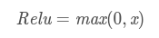
    - Relu函数及其导数的图像如下图所示：
    
    
    - ReLU函数其实就是一个取最大值函数，注意这并不是全区间可导的
    - 优点：
        - 1）解决了gradient vanishing问题 (在正区间)
        - 2）计算速度非常快，只需要判断输入是否大于0
        - 3）收敛速度远快于sigmoid和tanh
    - 缺点：
        - 1）ReLU的输出不是zero-centered
        - 2）Dead ReLU Problem，指的是某些神经元可能永远不会被激活，导致相应的参数永远不能被更新。有两个主要原因可能导致这种情况产生: 
            - (1) 非常不幸的参数初始化，这种情况比较少见 
            - (2) learning rate太高导致在训练过程中参数更新太大，不幸使网络进入这种状态。
            - 解决方法是可以采用Xavier初始化方法，以及避免将learning rate设置太大或使用adagrad等自动调节learning rate的算法。
 - Leaky ReLU函数（PReLU）
    - 函数表达式：
    
    
    - Leaky Relu函数及其导数的图像如下图所示：
    
    
    
    左半边直线斜率非常接近0，所以看起来像是平的。就不改了，α=0.01看起来就是这样的。
    - 为了解决Dead ReLU Problem，提出了将ReLU的前半段设为αx而非0，通常α=0.01
    - 理论上来讲，Leaky ReLU有ReLU的所有优点，外加不会有Dead ReLU问题，但是在实际操作当中，并没有完全证明Leaky ReLU总是好于ReLU
 - MaxOut函数
    - TODO

**如何选择合适的激活函数？**
 - 总体上来讲，训练深度学习网络尽量使用zero-centered数据 (可以经过数据预处理实现) 和zero-centered输出。所以要尽量选择输出具有zero-centered特点的激活函数以加快模型的收敛速度。
 - 如果使用ReLU，那么一定要小心设置learning rate，而且要注意不要让网络出现很多 “dead” 神经元，如果这个问题不好解决，那么可以试试Leaky ReLU、PReLU或者Maxout.
 - 最好不要用sigmoid，可以试试tanh，不过可以预期它的效果会比不上ReLU和Maxout.

**激活函数中的硬饱和，软饱和，左饱和和右饱和：**
 - 当我们的n趋近于正无穷，激活函数的导数趋近于0，那么我们称之为右饱和。
 - 当我们的n趋近于负无穷，激活函数的导数趋近于0，那么我们称之为左饱和。
 - 当一个函数既满足左饱和又满足右饱和的时候我们就称之为饱和，典型的函数有Sigmoid，Tanh函数。
 - 对于任意的x，如果存在常数c，当x>c时，恒有=0，则称其为右硬饱和。如果对于任意的x，如果存在常数c，当x<c时，恒有=0,则称其为左硬饱和。既满足左硬饱和又满足右硬饱和的我们称这种函数为硬饱和。
 - 对于任意的x，如果存在常数c，当x>c时，恒有趋近于0，则称其为右软饱和。如果对于任意的x，如果存在常数c，当x<c时，恒有趋近于0,则称其为左软饱和。既满足左软饱和又满足右软饱和的我们称这种函数为软饱和。


## 优化函数

参考博客：
 - [一个框架看懂优化算法](https://zhuanlan.zhihu.com/p/32230623)

**一般概念：**
 - 深度学习优化算法经历了`SGD -> SGDM -> NAG ->AdaGrad -> AdaDelta -> Adam -> Nadam`这样的发展历程。
 - 通用优化算法框架：
 
    
 
 - 步骤3、4对于各个算法都是一致的，主要的差别就体现在1和2上。

**SGD：**
 - SGD没有动量的概念
 
    
 - SGD最大的缺点是下降速度慢，而且可能会在沟壑的两边持续震荡，停留在一个局部最优点

**SGDM：**
 - 为了抑制SGD的震荡，SGDM认为梯度下降过程可以加入惯性。下坡的时候，如果发现是陡坡，那就利用惯性跑的快一些。
 - SGDM全称是SGD with momentum，在SGD基础上**引入了一阶动量**：
 
    
 - 也就是说，t时刻的下降方向，**不仅由当前点的梯度方向决定，而且由此前累积的下降方向决定**。
 - `Beta_1`的经验值为0.9，这就意味着下降方向主要是此前累积的下降方向，并略微偏向当前时刻的下降方向。
 - 想象高速公路上汽车转弯，在高速向前的同时略微偏向，急转弯可是要出事的。 

**NAG：**
 - SGD还有一个问题是困在局部最优的沟壑里面震荡。
 - NAG全称Nesterov Accelerated Gradient，是在SGD、SGD-M的基础上的进一步改进，改进点在于步骤1。
 - 我们知道在时刻t的主要下降方向是由累积动量决定的，自己的梯度方向说了也不算，那与其看当前梯度方向，不如先看看如果跟着累积动量走了一步，那个时候再怎么走。
 - 因此，NAG在步骤1，**不计算当前位置的梯度方向，而是计算如果按照累积动量走了一步，那个时候的下降方向**：
 
    
 - 然后用下一个点的梯度方向，与历史累积动量相结合，计算步骤2中当前时刻的累积动量。

**AdaGrad：**
 - 此前我们都没有用到二阶动量。二阶动量的出现，才意味着“自适应学习率”优化算法时代的到来。
 - SGD及其变种以同样的学习率更新每个参数，但深度神经网络往往包含大量的参数，这些参数并不是总会用得到（想想大规模的embedding）。
 - 对于经常更新的参数，我们已经积累了大量关于它的知识，不希望被单个样本影响太大，希望学习速率慢一些；（**对于经常更新的参数，希望学习速率慢一些**）
 - 对于偶尔更新的参数，我们了解的信息太少，希望能从每个偶然出现的样本身上多学一些，即学习速率大一些。（**对于偶尔更新的参数，希望学习速率大一些**）
 
    
 
 参数更新越频繁，二阶动量越大，学习率就越小。
 - 这一方法在稀疏数据场景下表现非常好。但也存在一些问题：因为`sqrt(V_t)`是单调递增的，会使得学习率单调递减至0，可能会使得训练过程提前结束，即便后续还有数据也无法学到必要的知识。

**AdaDelta/RMSProp：**
 - 由于AdaGrad单调递减的学习率变化过于激进
 - 我们考虑一个改变二阶动量计算方法的策略：**不累积全部历史梯度，而只关注过去一段时间窗口的下降梯度**。这也就是AdaDelta名称中Delta的来历。
 - 修改的思路很简单。前面我们讲到，**指数移动平均值大约就是过去一段时间的平均值**，因此我们用这一方法来计算二阶累积动量：
 
    
 - 这就避免了二阶动量持续累积、导致训练过程提前结束的问题了。

**Adam：**
 - Adam和Nadam的出现就很自然而然了——它们是前述方法的集大成者。
 - 我们看到：
    - SGD-M在SGD基础上增加了一阶动量
    - AdaGrad和AdaDelta在SGD基础上增加了二阶动量。
    - 把一阶动量和二阶动量都用起来，就是Adam了——`Adaptive + Momentum`。
 - 因此，
 
    
 - Adam的缺点：
    - 可能不收敛
    
        
        
        - 对于SGD和AdaGrad而言：
            - 其中，SGD没有用到二阶动量，因此学习率是恒定的（实际使用过程中会采用学习率衰减策略，因此学习率递减）。
            - AdaGrad的二阶动量不断累积，单调递增，因此学习率是单调递减的。
            - 因此，这两类算法会使得学习率不断递减，最终收敛到0，模型也得以收敛。
        - 对于AdaDelta和Adam而言：
            - 但AdaDelta和Adam则不然。
            - 二阶动量是固定时间窗口内的累积，随着时间窗口的变化，遇到的数据可能发生巨变，使得`V_t`可能会时大时小，不是单调变化。
            - 这就可能在训练后期引起学习率的震荡，导致模型无法收敛。
        - 一个修正的方法是：由于Adam中的学习率主要是由二阶动量控制的，为了保证算法的收敛，可以对二阶动量的变化进行控制，避免上下波动。
        
            
    - 可能错过全局最优解
        - 深度神经网络往往包含大量的参数，在这样一个维度极高的空间内，非凸的目标函数往往起起伏伏，拥有无数个高地和洼地。有的是高峰，通过引入动量可能很容易越过；但有些是高原，可能探索很多次都出不来，于是停止了训练。
        - 同样的一个优化问题，不同的优化算法可能会找到不同的答案，但自适应学习率的算法往往找到非常差的答案。
        - 自适应学习率算法可能会对前期出现的特征过拟合，后期才出现的特征很难纠正前期的拟合效果。
        - 有论文在CIFAR-10数据集上进行测试，发现Adam的收敛速度比SGD要快，但最终收敛的结果并没有SGD好。他们进一步实验发现，主要是后期Adam的学习率太低，影响了有效的收敛。他们试着对Adam的学习率的下界进行控制，发现效果好了很多。
        - 改进Adam的方法：前期用Adam，享受Adam快速收敛的优势；后期切换到SGD，慢慢寻找最优解。
        - 理解数据对于设计算法的必要性。优化算法的演变历史，都是基于对数据的某种假设而进行的优化，那么某种算法是否有效，就要看你的数据是否符合该算法的胃口了。

**Nadam：**
 - NAG中Nesterov的思想是：不计算当前位置的梯度方向，而是计算如果按照累积动量走了一步，那个时候的下降方向
 - 最后是Nadam。我们说Adam是集大成者，但它居然遗漏了Nesterov，这还能忍？必须给它加上，按照NAG的步骤1：
 
    
 
 这就是`Nesterov + Adam = Nadam`了。

**指数移动平均值的偏差修正：**
 - 前面我们讲到，一阶动量和二阶动量都是按照指数移动平均值进行计算的：
 
    

**总结：**
 - 各类优化算法只是相当于在SGD基础上增加了各类学习率的主动控制。如果不想做精细的调优，那么Adam显然最便于直接拿来上手。
 - **学习率衰减的作用：**
    - 对于经常更新的参数而言，在参数更新的时候不希望变化很大，所以学习率要设置的小一点
    - 对于不常更新的参数或者在模型刚开始训练时，学习率更改设置大一点，因为大的学习率使得模型能够接触更多不一样的信息进行梯度下降
 - 不同优化算法最核心的区别，就是第三步所执行的下降方向：
    
    
    
    - 这个式子中，前半部分是实际的学习率（也即下降步长），后半部分是实际的下降方向。
    - SGD算法的下降方向就是该位置的梯度方向的反方向，带一阶动量的SGD的下降方向则是该位置的一阶动量方向。
    - 自适应学习率类优化算法为每个参数设定了不同的学习率，在不同维度上设定不同步长，因此其下降方向是缩放过（scaled）的一阶动量方向。
    - 由于下降方向的不同，可能导致不同算法到达完全不同的局部最优点。
    - 不同算法在高原的时候，选择了不同的下降方向。
 - Adam+SGD组合策略
    - Adam等自适应学习率算法对于稀疏数据具有优势，且收敛速度很快；但精调参数的SGD（+Momentum）往往能够取得更好的最终结果。
    - 把这两者结合起来，先用Adam快速下降，再用SGD调优，涉及到两个问题：
        - 什么时候切换优化算法
        - 切换算法以后用什么样的学习率

**优化算法的常用tricks：**
 - **首先，各大算法孰优孰劣并无定论。如果是刚入门，优先考虑SGD+Nesterov Momentum或者Adam**.
 - **选择你熟悉的算法**——这样你可以更加熟练地利用你的经验进行调参。
 - **充分了解你的数据**——如果模型是非常稀疏的，那么优先考虑自适应学习率的算法。
 - **根据你的需求来选择**——在模型设计实验过程中，要快速验证新模型的效果，可以先用Adam进行快速实验优化；在模型上线或者结果发布前，可以用精调的SGD进行模型的极致优化。
 - **先用小数据集进行实验**。有论文研究指出，随机梯度下降算法的收敛速度和数据集的大小的关系不大。因此可以先用一个具有代表性的小数据集进行实验，测试一下最好的优化算法，并通过参数搜索来寻找最优的训练参数。
 - **考虑不同算法的组合**。先用Adam进行快速下降，而后再换到SGD进行充分的调优。切换策略可以参考本文介绍的方法。
 - **数据集一定要充分的打散（shuffle）**。这样在使用自适应学习率算法的时候，可以避免某些特征集中出现，而导致的有时学习过度、有时学习不足，使得下降方向出现偏差的问题。
 - 训练过程中**持续监控训练数据和验证数据**上的目标函数值以及精度或者AUC等指标的变化情况。对训练数据的监控是要保证模型进行了充分的训练——下降方向正确，且学习率足够高；对验证数据的监控是为了避免出现过拟合。
 - **制定一个合适的学习率衰减策略**。可以使用定期衰减策略，比如每过多少个epoch就衰减一次；或者利用精度或者AUC等性能指标来监控，当测试集上的指标不变或者下跌时，就降低学习率。


## 集成学习
**一般概念：**
 - 集成学习 (ensemble learning)，目的是为提高泛化性能
 - 集成学习通过构建并结合多个学习器来完成学习任务，也被称为多分类器系统
 - **Bagging和Boosting的基模型都是线性组成的**
 - 先产生一组个体学习器，再用某种策略将它们结合起来，分为同质（这组学习器都是同一类型模型）和异质架构
 
    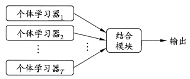
 - 假设基分类器的错误率相互独立，随着集成中个体学习器数目T的增大，集成的错误率将指数级下降，最终趋向于0
 - 上边假设显然不能相互独立，一般的准确性很高之后，要增加多样性就需要牺牲准确性，如何产生并结合好而不同的个体学习器，是集成学习的核心
 - 常见的集成学习框架有三种：Bagging，Boosting和Stacking。
    - （Bagging和随即森林，并行）个体学习器间不存在强依赖关系（模型之间的相互独立性很强），可同时生成的并行化方法
        - 每个基学习器都会对训练集进行有放回抽样得到子训练集，比较著名的采样法为0.632自助法。
        - 每个基学习器基于不同子训练集进行训练，并综合所有基学习器的预测值得到最终的预测结果。
        - Bagging常用的综合方法是投票法，票数最多的类别为预测类别。
    - （Boosting，串行）个体学习器间存在强依赖关系（因为各模型间共用一套训练集），必须采用串行生成的序列化方法
        - Boosting训练过程为阶梯状，基模型的训练是有顺序的。
        - 每个基模型都会在前一个基模型学习的基础上进行学习，最终综合所有基模型的预测值产生最终的预测结果。
        - 用的比较多的综合方式为加权法。
    - （Stacking）一个模型用来训练来得到预测结果，第二个模型将第一个模型的输出作为特征进行训练，得到最后结果
        - Stacking是先用全部数据训练好基模型，然后每个基模型都对每个训练样本进行的预测。
        - 其预测值将作为训练样本的特征值，最终会得到新的训练样本。
        - 然后基于新的训练样本进行训练得到模型，然后得到最终预测结果。
 - 为什么集成学习会好于单个学习器呢？原因可能有三：
    - 训练样本可能无法选择出最好的单个学习器，由于没法选择出最好的学习器，所以干脆结合起来一起用；
    - 假设能找到最好的学习器，但由于算法运算的限制无法找到最优解，只能找到次优解，采用集成学习可以弥补算法的不足；
    - 可能算法无法得到最优解，而集成学习能够得到近似解。比如说最优解是一条对角线，而单个决策树得到的结果只能是平行于坐标轴的，但是集成学习可以去拟合这条对角线。
 - 如何从偏差和方差的角度来理解集成学习？
    - 我们常说集成学习中的基模型是弱模型，通常来说弱模型是偏差高（在训练集上准确度低）方差小（防止过拟合能力强）的模型，**但并不是所有集成学习框架中的基模型都是弱模型。Bagging和Stacking中的基模型为强模型（偏差低，方差高），而Boosting中的基模型为弱模型（偏差高，方差低）**。
    
        
    - 以上可知：模型的准确度可由偏差和方差共同决定
    - 下边是各集成模型的偏差与方差：
        - Bagging的偏差与方差
        
            
            
        通过上式我们可以看到：
            - **整体模型的期望等于基模型的期望，这也就意味着整体模型的偏差和基模型的偏差近似（都是偏差小）。**
            - **整体模型的方差小于等于基模型的方差，当且仅当相关性为1时取等号（也就是说各个子模型间要尽量相互独立才能获取较好的效果），随着基模型数量增多，整体模型的方差减少，从而防止过拟合的能力增强，模型的准确度得到提高**。但是，模型的准确度一定会无限逼近于1吗？并不一定，当基模型数增加到一定程度时，方差公式第一项的改变对整体方差的作用很小，防止过拟合的能力达到极限，这便是准确度的极限了。
            - 在此我们知道了为什么Bagging中的基模型一定要为强模型，如果Bagging使用弱模型则会导致整体模型的偏差提高，而准确度降低。
            - **Random Forest是经典的基于Bagging框架的模型，并在此基础上通过引入特征采样和样本采样来降低基模型间的相关性**，在公式中显著降低方差公式中的第二项，略微升高第一项，从而使得整体降低模型整体方差。
        - Boosting的偏差与方差
            - 对于Boosting来说，**由于基模型共用同一套训练集，所以基模型间具有强相关性**，故模型间的相关系数近似等于1
            
                
            - 通过观察整体方差的表达式我们容易发现：
                - 整体模型的方差等于基模型的方差，如果基模型不是弱模型，其方差相对较大，这将导致整体模型的方差很大，即无法达到防止过拟合的效果。因此，Boosting框架中的基模型必须为弱模型。
                - 此外Boosting框架中采用基于贪心策略的前向加法，**整体模型的期望由基模型的期望累加而成，所以随着基模型数的增多，整体模型的期望值增加，整体模型的准确度提高**（期望是试验中每次可能结果的概率乘以其结果的总和，比如对于分类模型而言，正类为1,负类为0,最后得出的期望值越大，证明结果中为1也就是正类的越多，所以期望值越大准确率越高）。
                - 基于Boosting框架的Gradient Boosting Decision Tree（GBDT）模型中基模型也为树模型，同Random Forrest的思想一样，我们也**可以对特征进行随机抽样来使基模型间的相关性降低，从而达到减少方差的效果**。
        - 总结：
            - 我们可以使用模型的偏差和方差来近似描述模型的准确度；
            - 对于Bagging来说，整体模型的偏差与基模型近似，而随着模型的增加可以降低整体模型的方差，故其基模型需要为强模型（强模型的偏差小，方差大）；
            - 对于Boosting来说，整体模型的方差近似等于基模型的方差，而整体模型的偏差由基模型累加而成，故基模型需要为弱模型（弱模型的偏差大，方差小）。

**Boosting：**
 - Boosting是一族可将学习器提升为强学习器的算法
 - 工作机制是：
    - 先从初始训练集训练出一个基学习器，再根据基学习器的表现**对训练样本分布进行调整**，使得先前基学习器**做错的训练样本在后续受到更多关注**
    - 然后基于调整后的样本分布来训练下一个基学习器
    - 如此重复进行，直至基学习器数目达到事先指定的值T
    - 最终将这T个基学习器进行加权结合
 - 代表算法是AdaBoost：
    - AdaBoost（Adaptive Boosting，自适应增强），其自适应在于：
        - 前一个基本分类器分错的样本会得到加强，加权后的全体样本再次被用来训练下一个基本分类器。
        - 同时，在每一轮中加入一个新的弱分类器，直到达到某个预定的足够小的错误率或达到预先指定的最大迭代次数。
    - Adaboost迭代算法思想有三步：
        - 初始化训练样本的权值分布，每个样本具有相同权重；
        - 训练弱分类器，如果样本分类正确，则在构造下一个训练集中，它的权值就会被降低；反之提高。用更新过的样本集去训练下一个分类器；
        - 将所有弱分类组合成强分类器，各个弱分类器的训练过程结束后，加大分类误差率小的弱分类器的权重，降低分类误差率大的弱分类器的权重。
    - 损失函数：Adaboost模型是加法模型，学习算法为前向分步学习算法，损失函数为指数函数的分类问题。
    - 加法模型：最终的强分类器是由若干个弱分类器加权平均得到的。
    - 前向分布学习算法：算法是通过一轮轮的弱学习器学习，利用前一个弱学习器的结果来更新后一个弱学习器的训练集权重。
    - 正则化：
    
        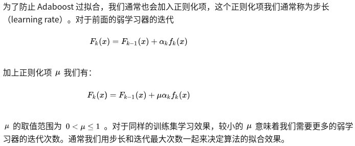
    - 优缺点：
        - 优点
            - 分类精度高；
            - 可以用各种回归分类模型来构建弱学习器，非常灵活；
            - 不容易发生过拟合。
        - 缺点
            - **对异常点敏感，异常点会获得较高权重**。
 - GBDT算法：
    - GBDT（Gradient Boosting Decision Tree）是一种迭代的决策树算法
    - 该算法由多棵决策树组成，它是属于Boosting策略。
    - GBDT是被公认的泛化能力较强的算法。
    - GBDT由三个概念组成：
        - 回归树（Regression Decision Tree，即 DT）
            - 回归树在分枝时会穷举每一个特征的每个阈值以找到最好的分割点，衡量标准是最小化均方误差。
            - 如果认为GBDT由很多分类树那就大错特错了（虽然调整后也可以分类）。
            - 对于分类树而言，其值加减无意义（如性别），而对于回归树而言，其值加减才是有意义的（如说年龄）。
            - **GBDT的核心在于累加所有树的结果作为最终结果，所以 GBDT 中的树都是回归树，不是分类树**，这一点相当重要。
        - 梯度迭代（Gradient Boosting，即 GB）
            - 上面说到GBDT的核心在于累加所有树的结果作为最终结果
            - **GBDT的每一棵树都是以之前树得到的残差来更新目标值**，这样每一棵树的值加起来即为GBDT的预测值。
            
                
            
            **也就是说要让每个基模型的预测值逼近各自要预测的部分真实值**。
            
            举个例子：
                - 比如说A用户的年龄20岁，第一棵树预测结果为12岁，那么残差就是8
                - 第二棵树用8为目标进行学习，假设其预测值为5，那么其残差即为3
                - 如此继续学习即可。
            
            假设只有两个子树，那么模型最后的预测结果为：12+5=17
            - 那么Gradient从何体现？
                - 其实很简单，其残差其实是最小均方损失函数（回归树的衡量标准是最小化均方误差）关于预测值的反向梯度(划重点)
                - 也就是说，预测值和实际值的残差与损失函数的负梯度相同（即梯度下降的方向）
            - 但要注意，基于残差 GBDT 容易对异常值敏感，举例：
            
                
            
            绝对损失或者Huber损失函数想比于平方损失函数，对异常点更具有鲁棒性
            - GBDT的Boosting不同于Adaboost的Boosting，**GBDT的每一步残差计算其实变相地增大了被分错样本的权重，而对于分对样本的权重趋于0，这样后面的树就能专注于那些被分错的样本**???TODO。
        - 缩减（Shringkage）（一个重要演变）
            - Shrinkage的思想认为，每走一小步逐渐逼近结果的效果要比每次迈一大步很快逼近结果的方式更容易避免过拟合。即它并不是完全信任每一棵残差树。
            
                
            - Shrinkage不直接用残差修复误差，而是只修复一点点，把大步切成小步。
            - 本质上Shrinkage为每棵树设置了一个weight，累加时要乘以这个weight，当weight降低时，基模型数会配合增大。
    - 优缺点：
        - 优点
            - 可以自动进行特征组合，拟合非线性数据；
            - 可以灵活处理各种类型的数据。
        - 缺点
            - **对异常点敏感**。
    - GBDT与Adaboost的对比：
        - 相同点：
            - 都是Boosting家族成员，使用弱分类器；
            - 都使用前向分布算法；
        - 不同点：
            - **迭代思路不同**：Adaboost是通过提升错分数据点的权重来弥补模型的不足（利用错分样本），而GBDT是通过算梯度来弥补模型的不足（利用残差）；
            - **损失函数不同**：AdaBoost采用的是指数损失，GBDT使用的是绝对损失或者Huber损失函数；
 - Boosting算法要求基学习器能对特定的数据分布进行学习
    - 这可通过**重赋权法**实施，即在训练过程的每一轮中，根据样本分布为每个训练样本重新赋予一个权重
    - 对无法接受带权样本的基学习算法，则可通过**重采样法**来处理，即在每一轮学习中，根据样本分布对训练集重新进行采样
    - 这两种做法没有明显的优劣差别
 - Boosting算法在训练的每一轮都要检查当前生成的基学习器是否满足基本条件（即是否比随机猜测好），一旦不满足条件，抛弃当前基学习器，且学习过程停止
 若采用重采样法则可获得重启动的机会以避免训练过程过早停止，即抛弃当前基学习器之后可**根据当前分布重新对训练样本进行采样**（因为采样的样本可能不同，所以会有不同的学习效果），再基于新的采样结果重新训练出基学习器，
 从而使得学习过程可以到预设的T轮完成。
 - Boosting主要**关注降低偏差**，因此能基于泛化性能相对弱的学习器构建出很强的集成

**Bagging与随机森林：**
 - 想得到泛化性能强的集成，集成中的个体学习器应尽量相互独立，虽然独立在现实任务中很难得到，但可设法使基学习器尽可能具有较大的差异。
 - 一种做法是对训练样本进行采样，产生出若干个不同的子集，再从每个数据子集中训练出一个基学习器，得到的基学习器具有比较大的差异
 - 为了得到好的集成，个体学习器不能太差，使用相互有交疊的采样子集，如果各个子集完全不同，则每个基学习器只用到了一小部分训练数据，甚至不足以进行有效学习
 - Bagging：
    - Bagging的基本流程：**对训练集进行自助采样**（有放回），可采样出T个含有m个训练样本的采样集，然后基于每个采样集训练出一个基学习器，再将这些基学习器进行结合
    - 基学习器的结合方法：
        - 通常对分类任务使用简单投票法
        - 对回归任务使用简单平均法
    - Bagging集成与直接使用基学习法训练一个学习器的复杂度同阶，是一个很高效的集成学习法
    - 与标准AdaBoost只适用于二分类任务不同（目前也有处理多分类和回归任务的变体），Bagging能不经修改地用于多分类、回归等任务
    - Bagging主要**关注降低方差**，
 - 随机森林：
    - RF算法由很多决策树组成，每一棵决策树之间没有关联（相互独立以降低模型总体方差）。建立完森林后，当有新样本进入时，每棵决策树都会分别进行判断，然后基于投票法给出分类结果。
    - 是Bagging的一个扩展变体，**在以决策树为基学习器构建Bagging集成的基础上，进一步在决策树的训练过程中引入了随机属性选择**，因此可以概括 RF 包括四个部分：
        - 随机选择样本（放回抽样）；
        - 随机选择特征；
        - 构建决策树；
        - 随机森林投票（平均）。
    - 随机选择样本和Bagging相同，采用的是Bootstrap自助采样法；随机选择特征是指在每个节点在分裂过程中都是随机选择特征的（区别与每棵树随机选择一批特征）。
    - 这种随机性导致随机森林的偏差会有稍微的增加（相比于单棵不随机树），但是由于随机森林的“平均”特性，会使得它的方差减小，而且方差的减小补偿了偏差的增大，因此总体而言是更好的模型。
    - 随机采样由于引入了两种采样方法保证了随机性，所以每棵树都是最大可能的进行生长就算不剪枝也不会出现过拟合。
    - 具体来说，传统决策树在选择划分属性时是在当前结点的属性集合（假设有d个属性）中选择一个最优属性，而在随机森林中，对基决策树的每个结点，先从该结点的属性集合中随机选择一个包含k个属性的子集，然后再从这个子集中选择一个最优属性用于划分。
    - 参数k控制了随机性的引入程度：
        - 若k=d，则基决策树的构建与传统决策树相同
        - 若k=1,则是随机选择一个属性用于划分
        - 推荐`k = log_{2}d`
    - 随机森林简单、容易实现、计算开销小（代表集成学习技术水平的方法）
    - 优点：
        - 在数据集上表现良好，相对于其他算法有较大的优势
        - 易于并行化，在大数据集上有很大的优势；
        - 能够处理高维度数据，不用做特征选择。
 - Bagging中基学习器的多样性仅通过样本扰动（对初始训练集采样）而来，随机森林中基学习器的多样性**不仅来自样本扰动，还来自属性扰动**，
 使得最终集成的泛化性能可通过个体学习器之间差异度的增加而进一步提升
 - 随机森林的收敛性和Bagging相似，随机森林的起始性能相对较差，然而随着个体学习器数目的增加，随机森林通常会收敛到更低的泛化误差，随机森林的训练效率常优于Bagging，因为在个体决策树的构建过程中，Bagging使用的是确定型决策树，在选择划分属性时要对结点的所有属性（特征）进行考察，而随机森林使用的随机型决策树只需考察一个属性子集
 - **Bagging模型要尽量较小子模型之间的关联度（相互独立型）以降低模型整体方差**

**结合策略：**
 - 学习器的结合带来以下好处：
    - 学习任务的假设空间很大，可能有多个假设在训练集上达到同等性能，此时若使用单学习器可能因误选导致泛化性能不佳，结合多个学习器可减少这一风险
    - 学习算法往往陷入局部极小，有的局部极小点所对应的泛化性能可能很糟糕，通过多次运行进行结合可降低陷入糟糕局部极小点的风险
    - 有些学习任务的真实假设可能不在当前学习算法所考虑的假设空间中，此时单学习器肯定无效，结合之后相应的假设空间有所扩大，可能学得更好的近似
 - 结合策略：
    - 平均法
        - 1.简单平均法
        - 2.加权平均法，给个体学习器赋予权重，例如估计处个体学习器的误差，然后令权重大小与误差大小成反比
        - 加权并不一定优于简单平均法，训练样本不充分或存在噪声，将使得学习出的权重不完全可靠，尤其对于规模较大的集成来说，要学习的权重较多，易产生过拟合，
        一般而言，在个体学习器性能相差较大时用加权平均，性能接近时用简单平均
    - 投票法
        - 1.绝对多数投票法，即若过半数，记为该标记，否则拒绝预测
        - 2.相对多数投票法，得票最多的标记
        - 3.加权投票法，与加权平均法类似
        - 分类估计处来的类概率一般都不太准确，基于类概率进行结合比直接基于类标记进行结合性能更好
    - 学习法
        - 当训练数据很多时，通过另一个学习器进行结合，代表是Stacking法
        - Stacking过程如下：
            - 先从初始数据集训练出初级学习器，然后生成一个新的数据集用于训练次级学习器
            - 在这个新数据集中，初级学习器的输出（初始学习器对没一个样本都会有一个输出/预测值，假设有T个初始学习器，那么每个样本就会有T个输出值，然后将这T个输出值作为次级学习器的输入特征，将该样本的原始label作为label，进行次级学习器的学习）被当做样例输入特征，而初始样本的标记仍被当做样例标记
            - 一般采用交叉验证或留一法的方式将训练初级学习器未使用的样本来产生（先用学成的初级学习器进行预测，得到输出值）次级学习器的训练样本，否则容易产生过拟合
        - 将初级学习器的输出类概率作为次级学习器的输入属性，用多响应线性回归作为次级学习算法效果较好

**多样性增强：**
 - 在学习过程中引入随机性，常见做法如下：
    - 数据样本扰动
        - （基于采样法）产生不同的数据子集，再利用不同的数据子集训练出不同的个体学习器
    - 输入属性扰动
        - 训练样本由一组属性描述，从不同子空间（属性子集）训练出的个体学习器必然有所不同
        - 该算法从初始属性集合中抽取出若干属性子集，再基于每个属性子集训练一个基学习器
        - 如果数据只包含少量属性，或者冗余属性很少，不宜采用输入属性扰动法
    - 输出表示扰动
        - 可对训练样本的类标记稍作变动，随机改变一些训练样本的标记
        - 也可对输出表示进行转化，将分类输出转化为回归输出后构建个体学习器
        - 还可将原任务拆解为多个可同时求解的子任务，如ECOC法，**将多分类任务拆解为一系列二分类任务来训练基学习器**
    - 算法参数扰动
        - 随机设置不同的参数，可产生差别较大的个体学习器
        - 单一学习器通常需要使用交叉验证等方法来确定参数值，而集成方法相当于把这些学习器都利用起来，其实开销不一定比使用单一学习器大很多
 - 不同的扰动机制可同时使用，例如随机森林中同时使用了数据样本扰动（有放回采样）和输入属性扰动

**XGBoost/LightGBM的区别：**
 - XGBoost是大规模并行boosting tree的工具，它是目前最快最好的开源boosting tree工具包，比常见的工具包快10倍以上。Xgboost和GBDT两者都是boosting方法，除了工程实现、解决问题上的一些差异外，**最大的不同就是目标函数的定义**。
 - XGBoost：
    - Xgboost的**基模型不仅支持决策树，还支持线性模型**，这里我们主要介绍基于决策树的目标函数。
    - 增量训练：每一步我们都是在前一步的基础上增加一棵树，而新增的这棵树是为修复上一颗树的不足。（即每一步的学习目标都是在学习上一步的残差）
    - 使用MSE（均方差）作为损失函数
 - LightGBM：
    - TODO

**xgboost相比传统gbdt有何不同？xgboost为什么快？xgboost如何支持并行？**
 - 传统GBDT以CART作为基分类器，xgboost还支持线性分类器，这个时候xgboost相当于带L1和L2正则化项的逻辑斯蒂回归（分类问题）或者线性回归（回归问题）。
 - 传统GBDT在优化时只用到一阶导数信息，xgboost则对代价函数进行了二阶泰勒展开，同时用到了一阶和二阶导数。顺便提一下，xgboost工具支持自定义代价函数，只要函数可一阶和二阶求导。
 - xgboost在代价函数里加入了正则项，用于控制模型的复杂度。正则项里包含了树的叶子节点个数、每个叶子节点上输出的score的L2模的平方和。从Bias-variance tradeoff角度来讲，正则项降低了模型的variance，使学习出来的模型更加简单，防止过拟合，这也是xgboost优于传统GBDT的一个特性。
 - Shrinkage（缩减），相当于学习速率（xgboost中的eta）。xgboost在进行完一次迭代后，会将叶子节点的权重乘上该系数，主要是为了削弱每棵树的影响，让后面有更大的学习空间。实际应用中，一般把eta设置得小一点，然后迭代次数设置得大一点。（补充：传统GBDT的实现也有学习速率）
 - 列抽样。xgboost借鉴了随机森林的做法，支持列抽样（即进行特征采样），不仅能降低过拟合，还能减少计算，这也是xgboost异于传统gbdt的一个特性。
 - 对缺失值的处理。对于特征的值有缺失的样本，xgboost可以自动学习出它的分裂方向。
 - xgboost工具支持并行。boosting不是一种串行的结构吗?怎么并行的？
    - 注意xgboost的并行不是tree粒度的并行，xgboost也是一次迭代完才能进行下一次迭代的（第t次迭代的代价函数里包含了前面t-1次迭代的预测值）。
    - xgboost的并行是在特征粒度上的。我们知道，决策树的学习最耗时的一个步骤就是对特征的值进行排序（因为要确定最佳分割点），xgboost在训练之前，预先对数据进行了排序，然后保存为block结构，后面的迭代中重复地使用这个结构，大大减小计算量。这个block结构也使得并行成为了可能，在进行节点的分裂时，
    需要计算每个特征的增益，最终选增益最大的那个特征去做分裂，那么各个特征的增益计算就可以开多线程进行。
 - 可并行的近似直方图算法。树节点在进行分裂时，我们需要计算每个特征的每个分割点对应的增益，即用贪心法枚举所有可能的分割点。当数据无法一次载入内存或者在分布式情况下，贪心算法效率就会变得很低，所以xgboost还提出了一种可并行的近似直方图算法，用于高效地生成候选的分割点。
 - xgboost代价函数里加入正则项，是否优于cart的剪枝：
 
    
 
    - 这个公式形式上跟ID3算法（采用entropy计算增益）、CART算法（采用gini指数计算增益）是一致的，都是用分裂后的某种值减去分裂前的某种值，从而得到增益。
    - 为了限制树的生长，我们可以加入阈值，当增益大于阈值时才让节点分裂，上式中的gamma即阈值，它是正则项里叶子节点数T的系数，所以xgboost在优化目标函数的同时相当于做了预剪枝。
    - 另外，上式中还有一个系数lambda，是正则项里leaf score的L2模平方的系数，对leaf score做了平滑，也起到了防止过拟合的作用，这个是传统GBDT里不具备的特性。


参考博客：
 - [Random Forest、Adaboost、GBDT（非常详细）](https://zhuanlan.zhihu.com/p/86263786)


## 数据不均衡问题

> 有实验表明，只要数据之间的比例超过了1:4，就会对算法造成偏差影响。

参考博客：
 - [过采样中用到的SMOTE算法](https://www.cnblogs.com/june0507/p/11726492.html)
 - [机器学习之类别不平衡问题](https://www.cnblogs.com/massquantity/p/8550875.html?spm=a2c4e.10696291.0.0.132619a4l9goR0)

#### 机器学习中数据不均衡问题
**解决方案：**
 - 思维导图：
 
    
 - **采样**：过抽样、欠抽样、组合抽样
    - 过采样/上采样：将样本较少的一类sample补齐
    - 欠抽样/下采样/负采样：将样本较多的一类sample压缩，一般很少使用欠采样，标注数据的成本比较高，而深度学习的方法是数据量越高越好，所以一般都是使用过采样。
    - 组合抽样：约定一个量级N，同时进行过抽样和欠抽样，使得正负样本量和等于约定量级N
    - 这种方法**要么丢失数据信息，要么会导致较少样本共线性**，存在明显缺陷
 - **权重调整**：
    - 常规的包括算法中的weight，weight matrix
    - 改变入参的权重比，比如boosting中的全量迭代方式、逻辑回归中的前置的权重设置
    - 这种方式的弊端在于无法控制合适的权重比，需要多次尝试
 - **核函数修正**：
    - 通过核函数的改变，来抵消样本不平衡带来的问题
    - 这种使用场景局限，前置的知识学习代价高，核函数调整代价高，黑盒优化
 - **模型修正**：
    - 通过现有的较少的样本类别的数据，用算法去探查数据之间的特征，判读数据是否满足一定的规律
    - 比如，通过线性拟合，发现少类样本成线性关系，可以新增线性拟合模型下的新点
    - 实际规律比较难发现，难度较高

**过采样常用算法：**
 - Smote算法：
    - 在少数类样本之间进行插值来产生额外的样本。
    - 它就是在少数类样本中用KNN方法合成了新样本，一般用来进行过采样的操作
    - SMOTE算法的思想是合成新的少数类样本，合成的策略是对每个少数类样本a，从它的最近邻中（从少数类中选取近邻点）随机选一个样本b，然后在a、b之间的连线上随机选一点作为新合成的少数类样本。如图所示：
    
    
    - 算法流程：
        - 1、对于少数类中每一个样本a，以欧氏距离为标准计算它到少数类样本集中所有样本的距离，得到其k近邻。
        - 2、根据样本不平衡比例设置一个采样比例以确定采样倍率N，对于每一个少数类样本a，从其k近邻中随机选择若干个样本，假设选择的近邻为b。
        - 3、对于每一个随机选出的近邻b，分别与原样本a按照如下的公式构建新的样本:`c=a+rand(0,1)∗|a−b|`
    - SMOTE存在的缺点：
        - SMOTE会随机选取少数类样本用以合成新样本，而不考虑周边样本的情况，这样容易带来两个问题：
            - 如果选取的少数类样本周围也都是少数类样本，则新合成的样本不会提供太多有用信息。这就像支持向量机中远离margin的点对决策边界影响不大。
            - 如果选取的少数类样本周围都是多数类样本，这类的样本可能是噪音，则新合成的样本会与周围的多数类样本产生大部分重叠，致使分类困难。
    - 总的来说我们**希望新合成的少数类样本能处于两个类别的边界附近，这样往往能提供足够的信息用以分类**。而这就是下面的 Border-line SMOTE 算法要做的事情。
 - Border-line SMOTE算法：
    - 这个算法会先将所有的少数类样本分成三类：
        - "noise" ： 所有的k近邻个样本都属于多数类
        - "danger" ： 超过一半的k近邻样本属于多数类
        - "safe"： 超过一半的k近邻样本属于少数类
    - Border-line SMOTE算法只会从处于”danger“状态的样本中随机选择，然后用SMOTE算法产生新的样本。处于”danger“状态的样本代表靠近”边界“附近的少数类样本，而**处于边界附近的样本往往更容易被误分类**。
    因而Border-line SMOTE只对那些靠近”边界“的少数类样本进行人工合成样本，而SMOTE则对所有少数类样本一视同仁。
    - Border-line SMOTE分为两种:
        - Borderline-1 SMOTE，在合成样本时用的`x^`是一个少数类样本
        - Borderline-2 SMOTE，中的`x^`则是k近邻中的任意一个样本。
 - ADASYN算法：
    - ADASYN名为自适应合成抽样(adaptive synthetic sampling)，其最大的特点是采用某种机制自动决定每个少数类样本需要产生多少合成样本，不像SMOTE那样对每个少数类样本合成一样数量的样本。
    - 具体流程如下：
        
        
    - 可以看到ADASYN利用分布`Γ`来自动决定每个少数类样本所需要合成的样本数量，这等于是**给每个少数类样本施加了一个权重，周围的多数类样本越多则权重越高**。
    - ADASYN的缺点是易受离群点的影响，如果一个少数类样本的K近邻都是多数类样本，则其权重会变得相当大，进而会在其周围生成较多的样本。
 - 过采样实例分析：
    - 下面利用sklearn中的make_classification构造了一个不平衡数据集，各类别比例为{0:54, 1:946}。
    - 原始数据，SMOTE，Borderline-1 SMOTE，Borderline-2 SMOTE和ADASYN的比较见下图
    - 左侧为过采样后的决策边界，右侧为过采样后的样本分布情况，可以看到**过采样后原来少数类的决策边界都扩大了，导致更多的多数类样本被划为少数类了**
 
        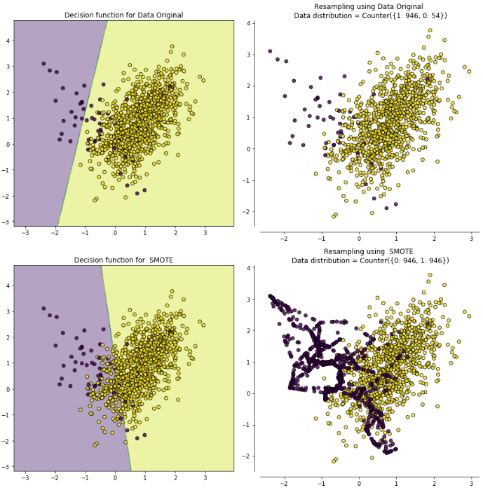
        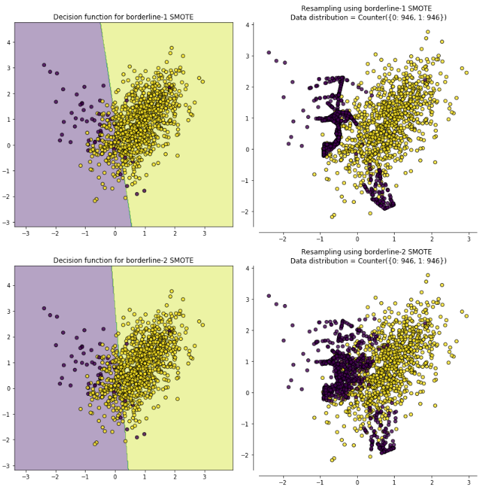
        
    - 用`SMOTE`合成的样本分布比较平均，而`Border-line SMOTE`合成的样本则集中在类别边界处。`ADASYN`的特性是一个少数类样本周围多数类样本越多，则算法会为其生成越多的样本，从图中也可以看到生成的样本大都来自于原来与多数类比较靠近的那些少数类样本。 

**欠采样常用算法：**
 - 随机欠采样：
    - 随机欠采样的思想同样比较简单，就是从多数类样本中随机选取一些剔除掉。
    - 缺点是被剔除的样本可能包含着一些重要信息，致使学习出来的模型效果不好。
 - EasyEnsemble和BalanceCascade：
    - EasyEnsemble和BalanceCascade**采用集成学习机制来处理传统随机欠采样中的信息丢失问题**
    - EasyEnsemble算法：
        - 将多数类样本**随机划分成n个子集**，每个子集的数量等于少数类样本的数量，这相当于欠采样。
        - 接着将每个子集与少数类样本结合起来分别训练一个模型，最后将n个模型集成
        - 这样虽然每个子集的样本少于总体样本，但**集成后总信息量并不减少**。
    - BalanceCascade算法：
        - 如果说EasyEnsemble是基于无监督的方式从多数类样本中生成子集进行欠采样，那么BalanceCascade则是采用了**有监督结合Boosting的方式**
        - 具体算法如下：
            - 在第n轮训练中，将**从多数类样本中抽样得来的子集与少数类样本结合起来训练一个基学习器H**
            - **训练完后多数类中能被H正确分类的样本会被剔除**。
            - 在接下来的第n+1轮中，**从被剔除后的多数类样本中产生子集用于与少数类样本结合起来训练**
            - 最后将不同的基学习器**集成起来**。
        - BalanceCascade的有监督表现在每一轮的基学习器起到了在多数类中选择样本的作用，而其Boosting特点则体现在每一轮丢弃被正确分类的样本，进而后续基学习器会更注重那些之前分类错误的样本。
 - NearMiss
    - NearMiss本质上是一种原型选择(prototype selection)方法，即从多数类样本中选取最具代表性的样本用于训练，主要是为了缓解随机欠采样中的信息丢失问题。
    - NearMiss采用一些启发式的规则来选择样本，根据规则的不同可分为3类：
        - NearMiss-1：选择到最近的K个少数类样本平均距离最近的多数类样本
        - NearMiss-2：选择到最远的K个少数类样本平均距离最近的多数类样本
        - NearMiss-3：对于每个少数类样本选择K个最近的多数类样本，目的是保证每个少数类样本都被多数类样本包围
    - NearMiss-1和NearMiss-2的计算开销很大，因为需要计算每个多类别样本的K近邻点。
    - 另外，NearMiss-1易受离群点的影响，如下面第二幅图中合理的情况是处于边界附近的多数类样本会被选中，然而由于右下方一些少数类离群点的存在，其附近的多数类样本就被选择了。相比之下NearMiss-2和NearMiss-3不易产生这方面的问题。

        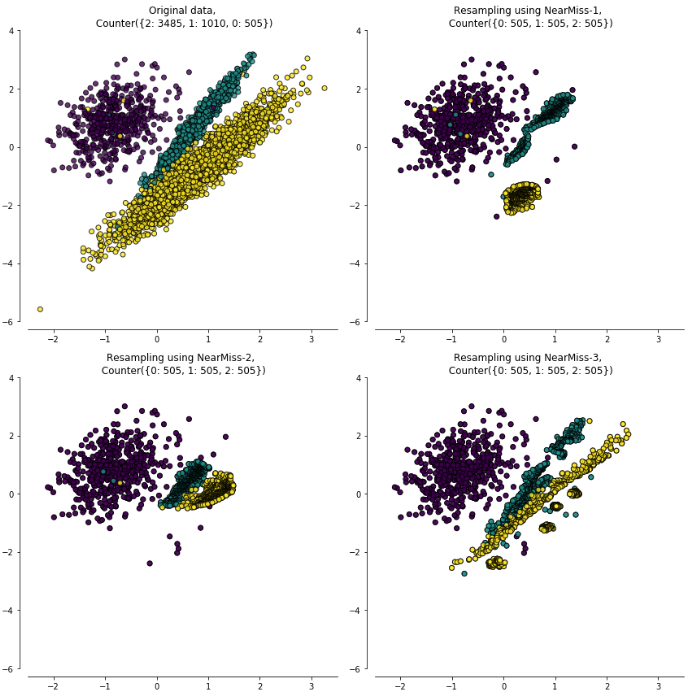
 - 数据清洗方法(data cleaning tichniques)
    - 这类方法主要通过某种规则来**清洗重叠的数据，从而达到欠采样的目的**，而这些规则往往也是启发性的，下面进行简要阐述：
        - Tomek Link：
            - Tomek Link表示不同类别之间距离最近的一对样本，即这两个样本互为最近邻且分属不同类别。
            - 这样如果两个样本形成了一个Tomek Link，则要么其中一个是噪音，要么两个样本都在边界附近。
            - 这样通过移除Tomek Link就能“清洗掉”类间重叠样本，使得互为最近邻的样本皆属于同一类别，从而能更好地进行分类。
            
            
            
            下图左上为原始数据，右上为SMOTE后的数据，左下虚线标识出Tomek Link，右下为移除Tomek Link后的数据集，可以看到不同类别之间样本重叠减少了很多。
        - Edited Nearest Neighbours(ENN)：
            - 对于属于多数类的一个样本，如果其K个近邻点有超过一半都不属于多数类，则这个样本会被剔除。
            - 这个方法的另一个变种是所有的K个近邻点都不属于多数类，则这个样本会被剔除。
    - 最后，数据清洗技术最大的**缺点是无法控制欠采样的数量**。由于都在某种程度上采用了K近邻法，而事实上大部分多数类样本周围也都是多数类，因而**能剔除的多数类样本比较有限**。

**过采样和欠采样结合的常用算法：**
 - 上文中提到**SMOTE算法的缺点是生成的少数类样本容易与周围的多数类样本产生重叠难以分类，而数据清洗技术恰好可以处理掉重叠样本**
 - 所以可以将二者结合起来形成一个pipeline，先过采样再进行数据清洗。
 - 主要的方法是`SMOTE + ENN`和`SMOTE + Tomek`，其中`SMOTE + ENN`通常能清除更多的重叠样本，如下图：
 
    
    
 - 更多方法，参考sklearn的[imbalanced-learn](https://github.com/scikit-learn-contrib/imbalanced-learn)

**采样方法的效果：**
 - 使用数据集：
    - 第一个数据集为us_crime，多数类样本和少数类样本的比例为12:1
    - 第二个数据集是abalone，多数类样本和少数类样本的比例为130:1，非常悬殊
 - [查看](https://www.cnblogs.com/massquantity/p/9382710.html)实验细节和代码
 - 结论：
    - 就时间开销而言，BalanceCascade以及两种过采样欠采样结合的方法(SMOTE + ENN和SMOTE + Tomek)耗时最高。
    - 第一个数据集比例为12:1，相差不是很悬殊，综合ROC曲线和PR曲线的AUC来看，两种集成（都是欠采样）方法EasyEnsemble和BalanceCascade表现较好。
    - 第二个数据集比例为130:1，而且少数类样本非常少，因而从结果来看几种过采样方法如Borderline SMOTE， SMOTE+Tomek等效果较好。
    - 可见**在类别差异很大的情况下，过采样能一定程度上弥补少数类样本的极端不足**。
    - 然而从PR曲线上来看，其实结果都不尽如人意，**对于这种极端不平衡的数据可能比较适合异常检测的方法**
    - **ROC曲线通常会呈现一个过分乐观的效果估计**，第一个数据集中大部分ROC曲线的AUC都在0.9左右，而PR曲线都在0.5左右。第二个数据集则更夸张，从PR曲线来看其实模型对于少数类的预测准确率是无限接近于0了，但在ROC曲线上却很难看出这一点。
    - 从classification report看出：
        - Base Model的特点是precision高，recall低，而几种采样方法则相反，precision低，recall高。
        - **采样方法普遍扩大了少数类样本的决策边界**（从上文中的决策边界图就能看出来），所以把很多多数类样本也划为少数类了，导致precision下降而recall提升。
        - 当然这些都是分类阈值为0.5的前提下得出的结论，如果进一步调整阈值的话能得到更好的模型。
        - **策略是base model的阈值往下调（因为recall偏低，表示在所有正类中被正确分类的比较少，所以下调阈值），采样方法的阈值往上调（因为扩大了决策边界之后，很容易将多数类样本划分为少数类样本，所以要上调分类阈值）**。
        - 在经过阈值调整后，各方法的整体F1分数都有提高，可见很多单指标如precision，recall等都会受到不同阈值的影响。
        - 所以这也是为什么**在类别不平衡问题中用ROC和PR曲线来评估非常流行，因为它们不受特定阈值变化的影响，反映的是模型的整体预测能力**。
    - 就这两个数据集的结果来看，如果本身数据偏斜不是很厉害，那么采样方法的提升效果很细微。如果本身数据偏斜很厉害，采样方法纵使比base model好很多，但由于base model本身的少数类预测能力很差，所以本质上也不尽如人意。这就像考试原来一直靠10分，采样了之后考了30分，绝对意义上提升很大，但其实还是差得远了。

**各种评估指标：**
 - 由于类别不平衡问题的特性使然，一般常使用于评估分类器性能的**准确率和错误率可能就不再适用了**。因为在类别不平衡问题中我们主要关心数目少的那一类能否被正确分类，而如果分类器将所有样例都划分为数目多的那一类，就能轻松达到很高的准确率，但实际上该分类器并没有任何效果。
 - ROC曲线：
    - ROC曲线和PR（Precision-Recall）曲线皆为类别不平衡问题中常用的评估方法
    - Recall (TPR，真正例率)衡量的是所有的正例中有多少是被正确分类了，假正例率 (FPR)为有多少负例被错判成了正例
    - ROC曲线常用于二分类问题中的**模型比较**，主要表现为一种真正例率(TPR)(y轴)和假正例率(FPR)(x轴)的权衡。
    
        
    - 具体方法是在不同的分类阈值设定下分别以TPR和FPR为纵、横轴作图。由ROC曲线的两个指标：
    
        
    - 当一个样本被分类器判为正例，若其本身是正例，则TPR增加；若其本身是负例，则FPR增加，因此ROC曲线可以看作是随着阈值的不断移动，所有样本中正例与负例之间的“对抗”。曲线越靠近左上角，意味着越多的正例优先于负例，模型的整体表现也就越好。
    - 说的再直白一点就是：
        - TPR是y轴，表示所有的正例中有多少是被正确分类了
        - FPR是x轴，表示有多少负例被错判成了正例
        - 曲线越靠近左上角表示：TPR比FPR增加的快，说明样本被正确分类的较多，负例被叛定为正例的少，结果就越好
 - AUC曲线：
    - 先看一下ROC曲线中的随机线，图中`[0,0]`到`[1,1]`的虚线即为随机线，该线上所有的点都表示该阈值下TPR=FPR
    
        
    
        - 根据定义，`TPR=TP/P`，表示所有正例中被预测为正例的概率；`FPR=FP/N`，表示所有负例中被被预测为正例的概率。
        - 若二者相等，意味着无论一个样本本身是正例还是负例，分类器预测其为正例的概率是一样的，这等同于随机猜测（注意这里的“随机”不是像抛硬币那样50%正面50%反面的那种随机）。
        - 上图中B点就是一个随机点，无论是样本数量和类别如何变化，始终将75%的样本分为正例。
    - **ROC曲线围成的面积(即AUC)**可以解读为：
        - 从所有正例中随机选取一个样本A，再从所有负例中随机选取一个样本B
        - 分类器将A判为正例的概率比将B判为正例的概率大的可能性。
        - 可以看到位于随机线上方的点(如图中的A点)被认为好于随机猜测。
        - **在这样的点上TPR总大于FPR，意为正例被判为正例的概率大于负例被判为正例的概率**。
    - 从另一个角度看，由于**画ROC曲线时都是先将所有样本按分类器的预测概率排序**，所以**AUC反映的是分类器对样本的排序能力**，依照上面的例子就是A排在B前面的概率。
    - **AUC越大，自然排序能力越好，即分类器将越多的正例排在负例之前**。
    - **ROC曲线的绘制方法**：
        - 假设有P个正例，N个反例，首先拿到分类器对于每个样本预测为正例的概率，根据概率对所有样本进行逆序排列
        - 然后将分类阈值设为最大，即把所有样本均预测为反例，此时图上的点为`(0,0)`。
        - 然后将分类阈值依次设为每个样本的预测概率，即依次将每个样本划分为正例
            - 如果该样本为真正例，则`TP+1`，即`TPR+1/P`;
            - 如果该样本为负例，则`FP+1`，即`FPR+1/N`。
        - 最后的到所有样本点的TPR和FPR值，用线段相连。
 - ROC曲线的优点：
    - **兼顾正例和负例的权衡**。因为TPR聚焦于正例，FPR聚焦于负例，使其成为一个比较均衡的评估方法。
    - ROC曲线选用的两个指标，TPR和FPR，都不依赖于具体的类别分布。
    - **注意TPR用到的TP和FN同属P列，FPR用到的FP和TN同属N列，所以即使P或N的整体数量发生了改变，也不会影响到另一列。也就是说，即使正例与负例的比例发生了很大变化，ROC曲线也不会产生大的变化，而像Precision使用的TP和FP就分属两列，则易受类别分布改变的影响**。
    - 有参考文献中举了个例子，负例增加了10倍，ROC曲线没有改变，而PR曲线则变了很多。作者认为这是ROC曲线的优点，即**具有鲁棒性，在类别分布发生明显改变的情况下依然能客观地识别出较好的分类器**。
 - ROC曲线的缺点：
    - 上文提到ROC曲线的优点是不会随着类别分布的改变而改变，但这在某种程度上也是其缺点。**因为负例N增加了很多，而曲线却没变，这等于产生了大量FP**。像信息检索中如果主要关心正例的预测准确性的话，这就不可接受了。
    - **在类别不平衡的背景下，负例的数目众多致使FPR的增长不明显，导致ROC曲线呈现一个过分乐观的效果估计**。ROC曲线的横轴采用FPR，根据`FPR = FP/N = FP/(FP+TN)`，当负例N的数量远超正例P时，FP的大幅增长只能换来FPR的微小改变。结果是**虽然大量负例被错判成正例，在ROC曲线上却无法直观地看出来**。（**当然也可以只分析ROC曲线左边一小段**）
        
        ```
        举个例子，假设一个数据集有正例20，负例10000，开始时有20个负例被错判，
        FPR=20/(20+9980)=0.002，
        
        接着又有20个负例错判，
        FPR2=40/(40+9960)=0.004，
        
        在ROC曲线上这个变化是很细微的。
        
        而与此同时Precision则从原来的0.5下降到了0.33，在PR曲线上将会是一个大幅下降。
        ```
 - PR(Precision Recall)曲线：
    - **PR曲线与ROC曲线的相同点是都采用了TPR (Recall)，都可以用AUC来衡量分类器的效果。不同点是ROC曲线使用了FPR，而PR曲线使用了Precision，因此PR曲线的两个指标都聚焦于正例。类别不平衡问题中由于主要关心正例，所以在此情况下PR曲线被广泛认为优于ROC曲线**。
    
        
    
        - 可以看到上文中ROC曲线下的AUC面积在0.8左右，而PR曲线下的AUC面积在0.68左右
        - **类别不平衡问题中ROC曲线确实会作出一个比较乐观的估计，而PR曲线则因为Precision的存在会不断显现FP的影响**。
 - 使用场景：
    - ROC曲线由于兼顾正例与负例，所以适用于评估分类器的整体性能，相比而言PR曲线完全聚焦于正例。
    - 如果有多份数据且存在不同的类别分布，比如信用卡欺诈问题中每个月正例和负例的比例可能都不相同，这时候如果只想**单纯地比较分类器的性能且剔除类别分布改变的影响，则ROC曲线比较适合**，因为类别分布改变可能使得PR曲线发生变化时好时坏，这种时候难以进行模型比较；反之，如果想测试**不同类别分布下对分类器的性能的影响，则PR曲线比较适合**。
    - 如果想要评估在相同的类别分布下正例的预测情况，则宜选PR曲线。
    - 类别不平衡问题中，ROC曲线通常会给出一个乐观的效果估计，所以大部分时候还是PR曲线更好。
    - 最后可以根据具体的应用，在曲线上找到最优的点，得到相对应的precision，recall，f1 score等指标，去调整模型的阈值，从而得到一个符合具体应用的模型。

**代码实现：**
 - imblearn类别不平衡包提供了上采样和下采样策略中的多种接口，基本调用方式一致
 - 具体实现如下：
    - 查看数据分布：
    
    ```
    from collections import Counter
    # 查看所生成的样本类别分布，0和1样本比例9比1，属于类别不平衡数据
    print(Counter(y))
    # Counter({0: 900, 1: 100})
    ```
    - SMOTE算法核心语句：
    
    ```
    # 使用imlbearn库中上采样方法中的SMOTE接口
    from imblearn.over_sampling import SMOTE
    # 定义SMOTE模型，random_state相当于随机数种子的作用
    smo = SMOTE(random_state=42)
    X_smo, y_smo = smo.fit_sample(X, y)
    ```
    - 查看经过SMOTE之后的数据分布：
    
    ```
    print(Counter(y_smo))
    # Counter({0: 900, 1: 900})
    ```
    - 从上述代码中可以看出，SMOTE模型默认生成一比一的数据，如果想生成其他比例的数据，可以使用radio参数。不仅可以处理二分类问题，同样适用于多分类问题
    
    ```
    # 可通过radio参数指定对应类别要生成的数据的数量
    smo = SMOTE(ratio={1: 300 },random_state=42)
    # 生成0和1比例为3比1的数据样本
    X_smo, y_smo = smo.fit_sample(X, y)
    print(Counter(y_smo))
    # Counter({0: 900, 1: 300})
    ```
    - imblearn中上采样接口提供了随机上采样RandomOverSampler，SMOTE，ADASYN三种方式，调用方式和主要参数基本一样。下采样接口中也提供了多种方法，以RandomUnderSampler为例。
    
    ```
    from imblearn.under_sampling import RandomUnderSampler
    # 同理，也可使用ratio来指定下采样的比例
    rus = RandomUnderSampler(ratio={0: 500 }, random_state=0)
    X_rus, y_rus = rus.fit_sample(X, y)
    print(Counter(y_smo))
    # Counter({0: 500, 1: 300})
    ```


#### NLP中数据不均衡问题

参考文献：
 - [NLP任务样本数据不均衡问题解决方案](https://blog.csdn.net/HUSTHY/article/details/103887957)

**一般概念：**
 - 不适合采用Smote算法，理由如下：
    - NLP任务中，不好使用Smote算法，我们的样本一般都是文本数据，不是直接的数字数据，只有把文本数据转化为数字数据才能进行smote操作。
    - 另外现在一般都是基于预训练模型做微调的，文本的向量表示也是变化的，所有不能进行smote算法来增加小类数据。

**常用方法：**
 - 数据层面：
    - 最简单的就是**直接复制小类样本**，从而达到增加小类样本数据的目的。
        - 这样的方法缺点也是很明显的，实际上样本中并没有加入新的特征，特征还是很少，那么就会出现过拟合的问题。
    - 对小类样本数据经过一定的处理，做一些小的改变。例如：
        - （shuffle）随机的打乱词的顺序，句子的顺序
        - （drop）随机的删除一些词，一些句子
        - （裁剪）裁剪文本的开头或者结尾等
        
        ```
        这些方法只合适对语序不是特别重要的任务，像一些对语序特征特别重要的序列任务这种操做就不太恰当
        ```
    - 复述生成：这个属性seq2seq任务，根据原始问题生成格式更好的问题，然后把新问题替换到问答系统中。
    - EDA：同义词替换、随机插入、随机交换、随机删除
    - 回译
    - 生成对抗网络GAN（对抗样本生成）
 - 模型层面：
    - 权重设置：在训练的时候给损失函数loss直接设定一定的比例（即对不同类别，在损失函数中设置一定的权重），使得算法能够对小类数据更多的注意力
    - 新的损失函数（[Focal Loss](https://github.com/yatengLG/Focal-Loss-Pytorch/blob/master/Focal_Loss.py)）：
        - 该损失函数专门用来解决多分类或者二分类中样本不均衡的问题
        - 该损失函数是在标准交叉熵损失基础上修改得到的
        - 该损失函数可以通过减少易分类样本的权重，使得模型在训练时更专注于难分类的样本
        - 该损失函数旨在通过降低内部加权（简单样本）来解决类别不平衡问题，这样即使简单样本的数量很大，但它们对总损失的贡献却很小
 - 评价方式层面：
    - 在模型评价的时候，一般简单的采用accuracy。但是在样本数据极度不平衡，特别是那种重点关注小类识别准确率的时候，就不能使用accuracy来评价模型了
    - 要使用precision和recall来综合考虑模型的性能，降低小类分错的几率

**总结：**
 - **使用复述生成和回译以及生成对抗网络应该是最有效的**，因为它们在做数据增强的时候，对原始数据做的处理使得语义发生了变化，但同时又保证了整个语义的完整性。
 - 随机删除的词，打乱顺序的方式，对数据的整个语义破坏太大，具体需要实验


## NLP中文本语料扩增方法
**文本语料扩增**
 - 随机删除一些token(字，词，word-piece等);
 - 随机将一些token替换成未登录标记（`<UNK>`）
 - 随机使用词表中的token替代掉其他的token；
 - 随机交换token的顺序；(no further than three positions apart)
 - 随机截断序列（sequence），分为从前截断和从后截断；
 - 随机删除连续的token。

**数据增强方法**

> 论文： [EDA for Chinese](https://github.com/zhanlaoban/eda_nlp_for_Chinese), [EDA](https://arxiv.org/abs/1901.11196)

 - 随机drop和shuffle
    - 一种是drop,对于标题和描述中的字或词,随机的进行删除,用空格代替。
    - 另一种是shuffle,即打乱词序。
    - 数据增强对于提升训练数据量,抑制模型过拟合等十分有效
 - 简单数据增强(Easy Data Augmentation，EDA)
    - 同义词替换
        - 从句子中随机选取n个不属于停用词集的单词，并随机选择其同义词替换它们
        - 这种方式作用不太大，因为同义词具有非常相似的词向量，因此模型会将这两个句子当作相同的句子，而在实际上并没有对数据集进行扩充
    - 随机插入：随机的找出句中某个不属于停用词集的词，并求出其随机的同义词，将该同义词插入句子的一个随机位置。重复n次；
    - 随机交换：随机的选择句中两个单词并交换它们的位置。重复n次；
    - 随机删除：以p的概率，随机的移除句中的每个单词。
    
        ```
        长句子相对于短句子，存在一个特性：长句比短句有更多的单词，因此长句在保持原有的类别标签的情况下，能吸收更多的噪声。
        为了充分利用这个特性，基于句子长度来变化改变的单词数，换句话说，就是不同的句长，因增强而改变的单词数可能不同。
        ```
 - 回译
    - 用机器翻译把一段中文翻译成另一种语言，然后再翻译回中文。
    - 回译的方法不仅有类似同义词替换的能力，它还具有在保持原意的前提下增加或移除单词并重新组织句子的能力。
    - 这个方法已经成功的被用在Kaggle恶意评论分类竞赛中。反向翻译是NLP在机器翻译中经常使用的一个数据增强的方法。其本质就是快速产生一些不那么准确的翻译结果达到增加数据的目的。
 - 基于上下文的数据增强方法
    - TODO， refer to Contextual Augmentation: Data Augmentation by Words with Paradigmatic Relations
 - 文档裁剪
    - 新闻文章通常很长，在查看数据时，对于分类来说并不需要整篇文章。文章的主要想法通常会重复出现。将文章裁剪为几个子文章来实现数据增强，这样将获得更多的数据。
 - 生成对抗网络
    - GAN是深度学习领域中最令人兴奋的最新进展之一，它们通常用来生成新的图像，但它的一些方法或许也可以适用于文本数据。
 - 预训练的语言模型
    - 最近很多论文运用大量语料库预训练语言模型来处理自然语言任务得到了惊人的结果，语言模型是通过前面的单词预测句子中会出现的下一个单词。
    - 比如，**在fine-tuning SQuAD之前，先在TriviaQA上fine-tuning，以进行适当的数据增强**
 - 数据增强的作用
    - 增加训练的数据量，提高模型的泛化能力。
    - 增加噪声数据，提升模型的鲁棒性。

**文本语料增加噪声**
 - TODO


## 范数

参考博客：
 - [如何通俗易懂地解释「范数」？](https://www.zhihu.com/search?type=content&q=%E8%8C%83%E6%95%B0)

**一般概念：**
 - 范数的本质是距离，存在的意义是为了实现比较。
 - 范数它其实是一个函数，它把不能比较的向量转换成可以比较的实数。
    
    ```
    例子：
    
    在一维实数集合中，我们随便取两个点4和9，我们知道9比4大，但是到了二维实数空间中，取两个点（1，1）和（0，3），
    这个时候我们就没办法比较它们之间的大小，因为它们不是可以比较的实数，于是我们引入范数这个概念，把我们的
    （1，1）和（0，3）通过范数分别映射到实数sqrt(2)和3 ，这样我们就比较这两个点了。
    ```

**常见范数：**
 - 范数的定义：
 
    
    
    
 - l1-范数会让你的模型变傻一点，相比于记住事物本身，此时机器人更倾向于**从数据中找到一些简单的模式**
 
    
 
    - 使用l1-范数作为正则项，向量x会变得稀疏，非零元素就是有用的特征了。
    - 在稀疏的结果中，我们能够保证向量x的每个元素都是有用的！
    - 相当于从数据中找到了一些简单特征，这种稀疏可以避免过拟合。


## 线性回归
**一般概念：**
 - 有时分类问题也可以转化为回归问题，通过给定一个阈值来做分类
 - 这种分类型问题的回归算法预测，最常用的就是逻辑回归（即用回归方法做分类）

**线性回归：**
 - 一元线性回归
    - 画在坐标图内是一条直线（这就是“线性”的含义）
    - 用一个x来预测y，就是一元线性回归，也就是在找一个直线来拟合数据
    - 线性回归就是要找一条直线，并且让这条直线尽可能地拟合图中的数据点
 - 例子：
    
    
    
    损失函数是衡量回归模型误差的函数，也就是我们要的“直线”的评价标准。这个函数的值越小，说明直线越能拟合我们的数据
 - 普通最小二乘法给出的判断标准是：残差平方和的值达到最小
 
    
 - 线性回归的定义，是利用最小二乘函数对一个或多个自变量之间关系进行建模的方法。
 - 做线性回归，不要忘了**前提假设是y和x呈线性关系**，如果两者不是线性关系，就要选用其他的模型啦。
 
    


## Batch Norm/Layer Norm/Weight Norm/Cosine Norm

参考文献：
 - [详解深度学习中的Normalization，BN/LN/WN](https://www.zhihu.com/search?type=content&q=batch%20Normalization)

**一般概念：**
 - 为什么需要Normalization：
    - 独立同分布与白化
        - 在把数据喂给机器学习模型之前，“白化（whitening）”是一个重要的数据预处理步骤。白化一般包含两个目的：
            - （1）去除特征之间的相关性 —> 独立；
            - （2）使得所有特征具有相同的均值和方差 —> 同分布。
            - 白化最典型的方法就是PCA
        - 独立同分布：
            - 独立同分布并非所有机器学习模型的必然要求
            - 比如Naive Bayes模型就建立在特征彼此独立的基础之上，而Logistic Regression和神经网络则在非独立的特征数据上依然可以训练出很好的模型
            - 独立同分布的数据可以简化常规机器学习模型的训练、提升机器学习模型的预测能力
    - 深度学习中的Internal Covariate Shift（ICS，内部协变量位移）
        - 深度神经网络模型的训练为什么会很困难？其中一个重要的原因是，深度神经网络涉及到很多层的叠加，而每一层的参数更新会导致上层的输入数据分布发生变化，通过层层叠加，
        **高层的输入分布变化会非常剧烈**，这就使得高层需要不断去重新适应底层的参数更新。
        - ICS是分布不一致假设之下的一个分支问题，它是指源空间和目标空间的条件概率是一致的，但是其边缘概率不同
        - ICS会导致什么问题？
            - 简而言之，每个神经元的输入数据不再是“独立同分布”。
            - 其一，上层参数需要不断适应新的输入数据分布，降低学习速度。
            - 其二，下层输入的变化可能趋向于变大或者变小，导致上层落入饱和区，使得学习过早停止。
            - 其三，每层的更新都会影响到其它层，因此每层的参数更新策略需要尽可能的谨慎
 - Normalization的通用框架与基本思想
    - 神经网络接收输入x，输出一个标量值，由于ICS问题的存在，x的分布可能相差很大。要解决独立同分布的问题，**“理论正确”的方法就是对每一层的数据都进行白化操作**。然而标准的白化操作代价高昂，特别是我们还希望白化操作是可微的，保证白化操作可以通过反向传播来更新梯度。
    - 因此，以BatchNorm为代表的Normalization方法退而求其次，进行了简化的白化操作。
    - 基本思想是：**在将x送给神经元之前，先对其做平移和伸缩变换，将x的分布规范化成在固定区间范围的标准分布**。
    - 通用变换框架就如下所示：
        
        
       
    处理ICS，第一步都已经得到了标准分布，第二步怎么又给变走了？ 答案是——**为了保证模型的表达能力不因为规范化而下降**。
        - 第一步的变换将输入数据限制到了一个全局统一的确定范围（均值为 0、方差为 1）。下层神经元可能很努力地在学习，但不论其如何变化，其输出的结果在交给上层神经元进行处理之前，将被粗暴地重新调整到这一固定范围。
        - 为了尊重底层神经网络的学习结果，我们将规范化后的数据进行**再平移和再缩放**，使得每个神经元对应的输入范围是针对该神经元量身定制的一个确定范围（均值为b、方差为g^2）。rescale和reshift的参数都是可学习的，这就使得Normalization层可以学习如何去尊重底层的学习结果。
        - 除了充分利用底层学习的能力，另一方面的重要意义在于保证获得非线性的表达能力。Sigmoid等激活函数在神经网络中有着重要作用，通过区分饱和区和非饱和区，使得神经网络的数据变换具有了非线性计算能力。
        而**第一步的规范化会将几乎所有数据映射到激活函数的非饱和区（线性区）**，仅利用到了线性变化能力，从而降低了神经网络的表达能力。而**进行再变换，则可以将数据从线性区变换到非线性区**，恢复模型的表达能力。
    - 这样的Normalization离标准的白化还有多远？
        - 标准白化操作的目的是“独立同分布”。独立就不说了，暂不考虑。变换为均值为b、方差为g^2的分布，也并不是严格的同分布，只是映射到了一个确定的区间范围而已。

**主流Normalization方法梳理：**
 - Batch Normalization —— 纵向规范化
        
      
    - 其规范化针对单个神经元进行，利用网络训练时一个mini-batch的数据来计算该神经元`x_i`的均值和方差,因而称为Batch Normalization
    - 例如`batch_size=10`，每个神经元`x_i`输出一个标量值，则在这个batch内，将该神经元的这10次输出进行计算均值和方差。**是针对batch中所有样本而言的**。
    
      
      
      其中，M是最小批的大小。
    - 按上图所示，相对于一层神经元的水平排列，BatchNorm可以看做一种纵向的规范化。由于BatchNorm是针对单个维度定义的，因此标准公式中的计算均为element-wise的。
    - BatchNorm独立地规范化每一个输入维度`x_i`，但规范化的参数是一个mini-batch的一阶统计量（上图左式）和二阶统计量（上图右式）。这就要求每一个mini-batch的统计量是整体统计量的近似估计，或者说每一个mini-batch彼此之间，以及和整体数据，都应该是近似同分布的。
    - 分布差距较小的mini-batch可以看做是为规范化操作和模型训练引入了噪声，可以增加模型的鲁棒性（这是正常情况），但如果每个mini-batch的原始分布差别很大，那么不同mini-batch的数据将会进行不一样的数据变换，这就增加了模型训练的难度。
    - 因此，BatchNorm比较适用的场景是：每个mini-batch比较大，数据分布比较接近。在进行训练之前，要做好充分的shuffle，否则效果会差很多。
    - 由于BatchNorm需要在运行过程中统计每个mini-batch的一阶统计量和二阶统计量，因此不适用于动态的网络结构和RNN网络（因为这些结构的单元个数不固定）
 - Layer Normalization —— 横向规范化
    
      
    - 层规范化就是针对BatchNorm的上述不足而提出的。与BatchNorm不同，LayerNorm是一种横向的规范化，如图所示。
    - 它综合考虑一层所有维度的输入，计算该层的平均输入值和输入方差，然后用同一个规范化操作来转换各个维度的输入。
    
      
    - 其中`x_i`枚举了该层所有的输入神经元。对应到标准公式中，四大参数均为标量（BN中是向量），所有输入共享一个规范化变换。
    - LayerNorm**针对单个训练样本进行**，不依赖于其他数据，因此可以避免BatchNorm中受mini-batch数据分布影响的问题，**可以用于小mini-batch场景、动态网络场景和RNN，特别是自然语言处理领域**。
    - 此外，LN不需要保存mini-batch的均值和方差，节省了额外的存储空间。但是，BN的转换是针对单个神经元可训练的——不同神经元的输入经过再平移和再缩放后分布在不同的区间，而LN对于一整层的神经元训练得到
    同一个转换——所有的输入都在同一个区间范围内。如果不同输入特征不属于相似的类别（比如颜色和大小），那么LN的处理可能会降低模型的表达能力。
 - Weight Normalization —— 参数规范化
    - BatchNorm和LayerNorm均将规范化应用于输入的特征数据x，而WeightNorm则另辟蹊径，**将规范化应用于线性变换函数的权重w**，这就是WeightNorm名称的来源。
        
      
      
      
    - BatchNorm和LayerNorm是用输入的特征数据的方差对输入数据进行scale，而**WeightNorm则是用神经元的权重的欧氏范式**对输入数据进行scale。
    - 虽然在原始方法中分别进行的是特征数据规范化和参数的规范化，但本质上都实现了对数据的规范化，只是用于scale的参数来源不同。
    - 另外，我们看到这里的规范化只是对数据进行了scale，而没有进行shift，因为我们简单地令`u=0`. 但事实上，这里留下了与BN或者LN相结合的余地——那就是利用BN或者LN的方法来计算输入数据的均值u。
    - WN的规范化不直接使用输入数据的统计量，因此避免了BN过于依赖mini-batch的不足，以及LN每层唯一转换器的限制（限制不同特征的表达），同时也**可以用于动态网络结构**。
 - Cosine Normalization —— 余弦规范化
    - **要对数据进行规范化的原因，是数据经过神经网络的计算之后可能会变得很大，导致数据分布的方差爆炸**，而这一问题的根源就是我们的计算方式——点积，权重向量w和特征数据向量x的点积。向量点积是无界（unbounded）的啊！
    - 向量点积是衡量两个向量相似度的方法之一。而夹角余弦就也是其中之一，而且关键的是，夹角余弦是有确定界的，`[-1, 1]`的取值范围
    
      
    - CN通过用余弦计算代替内积计算实现了规范化，但成也萧何败萧何。原始的内积计算，其几何意义是输入向量在权重向量上的投影，既包含二者的夹角信息，也包含两个向量的scale信息。去掉scale信息，可能导致表达能力的下降，因此也引起了一些争议和讨论。具体效果如何，可能需要在特定的场景下深入实验

**Normalization为什么会有效？**
 - Normalization的权重伸缩不变性
 
    
    
    - 因此，权重的伸缩变化不会影响反向梯度的Jacobian矩阵，因此也就对反向传播没有影响，避免了反向传播时因为权重过大或过小导致的梯度消失或梯度爆炸问题，从而加速了神经网络的训练。
    - **权重伸缩不变性还具有参数正则化的效果，可以使用更高的学习率**。
    
        
  
  因此，下层的权重值越大，其梯度就越小。这样，参数的变化就越稳定，相当于实现了参数正则化的效果，避免参数的大幅震荡，提高网络的泛化性能。
 - Normalization的数据伸缩不变性
 
    
    
    - 数据伸缩不变性仅对BN、LN和CN成立。因为这三者对输入数据进行规范化，因此当数据进行常量伸缩时，其均值和方差都会相应变化，分子分母互相抵消。而WN不具有这一性质。
    - 数据伸缩不变性可以有效地减少梯度弥散（即梯度爆炸），简化对学习率的选择。
    - 每一层神经元的输出依赖于底下各层的计算结果。**如果没有正则化，当下层输入发生伸缩变化时，经过层层传递，可能会导致数据发生剧烈的膨胀或者弥散，从而也导致了反向计算时的梯度爆炸或梯度弥散**。
    - 数据的伸缩变化也不会影响到对该层的权重参数更新，使得训练过程更加鲁棒，简化了对学习率的选择。


## Attention机制

参考博客：
 - [Attention? Attention!](https://lilianweng.github.io/lil-log/2018/06/24/attention-attention.html#references)
 - [Attention Mechanism](https://blog.floydhub.com/attention-mechanism/)

**Seq2Seq模型存在的问题：**
 - 该模型有一个encoder-decoder结构：
    - Encoder：处理输入序列，压缩信息到一个固定长度的context vector中（即句子的embedding）
    - Decoder：使用context vector进行初始化，进行转换后输出。早期的工作仅仅使用encoder的最后一个状态所谓context vector
    - 两者都是RNN网络
    
        
 - 劣势在于：使用固定长度的context vector限制了记忆长句子的能力

**从翻译中诞生：**
 - attention是为了记忆长的原始句子，而不是仅仅依赖encoder的最后一个隐藏状态
 - attention是为了在context vector和整个原始输入之间建立快捷方式，那些快捷连接的权重是可以为输出的每个元素进行定制化的
 - 原始输入和目标输出之间的对其是被context vector学习和控制的
 - 本质上来说，context vector包含三个信息：
    - 编码隐藏状态
    - 解码隐藏状态
    - 源和目标的对齐
    
    

    encoder-decoder model with additive attention机制，来自论文[NMT](https://arxiv.org/pdf/1409.0473.pdf)
 - NMT中定义的attention如下：
    - 源序列x，长度为n；目标序列y，长度为m
    - encoder是一个Bi-RNN，前者为前向隐藏状态，后者为反向隐藏状态，`h_i`表示将两者进行串联，将当前词的前后依赖加进来
    
        
    - decoder对位置t有隐状态`s_t = f(s_{t-1}, y_{t-1}, c_t)`，输出词。其中，`t=1,2,...,m`，context vector `c_t`是输入序列隐状态的权重加和，权重通过对齐分数确定：
    
        
        
        - 对齐模型分配分数`a_{t.i}`对输入位置i和当前输出位置t
        - 集合`{ a_{t,i} }`定义的是：对于每一个输出，每一个输入隐藏状态应该以多大的权重被考虑。
        - 在NMT论文中，分数a使用一层FC进行参数化，FC的参数与模型一块训练，打分函数形式如下：
        
            
            
            其中`v_a`和`W_a`都是需要学习的权重矩阵，`tanh`是非线性的激活函数

**Attention家族概览：**
 - 在attention的帮助下，源序列和目标序列不再受距离的限制
 - 流行的attention如下：
    
Num | Name | Alignment score function | Citation 
-|-|-|-
1 | Content-base  基于内容的attention |  | [Graves2014](https://arxiv.org/abs/1410.5401) |
2 | Additive      基于累加的attention |  | [Bahdanau2015](https://arxiv.org/pdf/1409.0473.pdf) |
3 | Location-Base 基于位置的attention |  | [Luong2015](https://arxiv.org/pdf/1508.04025.pdf) |
4 | General       通用attention |  | [Luong2015](https://arxiv.org/pdf/1508.04025.pdf) |
5 | Dot-Product   基于点乘的attention |  | [Luong2015](https://arxiv.org/pdf/1508.4025.pdf) |
6 | Scaled Dot-Product 基于缩放点乘的attention |  | [Vaswani2017](http://papers.nips.cc/paper/7181-attention-is-all-you-need.pdf) |

> 2中又称为concat，  
> 3中简化softmax对齐仅仅依赖于目标位置，  
> 4中`W_a`是在attention层的可训练权重矩阵，  
> 6和5非常相似，对了一个缩放因子，n是源隐藏状态的维度，当输入很大的时候，softmax函数可能会有极小的梯度，比较困难去训练，所以添加了一个缩放因子

 - 下边是更广泛的类别定义：

Num | Name | Definition | Citation 
-|-|-|-
1 | Self/intra-Attention | 关于同一输入序列的不同位置的。理论上，Self-Attention可以采用上述任何score函数，但只需将目标序列替换为相同的输入序列 | [Cheng2016](https://arxiv.org/pdf/1601.06733.pdf) |
2 | Global/Soft | Attending to整个输入状态空间 | [Xu2015](http://proceedings.mlr.press/v37/xuc15.pdf) |
3 | Local/Hard | Attending to部分输入状态空间，例如输入图像的一小块 | [Xu2015](http://proceedings.mlr.press/v37/xuc15.pdf), [Luong2015](https://arxiv.org/pdf/1508.04025.pdf) |

**Self-Attention：**
 - Self-attention又叫intra-attention
 - 是使用attention机制关联同一个句子的不同位置，目的是为了计算该句子的表示
 - Self-attention机制使我们学习当前的词和前后词的关联（对于LSTM来说是前边的词）
    
    
    
    其中红字表示当前的词，蓝色阴影的大小表示激活的水平，来自论文[Cheng et al., 2016](https://arxiv.org/pdf/1601.06733.pdf)

**Soft vs Hard Attention：**
 - 区别soft和hard attention的方法基于attention是否使用整个image或仅仅一个patch
 - Soft Attention：参考论文[Bahdanau et al., 2015](https://arxiv.org/abs/1409.0473)
    - 模型是平滑的、可微的
    - 当源输入比较大时，计算昂贵
 - Hard Attention：参考论文[Luong, et al., 2015](https://arxiv.org/abs/1508.04025)
    - 在时间t仅仅选择图像的一个patch去attend
    - 在推断时计算较少
    - 模型是不可微的
    - 要求更复杂技术比如方差下降、强化学习来进行训练

**Global vs Local Attention：**
 - global和soft类似，参考[Luong, et al., 2015](https://arxiv.org/pdf/1508.04025.pdf)
 - local是hard与soft的混合，其在hard上有以下改进：
    - 模型首先为当前的目标word预测一个a single aligned position
    - 计算context vector时采用以源位置为中心的一个窗口
 - TODO


## 对抗样本生成

目录：
 - [对抗样本](#对抗样本)
 - [攻击模式分类](#攻击模式分类)
 - [常见防御方法分类](#常见防御方法分类)
 - [对抗训练](#对抗训练)
 - [FGSM和FGM方法](#FGSM和FGM方法)
 - [FGM代码实现](#FGM代码实现)
 - [PGD方法](#PGD方法)
 - [PGD代码实现](#PGD代码实现)
 - [FreeAT方法](#FreeAT方法)
 - [YOPO方法](#YOPO方法)
 - [FreeLB方法](#FreeLB方法)
 - [各种对抗训练方法的区别](#各种对抗训练方法的区别)
 - [对抗训练在内层loss最大化和外层loss最小化时每个样本的label相同吗](#对抗训练在内层loss最大化和外层loss最小化时每个样本的label相同吗)
 - [参考文献](#参考文献)

#### 对抗样本
 - 对抗样本可以用来攻击和防御，而**对抗训练其实是“对抗”家族中防御**的一种方式，其基本的原理是通过添加扰动来构造一些对抗样本，放给模型去训练，以攻为守，提高模型在遇到对抗样本时的鲁棒性，同时一定程度也能提高模型的表现和泛化能力。
 
    
 - 什么样的样本才是好的对抗样本呢？对抗样本一般需要具有两个特点：
    - 相对于原始输入，所添加的扰动是微小的；
    - 能使模型犯错（先让模型尽可能的去犯错，目的是求得扰动；然后利用生成的扰动样本，再来强迫模型网正确label去预测强制其对扰动样本不犯错，经过这个过程模型就对固定范围内的样本产生了鲁棒性）。

#### 攻击模式分类
 - 黑盒攻击与白盒攻击
    - 白盒攻击：攻击者能够获知机器学习所使用的算法，以及算法所使用的参数。攻击者在产生对抗性攻击数据的过程中能够与机器学习的系统有所交互。
    - 黑盒攻击：攻击者并不知道机器学习所使用的算法和参数，但攻击者仍能与机器学习的系统有所交互，比如可以通过传入任意输入观察输出，判断输出。
    - 在实际应用中，这两者的区别体现为：**通过模型A来生成对抗样本，进而攻击模型B。当模型A与模型B是一个模型时，为白盒攻击；当模型A与模型B不为一个模型时，则为黑盒攻击**。
 - 有目标攻击与无目标攻击
    - 无目标攻击（untargeted attack）：对于一张图片，生成一个对抗样本，使得标注系统在其上的标注与原标注无关，即只要攻击成功就好，**对抗样本最终属于哪一类不做限制**。
    - 有目标攻击（targeted attack）：对于一张图片和一个目标标注句子，生成一个对抗样本，使得标注系统在其上的标注与目标标注完全一致，即不仅要求攻击成功，还**要求生成的对抗样本属于特定的类**。

#### 常见防御方法分类
 - **对抗训练**：对抗训练旨在从随机初始化的权重中训练一个鲁棒的模型，其**训练集由真实数据集和加入了对抗扰动的数据集组成**，因此叫做对抗训练。
 - **梯度掩码**：由于当前的**许多对抗样本生成方法都是基于梯度去生成的**，所以如果将模型的原始梯度隐藏起来，就可以达到抵御对抗样本攻击的效果。
 - **随机化**：向原始模型引入随机层或者随机变量。使模型具有一定随机性，全面提高模型的鲁棒性，使其对噪声的容忍度变高。
 - **去噪**：在输入模型进行判定之前，先对当前对抗样本进行去噪，剔除其中造成扰动的信息，使其不能对模型造成攻击。

#### 对抗训练
 - 对抗训练（adversarial training）是增强神经网络鲁棒性的重要方式。在对抗训练的过程中，样本会被混合一些微小的扰动（改变很小，但是很可能造成误分类），然后使神经网络适应这种改变，从而对对抗样本具有鲁棒性。
 - 对抗训练可以概括为如下的最大最小化公式：
 
    
    
    
 
    - 该公式分为两个部分，一个是内部损失函数的最大化，一个是外部经验风险的最小化。
    - **即寻找使损失函数最大的扰动，简单来讲就是添加的扰动要尽量让神经网络迷惑**。
    - 内部max是为了找到worst-case的扰动，也就是攻击，最大化损失函数（交叉熵）目的是让添加噪声后的样本不再属于原来的类
    - 外部min是为了基于该攻击方式，找到最鲁棒的模型参数，也就是防御
 - 外层就是对神经网络进行优化的最小化公式，即当**扰动固定的情况下，我们训练神经网络模型使得在训练数据上的损失最小**，也就是说，使模型具有一定的鲁棒性能够适应这种扰动。
 - 对抗训练的两个作用：
    - 寻找合适的扰动，提高模型应对恶意对抗样本时的鲁棒性；
    - **作为一种regularization**，减少overfitting，提高泛化能力。
 - 在NLP任务中，对抗训练的角色不再是为了防御基于梯度的恶意攻击，反而更多的是作为一种regularization，提高模型的泛化能力。

#### FGSM和FGM方法
 - FGSM（Fast Gradient Sign Method）和FGM（Fast Gradient Method），两者的扰动如下：
 
    
 
 - 其中，，也就是**损失函数L关于输入X的梯度**，这个梯度在我们做神经网络优化的时候是很容易求出来的。
 - 思想很简单，就是**让扰动的方向是沿着梯度提升的方向的**，沿着梯度提升意味着让损失增加的最大。
 - FGSM和FGM在公式上的直观区别是，前者通过符号函数（Sign函数）对梯度采取max归一化，后者采用的是L2归一化。

#### FGM代码实现
 - 为了实现插件式的调用，笔者将一个batch抽象成一个样本，一个batch统一用一个norm，由于本来norm也只是一个scale的作用，影响不大。笔者的实现如下

```
class FGM():
    def __init__(self, model):
        self.model = model
        self.backup = {}

    def attack(self, epsilon=1., emb_name='emb.'):
        # emb_name这个参数要换成你模型中embedding的参数名
        for name, param in self.model.named_parameters():
            if param.requires_grad and emb_name in name:
                self.backup[name] = param.data.clone()
                norm = torch.norm(param.grad)
                if norm != 0:
                    r_at = epsilon * param.grad / norm
                    param.data.add_(r_at)

    def restore(self, emb_name='emb.'):
        # emb_name这个参数要换成你模型中embedding的参数名
        for name, param in self.model.named_parameters():
            if param.requires_grad and emb_name in name: 
                assert name in self.backup
                param.data = self.backup[name]
        self.backup = {}
```
 - 需要使用对抗训练的时候，只需要添加五行代码：

```
# 初始化
fgm = FGM(model)
for batch_input, batch_label in data:
    # 正常训练
    loss = model(batch_input, batch_label)
    loss.backward() # 反向传播，得到正常的grad
    # 对抗训练
    fgm.attack() # 在X的embedding上添加对抗扰动（该步就是内层loss最大化）
    loss_adv = model(batch_input, batch_label)
    loss_adv.backward() # 反向传播，并在正常的grad基础上，累加对抗训练的梯度
    fgm.restore() # 恢复embedding参数
    # 梯度下降，更新参数（该步就是外层loss最小化）
    optimizer.step()
    model.zero_grad()
```
 - 上述过程总结如下：
    - 1.首先计算一个batch的正常样本的loss（对整个batch进行操作，而不是单个样本）
    - 2.然后将该loss进行反向传播，得到正常的grad
    - 3.对于FGM，利用该grad和L2正则化来计算该batch样本的扰动，并将计算出的扰动加入正常数据中，得到扰动后数据
    - 4.使用扰动后数据重新计算该batch的扰动后loss
    - 5.将该扰动后loss进行反向传播，得到扰动后grad（其中backward()函数，如果之前的梯度不置0就会将其累加，这里得到的是累计后的总梯度）
    - 6.然后恢复embedding参数（即将数据的扰动去除），恢复的原因是：在下一步更新参数时更新的是加扰动前的样本
    - 7.进行梯度下降，更新参数
    - 8.将梯度置0，重新取一个batch重复上述过程
 - 也就是说对于每个batch（即每次迭代），先使用正常样本计算loss_1得到grad_1，然后使用扰动样本计算loss_2得到grad_2（在正常grad_1的基础上累加扰动样本的梯度后得到grad_2），
 然后根据扰动后累加的梯度，在扰动前的数据上进行梯度下降，更新参数。

#### PGD方法
 - 为了解决FGSM和FGM中的线性假设问题，使用PGD(Projected Gradient descent)方法来求解内部的最大值问题。
 - PGD是一种迭代攻击，相比于普通的**FGSM和FGM仅做一次迭代（即一个batch内的样本只做一次迭代），PGD是做多次迭代（即一个batch进行多次迭代，每次梯度提升一小步），每次走一小步，每次迭代都会将扰动投射到规定范围内**。

    
 
    - 上式对t的梯度做了L1正则化，得到t时刻的梯度方向，然后乘上一个因子作为扰动，再和t时刻的输入相加，得到t+1时刻的输入。也就是说t+1时刻的输入是t时刻的输入沿着梯度提升的方向前进了一小步，每个时刻操作的都是整个batch。
    - 因为每次走一小步，要走K次，相当于一个样本反复迭代更新K次（将一个batch迭代K次，则每个样本也迭代了K次）。
    - 由于每次只走很小的一步，所以局部线性假设基本成立的。经过多步之后就可以达到最优解了，也就是达到最强的攻击效果。
    - 论文还证明用PGD算法得到的攻击样本，是一阶对抗样本中最强的了。这里所说的一阶对抗样本是指依据一阶梯度的对抗样本。如果模型对PGD产生的样本鲁棒，那基本上就对所有的一阶对抗样本都鲁棒。
    - 实验也证明，利用PGD算法进行对抗训练的模型确实具有很好的鲁棒性。
 - PGD虽然简单，也很有效，但是存在一个问题是计算效率不高：
    - 如果不用对抗训练的方法，m次迭代只会有m次梯度的计算（迭代一次计算一次梯度，迭代是针对每个batch而言）。
    - 但是对于PGD而言，每做一次梯度下降（获取模型参数的梯度来训练模型），都要对应有K步的梯度提升（因为进行梯度下降之前该batch被迭代了K次或m次，其中的每一次都做了一个梯度提升；该batch的K次迭代玩之后在进行梯度下降，即获取输出的梯度，寻找扰动）。
    - 所以相比不采用对抗训练的方法，PGD需要做`(mK+m) = m(K+1)`次梯度计算，要多做`mK`次梯度的计算。

#### PGD代码实现
 - 核心代码：

```
class PGD():
    def __init__(self, model):
        self.model = model
        self.emb_backup = {}
        self.grad_backup = {}

    def attack(self, epsilon=1., alpha=0.3, emb_name='emb.', is_first_attack=False):
        # emb_name这个参数要换成你模型中embedding的参数名
        for name, param in self.model.named_parameters():
            if param.requires_grad and emb_name in name:
                if is_first_attack:
                    self.emb_backup[name] = param.data.clone()
                norm = torch.norm(param.grad)
                if norm != 0:
                    r_at = alpha * param.grad / norm
                    param.data.add_(r_at)
                    param.data = self.project(name, param.data, epsilon)

    def restore(self, emb_name='emb.'):
        # emb_name这个参数要换成你模型中embedding的参数名
        for name, param in self.model.named_parameters():
            if param.requires_grad and emb_name in name: 
                assert name in self.emb_backup
                param.data = self.emb_backup[name]
        self.emb_backup = {}
        
    def project(self, param_name, param_data, epsilon):
        r = param_data - self.emb_backup[param_name]
        if torch.norm(r) > epsilon:
            r = epsilon * r / torch.norm(r)
        return self.emb_backup[param_name] + r
        
    def backup_grad(self):
        for name, param in self.model.named_parameters():
            if param.requires_grad:
                self.grad_backup[name] = param.grad.clone()
    
    def restore_grad(self):
        for name, param in self.model.named_parameters():
            if param.requires_grad:
                param.grad = self.grad_backup[name]
```

 - 使用用方式

```
pgd = PGD(model)
K = 3
for batch_input, batch_label in data:
    # 正常训练
    loss = model(batch_input, batch_label)
    loss.backward() # 反向传播，得到正常的grad
    pgd.backup_grad()  # 原始梯度
    # 对抗训练
    for t in range(K):
        pgd.attack(is_first_attack=(t==0)) # 在embedding上添加对抗扰动, first attack时备份param.data
        if t != K-1:
            model.zero_grad()
        else:
            pgd.restore_grad()  # 将梯度累加到原始梯度之上
        loss_adv = model(batch_input, batch_label)
        loss_adv.backward() # 反向传播，并在正常的grad基础上，累加对抗训练的梯度
    pgd.restore() # 恢复embedding参数
    # 梯度下降，更新参数
    optimizer.step()
    model.zero_grad()
```
 - 上述过程总结如下：
    - 1.计算一个batch正常样本的loss，并将梯度反向传播，保存该梯度
    - 2.接下来进行对抗训练，对于K中的某次迭代t：
        - 2.1 在embedding上添加对抗扰动，当t==0时，备份原始数据param.data
        - 2.2 当不是最后一次迭代时，将该次迭代计算出来的梯度抛弃，这时输入X在一点点的更新（即扰动在一步步的添加）；当是最后一次迭代时，将该迭代后计算出的梯度累加到原始梯度上。
    - 3.然后恢复embedding参数（即将数据的扰动去除）
    - 4.进行梯度下降，更新参数
    - 5.将梯度置0，重新取一个batch重复上述过程


#### FreeAT方法
 - 普通训练的方式和PGD对抗训练的方式稍微有些不同。普通训练时相邻的batch是不同的batch，而PGD对抗训练在梯度提升的计算样本时，需要对同一个mini-batch的样本，反复求梯度（即反复计算梯度提升以不断地小步的添加扰动）。
 - **原始的PGD训练方法，每次内层计算（每次迭代）只用梯度来更新扰动，等K步走完之后，才根据该步得到的累计扰动变量X来计算一次梯度去更新模型参数**。
 - FreeAT（Free Adversarial Training）仍然采用了PGD这种训练方式，即**对于每个min-batch会迭代地求K次梯度，每次求得的梯度，我们既用来更新输入变量的扰动，也用来更新模型的参数**。
 - 需要注意的是，如果内层做K次迭代的话，对于外层计算，FreeAT会把总体的迭代epoch值除以K，这样来保证总体的梯度计算的次数跟普通训练时一致。
 - 从外层训练的视角来看，每个min-batch被训练的次数和普通训练是相同的，只不过其被训练的顺序有些变化，K个相同的min-batch会被顺序的训练。 这样带来的问题是连续相同的mini-batch对参数更新，不如随机mini-batch带来的扰动大，这有可能影响到最终模型收敛的效果。但是论文用实验证明，这种担心不太必要。
 - FreeAT算法如下：
 
    

#### YOPO方法
 - YOPO（You can Only Propagate Once）
 - YOPO的出发点是利用神经网络的结构来降低梯度计算的计算量。
 - 从PMP(Pontryagin's maximum principle)的角度看，**对抗扰动只和神经网络的第一层有关**。所以，论文提出**固定住前面的基层，只对第一层求梯度，并据此来更新扰动**。

#### FreeLB方法
 - FreeLB（Free Large Batch Adversarial Training）
 
    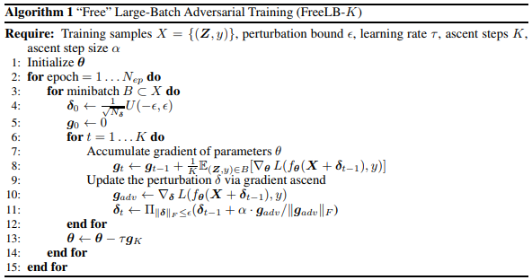
 - 和FreeAT一样，FreeLB也想更高效的利用两种梯度。但是和FreeAT不一样的是，FreeLB并**不是在每次梯度提升的过程中，都会同时对模型参数进行更新（像FreeAT），也不是迭代完第K步后根据地K步（最后一步）的梯度来对模型参数进行更新（像PGD）**，而是**将模型参数的梯度累积起来**，即算法第8行`g_t`更新的过程。
 - 因为每次都是在一个batch的数据做K次迭代，这样走过K步之后，FreeLB利用K步之后积累的参数梯度`g_K`，对参数`theta`，进行更新，即算法第13行的更新过程。
 - FreeLB对于每个batch一共需要进行`N_{ep}·K`次梯度计算，相比于PGD需要进行`N_{ep}·(K+1)`次梯度计算（其中`N_{ep}`是epoch的个数，这个次数是对每个batch而言的，前者的次数表示在每个epoch中的每个batch都要分别计算K次模型参数`theta`的梯度），是节省了`N_{ep}`次梯度计算，
 但是相比于FreeAT只需要`N_{ep}`次梯度计算而言，FreeLB效率的提升并不明显。但是**FreeLB的优势并不在效率，而是在效果**。由于**FreeLB利用了多步K积累的梯度再做更新，对梯度的估计更加精准，而且不存在FreeAT那样连续利用多个相同的min-batch进行梯度更新的问题**。
 - 相比于YOPO-m-n，FreeLB也是将K步（这里指m）中的梯度综合后再更新参数，不同的是其没有更进一步的n层，即使有，也是n个完全相同的值。
 - 为什么论文中称这种算法为Large Batch呢？这是因为在梯度下降时，我们使用的梯度是基于`X + theta_0, ..., X + theta_{K-1}`进行计算的，这**可以理解为近似的对K个不同样本的batch进行平均，所以相当于虚拟的增大了样本的数量**。
 - 论文中还指出了很重要的一点，就是**对抗训练和dropout不能同时使用**，因为加上dropout相当于改变了网络结构，会影响扰动r的计算。如果要用的话需要在K步中都使用同一个mask（即都drop掉同一批神经元）。

#### 各种对抗训练方法的区别
 - 对模型而言更新的是模型参数的梯度，对扰动样本而言更新的是输入X的梯度
 - FGSM和FGM的区别：（**一个batch，一次迭代**）
    - 两者区别在于采用的归一化的方法不同：
        - FGSM是通过符号函数（Sign函数）对梯度采取**max归一化**，max归一化是指：如果梯度某个维度上的值为正，则设为1；如果为负，则设为-1；如果为0，则设为0。
        - FGM则采用的是**L2归一化**，L2归一化则将梯度的每个维度的值除以梯度的L2范数，类似于softmax的过程。
        - 理论上L2归一化更严格的保留了梯度的方向，但是max归一化则不一定和原始梯度的方向相同。
    - 缺点：
        - 当然两种方法都有个假设，就是损失函数是线性的或者至少是局部线性的。如果不是（局部）线性的，那梯度提升的方向就不一定是最优方向了。
        - 而PGD是一步步提升，一定程度上避免了这个问题。
 - PGD和FreeAT的区别：
    - PGD：（**即一个batch进行K次迭代，每一次迭代都将输入X沿着梯度提升的方向前进一小步，对该batch反复求梯度，一点点迭代更新。每次内层计算梯度提升来更新扰动，等K步走完之后，才重新再计算一次梯度下降，更新参数**）
        - 为了解决FGSM和FGM中的线性假设问题，使用PGD方法来求解内部的最大值问题。
        - PGD是一种迭代攻击，相比于普通的**FGSM和FGM仅做一次迭代，PGD是做多次迭代，每次走一小步，每次迭代都会将扰动投射到规定范围内**（即将前两者的梯度更新分到每个时间步来做，更细化，局部线性假设基本成立）。
        - t+1时刻输入是根据t时刻的输入及t时刻的梯度提升的一小步求出。
        - 用PGD算法得到的攻击样本，是一阶对抗样本中最强的了
        - 缺点：存在一个问题是计算效率不高
    - FreeAT：（**采用PGD的训练方式，对每个batch会分别求K次梯度，我们既用每次求得的梯度提升来更新扰动，也用每次求得的梯度下降来更新模型参数**）
        - 在PGD的计算过程中，每次做前向后向计算时，不管是参数的梯度还是输出的梯度，都会计算出来，只不过**在梯度下降的过程中只利用参数的梯度，在梯度提升的过程中只利用输入的梯度**（因为要产生扰动向量，需要对输入进行扰动，根据输入的梯度来对输入进行相应的扰动），有很大的浪费。
        - 在一次前向后向计算过程中，把计算出来的参数的梯度和输入的梯度同时利用上，这就是FreeAT的核心思想。
    - 区别：
        - PGD对抗训练在利用梯度提升来计算扰动样本时，需要对同一个mini-batch反复迭代来求梯度。每次内层计算只用梯度提升来更新扰动，**等K步走完之后，才计算一次梯度下降，更新模型参数**。
        - FreeAT仍然采用了PGD这种训练方式，即对于每个min-batch会求K次梯度，每次求得的梯度，我们既用来更新扰动，也用来更新参数。
 - FreeLB和FreeAT的区别：
    - FreeLB：（**和FreeAT不一样的是，FreeLB将一个batch内参数的梯度累积起来，相当于求平均/期望**）
        - 和FreeAT一样，FreeLB也想更高效的利用两种梯度。但是和FreeAT不一样的是，FreeLB并不是在每次梯度提升（即更新输入时）的过程中，都会对参数进行梯度下降来更新，**而是将每个batch求得的参数梯度累积起来，最后再进行梯度下降来更新模型参数**。
        - 与PGD不同的是，PGD是等K步走完之后，才利用最后一步的扰动来计算一次梯度下降，更新模型参数。没有FreeLB的累计梯度求平均/期望的思想。
    - 区别：
        - 相比FreeAT，FreeLB效率的提升并不明显。但FreeLB的优势并不在效率，而是在效果。
        - FreeLB积累了K步的下降的梯度来更新模型参数，对梯度的估计更加精准，而且不存在FreeAT那样连续利用多个相同的min-batch进行梯度更新的问题

#### 对抗训练在内层loss最大化和外层loss最小化时每个样本的label相同吗
 - 相同。
 - 内部loss最大化是为了找到能让样本表现的最差的一个扰动`r_{adv}`，是攻击的过程，该扰动被限制在一定范围内。
 - 外部loss最小化是为了基于该攻击方式，找到最鲁棒的模型参数，是防御的过程。
 - 扰动的思想可以理解为：将输入样本向着损失上升的方向再进一步，得到的对抗样本就能造成更大的损失，**提高模型的错误率**。其目的是得到扰动后的样本。
 - 先让模型尽可能的去犯错，目的是求得扰动；然后利用生成的扰动样本，再来强迫模型网正确label去预测强制其对扰动样本不犯错，经过这个过程模型就对固定范围内的样本产生了鲁棒性。
 

#### 参考文献
 - [对抗攻击基础知识（一）](https://zhuanlan.zhihu.com/p/37260275)
 - [论文阅读：对抗训练（adversarial training）](https://www.zhihu.com/search?type=content&q=FreeLB)
 - [功守道：NLP中的对抗训练 + PyTorch实现](https://fyubang.com/2019/10/15/adversarial-train/)


## 文本/语义相似度

参考博客：
 - [文本相似度度量——词移距离（WMD）](https://www.zhihu.com/search?type=content&q=WMD)
 - [如何用 word2vec 计算两个句子之间的相似度？](https://www.zhihu.com/search?type=content&q=WMD)
 - [如何通过词向量技术来计算 2 个文档的相似度？](https://www.zhihu.com/question/33952003)
 - [从Kaggle赛题: Quora Question Pairs 看文本相似性/相关性](https://www.zhihu.com/search?type=content&q=WMD)

**计算文本相似度的常用方法：**
 - bag-of-words (BOW)
 - TF-IDF
 - BM25
 - LSI
 - LDA
 - mSDA（Marginalized Stacked Denoising Autoencoder）
 - CCG（Componential Counting Grid）
 - WMD

**WMD：**
 - 词移距离（Word Mover's Distance, WMD），用于判断两个文本之间的相似度，即WMD距离越大相似度越小
 - WMD是通过将一个文档中包含的词语“移动”（travel）到另一个文档中的词语，这个“移动”过程产生的距离总和的最小值作为词移距离。
 
    ```
    例子：
    
    两个短文本：
        “Obama speaks to the media in Illinois”
        “The President greets the press in Chicago”，
    
    那么从第一句子转移到第二个句子的示意图如下（已去除停用词）
    ```
    
    
 
    - 针对示意图中的词移距离则表示为：distance("Obama"->"President")+distance("speaks"->"greets")+...
    - 使用word2vec来表征词，通过word2vec将词语向量化后，使用欧式距离公式计算两个词语之间的距离 
 - 上边方式存在的问题：
    - 仅仅考虑距离和最小，那么每两个词之间的距离都最小则为最优解，那么肯定会出现一对多，甚至一对全部的情况
        
        ```
        举个栗子，文档 1 中每个词都跟“音乐”密切相关；文档 2 中只有一个词跟“音乐”密切相关，其余词都跟“音乐”完全无关；
        文档 3 中有一个词跟“音乐”密切相关，其他词都跟“音乐”有点关系但关联性不大。那么直觉上文档1和文档3更相似，即：
        
        distance(d1, d3) < distance(d1, d2)
        
        但如果按照词语距离和最小的方式，最优解应该是文档1所有词转移到文档2中与“音乐”密切相关的词上，
        文档1同样也所有词转移到文档3中和“音乐”密切相关的词上，即一对所有。那么此时很有可能导致：
        
        distance(d1, d3) = distance(d1, d2)
        
        文档2与文档3中与音乐密切相关的词语刚好同一个。这显然是不合理的。
        ```
 - 为了让结果合理，WMD作者提出让文档1中的词以不同的权重转移到另一个文档的所有词上，即一个词不再全部转移到另一个词，而是部分转移到另一个词，这样让另一个文档的所有词去分配该词的权重。
 - 那么有一个问题，怎么确定每个转移分配到的权重合理，并且不会出现一对全部的情况，WMD提出增加两个约束条件来解决这个问题：
    
    
 
    - 约束1让文档1中的每个词都部分转移到文档2，但为了求最优解依然可能出现权重为0的情况。
    - 第二个约束表明，文档2中所有词收到的权重必须和文档2中词本身的权重相同，即保证了文档2中每个词都会得到转移权重，避免出现一对所有的情况。
 - 计算上式中参数`d_i`, `d'_j`, `c(i,j)`, `T_{ij}`的值：
    - 标准化BOW表示
        
        
    - 词转移代价
        
        
    - 获取`T_{ij}`的过程其实就是WMD模型求解的过程。
        - WMD求解--(Earth Mover's Distance，EMD)
            - WMD的求解是EMD问题的一个特例，而EMD问题实际上是线性规划中运输问题的最优解（参考[博客](https://blog.csdn.net/sinat_33741547/article/details/80163719)）。因此可以用同样的求解方式求解。
            - WMD算法复杂度为`O(p^{3}logp)`，其中p是文档中不重复词的个数，对于大的数据集来说这个模型的优化复杂度会非常高。
    - 那么怎么来减小模型的复杂度呢？
        - **词质心距离（Word centroid distance， WCD）**
        - 为了加快模型速度（ps：作者论文中对WMD加速方法是基于WMD算法对文本做KNN分类为下做的加速），作者提出下界来排除不必要的运算。
        - 下界WCD的推导方法如下：
        
            
        - WCD算法的距离表示，一个文本中词的质心到另一个文本中词的质心的距离。
        - WCD算法的复杂度为`O(dp)`，在做KNN时,通过使用WCD将待分类文档与样本集文档做一个快速的预计算，对计算结果进行从小到大排序，那么可以排除掉排序靠后的文档不做耗时的WMD计算。
        - **但WCD有个问题，就是这个下界太宽松**，什么意思呢？就是说如6>1这个下界1与WMD为6相差有点远了，可能会造成误判。
    - 那么有没有一种紧一点的下界呢？
        - **Relaxed word moving distance(RWMD)**
        - RWMD的思想是将WMD模型中的**两个限制条件去除一个**，只留下其中一个限制条件，这样因为放松的条件限制那最小距离也会随之减小。假设去掉第二限制条件，优化目标变成了：
        
            
            
            
        
        从图中可以看到，WCD与WMD相差较大，而RWMD与WMD相距很紧。
    - 现在得到两个下界距离，应该怎么使用呢？
        - **使用预取和裁剪（Prefetch and prune）**
        - 预取和裁剪是利用WCD与RWMD相配合，来缩减对基于WMD做KNN时的计算时间。具体方法如下：
            - 1.先用WCD计算待分类文档与其他文档的距离，取离它最近的个文档；
            - 2.计算m个文档中前k个文档的WMD；
            - 3.计算剩下文档的RWMD，如果某个文档的RWMD大于KNN列表中第k个文档的WMD就裁剪掉（排除），否则就计算它的WMD。如果发现在KNN列表中就更新KNN列表，否则裁剪。
    - 这就形成了最终的计算方式。通过使用Prefetch and prune缩减计算量，提高效率。
        
        
    
        
    
        - 结果1展示了在8个数据集上的各种方法的在KNN分类上的错误率，可以看到WMD的表现优于其他方法。
        - 结果2展示了7中方法在8个数据集上相对于BOW的平均错误率，即每种方法的平均错误率除以BOW的平均错误率。

**罗列一些计算句子间相似度的方法：**
 - 1.无监督的方法，即不使用额外的标注数据，常用的方法有：
    - （1）对句子中所有词的word vector求平均，获得sentence embedding
    - （2）以每个词的TF-IDF为权重，对所有词的word vector加权平均，获得sentence embedding
    - （3）以smooth inverse frequency ([SIF](https://openreview.net/pdf?id=SyK00v5xx))为权重，对所有词的word vector加权平均，最后从中减掉principal component，得到sentence embedding
    - （4）通过Word Mover’s Distance ([WMD](http://proceedings.mlr.press/v37/kusnerb15.pdf))，直接度量句子之间的相似度
 - 2.有监督的方法，需要额外的标注数据，常见的有监督任务有：
    - （1）分类任务，例如训练一个[CNN的文本分类器](https://arxiv.org/abs/1408.5882)，取最后一个hidden layer的输出作为sentence embedding，其实就是取分类器的前几层作为预训练的encoder
    - （2）sentence pair的等价性/等义性判定 ([pdf1](http://people.csail.mit.edu/jonasmueller/info/MuellerThyagarajan_AAAI16.pdf), 
    [pdf2](https://www.aclweb.org/anthology/W16-1617.pdf))，这种方法的好处是不仅可以得到sentence embedding，还可以直接学习到距离度量函数里的参数
 - 博客[Comparing Sentence Similarity Methods](http://nlp.town/blog/sentence-similarity/)里比较了常见方法在计算句子相似句上的效果：
 
    
 
 从图中可以看到在这几个评估数据上：
    - （1）WMD方法（WMD-W2V）相对于其他无监督方法并没有明显的优势
    - （2）简单加权的词向量平均（AVG-W2V和AVG-W2V-TFIDF）已经可以作为一个较好的baseline，但是**考虑SIF加权的词向量平均（SIF-W2V)通常可以得到更好的效果**
    - （3）这里比较了两种预训练的encoder（InferSent/INF和Google's Sentence Encoder/GSE），相对而言GSE效果更好一些，但要注意它的性能并不一定在所有的数据集上都稳定。
 - 另外，从实践中的经验来看，如果要在无标注的数据上从零开始实现相似度的计算，可以**综合几种方法来得到更好的效果**。一种可能的步骤如下：
    - （1）使用某种无监督方法，对于句子集合做简单归类和标注
    - （2）通过1中得到的标注数据，训练分类模型或者句子对模型，从而得到相似度模型
    - （3）评估模型效果，适当引入新的标注数据，重复步骤1）2）

**深度学习派方法：**
 - （1）最简单的就是两个句子分别过一个CNN或者LSTM，然后在向量空间算分，相关[论文](http://cis.csuohio.edu/~sschung/CIS660/RankShortTextCNNACM2015.pdf)
    - 这个方法有一个trick就是千万别用MLP在向量空间算，效果大打折扣，一定要用`a^{T}wb`这种，或者你把`[a, b b a^{T}wb]`当做MLP的输入。一定要有这项，原因是其实你a和b直接连接会丢信息，
    就是boundary信息，并不知道a的边界在哪里，b的边界在哪里。
    - 如果靠连接起来走MLP不靠Bilinear的计算训练收敛速度会慢很多，且最后往往没有Bilinear的收敛的好。这个原因大概是Bilinear相当于我已经告诉神经网络，a和b都是哪里，不用神经网络去学，让收敛速度变快。另外，a自己作用自己往往是无效的（设想MLP时候A自己的第一维度还要和自己的第二维度发生作用，这其实是奇怪的在匹配任务重）。当然这两种模型的差距在数据的增大时候会效果越来越接近，可见模型在很大规模数据上，可以学习到这件事情（不过往往写论文的数据集没这么大）。
 - （2）李航老师的Arc2不是很work，但是想法非常非常好，亲测仍需提高，稍微改改就可以很work。
 相关[论文1](https://arxiv.org/pdf/1503.03244.pdf)，[论文2](https://arxiv.org/abs/1602.06359)，
 改为RNN上做CNN（原始方法是只做了Pooling，如果做Convolution会更好）[论文3](https://arxiv.org/pdf/1511.08277.pdf)
    - 先简介Arc2，这个模型把两句话的所有word算了个分生成了一个`n*m`的矩阵，然后把这个矩阵当图片过cnn。
    - 原本算词-词相似度是两个词向量连一起然后算个分，其实`a^{T}b`或`a^{T}wb`比Arc2中原始的`[a,b]·W`好用很多。
    - 另外，在cnn算的时候，直接用word embedding不是最佳方案，最佳方案是用已经过了LSTM的hidden state。
 - （3）去年还提出了一套Attention系列的匹配方法，例如[Match-LSTM](https://www.aclweb.org/anthology/N16-1170.pdf)，在聊天这个任务上评测没有（2）好用。
 相关[论文1](https://arxiv.org/abs/1511.04108)，[论文2](https://arxiv.org/pdf/1509.06664.pdf)，还有比较古老的方法DSSM。

**从Kaggle赛题: Quora Question Pairs 看文本相似性/相关性**
 - 给定两个quora中的提问。判断两个问题是不是一个问题。比如：A.如何学习NLP？ B.怎样学习自然语言处理？
 - 特征工程方法：传统方法不外乎各种角度的特征工程
    - 编辑距离
        - 编辑距离（Edit Distance），是指两个字串之间，由一个转成另一个所需的最少编辑操作次数。
        - 许可的编辑操作包括将一个字符替换成另一个字符，插入一个字符，删除一个字符。
        - 一般来说，编辑距离越小，两个串的相似度越大。
    
            ```
            例如：
            
            有两个字符串：kitten和sitting，现在我们要将kitten转换成sitting，可以做如下的一些操作；
            
            将K替换成S，将e替换成i，添加g。
            
            在这里我们设置每经过一次编辑，也就是变化（插入，删除，替换）我们花费的代价都是1。
            ```
        - FuzzyWuzzy这个python包提供了比较齐全的编辑距离度量方法。
    - 集合度量特征
        - 集合度量方式就是把两个句子看成BOW(bag of words)。
        - 然后使用集合相似性度量方法比如Jaccard等。
        - 这种方法有一个严重问题就是丢失语序。
    - 统计特征
        - 比如句子长度，词长度，标点数量，标点种类，以及词性序列上的度量，这也是最直观的度量方法
    - 使用预训练的词向量得到句子表示进行度量
        - 使用词向量的一种简单的方法是，BOW求平均，得到两个句子的表示，然后利用余弦相似度度量，这是一种非常简单而直观的方法。
        - 或者WMD的度量方法，这个思路也非常直觉，实际表现也非常良好
    - 使用传统方法如tfidf，LDA等topic model等拿到句子表示进行度量，使用tfidf值对词向量做一个加权，得到的句子表示也是一种不错的表示。
 - 深度模型：
    - 深度模型有两种思路，一种是基于表示，一种是基于交互。不过基于交互的模型大多也是先要拿到文本表示，从文本表示构建交互，从交互到特征抽取的思路。
    - 基于表示的方法：
    
        
    
        这是一个非常直观的思路，最后一层的matching score建模方法甚至可以用一个简单的FC代替，或者做一次element-wise 乘之后接FC。下面有在IR中用表示方法做这个问题的几篇论文：
    
        [DSSM](https://www.microsoft.com/en-us/research/wp-content/uploads/2016/02/cikm2013_DSSM_fullversion.pdf)，
        [CDSSM](http://www.iro.umontreal.ca/~lisa/pointeurs/ir0895-he-2.pdf)，
        [ARC I](http://www.hangli-hl.com/uploads/3/1/6/8/3168008/hu-etal-nips2014.pdf)，
        [LSTM-RNN](https://arxiv.org/abs/1502.06922)
    - 基于交互的方法：是通过Interaction来对文本相似性建模，其模型基本的原理是
        
        
    
        
        - 文章[Text Matching as Image Recognition](https://arxiv.org/abs/1602.06359)原理如下：
            - 拿到每个词的embedding。(embedding)
            - 构建两个文本的相似矩阵。(Interaction)
            - 把相似矩阵放入两层CNN中。(Feature extract)
            - 把CNN的结果放入两层的全连接中。(FC)
            - 获得二分类的score。(distribution)
        - 后来的一些工作都大同小异，比如不直接使用词向量，利用RNN的隐层向量去构建交互等等。具体的文章如下：
        [DeepMatch](https://www.semanticscholar.org/paper/A-Deep-Architecture-for-Matching-Short-Texts-Lu-Li/4aba54ea82bf99ed4690d45051f1b25d8b9554b5)，
        [ARC II](https://arxiv.org/pdf/1503.03244.pdf)，
        [MatchPyramid](http://www.bigdatalab.ac.cn/~lanyanyan/papers/2016/AAAI2016_pang.pdf)，
        [Match-SRNN](https://arxiv.org/abs/1604.04378)
 - 在比赛中发现，训练集和测试集的正负样本比有明显差异，分布上的差异最后体现在logloss指标上的gap，在比赛中大家推导出一个后处理的公式，然后可以拉平分布带来的分数异动。使用贝叶斯公式能推导出这个后处理，
 前提是可以测出分布的情况下。有[论文](https://www.isys.ucl.ac.be/staff/marco/Publications/Saerens2002a.pdf)对这个做了详细的讲解。
 - 比赛中一些预处理方法有：
    - 词元化/词干化
    - 去停止词
    - 标点符号清洗
    - 特殊符号替换
    - 词向量扩充句子得到另一份句子（这个直觉的思路是，利用词向量找相关词的特性，增加传统特征方法的容错性。比如集合度量方法，开心和高兴虽然是一个意思，但是不扩充近义词的话，其容错性很低）
 - 不得不提的是，这个比赛中有一个非常关键的leak信息，一个问题如果出现频繁的话，就很可能是一个重复的问题。后来发现前几名在这个leak上做了很多文章，取得了非常好的效果。
 - 比赛前几名解决方案：
    - [第一名的解法](https://link.zhihu.com/?target=https%3A//www.kaggle.com/c/quora-question-pairs/discussion/34355)：他的特征工程中含有大量的来自图的Structural features，有300多个模型做了stacking
    - [第四名的解法](https://link.zhihu.com/?target=https%3A//www.kaggle.com/c/quora-question-pairs/discussion/34349)，代码[地址](https://link.zhihu.com/?target=https%3A//github.com/HouJP/kaggle-quora-question-pairs)
    - 第五名的解法：也是在图的建模上挖掘了大量的特征
    - [第七名的解法](https://link.zhihu.com/?target=https%3A//www.kaggle.com/c/quora-question-pairs/discussion/34697)：花了大量的时间在深度模型上。和第一名都用了一个叫[decomposable attention](https://link.zhihu.com/?target=https%3A//arxiv.org/abs/1606.01933)的东西
    - [本文解法](https://link.zhihu.com/?target=https%3A//github.com/SpongebBob/Quora-Kaggle)


## 聚类算法
#### 聚类
**聚类任务：**
 - 在无监督学习中，训练样本的标记信息是未知的，目标是通过对无标记训练样本的学习来揭示数据的内在性质和规律
 - 聚类试图将数据集中的样本划分为若干个通常是不相交的子集，每个子集称为一个簇
 - 聚类既能作为一个单独的过程，用于寻找数据内在的分布结构，也可作为分类等其它学习任务的前驱过程，比如先聚类，得到几个类别，然后在有监督的去学习这几个类别（前提是不知道数据都有那些类别）
 - 两个基本问题：
    - 性能度量
        - 我们希望同一簇的样本尽可能彼此相似，不同簇的样本尽可能不同，即聚类结果的簇内相似度高，簇间相似度低
        - 聚类性能度量分两类：
            - 外部指标
                - 将聚类结果与某个参考模型进行比较
            - 内部指标
                - 直接考察聚类结果而不利用任何参考模型
                
            
            
    - 距离计算

**原型聚类：**
 - 即基于原型的聚类，此类算法假设聚类结构能通过一组原型刻画
 - 常用算法：
    - K均值算法（k-means）
    
        
        
        - k-means算法针对聚类所得簇划分，最小化平方误差
        
            
            
            - 其中`u_i`是簇`C_i`的均值向量，上式在一定程度上刻画了簇内样本围绕簇均值向量的紧密程度，E越小则簇内样本相似度越高
            - k-means采用了贪心策略，通过迭代优化来近似求解上式，如果迭代更新后聚类结果保持不变，则将当前簇划分结果返回
    - 学习向量量化（LVQ）
        - 与k-means类似，LVQ也是试图找到一组原型向量来刻画聚类结构
        - 不同的是，**LVQ假设数据样本带有类别标记**，学习过程利用样本的这些监督信息来辅助聚类
        
            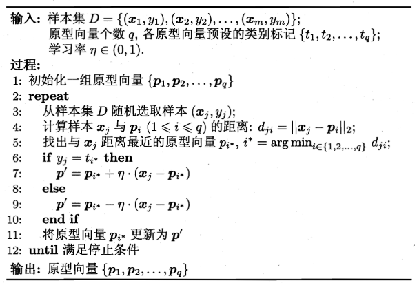
        - 假设每个样本是n维向量，则LVQ的目标是学习一组n维原型向量（可以从预设的类别中随机挑选一个样本向量进行初始化），每个原型向量代表一个聚类簇
        
            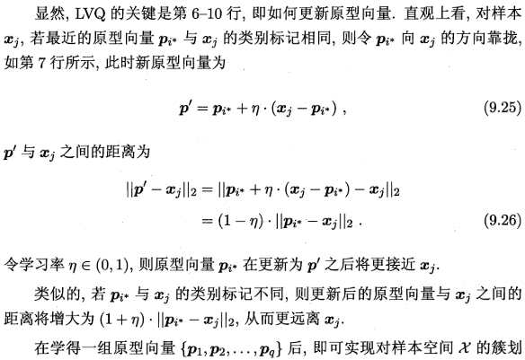
            
    - 高斯混合聚类
        - 与k-means、LVQ用原型向量来刻画聚类结构不同，高斯混合聚类**采用概率模型来表达聚类原型**
        - 从原型聚类的角度来看，高斯混合聚类是采用概率模型（高斯分布）对原型进行刻画，簇划分则由原型对应后验概率确定
        - TODO

**密度聚类：**
 - 基于密度的聚类，此类算法假设聚类结构能通过样本分布的紧密程度确定
 - 密度聚类算法从样本密度的角度来考虑样本之间的可连接性，并基于可连接样本不断扩展聚类簇以获得最终的聚类结果
 - DBSCAN算法，基于一组邻域参数来刻画样本分布的紧密程度
 
    
    
    
    
 - 个人认为密度聚类适合做异常点检测，筛选出不属于任何簇的样本点，作为异常点（噪声点）

**层次聚类：**
 - 层次聚类试图在不同层次对数据集进行划分，从而形成树形的聚类结构
 - 数据集的划分可采用自底向上的聚合策略，也可采用自顶向下的分拆策略
 - AGNES是一种自底向上聚合策略的层次聚类算法：
    - 先将数据集中的每个样本看作一个初始聚类簇
    - 然后在算法运行的每一步中找出距离最近的两个聚类簇进行合并（有点像归并排序思想/哈夫曼编码思想的感觉，都是自底向上）
    - 上述过程不断重复，直至达到预设的聚类簇个数
    - 关键点在于如何计算聚类簇之间的距离，实际上，每个簇是一个样本集合，因此只需采用关于集合的某种距离即可，采用如下方式计算集合之间的距离：
    
        
        
        
        


#### 文本聚类

TODO:


## 矩阵基础知识

**矩阵：**
 - [矩阵](https://baike.baidu.com/item/%E7%9F%A9%E9%98%B5/18069?fr=aladdin) `A`
 - [逆矩阵](https://baike.baidu.com/item/%E9%80%86%E7%9F%A9%E9%98%B5/10481136?fr=aladdin)
 - [矩阵行列式](https://baike.baidu.com/item/%E7%9F%A9%E9%98%B5%E8%A1%8C%E5%88%97%E5%BC%8F/18882017?fr=aladdin) `det(A)`或`|A|`
 - [伴随矩阵](https://baike.baidu.com/item/%E4%BC%B4%E9%9A%8F%E7%9F%A9%E9%98%B5/10034983) `A*`
 - [特征向量](https://baike.baidu.com/item/%E7%89%B9%E5%BE%81%E5%90%91%E9%87%8F)
 - [特征值](https://baike.baidu.com/item/%E7%89%B9%E5%BE%81%E5%80%BC)
 - [矩阵的迹](https://baike.baidu.com/item/%E7%9F%A9%E9%98%B5%E7%9A%84%E8%BF%B9)
 - [实对称矩阵](https://baike.baidu.com/item/%E5%AE%9E%E5%AF%B9%E7%A7%B0%E7%9F%A9%E9%98%B5)
 - [如何求特征值和特征向量？](https://jingyan.baidu.com/article/27fa7326afb4c146f8271ff3.html)
 - [如何理解矩阵的「秩」？](https://www.zhihu.com/question/21605094)
 - [如何求矩阵的逆矩阵？](https://jingyan.baidu.com/article/925f8cb8a74919c0dde056e7.html)
 - [协方差](https://baike.baidu.com/item/%E5%8D%8F%E6%96%B9%E5%B7%AE/2185936?fr=aladdin)
 - [协方差矩阵](https://baike.baidu.com/item/%E5%8D%8F%E6%96%B9%E5%B7%AE%E7%9F%A9%E9%98%B5/9822183?fr=aladdin)
 - [对角矩阵](https://baike.baidu.com/item/%E5%AF%B9%E8%A7%92%E7%9F%A9%E9%98%B5/638916?fr=aladdin)
 - [可对角化矩阵](https://baike.baidu.com/item/%E5%8F%AF%E5%AF%B9%E8%A7%92%E5%8C%96%E7%9F%A9%E9%98%B5?fromtitle=%E7%9F%A9%E9%98%B5%E5%AF%B9%E8%A7%92%E5%8C%96&fromid=15938056)

> 以上超链接来自百度/知乎。

## 降维与度量学习

**低维嵌入：**
 - 很多学习方法都涉及距离计算，而高维空间会给距离计算带来很大麻烦
 - 在高维情形下出现的数据样本稀疏、距离计算困难等问题，称为维数灾难
 - 降维是缓解维数灾难的一个重要途径，即通过某种数学变换将原始高维属性空间转变为一个低维子空间，在这个子空间中样本密度大幅提高，距离计算变易
 - 能够降维的原因是：人们观测或收集到的数据样本虽然是高维的，但与学习任务密切相关的也许仅是某个低维分布，即高维空间中的一个低维嵌入
 - 在现实应用中为了有效降维，往往仅需要降维后的距离与原始空间中的距离尽可能接近，不必严格相等
 - **矩阵的特征值和特征向量可以揭示线性变换的深层特性**，对应不同特征值的特征向量线性无关
 - 若要求原始空间中样本之间的距离在低维空间中得以保持，即得到多维缩放（MDS）
 
    
    
    
    
 - 对原始高维空间进行线性变换：
 
    
 
    - **基于线性变换来进行降维的方法称为线性降维方法**，
 - 对降维效果的评估，通常是比较降维前后学习器的性能

**主成分分析：**
 - 主成分分析（PCA）是最常用的一种降维方法，常用于高维数据的降维，可用于提取数据的主要特征分量。
 - 协方差：
    - 如果X与Y是统计独立的，那么二者之间的协方差就是0
    - 但是，反过来并不成立。即如果X与Y的协方差为0，二者并不一定是统计独立的。
    - **协方差是一个衡量线性独立的无量纲的数，协方差为0的两个随机变量称为是不相关的**
 - 先考虑一个问题：对于正交属性空间中的样本点，如何用一个超平面（直线的高维推广）**对所有样本进行恰当的表达**？该超平面应该具有以下性质：
    - 最近重构性：样本点到这个超平面的距离都足够近
    - 最大可分性：**样本点在这个超平面上的投影能尽量分开（需要最大化投影点的方差!!!）**
    - PCA的数学推导可以从最大可分型和最近重构性两方面进行，前者的优化条件为点到划分平面距离最小，后者的优化条件为**划分后方差最大**
 - 基于上述两个性质，能分别得到PCA的两种等价推导
 - PCA算法：
 
    
    
    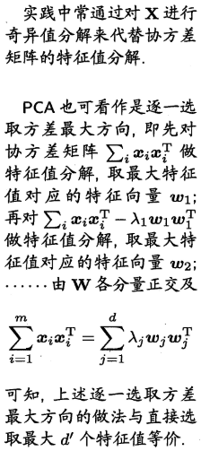
    
    
    
    根据协方差矩阵可知：**对角线上为方差（也就是特征值），特征值最大就是方差最大**。
 - 降维之后，最小的`d - d'`个特征值的特征向量被舍弃，这是降维导致的结果，但是这是必要的：
    - 一方面，舍弃这部分信息之后能使样本的采样密度增大，这正是降维的重要动机
    - 另一方面，当数据受到噪声影响时，最小的特征值所对应的特征向量往往与噪声有关，将他们舍弃能在一定程度上起到去燥的效果
 - ---------------------------------- 分割线 ----------------------------------
 - A与B的内积值等于A向B所在直线投影的表量长度。
 - 要准确描述向量，首先要确定一组基，然后给出在基所在的各个直线上的投影值，就可以了
 - 两个矩阵相乘的意义是将右边矩阵中的每一列向量变换到左边矩阵中以每一行行向量为基所表示的空间中去。也就是说一个**矩阵可以表示一种线性变换**。
 - 选择不同的基可以对同样一组数据给出不同的表示，**如果基的数量少于向量本身的维数，则可以达到降维的效果**。
 - 如何选择基才是最优的? 从N维降到K维，应该如何选择K个基才能最大程度保留原有的信息？
    - 一种直观的看法是：**希望投影后的投影值尽可能分散，因为如果重叠就会有样本消失**。当然这个也可以从熵的角度进行理解，熵越大所含信息越多。
    - 即寻找一个一维基，使得所有数据变换为这个基上的坐标表示后，**方差值最大**。
 - 在一维空间中我们可以用方差来表示数据的分散程度。而对于高维数据，我们用协方差进行约束，**协方差可以表示两个变量的相关性**。为了让两个变量尽可能表示更多的原始信息，我们**希望它们之间不存在线性相关性，因为相关性意味着两个变量不是完全独立，必然存在重复表示的信息**。
 - 当协方差为0时，表示两个变量完全独立。**为了让协方差为0，我们选择第二个基时只能在与第一个基正交的方向上进行选择**，因此最终选择的两个方向一定是正交的。
 - 降维问题的优化目标：**将一组N维向量降为K维，其目标是选择K个单位正交基，使得原始数据变换到这组基上后，各变量两两间协方差为0，而变量方差则尽可能大（在正交的约束下，取最大的K个方差）**
 - 协方差矩阵：
 
    
 - 根据我们的优化条件，我们需要将除对角线外的其它元素化为0（即使得所有协方差尽量接近0,是变量之间完全独立。另一种解释是，将其它元素置0之后，留下来的矩阵的每行可以作为一个基向量，各行之间是正交的），并且在对角线上将元素按大小从上到下排列（变量方差尽可能大，因为在协方差矩阵里，对角线上的元素是变量的方差，其它元素是变量之间的协方差），这样我们就达到了优化目的。
    
    
    
    
 - 在叙述求协方差矩阵对角化时，我们给出希望变化后的变量有：变量间协方差为0且变量内方差尽可能大。
 - 我们要找到最大方差也就是协方差矩阵最大的特征值，最佳投影方向就是最大特征值所对应的特征向量，次佳就是第二大特征值对应的特征向量，以此类推
 - 此外，最近重构性也可对上述问题进行求解：以上的证明思路主要是基于最大可分性的思想，通过一条直线使得样本点投影到该直线上的方差最大。除此之外，我们还可以将其转换为线型回归问题，其目标是求解一个线性函数使得对应直线能够更好地拟合样本点集合。这就使得我们的优化目标从方差最大转化为平方误差最小，因为映射距离越短，丢失的信息也会越小。区别于最大可分性，这是从最近重构性的角度进行论证。
 - 总结一下PCA的算法步骤：
 
    
 - PCA的性质：
    - 1.缓解维度灾难：PCA算法通过舍去一部分信息之后能使得样本的采样密度增大（因为维数降低了），这是缓解维度灾难的重要手段；
    - 2.降噪：当数据受到噪声影响时，**最小特征值对应的特征向量往往与噪声有关（因为在协方差矩阵中，特征值表示方差大小，方差大的所含信息多，即排名靠前的主成分，方差小的所含信息少，即无关紧要的成分，可以当作噪声点）**，将它们舍弃能在一定程度上起到降噪的效果；
    - 3.过拟合：PCA保留了主要信息，但这个主要信息只是针对训练集的，而且**这个主要信息未必是重要信息。有可能舍弃了一些看似无用的信息，但是这些看似无用的信息恰好是重要信息，只是在训练集上没有很大的表现，所以PCA也可能加剧了过拟合**；
    - 4.特征独立：PCA 不仅将数据压缩到低维，**它也使得降维之后的数据各特征相互独立**；
 - 一些细节：
    - 零均值化
        - 当对训练集进行PCA降维时，也需要对验证集、测试集执行同样的降维。而对验证集、测试集执行零均值化操作时，均值必须从训练集计算而来，不能使用验证集或者测试集的中心向量。
        - 另外我们也需要保证一致性，我们拿训练集训练出来的模型用来预测测试集的前提假设就是两者是独立同分布的，如果不能保证一致性的话，会出现Variance Shift的问题。
    - 与SVD的对比
        - 特征值和特征向量是针对方阵才有的，而对任意形状的矩阵都可以做奇异值分解。
        - 如下：
        
        

**为啥要最大化投影点的方差？**
 - 用一个超平面（直线的高维推广）对所有样本进行恰当的表达
 - 要具有最大可分性：样本点在这个超平面上的投影能尽量分开（需要最大化投影点的方差）
 - 希望投影后的投影值尽可能分散，因为如果重叠就会有样本消失
 - 熵越大所含信息越多
 - 使得所有数据变换为这个基上的坐标表示后，方差值最大，熵大所含信息多，能最大程度保留原有的信息
 - 其目标是选择K个单位正交基，使得原始数据变换到这组基上后，各变量两两间协方差为0，而变量方差则尽可能大（在正交的约束下，取最大的K个方差）
 - 最佳投影方向就是最大特征值所对应的特征向量，次佳就是第二大特征值对应的特征向量
 - 最小特征值对应的特征向量往往与噪声有关（因为在协方差矩阵中，特征值表示方差大小，方差大的所含信息多，即排名靠前的主成分，**方差小的所含信息少，即无关紧要的成分，可以当作噪声点**）


参考博客：
 - [降维——PCA](https://www.zhihu.com/search?type=content&q=pca%E9%99%8D%E7%BB%B4)

**核化线性降维：**
 - TODO

**流形学习：**
 - TODO

**度量学习：**
 - TODO


## 特征选择与稀疏学习
 - TODO


## 偏差与方差
**一般概念：**
 - 偏差（Bias）描述的是预测值和真实值之差；
 - 方差（Variance）描述的是预测值作为随机变量的离散程度。
 - 放一场很经典的图：
 
    

**模型的偏差与方差：**
 - 偏差：
    - 描述样本拟合出的模型的预测结果的期望与样本真实结果的差距
    - 要想偏差表现的好，就需要复杂化模型，增加模型的参数，但这样容易过拟合，过拟合对应上图的High Variance，点会很分散。
    - 低偏差对应的点都打在靶心附近，所以喵的很准，但不一定很稳（也就是点比较分散）；
 - 方差：
    - 描述样本上训练出来的模型在测试集上的表现
    - 要想方差表现的好，需要简化模型，减少模型的复杂度，但这样容易欠拟合，欠拟合对应上图High Bias，点偏离中心。
    - 低方差对应就是点都打的很集中，但不一定是靶心附近，手很稳，但不一定瞄的准。


## Beam Search算法/贪心算法/维特比算法
参考知乎：
 - [seq2seq中Beam search~贪心与维特比](https://www.zhihu.com/search?type=content&q=%E8%B4%AA%E5%BF%83%E7%AE%97%E6%B3%95%20%E7%BB%B4%E7%89%B9%E6%AF%94%E7%AE%97%E6%B3%95%20%E5%8A%A8%E6%80%81%E8%A7%84%E5%88%92%20beam%20search)
 - [seq2seq中Beam search~Bs算法](https://zhuanlan.zhihu.com/p/42006789)

**贪心算法：**
 - 如果target sequence词汇表的大小为`|V_E|`的话，对于解码器的N步输出，他的搜索空间`|V_E|^N`。随着N的增大，那这个效率会非常低。所以我们才想要通过一些算法去找出使得概率最大的输出序列。
 - 贪心算法每一步都会计算当前步的最优解（贪心算法的思想，每一步都选择最大的概率），最后的输出序列不一定是全局的最优解。

**维特比算法：**
 - 目标是找出使`P(e1,e2,...,en|F)`最大的序列`e1,e2,...,en`。
 - 在HMM中使用了维特比算法
 - 算法思想：
    - 用动态规划的思想来求解概率最大的路径（最优路径）
    - 这个最终的最优路径就是我们想要得到的最终的输出序列。
    - 简单的说我们只需从第1步开始，递推地计算在第t步输出单词为e的各条部分路径的最大概率，直至得到最后一步输出单词e的各条路径的最大概率。
    - -------------------------- 分割线 --------------------------
    - 在第t步，计算当前时间步所有状态的最优路径
        ```
               第一步     第二步     第三步
                 e1        e2       e3
            |--> a         a         a
        F-->|--> b 交叉连接  b 交叉连接  b
            |--> c         c         c
        ```
    在第一步，假设：
    
        ```
        p(F-->a)=0.5
        p(F-->b)=0.3
        p(F-->c)=0.2
        ```
    第二步，假设：
    
        ```
        p(a-->a)=0.3
        p(a-->b)=0.4
        p(a-->c)=0.3
        
        p(b-->a)=0.4
        p(b-->b)=0.2
        p(b-->c)=0.4
        
        p(c-->a)=0.5
        p(c-->b)=0.2
        p(c-->c)=0.3
        ```
    则，在第二步，到达各个状态的最佳路径是：
    
        ```
        对于状态a：
            - 从第一步中三个状态分别到达第二步中的a状态
                F --> a --> a， p=0.5×0.3=0.15  最大，最优路径
                F --> b --> a， p=0.3×0.4=0.12
                F --> c --> a， p=0.2×0.5=0.10
            - 所以到达a的最优路径是 'F->a->a'
        
        对于状态b：
            - 从第一步中的三个状态分别到达第二步中的b状态
                F --> a --> b， p=0.5×0.4=0.20  最大，最优路径
                F --> b --> b， p=0.3×0.2=0.06
                F --> c --> b， p=0.2×0.2=0.04
            - 所以到达b的最优路径是 'F->a->b'
        
        对于状态c：
            - 从第一步中的三个状态分别到达第二步中的c状态
                F --> a --> c， p=0.5×0.3=0.15  最大，最优路径
                F --> b --> c， p=0.3×0.4=0.12
                F --> c --> c， p=0.2×0.3=0.06
            - 所以到达c的最优路径是 'F->a->c'
        ```
    第三步，假设：
    
        ```
        p(a-->a)=0.4
        p(a-->b)=0.4
        p(a-->c)=0.2
        
        p(b-->a)=0.3
        p(b-->b)=0.4
        p(b-->c)=0.3
        
        p(c-->a)=0.7
        p(c-->b)=0.1
        p(c-->c)=0.2
        ```
    则，在第三步，到达各个状态的最佳路径是：
    
        ```
        在第二步中，已经确定，
            - 到达a的最优路径是 'F->a->a'  0.5×0.3
            - 到达b的最优路径是 'F->a->b'  0.5×0.4
            - 到达c的最优路径是 'F->a->c'  0.5×0.3
        
        则，在第三步中，从第二步的3个状态，分别到达第三步中的[a,b,c]状态的分析如下：
        对于状态a：
            - 从第二步中的三个状态分别到达第三步中的a状态，
                F --> a --> a --> a， p=0.5×0.3×0.4=0.06  
                F --> a --> b --> a， p=0.5×0.4×0.3=0.06
                F --> a --> c --> a， p=0.5×0.3×0.7=0.105  最大，最优路径
            - 所以到达a的最优路径是 'F->a->c->a'，值0.105
        
        对于状态b：
            - 从第二步中的三个状态分别到达第三步中的b状态
                F --> a --> a --> b， p=0.5×0.3×0.4=0.06   
                F --> a --> b --> b， p=0.5×0.4×0.4=0.08   最大，最优路径
                F --> a --> c --> b， p=0.5×0.3×0.1=0.015
            - 所以到达b的最优路径是 'F->a->b->b'，值0.08
        
        对于状态c：
            - 从第二步中的三个状态分别到达第三步中的c状态
                F --> a --> a --> c， p=0.5×0.3×0.2=0.03   
                F --> a --> b --> c， p=0.5×0.4×0.3=0.06   最大，最优路径
                F --> a --> c --> c， p=0.5×0.3×0.2=0.03
            - 所以到达a的最优路径是 'F->a->b->c'，值0.06
        ```
    进行对比`0.105 > 0.08 > 0.06`，故最优路径是`F->a->c->a`
    - 根据上边的计算过程可知，维特比算法求出的最佳路径是针对每个具体的状态来说的，采用了动态规划的思想，
    比如最佳路径是`F->a->c->a`，子路径`F->a->c`表示第二步到达c状态时的最优路径，并不是整个第二步的最优路径。
 - 维特比算法的复杂度：
    - 从上面过程的计算复杂度为`V*N`，其中，V表示每一步的状态的个数，N表示步数，也就是说在每一步都需要计算N个状态的概率。
    在当前步中计算某个状态时，都需要从上一步的V个状态中去遍历，故计算复杂度是`V*N*V`。
    - 空间复杂度是`V*N`，表示每一步的每一个状态的概率（并记录达到这个最优概率的父节点）。
 - 优缺点：
    - 维特比算法还是很不错的，能够得到最优的值，但是如果target sequence词汇表特别大的话，效率还是不高，当然target sequence词汇表很小的时候，维特比算法会是一个很不错的选择
    - 但是通常我们的target sequence词汇表都很大。所以就有了Beam search算法，他通过舍弃一些精度来提高效率。
    - 得到的是**全局最优解**

**Beam Search算法：**
 - 目标还是找出使`P(e1,e2,...,en|F)`最大的序列`e1,e2,...,en`。
 - Beam search方法中有一个关键的参数Beam Size B，这个B是远远小于V的，即`B << V`，V表示词汇表的大小，
 维特比算法需要填充一个`V*N`的表格，Beam Search需要填充一个`B*V`的表格，直观的来看beam search比Viterbi算法效率高很多，因为`B << V`。
 - 具体过程如下：
 
    ```
    假设B=2，即每一步都选择出概率值最大的两个作为该步的输出。
    
    第一步，
        - 对下列概率进行降序排列，保留最大的两个：
            p(F-->a)=0.5
            p(F-->b)=0.3
            p(F-->c)=0.2
        - 输出：
            p(F-->a)=0.5
            p(F-->b)=0.3
    第二步，
        对于状态a：
            - 从第一步中2个状态分别到达第二步中的a状态
                F --> a --> a， p=0.5×0.3=0.15  最大，最优路径
                F --> b --> a， p=0.3×0.4=0.12
            - 所以到达a的最优路径是 'F->a->a'
        
        对于状态b：
            - 从第一步中的2个状态分别到达第二步中的b状态
                F --> a --> b， p=0.5×0.4=0.20  最大，最优路径
                F --> b --> b， p=0.3×0.2=0.06
            - 所以到达b的最优路径是 'F->a->b'
        
        对于状态c：
            - 从第一步中的2个状态分别到达第二步中的c状态
                F --> a --> c， p=0.5×0.3=0.15  最大，最优路径
                F --> b --> c， p=0.3×0.4=0.12
            - 所以到达c的最优路径是 'F->a->c'
    
        进行排序，输出最大的两个：
            F->a->b， 值为0.20
            F->a->c， 值为0.15
    
    第三步，
        对于状态a：
            - 从第二步中的2个状态分别到达第三步中的a状态，
                F --> a --> b --> a， p=0.5×0.4×0.3=0.06
                F --> a --> c --> a， p=0.5×0.3×0.7=0.105  最大，最优路径
            - 所以到达a的最优路径是 'F->a->c->a'，值0.105
        
        对于状态b：
            - 从第二步中的2个状态分别到达第三步中的b状态
                F --> a --> b --> b， p=0.5×0.4×0.4=0.08   最大，最优路径
                F --> a --> c --> b， p=0.5×0.3×0.1=0.015
            - 所以到达b的最优路径是 'F->a->b->b'，值0.08
        
        对于状态c：
            - 从第二步中的2个状态分别到达第三步中的c状态
                F --> a --> b --> c， p=0.5×0.4×0.3=0.06   最大，最优路径
                F --> a --> c --> c， p=0.5×0.3×0.2=0.03
            - 所以到达a的最优路径是 'F->a->b->c'，值0.06
    
        进行排序，输出最大的两个：
            F->a->c->a， 值为0.105   最大，最优路径
            F->a->b->b， 值为0.08
    ```
 - Beam Search算法的复杂度：
    - 计算复杂度`O(B×N×log(V))`，我们是按列进行填写的，所以需要计算`B×N`个，我们对temp进行排序的是`B×log(V)`，
    所以是`B×N + B×V×log(V)`，所以每一列的计算复杂度是`O(B×V×log(V))`，那总共有N列，所以计算复杂度为`O(B×V×N×log(V))`；
    - 空间复杂度就是表格中需要填的元素个数，所以空间复杂度为`O(B×N)`
 - 可以看出，beam search算法还是很不错的，他得到的结果是**近似的最优解**
 - 如果词汇表特别大的话，计算复杂度也不会太大，比维特比算法和贪心算法效率高很多。


## NLP的几类任务

大致分为以下几种：
 - 序列标注：
    - 中文分词/POS Tag/NER/语义角色标注
    - 特点是句子中每个单词要求模型根据上下文都要给出一个分类类别。
 - 分类任务：
    - 文本分类/情感计算
    - 特点是不管文章有多长，总体给出一个分类类别即可。
 - 句子关系判断：
    - 文本蕴含/QA/语义改写/NLI
    - 特点是给定两个句子，模型判断出两个句子是否具备某种语义关系；
 - 生成式任务：
    - 机器翻译/文本摘要/写诗造句/看图说话
    - 特点是输入文本内容后，需要自主生成另外一段文字。


## 计算理论学习


## 半监督学习


## 规则学习


## 强化学习


## 线性模型


## 模型评估与选择


## 损失函数


## 对数似然函数


## 倒排索引


## 前后向算法
 - TODO


## 序列生成算法
 - TODO


## 词性标注


## 命名实体识别


## 关系挖掘


## 似然


## 正则化方法

权重衰减


## 生成式MRC


## 文本分类的方法


## 情感分析


## 文本摘要


## 文本蕴含


## 语义分析


## 句法分析


## 词法分析


## 依存句法分析


## 语义角色标注


## 词义消歧


## 共指消解


## 事件抽取


## 实体抽取


## 实体关系抽取


## 交叉熵


## 困惑度


## 梯度消失与梯度爆炸


## MRC与QA


## 查找算法
**最小二分查找：**


## 排序算法
**堆排序：**

**快速排序：**

**冒泡排序：**


## 动态规划


## 线性规划


## TextRank/PageRank算法


## KMP算法


## 新词发现


## 意图理解


## 特征工程


## 特征组合


## 特征交叉


## 模型选择


## 前向分步算法


## 贝叶斯参数搜索


## 贝叶斯估计


## 回归算法


## 事件抽取


## 关系抽取


## 文本匹配


## 语义匹配


## 分词算法

**常用算法：**
 - 分词算法有基于词典进行前后向最大匹配、对所有成词情况构造DAG、hmm/crf序列标注模型以及深度学习模型+序列标注等。（TODO）
 - 分词工具：
    - 腾讯内部的QQSeg
    - 百度LAC
    - Jieba分词
    - 清华THULAC
    - 北大pkuseg
    - 中科院ICTCLAS
    - 哈工大PyLTP
    - 复旦FNLP
    - Ansj
    - SnowNLP
    - FoolNLTK
    - HanLP
    - 斯坦福CoreNLP
    - Jiagu
    - IKAnalyzer
 - 需要考虑的点主要包括：切词准确性、粒度控制、切词速度、是否带有NER、NER识别速度、是否支持自定义词典等。


## Query理解

#### 长尾Query特点
 - 搜索面临着越来越大的query[长尾化](https://baike.baidu.com/item/%E9%95%BF%E5%B0%BE%E6%95%88%E5%BA%94/6352848?fr=aladdin)
 挑战，query理解是提升搜索召回质量的关键。
 - 长尾query的多样性对于搜索系统来说是一个很大的挑战，原因有：
 
    
    
    - 1.**存在输入错误**。例如上图中的错误query "塞尔维雅" ( 塞尔维亚 )，对于这种错误我们希望系统能够自动的纠错；
    - 2.**存在表达冗余**。例如输入"孙子兵法智慧的现代意义"，在这个语境下，"智慧" 是一个无关紧要的词。如果强制去匹配 "智慧" 的话，反而匹配不出真正想要的结果；
    - 3.**存在语义鸿沟**。比如 "高跟鞋消音"，其中 "消音" 这个词的表达较少见，使得同时包含 "高跟鞋" 和 "消音" 文档较少。而类似的表达如 "高跟鞋声音大如何消除"、"高跟鞋消声" 等可能较多。用户输入的 query 和用户生产内容之间存在了语义鸿沟。其他类型的难点还有表达不完整，意图不明等等。
 - 我们先通过图右边这个query："iPhone手机价格多少" 来介绍如何解决上述问题：
    - 对于输入错误，比如说用户输入的query是iPhone，但是这个词输错了，会通过纠错模块将其纠正为正确的 query；
    - 对于表达冗余，通过计算每一个词的重要程度也就是term weight，来确定参与倒排索引求交操作的词。先对 query 进行分词，切成 iPhone、手机、价格、多少，之后判断各词对于表达意图更重要，重要的词会在检索时参与倒排索引的求交操作，不那么重要的词不严格要求一定在文档中出现；
    - 解决语义鸿沟的问题。需要对原始query做同义词扩展，比如 "iPhone" 和 "苹果" 是同义词，"价格" 和 "售价" 是同义词。
 - 所以在传统的搜索领域中的查询模块，往往包含这些子任务：**纠错、分词、紧密度、同义词、词权重，以及其他的如实体词识别、意图识别等等。这些查询理解会生成一个结构化的数据，检索模块就可以通过结构化的查询串去召回相关的文档**。


 - ----------------------------------------- 分割线 -----------------------------------------
 - 搜索Query理解（qu）包含的模块主要有：
 
    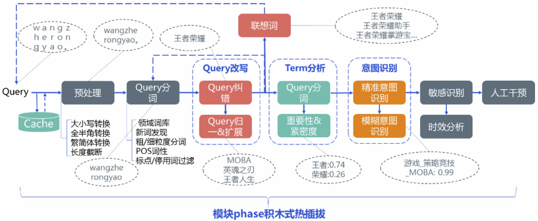
    
 - **query预处理**
    - 1.全半角转换：将在输入法全角模式下输入的query转换为半角模式的，主要对英文、数字、标点符号有影响，如将“ｗｅｃｈａｔ１２３”全角输入转成半角模式下的“wechat 123”。
    - 2.大小写转换：统一将大写形式的字母转成小写形式的。
    - 3.繁简体转换：将繁体输入转成简体的形式，当然考虑到用户群体的差异以及可能存在繁体形式的资源，有些情况还需要保留转换前的繁体输入用于召回。
    - 4.无意义符号移除：移除诸如火星文符号、emoji表情符号等特殊符号内容。
    - 5.Query截断：对于超过一定长度的query进行截断处理。
 - **query分词**
    - 分词：
        - 分词及对应词性信息可以用于后续的term重要性分析和意图识别等多个模块。
        - qu的分词及其粒度需要与item侧索引构建的分词及粒度保持一致，从而才能进行有效地召回。
        - 在搜索中的query切词一般会做粒度控制，分为细粒度和phrase粗粒度两个级别，比如query“下载深海大作战”按phrase粗粒度切分可以为“下载 深海大作战”，按细粒度切分为“下载 深海 大 作战”。**在进行召回时可以优先用phrase粗粒度的切词结果进行召回能得到更精准相关的结果同时减少多个term拉链合并的计算量。当phrase粗粒度分词进行召回结果不够时，可以采用拆分后的细粒度分词进行二次重查扩召回**。
    - 新词发现
        - 对于一些新出现的**网络词汇**可能不能及时识别覆盖，尤其是对于一些垂直搜索有比较多**业务专名词**的情况，这时候需要对这些**未登录词**做新词发现。
        - 方法1：一些切词工具自带有新词发现功能，比如Jieba采用HMM进行新词发现。
        - 方法2：可以采用基于统计的方法来进行新词发现，通过统计语料中的词语tfidf词频、凝聚度和自由度等指标来进行无监督新词挖掘，当词语的凝聚度和自由度达到一定阈值且已有分词不能切分到一起时可以人工评估后加进词库。
            - tfidf词频（TODO）
            - 凝聚度即点互信息，如下，**用于衡量两个term共现的概率，两个term经常出现在一起，则可以将它们组合成一个词语整体的可能性也更大**。
            
                
            - 自由度：自由度取term左右邻熵的较小值，**衡量当前term左右两边字集合的随机程度，如果左右字集合越随机则这个term独立成词的可能性也更大**。
            
                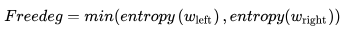
        - 方法3：还有的做法是对query进行切词后构建词之间的**关系矩阵，然后进行矩阵分解**，得到各个词在主特征空间的投影向量，通过投影向量计算词之间的相似度并设定相应阈值构造0-1切分矩阵，基于该矩阵进行是否成词的判断。
        - 方法4：可以将新词发现转化为序列标注问题，训练BiLSTM-CRF、BERT-CRF等模型预测成词的起始、中间及结束位置。
        - 方法5：转化为ngram词在给定句子语境中是否成词或不成词二分类问题。
    - POS词性
    - 领域词库
    - 标点/停用词过滤
 - **紧密度分析**
    - Term紧密度，主要用于衡量query中任意两个term之间的紧密程度
    - 如果**两个term间紧密度比较高，则这两个term在召回item（doc）中出现的距离越近相对来说越相关**。
        
        ```
        以相邻的两个term为例：
         - 由于分词工具本身存在准确率问题，某两个term可能不会被分词工具切分到一起
         - 但它们之间的关系比较紧密，也即紧密度比较高，如果在召回时能将在item中同时
         出现有这两个term且出现位置挨在一起或比较靠近的item进行召回，相关性会更好。
        
        以前面的搜索query“下载深海大作战”为例：
         - 经分词工具可能切分成“下载 深海 大 作战”，但其实“大”和“作战”的紧密度很高
         - 从文本相关性角度来看，召回“喵星大作战”要一定程度比“大人物作战”会更相关。
         - 当然，在query中并不是两个term的距离越近紧密度越高，可以通过统计搜索log里
         term之间的共现概率来衡量他们的紧密程度。
        ```
    - 在进行召回时，传统的相关性打分公式如OkaTP、BM25TP、newTP、BM25TOP等在BM25基础上进一步考虑了proximity（近邻）计算，但**主要采用两个term在item中的距离度量**，如：
        
        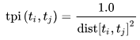
        
    - 有了query中的term紧密度，在召回构造查询索引的逻辑表达式中**可以要求紧密度高的两个term需共同出现以及在proximity计算公式中融合考虑进去，从而保证query中紧密度高的两个term在item中出现距离更近更相关**。
    - -------------------------------------- 分割线 --------------------------------------
    - **想法：使用self-attention得到attention weight来做term的语义相关度，找出query中每个词的最相关的词**。
 - **term重要性分析**
    - 不同term在同一文本中会有不一样的重要性，在进行召回计算相关性时需要同时考虑query及item侧的term重要性。
        
        ```
        如对于query“手机淘宝”，很明显term“淘宝”要比“手机”更重要，为此赋予“淘宝”的权重应该比“手机”高。
        ```
    - Term重要性可以通过分等级或0.0~1.0的量化分值来衡量，如下图的case所示我们可以将term重要性分为4个级别，重要性由高到低分别是：核心词>限定词>可省略词>干扰词。
    
        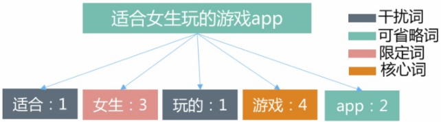
        
    - 对于**重要级别最低的term可以考虑直接丢词**，或者在索引库进行召回构造查询逻辑表达式时将对应的term用“or”逻辑放宽出现限制，至于**计算出的在query和item内容中的term重要性分值则可以用于召回时计算基础相关性**：
        
        
        
    如简单地将BM25公式中term在item及query中的词频tf(t)、qf(t)乘上各自的term权重。
    - **其中item（doc）内容侧的term重要性可以采用LDA主题模型、TextRank等方法来挖掘，至于query侧的term重要性，比较容易想到的方法就是把它视为分类或回归问题来考虑，通过训练svm、gbdt等传统机器学习模型即可进行预测**。
    - 模型样本的构造除了进行人工标注还可以通过用户的搜索点击日志来自动构造。
        - 大概做法是将某个query对应搜索结果的**用户点击频次作为同时出现在query及搜索结果title中相应term的重要性体现**
        - 首先通过共同点击信息或二部图方法对query进行聚类
        - 再将一个query对应有不同点击title以及同一term在簇内不同query中的点击title频次结果加权考虑起来
        - 同时排除掉一些搜索qv比较不置信的query及title对应的结果，最后将累计频次进行归一化及分档得到样本对应label。
    - 至于特征方面，则可以从词法、句法、语义、统计信息等多个方向进行构造，比如：term词性、长度信息、term数目、位置信息、句法依存tag、是否数字、是否英文、是否停用词、是否专名实体、是否重要行业词、embedding模长、删词差异度、前后词互信息、左右邻熵、独立检索占比（term单独作为query的qv/所有包含term的query的qv和）、iqf、文档idf、统计概率（如下公式）以及短语生成树得到term权重等。
        
        
        
        - 删词差异度：
            - 先训练得到query的embedding表示，然后计算移除各个term之后的query与原query的embedding**相似度差值**用于衡量term的重要性。
            - **如果移除某个term之后相似度差异很大，代表这个term比较重要**。
        - 短语生成树：
            - 通过从搜索session序列及搜索点击行为中挖掘出query之间的相关关系按query长度降序自顶向下进行构造得到，其中树的边和结点均有一定的权重。
            
            
            
            - 这里**假设在一定共现关系情况下越短的query越是整体意图的核心表达，所以和越下层结点连接越多的term重要性越大**，仅和较上层或根结点有连接的term重要性相对较小，
            - 通过用iqf等初始化叶子结点，然后自底向上进行结点分值计算并进行多轮迭代使得term权重相对稳定。
    - 利用深度学习模型来学习term重要性
        - 比如通过训练基于BiLSTM+Attention的query意图分类模型
        - 或基于Seq2Seq/Transformer训练的query翻译改写模型得到的attention权重副产物
        - 或上述二者的结果作为上述分类回归模型的特征也可以用于衡量term的重要性。
 - **搜索引导**
    - 搜索热词
    - 搜索历史
    - query改写
        - query纠错：负责对存在错误的query进行识别纠错（包含错误检测和错误纠正两个子任务）
            - 根据query中是否有不在词典中或本身就有错误的词语，可以将query错误类型主要分为Non-word和Real-word两类错误。
            - Non-word错误一般出现在带英文单词或数字的query中，由于通过输入法进行输入，不会存在错误中文字的情况。
            - 所以中文query如果以字作为最小语义单元的话一般只会存在Real-word错误，而带英文数字的query则可能存在两类错误。
                
                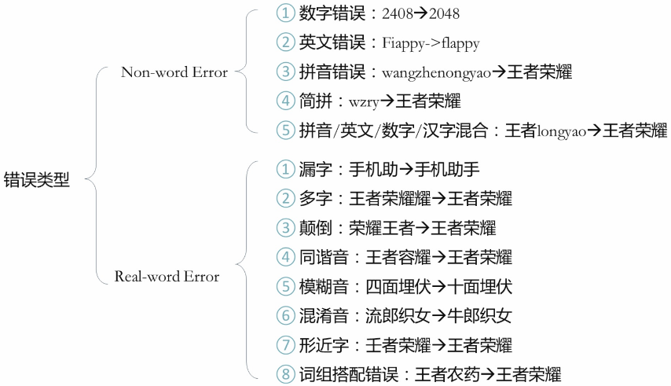
            - 错误检测
                - 方法1：对输入query进行切分后检查各个词语**是否在维护的自定义词表**或**挖掘积累的常见纠错pair中**，若不在则根据字型、字音或输入码相近字进行替换构造候选并结合ngram语言模型概率来判断其是否存在错误，这个方法未充分考虑到上下文信息，可以适用于常见中文词组搭配、英文单词错误等的检测。
                - 方法2：通过训练序列标注模型的方法来识别错误的开始和结束位置。
            - 错误纠正
                - 包括纠错候选召回、候选排序选择两个步骤
                - 在进行候选召回时，没有一种策略方法能覆盖所有的错误类型，所以一般通过采用多种策略方法进行多路候选召回，然后在多路召回的基础上通过排序模型来进行最终的候选排序。
        - query扩展：负责扩展出和源query内容或行为语义相关的query列表推荐给用户进行潜在需求挖掘发现
        - query归一：负责将偏门的query归一变换到更标准且同义的query表达
    - 搜索联想词
 - **意图识别**
    - 精准意图
    - 模糊意图
        - 意图分类
        - 槽位解析
 - **敏感query识别**
 - **时效性识别**


#### 参考文献
 - [Query理解和语义召回在知乎搜索中的应用](https://www.6aiq.com/article/1577969687897?p=1&m=0)
 - [全面理解搜索Query](https://zhuanlan.zhihu.com/p/112719984)


## 极大似然估计
**一些性质：**
 - 使用频率进行统计，进而近似得出概率或者条件概率
 - 最大似然估计等价于频率估计
 - 举例说明：
    
    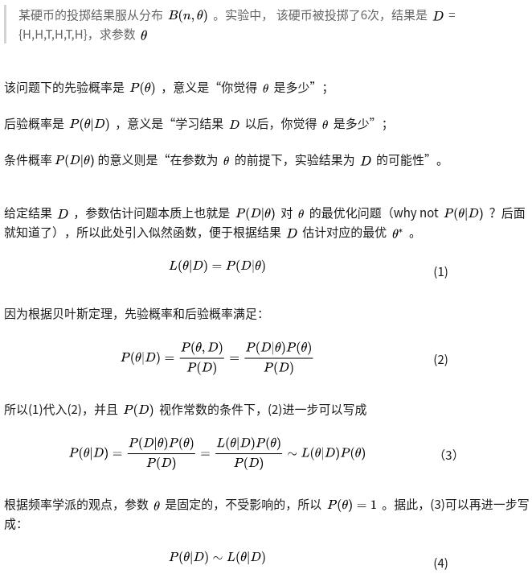
    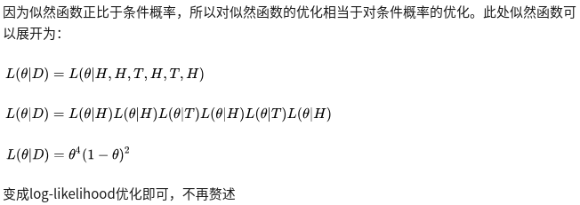
 - 因为本质是要求出参数`theta`，引入似然函数，目的是便于根据结果D估计对应的最优`theta^*`，即`L(theta|D)`，其中，`L()`是似然函数，`P()`是概率函数

**似然函数：**
 - “似然性”与“或然性”或“概率”意思相近，都是指某种事件发生的可能性，但是在统计学中，“似然性”和“概率”（或然性）又有明确的区分：**概率，用于在已知一些参数的情况下，预测接下来在观测上所得到的结果；似然性，则是用于在已知某些观测所得到的结果时，对有关事物之性质的参数进行估值**。
 - 在这种意义上，似然函数可以理解为**条件概率的逆反**。
 - 似然函数是一种关于统计模型中的**参数的函数**，表示模型参数中的似然性。
 - 在统计学上，基于某些模型的参数（粗略地说，我们可以认为**参数决定了模型**），**观测到某数据的概率称为概率；而已经观测到某数据，模型的参数取特定值的概率称为似然**。
 - 看下边的例子：
    - 可以做一个类比，假设一个函数为`a^b`，这个函数包含两个变量a和b。
    - 如果你令b=2，这样你就得到了一个关于a的二次函数，即`a^2`：
    
        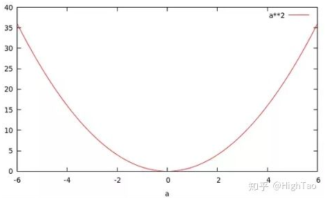
    - 当你令a=2时，你将得到一个关于b的指数函数，即`2^b`：
        
        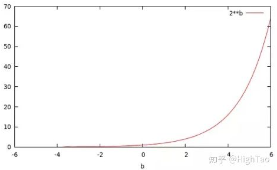
    - 可以看到这两个函数有着不同的名字，却源于同一个函数。而`p(x|θ)`也是一个有着两个变量的函数。**如果，你将θ设为常量，则你会得到一个概率函数（关于x的函数）；如果，你将x设为常量你将得到似然函数（关于θ的函数）**。
    
    ```
    有一个硬币，它有θ的概率会正面向上，有1-θ的概率反面向上。
    θ是存在的，但是你不知道它是多少。
    
    为了获得θ的值，你做了一个实验：
     - 将硬币抛10次，得到了一个正反序列：x=HHTTHTHHHH。
     - 无论θ的值是多少，这个序列的概率值为 θ⋅θ⋅(1-θ)⋅(1-θ)⋅θ⋅(1-θ)⋅θ⋅θ⋅θ⋅θ = θ⁷(1-θ)³
     - 比如，如果θ值为0，则得到这个序列的概率值为0。如果θ值为1/2，概率值为1/1024。
    
    下边这个例子：
    [概率]：拿杆秤去称个1kg的东西，可能称出各种重量，比如0.98kg、0.99kg、1.02kg等等，
    称出每种重量的概率，称为概率。
    
    [似然]：另一方面，有一个秤的出厂报告我们丢了，现在我们要通过拿这个秤去反复称1kg的东西，
    根据测出的重量的统计数据，反推这个秤的参数可能是哪些值（参数取每个值的概率），这就称为似然。
    ```
    - 但是，我们应该得到一个更大的概率值（因为目的就是在给出观察结果的情况下，求出最有可能的θ值，即求能让该式子取得最大值情况下的θ值），所以我们尝试了所有θ可取的值，画出了下图：
    
        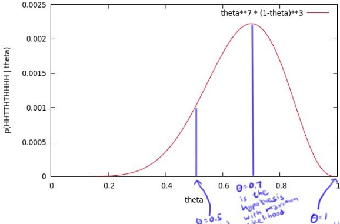
        
        - 这个曲线就是θ的似然函数。
        - 通过了解在某一假设下，已知数据发生的可能性，**来评价哪一个假设更接近θ的真实值**。
        - 如图所示，最有可能的假设是在θ=0.7的时候取到，但是0.7是一个不太可能的取值（如果你知道几乎所有的硬币都是均质的，那么这个实验并没有提供足够的证据来说服你，它是均质的）。但是，**0.7却是最大似然估计的取值**。
        - 因为这里仅仅试验了一次，得到的样本太少，所以最终求出的最大似然值偏差较大，如果经过多次试验，扩充样本空间，则最终求得的最大似然估计将接近真实值0.5。
    - 得出一个结论：**也就是说似然估计的出来的是在已知观察结果的情况下，最大的参数θ值，这个值不一定就是真实的参数值（在样本比较少的情况下）**。
    - **只要数据和参数一致的情况下，给定参数计算出观测到特定数据的概率，和给定数据，计算出特定参数的似然，值是相等的**。
    
**最大似然估计：**
 - 所谓最大似然估计，就是我们想知道**哪套参数组合对应的曲线最可能拟合我们观测到的数据**(拟合出观测数据的概率最大），即最大化拟合观测到的数据的曲线参数的似然。

    
 - 极大似然估计，通俗理解来说，**就是利用已知的样本结果信息，反推最具有可能（最大概率）导致这些样本结果出现的模型参数值**！
 - **换句话说，极大似然估计提供了一种给定观察数据来评估模型参数的方法，即：“模型已定，参数未知”**。
    
    
 - 例子1：

    ```
    假如有一个罐子，里面有黑白两种颜色的球，数目多少不知，两种颜色的比例也不知。我们想知道罐中白球和黑球的比例，但我们不能把罐中的球全部拿出来数。
    现在我们可以每次任意从已经摇匀的罐中拿一个球出来，记录球的颜色，然后把拿出来的球 再放回罐中。这个过程可以重复，我们可以用记录的球的颜色来估
    计罐中黑白球的比例。假如在前面的一百次重复记录中，有七十次是白球，请问罐中白球所占的比例最有可能是多少？
    
    很多人马上就有答案了：70%。而其后的理论支撑是什么呢？
    
    我们假设罐中白球的比例是p，那么黑球的比例就是1-p。因为每抽一个球出来，在记录颜色之后，我们把抽出的球放回了罐中并摇匀，所以每次抽出来的球的颜
    色服从同一独立分布。
    
    这里我们把一次抽出来球的颜色称为一次抽样。题目中在一百次抽样中，七十次是白球的,三十次为黑球事件的概率是P(样本结果|Model)。如果第一次抽象的
    结果记为x1,第二次抽样的结果记为x2....那么样本结果为(x1,x2.....,x100)。
    
    这样，我们可以得到如下表达式：
    P(样本结果|Model)　= P(x1,x2,…,x100|Model)
                     = P(x1|Mel)P(x2|M)…P(x100|M)
                     = p^70(1-p)^30.
    
    好的，我们已经有了观察样本结果出现的概率表达式了。那么我们要求的模型的参数，也就是求的式中的p。

    那么我们怎么来求这个p呢？
    不同的p，直接导致P（样本结果|Model）的不同，p实际上是有无数多种分布的。
    
    那么问题来了，既然有无数种分布可以选择，极大似然估计应该按照什么原则去选取这个分布呢？
    答：采取的方法是让这个样本结果出现的可能性最大，也就是使得p^70(1-p)^30值最大，
    那么我们就可以看成是p的方程，求导即可！
    
    那么既然事情已经发生了，为什么不让这个出现的结果的可能性最大呢？这也就是最大似然估计的核心。
    我们想办法让观察样本出现的概率最大，转换为数学问题就是使得
    
    未知数只有一个p，我们令其导数为0，即可求出p为70%
    ```
 - 例子2：
    
    ```
    假设我们要统计全国人民的年均收入，首先假设这个收入服从服从正态分布，但是该分布的均值与方差未知。
    我们没有人力与物力去统计全国每个人的收入。我们国家有10几亿人口呢？那么岂不是没有办法了？
    
    不不不，有了极大似然估计之后，我们可以采用嘛！我们比如选取一个城市，或者一个乡镇的人口收入，作为
    我们的观察样本结果。然后通过最大似然估计来获取上述假设中的正态分布的参数。
    
    有了参数的结果后，我们就可以知道该正态分布的期望和方差了。也就是我们通过了一个小样本的采样，
    反过来知道了全国人民年收入的一系列重要的数学指标量！
    
    那么我们就知道了极大似然估计的核心关键就是对于一些情况，样本太多，无法得出分布的参数值，可以采样
    小样本后，利用极大似然估计获取假设中分布的参数值。
    ```
 - 似然函数取得最大值表示相应的参数能够使得统计模型最为合理。从这样一个想法出发，最大似然估计的做法是：
    - 首先选取似然函数（一般是概率密度函数或概率质量函数），整理之后求最大值。
    - 实际应用中一般会取似然函数的对数作为求最大值的函数，这样求出的最大值和直接求最大值得到的结果是相同的。
    - 似然函数的最大值不一定唯一，也不一定存在。
 - 与最大后验概率（MAP）的区别：
    
    
    
    - 即似然函数是MAP的一个组成部分。
    - MAP公式中有`P(a)`这一项，即模型参数a的先验概率；这就产生一个问题：如果似然概率`P(X|a)`很大，
    这时候a是最优参数，但是先验概率`P(a)`却很小的话，MAP最后的值也会比较小，这个时候就不会选择a作为MAP最优的参数。

**参考博客：**
 - [先验概率，后验概率和似然函数简单解释](https://zhuanlan.zhihu.com/p/82565042)
 - [如何理解似然函数?](https://www.zhihu.com/question/54082000/answer/470252492)
 - [最大似然估计中的“似然”如何解释？](https://www.zhihu.com/question/281311791/answer/498859126)
 - [一文搞懂极大似然估计](https://zhuanlan.zhihu.com/p/26614750)
 - [概率与似然](https://zhuanlan.zhihu.com/p/25768606)


## 事理图谱

**事理图谱和知识图谱的关系：**
 - 如图：
    
    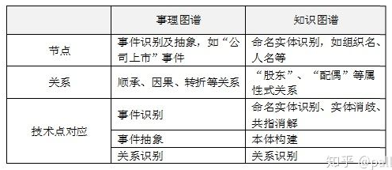
 - 事理图谱的构建与知识图谱的整体思想基本一致，简单来讲就是从海量信息里抽取节点和关系，整体过程如下图：
 
    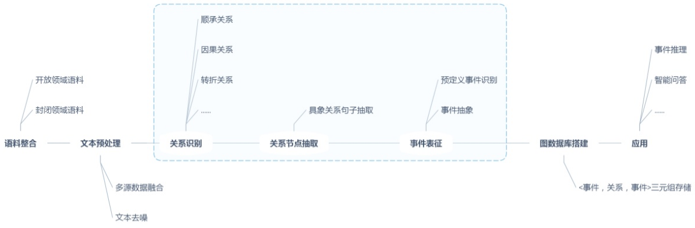


## LSTM/GRU

#### LSTM核心思想
 - 传统RNN结构：
    
    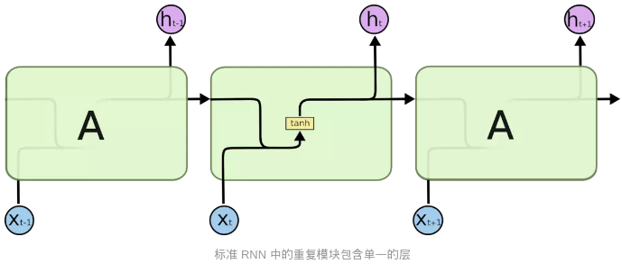
 - LSTM中的重复模块包含四个交互的层：

    
    
    粉色的圈代表按位pointwise的操作。
 - LSTM的关键就是细胞状态，水平线在图上方贯穿运行。细胞状态类似于传送带。直接在整个链上运行，只有一些少量的线性交互。信息在上面流传保持不变会很容易。
    
    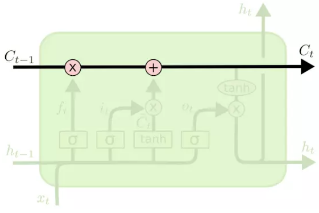
 - LSTM有通过精心设计的称作为“门”的结构来去除或者增加信息到细胞状态的能力。门是一种让信息选择式通过的方法。他们包含一个sigmoid神经网络层和一个按位的乘法操作。
    
    
    
    - Sigmoid层输出0到1之间的数值，描述每个部分有多少量可以通过。0代表“不许任何量通过”，1就指“允许任意量通过”！
    - LSTM拥有三个门，来保护和控制细胞状态。
 - **遗忘门**
    
    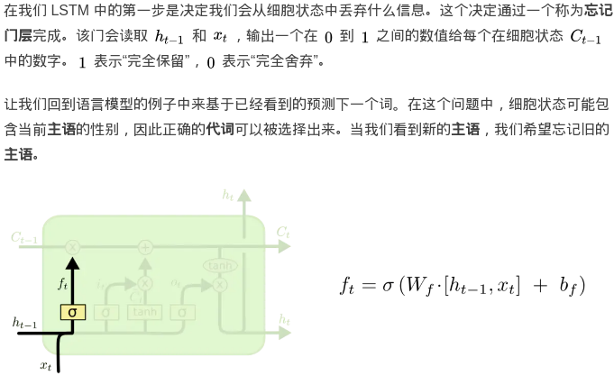
 - **输入门**
    
    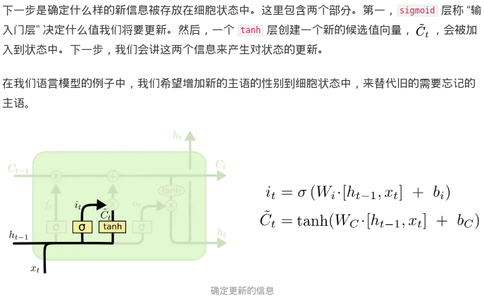
 - **更新Cell状态**
 
    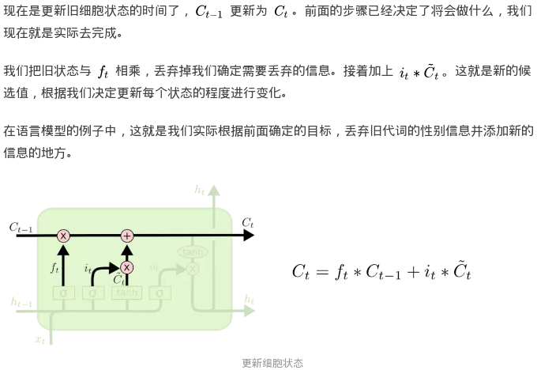
 - **输出门**
    
    


#### GRU核心思想
 - LSTM一个改动较大的变体是Gated Recurrent Unit (GRU)。
    
    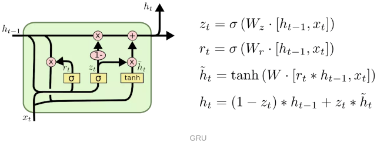
 - 选择GRU是因为它的实验效果与LSTM相似，但是更易于计算。相比LSTM，使用GRU能够达到相当的效果，并且相比之下更容易进行训练，能够很大程度上提高训练效率，因此很多时候会更倾向于使用GRU。
    
    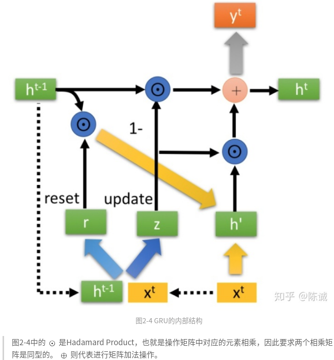
    
    - 重置门输入r和更新门输入z都是从`h^{t-1}`和`x^t`中得来。
    - **重置门的目的是记忆当前时刻的状态。**
    - **更新门用来遗忘和记忆两个步骤**。
 - **重置门r**和**更新门z**：
 
    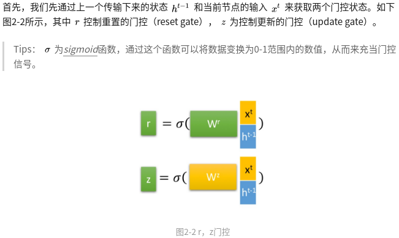
 - 重置门
 
    
    
    `h'`中保存了上一时刻的状态`h^{t-1}`和当前时刻的状态`x^t`。
 - 更新门
    
    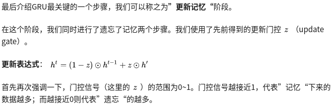
 - GRU很聪明的一点就在于，**使用了同一个门控z就同时可以进行遗忘和选择记忆（LSTM则要使用多个门控）**。
    
    


#### LSTM与GRU的关系
 - 与LSTM相比，GRU内部少了一个”门控“，参数比LSTM少，但是却也能够达到与LSTM相当的功能：
    
    


#### 参考文献
 - [理解LSTM网络](https://www.jianshu.com/p/9dc9f41f0b29)
 - [Understanding LSTM Networks](http://colah.github.io/posts/2015-08-Understanding-LSTMs/)
 - [人人都能看懂的GRU](https://zhuanlan.zhihu.com/p/32481747)


## Subword模型

#### Character-Level Model
 - 之前的Neural Machine Translation基本上都是基于word单词作为基本单位的，但是其缺点是不能很好的解决out-of-vocabulary即单词不在词汇库里的情况，且对于单词的一些词法上的修饰(morphology)处理的也不是很好。一个自然的想法就是能够利用比word更基本的组成来建立模型，以更好的解决这些问题。
 - 一种思路是将字符作为基本单元，建立Character-level model，但是由于基本单元换为字符后，相较于单词，其输入的序列更长了，使得数据更稀疏且长程的依赖关系更难学习，训练速度也会降低。
 - 利用了多层的convolution, pooling与highway layer来解决这一问题，其中encoder的结构如下图所示：
 
    
 
    - 输入的字符先被映射到character embedding。得到`字符个数×维度`的矩阵
    - 然后与窗口大小不同的卷积核进行卷积操作再将输出联结起来，例如上图中有三种窗口大小分别为3，4，5的卷积核，相当于学习了基于字符的trigram, 4-grams, 5-grams。
    - 然后对卷积的输出进行max pooling操作，相当于选择最显著的特征产生segment embedding。
    - 由此我们从最基础的输入的character embedding得到了系统中认为语言学上有意义的segment embedding。
    - 然后将这些特征经过Highway Network(有些类似于Residual network，方便深层网络中信息的流通，不过加入了一些控制信息流量的gate）和双向的GRU，这样得到最终的encoder output。
    - 之后decoder再利用Attention机制以及character level GRU进行decode。
    - 实验结果显示，基于字符的模型能更好的处理OOV的问题，而且对于多语言场景，能更好的学习各语言间通用的词素。

#### Byte Pair Encoding与SentencePiece
 - 基本单元介于字符与单词之间的模型称作Subword Model。
 - 其中最常见的一对连续字节数据被替换为该数据中不存在的字节。后期使用时需要一个替换表来重建原始数据。**OpenAI GPT-2与Facebook RoBERTa均采用此方法构建subword vector**.
 - 那么Subword如何选择呢？
    - 一种方法是Byte Pair Encoding,简称BPE。
        - BPE最早是一种压缩算法，基本思路是把经常出现的byte pair用一个新的byte来代替
        - 例如假设('A', 'B'）经常顺序出现，则用一个新的标志'AB'来代替它们。
        - 给定了文本库，我们的初始词汇库仅包含所有的单个的字符，然后**不断的将出现频率最高的n-gram pair作为新的ngram加入到词汇库中，直到词汇库的大小达到我们所设定的某个目标为止**。
            
            ```
            例如，假设我们的文本库中出现的单词及其出现次数为：
            
            文本库： {'l o w': 5, 'l o w e r': 2, 'n e w e s t': 6, 'w i d e s t': 3}，
            
            我们的初始词汇库为：
            
            词汇库： { 'l', 'o', 'w', 'e', 'r', 'n', 'w', 's', 't', 'i', 'd'}，
            
            出现频率最高的ngram pair是('e','s') 9次，所以我们将'es'作为新的词汇加入到词汇库中，
            由于'es'作为一个整体出现在词汇库中，这时文本库可表示为 {'l o w': 5, 'l o w e r': 2, 'n e w es t': 6, 'w i d es t': 3}，
            （'es'连接了起来）
            这时出现频率最高的ngram pair是('es','t') 9次，将'est'加入到词汇库中，
            文本库更新为{'l o w': 5, 'l o w e r': 2, 'n e w est': 6, 'w i d est': 3}，
            新的出现频率最高的ngram pair是('l','o')7次，将'lo'加入到词汇库中，
            文本库更新为{'lo w': 5, 'lo w e r': 2, 'n e w est': 6, 'w i d est': 3}。
            
            以此类推，直到词汇库大小达到我们所设定的目标。
            这个例子中词汇量较小，对于词汇量很大的实际情况，我们就可以通过BPE逐步建造一个较小的基于subword unit的词汇库来表示所有的词汇。
            ```
        - 具体获得子词表的步骤是：
            - 1.准备语料，分解成最小单元比如英文中26个字母加上各种符号，这些作为初始词表；
            - 2.根据语料统计出现相邻符号对的频次；
            - 3.**挑出频次最高符号对**，比如说t和h组成的th，加入词表，训练语料中所有该相邻符号对融合（merge），这里即所有t和h都变成th;
            - 4.重复2和3操作，直到词表中单词数达到设定量，比如32000。
    - 谷歌的NMT模型用了BPE的变种，称作**wordpiece model**：
        - BPE中利用了n-gram count来更新词汇库，而wordpiece model中则用了一种贪心算法来最大化语言模型概率，即选取新的n-gram时都是选择使得perplexity减少最多的ngram。
        - 进一步的，sentence piece model将词间的空白也当成一种标记，可以直接处理sentence，而不需要将其pre-tokenize成单词。
 - **BPE dropout**
    - 该方法非常简单，采取和子词正则相同思路，对BPE算法训练做了些改进，**加入了一定的随机性**。具体在每次对训练数据进行处理分词时，**设定一定概率（10%）让一些融合不通过**，于是即使是相同词，每次用BPE dropout**生成出来的子词也都不一样**。
 - 子词工具包SentencePiece、subword-nmt

#### WordPiece
 - WordPiece是谷歌内部库
 - WordPiece整体和BPE法相同，唯一不同在第2步，BPE是统计频次，而WordPiece则是获得**似然(Likelihood)，之后挑选最大似然的词对加入词表**，完成merge。
 - 如何获得似然？
    - 先将整个语料按照当前词表进行分解
    - 接着在分解后的语料上训练语言模型，对整个语料获得一个似然值。
    - 之后在已有的词表上组合词对，获得新的词表，重新训练语言模型，对整个语料获得一个似然值。
    - 对比所有词对候选，**挑选其中语言模型似然值提升最大的词对**，将其正式加入词表。
    - 不断进行此操作，直到整个词表量达到设定值。
 - 怎么组合词对？比如`t`和`h`组合成`th`。
 - 需详细解释的一点是关于训练细节，因为加入每个可能的词对都需重新训练语言模型，这样所要的计算资源会很大。作者对这块特意进行了解释，通过以下策略来降低计算量：
    - 只测试语料中出现的词对；
    - 只测试有很大可能（高优先）是最好词对的候选；
    - 同时测试几个词对，只要它们互不影响；
    - 重训语言模型（并不需要是神经网络型），只重新计算受影响的部分。


#### Unigram Language Model 
 - BPE和WordPiece都是**增量法**，即先初始化一个词表，再建立一个评估标准，每次挑最好的词对加入词表。而下来介绍的Unigram Language Model则可以当作是**减量法**。
 - 与其他方法的异同：
    - 首先它与WordPiece一样都用到**语言模型来挑选子词**，而不是像BPE统计频次
    - BPE和WordPiece都是初始化一个小词表，然后一个个增加到限定的词汇量，而Unigram Language Model却是**先初始一个大词表，接着通过语言模型评估不断减少词表**，直到限定词汇量。
 - 具体操作是：
    - 先建立一个足够大的种子词表，可以用所有字符的组合加上语料中常见的子字符串（用Enhanced Suffix Array 来枚举）。对于种子词表，也能用BPE法来生成。
    - 固定词表，用EM算法来最优化当前词表在语料上的概率；
    - 之后计算每个子词的loss，对应的loss相当于该子词有多大可能使总的loss降低；
    - 接着按照每个子词loss大小来排序，保留最大一定比例（比如说80%）的子词。
    - 不断重复2到4，直到词表量减少到限定范围。
 - 一般训练是如何融入上面的分词法？
    - 比如BPE，因为已经获得一份词表，所以在训练时，**先按照子词表将训练数据拆开，预测时也可以是预测子词而不是整词**，最后**按照BPE词表还原出整词**就行。
    - 比如说训练时先把unigram拆成uni## ##gram，这样获得结果时只需找到##符去掉就行。
 - 要用上面这些子词技巧，最简单的方法就是直接用谷歌的SentencePiece包，其中除了BPE和unigram language model法外，还支持字符和词级别分词。当然，BPE也可以用最经典的subword-nmt包。


#### Hybrid Model
 - 还有一种思路是在大多数情况下我们还是采用word level模型，而只在遇到OOV的情况才采用character level模型。
 - 其结构如下图所示：
 
    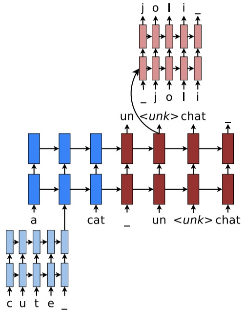
    
    - 大部分还是依赖于比较高效的word level模型，但遇到例子中的"cute"这样的OOV词汇，我们就需要建立一个character level的表示
    - decode时遇到<unk>这个表示OOV的特殊标记时，就需要character level的decode
    - 训练过程是end2end的，不过损失函数是word部分与character level部分损失函数的加权叠加。

#### FastText
 - word vector也是基于word level来建立的，对于含有很多OOV的词汇的文本效果不好，那么我们可不可以采取类似于上面的subword的思路来产生更好的word embedding呢？
 - FAIR的FastText就是利用subword将word2vec扩充，有效的构建embedding。
 - 其基本思路是将每个word表示成bag of character n-gram以及单词本身的集合
 
    ```
    例如，对于where这个单词和n=3的情况，它可以表示为：
    
    <wh,whe,her,ere,re>,<where>
    
    其中"<"和">"为代表单词开始与结束的特殊标记。
    ```
 - 假设对于word w，其n-gram集合用`G_W`表示，每个n-gram的矢量表示为`箭头z_g`，则每个单词可以表示成其所有n-gram的矢量和的形式，而center word w与context word c的
 分数就可表示成的形式，之后就可以按照经典的word2vec算法训练得到这些特征向量。
 - 这种方式既保持了word2vec计算速度快的优点，又解决了遇到training data中没见过的oov word的表示问题，可谓一举两得。


**参考博客：**
 - [CS224N笔记(十二):Subword模型](https://zhuanlan.zhihu.com/p/69414965)
 - [子词技巧：The Tricks of Subword](https://zhuanlan.zhihu.com/p/90151246)
 - [深入理解NLP Subword算法：BPE、WordPiece、ULM](https://zhuanlan.zhihu.com/p/86965595)


## 异常检测算法

参考博客：
 - [异常检测的N种方法，阿里工程师都盘出来了](https://zhuanlan.zhihu.com/p/66724210)


**概览：**
 - 从时间序列、统计、距离、线性方法、分布、树、图、行为序列、有监督机器学习和深度学习模型等多个角度探讨异常检测。
 - 异常点检测(Outlier detection)，又称为离群点检测，是找出与预期对象的行为差异较大的对象的一个检测过程。这些被检测出的对象被称为异常点或者离群点。
 - **异常检测的一大难点是缺少ground truth。常见的方法是先用无监督方法挖掘异常样本，再用有监督模型融合多个特征挖掘更多作弊**。

**常用算法：**
 - 时间序列
    - 移动平均（Moving Average，MA）：移动平均是一种分析时间序列的常用工具，它可过滤高频噪声和检测异常点。假设移动平均的时间窗口为T，时间序列y
        - 简单移动平均（Simple Moving Average,SMA）
            - 可以用历史的值的均值**（移动均值）作为当前值的预测值**
            - 在序列取值随时间波动较小的场景中，上述**移动均值与该时刻的真实值的差值**超过一定阈值则判定该时间的值异常。
            - 目的是要检测出当前的真实值是否异常，所以使用移动均值作为预测值和当前的真实值进行对比来做判断
            - 适用于：
                - a.对噪声数据进行平滑处理，即用移动均值替代当前时刻取值以过滤噪声
                - b.预测未来的取值
        - 加权移动平均（Weighted Moving Average, WMA）
            - 由于简单移动平均对窗口内所有的数据点都给予相同的权重，**对近期的最新数据不够敏感**，预测值存在滞后性。
            - 在计算移动平均时，**给近期的数据更高的权重，而给窗口内较远的数据更低的权重**，以更快的捕捉近期的变化。由此便得到了加权移动平均和指数移动平均。
            - 优缺点：
                - 加权移动平均比简单移动平均对近期的变化更加敏感
                - 加权移动平均的滞后性小于简单移动平均
                - 但由于仅采用线性权重衰减，加权移动平均仍然存在一定的滞后性。
        - 指数移动平均（Exponential Moving Average, EMA）
            - 和加权移动平均类似，但**不同之处是各数值的加权按指数递减，而非线性递减**。
            - 此外，在指数衰减中，无论往前看多远的数据，该期数据的系数都不会衰减到0，而仅仅是向0逼近。
            - 因此，指数移动平均实际上是一个无穷级数，即无论多久远的数据都会在计算当期的指数移动平均数值时，起到一定的作用，只不过离当前太远的数据的权重非常低。
            - 在实际应用中，可以按如下方法得到t时刻的指数移动平均：
                
                
            
            其中，`alpha`表示权重的衰减程度，取值在(0,1)之间，`alpha`越大，过去的观测值衰减得越快。
    - 同比和环比
        
        
        
        - 同比和环比计算公式如上图所示。
        - 适合数据呈周期性规律的场景中。
        - 如：1.监控APP的DAU的环比和同比，以及时发现DAU上涨或者下跌；2.监控实时广告点击、消耗的环比和同比，以及时发现变化。当上述比值超过一定阈值则判定出现异常。
    - 时序指标异常检测(STL+GESD)
        - TODO
 - 统计：TODO
    - 单特征且符合高斯分布
    - 多个不相关特征且均符合高斯分布
    - 多个特征相关，且符合多元高斯分布
    - 马氏距离
    - 箱线图
 - 距离
    - 基于角度的异常点检测
        
        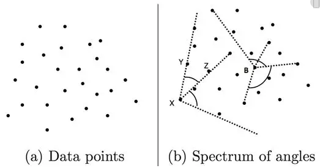
        
        - 现在有三个点X，Y，Z，和两个向量`XY、XZ`
        - 如果对任意不同的点Y，Z，角度`<XY, XZ>`变化都较小，则点X是异常点
        - 该算法的时间复杂度是`O(N^3)`，适合数据量N较小的场景。
    - 基于KNN的异常点检测
        - D是点集，则对于任意点`X属于D`，计算其K近邻的距离之和`Dist(K,X)`。
        - `Dist(K,X)`越大的点越异常。
        - 时间复杂度是`O(KN^2)`，其中N是数据量的大小。
 - 线性方法（矩阵分解和PCA降维）
    - PCA认为：最小特征值对应的特征向量往往与噪声有关（因为在协方差矩阵中，特征值表示方差大小，方差大的所含信息多，即排名靠前的主成分，**方差小的所含信息少，即无关紧要的成分，可以当作噪声点**）
    - 基于矩阵分解的异常点检测方法的主要思想是：
        - 利用主成分分析（PCA）去寻找那些违反了数据之间相关性的异常点
        - 因为方差小，证明两个样本点投影到低维空间中距离较近，这违反了样本之间应尽量保持独立性，以便保留更多信息的原则，方差小对整体的增益较少，被认为是异常点。
    - 为了找到这些异常点，基于主成分分析的算法会把数据从原始空间投影到主成分空间，然后再从主成分空间投影回原始空间。
    - 对于大多数的数据而言，如果只使用第一主成分来进行投影和重构，重构之后的误差是较小的；
    - 但是对于异常点而言，重构之后的误差相对较大。这是因为**第一主成分反映了正常点的方差，最后一个主成分反映了异常点的方差**。
    - **特征向量所对应的特征值反映了这批数据在这个方向上的拉伸程度**。
    - 通常情况下，将特征值矩阵D中的特征值从大到小的排序，特征向量矩阵P的每一列也进行相应的调整。
    - 矩阵变换示意图：
        
        
    - 定义数据`X_i = [x_{i1},...,x_{ip}]`的异常值的得分权重为：
    
        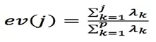
        
        - 其中`ev(j)`表示的是top-j（即前j个）主成分占所有主成分的比例，特征值是按照从大到小的顺序排列的。
        - 因此`ev(j)`是递增的，这就意味着j越大，越多的方差就会被算到`ev(j)`中，因为是从1到j的求和。
        - 在这个定义下，方差最大的第一个主成分获得最小的异常权重（因为是递增的开始），方差最小的最后一个主成分获得了最大的异常权重1。
        - 根据PCA的性质，异常点在最后一个主成分上有着较大的方差，因此会有更大的异常分。
 - 分布
    - 即对比基准流量和待检测流量的某个特征的分布。
    - 有以下方法：
        - 相对熵（KL散度）
            - 相对熵（KL散度）可以衡量两个随机分布之间的距离，当两个随机分布相同时，它们的相对熵为零，当两个随机分布的差别增大时，它们的相对熵也会增大。
            - 所以相对熵可以用于比较两个分布的相似度。
        - 卡方检验
 - 基于聚类的方法
    - 判断该数据点是否属于某个簇，如果不属于任何簇，则认为是异常值（可用DBSCAN）
    - 计算该数据点与最近的簇之间的距离，如果距离很远，则认为是异常值（可用k-means）
    - 判断该数据点是否是小簇或者稀疏簇的一部分，如果是，则该簇中的所有点都是异常值（可用FindCBLOF）。
 - 树（孤立森林）
    - 孤立森林（Isolation Forest）假设我们用一个随机超平面来切割数据空间, 每切一次便可以生成两个子空间。
    - 接着继续用一个随机超平面来切割每个子空间，循环下去，直到每个子空间里面只有一个数据点为止。
    - 那些密度很高的簇是需要被切很多次才能让子空间中只有一个数据点，但是那些**密度很低的点的子空间则很快就被切割成只有一个数据点**。
    - 如下图所示，黑色的点是异常点，被切几次就停到一个子空间；白色点为正常点，白色点聚焦在一个簇中。孤立森林检测到的异常边界为下图中红色线条，它能正确地检测到所有黑色异常点。
    
        
    - 如下图所示，用iForest切割4个数据，b和c的高度为3，a的高度为2，d的高度为1，**d最先被孤立，它最有可能异常**。
    
        
 - 图
    - 最大连通图
    - 标签传播聚类
 - 行为序列（马尔科夫链）
 - 有监督模型
    - 上述方法都是无监督方法，实现和理解相对简单。
    - 但是由于部分方法每次使用较少的特征，为了全方位拦截作弊，需要维护较多策略；
    - 另外上述部分方法组合多特征的效果取决于人工经验。
    - 而有监督模型能自动组合较多特征，具备更强的泛化能力。
    - 具体思路：
        - 机器学习模型GBDT
            - 样本：使用前面的无监督方法挖掘的作弊样本作为训练样本。
            - 如果作弊样本仍然较少，用SMOTE或者GAN生成作弊样本。
            - 然后训练GBDT模型，用转化数据评估模型的效果。
            - 总结来说就是**先用无监督进行过滤，获得被过滤掉的那些样本，然后进行SMOTE过采样，最后使用GBDT进行训练**。
        - 深度学习模型Wide&Deep

**其他问题：**
 - 上述各种方法都需要计算异常阈值，可以用下述思路先选阈值，再用转化数据验证该阈值的合理性。常用选择阈值的思路：
    - a.无监督方法：使用分位点定阈值、找历史数据的分布曲线的拐点；
    - b.有监督模型：看验证集的准召曲线
 - 非高斯分布转高斯分布
    - 有些特征不符合高斯分布，那么可以通过一些函数变换使其符合高斯分布，以便于使用上述统计方法。


