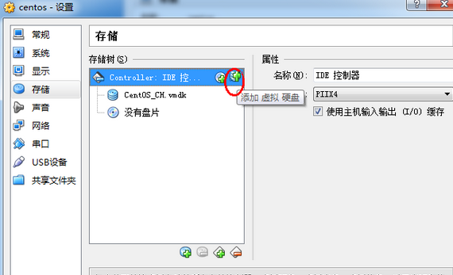

## 添加原有分区的容量，或者添加新分区

参考[博客1](http://www.cnblogs.com/juandx/p/5618162.html), [博客2](http://www.cnitblog.com/xijia0524/archive/2014/09/05/89738.html)（博客1问题解决）

添加一块新的硬盘，然后将其添加到一个新的分区或者一个已有的分区，比如增加根分区的大小, 在virtualbox中添加的硬盘也可以这样



#### 添加新分区

```
fdisk -l
```

可以看到新的硬盘 `/dev/sdb`

```
fdisk /dev/sdb
```

> 输入m查看提示  
> 输入n添加分区  
> 输入1新建一个分区  
> 然后默认回车2次创建成功(有人说第二次按w保存，但是我直接回车好像也没问题)

格式化分区

```
mkfs -t xfs  /dev/sdb
```

新建一个自己想要挂载的目录

```
mkdir /opt/data/data1
```

然后

```
mount -t xfs /dev/sdb /opt/data/data1
```

df -lhT可以看到信息

#### 添加新硬盘到新的分区(xfs/ext4)

```
fdisk -l
```

可以看到新的硬盘 `/dev/sdb`

```
fdisk /dev/sdb
```

> 输入m查看提示  
> 输入n添加分区  
> 输入p选择primary  
> 输入1新建一个分区  
> 然后默认回车2次创建成功(有人说第二次按w保存，但是我直接回车好像也没问题额)

格式化分区

```
mkfs -t xfs  /dev/sdb
```

* 查看pv(物理卷)

```
pvdisplay
```

* 创建pv

```
pvcreate /dev/sdb 
```

```
pvdisplay
```

* 查看vg(卷组)

```
vgdisplay
```

* 增加卷组

```
vgextend centos /dev/sdb
```

* 查看lv(卷组)

```
lvdisplay
```

* 查看卷组

```
vgdisplay
```

* 查看逻辑卷

```
lvdisplay
```

* 增加物理卷到根目录，可以看到根目录是在 `/dev/centos/root`

```
lvextend -L +20.81G /dev/centos/root
```

* 现在还没有增加，因为还没有更新

```
df -h
```

* 如果不xfs用resize2fs更新，但是xfs需要用xfs_growfs

```
resize2fs /dev/centos/root
```

```
df -h
```

```
xfs_growfs /dev/centos/root
```

现在看就可以了

```
df -h
```

然后重启虚拟机即可！

> 在上边的命令行中可能出现下列问题：  
> 
> ```
> pvcreate提示：Device /dev/sdb not found (or ignored by filtering)  
> pvcreate提示：Device /dev/sdb not found (or ignored by filtering)
> ```
> 
> 机器有多块硬盘，想通过LVM来管理这些磁盘，于是按照LVM的手册开始创建LVM，但是在创建物理卷的时候就出错了：
> 
> 执行 `pvcreate /dev/sdb`  
> 输出 `Device /dev/sdb not found (or ignored by filtering).`  
> 通过相关提示，查看/etc/lvm/lvm.conf，并没有filter任何磁盘。  
> 最后参考[博客3](http://idolinux.blogspot.com/2008/10/perc-raid-and-efi-gpt-wierdness.html)得到答案
> 
> 执行：
> 
> ```
> dd if=/dev/urandom of=/dev/sdb bs=512 count=64
> pvcreate /dev/sdb
> ```
