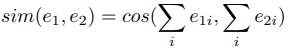
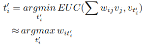

**A Robust Adversarial Training Approach to Machine Reading Comprehension**
 - 一种提升阅读理解模型鲁棒性的对抗训练方法，[pdf](https://h5.clewm.net/?url=qr61.cn/o5dpyY/q4KDGPM)
 - Motivation：
    - 之前为训练集添加对抗样本是通过基于规则的方式
    - 缺点是对抗样本的类型是不计其数的，不可能一一列举
 - 基本思路：
    - 给定一个在原始语料训练好的MRC模型
    - 本文的方法基于当前的模型的参数来动态生成对抗样本
    - 通过生成的样本来进一步迭代的训练MRC模型
    - 该方式不需要事先知道任何对抗类型
 - 该模型分为一下三步：
    - （1）把MRC模型当做一个黑盒，为每一个原始sample获取一个扰动的word embedding序列，该序列可能导致MRC给出错误的预测
    - （2）从每一个扰动的序列中采样一个word序列，该序列作为误导的文本，插入到原始的sample中去创建一个对抗sample
    - （3）使用原始样本和第二步生成的扰动的样本，重新训练MRC模型，然后用重新训练好的模型重复第一步，直到模型收敛
 - 经过上述过程，希望得到一个通用的对抗模型，而不是特定类型攻击样本的对抗模型
 - 之前的增加模型鲁棒性的方法：
    - 数据增强：
        - [Jia and Liang 2017]() 设计了一些不同类型的对抗样本
        - 为了抵御那些类型的对抗样本，[Wang and Bansal 2018]() 基于规则自动创建额外的训练样本来丰富训练数据
    - 模型改进：
        - [Salant and Berant 2018]() 通过预训练语言模型的embedding作为输入，为了收集丰富的上下文语境信息
        - [Min et al. 2018]() 提出了一个句子选择器去选择最小的句子集合，为了将来的预测，以便避免许多干扰
        - [Liu et al. 2018]() 设计了一个输出层去平均多个预测，来改善模型鲁棒性
        - [Hu et al. 2018b]() 基于模型蒸馏的训练方法训练集成模型，来训练鲁棒的单模型
    - 对抗方法：
        - [Behjati et al. 2019]() 通过一个干扰的embedding试图干扰文本分类
        - [Iyyer et al. 2018)]() 提出了一个依存句法控制解释网络来生成语法对抗样本
        - [Gong et al. 2018]()和[Sato et al. 2018]() 通过训练干扰的embedding和搜索最近的tokens来生成误导文本
        - [Jia and Liang 2017]()和[Alzantot et al. 2018]() 通过在文本迭代中替换tokens直到得到一个成功的攻击来自动生成误导文本
 - 作者改进了上述方式：
    - 数据增强：寻求一种通用的方式来生成各种类型的对抗样本
    - 模型改进：没改动，基本可应用在所有可导的模型
    - 对抗方法：更通用的对抗样本生成方法
 - 对抗训练方法：
    - 和GAN类似，本文的对抗训练方法在做一个‘最小-最大’的游戏分别在对抗样本生成器和MRC模型之间
    - 训练过程如下：
        - 1.在训练干扰向量（perturbation embedding）序列时，固定阅读理解模型参数（已经训练好的，作为对抗生成器），以最小化当前模型正确预测概率为目标（正常情况下应该最大化该概率，给定问题和篇章来预测答案）
        - 2.使用贪婪算法，从perturbation embedding中采样word序列作为误导文本来创建和丰富对抗样本集合
        - 3.训练MRC模型，最大化预测概率（最大化真实答案的概率）来抵御那些对抗样本。然后用该重新训练的模型返回第一步作为新的生成器直至收敛
    - 为了全覆盖对抗样本的类型，本模型试着生成两种类型的误导文本Misleading texts：
        - 1.Misleading answer texts：misleading texts试着说服MRC模型，正确答案在该文本中
        - 2.Misleading context texts：misleading texts作为context，试着引导MRC模型从正确答案转移注意到错误的答案
    - 本文的方法也试图控制误导性文本是相似的或不同的问题，而大多数已知的误导性文本主要是与问题相关的
 - MRC模型定义忽略，目标是求开始位置和结束位置的最大概率分别所在的位置
 - 扰动向量训练（Perturbation Embedding Training）
    - 目的是在目标模型的监督下，为每一个实例训练一个扰动embedding序列
    - 在训练过程中，把模型当作一个生成器，所有的模型参数都是固定的
    - 训练模型用一个额外的扰动embedding序列去扰动每一个输入passage
    - 对每一个训练实例，首先插入一个连续的扰动embedding序列`e'`到passage的embedding序列`e_p`，采用串联操作，因此passage的embedding序列变成：
        
        
    - 为了后续采样的方便性，需要限制`e'`的搜索空间，`e'`是词汇表embedding的权重和
        
        
    - 其中`w属于R^{l×|V|}`作为`e'`的权重矩阵，`e'`的长度为l，`w_i属于R^{|V|}`是`e'`的权重向量
    
        
    - 为了让权重向量`w_i`在词汇表空间中标准化，定义`w_{ij}`作为可训练参数`a属于R^{l×|V|}`的softmax结果
    - 也就是说，对于每个实例，训练一个扰动embedding序列就是找到一个合适的权重矩阵`w`的分布
    - 生成misleading answer texts：
        - 为了干扰MRC模型，设计一个交叉熵损失函数，目的是欺骗MRC模型使得模型相信答案位于扰动向量`e'`中：
            
            
            
            其中是一个位于扰动向量序列中的一个扰动答案
    - 生成misleading context texts：
        - 设计一个损失函数，最小化模型在ground truth span 上的估计，目的是为了扰动MRC模型
        
            
    - 训练损失函数如下：
        
        
        
    - 其中`R_s`是正则化项，是一个相似度的正则化，为了控制然动向量（ perturbation embeddings）和question & answers之间的相似度
    
        
    - `e_a`表示答案句子的embedding序列，`sim(·,·)`表示BOW余弦函数：
        
        
    - 训练模型训练一个被w定义的扰动向量`e'`，最小化损失L，E‘就是目标扰动向量序列
        
        
 - 模型框架如下：
 
    
 
    - 给定的扰动span `s_d`和ground truth `s_g`是监督信号
    - 重复训练直到收敛或者L低于阈值，返回权重矩阵w供后续采样
 - 贪婪采样
    - 对`E'`的每一个位置进行贪婪采样，使用欧式距离进行计算
    - 即计算`e'_i = sum (w_{ij} v_j)`与词汇表中哪个词距离最近
    - 使用贪婪采样，简化地取具有最大权重的token
        
        
    - 因此，对于每一个实例，生成一个misleading text就是采样一个具有最大权重的token序列`A=t'_1t'_2...t'_l`，从训练好的w
 - 使用对抗样本丰富后的数据集来重新训练模型
 - 训练策略：
    
    
    
    - 每一次迭代，对抗训练都从全部训练数据集中随机采样一个子数据集进行训练
    - 对于perturbation embedding training process，使用给定的模型参数（训练好的）来训练权重矩阵w，并收集它的平均训练损失
    - 进行贪婪采样得到A，并将其插入到passage中得到（或创建）对抗样本
    - 使用上一步得到的丰富后的训练集重新训练模型
    - 训练同志的条件是损失小雨阈值或者到达T

**Deep contextualized word representations**
 - 即ELMo (Embeddings from Language Models)，词向量是一个深度双向语言模型（BiLM）的内部状态的函数，在大规模的语料上进行预训练
 - ELMo的表示是深层次的，所有

