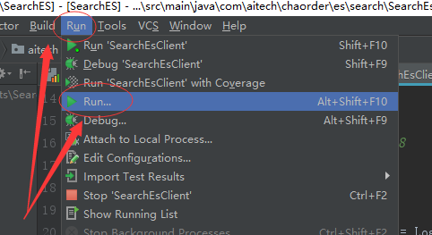
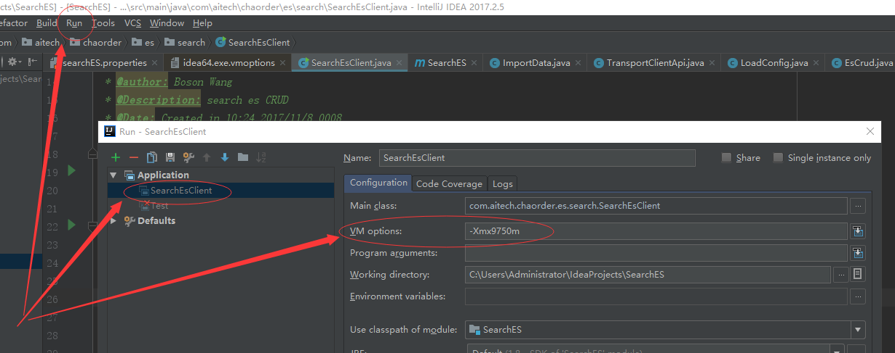
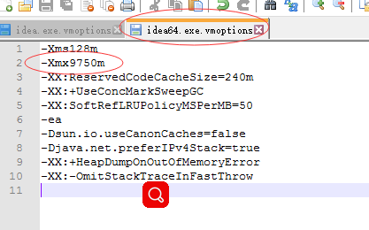
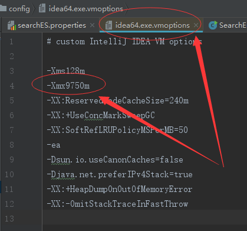

## Java读取大文件时，JVM报错

错误信息如下

```
java.lang.OutOfMemoryError: Java heap space
```

解决方法：

> 本机windows10配置

```
run-->run...-->edit configurations --> vim options -Xmx1024m（或者更大）
```





idea的配置文件：





虚拟机配置, 将 `/usr/share/elasticsearch/config/jvm.options` 配置，一般配置-Xmx为内存的一半，-Xms一样，内存的另外一半会被lucene占用！！！
