## 基本概念

* 借助Maven可以将项目拆分成多个工程
* 有一个jar包的仓库，所有的项目共同引用其中的jar包，不需要重复下载
* 在下载jar包的时候可以把所依赖的jar包也下载下来
* 在开发过程中，所有的路径或者配置文件中配置的类路径等都是以便以结果的目录结构为标准的
* Maven的核心概念：

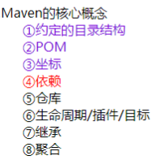

* Maven的目录结构：

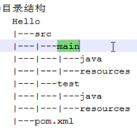

各个目录的解释如下：

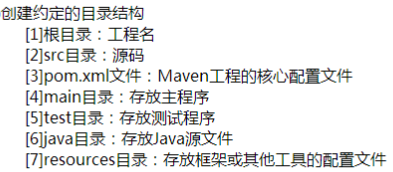

* 常用的Maven命令：

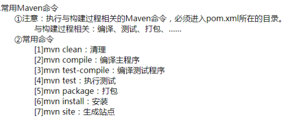

* target目录下存放编译或者打包之后的文件
* POM的含义：Project Object Model项目对象模型
* 在Eclipse中使用Maven：（前提是，eclipse之前安装过maven的插件？）
   * 设置1：installations
   * 设置2：user settings

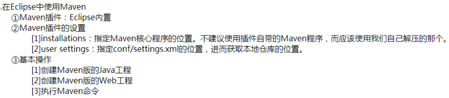

按照下边过程把下载的apache-maven-3.5.0-bin.zip文件加到eclipse的路径中来：

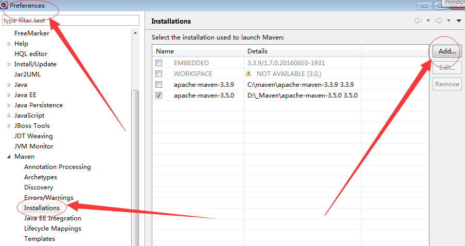

在Maven的conf目录下设置settings.xml文件，修改本地仓库的位置：

`<localRepository>D:\_Maven\Repository</localRepository>`

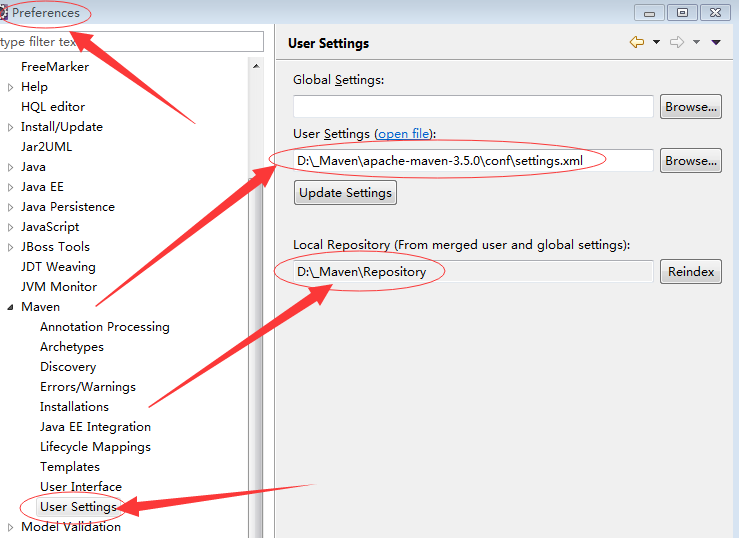

* 在eclipse右键新建工程的时候可能右键菜单没有maven相关的新建选项，下列步骤添加：

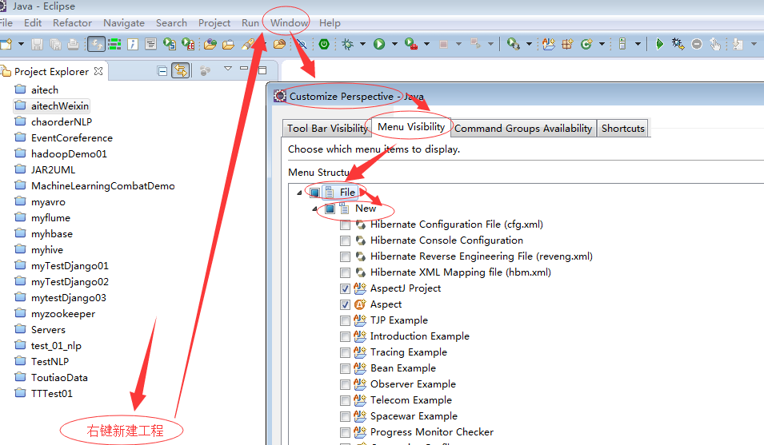

然后，进行下列操作：（新建简单的maven工程）

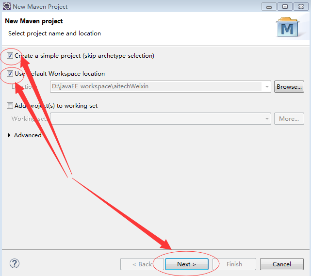

然后，进行下边配置：（下边这是建立普通的java工程的步骤，不含web工程）
其实就是坐标（在仓库中唯一标识项目的，和该项目的路径有关）的配置

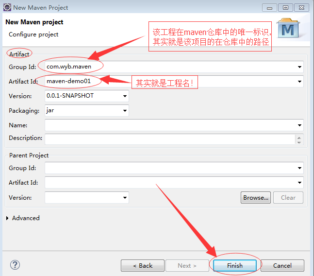

当工程创建完成如下：

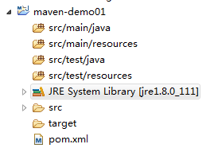

发现jdk的版本是1.5，需要右键——build path——config...
然后移除1.5版本的那个jdk，添加自己的1.8版本的jdk，然后 

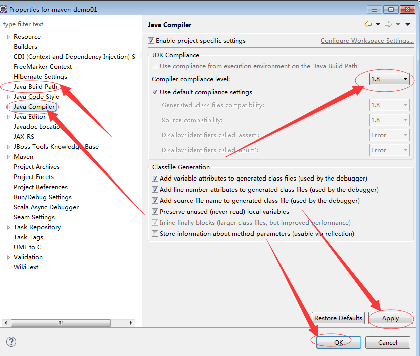
