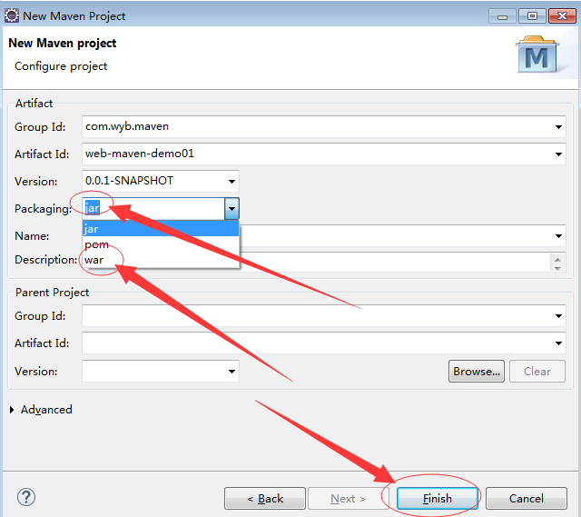
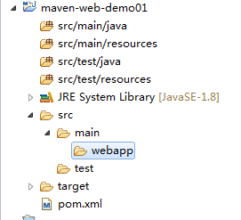
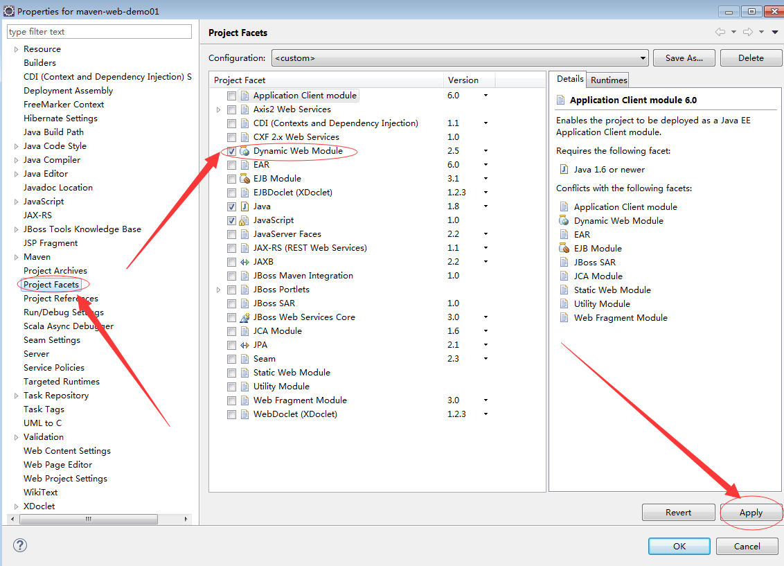
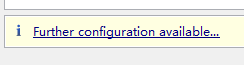
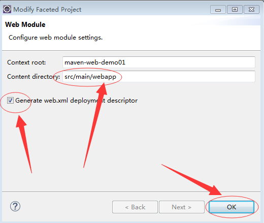
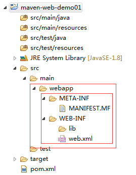
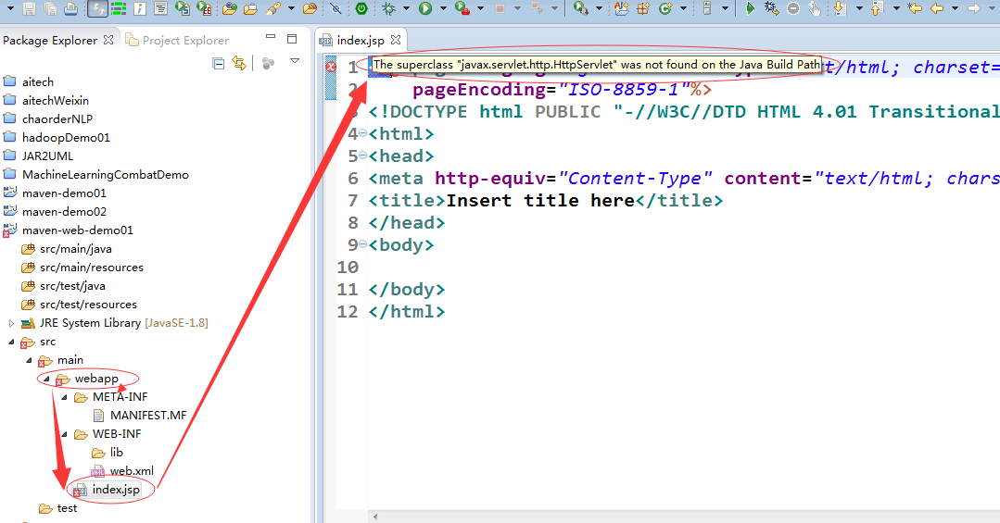
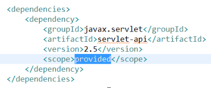

## 创建web工程

* 在创建的时候选择打包为war包，

* 进行调整
这时创建好的工程的webapp文件夹下边还没东西：

右键工程properties——Project Facets，

在右边出现的勾选选项中，把Dynamic Web Module前边的勾去掉，然后点击apply按钮，然后再重新勾选，这时在下边会出现下图所示选项：

点击上边的选项进行配置，配置如下：
将Content directory的值改为src/main/webapp，然后勾选生成web.xml文件，点击确定

这时在webapp文件夹下边会出现下列所示的文件：

* 新建JSP文件，会出现下边错误：

> 提示：The superclass "javax.servlet.http.HttpServlet" was not found on the Java Build Path
> 
> 有两种方法解决：
> * 方法1：将tomcat加入到工程中来
> * 方法2：在pom.xml中加入依赖，如下图所示

